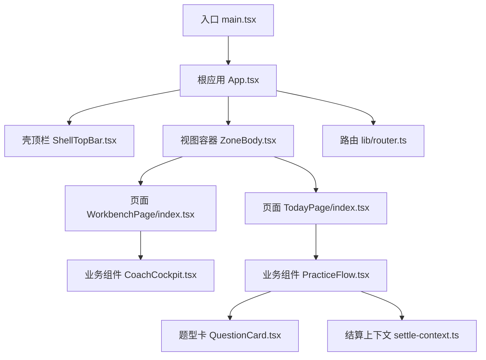
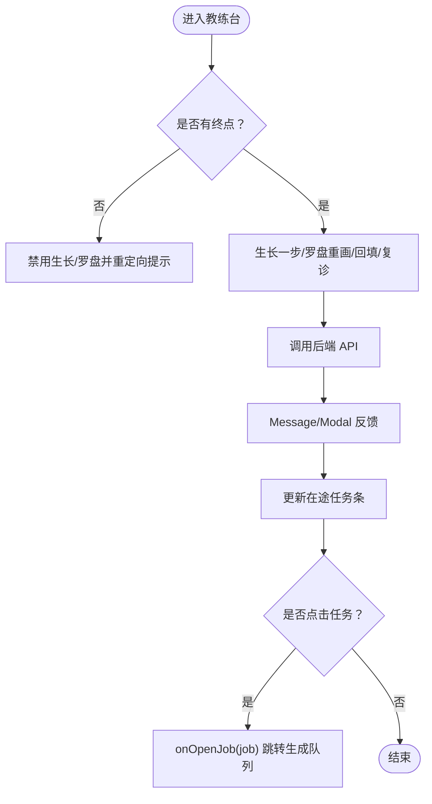
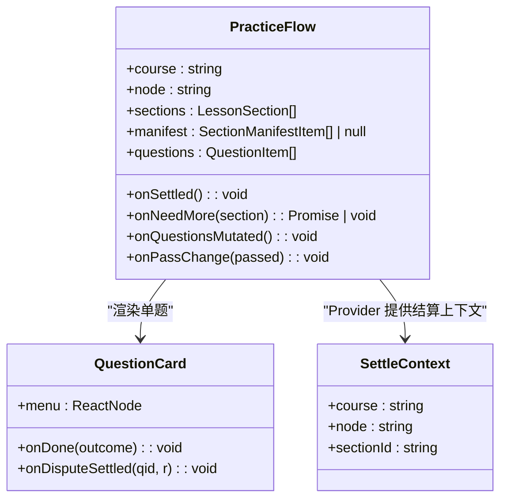
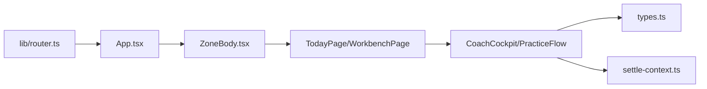

# 组件层次结构

<cite>
**本文引用的文件**
- [App.tsx](file://ui/src/App.tsx)
- [main.tsx](file://ui/src/main.tsx)
- [ShellTopBar.tsx](file://ui/src/components/ShellTopBar.tsx)
- [ZoneBody.tsx](file://ui/src/components/ZoneBody.tsx)
- [router.ts](file://ui/src/lib/router.ts)
- [CoachCockpit.tsx](file://ui/src/components/CoachCockpit.tsx)
- [PracticeFlow.tsx](file://ui/src/components/PracticeFlow.tsx)
- [QuestionCard.tsx](file://ui/src/components/QuestionCard.tsx)
- [WorkbenchPage/index.tsx](file://ui/src/pages/WorkbenchPage/index.tsx)
- [TodayPage/index.tsx](file://ui/src/pages/TodayPage/index.tsx)
- [settle-context.ts](file://ui/src/lib/settle-context.ts)
- [types.ts](file://ui/src/types.ts)
</cite>

## 目录
1. [简介](#简介)
2. [项目结构](#项目结构)
3. [核心组件](#核心组件)
4. [架构总览](#架构总览)
5. [详细组件分析](#详细组件分析)
6. [依赖关系分析](#依赖关系分析)
7. [性能考量](#性能考量)
8. [故障排查指南](#故障排查指南)
9. [结论](#结论)
10. [附录：命名规范与目录组织最佳实践](#附录：命名规范与目录组织最佳实践)

## 简介
本文件面向 LearnHub 前端，系统化梳理三层组件架构：通用组件层（基础 UI 元素）、业务组件层（学习功能封装）与页面组件层（路由页面组织）。重点说明每层职责边界、依赖关系与复用策略；阐述组件通信机制（props 向下传递、事件向上冒泡、状态提升模式）；并以 CoachCockpit、PracticeFlow 等典型业务组件为例，给出设计思路与实践要点。同时总结组件命名规范、文件组织与目录结构最佳实践，帮助团队在演进中保持可维护性与一致性。

## 项目结构
LearnHub 前端采用 React + Arco Design 的模块化组织方式，入口位于 ui/src/main.tsx，根应用 App.tsx 负责全局状态、主题与路由桥接；ui/src/components 存放通用与业务组件；ui/src/pages 按“区/视图”划分页面；ui/src/lib 提供路由、规则、上下文等横切能力。



图表来源
- [main.tsx:1-16](file://ui/src/main.tsx#L1-L16)
- [App.tsx:47-179](file://ui/src/App.tsx#L47-L179)
- [ShellTopBar.tsx:19-63](file://ui/src/components/ShellTopBar.tsx#L19-L63)
- [ZoneBody.tsx:21-42](file://ui/src/components/ZoneBody.tsx#L21-L42)
- [router.ts:1-164](file://ui/src/lib/router.ts#L1-L164)
- [WorkbenchPage/index.tsx:33-84](file://ui/src/pages/WorkbenchPage/index.tsx#L33-L84)
- [TodayPage/index.tsx:36-286](file://ui/src/pages/TodayPage/index.tsx#L36-L286)
- [CoachCockpit.tsx:142-252](file://ui/src/components/CoachCockpit.tsx#L142-L252)
- [PracticeFlow.tsx:58-461](file://ui/src/components/PracticeFlow.tsx#L58-L461)
- [QuestionCard.tsx:110-200](file://ui/src/components/QuestionCard.tsx#L110-L200)
- [settle-context.ts:1-9](file://ui/src/lib/settle-context.ts#L1-L9)

章节来源
- [main.tsx:1-16](file://ui/src/main.tsx#L1-L16)
- [App.tsx:47-179](file://ui/src/App.tsx#L47-L179)
- [ZoneBody.tsx:21-42](file://ui/src/components/ZoneBody.tsx#L21-L42)
- [router.ts:1-164](file://ui/src/lib/router.ts#L1-L164)

## 核心组件
- 根应用 App.tsx：集中管理全局共享态（课程树、当前课程、学习视图定位、任务聚焦），统一加载、错误处理、主题切换与路由同步；通过 ZoneBody 渲染当前视图并注入 frame 上下文。
- 壳顶栏 ShellTopBar.tsx：五区页签与课程区子导航，驱动区/子路由切换与主题切换。
- 视图容器 ZoneBody.tsx：基于 visited 集合实现“视图保活”，将不同 ViewKey 映射到对应页面，隐藏时保留内部状态。
- 路由 lib/router.ts：定义区键、视图键、工作台参数段路由，提供解析、跳转、规范化与订阅能力，是导航权威。
- 类型 types.ts：统一导出引擎视图与宿主返回类型，避免手工镜像，保证前后端契约一致。

章节来源
- [App.tsx:17-38](file://ui/src/App.tsx#L17-L38)
- [App.tsx:47-179](file://ui/src/App.tsx#L47-L179)
- [ShellTopBar.tsx:19-63](file://ui/src/components/ShellTopBar.tsx#L19-L63)
- [ZoneBody.tsx:21-42](file://ui/src/components/ZoneBody.tsx#L21-L42)
- [router.ts:24-164](file://ui/src/lib/router.ts#L24-L164)
- [types.ts:1-93](file://ui/src/types.ts#L1-L93)

## 架构总览
三层架构与数据流如下：
- 通用组件层：ShellTopBar、MdView、QuestionCard 等基础 UI 与交互控件，无业务耦合，仅接收 props 与回调。
- 业务组件层：CoachCockpit、PracticeFlow 等封装学习流程，组合通用组件，管理会话级状态，调用 api 并通过事件/回调向上传递结果。
- 页面组件层：TodayPage、WorkbenchPage 等按路由组织业务组件，承担数据聚合、轮询与跨组件协调。

```mermaid
sequenceDiagram
participant U as "用户"
participant R as "路由 router.ts"
participant A as "根应用 App.tsx"
participant Z as "视图容器 ZoneBody.tsx"
participant P as "页面 TodayPage/WorkbenchPage"
participant B as "业务组件 CoachCockpit/PracticeFlow"
participant S as "API 层"
U->>R : 修改 hash / 前进后退
R-->>A : onRouteChange(view)
A->>A : setView(view); syncHash(view)
A->>Z : 传入 view/courseId/frame
Z->>P : 渲染对应页面
P->>B : 传入 propscourse/node/sections 等
B->>S : 发起请求/命令
S-->>B : 返回数据/事件
B-->>P : 通过回调/事件上报onSettled/onPassChange 等
P-->>A : 必要时触发 frame.goto/openCourse
A-->>R : navigate/navigateCourse
```

图表来源
- [router.ts:106-164](file://ui/src/lib/router.ts#L106-L164)
- [App.tsx:47-179](file://ui/src/App.tsx#L47-L179)
- [ZoneBody.tsx:21-42](file://ui/src/components/ZoneBody.tsx#L21-L42)
- [TodayPage/index.tsx:36-286](file://ui/src/pages/TodayPage/index.tsx#L36-L286)
- [WorkbenchPage/index.tsx:33-84](file://ui/src/pages/WorkbenchPage/index.tsx#L33-L84)
- [CoachCockpit.tsx:142-252](file://ui/src/components/CoachCockpit.tsx#L142-L252)
- [PracticeFlow.tsx:58-461](file://ui/src/components/PracticeFlow.tsx#L58-L461)

## 详细组件分析

### 教练台 CoachCockpit（业务组件）
职责边界
- 课程生长、罗盘重画、回填、复诊结算等图域操作入口。
- 展示就绪深度、在途任务条，点击跳转生成队列。
- 与页面协作：由 WorkbenchPage 或 TodayPage 等页面传入 course/jobs/coach，组件只负责动作与反馈。

通信机制
- 输入：course、jobs、coach、endpointCount、onOpenJob。
- 输出：通过 onOpenJob 将任务项上抛至页面进行导航；内部使用 Message/Modal 提示。
- 副作用：调用 api.coachGrowth/compassPaint/encBackfill/probationSettle 等。



图表来源
- [CoachCockpit.tsx:142-252](file://ui/src/components/CoachCockpit.tsx#L142-L252)

章节来源
- [CoachCockpit.tsx:1-253](file://ui/src/components/CoachCockpit.tsx#L1-L253)

### 练习流 PracticeFlow（业务组件）
职责边界
- 节序列驱动的 mastery 练习会话：读节→做题→交互节→过关判定。
- 维护会话内状态：轮次、题号、连对、已答题集、申诉作废、最大到达步数等。
- 与页面协作：通过 onSettled、onNeedMore、onQuestionsMutated、onPassChange 与父页面通信。

通信机制
- 输入：course、node、sections、manifest、questions、quizPending、quizSoftCap 等。
- 输出：
  - onSettled：作答后通知父级刷新统计。
  - onNeedMore：为当前节请求 AI 补题。
  - onQuestionsMutated：题目变更（编辑/归档/重生成）后刷新。
  - onPassChange：全部节过关时通知父级放行“完成学习”。
- 上下文：通过 SettleContext 为交互件提供结算所需信息。



图表来源
- [PracticeFlow.tsx:58-461](file://ui/src/components/PracticeFlow.tsx#L58-L461)
- [QuestionCard.tsx:110-200](file://ui/src/components/QuestionCard.tsx#L110-L200)
- [settle-context.ts:1-9](file://ui/src/lib/settle-context.ts#L1-L9)

章节来源
- [PracticeFlow.tsx:1-462](file://ui/src/components/PracticeFlow.tsx#L1-L462)
- [QuestionCard.tsx:1-200](file://ui/src/components/QuestionCard.tsx#L1-L200)
- [settle-context.ts:1-9](file://ui/src/lib/settle-context.ts#L1-L9)

### 题型卡 QuestionCard（通用/业务交叉）
职责边界
- 支持多种题型的作答、判卷、计时、XP 结算、复习变体、JOL 预测、申诉等。
- 作为 PracticeFlow 与 ReviewSession 的通用单元，对外暴露 onDone、submitter、onForget、footer、menu、onEscape、onDisputeSettled 等接口。

通信机制
- 输入：question、variant、jolAsk、calibrationHint、submitter、onForget、footer、menu、onEscape、onDisputeSettled。
- 输出：onDone 携带 AnswerOutcome；onDisputeSettled 回传申诉结算结果以恢复会话判罚。

章节来源
- [QuestionCard.tsx:1-200](file://ui/src/components/QuestionCard.tsx#L1-L200)

### 页面组件：今日 TodayPage（页面层）
职责边界
- 聚合推荐流、复习队列、供给快照、待审提案数；管理二级视图（节点学习、复习会话）。
- 通过 usePolling 轮询生成状态与提案列表，驱动推荐卡进度与供给卡片动作。

通信机制
- 与框架：frame.openLesson/goto/reload 控制导航与刷新。
- 与业务组件：LessonView、ReviewSession 通过回调完成会话结算与刷新。

章节来源
- [TodayPage/index.tsx:1-287](file://ui/src/pages/TodayPage/index.tsx#L1-L287)

### 页面组件：工作区 WorkbenchPage（页面层）
职责边界
- 单课工作台分栏（罗盘与图、教练台、生长与队列、提案、题库），统一轮询生成任务注册表。
- 根据 courseId 校验课程存在性，未知/删除课程显示空态并引导返回。

通信机制
- 与框架：frame.openCourse/goto 写入完整参数段 hash，实现分栏间前进后退。
- 与业务组件：CoachColumn、GraphScreen、GeneratePage、ProposalsPage、BankColumn 按需渲染。

章节来源
- [WorkbenchPage/index.tsx:1-85](file://ui/src/pages/WorkbenchPage/index.tsx#L1-L85)

## 依赖关系分析
- 路由依赖：所有页面与组件通过 router.ts 提供的 parseHash/navigate/navigateCourse/syncHash/onRouteChange 保持一致的导航语义。
- 状态提升：页面层持有主要数据与轮询，业务组件仅维护会话级状态；通过回调将结果上抛，必要时触发页面刷新或导航。
- 上下文：SettleContext 用于跨层级传递结算所需信息（课程、节点、节 id），避免 props drilling 过深。
- 类型契约：types.ts 从引擎与宿主模块派生类型，确保前后端契约一致，减少手工镜像带来的不一致风险。



图表来源
- [router.ts:1-164](file://ui/src/lib/router.ts#L1-L164)
- [App.tsx:47-179](file://ui/src/App.tsx#L47-L179)
- [ZoneBody.tsx:21-42](file://ui/src/components/ZoneBody.tsx#L21-L42)
- [TodayPage/index.tsx:36-286](file://ui/src/pages/TodayPage/index.tsx#L36-L286)
- [WorkbenchPage/index.tsx:33-84](file://ui/src/pages/WorkbenchPage/index.tsx#L33-L84)
- [CoachCockpit.tsx:142-252](file://ui/src/components/CoachCockpit.tsx#L142-L252)
- [PracticeFlow.tsx:58-461](file://ui/src/components/PracticeFlow.tsx#L58-L461)
- [types.ts:1-93](file://ui/src/types.ts#L1-L93)
- [settle-context.ts:1-9](file://ui/src/lib/settle-context.ts#L1-L9)

章节来源
- [router.ts:1-164](file://ui/src/lib/router.ts#L1-L164)
- [types.ts:1-93](file://ui/src/types.ts#L1-L93)

## 性能考量
- 视图保活：ZoneBody 通过 visited 集合保留历史视图状态，避免重复初始化，适合长会话场景（如练习会话）。
- 轮询节流：usePolling 按 tab 维度控制轮询开关，非激活视图跳过取数，降低无效请求。
- 最小化重渲染：PracticeFlow 使用 useMemo 构建 rounds/steps，并通过签名比较避免不必要的重定位。
- 网络失败降级：TodayPage 将主数据（推荐流）与次要数据（供给/闸门）区分处理，次要失败不翻整页。
- 类型安全：types.ts 从引擎/宿主派生类型，减少运行时错误与维护成本。

[本节为通用指导，无需具体文件引用]

## 故障排查指南
- 路由漂移：若 URL 与视图不一致，检查 syncHash 是否在视图变化时被调用；确认 navigate/navigateCourse 的使用是否符合约定（工作台必须用 navigateCourse）。
- 页面空白：检查 ZoneBody 的 VIEW_KEYS 是否包含目标视图键；确认 visited 集合是否正确添加。
- 数据未刷新：确认 useCommand/usePolling 的依赖稳定且未被抖动；检查回调 reloadAll 是否被正确调用。
- 练习会话异常：核对 PracticeFlow 的 rounds 构建逻辑与题目签名比较；关注 onPassChange 与 onSettled 是否被触发。
- 申诉后状态不一致：确认 handleDisputeSettled 对 outcomes/voidedIds/asked 的更新逻辑；必要时触发 onQuestionsMutated 刷新题目集。

章节来源
- [router.ts:145-164](file://ui/src/lib/router.ts#L145-L164)
- [ZoneBody.tsx:21-42](file://ui/src/components/ZoneBody.tsx#L21-L42)
- [TodayPage/index.tsx:67-118](file://ui/src/pages/TodayPage/index.tsx#L67-L118)
- [PracticeFlow.tsx:114-146](file://ui/src/components/PracticeFlow.tsx#L114-L146)
- [PracticeFlow.tsx:257-297](file://ui/src/components/PracticeFlow.tsx#L257-L297)

## 结论
LearnHub 前端的三层组件架构清晰分离了通用 UI、业务逻辑与页面组织，借助路由库与类型系统保障导航与契约的一致性。通过 props 向下传递、事件向上冒泡与状态提升模式，实现了高内聚、低耦合的组件协作。CoachCockpit 与 PracticeFlow 等典型业务组件展示了如何封装复杂学习流程并提供稳定的外部接口。遵循本文的命名规范与目录组织建议，有助于在持续迭代中保持代码质量与可维护性。

[本节为总结，无需具体文件引用]

## 附录：命名规范与目录组织最佳实践
- 组件命名
  - 文件名与组件名一致，使用 PascalCase（如 CoachCockpit.tsx、PracticeFlow.tsx）。
  - 页面组件放在 pages 下，按“区/视图”组织（如 TodayPage、WorkbenchPage）。
  - 通用组件放在 components 下，按功能域分组（UI 控件、业务组件、工具型组件）。
- 目录结构
  - src/components：通用与业务组件；src/pages：页面；src/lib：横切能力（路由、规则、上下文）。
  - 每个页面可包含子目录（如 WorkbenchPage/BankColumn.tsx），便于拆分大页面。
- 通信约定
  - 属性命名：data/state 类用名词（如 sections、manifest），回调用 onXxx（如 onSettled、onPassChange）。
  - 事件冒泡：业务组件仅通过回调与页面通信，不直接操作路由或全局状态。
  - 上下文：仅在必要处使用 Context（如 SettleContext），避免滥用导致难以追踪的数据流。
- 类型与契约
  - 新增类型优先从引擎/宿主模块派生（参考 types.ts），禁止手工镜像。
  - 对外接口使用明确的 TypeScript 类型，提高可读性与可测试性。
- 路由与导航
  - 所有导航走 router.ts 提供的函数；工作台跳转必须使用 navigateCourse。
  - 视图键与区键需与测试门保持一致，避免遗漏导致保活/轮询失效。

[本节为通用指导，无需具体文件引用]