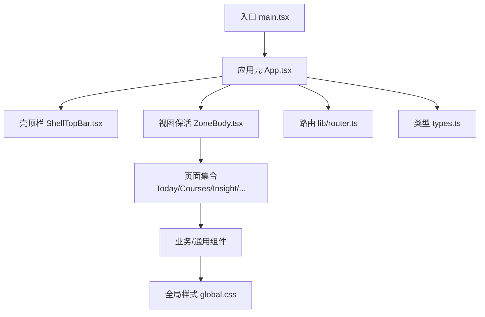
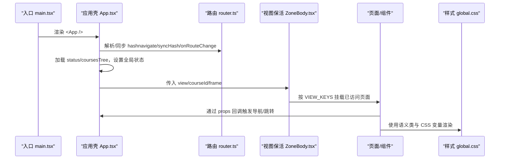
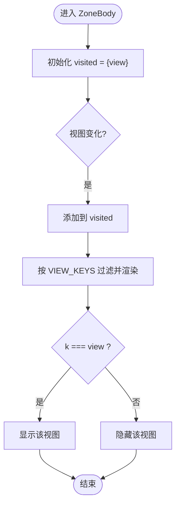
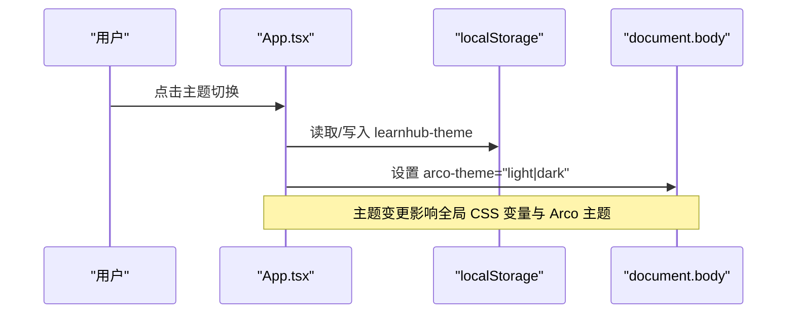
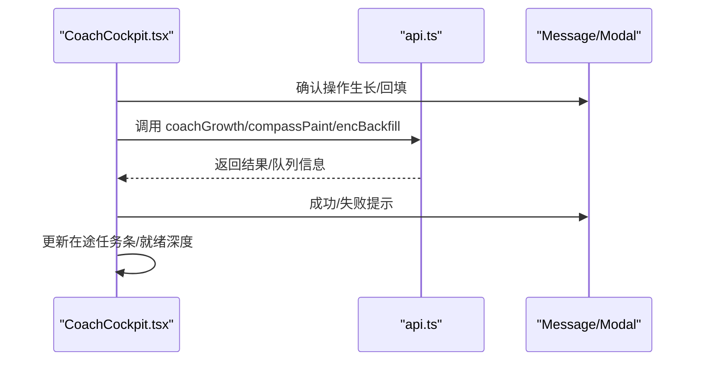
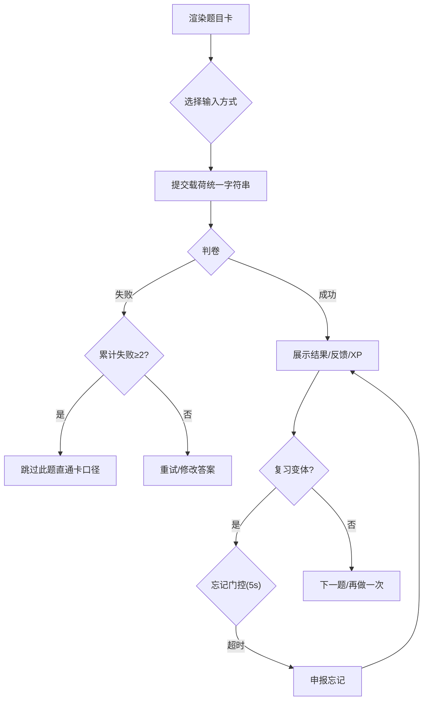
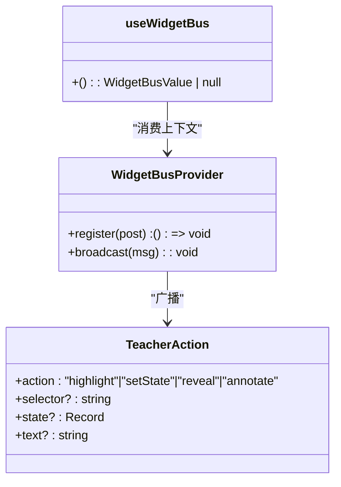
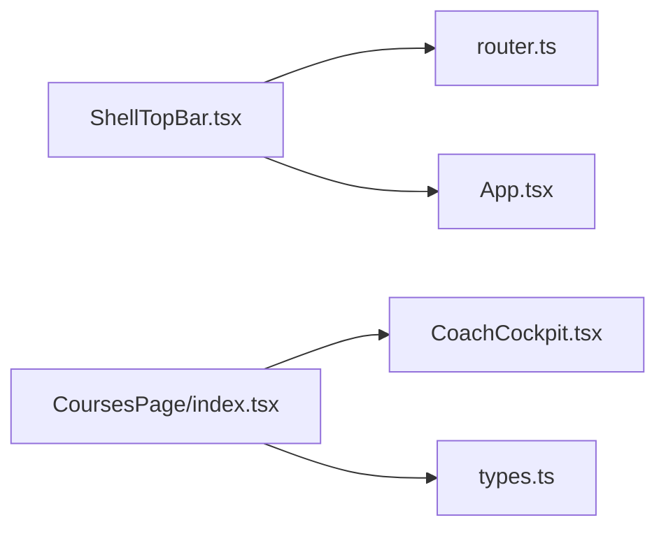
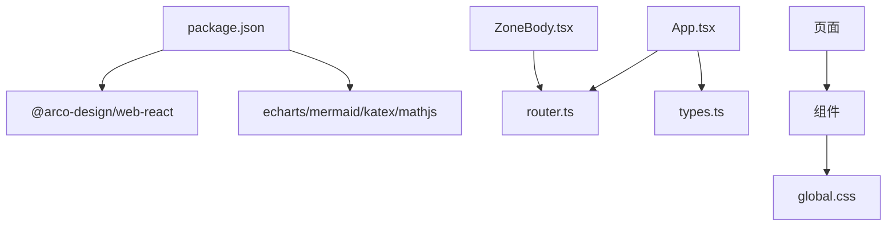

# 组件架构设计

<cite>
**本文引用的文件**
- [App.tsx](file://ui/src/App.tsx)
- [main.tsx](file://ui/src/main.tsx)
- [ZoneBody.tsx](file://ui/src/components/ZoneBody.tsx)
- [router.ts](file://ui/src/lib/router.ts)
- [types.ts](file://ui/src/types.ts)
- [ShellTopBar.tsx](file://ui/src/components/ShellTopBar.tsx)
- [index.tsx（课程区）](file://ui/src/pages/CoursesPage/index.tsx)
- [CoachCockpit.tsx](file://ui/src/components/CoachCockpit.tsx)
- [QuestionCard.tsx](file://ui/src/components/QuestionCard.tsx)
- [widget-bus.tsx](file://ui/src/components/widget-bus.tsx)
- [global.css](file://ui/src/global.css)
- [package.json](file://ui/package.json)
</cite>

## 目录
1. [简介](#简介)
2. [项目结构](#项目结构)
3. [核心组件](#核心组件)
4. [架构总览](#架构总览)
5. [详细组件分析](#详细组件分析)
6. [依赖关系分析](#依赖关系分析)
7. [性能考虑](#性能考虑)
8. [故障排查指南](#故障排查指南)
9. [结论](#结论)
10. [附录：开发规范与最佳实践](#附录开发规范与最佳实践)

## 简介
本文件面向 LearnHub 前端（React + TypeScript）的组件架构，系统性阐述通用组件、业务组件与页面组件的职责划分；说明组件间通信机制（props、事件、状态共享）；总结复用策略与设计模式（高阶组件、渲染属性、组合模式）；解释样式管理方案（CSS 变量主题、语义化类、响应式布局）；并给出命名约定、文件组织与代码结构的开发规范。目标是让不同技术背景的读者都能快速理解与上手。

## 项目结构
LearnHub 的前端位于 ui/src 目录，采用“壳层 + 路由 + 视图保活 + 页面 + 组件”的分层组织：
- 入口与壳层：main.tsx 负责初始化 React 根节点与全局语言包；App.tsx 提供应用级状态、主题切换、导航桥接与错误兜底。
- 路由与保活：lib/router.ts 定义 hash 路由、视图键与区键；components/ZoneBody.tsx 实现视图保活容器，首访后常驻、非激活隐藏，配合 active-tab 信号控制轮询。
- 页面与组件：pages 下按功能域组织页面；components 提供通用与业务组件（如教练台、题目卡、顶栏等）。
- 类型与 API：types.ts 集中 UI 类型与从引擎/宿主派生的类型；api.ts 封装后端接口调用（由页面/组件消费）。
- 样式：global.css 提供全局 CSS 变量与语义化类名，驱动主题与布局一致性。

图表来源
- [main.tsx:1-16](file://ui/src/main.tsx#L1-L16)
- [App.tsx:47-179](file://ui/src/App.tsx#L47-L179)
- [ZoneBody.tsx:21-42](file://ui/src/components/ZoneBody.tsx#L21-L42)
- [router.ts:1-164](file://ui/src/lib/router.ts#L1-L164)
- [global.css:1-398](file://ui/src/global.css#L1-L398)

章节来源
- [main.tsx:1-16](file://ui/src/main.tsx#L1-L16)
- [App.tsx:47-179](file://ui/src/App.tsx#L47-L179)
- [ZoneBody.tsx:21-42](file://ui/src/components/ZoneBody.tsx#L21-L42)
- [router.ts:1-164](file://ui/src/lib/router.ts#L1-L164)
- [global.css:1-398](file://ui/src/global.css#L1-L398)

## 核心组件
- 应用壳 App.tsx
  - 职责：维护全局状态（status、tree、course、lesson、focusNode/focusJob）、加载数据、错误处理、主题切换、路由同步与保活信号广播。
  - 关键能力：首次加载 status/coursesTree；将路由变化映射到视图键；根据是否无课程进行空态守卫；通过 ZoneBody 渲染当前视图。
- 视图保活 ZoneBody.tsx
  - 职责：记录已访问视图，按 VIEW_KEYS 列表挂载对应页面；仅激活视图可见，其余隐藏以保活内部状态。
  - 关键点：与 active-tab 联动，隐藏视图跳过轮询；单课工作台整体共享一个视图键，分栏切换不改视图键。
- 壳顶栏 ShellTopBar.tsx
  - 职责：五区页签、课程区子导航（我的课程/生成队列/提案收件箱）、帮助抽屉入口、主题切换。
  - 关键点：与 ZONE_KEYS、COURSE_SUBS 对账，保证导航与路由一致。
- 课程区首页 CoursesPage/index.tsx
  - 职责：空 vault 时展示建课入口与教练台；有课时展示课程卡片网格。
- 教练台 CoachCockpit.tsx
  - 职责：建课、生长一步、罗盘重画、enc 回填、就绪深度检查、复诊结算、在途任务条。
  - 关键点：与 api 交互，使用 usePolling 低频轮询，Modal/Message 反馈用户操作结果。
- 题目卡 QuestionCard.tsx
  - 职责：多题型作答、AI/规则判卷、JOL 预测、复习刷卡变体、申诉与直通卡。
  - 关键点：提交载荷统一为字符串；计时上报 XP；失败逃生门；复习模式下的忘记门控与背面答案块。
- 交互件消息总线 widget-bus.tsx
  - 职责：在当前视图内向所有注册的交互件广播 LEARNHUB_TEACHER 动作（highlight/setState/reveal/annotate）。
  - 关键点：Provider 挂在 LessonView；无 Provider 时 useWidgetBus 返回 null，不影响渲染。

章节来源
- [App.tsx:47-179](file://ui/src/App.tsx#L47-L179)
- [ZoneBody.tsx:21-42](file://ui/src/components/ZoneBody.tsx#L21-L42)
- [ShellTopBar.tsx:19-63](file://ui/src/components/ShellTopBar.tsx#L19-L63)
- [index.tsx（课程区）:1-31](file://ui/src/pages/CoursesPage/index.tsx#L1-L31)
- [CoachCockpit.tsx:1-253](file://ui/src/components/CoachCockpit.tsx#L1-L253)
- [QuestionCard.tsx:1-481](file://ui/src/components/QuestionCard.tsx#L1-L481)
- [widget-bus.tsx:1-50](file://ui/src/components/widget-bus.tsx#L1-L50)

## 架构总览
下图展示了从入口到页面与组件的调用链路与数据流，包括路由、保活、API 与样式系统。

图表来源
- [main.tsx:1-16](file://ui/src/main.tsx#L1-L16)
- [App.tsx:47-179](file://ui/src/App.tsx#L47-L179)
- [router.ts:72-164](file://ui/src/lib/router.ts#L72-L164)
- [ZoneBody.tsx:21-42](file://ui/src/components/ZoneBody.tsx#L21-L42)
- [global.css:1-398](file://ui/src/global.css#L1-L398)

## 详细组件分析

### 路由与视图保活
- 视图键与区键：ZONE_KEYS、VIEW_KEYS、WORKBENCH_SUBS 等常量集中定义，确保导航、顶栏与保活逻辑一致。
- 程序化跳转：navigate 用于非参数化视图；navigateCourse 用于单课工作台参数段路由。
- 保活策略：ZoneBody 维护 visited Set，首次访问后常驻；active-tab 信号使隐藏视图跳过轮询。

图表来源
- [ZoneBody.tsx:21-42](file://ui/src/components/ZoneBody.tsx#L21-L42)
- [router.ts:49-121](file://ui/src/lib/router.ts#L49-L121)

章节来源
- [router.ts:1-164](file://ui/src/lib/router.ts#L1-L164)
- [ZoneBody.tsx:21-42](file://ui/src/components/ZoneBody.tsx#L21-L42)

### 应用壳与主题/通知
- 主题切换：App.tsx 读取/写入 localStorage，设置 body 的 arco-theme 属性，结合 tokens.css 实现亮/暗主题。
- 通知：useCoachToasts 订阅图域任务生命周期，完成通知按钮分流到生成队列或提案收件箱。
- 错误兜底：加载失败时展示 Result 错误页并提供重试。

图表来源
- [App.tsx:119-128](file://ui/src/App.tsx#L119-L128)
- [main.tsx:1-16](file://ui/src/main.tsx#L1-L16)

章节来源
- [App.tsx:47-179](file://ui/src/App.tsx#L47-L179)
- [main.tsx:1-16](file://ui/src/main.tsx#L1-L16)

### 教练台与任务流转
- 教练台能力：新建课程、生长一步、罗盘重画、enc 回填、就绪深度检查、复诊结算。
- 任务条：在途任务标签展示状态（排队/进行中/失败等），点击跳转到生成队列定位任务。
- 轮询：usePolling 低频轮询复诊数据，非激活视图自动跳过。

图表来源
- [CoachCockpit.tsx:153-249](file://ui/src/components/CoachCockpit.tsx#L153-L249)

章节来源
- [CoachCockpit.tsx:1-253](file://ui/src/components/CoachCockpit.tsx#L1-L253)

### 题目卡与作答流程
- 题型支持：单选、多选、判断、填空、数值、排序、配对、反思、开放问答。
- 判卷与反馈：统一提交载荷为字符串；规则题与 AI 判卷；反馈以 Markdown 呈现。
- 复习变体：忘记门控（5 秒倒计时）、背面正确答案块、自评挂起与到期预览。
- JOL 预测：翻面前弹出三点预测，可忽略不阻断流程。
- 申诉：规则题判错后可发起申诉，AI 复核改判/作废/豁免。

图表来源
- [QuestionCard.tsx:110-481](file://ui/src/components/QuestionCard.tsx#L110-L481)

章节来源
- [QuestionCard.tsx:1-481](file://ui/src/components/QuestionCard.tsx#L1-L481)

### 交互件消息总线
- 作用：LessonView 提供 WidgetBusProvider，当前视图内的交互件通过 register 注册发送器；面板侧通过 broadcast 向全部交互件广播 LEARNHUB_TEACHER 动作。
- 无 Provider 场景：useWidgetBus 返回 null，组件仍可渲染，仅无广播能力。

图表来源
- [widget-bus.tsx:1-50](file://ui/src/components/widget-bus.tsx#L1-L50)

章节来源
- [widget-bus.tsx:1-50](file://ui/src/components/widget-bus.tsx#L1-L50)

### 页面与组件协作
- 课程区首页：无课程时展示教练台入口；有课时展示课程卡片网格。
- 顶栏与路由：ShellTopBar 的区键与子导航项与 ZONE_KEYS、COURSE_SUBS 保持一致，点击后通过回调触发 navigate/navigateCourse。
- 类型契约：types.ts 集中 UI 专有类型与从引擎/宿主派生类型，避免手工镜像。

图表来源
- [ShellTopBar.tsx:19-63](file://ui/src/components/ShellTopBar.tsx#L19-L63)
- [router.ts:24-58](file://ui/src/lib/router.ts#L24-L58)
- [index.tsx（课程区）:1-31](file://ui/src/pages/CoursesPage/index.tsx#L1-L31)
- [CoachCockpit.tsx:1-253](file://ui/src/components/CoachCockpit.tsx#L1-L253)
- [types.ts:1-93](file://ui/src/types.ts#L1-L93)

章节来源
- [ShellTopBar.tsx:19-63](file://ui/src/components/ShellTopBar.tsx#L19-L63)
- [router.ts:24-58](file://ui/src/lib/router.ts#L24-L58)
- [index.tsx（课程区）:1-31](file://ui/src/pages/CoursesPage/index.tsx#L1-L31)
- [CoachCockpit.tsx:1-253](file://ui/src/components/CoachCockpit.tsx#L1-L253)
- [types.ts:1-93](file://ui/src/types.ts#L1-L93)

## 依赖关系分析
- 外部依赖：Arco Design 作为 UI 库；ECharts/Mermaid/KaTeX/MathJS 用于可视化与公式；React/ReactDOM 为核心框架。
- 模块耦合：App 依赖 router、api、types；ZoneBody 依赖 router 的 VIEW_KEYS；页面依赖组件；组件通过 types 保持类型一致。
- 样式依赖：global.css 提供 CSS 变量与语义类，被各组件广泛消费。

图表来源
- [package.json:1-48](file://ui/package.json#L1-L48)
- [App.tsx:47-179](file://ui/src/App.tsx#L47-L179)
- [ZoneBody.tsx:21-42](file://ui/src/components/ZoneBody.tsx#L21-L42)
- [global.css:1-398](file://ui/src/global.css#L1-L398)

章节来源
- [package.json:1-48](file://ui/package.json#L1-L48)
- [App.tsx:47-179](file://ui/src/App.tsx#L47-L179)
- [ZoneBody.tsx:21-42](file://ui/src/components/ZoneBody.tsx#L21-L42)
- [global.css:1-398](file://ui/src/global.css#L1-L398)

## 性能考虑
- 视图保活减少重复渲染：ZoneBody 对已访问视图保留实例，避免频繁重建带来的开销。
- 轮询节流：usePolling 在非激活视图跳过取数，降低无效请求。
- 资源按需加载：Arco 图标具名导入，利于 tree-shaking；Vite 构建优化打包体积。
- 长列表与复杂渲染：题目卡与图表区域注意虚拟滚动与懒加载（可按需扩展）。

[本节为通用指导，无需具体文件引用]

## 故障排查指南
- 加载失败：App 壳捕获异常并展示 Result 错误页，提供重试按钮；检查 api.status/coursesTree 返回。
- 路由漂移：syncHash 仅在 hash 与视图不一致时 replaceState，避免多余历史条目；旧键深链回落默认区。
- 主题不生效：确认 body 的 arco-theme 属性与 localStorage 值一致；检查 tokens.css 变量是否覆盖。
- 题目判卷失败：QuestionCard 累计失败 ≥2 次出现逃生门；查看 Message 错误信息并定位 api 返回。
- 任务未刷新：确认 usePolling 的 tab 与 intervalMs 配置；检查 active-tab 信号是否正确设置。

章节来源
- [App.tsx:62-79](file://ui/src/App.tsx#L62-L79)
- [App.tsx:114-117](file://ui/src/App.tsx#L114-L117)
- [App.tsx:119-128](file://ui/src/App.tsx#L119-L128)
- [router.ts:145-164](file://ui/src/lib/router.ts#L145-L164)
- [CoachCockpit.tsx:81-135](file://ui/src/components/CoachCockpit.tsx#L81-L135)
- [QuestionCard.tsx:195-219](file://ui/src/components/QuestionCard.tsx#L195-L219)

## 结论
LearnHub 前端采用清晰的层次化组件架构：应用壳负责全局状态与导航桥接，路由与保活确保视图稳定与高效，页面与组件按职责拆分并通过 props/事件/Context 通信。样式体系基于 CSS 变量与语义类，支撑主题定制与一致性。通过严格的类型契约与测试门控，保证了可扩展性与可维护性。

[本节为总结，无需具体文件引用]

## 附录：开发规范与最佳实践
- 命名约定
  - 组件文件：PascalCase（如 CoachCockpit.tsx、QuestionCard.tsx）。
  - 页面文件：按功能域分组目录（如 pages/CoursesPage/index.tsx）。
  - 常量与枚举：ZONE_KEYS、VIEW_KEYS 等集中定义于 router.ts，避免散落。
- 文件组织
  - 路由与保活：lib/router.ts 与 components/ZoneBody.tsx 分离关注点。
  - 类型：types.ts 集中 UI 专有类型与从引擎/宿主派生类型，禁止手工镜像。
  - 样式：global.css 提供语义类与 CSS 变量，避免内联样式滥用。
- 组件通信
  - Props：向下传递数据与回调（如 frame、onDone）。
  - 事件：通过回调函数触发父级状态更新（如 navigate、openCourse）。
  - 状态共享：Context（如 WidgetBusProvider）用于跨层级广播；全局状态集中在 App 壳。
- 复用策略与设计模式
  - 组合模式：ZoneBody 组合多个页面；QuestionCard 组合多种题型输入与反馈。
  - 渲染属性：通过 props.footer/menu 注入额外内容，增强灵活性。
  - 高阶组件：useCoachToasts 封装通知逻辑，供 App 壳复用。
- 样式管理
  - 主题定制：通过 tokens.css 与 arco-theme 切换亮/暗主题。
  - 语义化类：使用 lh-* 类名表达意图，便于维护与测试门控。
  - 响应式：Flex/Grid 布局与视口高度计算（如 dag-wrap 高度）适配不同屏幕。
- 代码结构
  - 单一职责：每个组件聚焦一个领域（如教练台、题目卡、顶栏）。
  - 错误处理：统一通过 Message/Modal 反馈，避免静默失败。
  - 可测试性：路由与类型集中，便于单测与回归。

[本节为通用指导，无需具体文件引用]