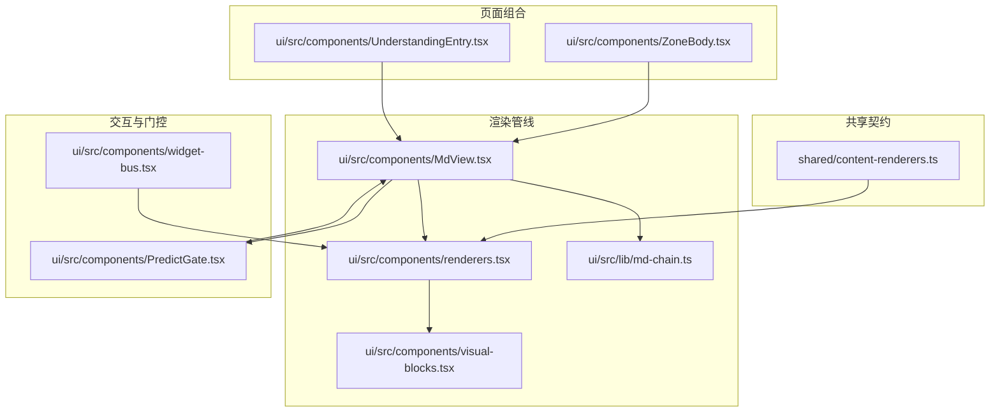
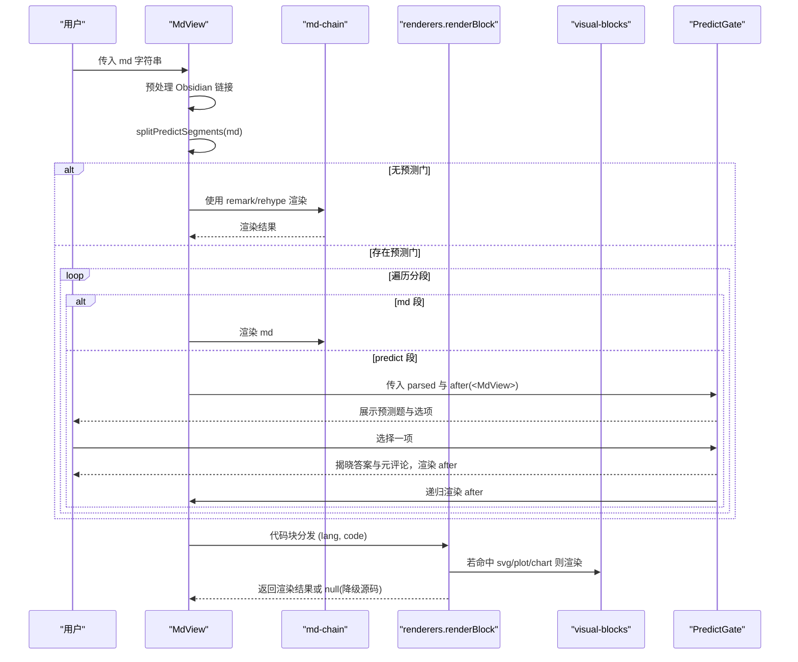
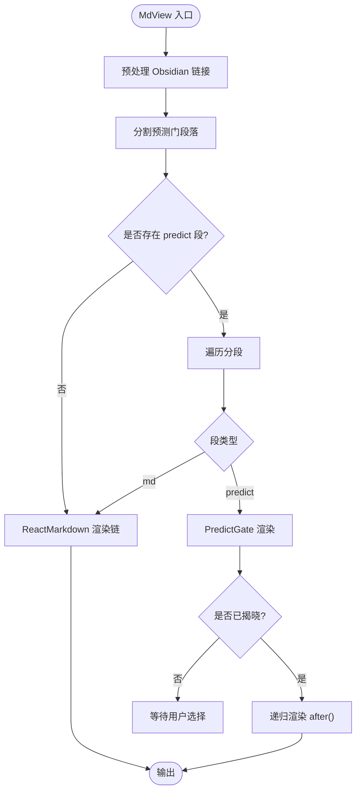
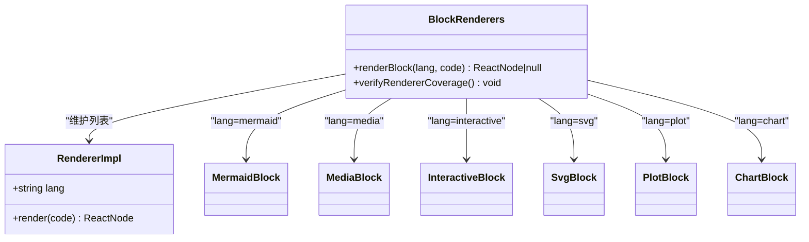
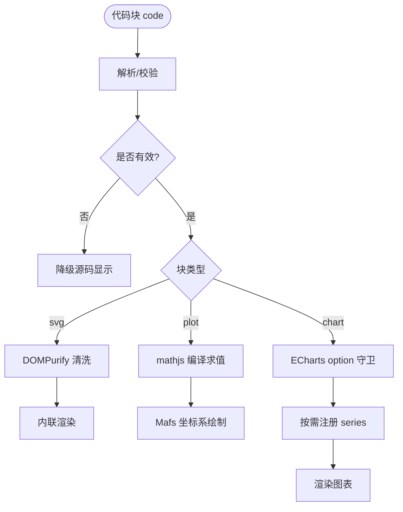
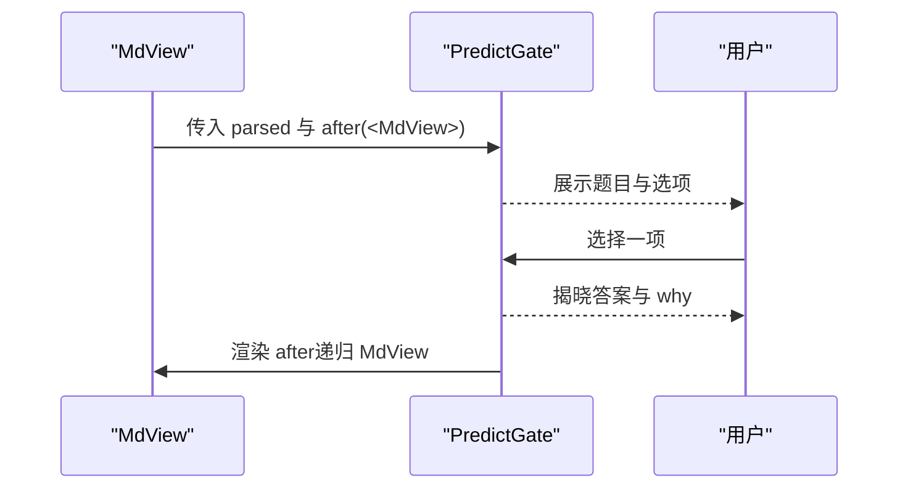
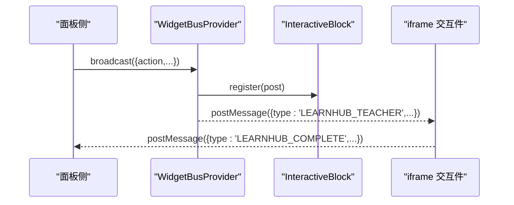
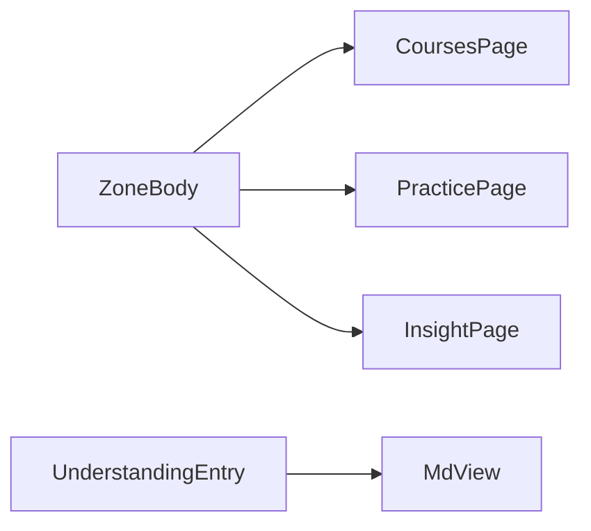
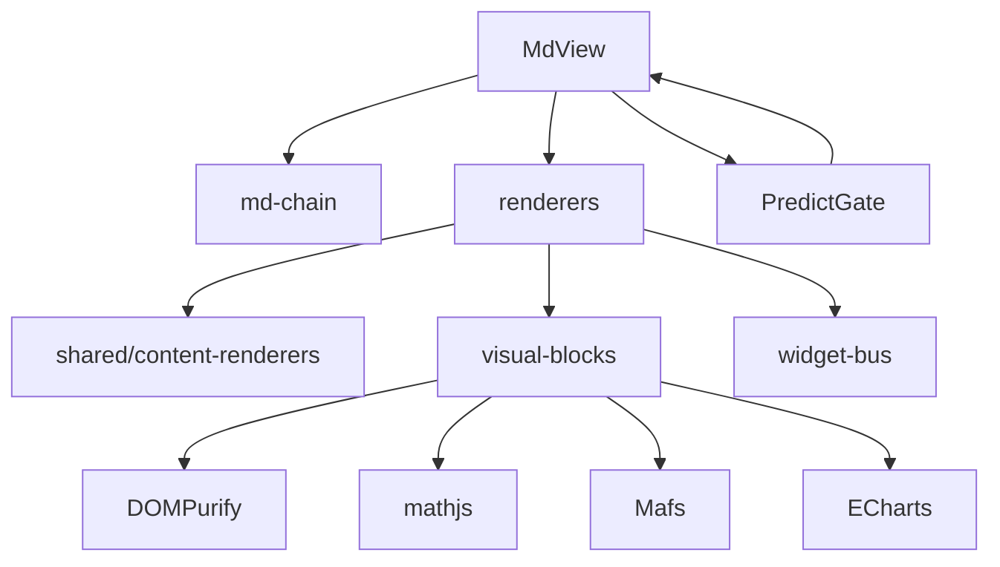

# 组件组合模式

<cite>
**本文引用的文件**
- [MdView.tsx](file://ui/src/components/MdView.tsx)
- [renderers.tsx](file://ui/src/components/renderers.tsx)
- [visual-blocks.tsx](file://ui/src/components/visual-blocks.tsx)
- [content-renderers.ts](file://shared/content-renderers.ts)
- [PredictGate.tsx](file://ui/src/components/PredictGate.tsx)
- [widget-bus.tsx](file://ui/src/components/widget-bus.tsx)
- [md-chain.ts](file://ui/src/lib/md-chain.ts)
- [ZoneBody.tsx](file://ui/src/components/ZoneBody.tsx)
- [UnderstandingEntry.tsx](file://ui/src/components/UnderstandingEntry.tsx)
</cite>

## 目录
1. [简介](#简介)
2. [项目结构](#项目结构)
3. [核心组件](#核心组件)
4. [架构总览](#架构总览)
5. [详细组件分析](#详细组件分析)
6. [依赖关系分析](#依赖关系分析)
7. [性能考量](#性能考量)
8. [故障排查指南](#故障排查指南)
9. [结论](#结论)
10. [附录：接口与类型规范](#附录接口与类型规范)

## 简介
本文件面向 LearnHub 前端，系统性阐述基于 Composition API 的组件组合模式，重点覆盖：
- renderers 渲染器模式：以“注册表 + 分发”的方式将不同代码块语言（如 mermaid、media、interactive、svg、plot、chart）映射到具体渲染实现。
- visual-blocks 可视化块系统：对 SVG、函数图像/坐标几何（plot）、数据图表（chart）等富内容提供安全、可降级、按需加载的渲染能力。
- MdView 组件：实现 Markdown 内容的灵活渲染与扩展，支持预测门（learnhub-predict）阅读流控制、Obsidian 图片嵌入、行内公式与代码块统一分发。
- 插槽与自定义注入：通过 React 子节点与上下文总线（WidgetBus）实现内容注入与跨组件通信。
- 组合示例：如何组合基础组件构建复杂学习界面（课程正文、交互模拟、图表、预测门）。
- 接口设计规范、类型定义与向后兼容策略。

## 项目结构
围绕内容渲染的前端关键路径如下：
- shared/content-renderers.ts：单一事实源，声明支持的渲染格式清单、节类型清单、预测门解析工具。
- ui/src/components/MdView.tsx：Markdown 渲染入口，预处理 Obsidian 链接、分割预测门段落、调用渲染链与代码块分发。
- ui/src/components/renderers.tsx：代码块渲染器注册表，按 lang 分发到具体实现；未命中则降级源码显示。
- ui/src/components/visual-blocks.tsx：可视化块的具体实现（SVG、plot、chart），统一失败降级与动态导入。
- ui/src/components/PredictGate.tsx：预测门 UI，先预测再揭晓，并决定是否放行其后正文。
- ui/src/components/widget-bus.tsx：交互件消息总线，用于面板侧向 iframe 交互件广播教师动作。
- ui/src/lib/md-chain.ts：Markdown 渲染链配置（remark/rehype 插件与 HTML 策略）。
- ZoneBody.tsx、UnderstandingEntry.tsx：页面级容器与“加我的理解”入口，演示 MdView 的组合使用。

**图示来源**
- [MdView.tsx:47-84](file://ui/src/components/MdView.tsx#L47-L84)
- [renderers.tsx:140-166](file://ui/src/components/renderers.tsx#L140-L166)
- [visual-blocks.tsx:23-296](file://ui/src/components/visual-blocks.tsx#L23-L296)
- [content-renderers.ts:24-67](file://shared/content-renderers.ts#L24-L67)
- [PredictGate.tsx:14-68](file://ui/src/components/PredictGate.tsx#L14-L68)
- [widget-bus.tsx:32-49](file://ui/src/components/widget-bus.tsx#L32-L49)
- [md-chain.ts:9-16](file://ui/src/lib/md-chain.ts#L9-L16)
- [ZoneBody.tsx:21-41](file://ui/src/components/ZoneBody.tsx#L21-L41)
- [UnderstandingEntry.tsx:108-108](file://ui/src/components/UnderstandingEntry.tsx#L108-L108)

**章节来源**
- [MdView.tsx:1-103](file://ui/src/components/MdView.tsx#L1-L103)
- [renderers.tsx:1-166](file://ui/src/components/renderers.tsx#L1-L166)
- [visual-blocks.tsx:1-296](file://ui/src/components/visual-blocks.tsx#L1-L296)
- [content-renderers.ts:1-197](file://shared/content-renderers.ts#L1-L197)
- [PredictGate.tsx:1-69](file://ui/src/components/PredictGate.tsx#L1-L69)
- [widget-bus.tsx:1-50](file://ui/src/components/widget-bus.tsx#L1-L50)
- [md-chain.ts:1-17](file://ui/src/lib/md-chain.ts#L1-L17)
- [ZoneBody.tsx:1-43](file://ui/src/components/ZoneBody.tsx#L1-L43)
- [UnderstandingEntry.tsx:1-117](file://ui/src/components/UnderstandingEntry.tsx#L1-L117)

## 核心组件
- MdView：Markdown 渲染主入口，负责预处理、分段（含预测门）、调用渲染链与代码块分发。
- renderers：代码块渲染器注册表，维护 lang → 渲染实现的映射，并提供覆盖率校验。
- visual-blocks：可视化块实现（SVG、plot、chart），统一失败降级与动态加载。
- PredictGate：预测门 UI，控制阅读流与答案揭晓。
- widget-bus：交互件消息总线，支持面板侧向 iframe 广播教师动作。
- md-chain：Markdown 渲染链配置（GFM、数学公式、Katex、HTML 策略）。

**章节来源**
- [MdView.tsx:28-84](file://ui/src/components/MdView.tsx#L28-L84)
- [renderers.tsx:140-166](file://ui/src/components/renderers.tsx#L140-L166)
- [visual-blocks.tsx:23-296](file://ui/src/components/visual-blocks.tsx#L23-L296)
- [PredictGate.tsx:14-68](file://ui/src/components/PredictGate.tsx#L14-L68)
- [widget-bus.tsx:32-49](file://ui/src/components/widget-bus.tsx#L32-L49)
- [md-chain.ts:9-16](file://ui/src/lib/md-chain.ts#L9-L16)

## 架构总览
MdView 作为 Markdown 渲染中枢，串联以下流程：
- 预处理：将 Obsidian 嵌入语法转换为标准图片 URL。
- 分段：识别 learnhub-predict 围栏块，将内容切分为 md 段与 predict 段序列。
- 渲染：无预测门时直接走 ReactMarkdown 渲染链；有预测门时，逐段渲染，predict 段交由 PredictGate 处理，并在揭晓后递归渲染 after 内容。
- 代码块分发：所有代码块经 MdCode 进入 renderBlock，按 lang 查表渲染；未命中则降级为源码显示。
- 可视化块：svg/plot/chart 由 visual-blocks 提供，按需动态导入，失败回退源码。
- 交互件：interactive 块通过 iframe 加载，借助 widget-bus 接收面板广播的教师动作，并通过 postMessage 上报完成与标注。

**图示来源**
- [MdView.tsx:47-84](file://ui/src/components/MdView.tsx#L47-L84)
- [renderers.tsx:151-155](file://ui/src/components/renderers.tsx#L151-L155)
- [visual-blocks.tsx:23-296](file://ui/src/components/visual-blocks.tsx#L23-L296)
- [PredictGate.tsx:14-68](file://ui/src/components/PredictGate.tsx#L14-L68)
- [md-chain.ts:9-16](file://ui/src/lib/md-chain.ts#L9-L16)

## 详细组件分析

### MdView：Markdown 渲染与扩展点
- 功能要点
  - 预处理 Obsidian 嵌入语法为面板文件路由 URL。
  - 分割预测门段落，支持一节多门嵌套。
  - 无预测门时直接渲染；有预测门时交由 PredictGate 控制阅读流。
  - 代码块统一经 MdCode 进入 renderBlock，按 lang 分发。
  - InlineMd 复用同一渲染链，段落降为 span 保持行内布局。
- 扩展方式
  - 新增代码块语言：在 shared/content-renderers.ts 的 RENDERERS 增加一项，并在 renderers.tsx 的 BLOCK_RENDERERS 中注册实现。
  - 修改 Markdown 渲染链：在 md-chain.ts 调整 remark/rehype 插件与 HTML 策略。
- 错误处理
  - 预测门解析失败时降级源码显示，避免页面崩溃。
  - 代码块未命中渲染器时降级源码显示。

**图示来源**
- [MdView.tsx:47-84](file://ui/src/components/MdView.tsx#L47-L84)
- [PredictGate.tsx:14-68](file://ui/src/components/PredictGate.tsx#L14-L68)

**章节来源**
- [MdView.tsx:1-103](file://ui/src/components/MdView.tsx#L1-L103)
- [md-chain.ts:1-17](file://ui/src/lib/md-chain.ts#L1-L17)

### renderers：代码块渲染器注册表
- 设计模式
  - 注册表模式：BLOCK_RENDERERS 维护 lang → 渲染函数的映射。
  - 单一事实源：RENDERERS 在 shared 中声明，UI 侧必须实现对应渲染器，构建期 verifyRendererCoverage 进行对账。
- 内置渲染器
  - mermaid：流程图/时序图/状态图等矢量示意图。
  - media：音视频播放器（按扩展名区分 video/audio）。
  - interactive：iframe 沙箱交互件，支持完成上报与 AI 标注。
  - svg：白名单清洗后内联渲染。
  - plot：JSON spec → mathjs 求值 → Mafs 坐标系绘制。
  - chart：ECharts option 解析守卫 → 按需注册 series → 自适应尺寸。
- 降级策略
  - 未命中渲染器或解析失败时，降级为源码显示，保证学习者可见性。

**图示来源**
- [renderers.tsx:135-166](file://ui/src/components/renderers.tsx#L135-L166)
- [visual-blocks.tsx:23-296](file://ui/src/components/visual-blocks.tsx#L23-L296)
- [content-renderers.ts:24-67](file://shared/content-renderers.ts#L24-L67)

**章节来源**
- [renderers.tsx:1-166](file://ui/src/components/renderers.tsx#L1-L166)
- [content-renderers.ts:1-197](file://shared/content-renderers.ts#L1-L197)

### visual-blocks：可视化块系统
- 统一模式
  - 重依赖动态 import（不进首屏 bundle）。
  - 解析/校验不过 → 降级源码 <pre> 显示。
- 各块特性
  - SvgBlock：DOMPurify 白名单清洗（svg profile），内联渲染。
  - PlotBlock：JSON spec → mathjs 编译求值 → Mafs 坐标系渲染；支持函数、参数曲线、点、向量、线段、圆、多边形、标签。
  - ChartBlock：ECharts option 解析守卫（series 白名单、禁外部 URL），按需注册四类 series，ResizeObserver 自适应与主题跟随。

**图示来源**
- [visual-blocks.tsx:23-296](file://ui/src/components/visual-blocks.tsx#L23-L296)

**章节来源**
- [visual-blocks.tsx:1-296](file://ui/src/components/visual-blocks.tsx#L1-L296)

### PredictGate：预测门阅读流控制
- 行为
  - 展示预测题与选项，用户选择后揭晓正确项与元评论。
  - 仅当用户做出选择后才渲染 after 内容（即块后正文），实现“先预测再放行”。
- 组合
  - MdView 将 after 作为子节点递归渲染，支持一节多门嵌套。

**图示来源**
- [PredictGate.tsx:14-68](file://ui/src/components/PredictGate.tsx#L14-L68)
- [MdView.tsx:73-82](file://ui/src/components/MdView.tsx#L73-L82)

**章节来源**
- [PredictGate.tsx:1-69](file://ui/src/components/PredictGate.tsx#L1-L69)
- [MdView.tsx:60-84](file://ui/src/components/MdView.tsx#L60-L84)

### widget-bus：交互件消息总线
- 作用
  - 面板侧通过 broadcast 向当前视图内全部交互件广播 LEARNHUB_TEACHER 动作（highlight/setState/reveal/annotate）。
  - InteractiveBlock 注册发送器，将消息转发至 iframe。
- 使用场景
  - “问 AI 老师”的演示按钮可向交互件下发指令，增强教学引导。

**图示来源**
- [widget-bus.tsx:32-49](file://ui/src/components/widget-bus.tsx#L32-L49)
- [renderers.tsx:110-114](file://ui/src/components/renderers.tsx#L110-L114)
- [renderers.tsx:82-96](file://ui/src/components/renderers.tsx#L82-L96)

**章节来源**
- [widget-bus.tsx:1-50](file://ui/src/components/widget-bus.tsx#L1-L50)
- [renderers.tsx:66-133](file://ui/src/components/renderers.tsx#L66-L133)

### 页面级组合示例
- ZoneBody：视图保活容器，挂载多个页面（课程、练习、洞察等），体现“视图键 + 条件渲染”的组合模式。
- UnderstandingEntry：在节级入口处组合 MdView，展示 AI 反馈回复，体现“内容渲染 + 业务交互”的组合。

**图示来源**
- [ZoneBody.tsx:21-41](file://ui/src/components/ZoneBody.tsx#L21-L41)
- [UnderstandingEntry.tsx:108-108](file://ui/src/components/UnderstandingEntry.tsx#L108-L108)

**章节来源**
- [ZoneBody.tsx:1-43](file://ui/src/components/ZoneBody.tsx#L1-L43)
- [UnderstandingEntry.tsx:1-117](file://ui/src/components/UnderstandingEntry.tsx#L1-L117)

## 依赖关系分析
- MdView 依赖 md-chain（渲染链配置）、renderers（代码块分发）、PredictGate（预测门）、shared 中的预测门解析工具。
- renderers 依赖 shared 的 RENDERERS 清单与 visual-blocks 的可视化实现。
- visual-blocks 依赖 DOMPurify、mathjs、Mafs、ECharts 等第三方库，采用动态导入以降低首屏体积。
- PredictGate 依赖 shared 的 PredictBlock 类型与 MdView 的递归渲染。
- widget-bus 提供跨组件通信，被 InteractiveBlock 使用。

**图示来源**
- [MdView.tsx:15-19](file://ui/src/components/MdView.tsx#L15-L19)
- [renderers.tsx:12-15](file://ui/src/components/renderers.tsx#L12-L15)
- [visual-blocks.tsx:8-13](file://ui/src/components/visual-blocks.tsx#L8-L13)
- [PredictGate.tsx:8-8](file://ui/src/components/PredictGate.tsx#L8-L8)
- [widget-bus.tsx:8-9](file://ui/src/components/widget-bus.tsx#L8-L9)

**章节来源**
- [MdView.tsx:1-103](file://ui/src/components/MdView.tsx#L1-L103)
- [renderers.tsx:1-166](file://ui/src/components/renderers.tsx#L1-L166)
- [visual-blocks.tsx:1-296](file://ui/src/components/visual-blocks.tsx#L1-L296)
- [PredictGate.tsx:1-69](file://ui/src/components/PredictGate.tsx#L1-L69)
- [widget-bus.tsx:1-50](file://ui/src/components/widget-bus.tsx#L1-L50)

## 性能考量
- 动态导入：Mermaid、Mafs、ECharts 等重型依赖按需加载，减少首屏包体。
- 降级策略：解析失败或未命中渲染器时降级源码显示，避免阻塞渲染。
- 主题跟随：根据 arco-theme 动态切换 Mermaid/ECharts 主题，提升一致性。
- 自适应：ECharts 使用 ResizeObserver 监听容器尺寸变化，自动 resize。
- 安全：SVG 使用 DOMPurify 白名单清洗，禁用脚本与事件处理器；图表禁止外部 URL。

[本节为通用性能讨论，不直接分析具体文件]

## 故障排查指南
- 预测门解析失败
  - 现象：页面显示原始围栏块源码。
  - 原因：learnhub-predict 块内容不符合字段约束（q/options/answer/why）。
  - 处理：检查 YAML 风格字段与数组格式，确保 options 为 2–4 项互异数组，answer 为其中一项原文。
- 代码块未渲染
  - 现象：代码块以源码形式显示。
  - 原因：lang 未在 BLOCK_RENDERERS 中注册，或解析失败。
  - 处理：在 shared 的 RENDERERS 中添加新格式，并在 renderers.tsx 中实现对应渲染器；或使用降级源码查看原始内容。
- 交互件未完成上报
  - 现象：交互完成后未亮徽标或成绩未记入档案。
  - 原因：iframe 未发送 postMessage，或服务端上报失败。
  - 处理：确认交互件结尾发送 LEARNHUB_COMPLETE；检查 SettleContext 与 api.interactiveSettle 调用；失败时允许重试。
- 图表不可见
  - 现象：图表区域空白。
  - 原因：ECharts option 非法（series 类型不在白名单或包含外部 URL）。
  - 处理：修正 option，确保 series 类型为 line/bar/pie/scatter，且不含外部 URL。

**章节来源**
- [content-renderers.ts:149-172](file://shared/content-renderers.ts#L149-L172)
- [renderers.tsx:151-166](file://ui/src/components/renderers.tsx#L151-L166)
- [renderers.tsx:82-96](file://ui/src/components/renderers.tsx#L82-L96)
- [visual-blocks.tsx:236-254](file://ui/src/components/visual-blocks.tsx#L236-L254)

## 结论
LearnHub 前端通过“注册表 + 分发”的 renderers 模式与“可视化块系统”实现了高度可扩展的内容渲染架构。MdView 作为 Markdown 渲染中枢，结合 PredictGate 的阅读流控制与 widget-bus 的跨组件通信，提供了灵活的学习界面组合能力。通过单一事实源（shared/content-renderers.ts）与构建期校验（verifyRendererCoverage），系统在扩展新格式时具备强一致性与向后兼容性。

[本节为总结性内容，不直接分析具体文件]

## 附录：接口与类型规范
- 渲染器规格（shared/content-renderers.ts）
  - RendererSpec：lang、label、hint、example。
  - INTERACTIVE_TYPES：交互件类型菜单。
  - SECTION_TYPES：节类型清单（概念、例题、演示、小结、练习、交互、思维轨迹）。
  - parseSectionTitle：节标题解析。
  - rendererCapabilityBlock：提示词注入段。
  - PLAIN_CODE_LANGS：通用编程语言集合。
- 预测门（shared/content-renderers.ts）
  - PredictBlock：q、options、answer、why。
  - parsePredictBlock：解析预测门块内容。
  - predictBlockRe：围栏正则。
  - splitPredictSegments：分割 md/predict 段序列。
- 渲染器实现（renderers.tsx）
  - RendererImpl：lang、render。
  - renderBlock：lang → 渲染结果；未命中返回 null。
  - verifyRendererCoverage：构建期对账。
- 可视化块（visual-blocks.tsx）
  - SvgBlock、PlotBlock、ChartBlock：各自输入为 code 字符串，内部解析/渲染/降级。
  - PlotSpec/Compiled：plot 元素 JSON spec 与编译闭包集合。
- 交互件总线（widget-bus.tsx）
  - TeacherAction：highlight/setState/reveal/annotate。
  - WidgetBusValue：register、broadcast。
  - WidgetBusProvider/useWidgetBus：上下文提供与消费。
- Markdown 渲染链（md-chain.ts）
  - REMARK_PLUGINS、REHYPE_PLUGINS、MD_HTML_POLICY：插件与 HTML 策略。

**章节来源**
- [content-renderers.ts:10-197](file://shared/content-renderers.ts#L10-L197)
- [renderers.tsx:135-166](file://ui/src/components/renderers.tsx#L135-L166)
- [visual-blocks.tsx:41-64](file://ui/src/components/visual-blocks.tsx#L41-L64)
- [widget-bus.tsx:11-49](file://ui/src/components/widget-bus.tsx#L11-L49)
- [md-chain.ts:9-16](file://ui/src/lib/md-chain.ts#L9-L16)