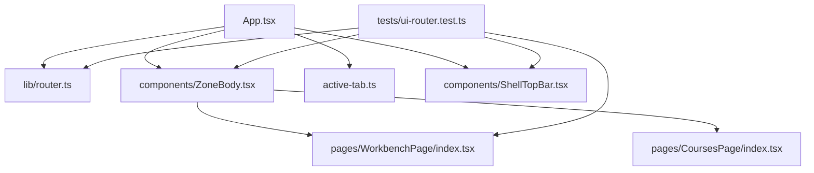
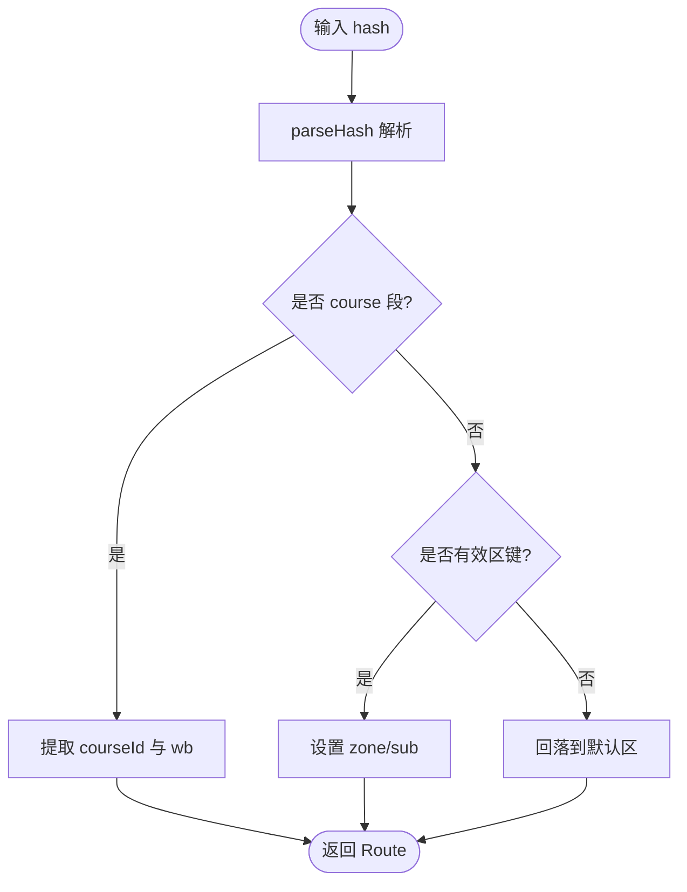
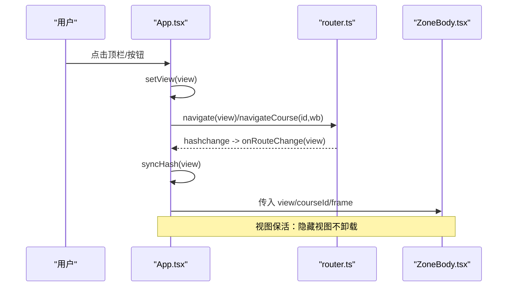
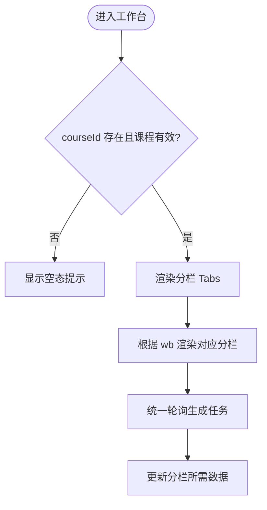
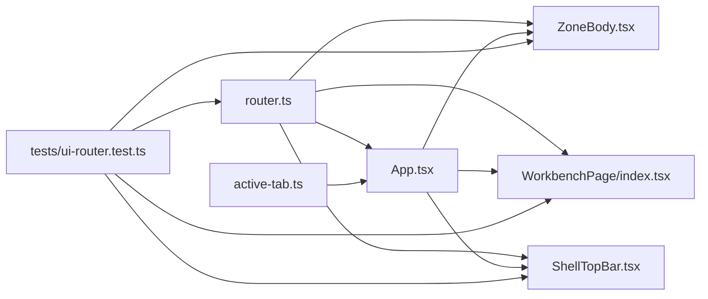

# 路由与导航系统

<cite>
**本文引用的文件**
- [ui/src/lib/router.ts](file://ui/src/lib/router.ts)
- [ui/src/App.tsx](file://ui/src/App.tsx)
- [ui/src/components/ZoneBody.tsx](file://ui/src/components/ZoneBody.tsx)
- [ui/src/active-tab.ts](file://ui/src/active-tab.ts)
- [ui/src/pages/WorkbenchPage/index.tsx](file://ui/src/pages/WorkbenchPage/index.tsx)
- [ui/src/pages/CoursesPage/index.tsx](file://ui/src/pages/CoursesPage/index.tsx)
- [ui/src/components/ShellTopBar.tsx](file://ui/src/components/ShellTopBar.tsx)
- [tests/ui-router.test.ts](file://tests/ui-router.test.ts)
</cite>

## 目录
1. [简介](#简介)
2. [项目结构](#项目结构)
3. [核心组件](#核心组件)
4. [架构总览](#架构总览)
5. [详细组件分析](#详细组件分析)
6. [依赖关系分析](#依赖关系分析)
7. [性能考量](#性能考量)
8. [故障排查指南](#故障排查指南)
9. [结论](#结论)
10. [附录：开发示例与调试技巧](#附录开发示例与调试技巧)

## 简介
本文件系统性地说明 LearnHub 前端基于 URL hash 的路由与导航方案，覆盖两级化路由（区视图 Zone + 子视图 Sub-view）、参数段工作台、导航逻辑、状态同步、守卫与权限控制、深链接支持以及错误处理策略。该方案以 location.hash 为唯一权威源，保证刷新直达、前进后退一致、URL 可分享且可被搜索引擎或外部工具引用。

## 项目结构
- 路由核心位于 lib/router.ts，提供解析、跳转、同步与事件订阅等能力。
- App.tsx 作为应用壳，负责将路由状态映射到渲染态，并维护全局上下文（课程、学习视图、焦点任务等）。
- ZoneBody.tsx 是“视图保活容器”，按视图键挂载对应页面，隐藏时保留状态。
- active-tab.ts 提供当前激活视图信号，用于页签保活与轮询门控。
- WorkbenchPage 实现单课工作台（参数段路由），CoursesPage 实现课程区首屏。
- ShellTopBar 提供五区页签与课程区三入口子导航。
- tests/ui-router.test.ts 对路由表完整性进行自动化校验，确保 UI 与路由契约一致。



图表来源
- [ui/src/App.tsx:48-117](file://ui/src/App.tsx#L48-L117)
- [ui/src/lib/router.ts:1-164](file://ui/src/lib/router.ts#L1-L164)
- [ui/src/components/ZoneBody.tsx:1-43](file://ui/src/components/ZoneBody.tsx#L1-L43)
- [ui/src/active-tab.ts:1-38](file://ui/src/active-tab.ts#L1-L38)
- [ui/src/pages/WorkbenchPage/index.tsx:1-85](file://ui/src/pages/WorkbenchPage/index.tsx#L1-L85)
- [ui/src/pages/CoursesPage/index.tsx:1-31](file://ui/src/pages/CoursesPage/index.tsx#L1-L31)
- [ui/src/components/ShellTopBar.tsx:1-64](file://ui/src/components/ShellTopBar.tsx#L1-L64)
- [tests/ui-router.test.ts:1-305](file://tests/ui-router.test.ts#L1-L305)

章节来源
- [ui/src/lib/router.ts:1-164](file://ui/src/lib/router.ts#L1-L164)
- [ui/src/App.tsx:48-117](file://ui/src/App.tsx#L48-L117)
- [ui/src/components/ZoneBody.tsx:1-43](file://ui/src/components/ZoneBody.tsx#L1-L43)
- [ui/src/active-tab.ts:1-38](file://ui/src/active-tab.ts#L1-L38)
- [ui/src/pages/WorkbenchPage/index.tsx:1-85](file://ui/src/pages/WorkbenchPage/index.tsx#L1-L85)
- [ui/src/pages/CoursesPage/index.tsx:1-31](file://ui/src/pages/CoursesPage/index.tsx#L1-L31)
- [ui/src/components/ShellTopBar.tsx:1-64](file://ui/src/components/ShellTopBar.tsx#L1-L64)
- [tests/ui-router.test.ts:1-305](file://tests/ui-router.test.ts#L1-L305)

## 核心组件
- 路由核心（lib/router.ts）
  - 定义区键、课程区子路由、工作台分栏、视图键常量及默认值。
  - 提供 parseHash、viewOfRoute、routeOfView、zoneOfView、navigate、navigateCourse、syncHash、onRouteChange 等函数。
  - 统一 URL 文法：#/zones、#/courses/{home|queue|proposals}、#/course/<id>/<wb>。
- 应用壳（App.tsx）
  - 初始化视图、监听路由变化、规范化 URL、桥接 active-tab 信号、维护课程与学习视图上下文。
  - 实现“无课程”守卫，拦截特定视图的访问。
- 视图保活容器（ZoneBody.tsx）
  - 按 visited 集合与 VIEW_KEYS 决定挂载哪些页面；隐藏视图不卸载，仅切换可见性。
- 激活信号（active-tab.ts）
  - 维护当前激活视图键，广播 learnhub:tab 事件，供各页在 keep-alive 下做“切回取数”等副作用。
- 单课工作台（WorkbenchPage/index.tsx）
  - 解析参数段路由，管理分栏切换，统一轮询生成任务，处理未知/已删课程的空态。
- 课程区首屏（CoursesPage/index.tsx）
  - 空仓时显示建课入口，有课时展示课程卡片网格。
- 顶栏（ShellTopBar.tsx）
  - 五区页签与课程区三入口子导航，驱动 goZone/goCourseSub 跳转。

章节来源
- [ui/src/lib/router.ts:24-164](file://ui/src/lib/router.ts#L24-L164)
- [ui/src/App.tsx:48-117](file://ui/src/App.tsx#L48-L117)
- [ui/src/components/ZoneBody.tsx:1-43](file://ui/src/components/ZoneBody.tsx#L1-L43)
- [ui/src/active-tab.ts:1-38](file://ui/src/active-tab.ts#L1-L38)
- [ui/src/pages/WorkbenchPage/index.tsx:1-85](file://ui/src/pages/WorkbenchPage/index.tsx#L1-L85)
- [ui/src/pages/CoursesPage/index.tsx:1-31](file://ui/src/pages/CoursesPage/index.tsx#L1-L31)
- [ui/src/components/ShellTopBar.tsx:1-64](file://ui/src/components/ShellTopBar.tsx#L1-L64)

## 架构总览
两级化路由设计：
- 一级：区（Zone）——今日、课程、洞察、项目、实践。
- 二级：子视图（Sub-view）——课程区包含“我的课程/生成队列/提案收件箱”三个入口；单课工作台通过参数段 #/course/<id>/<wb> 进入，内部再分栏（罗盘与图、教练台、生长与队列、提案、题库）。

URL 权威与状态同步：
- location.hash 是唯一权威；App 初始从 hash 解析视图，后续所有跳转均写 hash，hashchange 事件回灌渲染态。
- syncHash 在非一致性时 replaceState 规范化 URL，避免非法形残留。

视图保活与轮询门：
- ZoneBody 根据 visited 集合挂载页面，隐藏时保留状态。
- active-tab 提供 isActiveTab/onTabActive，结合 usePolling 实现“隐藏视图跳过取数但保持节拍”。

```mermaid
sequenceDiagram
participant U as "用户"
participant R as "router.ts"
participant A as "App.tsx"
participant Z as "ZoneBody.tsx"
participant W as "WorkbenchPage"
participant T as "active-tab.ts"
U->>R : 修改 hash前进/后退/手改/深链
R-->>A : onRouteChange(view)
A->>A : setView(view); syncHash(view)
A->>T : setActiveTab(view)
A->>Z : 传入 view/courseId/frame
Z-->>W : 当 view=courses.course 时挂载并传 courseId
Note over A,Z : 视图保活：非激活视图不卸载，仅隐藏
```

图表来源
- [ui/src/lib/router.ts:158-163](file://ui/src/lib/router.ts#L158-L163)
- [ui/src/App.tsx:102-117](file://ui/src/App.tsx#L102-L117)
- [ui/src/components/ZoneBody.tsx:21-39](file://ui/src/components/ZoneBody.tsx#L21-L39)
- [ui/src/pages/WorkbenchPage/index.tsx:33-39](file://ui/src/pages/WorkbenchPage/index.tsx#L33-L39)
- [ui/src/active-tab.ts:15-27](file://ui/src/active-tab.ts#L15-L27)

## 详细组件分析

### 路由核心（lib/router.ts）
- 数据模型
  - Route：包含 zone、sub、courseId、wb。
  - ViewKey：视图键，用于保活与轮询门；courses.course 共享一个视图键。
- 解析与转换
  - parseHash：支持五区键、课程区三入口、参数段工作台；非法/旧键回落默认。
  - viewOfRoute/routeOfView/zoneOfView：视图键与路由、区的互转。
- 导航与同步
  - navigate：非参数化视图跳转。
  - navigateCourse：参数段工作台跳转，编码课程 id。
  - syncHash：不一致时 replaceState 规范化；工作台视图键特殊处理。
  - onRouteChange：订阅 hashchange，回调解析后的视图键。



图表来源
- [ui/src/lib/router.ts:72-104](file://ui/src/lib/router.ts#L72-L104)

章节来源
- [ui/src/lib/router.ts:24-164](file://ui/src/lib/router.ts#L24-L164)

### 应用壳（App.tsx）
- 路由状态与渲染态双向同步：
  - 初始从 hash 解析视图；跳转时先更新本地状态再写 URL；hashchange 回灌视图并规范化 URL。
- 上下文管理：
  - 维护 status/tree/course/lesson/focusNode/focusJob/loading/fatal/helpOpen。
- 守卫与限制：
  - NO_COURSE_BLOCKED 列表中的视图在无课程时被阻止（如 insight），引导至课程区。
- 导航辅助：
  - go/goZone/openCourse/openLesson/locateInGraph/locateJob/reload。



图表来源
- [ui/src/App.tsx:48-117](file://ui/src/App.tsx#L48-L117)
- [ui/src/lib/router.ts:134-156](file://ui/src/lib/router.ts#L134-L156)

章节来源
- [ui/src/App.tsx:40-179](file://ui/src/App.tsx#L40-L179)

### 视图保活容器（ZoneBody.tsx）
- 使用 visited Set 记录首次访问过的视图键，并按 VIEW_KEYS 分支挂载对应页面。
- 隐藏视图通过 CSS 类控制可见性，状态跨视图存续。
- 单课工作台整体共享 'courses.course' 视图键，分栏切换不改视图键。

章节来源
- [ui/src/components/ZoneBody.tsx:1-43](file://ui/src/components/ZoneBody.tsx#L1-L43)

### 激活信号（active-tab.ts）
- 模块级 current 保存当前激活视图键，初始值来自路由解析。
- setActiveTab 仅在值变化时广播 learnhub:tab 事件，避免多余重取。
- onTabActive 提供按视图键订阅“切回”语义的钩子。

章节来源
- [ui/src/active-tab.ts:1-38](file://ui/src/active-tab.ts#L1-L38)

### 单课工作台（WorkbenchPage/index.tsx）
- 参数段路由：#/course/<id>/<wb>，wb 为分栏键。
- 分栏切换通过 frame.openCourse(course, wb) 写完整 hash，前进后退在分栏间穿梭。
- 统一轮询生成任务，过滤当前课程的任务。
- 未知/已删课程深链：显示空态并提供返回入口。



图表来源
- [ui/src/pages/WorkbenchPage/index.tsx:33-81](file://ui/src/pages/WorkbenchPage/index.tsx#L33-L81)

章节来源
- [ui/src/pages/WorkbenchPage/index.tsx:1-85](file://ui/src/pages/WorkbenchPage/index.tsx#L1-L85)

### 课程区首屏（CoursesPage/index.tsx）
- 无课程：显示建课入口与教练台空课形态。
- 有课程：展示课程卡片网格，点击进入单课工作台。

章节来源
- [ui/src/pages/CoursesPage/index.tsx:1-31](file://ui/src/pages/CoursesPage/index.tsx#L1-L31)

### 顶栏（ShellTopBar.tsx）
- 五区页签：today/courses/insight/projects/practice。
- 课程区三入口子导航：home/queue/proposals。
- 右侧预留通知位、帮助抽屉入口、主题切换。

章节来源
- [ui/src/components/ShellTopBar.tsx:1-64](file://ui/src/components/ShellTopBar.tsx#L1-L64)

## 依赖关系分析
- router.ts 被 App.tsx、ZoneBody.tsx、WorkbenchPage、ShellTopBar 等广泛消费。
- App.tsx 协调路由、active-tab、ZoneBody 与页面组件。
- tests/ui-router.test.ts 通过读取源码正则匹配，校验路由表与 UI 字面量表的一致性，防止“表在、入口不在”或“顺序漂移”等问题。



图表来源
- [ui/src/lib/router.ts:1-164](file://ui/src/lib/router.ts#L1-L164)
- [ui/src/App.tsx:1-180](file://ui/src/App.tsx#L1-L180)
- [ui/src/components/ZoneBody.tsx:1-43](file://ui/src/components/ZoneBody.tsx#L1-L43)
- [ui/src/pages/WorkbenchPage/index.tsx:1-85](file://ui/src/pages/WorkbenchPage/index.tsx#L1-L85)
- [ui/src/components/ShellTopBar.tsx:1-64](file://ui/src/components/ShellTopBar.tsx#L1-L64)
- [tests/ui-router.test.ts:1-305](file://tests/ui-router.test.ts#L1-L305)

章节来源
- [tests/ui-router.test.ts:188-305](file://tests/ui-router.test.ts#L188-L305)

## 性能考量
- 视图保活减少重复挂载开销，适合需要跨视图维持状态的页面（如练习会话）。
- active-tab 与 usePolling 配合，隐藏视图跳过取数但保持节拍，降低无效网络请求。
- 单课工作台统一轮询生成任务，避免多分栏重复打接口。
- 路由同步使用 replaceState 避免产生多余历史条目，提升用户体验。

[本节为通用指导，不直接分析具体文件]

## 故障排查指南
- 深链接无法直达
  - 检查 parseHash 是否能正确解析目标 hash；确认目标视图是否在 VIEW_KEYS 中。
  - 若为旧键（如 #/learn、#/courses/graph），会被回落到默认视图，属于已知断裂。
- 跳转后 URL 未更新
  - 确认调用的是 navigate/navigateCourse；对于参数段工作台必须用 navigateCourse。
  - 检查 syncHash 是否被调用（App 在视图变化时自动调用）。
- 前进/后退异常
  - 确认 onRouteChange 已订阅；检查 hashchange 事件是否正常触发。
- 视图不刷新
  - 检查 active-tab 是否正确设置；确认 onTabActive 钩子是否注册。
- 工作台分栏切换无效
  - 确认 frame.openCourse(course, wb) 被调用；检查 WorkbenchPage 的 onRouteChange 是否更新 wb。
- 无课程视图被拦截
  - 确认目标视图是否在 NO_COURSE_BLOCKED 列表中；必要时引导至课程区。

章节来源
- [ui/src/App.tsx:40-45](file://ui/src/App.tsx#L40-L45)
- [ui/src/lib/router.ts:72-104](file://ui/src/lib/router.ts#L72-L104)
- [ui/src/pages/WorkbenchPage/index.tsx:33-39](file://ui/src/pages/WorkbenchPage/index.tsx#L33-L39)
- [tests/ui-router.test.ts:55-170](file://tests/ui-router.test.ts#L55-L170)

## 结论
LearnHub 的前端路由与导航系统以 URL hash 为核心，采用两级化架构（区 + 子视图/参数段工作台），实现了稳定的深链接、前进后退一致性与视图保活。通过严格的测试门（路由表完整性校验）与清晰的职责划分（router/App/ZoneBody/active-tab），系统在可扩展性与可维护性之间取得平衡。未来可在不破坏现有契约的前提下扩展新区、新入口与新分栏。

[本节为总结，不直接分析具体文件]

## 附录：开发示例与调试技巧
- 新增区键
  - 在 ZONE_KEYS 中添加新键；在 ShellTopBar 添加对应 TabPane；在 ZoneBody 添加分支；确保 tests/ui-router.test.ts 的门能捕获变更。
- 新增课程区子入口
  - 在 COURSE_SUBS 中添加；在 ShellTopBar 的 COURSE_SUB_ITEMS 中添加；在 ZoneBody 添加分支；确保顺序一致。
- 新增工作台分栏
  - 在 WORKBENCH_SUBS 中添加；在 WorkbenchPage 的 WORKBENCH_ITEMS 中添加；在 ZoneBody 添加分支；确保顺序一致。
- 深链接支持
  - 使用 navigateCourse(courseId, wb) 生成规范 URL；确保 parseHash 能解析目标格式。
- 调试技巧
  - 在浏览器控制台手动修改 location.hash 并观察 onRouteChange 回调。
  - 使用 tests/ui-router.test.ts 中的断言思路验证解析与同步行为。
  - 利用 active-tab 的 onTabActive 钩子打印日志，确认“切回取数”时机。

章节来源
- [ui/src/lib/router.ts:24-164](file://ui/src/lib/router.ts#L24-L164)
- [ui/src/components/ShellTopBar.tsx:12-17](file://ui/src/components/ShellTopBar.tsx#L12-L17)
- [ui/src/components/ZoneBody.tsx:21-39](file://ui/src/components/ZoneBody.tsx#L21-L39)
- [ui/src/pages/WorkbenchPage/index.tsx:24-31](file://ui/src/pages/WorkbenchPage/index.tsx#L24-L31)
- [tests/ui-router.test.ts:55-170](file://tests/ui-router.test.ts#L55-L170)