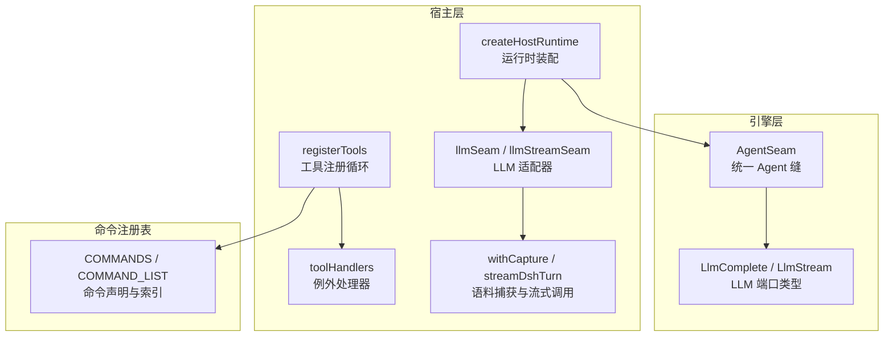
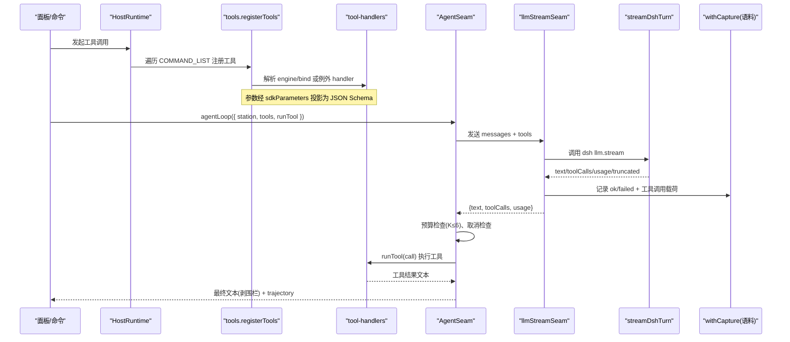
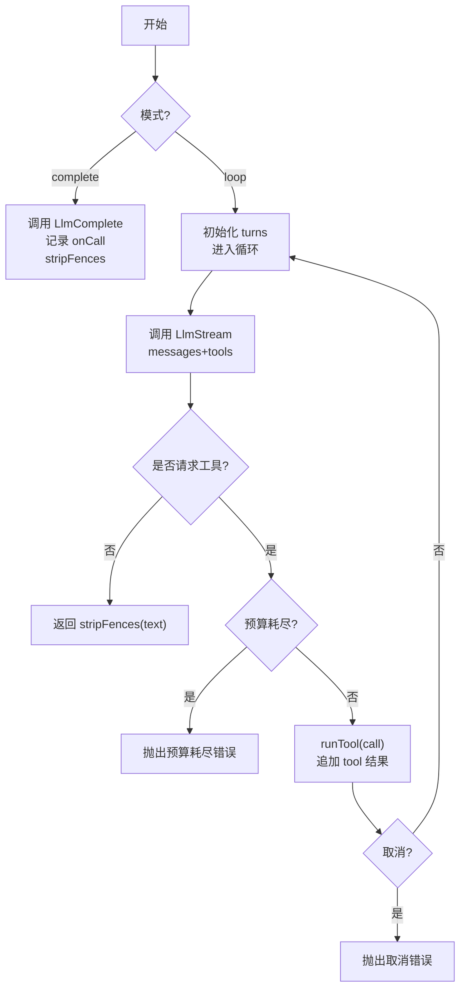
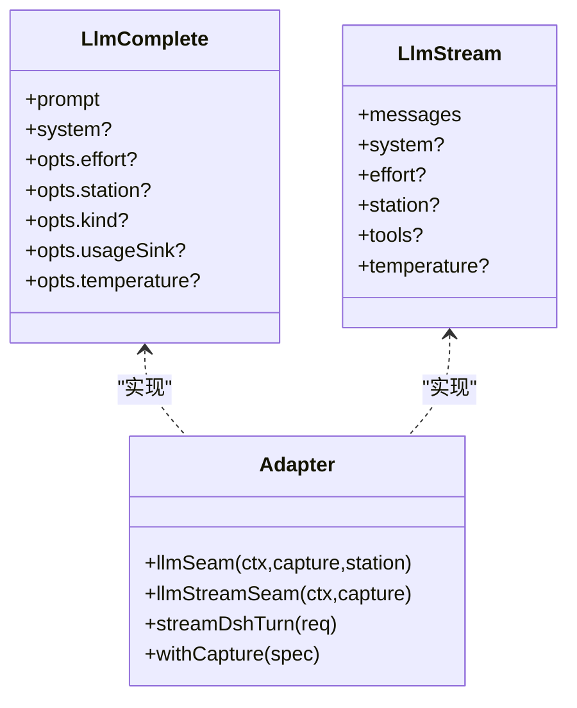
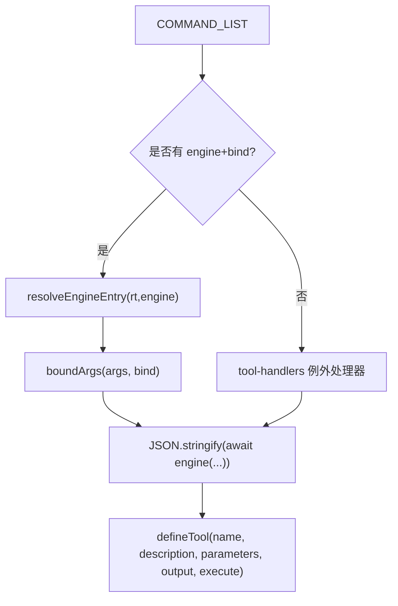
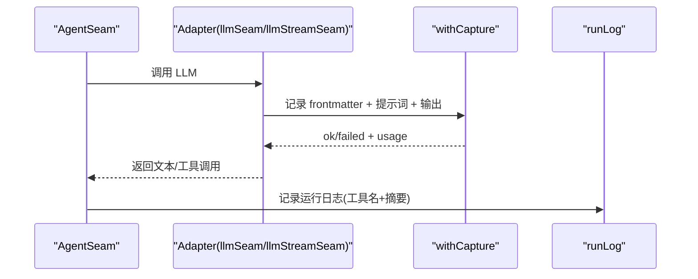
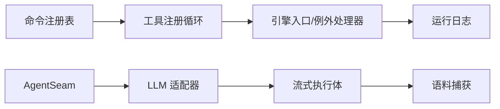

# Agent 工具系统

<cite>
**本文引用的文件**
- [src/engine/agent.ts](file://src/engine/agent.ts)
- [src/engine/llm.ts](file://src/engine/llm.ts)
- [src/host/tools.ts](file://src/host/tools.ts)
- [src/host/tool-handlers.ts](file://src/host/tool-handlers.ts)
- [src/host/runtime.ts](file://src/host/runtime.ts)
- [src/host/llm.ts](file://src/host/llm.ts)
- [src/commands/index.ts](file://src/commands/index.ts)
- [tests/llm-capture.test.ts](file://tests/llm-capture.test.ts)
- [tests/llm-temperature.test.ts](file://tests/llm-temperature.test.ts)
- [tests/host-runtime.test.ts](file://tests/host-runtime.test.ts)
</cite>

## 目录
1. [简介](#简介)
2. [项目结构](#项目结构)
3. [核心组件](#核心组件)
4. [架构总览](#架构总览)
5. [详细组件分析](#详细组件分析)
6. [依赖关系分析](#依赖关系分析)
7. [性能与可观测性](#性能与可观测性)
8. [故障排查指南](#故障排查指南)
9. [结论](#结论)
10. [附录：工具开发指南](#附录工具开发指南)

## 简介
本文件为 LearnHub Agent 工具系统的架构文档，聚焦统一 Agent 缝（AgentSeam）的设计模式与实现原理，解释如何通过单一接口暴露 111 个工具函数，并覆盖工具注册机制、调用协议、参数验证、错误处理、性能监控、LLM 适配器（含流式响应与上下文管理）、工具调用生命周期（调用前拦截、执行监控、结果缓存/落盘），以及新工具开发与测试方法。

## 项目结构
围绕 Agent 工具系统的关键代码分布在以下模块：
- 引擎层：统一 Agent 缝与 LLM 端口类型定义
- 宿主层：工具注册表驱动的工具面、例外处理器、运行时装配、LLM 适配与语料捕获
- 命令注册表：按域组织命令声明，支撑“一份声明、两个适配器”
- 测试：对 LLM 适配、温度透传、语料捕获、工具注册一致性等进行断言

**图表来源**
- [src/engine/agent.ts:1-227](file://src/engine/agent.ts#L1-L227)
- [src/engine/llm.ts:1-83](file://src/engine/llm.ts#L1-L83)
- [src/host/tools.ts:1-126](file://src/host/tools.ts#L1-L126)
- [src/host/tool-handlers.ts:1-288](file://src/host/tool-handlers.ts#L1-L288)
- [src/host/runtime.ts:1-255](file://src/host/runtime.ts#L1-L255)
- [src/host/llm.ts:1-390](file://src/host/llm.ts#L1-L390)
- [src/commands/index.ts:1-72](file://src/commands/index.ts#L1-L72)

**章节来源**
- [src/engine/agent.ts:1-227](file://src/engine/agent.ts#L1-L227)
- [src/engine/llm.ts:1-83](file://src/engine/llm.ts#L1-L83)
- [src/host/tools.ts:1-126](file://src/host/tools.ts#L1-L126)
- [src/host/tool-handlers.ts:1-288](file://src/host/tool-handlers.ts#L1-L288)
- [src/host/runtime.ts:1-255](file://src/host/runtime.ts#L1-L255)
- [src/host/llm.ts:1-390](file://src/host/llm.ts#L1-L390)
- [src/commands/index.ts:1-72](file://src/commands/index.ts#L1-L72)

## 核心组件
- 统一 Agent 缝（AgentSeam）
  - 提供 complete() 单发补全与 agentLoop() 有界工具回路（K≤6 轮预算封顶）。
  - 内置 stripFences 后处理、语义档贯通、调用日志 onCall、门错修复轮 gateRepairRound。
- LLM 端口（LlmComplete / LlmStream）
  - 纯类型端口，零导入外部 SDK；支持 effort、station、kind、usageSink、temperature。
  - 工具回路消息形态 LlmLoopTurn，工具规格 LlmToolSpec。
- 工具注册与分发
  - 通过命令注册表（COMMAND_LIST/BY_TOOL）驱动 registerTools，生成 defineTool 的 name/description/parameters/execute。
  - 走生成路径的由 resolveEngineEntry + run 包装；形状/实参需加工的走 tool-handlers 例外处理器。
- 运行时装配（createHostRuntime）
  - 构造 HostRuntime，注入 AgentSeam（complete/stream/onCall）、语料捕获器、任务表等。
- LLM 适配器（host/llm.ts）
  - 将引擎侧端口适配到 dsh llm.stream，负责空闲超时、截断重试、档位降级、温度透传、语料捕获。

**章节来源**
- [src/engine/agent.ts:1-227](file://src/engine/agent.ts#L1-L227)
- [src/engine/llm.ts:1-83](file://src/engine/llm.ts#L1-L83)
- [src/host/tools.ts:1-126](file://src/host/tools.ts#L1-L126)
- [src/host/tool-handlers.ts:1-288](file://src/host/tool-handlers.ts#L1-L288)
- [src/host/runtime.ts:1-255](file://src/host/runtime.ts#L1-L255)
- [src/host/llm.ts:1-390](file://src/host/llm.ts#L1-L390)

## 架构总览
下图展示从命令声明到工具执行、再到 LLM 回路的完整链路，包括参数投影、运行日志、语料捕获与取消传导。

**图表来源**
- [src/host/tools.ts:101-126](file://src/host/tools.ts#L101-L126)
- [src/host/tool-handlers.ts:23-288](file://src/host/tool-handlers.ts#L23-L288)
- [src/engine/agent.ts:122-186](file://src/engine/agent.ts#L122-L186)
- [src/host/llm.ts:201-222](file://src/host/llm.ts#L201-L222)
- [src/host/llm.ts:318-380](file://src/host/llm.ts#L318-L380)
- [src/host/llm.ts:112-165](file://src/host/llm.ts#L112-L165)

## 详细组件分析

### 统一 Agent 缝（AgentSeam）
- 双模式
  - complete(): 一次对话返回，自动 stripFences、记录 onCall、携带 usage。
  - agentLoop(): 多轮工具回路，维护 turns 历史，限制 K≤6 轮，失败/取消中断。
- 门错修复轮
  - gateRepairRound(): first→gate→repair(仅一次)→gate，仍败则 fatal 抛错。
- 观测面
  - onCall 回调包含 station/mode/effort/callNo/promptChars/replyChars/durationMs/usage。

**图表来源**
- [src/engine/agent.ts:93-120](file://src/engine/agent.ts#L93-L120)
- [src/engine/agent.ts:122-186](file://src/engine/agent.ts#L122-L186)
- [src/engine/agent.ts:188-220](file://src/engine/agent.ts#L188-L220)

**章节来源**
- [src/engine/agent.ts:1-227](file://src/engine/agent.ts#L1-L227)

### LLM 适配器（host/llm.ts）
- 补全适配器 llmSeam
  - 语义档 fast/deep → 部署 off/low；station/kind/usageSink/temperature 透传；withCapture 落盘。
- 流式适配器 llmStreamSeam
  - 将 LlmLoopTurn 转为 dsh Message，tools 直通 provider；withCapture 记录 toolCalls 原文。
- 流式执行体 streamDshTurn
  - 空闲超时、截断重试、错误码稳定化、usage 投影。

**图表来源**
- [src/engine/llm.ts:29-83](file://src/engine/llm.ts#L29-L83)
- [src/host/llm.ts:75-104](file://src/host/llm.ts#L75-L104)
- [src/host/llm.ts:201-222](file://src/host/llm.ts#L201-L222)
- [src/host/llm.ts:318-380](file://src/host/llm.ts#L318-L380)

**章节来源**
- [src/host/llm.ts:1-390](file://src/host/llm.ts#L1-L390)
- [src/engine/llm.ts:1-83](file://src/engine/llm.ts#L1-L83)

### 工具注册与调用协议
- 注册循环
  - 遍历 COMMAND_LIST，筛选 agent 通道，生成 defineTool：name=tool、description=summary、parameters=sdkParameters(args)、output=text。
  - execute：若存在 engine+bind，则走 resolveEngineEntry(rt, engine)(...boundArgs)，否则走 tool-handlers 例外处理器。
- 参数验证
  - 由 SDK 基于 parameters(JSON Schema) 校验必填与类型；sdkParameters 剥离投递层扩展键，保证工具面 schema 不变。
- 调用协议
  - 工具名唯一，schema 与行为探针快照一致（测试门⑧）。
  - 输出统一为文本字符串，便于模型消费。

**图表来源**
- [src/host/tools.ts:101-126](file://src/host/tools.ts#L101-L126)
- [src/host/tool-handlers.ts:23-288](file://src/host/tool-handlers.ts#L23-L288)
- [src/host/runtime.ts:204-215](file://src/host/runtime.ts#L204-L215)

**章节来源**
- [src/host/tools.ts:1-126](file://src/host/tools.ts#L1-L126)
- [src/host/tool-handlers.ts:1-288](file://src/host/tool-handlers.ts#L1-L288)
- [src/commands/index.ts:1-72](file://src/commands/index.ts#L1-L72)

### 工具调用的生命周期管理
- 调用前拦截
  - 参数校验：SDK 基于 JSON Schema 校验（required/type/enum/items）。
  - 白名单控制：agentLoop 仅允许 tools 白名单内的工具被调用。
- 执行监控
  - onCall 记录每次底层 LLM 调用（站/模式/档/序号/耗时/字数/usage）。
  - 运行日志：runLog 写入中心状态区运行日志.md（截断保护）。
- 结果缓存/落盘
  - 语料捕获：withCapture 在适配器出口记录 prompt/output/toolCalls/usage/outcome/code。
  - 工具调用载荷：arguments 原文不清洗，确保回路段可读。

**图表来源**
- [src/host/llm.ts:112-165](file://src/host/llm.ts#L112-L165)
- [src/host/runtime.ts:217-238](file://src/host/runtime.ts#L217-L238)
- [src/engine/agent.ts:188-220](file://src/engine/agent.ts#L188-L220)

**章节来源**
- [src/host/llm.ts:1-390](file://src/host/llm.ts#L1-L390)
- [src/host/runtime.ts:1-255](file://src/host/runtime.ts#L1-L255)
- [src/engine/agent.ts:1-227](file://src/engine/agent.ts#L1-L227)

### 使用示例与最佳实践
- 单发补全
  - 通过 AgentSeam.complete(station, prompt, opts) 获取净文本（自动剥围栏）。
- 工具回路
  - 通过 AgentSeam.agentLoop({ station, prompt, system?, effort?, tools, runTool, isCancelled? }) 进行多轮交互，注意 K≤6 预算与取消旗标。
- 温度透传
  - 调用点默认不设置 temperature；需要时通过 opts.temperature 透传到 provider（测试断言缺省不出现该键）。
- 最佳实践
  - 工具描述与参数 schema 保持最小必要集合，避免过度复杂。
  - 工具实现尽量幂等，便于重试与回放。
  - 长耗时操作建议入队异步执行，工具只返回任务 key 与状态查询入口。

**章节来源**
- [src/engine/agent.ts:93-120](file://src/engine/agent.ts#L93-L120)
- [src/engine/agent.ts:122-186](file://src/engine/agent.ts#L122-L186)
- [tests/llm-temperature.test.ts:1-59](file://tests/llm-temperature.test.ts#L1-L59)

## 依赖关系分析
- 松耦合设计
  - 引擎层仅依赖 LLM 端口类型，不引入 dsh/cordis；实现集中在宿主适配器。
- 关键依赖链
  - 命令注册表 → 工具注册循环 → 例外处理器/引擎入口 → 运行时 runLog。
  - AgentSeam → LLM 适配器 → 流式执行体 → 语料捕获。
- 潜在环风险
  - 检索审计形状住中立词汇层，避免 note-source → question-bank → vault-prior → note-source 环（见相关说明）。

**图表来源**
- [src/commands/index.ts:1-72](file://src/commands/index.ts#L1-L72)
- [src/host/tools.ts:101-126](file://src/host/tools.ts#L101-L126)
- [src/host/tool-handlers.ts:23-288](file://src/host/tool-handlers.ts#L23-L288)
- [src/host/runtime.ts:217-238](file://src/host/runtime.ts#L217-L238)
- [src/host/llm.ts:318-380](file://src/host/llm.ts#L318-L380)
- [src/host/llm.ts:112-165](file://src/host/llm.ts#L112-L165)

**章节来源**
- [src/commands/index.ts:1-72](file://src/commands/index.ts#L1-L72)
- [src/host/tools.ts:1-126](file://src/host/tools.ts#L1-L126)
- [src/host/tool-handlers.ts:1-288](file://src/host/tool-handlers.ts#L1-L288)
- [src/host/runtime.ts:1-255](file://src/host/runtime.ts#L1-L255)
- [src/host/llm.ts:1-390](file://src/host/llm.ts#L1-L390)

## 性能与可观测性
- 性能特性
  - 工具回路预算封顶（K≤6）防止自激循环。
  - 空闲超时与截断重试提升鲁棒性。
  - 语义档分层（fast/deep）平衡成本与质量。
- 可观测性
  - onCall 记录每次底层 LLM 调用（站/模式/档/序号/耗时/字数/usage）。
  - 运行日志写入中心状态区，便于回溯。
  - 语料捕获在适配器出口落盘，包含提示词、输出、工具调用载荷与 token 计量。

**章节来源**
- [src/engine/agent.ts:36-56](file://src/engine/agent.ts#L36-L56)
- [src/host/llm.ts:64-68](file://src/host/llm.ts#L64-L68)
- [src/host/llm.ts:277-298](file://src/host/llm.ts#L277-L298)
- [src/host/runtime.ts:170-182](file://src/host/runtime.ts#L170-L182)
- [src/host/llm.ts:112-165](file://src/host/llm.ts#L112-L165)

## 故障排查指南
- 常见错误
  - 工具回路预算耗尽：K≤6 轮后仍在请求工具，抛出中止错误。
  - 任务取消：isCancelled=true 时立即中止并丢弃已产结果。
  - 模型调用失败：稳定错误码（如 AUTH/RATE_LIMIT）原样上抛，语料标记 failed。
  - 参数校验失败：SDK 基于 JSON Schema 拒绝非法或缺失必填项。
- 定位方法
  - 查看运行日志与语料文件（state/生成语料/<站>/），核对提示词与工具调用载荷。
  - 检查 onCall 记录与 usage 计量，确认调用次数与 token 消耗。
  - 针对温度问题，确认调用点未显式设置 temperature（缺省透传宿主默认）。

**章节来源**
- [src/engine/agent.ts:122-186](file://src/engine/agent.ts#L122-L186)
- [src/host/llm.ts:318-380](file://src/host/llm.ts#L318-L380)
- [tests/llm-capture.test.ts:1-87](file://tests/llm-capture.test.ts#L1-L87)
- [tests/llm-temperature.test.ts:1-59](file://tests/llm-temperature.test.ts#L1-L59)

## 结论
LearnHub Agent 工具系统通过统一 Agent 缝与纯类型 LLM 端口，实现了高内聚、低耦合的工具生态。注册表驱动的“一份声明、两个适配器”确保了工具面与路由面的一致性；适配器层的流式处理、空闲超时、截断重试与温度透传提升了鲁棒性与可控性；onCall 与语料捕获提供了完整的可观测性。遵循本文的开发指南与最佳实践，可高效扩展与维护工具集。

## 附录：工具开发指南
- 新工具注册步骤
  - 在命令注册表中添加命令声明（包含 id、args、channels.agent.tool、engine/bind 或例外处理器）。
  - 若走生成路径：填写 engine 与 bind，确保 resolveEngineEntry 可解析。
  - 若形状/实参需加工：在 tool-handlers 中添加例外处理器。
  - 更新 AGENT_GUIDE（可选）以提供面板引导文案与示例 prompt。
- 类型定义
  - 使用 sdkParameters 投影 args 为 JSON Schema，确保必填与类型正确。
  - 输出统一为文本字符串，便于模型消费。
- 测试方法
  - 使用行为探针与快照断言工具面 schema 与行为零漂移。
  - 通过假 ctx.llm.stream 脚本化应答，验证 agentLoop 的多轮逻辑与取消传导。
  - 使用 withCapture 断言语料捕获内容（提示词、输出、工具调用载荷、usage）。
- 最佳实践
  - 工具实现幂等、短小、职责单一。
  - 长耗时操作入队异步执行，工具返回任务 key 与状态查询。
  - 严格遵循参数校验与错误处理契约，避免静默失败。

**章节来源**
- [src/commands/index.ts:1-72](file://src/commands/index.ts#L1-L72)
- [src/host/tools.ts:101-126](file://src/host/tools.ts#L101-L126)
- [src/host/tool-handlers.ts:23-288](file://src/host/tool-handlers.ts#L23-L288)
- [tests/host-runtime.test.ts:1198-1217](file://tests/host-runtime.test.ts#L1198-L1217)
- [tests/llm-capture.test.ts:1-87](file://tests/llm-capture.test.ts#L1-L87)