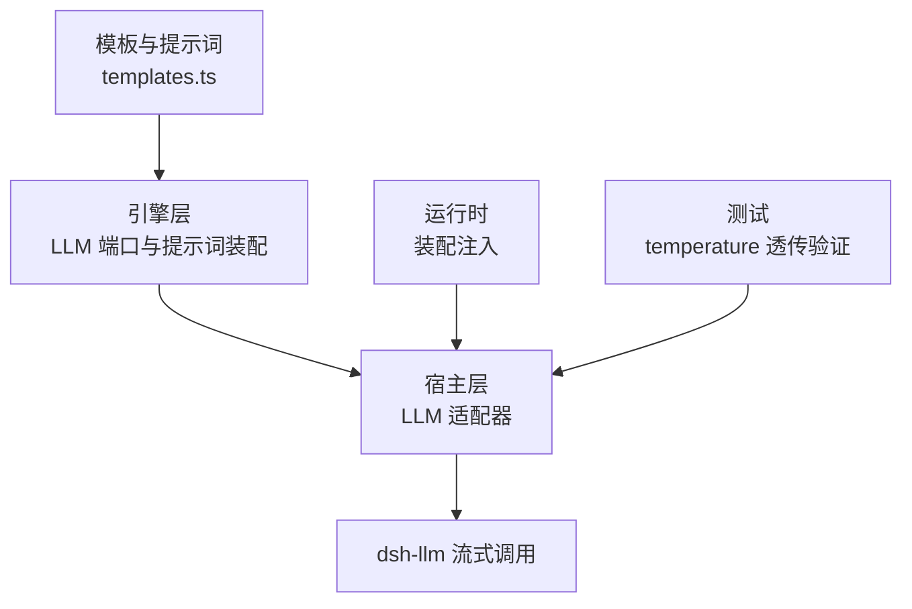
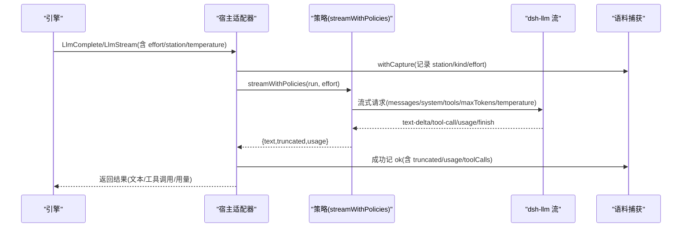
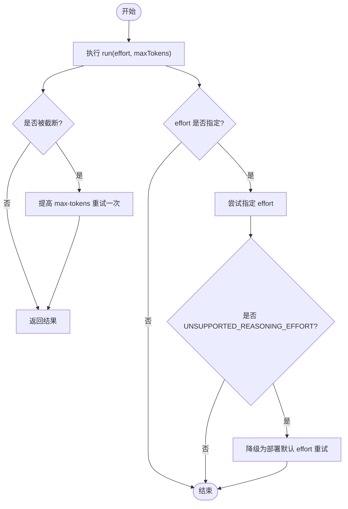
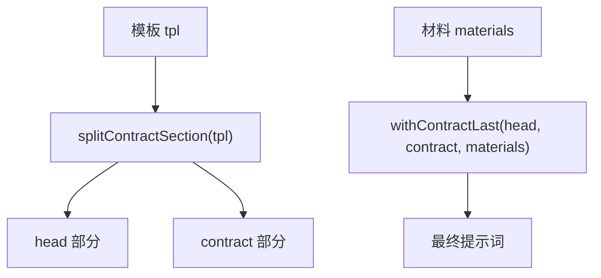
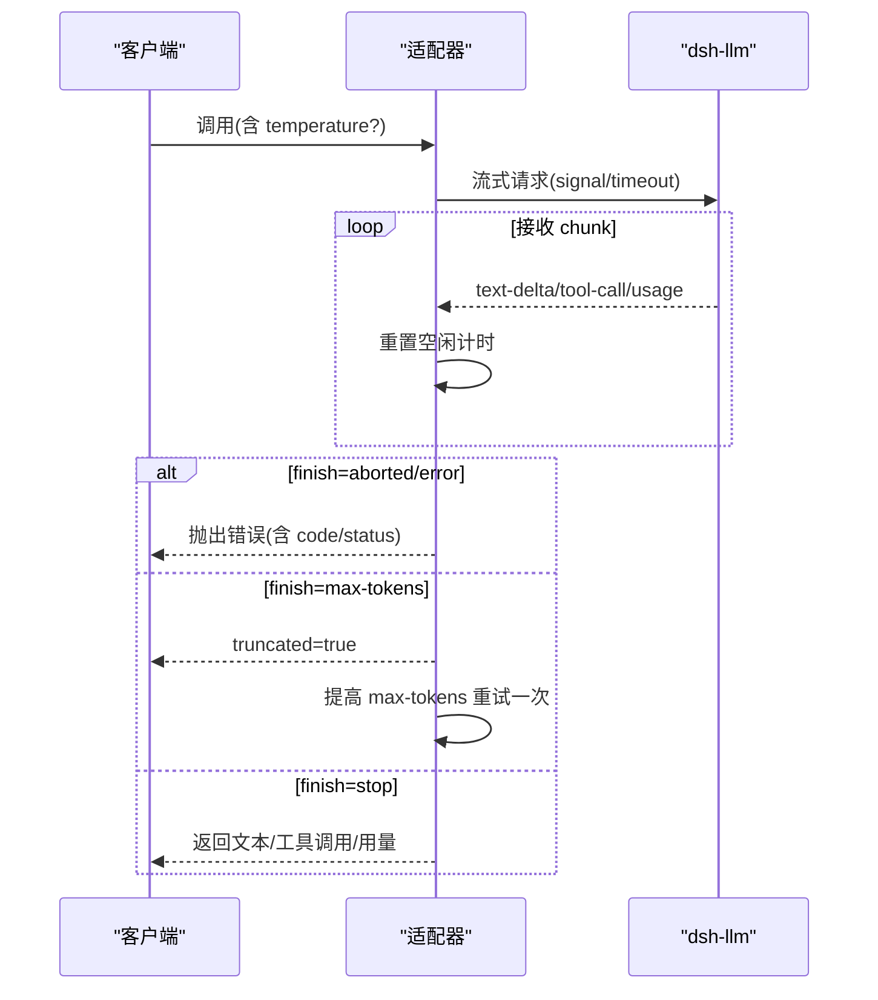
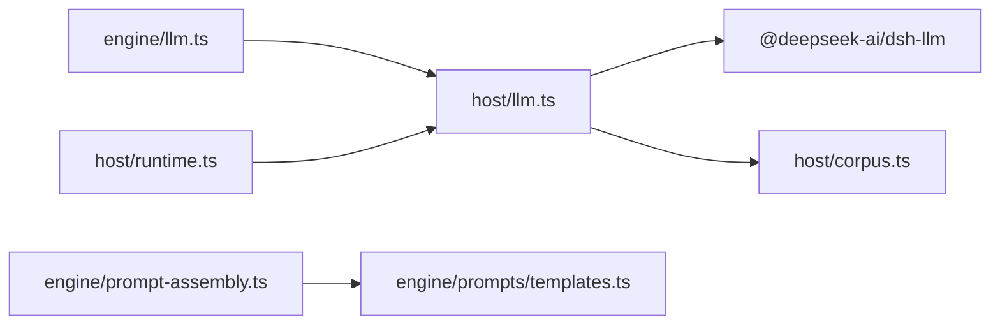

# LLM 适配器集成

<cite>
**本文引用的文件**
- [src/engine/llm.ts](file://src/engine/llm.ts)
- [src/host/llm.ts](file://src/host/llm.ts)
- [src/host/runtime.ts](file://src/host/runtime.ts)
- [src/engine/prompt-assembly.ts](file://src/engine/prompt-assembly.ts)
- [src/engine/prompts/templates.ts](file://src/engine/prompts/templates.ts)
- [tests/llm-temperature.test.ts](file://tests/llm-temperature.test.ts)
</cite>

## 目录
1. [简介](#简介)
2. [项目结构](#项目结构)
3. [核心组件](#核心组件)
4. [架构总览](#架构总览)
5. [详细组件分析](#详细组件分析)
6. [依赖关系分析](#依赖关系分析)
7. [性能与可靠性](#性能与可靠性)
8. [故障排查指南](#故障排查指南)
9. [结论](#结论)
10. [附录：配置与最佳实践](#附录配置与最佳实践)

## 简介
本技术文档面向 LearnHub 的 LLM 适配器集成，系统性说明以下要点：
- 设计模式：通过“端口 + 适配器”将引擎侧与宿主侧解耦，屏蔽不同大模型提供商的差异。
- 流式响应处理：增量输出、空闲超时中断、截断重试与错误恢复。
- 提示词组装系统：模板管理、契约段后置拼装、变量替换与上下文构建。
- 高级特性：温度控制、重试策略、超时处理、思考档位翻译与降级。
- 多提供商配置示例与集成指南：基于宿主配置视图与测试用例，给出可操作的部署建议与性能优化实践。

## 项目结构
LearnHub 在 LLM 相关能力上采用清晰的分层：
- 引擎层（engine）：定义中立接口与类型（LlmComplete/LlmStream），以及提示词装配工具。
- 宿主层（host）：实现具体适配逻辑，对接 dsh-llm 流式调用，统一捕获语料、统计用量、执行策略。
- 运行时（runtime）：装配注入点，将宿主适配器注入到 AgentSeam，供引擎消费。
- 模板与提示词（prompts/templates）：集中维护生成站模板，配合契约后置拼装形成最终 prompt。
- 测试（tests）：验证 temperature 透传、默认行为不变等关键不变式。



图表来源
- [src/engine/llm.ts:1-83](file://src/engine/llm.ts#L1-L83)
- [src/host/llm.ts:1-390](file://src/host/llm.ts#L1-L390)
- [src/host/runtime.ts:138-193](file://src/host/runtime.ts#L138-L193)
- [src/engine/prompts/templates.ts:1-602](file://src/engine/prompts/templates.ts#L1-L602)
- [tests/llm-temperature.test.ts:1-127](file://tests/llm-temperature.test.ts#L1-L127)

章节来源
- [src/engine/llm.ts:1-83](file://src/engine/llm.ts#L1-L83)
- [src/host/runtime.ts:138-193](file://src/host/runtime.ts#L138-L193)

## 核心组件
- 引擎侧 LLM 端口
  - LlmComplete：一次性补全调用，返回完整文本；支持 effort/station/kind/usageSink/temperature。
  - LlmStream：工具回路流式调用，返回文本、工具调用列表与可选 token 用量；支持 messages/system/tools/effort/station/temperature。
  - LlmTokenUsage：输入/输出/推理 token 计量投影。
  - LlmToolSpec/LlmToolCall/LlmLoopTurn：工具规格、工具调用与回路历史消息的中立形态。
- 宿主侧 LLM 适配器
  - llmSeam / llmStreamSeam：将引擎端口映射到 dsh-llm 流式调用，封装捕获、策略与降级。
  - streamWithPolicies：截断重试与思考档位不支持时的自动降级重试。
  - streamDshTurn：流式收集 text-delta、tool-call、usage，空闲超时中断，finish 异常抛错。
- 运行时装配
  - createHostRuntime：构造 HostRuntime，注入 AgentSeam 的 complete/stream 为宿主适配器闭包。
- 提示词装配
  - splitContractSection / withContractLast / repairRoundPrompt：契约段后置、修复轮提示词拼装。
  - templates.ts：集中维护各生成站模板，约定 vN 版本标记与 {{renderers}} 占位符。

章节来源
- [src/engine/llm.ts:14-83](file://src/engine/llm.ts#L14-L83)
- [src/host/llm.ts:34-222](file://src/host/llm.ts#L34-L222)
- [src/host/runtime.ts:138-193](file://src/host/runtime.ts#L138-L193)
- [src/engine/prompt-assembly.ts:11-43](file://src/engine/prompt-assembly.ts#L11-L43)
- [src/engine/prompts/templates.ts:1-602](file://src/engine/prompts/templates.ts#L1-L602)

## 架构总览
下图展示从引擎调用到宿主适配器再到 dsh-llm 的完整链路，包括捕获、策略与降级。



图表来源
- [src/host/llm.ts:75-104](file://src/host/llm.ts#L75-L104)
- [src/host/llm.ts:112-165](file://src/host/llm.ts#L112-L165)
- [src/host/llm.ts:281-298](file://src/host/llm.ts#L281-L298)
- [src/host/llm.ts:318-380](file://src/host/llm.ts#L318-L380)

## 详细组件分析

### 引擎侧 LLM 端口设计
- 目标：提供与 provider 无关的调用面，使引擎不感知 dsh-llm 或任何第三方 SDK。
- 关键类型
  - LlmComplete：prompt/system/opts(effort/station/kind/usageSink/temperature)。
  - LlmStream：messages/system/effort/station/tools/temperature，返回 {text, toolCalls, usage?}。
  - LlmTokenUsage：inputTokens/outputTokens/reasoningTokens?。
  - LlmToolSpec/LlmToolCall/LlmLoopTurn：工具回路的结构化消息。
- 设计要点
  - 语义档 effort 仅用于标注（fast/deep），由宿主翻译成部署配置（off/low）。
  - temperature 为可选参数，缺省不传即使用宿主默认值，避免改变既有行为。
  - usageSink 回调用于观测 token 用量，便于审计与计费。

```mermaid
classDiagram
class LlmComplete {
+call(prompt, system?, opts?) Promise~string~
}
class LlmStream {
+call(req) Promise~{text, toolCalls, usage?}~
}
class LlmTokenUsage {
+inputTokens number
+outputTokens number
+reasoningTokens? number
}
class LlmToolSpec {
+name string
+description string
+parameters Record
}
class LlmToolCall {
+id string
+name string
+arguments string
}
class LlmLoopTurn {
+role user|assistant|tool
+text? string
+toolCalls? LlmToolCall[]
+callId? string
+isError? boolean
}
LlmStream --> LlmToolCall : "产出"
LlmStream --> LlmTokenUsage : "可选"
LlmLoopTurn --> LlmToolCall : "引用"
```

图表来源
- [src/engine/llm.ts:14-83](file://src/engine/llm.ts#L14-L83)

章节来源
- [src/engine/llm.ts:14-83](file://src/engine/llm.ts#L14-L83)

### 宿主侧适配器与流式处理
- 适配器职责
  - 将引擎端口映射到 dsh-llm 流式调用。
  - 统一捕获语料（station/kind/effort/outcome/truncated/usage/provider/model/prompt/output/toolCalls）。
  - 执行策略：截断重试、思考档位不支持时降级重试。
  - 空闲超时中断：无新输出超过阈值则中止并抛出明确错误。
- 关键流程
  - llmComplete：一次性补全，内部走 streamWithPolicies → streamDshTurn。
  - llmStreamSeam：工具回路，将 LlmLoopTurn 转为 dsh Message，tools 直通 provider。
  - streamWithPolicies：若 truncated=true 则提高 max-tokens 重试一次；若 UNSUPPORTED_REASONING_EFFORT 则降级 effort 重试一次。
  - streamDshTurn：累积 text-delta，收集 tool-call 块与 usage，finish 异常抛错，max-tokens 设置 truncated。



图表来源
- [src/host/llm.ts:281-298](file://src/host/llm.ts#L281-L298)
- [src/host/llm.ts:318-380](file://src/host/llm.ts#L318-L380)

章节来源
- [src/host/llm.ts:75-104](file://src/host/llm.ts#L75-L104)
- [src/host/llm.ts:112-165](file://src/host/llm.ts#L112-L165)
- [src/host/llm.ts:201-222](file://src/host/llm.ts#L201-L222)
- [src/host/llm.ts:281-298](file://src/host/llm.ts#L281-L298)
- [src/host/llm.ts:318-380](file://src/host/llm.ts#L318-L380)

### 提示词组装系统
- 模板管理
  - templates.ts 集中维护所有生成站模板，键为站点名；每条模板首行包含版本标记（vN），与变更日志同源。
  - 模板内不允许直接字符串插值，变量替换由运行时完成（如 {{renderers}}）。
- 契约段后置
  - splitContractSection：定位最后一个“## 输出…”标题，将其作为契约段分离。
  - withContractLast：将材料（上下文/任务/修复反馈）置于前，契约段置尾，确保“只输出 X”离生成点最近。
  - repairRoundPrompt：修复轮提示词，携带上一次输出与校验清单，仍保持契约段置尾。
- 上下文构建
  - 各生成站在调用前准备材料，经 withContractLast 拼装后进入 LLM 调用。
  - 工具回路中，循环历史以可读形式渲染（LOOP_PROMPT_* 模板），保留工具调用原始参数以便后续轮次理解。



图表来源
- [src/engine/prompt-assembly.ts:11-43](file://src/engine/prompt-assembly.ts#L11-L43)
- [src/engine/prompts/templates.ts:1-602](file://src/engine/prompts/templates.ts#L1-L602)

章节来源
- [src/engine/prompt-assembly.ts:11-43](file://src/engine/prompt-assembly.ts#L11-L43)
- [src/engine/prompts/templates.ts:1-602](file://src/engine/prompts/templates.ts#L1-L602)

### 温度控制、重试策略与超时处理
- 温度控制
  - 引擎端口 LlmComplete/LlmStream 均支持可选 temperature；缺省不传即使用宿主默认。
  - 适配器透传 temperature 到 dsh-llm 请求；测试覆盖“不给值不得出现 temperature 键”的不变式。
- 重试策略
  - 截断重试：当 truncated=true 时，提高 max-tokens 并重试一次。
  - 思考档位降级：若收到 UNSUPPORTED_REASONING_EFFORT，自动降级为部署默认 effort 重试一次。
- 超时处理
  - 空闲超时：每收到一个 chunk 重置计时器；超过 LLM_IDLE_TIMEOUT_MS 无新输出则中止并抛出明确错误。
  - finish 异常：aborted/error 分支抛出错误，error 分支附带稳定错误码（failure.code/status/message）。



图表来源
- [src/host/llm.ts:318-380](file://src/host/llm.ts#L318-L380)
- [tests/llm-temperature.test.ts:72-127](file://tests/llm-temperature.test.ts#L72-L127)

章节来源
- [src/host/llm.ts:281-298](file://src/host/llm.ts#L281-L298)
- [src/host/llm.ts:318-380](file://src/host/llm.ts#L318-L380)
- [tests/llm-temperature.test.ts:72-127](file://tests/llm-temperature.test.ts#L72-L127)

### 运行时装配与注入
- createHostRuntime 负责：
  - 校验部署路径与学习中心目录。
  - 初始化引擎、AgentSeam、语料捕获器。
  - 将宿主适配器（llmSeam/llmStreamSeam）注入到 AgentSeam，供引擎消费。
- 观察性
  - onCall 回调记录 station/mode/callNo/effort/durationMs/字符数/token 用量。
  - 运行日志写入 centerStateDir/运行日志.md，失败也留痕。

章节来源
- [src/host/runtime.ts:138-193](file://src/host/runtime.ts#L138-L193)
- [src/host/runtime.ts:217-255](file://src/host/runtime.ts#L217-L255)

## 依赖关系分析
- 耦合与内聚
  - 引擎层仅依赖中立类型与提示词装配工具，不引入 dsh-llm 或 cordis。
  - 宿主层集中所有外部依赖（@deepseek-ai/dsh-llm、cordis Context），保证引擎侧零耦合。
- 直接/间接依赖
  - engine/llm.ts → host/llm.ts（运行时注入）。
  - host/runtime.ts → host/llm.ts（装配注入）。
  - engine/prompt-assembly.ts → engine/prompts/templates.ts（模板与契约段）。
- 外部集成点
  - dsh-llm 流式接口（stream）、消息构造（user/assistant/tool-result）、ReasoningEffortId。
  - 语料捕获（corpus.record）用于落盘与审计。



图表来源
- [src/engine/llm.ts:1-83](file://src/engine/llm.ts#L1-L83)
- [src/host/llm.ts:1-390](file://src/host/llm.ts#L1-L390)
- [src/host/runtime.ts:138-193](file://src/host/runtime.ts#L138-L193)
- [src/engine/prompt-assembly.ts:11-43](file://src/engine/prompt-assembly.ts#L11-L43)
- [src/engine/prompts/templates.ts:1-602](file://src/engine/prompts/templates.ts#L1-L602)

章节来源
- [src/host/llm.ts:1-390](file://src/host/llm.ts#L1-L390)
- [src/host/runtime.ts:138-193](file://src/host/runtime.ts#L138-L193)

## 性能与可靠性
- 流式增量输出：text-delta 累积，减少阻塞，提升交互体验。
- 空闲超时中断：防止长时间无输出导致资源占用，及时释放信号与定时器。
- 截断重试：针对 max-tokens 导致的 JSON/YAML 断尾问题，自动提高输出上限重试一次。
- 思考档位降级：当路由不支持指定 effort 时，自动降级为部署默认并重试一次。
- 用量统计：usage chunk 在 finish 前发出，投影为端口中立 LlmTokenUsage，便于审计与成本估算。
- 语料捕获：成功/失败均落盘，包含 provider/model/effort/truncated/usage/prompt/output/toolCalls，便于离线评审与问题定位。

[本节为通用指导，无需特定文件来源]

## 故障排查指南
- 常见错误与定位
  - 空闲超时：抛出“模型输出空闲超时（Xs 无新输出），已中止本次调用”，检查网络与模型响应速度。
  - 调用失败：错误信息包含 failure.code/status/message，如 NO_ADAPTER/MISSING_CREDENTIAL/AUTH/RATE_LIMIT 等，按代码定位配置或配额问题。
  - 未返回内容：text.trim() 为空且无 toolCalls 时抛出“模型没有返回内容”，检查提示词与模型行为。
- 调试建议
  - 查看运行日志：centerStateDir/运行日志.md 记录每次引擎调用摘要与失败原因。
  - 检查语料捕获：确认 station/kind/effort/outcome/truncated/usage 是否齐全，辅助定位问题阶段。
  - 温度与 effort：通过测试用例验证 temperature 透传与 effort 降级是否符合预期。

章节来源
- [src/host/llm.ts:318-380](file://src/host/llm.ts#L318-L380)
- [src/host/runtime.ts:217-255](file://src/host/runtime.ts#L217-L255)
- [tests/llm-temperature.test.ts:72-127](file://tests/llm-temperature.test.ts#L72-L127)

## 结论
LearnHub 的 LLM 适配器通过“端口 + 适配器”的设计实现了引擎与宿主的清晰解耦，屏蔽了不同大模型提供商的差异。流式响应处理具备增量输出、空闲超时中断、截断重试与错误恢复能力；提示词组装系统通过模板管理与契约段后置拼装，确保输出契约靠近生成点。温度控制、重试策略与超时处理提供了高可靠性的调用保障。结合运行时装配与语料捕获，系统具备良好的可观测性与可维护性。

[本节为总结，无需特定文件来源]

## 附录：配置与最佳实践
- 配置视图
  - llmView 暴露当前 provider/model/fast_effort/deep_effort，面板只读展示；切换模型需编辑 profile patch 并重启宿主。
- 多提供商配置示例
  - 默认配置：provider='deepseek-official'，model='deepseek-v4-flash'，fastEffort='off'，deepEffort='low'。
  - 切换提供商：修改宿主配置文件中的 provider/model 字段，重启宿主生效。
- 集成指南
  - 引擎调用点一律不显式设置 temperature，除非 spike 等显式消费方需要；缺省使用宿主默认。
  - 工具回路：传入 tools 白名单，适配器会将其转换为 dsh ToolSchema 直通 provider。
  - 语料捕获：确保 corpus.record 可用，便于离线评审与问题回溯。
- 性能优化建议
  - 合理设置 effort：机械调用使用 fast 档，高复杂度节点使用 deep 档。
  - 监控 usage：通过 usageSink 统计 token 用量，评估成本与性能。
  - 避免过长提示词：利用模板与契约段后置，减少冗余信息，降低截断风险。
- 最佳实践
  - 保持 temperature 缺省：避免改变既有行为，仅在必要时显式设置。
  - 关注截断与降级：遇到 truncated 或 UNSUPPORTED_REASONING_EFFORT 时，系统会自动重试与降级，无需手动干预。
  - 定期审查运行日志与语料：及时发现异常与优化空间。

章节来源
- [src/host/llm.ts:34-55](file://src/host/llm.ts#L34-L55)
- [src/host/llm.ts:75-104](file://src/host/llm.ts#L75-L104)
- [src/host/llm.ts:201-222](file://src/host/llm.ts#L201-L222)
- [tests/llm-temperature.test.ts:72-127](file://tests/llm-temperature.test.ts#L72-L127)