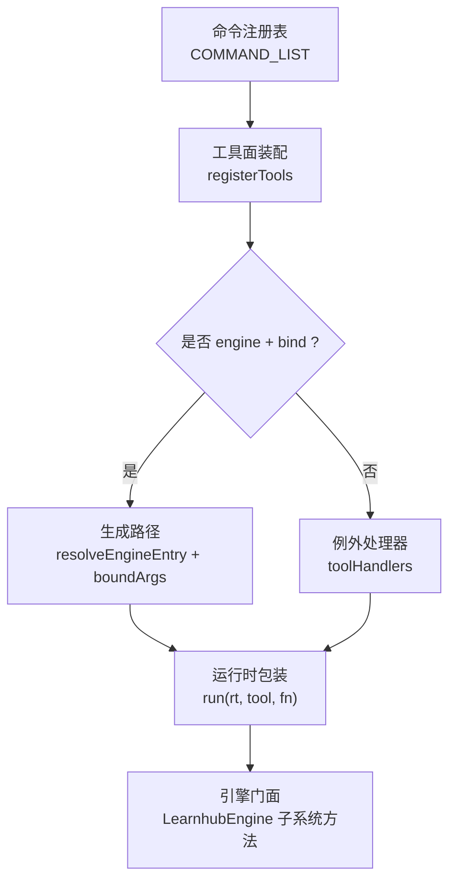
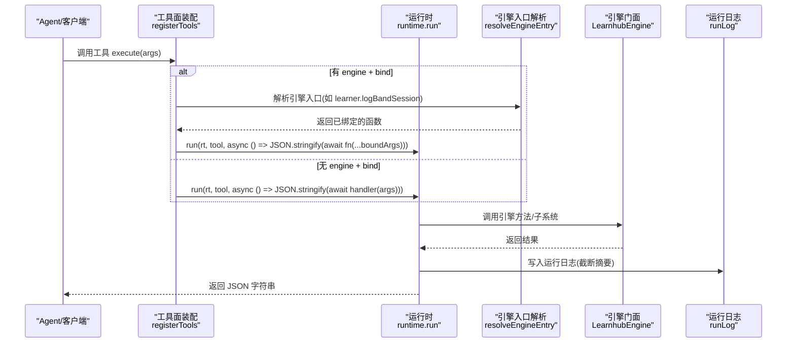
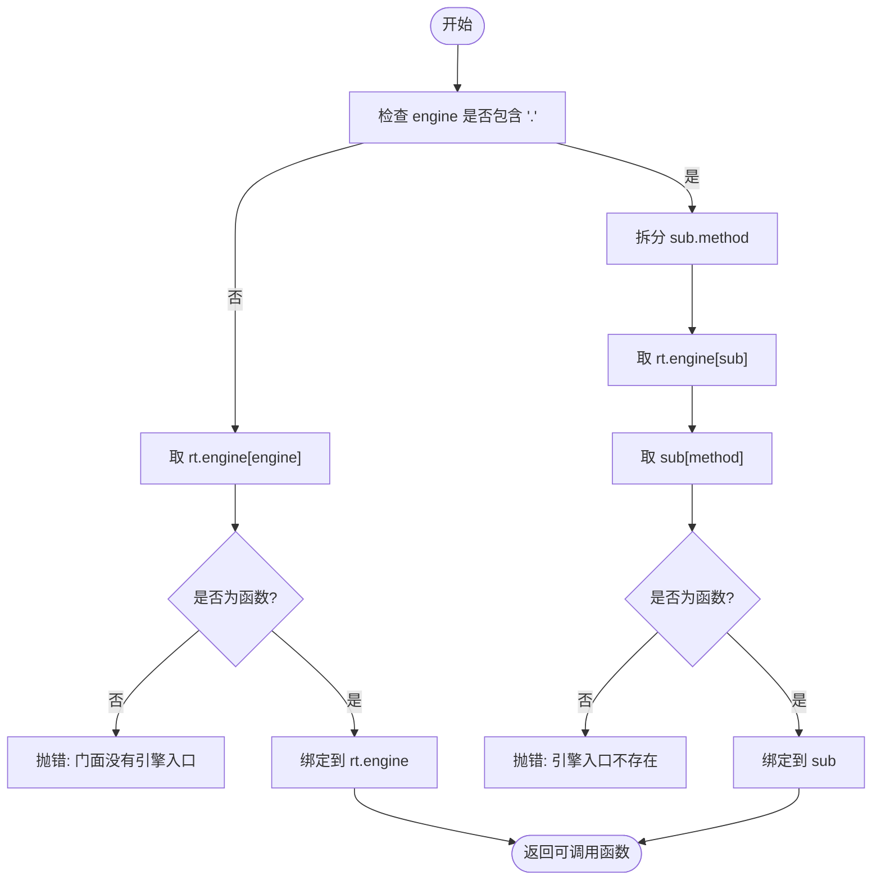
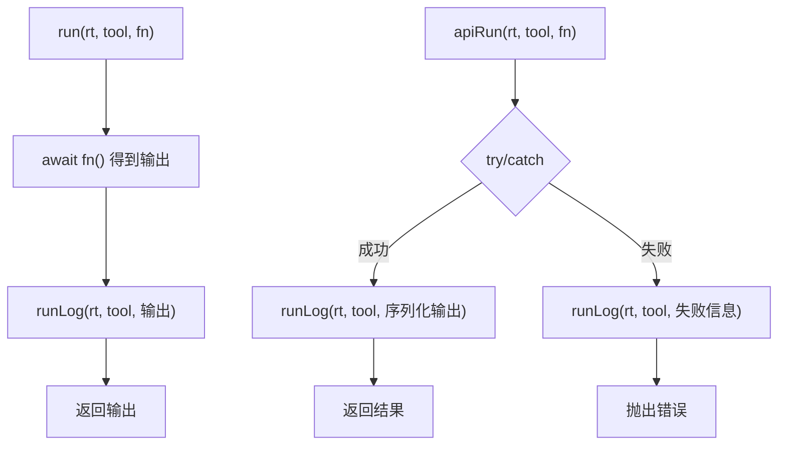
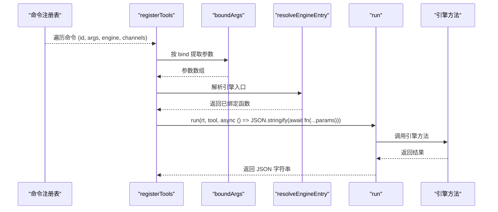
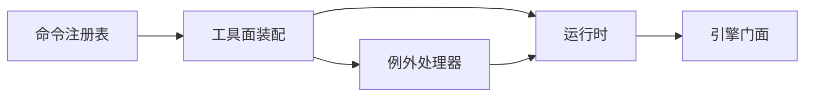

# 工具执行生命周期

<cite>
**本文引用的文件**
- [src/host/tools.ts](file://src/host/tools.ts)
- [src/host/tool-handlers.ts](file://src/host/tool-handlers.ts)
- [src/host/runtime.ts](file://src/host/runtime.ts)
- [src/commands/index.ts](file://src/commands/index.ts)
- [src/commands/学习.ts](file://src/commands/学习.ts)
- [src/engine/index.ts](file://src/engine/index.ts)
- [src/host/handlers.ts](file://src/host/handlers.ts)
</cite>

## 目录
1. [简介](#简介)
2. [项目结构](#项目结构)
3. [核心组件](#核心组件)
4. [架构总览](#架构总览)
5. [详细组件分析](#详细组件分析)
6. [依赖关系分析](#依赖关系分析)
7. [性能考量](#性能考量)
8. [故障诊断指南](#故障诊断指南)
9. [结论](#结论)
10. [附录](#附录)

## 简介
本文面向 LearnHub 的“工具执行生命周期”，聚焦从接收请求到返回结果的完整链路，解释以下关键点：
- resolveEngineEntry 与 run 的工作原理（引擎入口解析、运行时上下文管理、错误处理）
- toolHandlers 的作用与特殊处理逻辑（哪些工具需要自定义处理器及原因）
- bind 参数的作用与执行时的参数映射过程
- 性能监控点、日志记录与调试技巧
- 故障诊断方法与使用示例

## 项目结构
LearnHub 的工具面由“声明式命令注册表”驱动，统一装配为 agent 工具与面板路由。关键路径如下：
- 命令注册表：按域分文件组织，集中装配为 COMMAND_LIST/BY_TOOL/BY_ROUTE
- 工具面装配：遍历命令，生成 defineTool；若存在 engine+bind，走“生成路径”；否则走“例外 handler”
- 运行时：resolveEngineEntry 解析引擎入口，run 负责运行日志与输出落盘
- 引擎门面：LearnhubEngine 暴露子系统与方法，供工具调用

图表来源
- [src/host/tools.ts:102-125](file://src/host/tools.ts#L102-L125)
- [src/host/runtime.ts:204-238](file://src/host/runtime.ts#L204-L238)
- [src/engine/index.ts:149-184](file://src/engine/index.ts#L149-L184)

章节来源
- [src/commands/index.ts:25-71](file://src/commands/index.ts#L25-L71)
- [src/host/tools.ts:1-126](file://src/host/tools.ts#L1-L126)

## 核心组件
- 命令注册表（COMMAND_LIST/BY_TOOL/BY_ROUTE）：声明每个工具的 id、summary、args、engine、channels（agent/panel）、bind 等元数据
- 工具面装配（registerTools）：将命令注册表转为 SDK 工具定义；根据是否有 engine+bind 决定走“生成路径”或“例外处理器”
- 运行时（runtime.ts）：提供 resolveEngineEntry（字符串到函数绑定）、run（统一日志封装）、apiRun（API 专用日志）
- 引擎门面（LearnhubEngine）：聚合各子系统（learner/sched2/graph/bank2/content2/project/lab/channels/growth2 等），作为工具调用的最终实现层
- 例外处理器（toolHandlers）：对形状需加工、实参需换算、无单一入口、面板独有键等的工具进行定制处理

章节来源
- [src/commands/index.ts:25-71](file://src/commands/index.ts#L25-L71)
- [src/host/tools.ts:72-125](file://src/host/tools.ts#L72-L125)
- [src/host/runtime.ts:195-255](file://src/host/runtime.ts#L195-L255)
- [src/engine/index.ts:149-184](file://src/engine/index.ts#L149-L184)
- [src/host/tool-handlers.ts:23-287](file://src/host/tool-handlers.ts#L23-L287)

## 架构总览
下图展示一次工具调用从 agent 侧进入，到引擎执行的完整时序。

图表来源
- [src/host/tools.ts:102-125](file://src/host/tools.ts#L102-L125)
- [src/host/runtime.ts:204-238](file://src/host/runtime.ts#L204-L238)
- [src/engine/index.ts:149-184](file://src/engine/index.ts#L149-L184)

## 详细组件分析

### 引擎入口解析：resolveEngineEntry
- 支持两种形式：
  - 裸名：直接取 rt.engine[engine]，并绑定到 rt.engine
  - 点路径：如 learner.logBandSession，先取子对象再取方法，并绑定到子对象
- 找不到或类型不对时抛出错误，便于快速定位配置问题
- 绑定 this 是关键：引擎内部方法常依赖 this 引用门面实例，未绑定会导致运行时错误

图表来源
- [src/host/runtime.ts:204-215](file://src/host/runtime.ts#L204-L215)

章节来源
- [src/host/runtime.ts:195-215](file://src/host/runtime.ts#L195-L215)

### 运行时包装：run 与 apiRun
- run：统一封装引擎调用与运行日志，输出被截断后追加到中心状态目录的运行日志文件
- apiRun：用于面板 API，捕获异常并记录失败信息，随后原样抛出
- 日志文件位于 centerStateDir/运行日志.md，便于审计与排障

图表来源
- [src/host/runtime.ts:217-253](file://src/host/runtime.ts#L217-L253)

章节来源
- [src/host/runtime.ts:217-253](file://src/host/runtime.ts#L217-L253)

### 工具面装配与 bind 参数映射
- registerTools 遍历 COMMAND_LIST，对每个命令：
  - 若存在 engine 且 channel.bind 非空：构造 execute = run(rt, tool, async () => JSON.stringify(await resolveEngineEntry(rt, engine)(...boundArgs(args, bind))))
  - 否则：使用 toolHandlers 中对应 handler
- sdkParameters 将命令 args 转换为 SDK 的 parameters schema（剥离 read 等投递层扩展键）
- boundArgs 按 bind 顺序提取同名键，null 表示传入 undefined

图表来源
- [src/host/tools.ts:72-125](file://src/host/tools.ts#L72-L125)
- [src/host/runtime.ts:204-238](file://src/host/runtime.ts#L204-L238)

章节来源
- [src/host/tools.ts:72-125](file://src/host/tools.ts#L72-L125)

### 例外处理器：toolHandlers 的作用与特殊处理
- 只放置“走不了生成路径”的工具，常见原因：
  - 形状要加工：返回值需包装或计算
  - 实参要换算：需要对入参做校验/转换（如 applyId/rejectId/requireSkipDirection）
  - 无单一入口：按参数分派、队列受理、或无引擎调用
  - 面板独有键不在声明里：避免污染工具面 schema 权威
- 键集合与“没有 bind 的 agent 通道集合”一致，由门④ 断言保证一致性
- 所有 handler 统一通过 run(rt, tool, ...) 包装，确保日志与错误处理一致

章节来源
- [src/host/tool-handlers.ts:1-287](file://src/host/tool-handlers.ts#L1-L287)

### 面板路由与工具面的协同
- 面板路由也遵循“生成路径优先”原则：若命令有 panel route 且带 engine/bind，则直接调用引擎；否则走手写 handlers
- 手写 handlers 登记在 handlers.ts，覆盖无法走生成路径的路由
- 两者都通过 apiRun/runLog 记录运行日志，保持一致的可观测性

章节来源
- [src/host/handlers.ts:1-200](file://src/host/handlers.ts#L1-L200)

## 依赖关系分析
- 命令注册表 → 工具面装配 → 运行时 → 引擎门面
- 工具面装配依赖命令注册表的 CHANNELS（agent/panel）与 BIND
- 运行时依赖引擎门面以解析和调用具体方法
- 例外处理器依赖运行时与引擎子系统，以及宿主作业队列（jobs.ts）

图表来源
- [src/commands/index.ts:25-71](file://src/commands/index.ts#L25-L71)
- [src/host/tools.ts:102-125](file://src/host/tools.ts#L102-L125)
- [src/host/runtime.ts:204-238](file://src/host/runtime.ts#L204-L238)
- [src/host/tool-handlers.ts:23-287](file://src/host/tool-handlers.ts#L23-L287)

章节来源
- [src/commands/index.ts:25-71](file://src/commands/index.ts#L25-L71)
- [src/host/tools.ts:102-125](file://src/host/tools.ts#L102-L125)
- [src/host/runtime.ts:204-238](file://src/host/runtime.ts#L204-L238)
- [src/host/tool-handlers.ts:23-287](file://src/host/tool-handlers.ts#L23-L287)

## 性能考量
- 日志截断：运行日志输出超过上限会被截断，避免大响应阻塞写盘
- 异步日志：日志写入采用 fire-and-forget 模式，失败不影响主流程
- 会话节流：部分入口（如 status）会触发 sessionStartCheckpoint，减少重复开销
- 任务队列：复杂操作（如出题、罗盘重画）通过入队与等待终态，避免同步阻塞
- 模型透明：任务注册表携带实际使用的模型名，便于审计与优化

章节来源
- [src/host/runtime.ts:195-238](file://src/host/runtime.ts#L195-L238)
- [src/host/tool-handlers.ts:72-99](file://src/host/tool-handlers.ts#L72-L99)

## 故障诊断指南
- 常见错误定位
  - 引擎入口不存在：检查命令的 engine 字段是否正确，resolveEngineEntry 会抛错提示
  - 参数不合法：SDK 会根据 schema 校验必填与类型；自定义 handler 内也会显式校验并抛错
  - 运行日志失败：不会中断主流程，但可在中心状态目录查看运行日志文件
- 调试技巧
  - 查看运行日志：centerStateDir/运行日志.md，包含每次工具调用的时间戳与输出摘要
  - 检查命令注册表：确认 command.id、channels.agent.tool、engine、bind 的一致性
  - 使用冒烟测试：/smoke 接口可验证全管线（种子→大纲→逐节→出题）
- 使用示例
  - 排查某个工具为何不走生成路径：确认其是否在 toolHandlers 中存在；若存在，说明该工具需要自定义处理
  - 验证 bind 映射：检查命令的 bind 数组是否与 args 键名一致，顺序是否匹配

章节来源
- [src/host/runtime.ts:217-253](file://src/host/runtime.ts#L217-L253)
- [src/host/tool-handlers.ts:23-287](file://src/host/tool-handlers.ts#L23-L287)
- [src/host/handlers.ts:181-199](file://src/host/handlers.ts#L181-L199)

## 结论
LearnHub 的工具执行生命周期以“声明式命令注册表”为核心，通过工具面装配统一接入 agent 与面板。resolveEngineEntry 负责将字符串形式的引擎入口解析为可调用的函数，run 提供统一的日志与错误处理。toolHandlers 承载了需要特殊处理的工具，确保工具面契约的稳定与可维护性。bind 机制实现了参数到引擎方法的精确映射，提升了装配效率与类型安全。整体设计兼顾了可观测性、可扩展性与性能。

## 附录
- 典型命令示例：学习域的 band-session 通过 engine: learner.logBandSession 与 bind 映射参数，走生成路径
- 工具面快照：tests/fixtures/host-tools-snapshot.json 记录了工具面 schema，可用于回归比对

章节来源
- [src/commands/学习.ts:10-26](file://src/commands/学习.ts#L10-L26)
- [tests/fixtures/host-tools-snapshot.json:2057-2079](file://tests/fixtures/host-tools-snapshot.json#L2057-L2079)