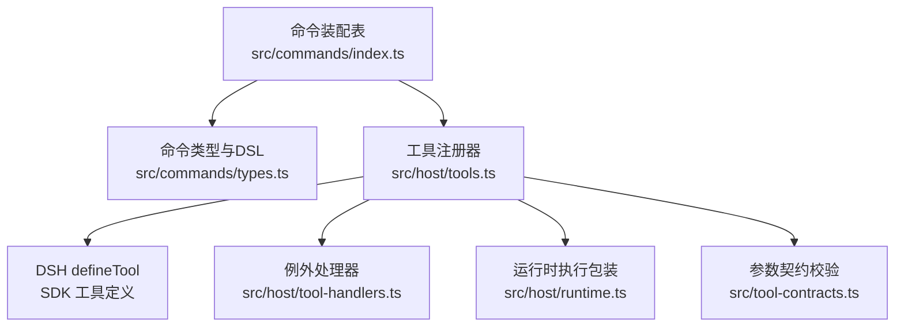
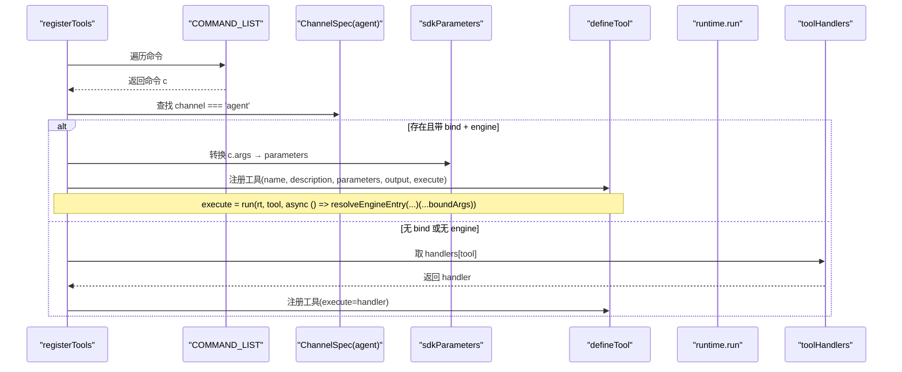
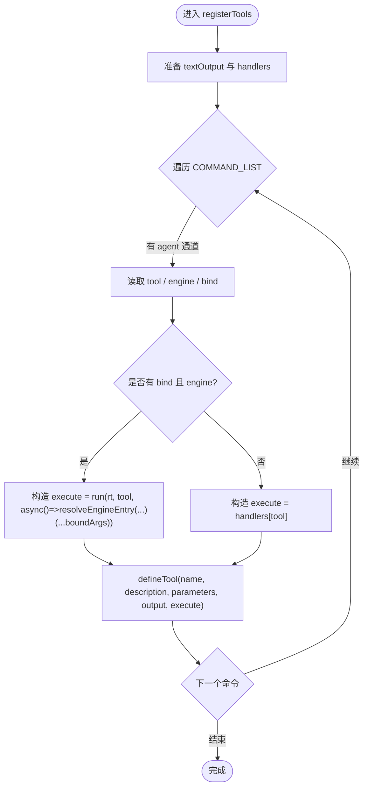
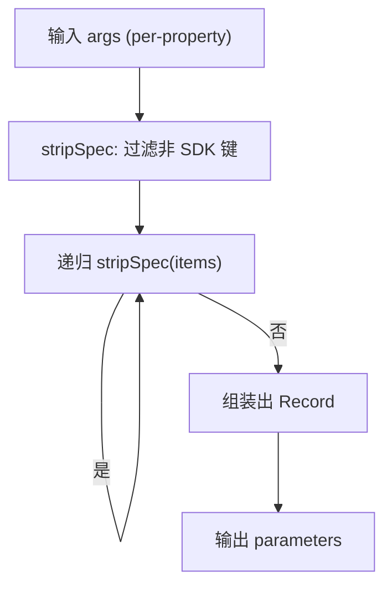
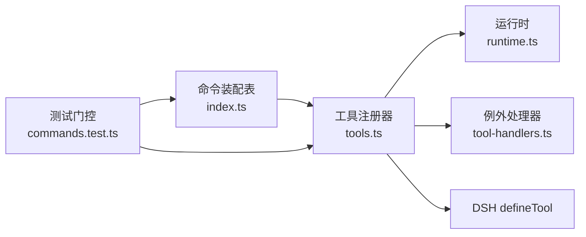

# 工具注册机制

<cite>
**本文引用的文件**
- [src/host/tools.ts](file://src/host/tools.ts)
- [src/commands/index.ts](file://src/commands/index.ts)
- [src/commands/types.ts](file://src/commands/types.ts)
- [src/host/tool-handlers.ts](file://src/host/tool-handlers.ts)
- [src/tool-contracts.ts](file://src/tool-contracts.ts)
- [tests/commands.test.ts](file://tests/commands.test.ts)
- [tests/host-runtime.test.ts](file://tests/host-runtime.test.ts)
</cite>

## 目录
1. [简介](#简介)
2. [项目结构](#项目结构)
3. [核心组件](#核心组件)
4. [架构总览](#架构总览)
5. [详细组件分析](#详细组件分析)
6. [依赖关系分析](#依赖关系分析)
7. [性能与可扩展性](#性能与可扩展性)
8. [故障排查指南](#故障排查指南)
9. [结论](#结论)
10. [附录：新工具注册步骤与最佳实践](#附录：新工具注册步骤与最佳实践)

## 简介
本文件系统性说明 LearnHub 的“工具注册机制”，聚焦以下目标：
- 解释 COMMAND_LIST 的结构与配置方式
- 说明工具声明的元数据格式（名称、描述、参数 schema、绑定关系）
- 描述 registerTools 的工作流程（遍历命令、解析通道、生成 SDK 兼容的工具定义）
- 说明 sdkParameters 的参数转换逻辑（内部参数规范 → DSH SDK parameters）
- 提供新工具注册的完整步骤、最佳实践、示例与常见错误解决方案

## 项目结构
LearnHub 将“命令”作为单一真相源，通过 channels 同时暴露给 agent（工具面）和 panel（路由面）。关键位置：
- 命令装配表与运行时列表：src/commands/index.ts
- 命令类型与 DSL：src/commands/types.ts
- 工具注册与参数投影：src/host/tools.ts
- 例外处理器（不走生成路径的工具）：src/host/tool-handlers.ts
- 参数契约校验辅助：src/tool-contracts.ts
- 注册表门控测试（唯一性、一致性等）：tests/commands.test.ts、tests/host-runtime.test.ts

图表来源
- [src/commands/index.ts:25-46](file://src/commands/index.ts#L25-L46)
- [src/commands/types.ts:54-129](file://src/commands/types.ts#L54-L129)
- [src/host/tools.ts:102-125](file://src/host/tools.ts#L102-L125)
- [src/host/tool-handlers.ts:23-288](file://src/host/tool-handlers.ts#L23-L288)
- [src/tool-contracts.ts:1-55](file://src/tool-contracts.ts#L1-L55)

章节来源
- [src/commands/index.ts:1-72](file://src/commands/index.ts#L1-L72)
- [src/commands/types.ts:1-129](file://src/commands/types.ts#L1-L129)
- [src/host/tools.ts:1-126](file://src/host/tools.ts#L1-L126)
- [src/host/tool-handlers.ts:1-288](file://src/host/tool-handlers.ts#L1-L288)
- [src/tool-contracts.ts:1-55](file://src/tool-contracts.ts#L1-L55)

## 核心组件
- COMMAND_LIST：运行时的命令清单，由装配表导出，顺序固定，供注册器与门面适配器遍历。
- CommandSpec：单条命令的声明，包含 id、summary、args、engine、domain、channels 等。
- ChannelSpec：每条命令可暴露多个通道（agent 或 panel），并指定 mode、tool/route、phase、bind 等。
- sdkParameters：将命令的 args（含投递层扩展键 read）转换为 SDK 的 parameters 形态。
- registerTools：遍历 COMMAND_LIST，为每个带 agent 通道的命令注册一个工具。
- toolHandlers：对无法走“生成路径”的工具提供手写 handler。

章节来源
- [src/commands/index.ts:25-72](file://src/commands/index.ts#L25-L72)
- [src/commands/types.ts:54-129](file://src/commands/types.ts#L54-L129)
- [src/host/tools.ts:72-125](file://src/host/tools.ts#L72-L125)
- [src/host/tool-handlers.ts:1-288](file://src/host/tool-handlers.ts#L1-L288)

## 架构总览
下图展示了从命令声明到工具注册的端到端流程，以及两种执行路径（生成路径 vs 例外 handler）。

图表来源
- [src/host/tools.ts:102-125](file://src/host/tools.ts#L102-L125)
- [src/host/tool-handlers.ts:23-288](file://src/host/tool-handlers.ts#L23-L288)
- [src/commands/index.ts:45-72](file://src/commands/index.ts#L45-L72)

## 详细组件分析

### COMMAND_LIST 结构与配置方式
- 来源与组织：各域文件（学习、图谱、题库、项目、学习者产出、实验室、通道、维护）通过 index.ts 合并为 COMMANDS，再导出 COMMAND_LIST。
- 字段含义：
  - id：稳定主键
  - summary：工具面 description 的唯一来源（agent 通道必填）
  - args：沿用 SDK per-property 的 schema，支持 type、required、description、enum、items、additionalProperties，以及投递层扩展 read
  - engine：可选；若声明则必须指向有效门面方法
  - domain：分组
  - channels：多条通道，分别声明 agent 或 panel 的行为
- 索引：BY_TOOL、BY_ROUTE 用于快速查找；WIRE_ARGS 用于面板请求体键名映射。

章节来源
- [src/commands/index.ts:25-72](file://src/commands/index.ts#L25-L72)
- [src/commands/types.ts:54-129](file://src/commands/types.ts#L54-L129)

### 工具声明的元数据格式
- 名称：来自 channel.tool（agent 通道）
- 描述：来自 command.summary（agent 通道必填）
- 参数 schema：来自 command.args，经 sdkParameters 转换后成为 SDK 的 parameters
- 绑定关系：channel.bind 决定生成路径下引擎实参的位置映射；null 表示传 undefined

章节来源
- [src/commands/types.ts:76-98](file://src/commands/types.ts#L76-L98)
- [src/host/tools.ts:97-125](file://src/host/tools.ts#L97-L125)

### registerTools 工作流程
- 准备 textOutput 渲染器
- 构建例外处理器集合 toolHandlers
- 遍历 COMMAND_LIST：
  - 找到 agent 通道
  - 若存在 bind 且命令声明了 engine：execute 使用 run + resolveEngineEntry，按 bind 顺序传入参数
  - 否则：execute 取自 toolHandlers[tool]
  - 调用 defineTool 注册工具，name/description/parameters/output/execute 均来源于命令声明与转换结果

图表来源
- [src/host/tools.ts:102-125](file://src/host/tools.ts#L102-L125)
- [src/host/tool-handlers.ts:23-288](file://src/host/tool-handlers.ts#L23-L288)

章节来源
- [src/host/tools.ts:102-125](file://src/host/tools.ts#L102-L125)

### sdkParameters 参数转换逻辑
- 输入：CommandSpec.args（per-property 形态，可能包含投递层扩展键 read）
- 处理：
  - 仅保留 SDK 允许的键：type、required、description、enum、items、additionalProperties
  - 递归清理 items 中的非 SDK 键
  - 输出：Record<string, ParamSpec>，即 SDK 的 parameters 形态
- 作用：保证工具面 schema 与历史快照逐字一致，避免引入额外字段导致不兼容

图表来源
- [src/host/tools.ts:78-95](file://src/host/tools.ts#L78-L95)

章节来源
- [src/host/tools.ts:72-95](file://src/host/tools.ts#L72-L95)

### 绑定关系与参数传递
- bind：数组元素为 args 的键名或 null；顺序对应引擎函数形参位置
- boundArgs：根据 bind 从入参中取值，null 转为 undefined
- 适用场景：当工具只是透传参数到引擎入口时使用；复杂变换或载荷封装走例外 handler

章节来源
- [src/host/tools.ts:97-100](file://src/host/tools.ts#L97-L100)
- [src/commands/types.ts:86-87](file://src/commands/types.ts#L86-L87)

### 例外处理器（tool-handlers）
- 定位：对于形状需加工、实参需换算、多入口或队列型等无法用“生成路径”统一处理的工具，提供手写 handler
- 特点：工厂模式创建，闭包持有 rt/ctx；键为工具名，与注册表 agent 通道同源
- 覆盖范围：约 66/111 条工具走此路径

章节来源
- [src/host/tool-handlers.ts:1-288](file://src/host/tool-handlers.ts#L1-L288)

### 参数契约校验
- 原则：可选参数只允许“缺省”或“合法值”；必填显式参数缺失即错；非法输入不静默改写
- 工具：requireSkipDirection、questionCount、applyId、rejectId、graphKind、bandPref 等
- 用途：在 handler 中对关键参数进行强校验，确保行为可预期

章节来源
- [src/tool-contracts.ts:1-55](file://src/tool-contracts.ts#L1-L55)

## 依赖关系分析
- 命令装配表依赖各域文件，导出 COMMAND_LIST、BY_TOOL、BY_ROUTE、WIRE_ARGS
- 工具注册器依赖：
  - 命令装配表（COMMAND_LIST）
  - 运行时（runtime.run、resolveEngineEntry）
  - 例外处理器（toolHandlers）
  - SDK defineTool
- 测试门控依赖：
  - 注册表与工具面快照一致性
  - AGENT_GUIDE 受检投影
  - 唯一性与数量断言

图表来源
- [src/commands/index.ts:25-72](file://src/commands/index.ts#L25-L72)
- [src/host/tools.ts:102-125](file://src/host/tools.ts#L102-L125)
- [tests/commands.test.ts:1-200](file://tests/commands.test.ts#L1-L200)

章节来源
- [src/commands/index.ts:25-72](file://src/commands/index.ts#L25-L72)
- [src/host/tools.ts:102-125](file://src/host/tools.ts#L102-L125)
- [tests/commands.test.ts:1-200](file://tests/commands.test.ts#L1-L200)

## 性能与可扩展性
- 注册阶段 O(N) 遍历 COMMAND_LIST，N 为命令数；schema 转换为线性扫描与浅拷贝
- 运行时执行：
  - 生成路径：一次 resolveEngineEntry + 按 bind 展开参数，开销低
  - 例外路径：直接调用 handler，适合复杂逻辑
- 可扩展性：新增命令只需在对应域文件添加 command 声明，无需改动注册器；如需复杂处理，补充 toolHandlers

[本节为通用指导，不直接分析具体文件]

## 故障排查指南
- 工具未注册：
  - 检查命令是否包含 agent 通道且 tool 已设置
  - 确认 COMMAND_LIST 包含该命令
- 参数 schema 不一致：
  - 检查 args 是否包含非 SDK 键（read 会在转换时剥离）
  - 核对 sdkParameters 输出是否与快照一致（测试门⑧）
- 绑定错误：
  - 检查 bind 顺序与引擎函数形参顺序一致
  - 对需要 undefined 的位置使用 null
- 例外处理器缺失：
  - 若命令没有 engine 或 bind，需在 toolHandlers 中实现对应 handler
- 唯一性冲突：
  - 检查 id、tool 名、(method, path) 是否重复（测试门③）

章节来源
- [tests/commands.test.ts:132-200](file://tests/commands.test.ts#L132-L200)
- [src/host/tools.ts:78-125](file://src/host/tools.ts#L78-L125)
- [src/host/tool-handlers.ts:23-288](file://src/host/tool-handlers.ts#L23-L288)

## 结论
LearnHub 的工具注册机制以“命令注册表”为中心，通过 channels 统一暴露 agent 与 panel 能力。registerTools 将声明驱动的工具定义与运行时执行解耦，sdkParameters 确保 schema 兼容与稳定性。例外处理器覆盖复杂场景，参数契约保障健壮性。整体设计清晰、可测试、可扩展。

[本节为总结，不直接分析具体文件]

## 附录：新工具注册步骤与最佳实践

### 步骤概览
1. 在对应域文件中新增一条 command 声明：
   - 填写 id、summary（agent 通道必填）、args（遵循 SDK per-property 形态）
   - 如可走生成路径，填写 engine 与 channel.bind（顺序对应引擎形参）
   - 在 channels 中添加 agent 通道，设置 tool 名与 mode
2. 若工具需要复杂参数变换或多入口，补充 toolHandlers 中的 handler
3. 运行测试门控，确保：
   - 唯一性（id、tool、route）
   - 声明与面一致（schema 与快照一致）
   - AGENT_GUIDE 受检投影（如有）
4. 更新相关文档与指南（如 AGENT_GUIDE）

### 最佳实践
- 优先使用“生成路径”（engine + bind），减少手写 handler
- 参数尽量简单直传；复杂载荷或回调留在 handler
- 使用 tool-contracts 中的校验函数，确保参数合法性
- 保持 summary 简洁明确，便于工具面展示
- 谨慎使用 read 扩展键，仅在投递层需要时添加

### 实际配置示例（路径引用）
- 命令声明示例（学习域）：[src/commands/学习.ts:118-140](file://src/commands/学习.ts#L118-L140)
- 带 agent 通道的命令示例：[src/commands/学习.ts:48-67](file://src/commands/学习.ts#L48-L67)
- 参数 schema 与 read 用法：[src/commands/学习.ts:10-26](file://src/commands/学习.ts#L10-L26)
- 绑定与生成路径：[src/commands/学习.ts:186-200](file://src/commands/学习.ts#L186-L200)

### 常见错误与解决
- 忘记设置 agent 通道的 tool：工具不会注册
- summary 缺失：agent 通道会缺少 description
- bind 顺序错误：引擎调用参数错位
- 使用了非 SDK 键：会被剥离，可能导致 schema 与快照不一致
- 未覆盖例外路径：需要在 toolHandlers 中实现

章节来源
- [src/commands/学习.ts:10-26](file://src/commands/学习.ts#L10-L26)
- [src/commands/学习.ts:48-67](file://src/commands/学习.ts#L48-L67)
- [src/commands/学习.ts:118-140](file://src/commands/学习.ts#L118-L140)
- [src/commands/学习.ts:186-200](file://src/commands/学习.ts#L186-L200)
- [src/host/tools.ts:78-125](file://src/host/tools.ts#L78-L125)
- [src/host/tool-handlers.ts:23-288](file://src/host/tool-handlers.ts#L23-L288)
- [tests/commands.test.ts:132-200](file://tests/commands.test.ts#L132-L200)