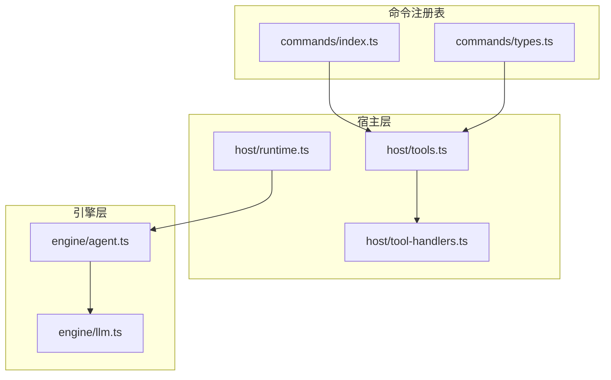
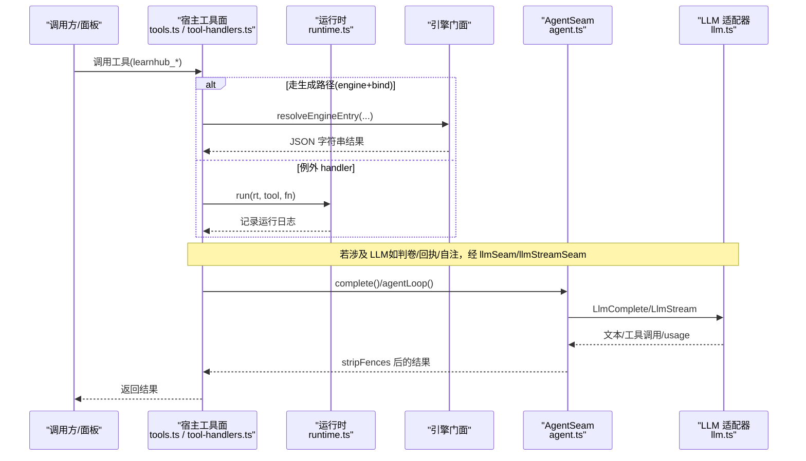
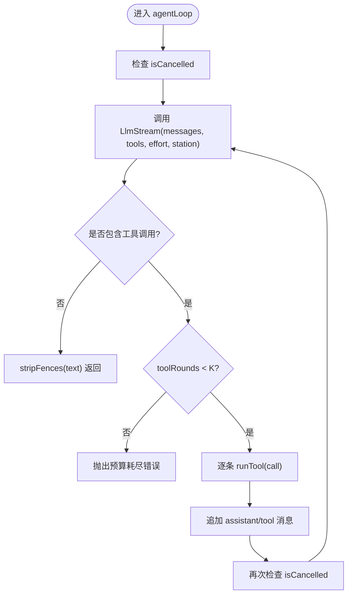
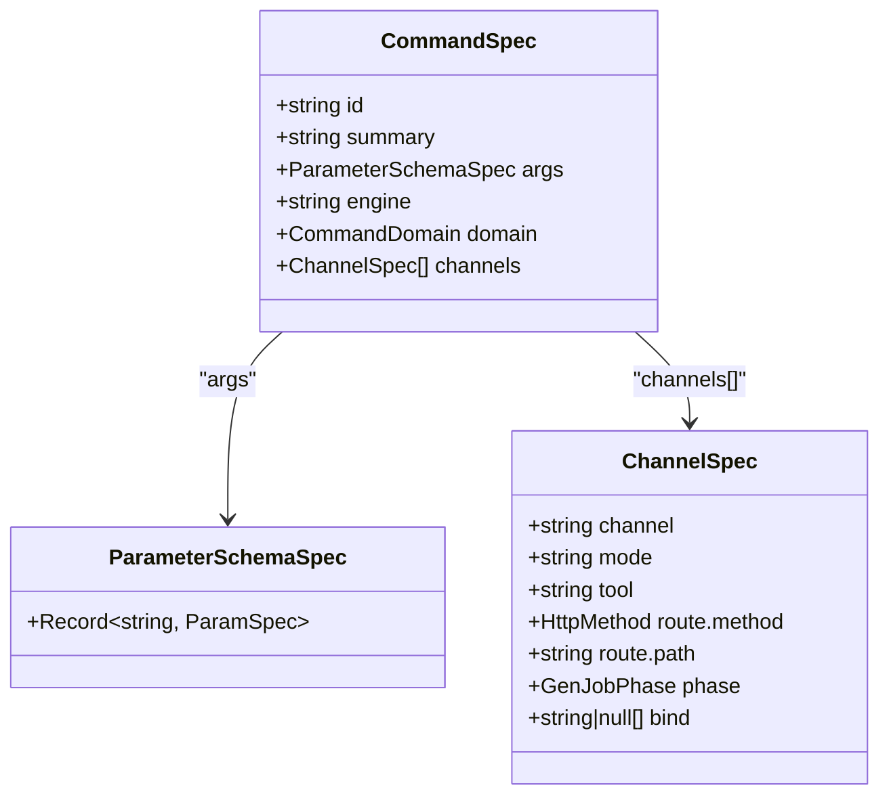

# 统一 Agent 缝设计

<cite>
**本文引用的文件**
- [src/engine/agent.ts](file://src/engine/agent.ts)
- [src/engine/llm.ts](file://src/engine/llm.ts)
- [src/host/tools.ts](file://src/host/tools.ts)
- [src/host/tool-handlers.ts](file://src/host/tool-handlers.ts)
- [src/commands/index.ts](file://src/commands/index.ts)
- [src/commands/types.ts](file://src/commands/types.ts)
- [src/host/runtime.ts](file://src/host/runtime.ts)
- [tests/agent-seam.test.ts](file://tests/agent-seam.test.ts)
- [tests/llm-capture.test.ts](file://tests/llm-capture.test.ts)
- [tests/tools-face.test.ts](file://tests/tools-face.test.ts)
- [tests/helpers/tools-probe.ts](file://tests/helpers/tools-probe.ts)
</cite>

## 目录
1. [简介](#简介)
2. [项目结构](#项目结构)
3. [核心组件](#核心组件)
4. [架构总览](#架构总览)
5. [详细组件分析](#详细组件分析)
6. [依赖关系分析](#依赖关系分析)
7. [性能与可观测性](#性能与可观测性)
8. [调试与故障排除](#调试与故障排除)
9. [结论](#结论)
10. [附录：扩展新工具函数指南](#附录：扩展新工具函数指南)

## 简介
本技术文档围绕 LearnHub 的“统一 Agent 缝（AgentSeam）”展开，解释其作为单一接口暴露 111 个工具函数的设计理念与实现原理。AgentSeam 通过统一的抽象层屏蔽底层 LLM 适配器的复杂性，提供参数验证、错误处理、性能监控与上下文管理；同时以“单发补全 + 有界工具回路”的双模式，支撑六类策略站（种子起草、罗盘、教练生长、目标反编译、计划草案、里程碑草案）的稳定运行。本文还给出工具调用的完整生命周期、扩展新工具的步骤、自定义行为的方法，以及调试与排障指南。

## 项目结构
LearnHub 的工具面由“命令注册表 → 宿主装配 → 引擎门面”三层构成，AgentSeam 位于引擎侧，是应用层与 LLM 适配器之间的唯一调用面。

图表来源
- [src/commands/index.ts:25-66](file://src/commands/index.ts#L25-L66)
- [src/commands/types.ts:76-129](file://src/commands/types.ts#L76-L129)
- [src/host/tools.ts:101-125](file://src/host/tools.ts#L101-L125)
- [src/host/tool-handlers.ts:23-288](file://src/host/tool-handlers.ts#L23-L288)
- [src/host/runtime.ts:138-193](file://src/host/runtime.ts#L138-L193)
- [src/engine/agent.ts:85-221](file://src/engine/agent.ts#L85-L221)
- [src/engine/llm.ts:1-82](file://src/engine/llm.ts#L1-L82)

章节来源
- [src/commands/index.ts:25-66](file://src/commands/index.ts#L25-L66)
- [src/host/tools.ts:101-125](file://src/host/tools.ts#L101-L125)
- [src/host/runtime.ts:138-193](file://src/host/runtime.ts#L138-L193)
- [src/engine/agent.ts:85-221](file://src/engine/agent.ts#L85-L221)

## 核心组件
- AgentSeam：统一入口，封装 complete/repair/agentLoop/gateRepairRound，负责后处理、语义档、调用日志、预算控制与取消传导。
- LLM 端口：LlmComplete/LlmStream 纯类型定义，解耦引擎与适配器；支持 effort、station/kind、temperature、usageSink。
- 命令注册表：COMMANDS/CMD_LIST/BY_TOOL 等集中声明 111 个工具，驱动宿主装配为 defineTool。
- 宿主装配：registerTools 将命令转为工具，按 engine+bind 或例外 handler 执行；toolHandlers 承载无法走生成路径的工具逻辑。
- 运行时装配：createHostRuntime 注入 AgentSeam 的 complete/stream/onCall，并接入语料捕获与运行日志。

章节来源
- [src/engine/agent.ts:28-83](file://src/engine/agent.ts#L28-L83)
- [src/engine/llm.ts:14-82](file://src/engine/llm.ts#L14-L82)
- [src/commands/index.ts:25-66](file://src/commands/index.ts#L25-L66)
- [src/host/tools.ts:72-125](file://src/host/tools.ts#L72-L125)
- [src/host/tool-handlers.ts:23-288](file://src/host/tool-handlers.ts#L23-L288)
- [src/host/runtime.ts:138-193](file://src/host/runtime.ts#L138-L193)

## 架构总览
下图展示从“命令声明”到“工具执行”再到“LLM 调用”的全链路。

图表来源
- [src/host/tools.ts:101-125](file://src/host/tools.ts#L101-L125)
- [src/host/tool-handlers.ts:23-288](file://src/host/tool-handlers.ts#L23-L288)
- [src/host/runtime.ts:198-238](file://src/host/runtime.ts#L198-L238)
- [src/engine/agent.ts:93-200](file://src/engine/agent.ts#L93-L200)
- [src/engine/llm.ts:29-82](file://src/engine/llm.ts#L29-L82)

## 详细组件分析

### AgentSeam：统一入口与双模式
- 单发模式 complete：一次对话直接返回，自动剥离代码围栏、携带 station/kind/effort、产出 AgentCallRecord。
- 修复轮 repair：用于门错修复，与 complete 同一传输通道，观测面标记 repair。
- 工具回路 agentLoop：有界多轮迭代，模型每轮可请求白名单内工具；缝执行 runTool 并将结果回灌继续；不再请求工具时以文本收束（剥围栏）。K≤6 轮预算封顶防自激循环；isCancelled 在每轮前与每次工具执行后检查，取消即抛错中止。
- 门错修复 gateRepairRound：first→gate→repair（恰一次）→gate，仍败则 fatal 抛出两轮死因。

图表来源
- [src/engine/agent.ts:122-186](file://src/engine/agent.ts#L122-L186)

章节来源
- [src/engine/agent.ts:28-83](file://src/engine/agent.ts#L28-L83)
- [src/engine/agent.ts:93-200](file://src/engine/agent.ts#L93-L200)
- [src/engine/agent.ts:122-186](file://src/engine/agent.ts#L122-L186)

### LLM 端口与适配器
- LlmComplete：prompt/system/opts(effort/station/kind/usageSink/temperature)，返回字符串。
- LlmStream：messages(system/user/assistant/tool)/effort/station/tools/temperature，返回{text; toolCalls; usage?}。
- 适配器在宿主侧实现（host/llm.ts），AgentSeam 仅消费纯类型，测试可注入假实现，保证金样本回放链路确定性。

章节来源
- [src/engine/llm.ts:14-82](file://src/engine/llm.ts#L14-L82)

### 命令注册表与工具装配
- COMMANDS/CMD_LIST/BY_TOOL：集中声明所有命令与通道（agent/panel），BY_TOOL 索引 agent 通道工具名。
- registerTools：遍历命令，找到 agent 通道；若存在 engine+bind，则通过 resolveEngineEntry 调用引擎门面；否则使用 toolHandlers 中的例外 handler。
- sdkParameters：将命令 args 投影为 SDK 的 parameters schema，确保工具面契约稳定。

图表来源
- [src/commands/types.ts:76-129](file://src/commands/types.ts#L76-L129)
- [src/commands/index.ts:25-66](file://src/commands/index.ts#L25-L66)
- [src/host/tools.ts:72-125](file://src/host/tools.ts#L72-L125)

章节来源
- [src/commands/index.ts:25-66](file://src/commands/index.ts#L25-L66)
- [src/commands/types.ts:76-129](file://src/commands/types.ts#L76-L129)
- [src/host/tools.ts:72-125](file://src/host/tools.ts#L72-L125)

### 宿主运行时与观测面
- createHostRuntime：校验部署路径、构造引擎、创建语料捕获器、装配 AgentSeam（complete/stream/onCall），注入 systemClock。
- onCall：输出 AgentCallRecord（station/mode/effort/callNo/promptChars/replyChars/durationMs/usage），并写入运行日志。
- run/apiRun：统一包装引擎调用与运行日志落盘。

章节来源
- [src/host/runtime.ts:138-193](file://src/host/runtime.ts#L138-L193)
- [src/host/runtime.ts:198-238](file://src/host/runtime.ts#L198-L238)

## 依赖关系分析
- AgentSeam 依赖 LlmComplete/LlmStream 纯类型，不耦合具体适配器；适配器在宿主侧实现。
- 命令注册表是工具面的唯一事实源；registerTools 将其转换为 defineTool 注册项。
- toolHandlers 覆盖无法走生成路径的工具（形状需加工/实参需换算），与生成路径形成互补。
- runtime 装配点将 AgentSeam 与语料捕获、运行日志打通，形成端到端可观测链路。

图表来源
- [src/commands/index.ts:25-66](file://src/commands/index.ts#L25-L66)
- [src/host/tools.ts:101-125](file://src/host/tools.ts#L101-L125)
- [src/host/runtime.ts:138-193](file://src/host/runtime.ts#L138-L193)
- [src/engine/agent.ts:85-221](file://src/engine/agent.ts#L85-L221)
- [src/engine/llm.ts:14-82](file://src/engine/llm.ts#L14-L82)

章节来源
- [src/host/tools.ts:101-125](file://src/host/tools.ts#L101-L125)
- [src/host/runtime.ts:138-193](file://src/host/runtime.ts#L138-L193)
- [src/engine/agent.ts:85-221](file://src/engine/agent.ts#L85-L221)

## 性能与可观测性
- 性能特性
  - 工具回路预算封顶 K≤6，防止自激循环与无限调用。
  - 语义档 effort 区分 fast/deep，降低机械批量调用成本。
  - stripFences 在后处理阶段统一剥离代码围栏，减少下游解析开销。
- 可观测性
  - AgentCallRecord：记录 station/mode/effort/callNo/promptChars/replyChars/durationMs/usage。
  - 运行日志：runLog 持久化工具调用摘要，失败也留痕。
  - 语料捕获：缝出口全量落盘，含提示词、原始输出、工具调用段与 usage。

章节来源
- [src/engine/agent.ts:42-56](file://src/engine/agent.ts#L42-L56)
- [src/host/runtime.ts:170-182](file://src/host/runtime.ts#L170-L182)
- [tests/llm-capture.test.ts:103-247](file://tests/llm-capture.test.ts#L103-L247)

## 调试与故障排除
- 常见问题定位
  - 工具回路未启动：检查注入侧是否提供 LlmStream；缺失会 fail loud。
  - 任务取消：isCancelled 在每轮前与每次工具执行后检查，取消即抛错中止。
  - 预算耗尽：K≤6 轮后仍请求工具会抛出预算耗尽错误。
  - 参数校验：SDK 基于 schema 校验必填与类型；异常由宿主 handler 抛出明确错误信息。
- 调试建议
  - 使用 onCall 观察 AgentCallRecord，确认 station/mode/effort/callNo/usage。
  - 查看运行日志与语料捕获，核对提示词、工具调用载荷与原始输出。
  - 借助工具探针（tools-probe）进行回归比对，确保注册表切面前后行为一致。

章节来源
- [src/engine/agent.ts:122-186](file://src/engine/agent.ts#L122-L186)
- [tests/agent-seam.test.ts:263-301](file://tests/agent-seam.test.ts#L263-L301)
- [tests/tools-face.test.ts:1-22](file://tests/tools-face.test.ts#L1-L22)
- [tests/helpers/tools-probe.ts:1-63](file://tests/helpers/tools-probe.ts#L1-L63)

## 结论
AgentSeam 通过“单发补全 + 有界工具回路”的统一接口，屏蔽了底层 LLM 适配器的复杂性，提供了稳定的参数验证、错误处理、性能监控与上下文管理能力。配合命令注册表与宿主装配，LearnHub 实现了 111 个工具函数的集中管理与一致性行为。该设计既保证了可扩展性（新增工具只需声明与必要绑定），又确保了可观测性与可维护性（调用日志、语料捕获、运行日志三位一体）。

## 附录：扩展新工具函数指南
- 步骤一：在命令注册表中添加命令声明（id、summary、args、engine/bind、domain、channels）。
  - 参考：[src/commands/types.ts:76-129](file://src/commands/types.ts#L76-L129)
- 步骤二：若走生成路径，填写 engine 与 bind；否则在 tool-handlers 中实现例外 handler。
  - 参考：[src/host/tools.ts:101-125](file://src/host/tools.ts#L101-L125)
  - 参考：[src/host/tool-handlers.ts:23-288](file://src/host/tool-handlers.ts#L23-L288)
- 步骤三：如需 LLM 参与，通过 llmSeam/llmStreamSeam 调用 AgentSeam，并传入 station/kind/effort/temperature。
  - 参考：[src/engine/llm.ts:29-82](file://src/engine/llm.ts#L29-L82)
- 步骤四：运行测试与探针，确保行为与快照一致。
  - 参考：[tests/tools-face.test.ts:1-22](file://tests/tools-face.test.ts#L1-L22)
  - 参考：[tests/helpers/tools-probe.ts:1-63](file://tests/helpers/tools-probe.ts#L1-L63)

章节来源
- [src/commands/types.ts:76-129](file://src/commands/types.ts#L76-L129)
- [src/host/tools.ts:101-125](file://src/host/tools.ts#L101-L125)
- [src/host/tool-handlers.ts:23-288](file://src/host/tool-handlers.ts#L23-L288)
- [src/engine/llm.ts:29-82](file://src/engine/llm.ts#L29-L82)
- [tests/tools-face.test.ts:1-22](file://tests/tools-face.test.ts#L1-L22)
- [tests/helpers/tools-probe.ts:1-63](file://tests/helpers/tools-probe.ts#L1-L63)