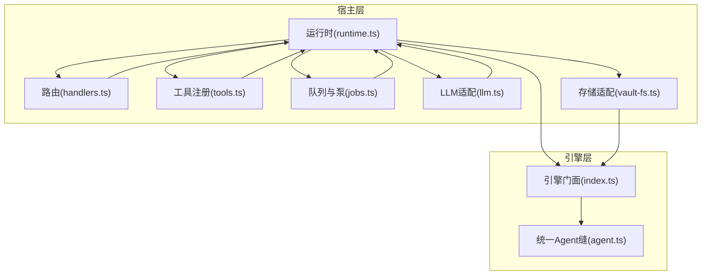
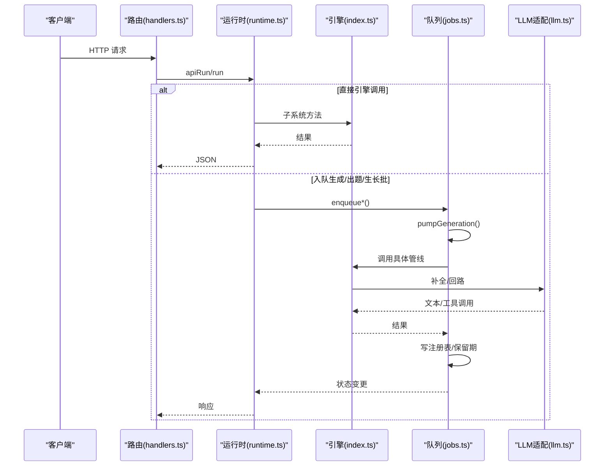
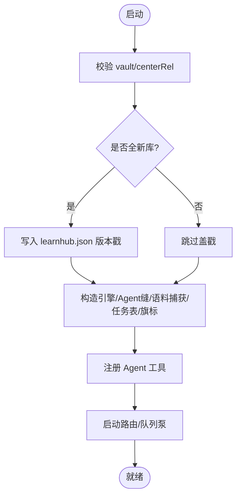
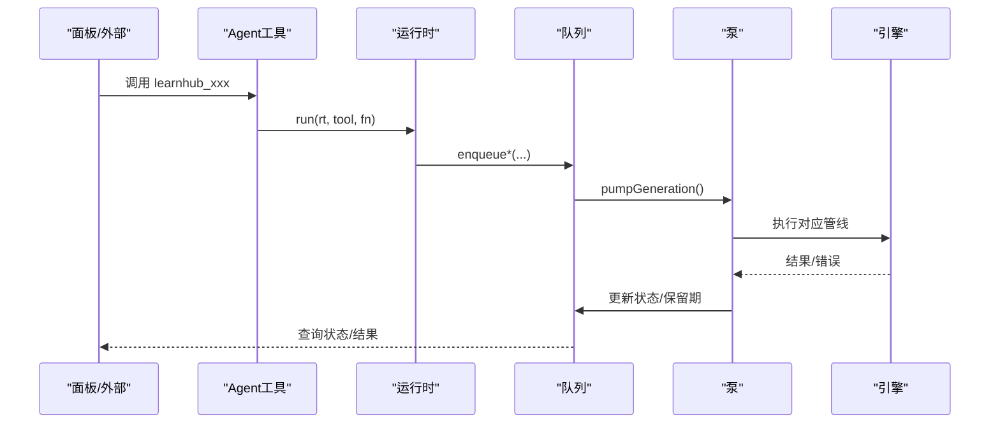
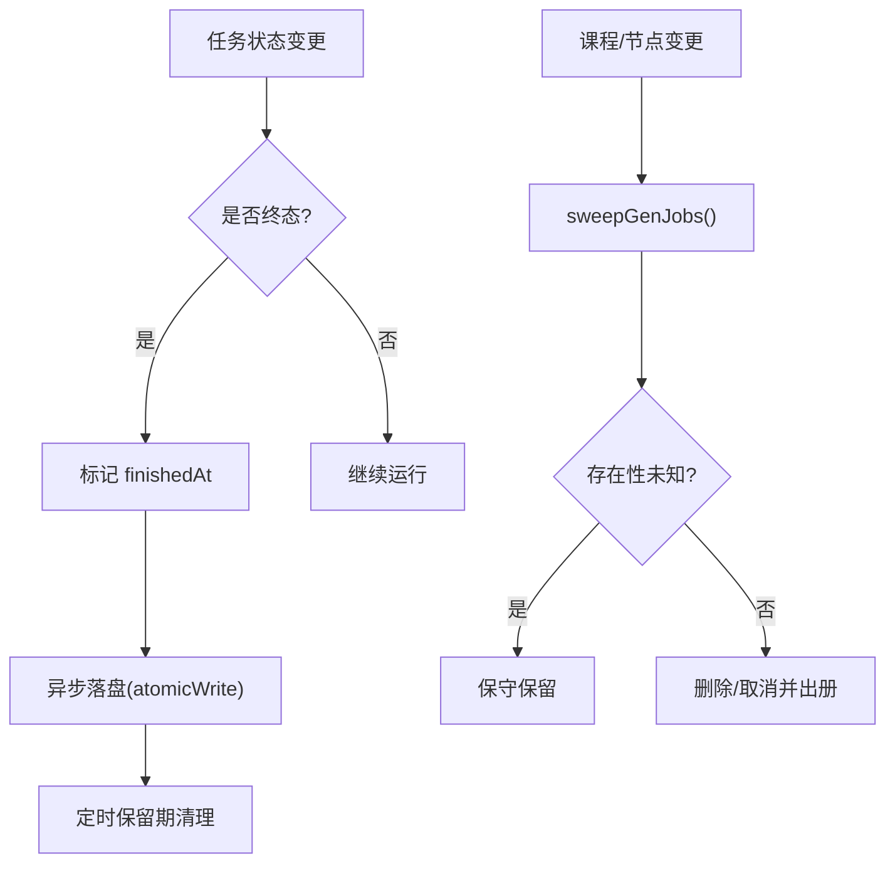
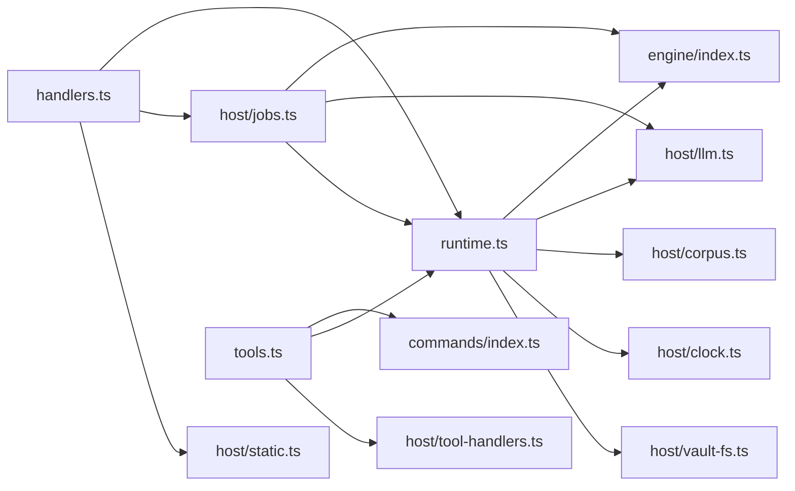

# DeepSeek Harness 集成

<cite>
**本文引用的文件**
- [runtime.ts](file://src/host/runtime.ts)
- [handlers.ts](file://src/host/handlers.ts)
- [tools.ts](file://src/host/tools.ts)
- [jobs.ts](file://src/host/jobs.ts)
- [llm.ts](file://src/host/llm.ts)
- [vault-fs.ts](file://src/host/vault-fs.ts)
- [index.ts](file://src/engine/index.ts)
- [agent.ts](file://src/engine/agent.ts)
- [tool-contracts.ts](file://src/tool-contracts.ts)
</cite>

## 目录
1. [简介](#简介)
2. [项目结构](#项目结构)
3. [核心组件](#核心组件)
4. [架构总览](#架构总览)
5. [详细组件分析](#详细组件分析)
6. [依赖关系分析](#依赖关系分析)
7. [性能与资源管理](#性能与资源管理)
8. [调试与监控](#调试与监控)
9. [故障排除指南](#故障排除指南)
10. [结论](#结论)

## 简介
本技术文档面向 LearnHub 与 DeepSeek Harness（DSH）框架的集成，聚焦以下目标：
- 插件生命周期管理：加载、初始化、卸载流程与状态恢复。
- 事件处理机制：事件订阅、发布与消息传递协议（HTTP 路由、Agent 工具通道）。
- 状态同步策略：本地内存态与持久化注册表、宿主状态的协调。
- 资源管理机制：内存、文件访问限制与清理策略。
- 调试与监控：日志输出、性能指标与故障诊断。
- 集成示例与常见问题排查。

## 项目结构
LearnHub 插件采用“宿主层 + 引擎层”的分层设计：
- 宿主层（host）：负责 HTTP 路由、Agent 工具注册、LLM 适配、队列与任务执行泵、运行日志与语料捕获等。
- 引擎层（engine）：提供领域能力门面（课程、图、题库、学习者、项目、调度、内容管线等），通过端口注入实现可测性与解耦。

图表来源
- [runtime.ts:1-255](file://src/host/runtime.ts#L1-L255)
- [handlers.ts:1-742](file://src/host/handlers.ts#L1-L742)
- [tools.ts:1-126](file://src/host/tools.ts#L1-L126)
- [jobs.ts:1-800](file://src/host/jobs.ts#L1-L800)
- [llm.ts:1-390](file://src/host/llm.ts#L1-L390)
- [vault-fs.ts:1-25](file://src/host/vault-fs.ts#L1-L25)
- [index.ts:1-800](file://src/engine/index.ts#L1-L800)
- [agent.ts:1-227](file://src/engine/agent.ts#L1-L227)

章节来源
- [runtime.ts:1-255](file://src/host/runtime.ts#L1-L255)
- [index.ts:133-398](file://src/engine/index.ts#L133-L398)

## 核心组件
- 运行时（HostRuntime）：承载引擎实例、Agent 缝、语料捕获器、路径、任务表与旗标；提供入口解析与运行日志。
- 路由处理器（handlers）：面板 HTTP 端点集合，调用引擎子系统并记录运行日志。
- Agent 工具面（tools）：将命令声明注册为 DSH 工具，参数 schema 与执行路径由注册表驱动。
- 生成队列与泵（jobs）：全局串行 FIFO 队列，支持内容生成、出题、生长批与图域任务；具备保留期清扫与重启恢复。
- LLM 适配（llm）：统一补全与流式回路适配器，负责语义档翻译、空闲超时、截断重试、档位降级与语料捕获。
- 存储适配（vault-fs）：对引擎暴露 VaultFs 端口，封装 node:fs 操作。
- 引擎门面（engine/index）：聚合各子系统，提供数据访问唯一出口与类型导出。

章节来源
- [runtime.ts:118-193](file://src/host/runtime.ts#L118-L193)
- [handlers.ts:101-742](file://src/host/handlers.ts#L101-L742)
- [tools.ts:72-126](file://src/host/tools.ts#L72-L126)
- [jobs.ts:269-740](file://src/host/jobs.ts#L269-L740)
- [llm.ts:34-390](file://src/host/llm.ts#L34-L390)
- [vault-fs.ts:1-25](file://src/host/vault-fs.ts#L1-L25)
- [index.ts:149-398](file://src/engine/index.ts#L149-L398)

## 架构总览
插件启动时创建 HostRuntime，装配引擎、Agent 缝、语料捕获器与任务表；随后注册 Agent 工具与 HTTP 路由。请求进入 handlers，经 runtime 解析到引擎方法或队列入队；队列泵在后台串行执行任务，结果写回注册表并触发后续检查点。

图表来源
- [handlers.ts:101-742](file://src/host/handlers.ts#L101-L742)
- [runtime.ts:198-255](file://src/host/runtime.ts#L198-L255)
- [jobs.ts:696-740](file://src/host/jobs.ts#L696-L740)
- [llm.ts:75-222](file://src/host/llm.ts#L75-L222)
- [index.ts:724-753](file://src/engine/index.ts#L724-L753)

## 详细组件分析

### 插件生命周期管理（加载、初始化、卸载）
- 加载与初始化
  - createHostRuntime 校验 vault 与学习中心路径，写入新鲜库配置，构造引擎、Agent 缝、语料捕获器、任务表与旗标。
  - 装配 Agent 缝：注入 llmSeam/llmStreamSeam 与 onCall 观测回调，统一记录调用日志。
  - 注册 Agent 工具：遍历命令声明，按 agent 通道注册 defineTool，execute 走 run(rt, tool, ...) 或直接 handler。
- 运行中
  - 路由 handlers 暴露 HTTP 端点，统一通过 apiRun 包装，失败与成功均落运行日志。
  - 队列 jobs 维护全局 FIFO 任务表，pumpGeneration 单并发执行，终态后按保留期自动清扫。
- 卸载与恢复
  - 任务注册表持久化：每次状态变更异步落盘；进程重启后从文件恢复 Map，遗留 running 置失败。
  - Broken 保护：任务档损坏时置 genQueueBroken，拒绝写回，避免覆盖现场；修复后重启恢复。

图表来源
- [runtime.ts:138-193](file://src/host/runtime.ts#L138-L193)
- [tools.ts:101-126](file://src/host/tools.ts#L101-L126)
- [jobs.ts:724-753](file://src/engine/index.ts#L724-L753)

章节来源
- [runtime.ts:138-193](file://src/host/runtime.ts#L138-L193)
- [tools.ts:101-126](file://src/host/tools.ts#L101-L126)
- [jobs.ts:269-437](file://src/host/jobs.ts#L269-L437)
- [index.ts:724-753](file://src/engine/index.ts#L724-L753)

### 事件处理机制（订阅、发布与消息传递）
- 事件源
  - HTTP 路由：GET/POST 端点作为事件入口，如 /generate、/question-generate、/coach/growth 等。
  - Agent 工具：learnhub_* 工具由命令声明驱动，execute 绑定 engine 入口或 handler。
- 事件分发
  - 直接调用：resolveEngineEntry 解析 engine..method 并 bind 接收者，确保 this.e 引用正确。
  - 队列入队：enqueueGeneration/enqueueQuizGeneration/enqueueGrowthBatch/enqueueGraphJob 将任务加入 Map，触发 pumpGeneration。
- 事件消费
  - 队列泵：按 phase 分派到 generateContent/generateQuizJob/generateGrowthJob/generateGraphJob。
  - 回调与检查点：队列空闲触发教练回合检查点与复诊结算，形成闭环。

图表来源
- [tools.ts:101-126](file://src/host/tools.ts#L101-L126)
- [runtime.ts:198-215](file://src/host/runtime.ts#L198-L215)
- [jobs.ts:292-567](file://src/host/jobs.ts#L292-L567)
- [jobs.ts:696-740](file://src/host/jobs.ts#L696-L740)

章节来源
- [handlers.ts:101-742](file://src/host/handlers.ts#L101-L742)
- [tools.ts:72-126](file://src/host/tools.ts#L72-L126)
- [runtime.ts:198-215](file://src/host/runtime.ts#L198-L215)
- [jobs.ts:292-740](file://src/host/jobs.ts#L292-L740)

### 状态同步策略（本地状态与宿主状态协调）
- 内存态
  - HostJobs.genJobs：Map<course/node, GenJob>，保存任务键、阶段、进度、失败详情等。
  - HostFlags：queuePaused/pumping/lastSessionStartAt/genQueueBroken 控制队列行为与会话节流。
- 持久化
  - 任务注册表：state/生成任务.json，原子写入；读取失败或格式错误置 Broken 并上抛。
  - 运行日志：state/运行日志.md，追加记录，失败不影响主流程。
- 协调机制
  - 写回闸：genQueueBroken 期间拒绝一切会全量落盘的交互路径，防止覆盖坏档。
  - 保留期：终态任务按 done/failed/cancelled 不同保留时长，到期自动出册。
  - 清扫：课程删除或节点删/改名时，扫描注册表并清理悬空任务。

图表来源
- [jobs.ts:378-437](file://src/host/jobs.ts#L378-L437)
- [index.ts:724-753](file://src/engine/index.ts#L724-L753)
- [runtime.ts:217-231](file://src/host/runtime.ts#L217-L231)

章节来源
- [jobs.ts:269-437](file://src/host/jobs.ts#L269-L437)
- [index.ts:724-753](file://src/engine/index.ts#L724-L753)
- [runtime.ts:217-231](file://src/host/runtime.ts#L217-L231)

### 资源管理机制（内存、文件访问限制与清理）
- 内存管理
  - 队列泵单并发：pumping 标志保证同一时刻仅一个任务执行，避免并发竞争。
  - 会话节流：lastSessionStartAt 与 30 分钟阈值，避免频繁触发教练检查点。
- 文件访问限制
  - 静态资源白名单：/file、/vendor/、/interactive 限 vault 内路径与扩展名，CSP 禁外联。
  - 存储适配：所有读/写/列目录通过 VaultFs，屏蔽底层 fs 差异。
- 清理策略
  - 任务保留期：done 30 分钟，failed/cancelled 24 小时，到期自动出册。
  - 题库清理预览：只读扫描归档候选，确认后才归档，不物理删除。
  - 生成语料捕获：失败/容忍/成功记录落盘，便于离线评审与回溯。

章节来源
- [handlers.ts:118-129](file://src/host/handlers.ts#L118-L129)
- [vault-fs.ts:1-25](file://src/host/vault-fs.ts#L1-L25)
- [jobs.ts:378-437](file://src/host/jobs.ts#L378-L437)
- [llm.ts:106-165](file://src/host/llm.ts#L106-L165)

### 调试与监控支持（日志、指标与诊断）
- 运行日志
  - runLog：每次引擎调用记录工具名与输出摘要，失败也留痕；输出截断上限防日志膨胀。
  - 队列清扫与教练检查点：失败只留运行日志，不阻塞主流程。
- 性能指标
  - Agent 调用记录：station/mode/effort/callNo/durationMs/usage，console.info 与运行日志双通道。
  - 模型透明：/status 附带 provider/model/思考档，便于定位部署配置。
- 诊断
  - 语料捕获：每个站点的 prompt/output/toolCalls/truncated/usage 落盘，失败标注 code。
  - 数据体检：dataCheck/questionAudit 只读盘点 Missing/Broken 与违规题，辅助定位问题。

章节来源
- [runtime.ts:195-255](file://src/host/runtime.ts#L195-L255)
- [agent.ts:42-56](file://src/engine/agent.ts#L42-L56)
- [llm.ts:106-165](file://src/host/llm.ts#L106-L165)
- [index.ts:467-520](file://src/engine/index.ts#L467-L520)

## 依赖关系分析
- 耦合与内聚
  - 宿主层高内聚：路由、工具、队列、LLM 适配集中在 host/*，职责清晰。
  - 引擎层低耦合：通过端口注入（clock/rng/fs）与子系统聚合，测试可替换实现。
- 直接依赖
  - runtime.ts 依赖 engine/index.ts、host/llm.ts、host/corpus.ts、host/clock.ts、host/vault-fs.ts。
  - handlers.ts 依赖 runtime.ts、jobs.ts、static.ts、quality-review.ts、spike.ts。
  - tools.ts 依赖 commands/index.ts、runtime.ts、tool-handlers.ts。
  - jobs.ts 依赖 engine/index.ts、generation-jobs.ts、host/llm.ts、host/runtime.ts。
- 间接依赖
  - Agent 缝（engine/agent.ts）依赖 LlmComplete/LlmStream 端口，由 host/llm.ts 提供实现。
- 循环依赖
  - 未见显式循环；引擎子模块通过门面聚合，宿主仅导入门面与纯类型常量。

图表来源
- [runtime.ts:1-255](file://src/host/runtime.ts#L1-L255)
- [handlers.ts:1-742](file://src/host/handlers.ts#L1-L742)
- [tools.ts:1-126](file://src/host/tools.ts#L1-L126)
- [jobs.ts:1-800](file://src/host/jobs.ts#L1-L800)

章节来源
- [runtime.ts:1-255](file://src/host/runtime.ts#L1-L255)
- [handlers.ts:1-742](file://src/host/handlers.ts#L1-L742)
- [tools.ts:1-126](file://src/host/tools.ts#L1-L126)
- [jobs.ts:1-800](file://src/host/jobs.ts#L1-L800)

## 性能与资源管理
- 队列并发控制
  - pumping 标志确保单并发执行，避免多任务争用文件系统与 LLM 配额。
  - 队列空闲触发教练检查点与复诊结算，减少无效轮询。
- LLM 调用优化
  - 语义档 fast/deep 映射部署配置，机械调用默认 fast，高复杂度节点升 deep。
  - 空闲超时与截断重试：无新输出超时中止；max-tokens 截断提高上限重试一次。
  - 档位降级：UNSUPPORTED_REASONING_EFFORT 自动降级为部署默认重试。
- 文件 IO
  - 原子写入任务注册表，避免部分写入导致不一致。
  - 运行日志追加，失败静默，不影响主流程。
- 内存占用
  - 任务 Map 与结果 Map 随终态保留期清理，避免长期增长。
  - 会话节流降低高频检查点开销。

章节来源
- [jobs.ts:696-740](file://src/host/jobs.ts#L696-L740)
- [llm.ts:270-390](file://src/host/llm.ts#L270-L390)
- [index.ts:724-753](file://src/engine/index.ts#L724-L753)
- [runtime.ts:217-231](file://src/host/runtime.ts#L217-L231)

## 调试与监控
- 日志输出
  - 运行日志：每次引擎调用记录工具名与输出摘要，失败也留痕；输出截断上限。
  - Agent 调用日志：console.info 与运行日志双通道，包含 station/mode/effort/usage。
- 性能指标
  - /status 附带 LLM 配置（provider/model/思考档），便于定位部署问题。
  - 语料捕获：每个站点的 prompt/output/toolCalls/truncated/usage 落盘，失败标注稳定码。
- 故障诊断
  - 数据体检：dataCheck/questionAudit 只读盘点 Missing/Broken 与违规题。
  - 题库清理预览：只读扫描归档候选，确认后才归档，不物理删除。

章节来源
- [runtime.ts:195-255](file://src/host/runtime.ts#L195-L255)
- [agent.ts:42-56](file://src/engine/agent.ts#L42-L56)
- [llm.ts:106-165](file://src/host/llm.ts#L106-L165)
- [index.ts:467-520](file://src/engine/index.ts#L467-L520)

## 故障排除指南
- 常见错误与定位
  - 任务档损坏：genQueueBroken 置位，拒绝写回；需修复或删除任务档后重启。
  - LLM 调用失败：捕获 failed+稳定码（如 NO_ADAPTER/MISSING_CREDENTIAL/AUTH/RATE_LIMIT），检查 provider/model/凭证。
  - 节点不存在：locateNode 在多课程中找不到或重复命中，使用“课程/节点”明确指定。
  - 终点禁止生成：endpoint 恒拒生成请求，需通过教练回合或面板下发。
- 排查步骤
  - 查看运行日志：state/运行日志.md，定位最近一次失败工具与输出摘要。
  - 检查任务注册表：state/生成任务.json，确认任务状态与保留期。
  - 语料回放：根据站点名称查找生成语料，核对 prompt/output/toolCalls。
  - 数据体检：运行 dataCheck/questionAudit，识别 Missing/Broken 与违规题。
- 恢复建议
  - 修复任务档后重启宿主，队列恢复执行。
  - 调整 LLM 配置（provider/model/effort）后重启宿主。
  - 对违规题进行归档或定向补题，保持题库健康。

章节来源
- [jobs.ts:269-437](file://src/host/jobs.ts#L269-L437)
- [llm.ts:318-390](file://src/host/llm.ts#L318-L390)
- [index.ts:419-435](file://src/engine/index.ts#L419-L435)
- [index.ts:467-520](file://src/engine/index.ts#L467-L520)

## 结论
LearnHub 与 DeepSeek Harness 的集成通过清晰的宿主/引擎分层、显式运行时对象与端口注入，实现了高内聚、低耦合与强可测性。插件生命周期管理完备，事件处理机制统一，状态同步策略稳健，资源管理与清理策略完善，调试与监控支持充分。开发者可基于本文档快速理解集成要点，并在实践中高效定位与解决问题。