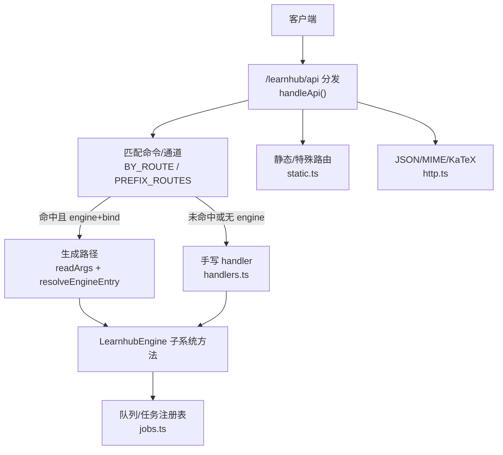
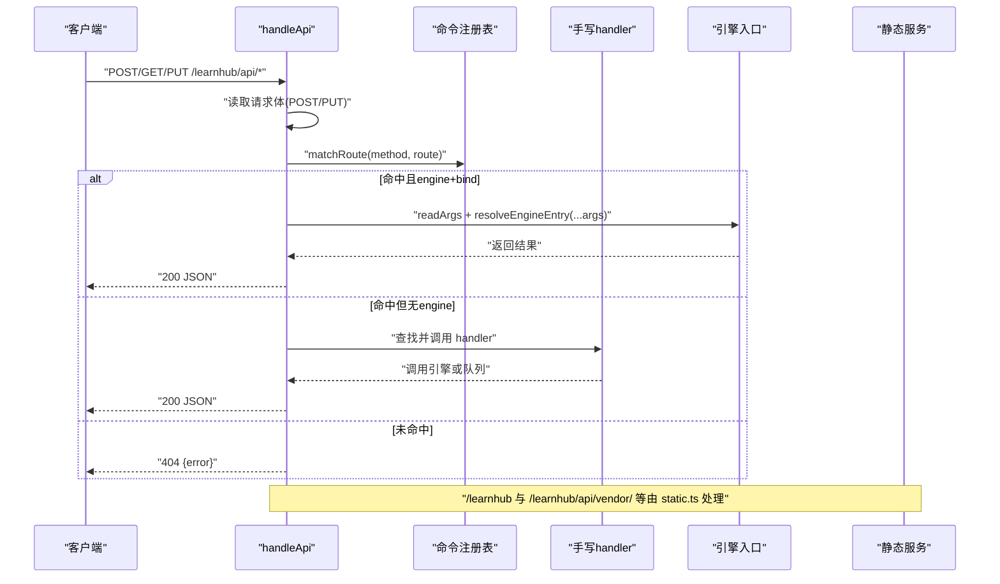
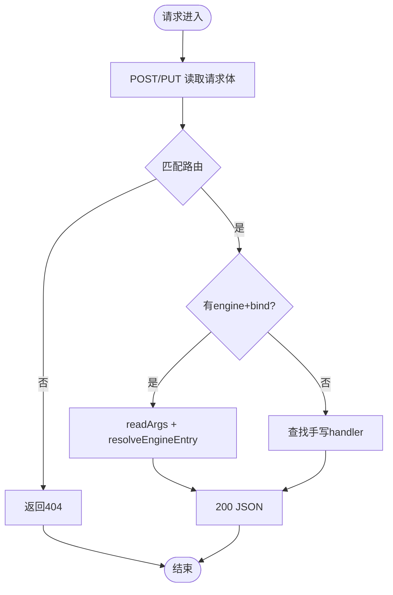
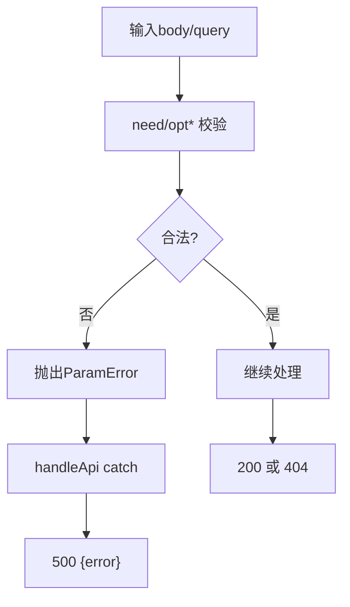
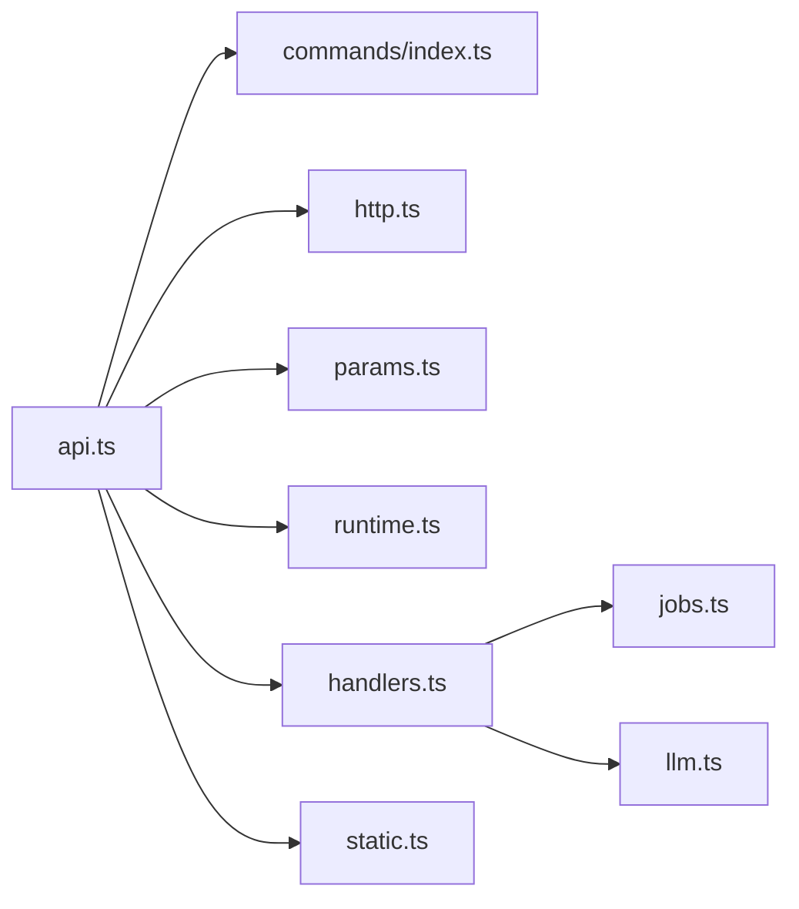

# HTTP API 路由

<cite>
**本文引用的文件**
- [src/host/api.ts](file://src/host/api.ts)
- [src/host/handlers.ts](file://src/host/handlers.ts)
- [src/host/route-table.ts](file://src/host/route-table.ts)
- [src/host/http.ts](file://src/host/http.ts)
- [src/host/runtime.ts](file://src/host/runtime.ts)
- [src/host/params.ts](file://src/host/params.ts)
- [src/host/static.ts](file://src/host/static.ts)
- [src/commands/index.ts](file://src/commands/index.ts)
- [tests/host-routes.test.ts](file://tests/host-routes.test.ts)
</cite>

## 目录
1. [简介](#简介)
2. [项目结构](#项目结构)
3. [核心组件](#核心组件)
4. [架构总览](#架构总览)
5. [详细组件分析](#详细组件分析)
6. [依赖关系分析](#依赖关系分析)
7. [性能考虑](#性能考虑)
8. [故障排查指南](#故障排查指南)
9. [结论](#结论)
10. [附录：API 参考](#附录api-参考)

## 简介
本文件为 LearnHub 的 HTTP API 路由系统提供完整接口文档与实现说明，覆盖 RESTful 端点设计、URL 模式、HTTP 方法与请求/响应格式；阐述路由表注册机制与请求分发流程（含中间件链与执行顺序）；说明认证授权现状与安全策略；描述错误处理规范与标准错误码；并提供完整的 API 参考（端点、参数、示例）。同时给出安全与性能优化建议。

## 项目结构
LearnHub 的 HTTP 层位于 src/host 下，采用“数据驱动 + 手写例外”的双通道路由体系：
- 命令注册表（commands/index.ts）集中声明所有命令及其面板/工具通道，面板通道通过 route.method/path/bind 映射到引擎入口或手写 handler。
- 路由分发器（host/api.ts）负责解析 URL、读取请求体、查表匹配、调用生成路径或手写 handler，并统一错误出口。
- 手写 handler（host/handlers.ts）承载无法由生成路径覆盖的复杂逻辑（队列、多入口、领域负载等）。
- 静态资源与特殊路由（host/static.ts）提供页面、媒体、vendor 库与交互件伺服。
- 通用 HTTP 工具（host/http.ts）提供 JSON 序列化、MIME 表、KaTeX 注入等。
- 运行时上下文（host/runtime.ts）封装引擎、任务注册表、配置与日志。
- 参数守卫（host/params.ts）统一必填/可选参数的校验语义与错误类型。



图表来源
- [src/host/api.ts:48-83](file://src/host/api.ts#L48-L83)
- [src/commands/index.ts:54-71](file://src/commands/index.ts#L54-L71)
- [src/host/handlers.ts:101-741](file://src/host/handlers.ts#L101-L741)
- [src/host/static.ts:25-133](file://src/host/static.ts#L25-L133)
- [src/host/http.ts:26-54](file://src/host/http.ts#L26-L54)

章节来源
- [src/host/api.ts:1-84](file://src/host/api.ts#L1-L84)
- [src/commands/index.ts:1-72](file://src/commands/index.ts#L1-L72)

## 核心组件
- 路由表项与构造器（route-table.ts）：定义 RouteSpec、RouteCall、HttpMethod 及 get/post/put/getPrefix 构造器，预留命令注册表字段位。
- 命令装配（commands/index.ts）：聚合各域命令，导出 COMMAND_LIST、BY_ROUTE、WIRE_ARGS 等，支撑面板通道的声明式绑定。
- 分发器（api.ts）：handleApi 完成请求体读取、路由匹配、生成路径调用或手写 handler 调用，统一错误出口。
- 手写处理器（handlers.ts）：集中实现非生成路径的路由逻辑，包含大量业务端点。
- HTTP 工具（http.ts）：sendJson、readJson、MIME 表、KaTeX 注入。
- 运行时（runtime.ts）：HostRuntime、createHostRuntime、resolveEngineEntry、apiRun、runLog。
- 参数守卫（params.ts）：need/opt* 系列函数与 readArgs，统一参数校验与错误类型 ParamError。
- 静态服务（static.ts）：页面、/file、/vendor、/interactive 路由。

章节来源
- [src/host/route-table.ts:1-75](file://src/host/route-table.ts#L1-L75)
- [src/commands/index.ts:25-71](file://src/commands/index.ts#L25-L71)
- [src/host/api.ts:25-83](file://src/host/api.ts#L25-L83)
- [src/host/handlers.ts:101-741](file://src/host/handlers.ts#L101-L741)
- [src/host/http.ts:26-54](file://src/host/http.ts#L26-L54)
- [src/host/runtime.ts:135-255](file://src/host/runtime.ts#L135-L255)
- [src/host/params.ts:1-230](file://src/host/params.ts#L1-L230)
- [src/host/static.ts:25-133](file://src/host/static.ts#L25-L133)

## 架构总览
请求进入 /learnhub/api/* 后，分发器按以下顺序处理：
1. 解析 URL，剥离前缀得到 route。
2. POST/PUT 先读取请求体（即使后续未命中路由），保证非法 JSON 返回 500。
3. 精确匹配 BY_ROUTE，其次匹配前缀路由（如 GET /vendor/）。
4. 若命中且命令声明了 engine 与 bind，则走生成路径：按通道 bind 从 body/query 取值，调用 resolveEngineEntry 获取引擎方法并执行。
5. 否则查找手写 handler（键为 method + route），不存在则抛错（门④应拦截）。
6. 成功时 sendJson(200, data)，失败时统一 catch 返回 { error } 500。



图表来源
- [src/host/api.ts:48-83](file://src/host/api.ts#L48-L83)
- [src/commands/index.ts:54-71](file://src/commands/index.ts#L54-L71)
- [src/host/static.ts:25-133](file://src/host/static.ts#L25-L133)

章节来源
- [src/host/api.ts:48-83](file://src/host/api.ts#L48-L83)
- [tests/host-routes.test.ts:87-129](file://tests/host-routes.test.ts#L87-L129)

## 详细组件分析

### 路由表与注册机制
- 路由表项形状 RouteSpec 包含 method、route、handler，以及预留的 id/summary/args/engine/output/channels 字段位。
- 构造器 get/post/put/getPrefix 用于声明路由；getPrefix 仅用于 GET /vendor/。
- 命令装配将各域命令合并为一张表，导出 BY_ROUTE（method+path → CommandSpec）与 WIRE_ARGS（方法+路径 → args 键名）。
- 分发器通过 matchRoute 精确匹配优先，再前缀匹配，确保行为与旧 if 链一致。

```mermaid
classDiagram
class RouteSpec {
+string method
+string route
+boolean prefix?
+string id?
+string summary?
+unknown args?
+string engine?
+unknown output?
+channels[] channels?
}
class CommandSpec {
+string id
+ParameterSchemaSpec args
+ChannelSpec[] channels
}
class ChannelSpec {
+string tool?
+string mode?
+string phase?
+route{method,path}?
+prefix?
+bind[]?
+required[]?
+log?
}
RouteSpec --> CommandSpec : "预留字段位"
CommandSpec --> ChannelSpec : "panel通道声明"
```

图表来源
- [src/host/route-table.ts:16-75](file://src/host/route-table.ts#L16-L75)
- [src/commands/index.ts:25-71](file://src/commands/index.ts#L25-L71)

章节来源
- [src/host/route-table.ts:1-75](file://src/host/route-table.ts#L1-L75)
- [src/commands/index.ts:25-71](file://src/commands/index.ts#L25-L71)

### 请求分发与中间件链
- 中间件链极简：读体 → 匹配 → 生成路径或手写 handler → 统一错误出口。
- 无全局鉴权中间件；当前实现未内置认证授权，需在上层网关或代理层实现。
- 日志记录：apiRun 包裹引擎调用，写入运行日志；agent 调用通过 AgentSeam 记录。



图表来源
- [src/host/api.ts:48-83](file://src/host/api.ts#L48-L83)
- [src/host/runtime.ts:204-255](file://src/host/runtime.ts#L204-L255)

章节来源
- [src/host/api.ts:48-83](file://src/host/api.ts#L48-L83)
- [src/host/runtime.ts:204-255](file://src/host/runtime.ts#L204-L255)

### 参数校验与错误处理
- 参数校验集中在 params.ts，提供 need/require*/opt* 系列函数，统一错误类型为 ParamError。
- 分发器 catch 捕获 ParamError 并附加路由信息，返回 500 { error }。
- 状态码分布：200（handler 与生成路径）、404（未知路由与静态未命中）、500（统一 catch）。



图表来源
- [src/host/params.ts:36-230](file://src/host/params.ts#L36-L230)
- [src/host/api.ts:77-83](file://src/host/api.ts#L77-L83)
- [tests/host-routes.test.ts:131-178](file://tests/host-routes.test.ts#L131-L178)

章节来源
- [src/host/params.ts:1-230](file://src/host/params.ts#L1-L230)
- [src/host/api.ts:77-83](file://src/host/api.ts#L77-L83)
- [tests/host-routes.test.ts:131-178](file://tests/host-routes.test.ts#L131-L178)

### 认证与授权
- 当前 HTTP 层未内置认证/授权中间件；所有 /learnhub/api/* 端点默认对宿主进程内调用开放。
- 建议在部署网关（反向代理/WAF）层实施身份验证与访问控制，例如基于 Token 或会话的鉴权。
- 对于敏感操作（如生成、删除课程、Anki 导入导出），可在上层增加权限检查后再转发至内部 API。

[本节为概念性说明，不直接分析具体文件]

### 静态资源与特殊路由
- /learnhub：SPA 页面伺服，index.html 与 assets/*，子路径回退 index.html。
- /learnhub/api/file：Vault 媒体文件，白名单扩展名，防路径穿越。
- /learnhub/api/vendor/*：vendored 库同源伺服，复用资产 MIME 表。
- /learnhub/api/interactive：交互件 HTML，限制在启用课程根内，CSP 严格限制外联。

章节来源
- [src/host/static.ts:25-133](file://src/host/static.ts#L25-L133)
- [src/host/http.ts:12-24](file://src/host/http.ts#L12-L24)

## 依赖关系分析
- api.ts 依赖 commands/index.ts（命令装配）、http.ts（JSON/MIME）、params.ts（参数校验）、runtime.ts（引擎入口解析与日志）、handlers.ts（手写处理器）、static.ts（特殊路由）。
- handlers.ts 依赖 runtime.ts、jobs.ts、llm.ts、static.ts、tool-contracts.ts 等。
- 测试 host-routes.test.ts 断言路由清单、行为快照、分发纪律与状态码分布。



图表来源
- [src/host/api.ts:1-84](file://src/host/api.ts#L1-L84)
- [src/host/handlers.ts:1-741](file://src/host/handlers.ts#L1-L741)

章节来源
- [src/host/api.ts:1-84](file://src/host/api.ts#L1-L84)
- [src/host/handlers.ts:1-741](file://src/host/handlers.ts#L1-L741)

## 性能考虑
- 请求体先读：POST/PUT 无论是否命中路由都先读体，避免流式消费不一致；对大请求体需注意内存占用。
- 生成路径直调引擎：减少中间层开销，适合高频短请求。
- 队列化长任务：生成、评审、spike 等耗时操作入队，HTTP 立即返回，降低超时风险。
- 缓存策略：静态资源使用 immutable/no-store 合理设置，提升前端加载性能。
- 日志截断：运行日志输出截断上限，避免过大日志影响 IO。

[本节为一般性指导，不直接分析具体文件]

## 故障排查指南
- 404 未知路由：检查 method 与 path 是否完全匹配；前缀路由仅支持 GET /vendor/。
- 500 参数错误：查看 ParamError 消息，确认必填字段缺失或类型不符；分发层会附加路由信息。
- 队列任务失败：查看运行日志与任务注册表，定位阶段与失败详情。
- 静态资源 404：确认构建产物存在，路径在白名单扩展名内，无路径穿越。

章节来源
- [tests/host-routes.test.ts:87-129](file://tests/host-routes.test.ts#L87-L129)
- [src/host/api.ts:77-83](file://src/host/api.ts#L77-L83)
- [src/host/static.ts:62-133](file://src/host/static.ts#L62-L133)

## 结论
LearnHub 的 HTTP API 路由系统以命令注册表为核心，结合生成路径与手写 handler，实现了声明式与灵活性的平衡。统一的参数校验与错误出口确保了可维护性与可观测性。当前未内置认证授权，建议在上层网关实施。性能方面通过队列化长任务与合理的缓存策略优化用户体验。

[本节为总结性内容，不直接分析具体文件]

## 附录：API 参考

### 基础约定
- 前缀：/learnhub/api
- 内容类型：application/json; charset=utf-8
- 成功响应：200 JSON
- 未知路由：404 { error: "unknown route: <METHOD> <ROUTE>" }
- 参数/业务错误：500 { error: "<消息>" }

### 端点列表（节选，按功能分组）
- 状态与健康
  - GET /status：返回引擎状态与 LLM 配置视图
  - GET /courses：列出启用的课程
  - GET /anki/status：Anki 连接状态与到期分布
- 学习与复习
  - GET /recommend：推荐节点（limit 查询参数）
  - GET /review-queue：复习队列（course/node/band 查询参数）
  - GET /probation：实验面状态（course 查询参数）
  - GET /experiments：实验模板与报告
- 生成与任务
  - POST /generate：入队生成（course/node/style）
  - POST /generate/resume：恢复暂停队列
  - POST /generate/section：单节重写（course/node/section）
  - POST /generate/cancel：取消生成（course/node）
  - POST /smoke：冒烟测试（jobTimeoutMs/quizCount/quizAuditRate/corpusDir）
  - POST /spike：工具通道 spike（runsPerCell/stations/quizCount/temperature/corpusDir）
  - POST /quality-review：离线批量评审（stations/badQuota/okQuota/repeats/systemic/outDir/corpusDir）
- 图谱与提案
  - PUT /jol：JOL 抽查配置（enabled/rate）
  - PUT /calibration/hints：过信轻提示开关（hints_enabled）
  - PUT /sleep：睡眠建议开关（enabled）
  - POST /proposals/apply：统一 apply（kind/id，联动 pair）
  - POST /proposals/reject：拒绝提案（id/note）
  - POST /endpoint/add/remove：添加/删除终点（course/endpoint/goalNote）
  - POST /seed/propose：种子起草（course/worksheet/useVaultPrior）
- 项目
  - POST /project/create：创建项目（name/goal/tier）
  - POST /project/plan/generate：计划草案（id）
  - POST /project/milestone/generate：里程碑草案（id/milestone）
  - POST /project/decompile：目标反编译（id/course/notes/goal）
  - POST /project/exec：执行事件落流（id/source/rating/evidence/nodes/note）
- 题库与问答
  - POST /question-generate：出题任务化（course/node/count/section/instruction）
  - POST /question-answer：作答（course/node/qid/answer/elapsed_s/predicted）
  - POST /question-rate：自评难度（course/node/qid/rating）
  - POST /question-forget：忘记申报（course/node/qid/elapsed_s/predicted）
  - POST /question-dispute/review：申诉复核（course/node/qid）
  - POST /question-dispute/apply：申诉结算（course/node/qid/resolution/target_ts/revision/reason）
  - POST /question-add：手动加题（course/node/question）
  - POST /question-archive：归档/恢复（course/node/qid/archived/reason）
  - POST /difficulty-advice-dismiss：忽略/恢复建议（course/node/qid/undo/all）
- 学习者产出与习惯
  - POST /habits/create/repeat/archive：习惯管理（name/cue/action/auto_rating/note/archived）
  - POST /skills/archive/maintenance：技能归档与维护节拍（skill/days）
  - POST /learner-rate：我的卡自评（course/node/card/rating）
  - POST /learner-add：加理解（course/node/content/kind/prompt/section）
  - POST /learner-archive：归档学习卡片（course/node/card/archived）
  - POST /kata/save/convert/intention：周复盘保存与意图转换（week_start/answers/course/node/cue/action）
- 交互与笔记
  - POST /tutor：轻量答疑（course/node/messages）
  - POST /explain-back：讲给我听（course/node/messages）
  - POST /explain-feedback：反馈回合（course/node/transcript）
  - POST /explain-archive：存档讲稿（course/node/content/kind/prompt/section）
  - POST /note-source/generate：笔记源出题（id/count）
  - GET /note：获取笔记（path 查询参数）
  - GET /interactive：交互件伺服（path 查询参数）
  - GET /file：媒体文件（path 查询参数）
  - GET /vendor/*：vendored 库伺服
- 其他
  - POST /rebuild：重建
  - POST /feedback：提交反馈（path）
  - POST /sandbox/run：沙盘推演（minutes_per_day/weeks/course/nodes）
  - POST /band-session：难度带会话日志（course/node/band/answered/correct）
  - POST /error-answer/error-generate/error-archive：错误对比卡（course/node/card/choice/max/archived）
  - POST /course/reset/delete：课程重置/删除（course）
  - POST /coach/growth/compass：教练生长/罗盘（course）
  - GET /graph：图分析（course/elements）
  - GET /explain-pack：讲解包（course/node/qid）
  - POST /anki/export/import：Anki 导出/导入

注意：
- 查询参数：GET 路由通过 URL.searchParams 传递，使用 optQuery/needQuery 解析。
- 请求体：POST/PUT 路由通过 JSON 传递，使用 need/opt* 系列函数解析。
- 部分路由为队列型，HTTP 立即返回，实际执行在后台队列中。

章节来源
- [src/host/handlers.ts:101-741](file://src/host/handlers.ts#L101-L741)
- [src/host/static.ts:25-133](file://src/host/static.ts#L25-L133)
- [src/host/http.ts:26-54](file://src/host/http.ts#L26-L54)
- [src/host/runtime.ts:204-255](file://src/host/runtime.ts#L204-L255)
- [src/host/params.ts:180-230](file://src/host/params.ts#L180-L230)
- [tests/host-routes.test.ts:49-113](file://tests/host-routes.test.ts#L49-L113)