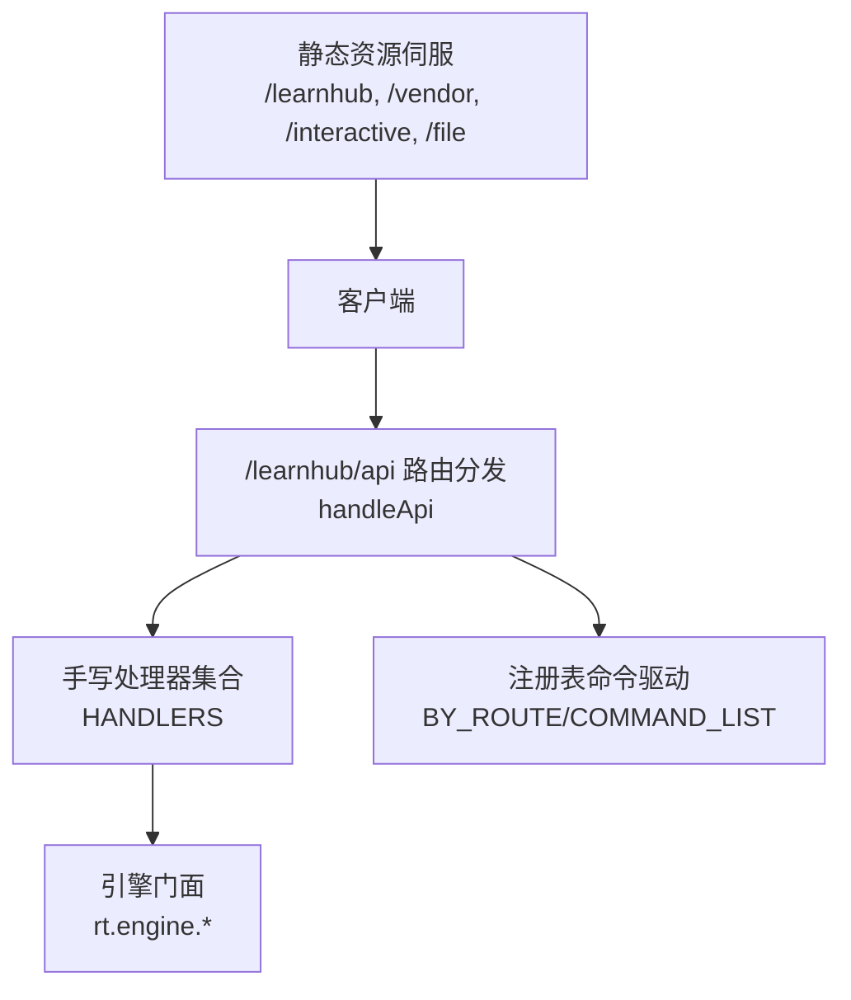
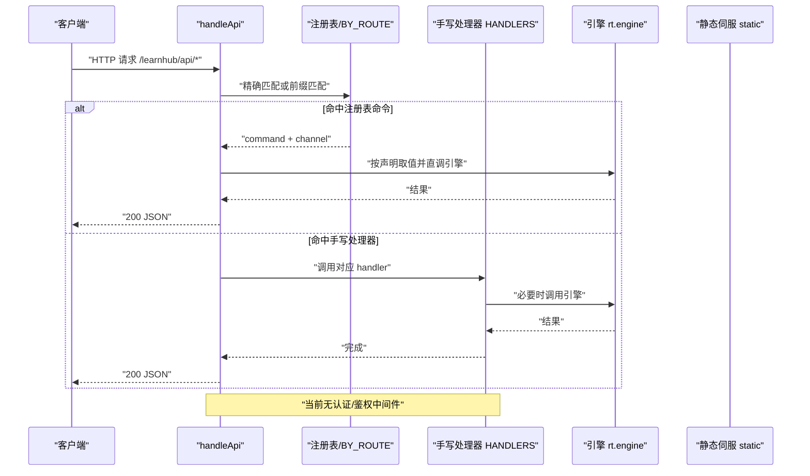
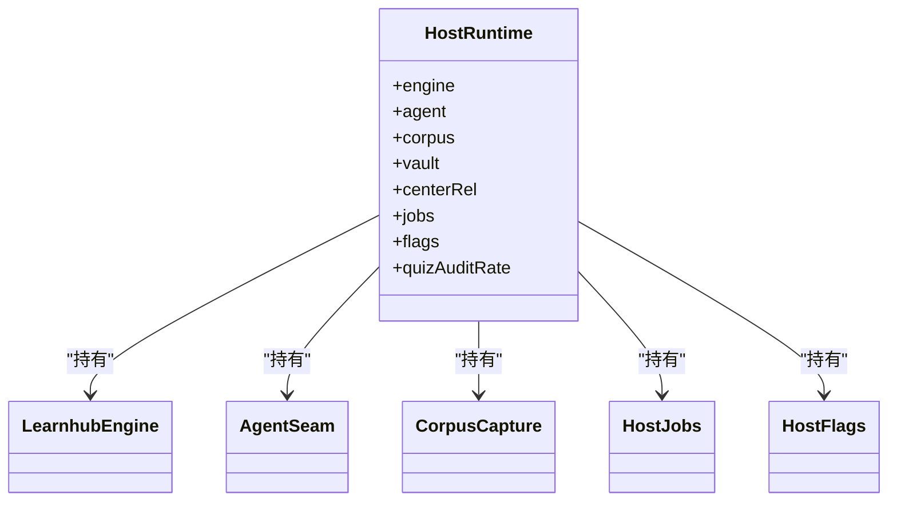
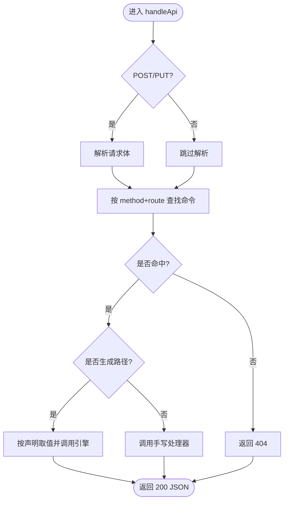
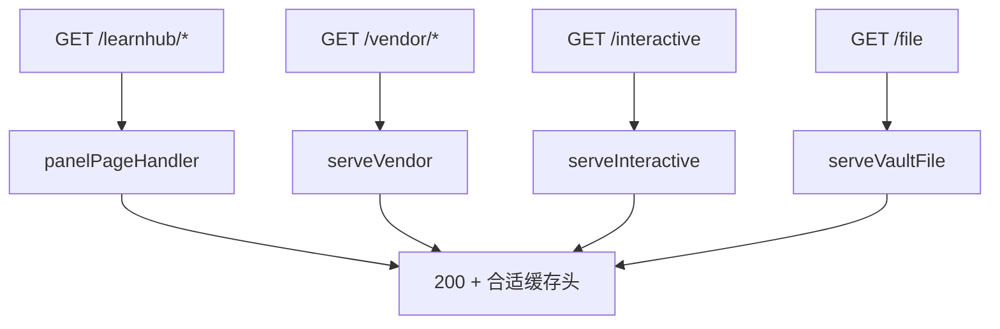
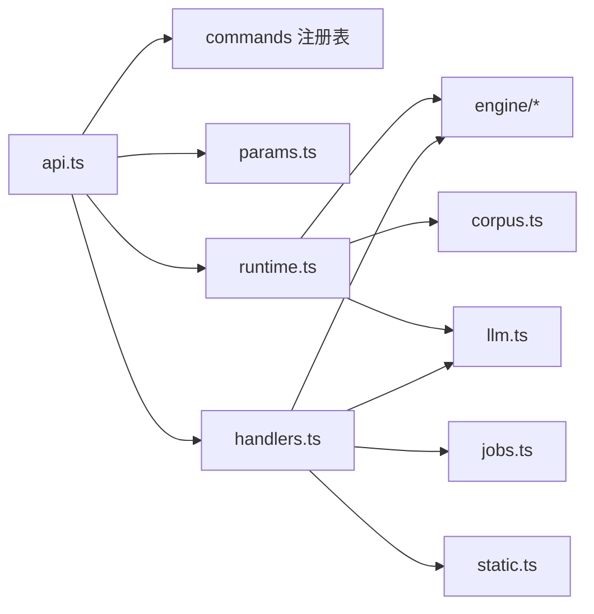

# 认证授权机制

<cite>
**本文引用的文件**
- [runtime.ts](file://src/host/runtime.ts)
- [api.ts](file://src/host/api.ts)
- [handlers.ts](file://src/host/handlers.ts)
- [http.ts](file://src/host/http.ts)
- [static.ts](file://src/host/static.ts)
- [route-table.ts](file://src/host/route-table.ts)
- [sessions.ts](file://src/engine/sessions.ts)
- [0048-host-runtime-explicit-object.md](file://docs/adr/0048-host-runtime-explicit-object.md)
- [host-runtime.test.ts](file://tests/host-runtime.test.ts)
</cite>

## 目录
1. [简介](#简介)
2. [项目结构](#项目结构)
3. [核心组件](#核心组件)
4. [架构总览](#架构总览)
5. [详细组件分析](#详细组件分析)
6. [依赖关系分析](#依赖关系分析)
7. [性能与安全考量](#性能与安全考量)
8. [故障排查指南](#故障排查指南)
9. [结论](#结论)
10. [附录：常见认证场景与方案](#附录：常见认证场景与方案)

## 简介
本文件面向 LearnHub 的认证与授权机制，聚焦 HostRuntime 中的身份与会话管理、路由级访问控制策略、令牌验证、会话持久化与安全头处理，以及角色基础访问控制（RBAC）与自定义权限规则的实现方式。同时提供安全最佳实践与常见认证场景的解决方案示例，帮助读者在现有代码基础上扩展或加固认证能力。

## 项目结构
LearnHub 的宿主侧 HTTP 入口与路由分发集中在 host 层，配合 engine 层的学习状态与调度能力。当前仓库未实现基于用户身份的认证鉴权中间件；所有 /learnhub/api/* 路由默认对调用方开放，由上层部署环境（如反向代理、网关）承担认证与授权职责。

图表来源
- [api.ts:48-83](file://src/host/api.ts#L48-L83)
- [handlers.ts:101-741](file://src/host/handlers.ts#L101-L741)
- [static.ts:25-133](file://src/host/static.ts#L25-L133)

章节来源
- [api.ts:1-84](file://src/host/api.ts#L1-L84)
- [handlers.ts:1-742](file://src/host/handlers.ts#L1-L742)
- [static.ts:1-134](file://src/host/static.ts#L1-L134)

## 核心组件
- HostRuntime：承载引擎实例、Agent 缝、语料捕获器、任务注册表与运行旗标，是宿主技术层的显式依赖注入点。
- 路由分发 handleApi：按注册表与手写处理器进行请求分发，统一参数校验与错误出口。
- 静态资源伺服：面板 SPA、vendor 库、交互件与 vault 媒体文件的受控读取与响应头设置。
- 会话与学习状态：engine/sessions.ts 提供学习日、推荐、复习队列等状态计算，但不涉及用户身份。

章节来源
- [runtime.ts:115-193](file://src/host/runtime.ts#L115-L193)
- [api.ts:48-83](file://src/host/api.ts#L48-L83)
- [static.ts:25-133](file://src/host/static.ts#L25-L133)
- [sessions.ts:318-572](file://src/engine/sessions.ts#L318-L572)

## 架构总览
下图展示一次典型请求从进入路由到返回响应的流程，并标注了当前无认证鉴权的现状。

图表来源
- [api.ts:48-83](file://src/host/api.ts#L48-L83)
- [handlers.ts:101-741](file://src/host/handlers.ts#L101-L741)

## 详细组件分析

### HostRuntime：运行时装配与可观测性
- 职责：构造引擎、Agent 缝、语料捕获器、任务注册表与运行旗标；提供日志记录与引擎入口解析。
- 关键点：
  - 配置校验失败时 fail loud（vault、centerRel、quizAuditRate）。
  - 首次启动时创建 learnhub.json 以标记版本。
  - Agent 调用通过 llmSeam/llmStreamSeam 注入，附带 token 用量与运行日志。
  - runLog/apiRun 为引擎调用提供统一日志落盘与失败留痕。

图表来源
- [runtime.ts:115-193](file://src/host/runtime.ts#L115-L193)

章节来源
- [runtime.ts:1-255](file://src/host/runtime.ts#L1-L255)
- [0048-host-runtime-explicit-object.md:1-34](file://docs/adr/0048-host-runtime-explicit-object.md#L1-L34)

### 路由分发与参数守卫
- 分发策略：精确匹配优先，其次前缀匹配；命中后走“注册表命令直调”或“手写处理器”。
- 参数守卫：集中式 need/opt* 系列函数，非法或缺失参数抛出 ParamError，统一 catch 输出 500 与中文消息。
- 行为契约：POST/PUT 先读体再查表；未知路由返回 404；错误出口唯一。

图表来源
- [api.ts:48-83](file://src/host/api.ts#L48-L83)
- [route-table.ts:1-75](file://src/host/route-table.ts#L1-L75)

章节来源
- [api.ts:1-84](file://src/host/api.ts#L1-L84)
- [route-table.ts:1-75](file://src/host/route-table.ts#L1-L75)
- [handlers.ts:101-741](file://src/host/handlers.ts#L101-L741)

### 静态资源与安全头
- 面板 SPA：/learnhub 前缀，assets 带强缓存，index.html 不缓存。
- vendor 库：/vendor/* 同源伺服，MIME 白名单限制。
- 交互件：/interactive 限课程根内 .html，CSP 严格限制外联。
- 媒体文件：/file 仅允许白名单扩展名，防路径穿越。

图表来源
- [static.ts:25-133](file://src/host/static.ts#L25-L133)
- [http.ts:26-32](file://src/host/http.ts#L26-L32)

章节来源
- [static.ts:1-134](file://src/host/static.ts#L1-L134)
- [http.ts:1-55](file://src/host/http.ts#L1-L55)

### 会话管理与学习状态
- 学习日与推荐：sessions.ts 提供 statusJson/recommendEvents 等，用于面板“今日”“推荐”等视图。
- 会话开始触点：/status 会触发 sessionStartCheckpoint（节流），用于教练回合与生成任务的观察点。
- 注意：这些“会话”指学习会话与调度上下文，并非用户身份会话。

章节来源
- [handlers.ts:102-107](file://src/host/handlers.ts#L102-L107)
- [sessions.ts:318-572](file://src/engine/sessions.ts#L318-L572)

## 依赖关系分析
- api.ts 依赖 commands 注册表、params 参数守卫、runtime 的引擎入口解析与日志工具、handlers 的手写处理器。
- handlers.ts 依赖 engine 各子系统、jobs 队列、llm 适配、static 资源服务。
- runtime.ts 依赖 engine、llm 适配、corpus 捕获、clock/fs 抽象。

图表来源
- [api.ts:1-84](file://src/host/api.ts#L1-L84)
- [handlers.ts:1-741](file://src/host/handlers.ts#L1-L741)
- [runtime.ts:1-255](file://src/host/runtime.ts#L1-L255)

章节来源
- [api.ts:1-84](file://src/host/api.ts#L1-L84)
- [handlers.ts:1-741](file://src/host/handlers.ts#L1-L741)
- [runtime.ts:1-255](file://src/host/runtime.ts#L1-L255)

## 性能与安全考量
- 性能
  - 路由分发为 O(1) 哈希查找；静态资源使用内存映射与合理缓存头减少重复传输。
  - 生成任务入队即返回，避免长连接占用请求线程。
- 安全
  - 当前无认证/鉴权中间件，所有 /learnhub/api/* 默认公开。建议在上层网关或反向代理处实施：
    - 强制 HTTPS、HSTS、CORS 白名单。
    - 基于 JWT/OIDC 的身份校验与 RBAC 授权。
    - 速率限制、IP 黑名单、CSRF/XSS 防护。
  - 静态资源已做 MIME 白名单与路径穿越防护；交互件启用 CSP 限制外联。
  - 参数守卫集中且失败快速返回，避免无效请求进入业务逻辑。

[本节为通用指导，不直接分析具体文件]

## 故障排查指南
- 404 未知路由：检查 method 与 route 是否完全匹配；确认注册表或手写处理器是否遗漏。
- 500 参数错误：查看 ParamError 消息，定位缺失或非法字段；handleApi 会在消息中追加路由信息。
- 静态资源 404：确认路径在白名单扩展名内，且未包含 ..；交互件需位于启用课程根下。
- 生成任务异常：查看运行日志与任务注册表，关注 genQueueBroken 标志与保留期清扫。

章节来源
- [api.ts:48-83](file://src/host/api.ts#L48-L83)
- [static.ts:62-133](file://src/host/static.ts#L62-L133)
- [runtime.ts:195-255](file://src/host/runtime.ts#L195-L255)
- [host-runtime.test.ts:1107-1124](file://tests/host-runtime.test.ts#L1107-L1124)

## 结论
当前 LearnHub 的宿主侧未内置用户认证与授权机制，所有 API 默认公开，适合由部署侧统一治理。HostRuntime 提供了清晰的运行时装配点与可观测性，便于接入外部认证体系（如网关层 JWT 校验、RBAC 决策）。静态资源与服务端参数守卫已具备良好安全基线，建议在网关层补齐身份与会话生命周期管理，并在路由层按需增加最小权限校验。

[本节为总结，不直接分析具体文件]

## 附录：常见认证场景与方案
- 公开接口
  - 现状：/learnhub/api/status、/courses、/recommend、/file、/vendor、/interactive 等无需登录即可访问。
  - 建议：保持公开但限制频率与来源（CORS/IP 白名单），避免敏感数据泄露。
- 用户专属接口
  - 现状：多数写入类接口（如 /generate、/proposals/apply、/question-*）未做用户隔离。
  - 建议：在网关层校验 JWT 并提取用户标识，将 userId 注入下游（例如通过请求头），由业务层按用户维度读写 vault 数据。
- 管理员接口
  - 现状：维护类接口（如 /rebuild、/course/delete、/quality-review）未区分角色。
  - 建议：在网关层基于角色（admin/operator）放行，或在路由层增加最小权限校验。
- 令牌验证
  - 建议：采用标准 OIDC/JWT，网关负责签名校验、过期检查、作用域/角色解析；后端只信任网关传递的已认证上下文。
- 会话持久化
  - 建议：服务端无状态，会话态由网关/Redis 管理；前端使用 HttpOnly Cookie 或 Bearer Token；关键操作加 CSRF 保护。
- 安全头处理
  - 建议：全局启用 HSTS、X-Content-Type-Options、X-Frame-Options、Referrer-Policy；对交互件维持 CSP 严格模式。
- 防攻击措施
  - 速率限制、输入校验（已部分实现）、路径穿越防护（已实现）、SQL/命令注入防护（避免执行外部命令）、日志脱敏。
- 角色基础访问控制（RBAC）
  - 建议：在网关层根据角色决定路由可达性；在路由层对敏感操作进行二次校验（如 course/node/qid 归属）。
- 自定义权限规则
  - 建议：将规则以声明式配置（如 per-route policy），结合注册表字段位（已在 route-table.ts 预留 RegistrySlots）逐步演进。

[本节为通用指导，不直接分析具体文件]