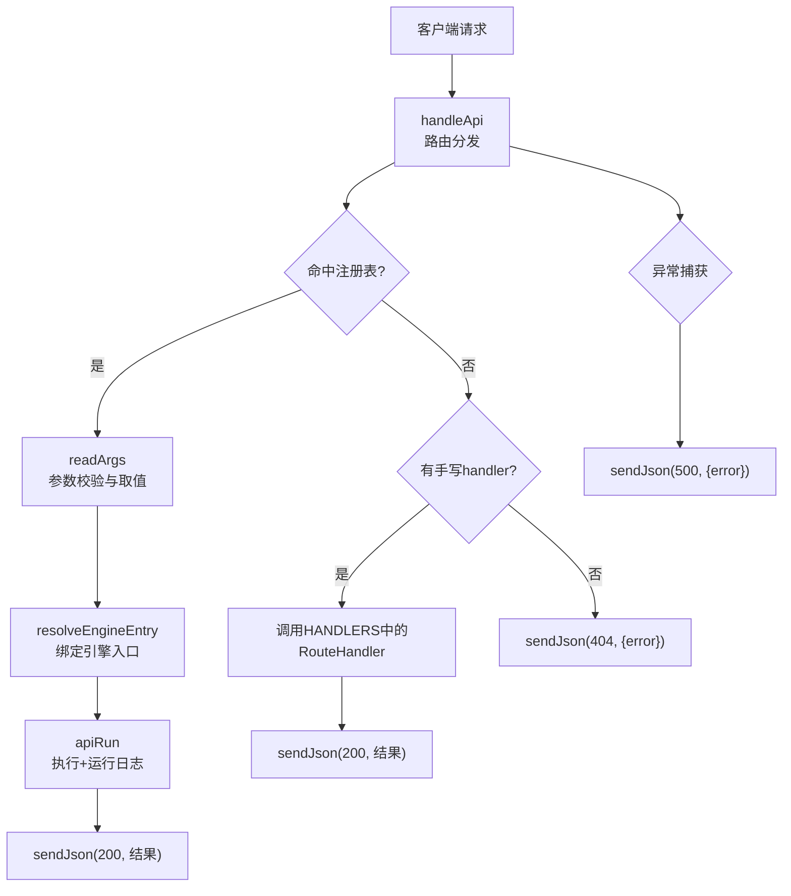
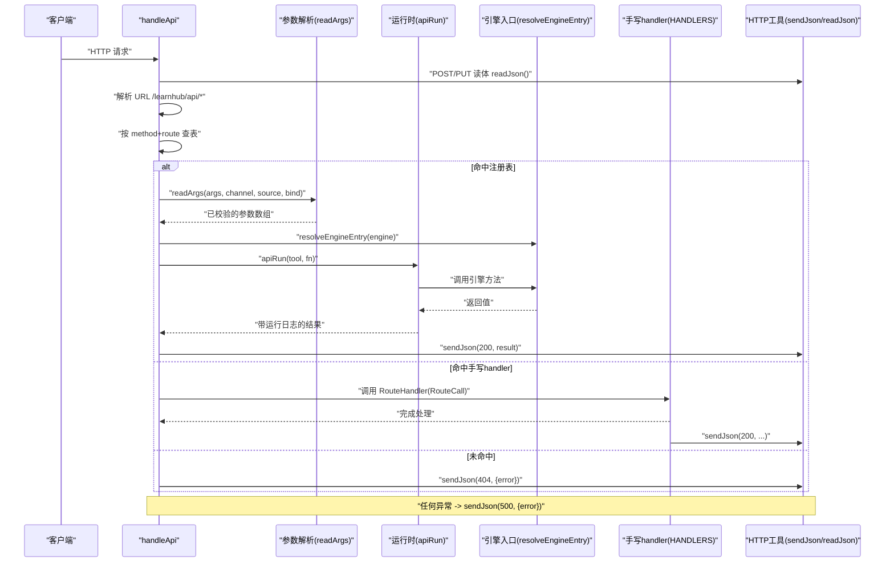
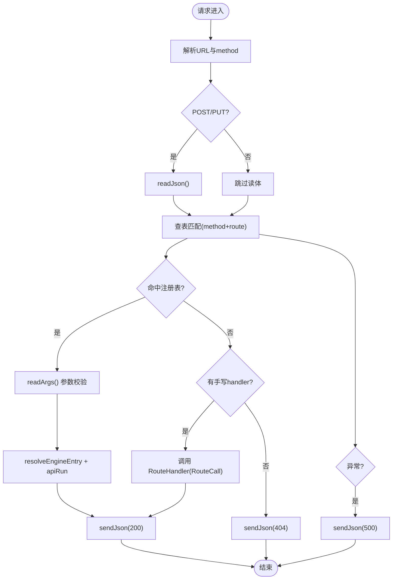
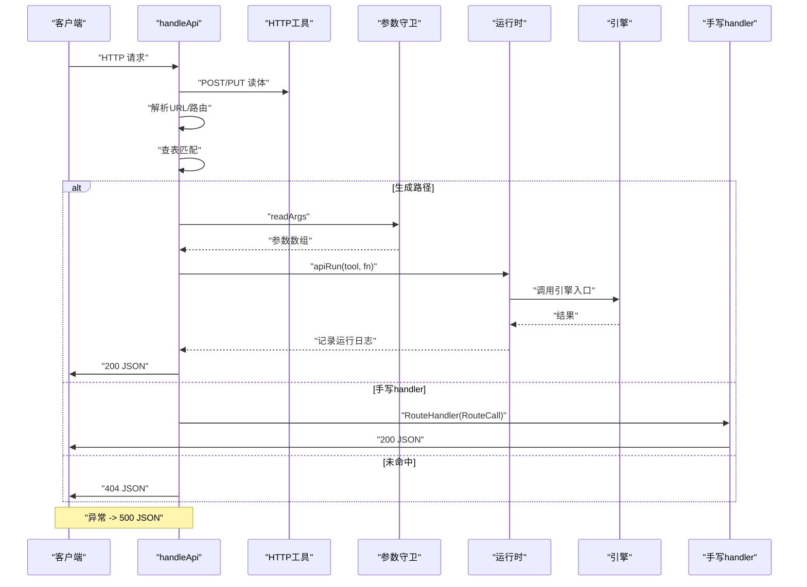
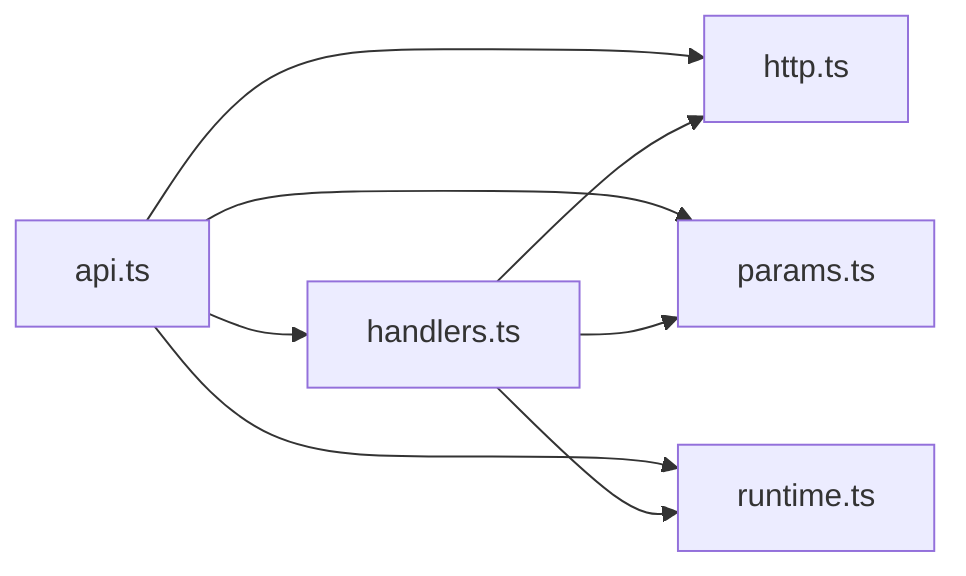

# 请求处理流程

<cite>
**本文引用的文件**
- [src/host/api.ts](file://src/host/api.ts)
- [src/host/route-table.ts](file://src/host/route-table.ts)
- [src/host/handlers.ts](file://src/host/handlers.ts)
- [src/host/http.ts](file://src/host/http.ts)
- [src/host/runtime.ts](file://src/host/runtime.ts)
- [src/host/params.ts](file://src/host/params.ts)
</cite>

## 目录
1. [简介](#简介)
2. [项目结构](#项目结构)
3. [核心组件](#核心组件)
4. [架构总览](#架构总览)
5. [详细组件分析](#详细组件分析)
6. [依赖关系分析](#依赖关系分析)
7. [性能考量](#性能考量)
8. [故障排查指南](#故障排查指南)
9. [结论](#结论)
10. [附录](#附录)

## 简介
本文件面向 LearnHub 的请求处理流程，聚焦以下目标：
- 解释 RouteCall 上下文对象的结构与作用（rt、ctx、req、res、url、route、body）。
- 描述 HTTP 请求的解析过程（URL 解析、请求体处理、参数提取）。
- 说明中间件链的执行顺序与错误传播机制。
- 阐述异步处理模式与 Promise 处理策略。
- 提供从请求接收到响应发送的完整生命周期图。
- 包含错误处理、日志记录与性能监控的实现细节。

## 项目结构
LearnHub 的 HTTP 请求处理位于宿主层（host），采用“注册表驱动分发 + 手写 handler 例外”的双通道设计：
- 注册表驱动路径：根据命令与通道声明，自动取值并直调引擎入口，统一日志与序列化。
- 手写 handler 路径：对复杂或特殊路由进行定制化处理，统一通过 sendJson 返回 JSON 响应。
- 公共能力：HTTP 工具（JSON 读写、MIME）、运行时（apiRun/runLog）、参数守卫（need/opt*）等。

图表来源
- [src/host/api.ts:48-83](file://src/host/api.ts#L48-L83)
- [src/host/handlers.ts:101-741](file://src/host/handlers.ts#L101-L741)
- [src/host/runtime.ts:243-253](file://src/host/runtime.ts#L243-L253)
- [src/host/http.ts:26-32](file://src/host/http.ts#L26-L32)

章节来源
- [src/host/api.ts:1-84](file://src/host/api.ts#L1-L84)
- [src/host/handlers.ts:1-742](file://src/host/handlers.ts#L1-L742)
- [src/host/runtime.ts:1-255](file://src/host/runtime.ts#L1-L255)
- [src/host/http.ts:1-55](file://src/host/http.ts#L1-L55)

## 核心组件
- 路由分发器 handleApi：负责 URL 解析、请求体读取、查表匹配、生成路径直调或转发到手写 handler，统一错误出口。
- 参数守卫 params：集中实现 need/opt* 系列函数，保证必填/可选参数的类型与语义一致，非法即 fail loud。
- 运行时 runtime：封装 apiRun 与 runLog，为所有引擎调用提供统一的运行日志；提供 resolveEngineEntry 将字符串路径解析为可调用函数。
- HTTP 工具 http：提供 readJson、sendJson、静态资源 MIME 映射与 KaTeX 注入等。
- 路由上下文 route-table：定义 RouteCall 与 RouteSpec，明确路由处理器所需上下文与构造方式。
- 手写 handlers：承载无法走生成路径的路由逻辑，统一使用 sendJson 输出。

章节来源
- [src/host/api.ts:48-83](file://src/host/api.ts#L48-L83)
- [src/host/params.ts:1-230](file://src/host/params.ts#L1-L230)
- [src/host/runtime.ts:198-253](file://src/host/runtime.ts#L198-L253)
- [src/host/http.ts:26-55](file://src/host/http.ts#L26-L55)
- [src/host/route-table.ts:16-75](file://src/host/route-table.ts#L16-L75)
- [src/host/handlers.ts:101-741](file://src/host/handlers.ts#L101-L741)

## 架构总览
下图展示一次典型请求的生命周期：从请求进入、解析、分发、执行业务逻辑到响应返回，以及错误与日志的贯穿点。

图表来源
- [src/host/api.ts:48-83](file://src/host/api.ts#L48-L83)
- [src/host/params.ts:182-229](file://src/host/params.ts#L182-L229)
- [src/host/runtime.ts:243-253](file://src/host/runtime.ts#L243-L253)
- [src/host/http.ts:26-39](file://src/host/http.ts#L26-L39)

## 详细组件分析

### RouteCall 上下文对象
RouteCall 是手写 handler 的统一上下文，包含：
- rt：HostRuntime，承载引擎、任务表、标志位、语料捕获器等运行时能力。
- ctx：Context，用于会话/追踪等上层上下文（由宿主装配注入）。
- req：IncomingMessage，原始 HTTP 请求对象。
- res：ServerResponse，用于写入响应。
- url：URL 实例，便于查询参数与路径解析。
- route：剥去前缀后的路由路径，用于前缀匹配与日志定位。
- body：POST/PUT 请求体解析后的 JSON 对象（GET 恒为空对象）。

该对象确保所有手写 handler 拥有相同的数据视图与能力边界，避免直接访问模块级状态。

章节来源
- [src/host/route-table.ts:19-32](file://src/host/route-table.ts#L19-L32)
- [src/host/api.ts:72-76](file://src/host/api.ts#L72-L76)

### HTTP 请求解析与参数提取
- URL 解析：handleApi 将 req.url 解析为 URL 实例，并截取 /learnhub/api 之后的路径作为 route。
- 请求体处理：POST/PUT 先读取并解析 JSON 体（即使路由未命中也会读取，保持与历史行为一致），GET 不读体。
- 参数提取：
  - 生成路径：通过 readArgs 依据命令 args 与通道 bind 声明，从 body 或 query 中取值并进行类型校验与约束检查。
  - 手写 handler：通常直接使用 params 提供的 need/opt* 系列函数对 body/url 进行强校验与取值。
- 默认值与省略语义：optText/optTrimmed 等对空白文本视为省略；optTrue 仅 true 算真；optNumber/optFinite 区分有限性；require* 系列对缺失或类型不符抛出 ParamError。

章节来源
- [src/host/api.ts:48-69](file://src/host/api.ts#L48-L69)
- [src/host/params.ts:36-178](file://src/host/params.ts#L36-L178)
- [src/host/params.ts:182-229](file://src/host/params.ts#L182-L229)

### 中间件链与执行顺序
当前实现没有传统意义上的“中间件链”，而是以“分发器 + 两条路径”的模式组织：
- 分发阶段：handleApi 统一做 URL 解析、请求体读取、查表匹配。
- 生成路径：按声明式参数取值 → 解析引擎入口 → 调用 → 统一日志 → 返回。
- 手写 handler 路径：构造 RouteCall 并调用对应 handler，handler 内部自行编排业务逻辑。
- 错误传播：任何阶段的异常都会被 catch 并转为 500 响应；ParamError 会附加路由信息以便客户端定位。

图表来源
- [src/host/api.ts:48-83](file://src/host/api.ts#L48-L83)
- [src/host/http.ts:26-39](file://src/host/http.ts#L26-L39)

章节来源
- [src/host/api.ts:48-83](file://src/host/api.ts#L48-L83)
- [src/host/handlers.ts:101-741](file://src/host/handlers.ts#L101-L741)

### 异步处理与 Promise 策略
- 所有引擎调用与 handler 均为异步（Promise），handleApi 使用 async/await 串联步骤。
- 生成路径通过 apiRun 包裹，确保成功与失败都记录运行日志，再透传结果或抛出异常。
- 手写 handler 内部可使用 fire-and-forget 触发后台任务（如队列入队），但 HTTP 响应在 sendJson 后即刻返回。
- 错误统一收敛：catch 块将异常转换为 500 响应，ParamError 附加路由名，其他业务错误原样透传。

章节来源
- [src/host/runtime.ts:243-253](file://src/host/runtime.ts#L243-L253)
- [src/host/api.ts:77-83](file://src/host/api.ts#L77-L83)
- [src/host/handlers.ts:388-397](file://src/host/handlers.ts#L388-L397)

### 请求处理生命周期图
下图汇总从请求接收到响应发送的每个关键步骤，包括错误与日志落点。

图表来源
- [src/host/api.ts:48-83](file://src/host/api.ts#L48-L83)
- [src/host/runtime.ts:243-253](file://src/host/runtime.ts#L243-L253)
- [src/host/http.ts:26-39](file://src/host/http.ts#L26-L39)

## 依赖关系分析
- api.ts 依赖 http.ts（readJson/sendJson）、params.ts（ParamError/readArgs）、runtime.ts（apiRun/resolveEngineEntry）、handlers.ts（手写路由）。
- handlers.ts 依赖 http.ts、params.ts、runtime.ts、jobs.ts、static.ts、llm.ts 等宿主能力。
- runtime.ts 提供统一的运行日志与引擎入口解析，被 api.ts 与 handlers.ts 广泛复用。
- params.ts 零 I/O，纯函数式参数校验，被 api.ts 与 handlers.ts 共同消费。

图表来源
- [src/host/api.ts:1-84](file://src/host/api.ts#L1-L84)
- [src/host/handlers.ts:1-742](file://src/host/handlers.ts#L1-L742)
- [src/host/runtime.ts:1-255](file://src/host/runtime.ts#L1-L255)
- [src/host/http.ts:1-55](file://src/host/http.ts#L1-L55)
- [src/host/params.ts:1-230](file://src/host/params.ts#L1-L230)

章节来源
- [src/host/api.ts:1-84](file://src/host/api.ts#L1-L84)
- [src/host/handlers.ts:1-742](file://src/host/handlers.ts#L1-L742)
- [src/host/runtime.ts:1-255](file://src/host/runtime.ts#L1-L255)
- [src/host/http.ts:1-55](file://src/host/http.ts#L1-L55)
- [src/host/params.ts:1-230](file://src/host/params.ts#L1-L230)

## 性能考量
- 请求体读取前置：POST/PUT 无论是否命中路由都会读取请求体，避免后续分支重复解析，同时保持与历史行为一致。
- 注册表驱动直调：命中注册表时直接调用引擎入口，减少中间层开销；未命中则快速回落到 404。
- 运行日志截断：runLog 对长输出进行截断，避免日志过大影响写入性能。
- 并发与队列：部分路由（如生成、生长批）入队即返回，避免阻塞请求线程，提升吞吐。
- 静态资源与 MIME：通过白名单与常量映射降低动态判断成本。

[本节为通用指导，不直接分析具体代码文件]

## 故障排查指南
- 404 未知路由：确认 method 与 route 是否完全匹配；注意 POST/PUT 必须先读体再查表，非法 JSON 仍会报 500 而非 404。
- 500 参数错误：检查必填字段是否存在且类型正确；关注 ParamError 消息中附带的路由信息，便于定位。
- 引擎调用失败：查看运行日志（中心状态目录下的运行日志文件），确认 apiRun 记录的失败原因与输出摘要。
- 手写 handler 问题：确认 handlers 表中键与方法/路径一致；确保 sendJson 调用位置正确且无双重序列化。
- 静态资源 404：检查路径是否在 vendor/ 或交互件白名单内，扩展名是否在 MIME 映射中。

章节来源
- [src/host/api.ts:58-60](file://src/host/api.ts#L58-L60)
- [src/host/api.ts:77-83](file://src/host/api.ts#L77-L83)
- [src/host/runtime.ts:218-231](file://src/host/runtime.ts#L218-L231)
- [src/host/runtime.ts:243-253](file://src/host/runtime.ts#L243-L253)
- [src/host/http.ts:12-24](file://src/host/http.ts#L12-L24)

## 结论
LearnHub 的请求处理以“注册表驱动 + 手写 handler 例外”为核心，结合统一的参数校验、运行时日志与 HTTP 工具，实现了清晰的分发路径、一致的错误出口与良好的可观测性。RouteCall 为手写 handler 提供了稳定上下文，使复杂路由逻辑得以在统一契约下实现。整体设计兼顾了性能、可维护性与可扩展性。

[本节为总结性内容，不直接分析具体代码文件]

## 附录
- 关键类型与接口
  - RouteCall：路由处理上下文（rt、ctx、req、res、url、route、body）。
  - RouteSpec：路由表项（method、route、handler、prefix）。
  - HostRuntime：运行时对象（engine、agent、corpus、vault、centerRel、jobs、flags、quizAuditRate）。
  - ParamError：参数校验错误类型。
- 常用工具
  - readJson：读取并解析 POST JSON 请求体。
  - sendJson：统一 JSON 响应输出。
  - apiRun：引擎调用包装，记录运行日志。
  - resolveEngineEntry：将引擎入口字符串解析为可调用函数。
  - need/opt*：参数校验与取值工具。

章节来源
- [src/host/route-table.ts:16-75](file://src/host/route-table.ts#L16-L75)
- [src/host/runtime.ts:115-133](file://src/host/runtime.ts#L115-L133)
- [src/host/params.ts:32-34](file://src/host/params.ts#L32-L34)
- [src/host/http.ts:26-39](file://src/host/http.ts#L26-L39)
- [src/host/runtime.ts:198-253](file://src/host/runtime.ts#L198-L253)
- [src/host/params.ts:36-178](file://src/host/params.ts#L36-L178)