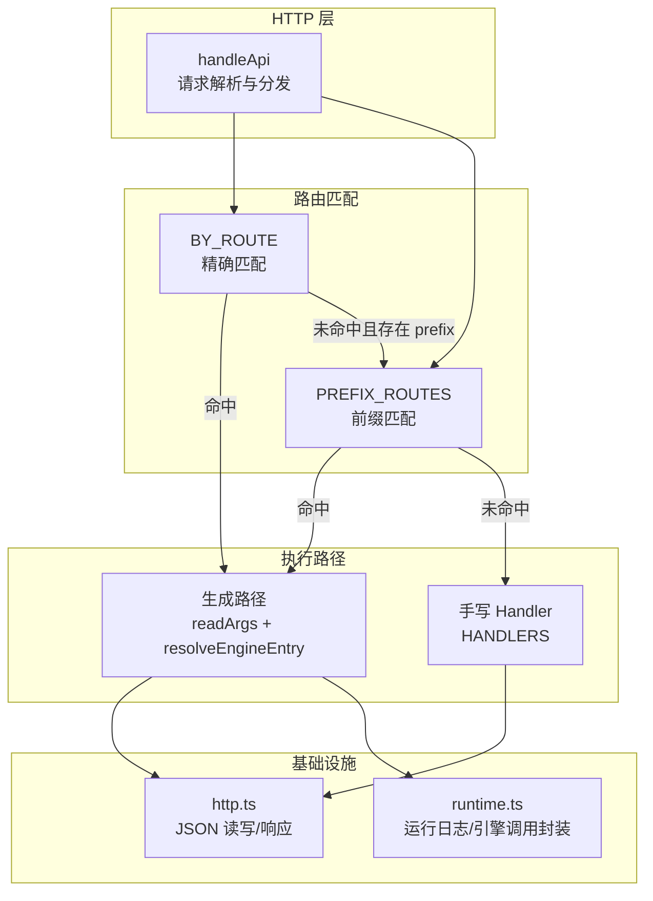
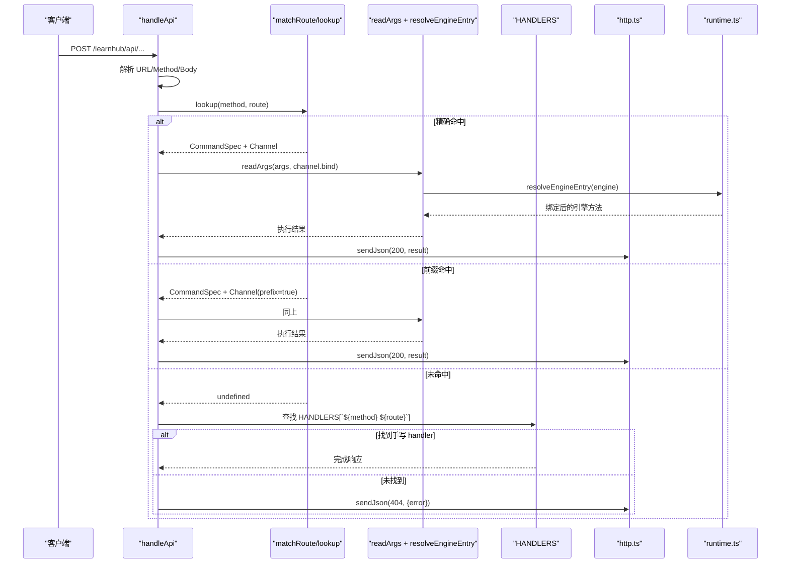
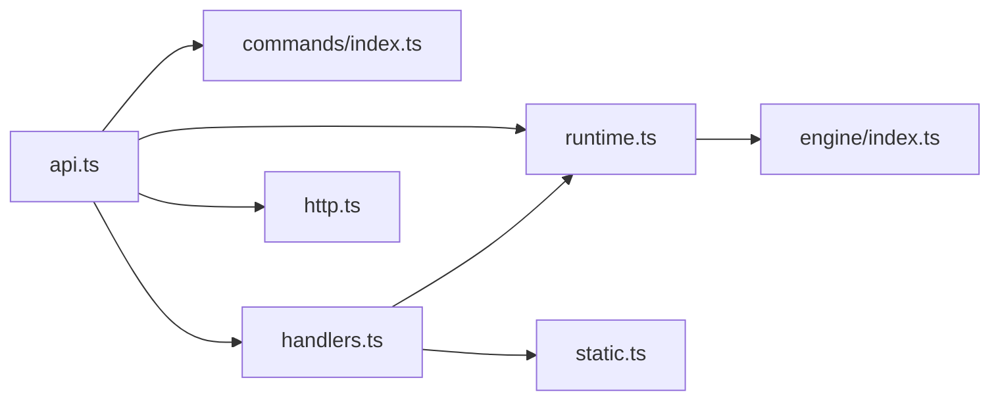

# 路由定义与注册

<cite>
**本文引用的文件**
- [route-table.ts](file://src/host/route-table.ts)
- [api.ts](file://src/host/api.ts)
- [handlers.ts](file://src/host/handlers.ts)
- [http.ts](file://src/host/http.ts)
- [runtime.ts](file://src/host/runtime.ts)
- [commands/index.ts](file://src/commands/index.ts)
- [commands/types.ts](file://src/commands/types.ts)
- [commands/学习.ts](file://src/commands/学习.ts)
</cite>

## 目录
1. [简介](#简介)
2. [项目结构](#项目结构)
3. [核心组件](#核心组件)
4. [架构总览](#架构总览)
5. [详细组件分析](#详细组件分析)
6. [依赖关系分析](#依赖关系分析)
7. [性能考量](#性能考量)
8. [故障排查指南](#故障排查指南)
9. [结论](#结论)
10. [附录：新增端点最佳实践](#附录新增端点最佳实践)

## 简介
本文件系统性说明 LearnHub 的路由定义与注册机制，重点覆盖：
- RouteSpec 接口设计及其字段约束（method、route、handler、prefix）
- 路由构造器函数 get/post/put/getPrefix 的使用方法与最佳实践
- 前缀路由匹配机制与特殊路由处理逻辑
- 声明式命令注册表驱动的 API 路由分发模式
- 如何正确定义新的 API 端点，以及如何处理路由冲突与版本管理

## 项目结构
LearnHub 的 HTTP 路由体系由“声明式命令注册表 + 手写例外处理器”双轨组成：
- 声明式路径：通过 commands/* 域文件集中声明命令、参数 schema、通道与引擎入口，运行时自动装配为面板路由。
- 手写路径：对于无法走生成路径的复杂逻辑，集中在 handlers.ts 中按 method+path 键登记 handler。

图表来源
- [api.ts:48-83](file://src/host/api.ts#L48-L83)
- [commands/index.ts:58-71](file://src/commands/index.ts#L58-L71)
- [handlers.ts:101-741](file://src/host/handlers.ts#L101-L741)
- [http.ts:26-40](file://src/host/http.ts#L26-L40)
- [runtime.ts:204-253](file://src/host/runtime.ts#L204-L253)

章节来源
- [api.ts:1-84](file://src/host/api.ts#L1-L84)
- [commands/index.ts:1-72](file://src/commands/index.ts#L1-L72)

## 核心组件
- RouteSpec：一条面板路由的最小描述单元，包含方法、路径、处理器与前缀标记，并预留命令注册表字段位以便未来演进。
- 路由构造器：get/post/put/getPrefix，用于快速创建 RouteSpec。
- 命令注册表：以 id 为键的命令集合，每个命令可声明多个通道（agent/panel），其中 panel 通道携带 route 信息，形成声明式路由表。
- 分发器 handleApi：负责读取请求体、匹配路由、选择生成路径或手写 handler、统一错误与响应序列化。
- 手写处理器 HANDLERS：对无法走生成路径的复杂逻辑提供直接实现。

章节来源
- [route-table.ts:16-74](file://src/host/route-table.ts#L16-L74)
- [commands/types.ts:76-129](file://src/commands/types.ts#L76-L129)
- [api.ts:25-83](file://src/host/api.ts#L25-L83)
- [handlers.ts:101-741](file://src/host/handlers.ts#L101-L741)

## 架构总览
下图展示了从 HTTP 请求到最终响应的完整流程，包括精确匹配、前缀匹配、生成路径与手写路径的分发策略。

图表来源
- [api.ts:48-83](file://src/host/api.ts#L48-L83)
- [commands/index.ts:58-71](file://src/commands/index.ts#L58-L71)
- [runtime.ts:204-253](file://src/host/runtime.ts#L204-L253)
- [handlers.ts:101-741](file://src/host/handlers.ts#L101-L741)

## 详细组件分析

### RouteSpec 接口与构造器
- 字段说明
  - method：HTTP 方法，限定为 GET/POST/PUT。
  - route：路由路径（已剥离 /learnhub/api 前缀）。
  - handler：处理器函数签名，接收 RouteCall（包含 rt、ctx、req、res、url、route、body）。
  - prefix：可选布尔值，表示该路由为前缀匹配（当前唯一一条为 GET /vendor/）。
- 构造器
  - get(route, handler)：创建 GET 路由项。
  - post(route, handler)：创建 POST 路由项。
  - put(route, handler)：创建 PUT 路由项。
  - getPrefix(route, handler)：创建带 prefix=true 的 GET 路由项。
- 设计要点
  - 零 I/O、纯数据形状，避免模块循环依赖。
  - 预留 RegistrySlots 字段位（id/summary/args/engine/output/channels），为后续与命令注册表对齐做准备。

章节来源
- [route-table.ts:16-74](file://src/host/route-table.ts#L16-L74)

### 声明式命令注册表驱动的路由
- 命令模型
  - CommandSpec：包含 id、summary、args、engine、domain、channels。
  - ChannelSpec：channel=panel/agent；mode=sync/queued；route={method,path}；bind；phase；prefix；log。
- 装配与索引
  - COMMANDS：各域文件合并的命令对象（键=id）。
  - BY_ROUTE：按 `${method} ${path}` 索引命令，供精确匹配。
  - PREFIX_ROUTES：收集所有 prefix=true 的 panel 通道，供前缀匹配。
- 生成路径执行
  - readArgs：根据 args schema 与 channel.bind 从 body/query 提取参数。
  - resolveEngineEntry：将 engine 字符串解析为可调用方法（支持子系统.方法或 hub 裸名），并绑定 this。
  - apiRun：统一包装引擎调用，记录运行日志，失败时写日志并抛出。

章节来源
- [commands/types.ts:76-129](file://src/commands/types.ts#L76-L129)
- [commands/index.ts:25-71](file://src/commands/index.ts#L25-L71)
- [runtime.ts:204-253](file://src/host/runtime.ts#L204-L253)

### 手写处理器与例外登记
- HANDLERS：以 `${method} ${path}` 为键的手写处理器映射，承载无法走生成路径的复杂逻辑。
- 典型场景
  - 需要复杂参数校验、多分支分派、队列受理、无单一引擎入口等。
  - 面板独有键不在 args 声明中，或需访问 rt.vault 等宿主上下文。
- 门约束
  - 测试断言：HANDLERS 的键集合应恰好等于注册表中没有 bind 的 panel 通道集合，确保“生成路径优先、手写兜底”。

章节来源
- [handlers.ts:1-39](file://src/host/handlers.ts#L1-L39)
- [handlers.ts:101-741](file://src/host/handlers.ts#L101-L741)

### 前缀路由匹配机制与特殊处理
- 匹配顺序
  - 先尝试精确匹配（BY_ROUTE）。
  - 若未命中，再尝试前缀匹配（PREFIX_ROUTES）。
- 当前前缀路由
  - GET /vendor/：用于伺服 vendored 库（如 katex/three），限制在 web/vendor 目录内，复用资产 MIME 白名单。
- 特殊处理
  - 前缀路由在 matchRoute 中作为第二张网，保证精确路由优先于前缀路由。

章节来源
- [api.ts:28-46](file://src/host/api.ts#L28-L46)
- [http.ts:17-24](file://src/host/http.ts#L17-L24)
- [handlers.ts:122-125](file://src/host/handlers.ts#L122-L125)

### 请求体解析与响应序列化
- JSON 请求体
  - readJson：逐块读取请求体，拼接后 JSON.parse，空体返回 {}。
- 响应序列化
  - sendJson：设置 content-type 与 cache-control，并 JSON.stringify 输出。
- 数学公式注入
  - injectKatexIfMathed：检测 HTML 中的公式定界符并注入 KaTeX 资源与渲染脚本（用于交互件）。

章节来源
- [http.ts:26-55](file://src/host/http.ts#L26-L55)

### 运行日志与错误出口
- 运行日志
  - runLog：追加写入中心状态目录的运行日志文件，截断过长输出。
  - apiRun：包裹引擎调用，成功记录输出摘要，失败记录错误信息。
- 错误出口
  - 参数守卫错误：ParamError 附加路由信息，便于定位。
  - 未知路由：返回 404，消息包含原始方法与剥前缀后的路由。
  - 其他异常：返回 500，消息为错误文本。

章节来源
- [runtime.ts:195-253](file://src/host/runtime.ts#L195-L253)
- [api.ts:58-83](file://src/host/api.ts#L58-L83)

## 依赖关系分析
- 低耦合分层
  - http.ts：无状态工具层，仅负责 I/O 与 MIME。
  - runtime.ts：运行时装配与日志封装，不直接处理业务逻辑。
  - commands/*：声明式配置，零运行时依赖（仅类型导入）。
  - api.ts：编排层，组合以上模块完成分发。
  - handlers.ts：例外逻辑，依赖 runtime、jobs、static 等。
- 关键依赖链
  - handleApi → matchRoute → (生成路径 | 手写路径) → sendJson
  - 生成路径 → readArgs → resolveEngineEntry → apiRun
  - 前缀路由 → serveVendor（静态服务）

图表来源
- [api.ts:48-83](file://src/host/api.ts#L48-L83)
- [commands/index.ts:25-71](file://src/commands/index.ts#L25-L71)
- [runtime.ts:204-253](file://src/host/runtime.ts#L204-L253)
- [handlers.ts:101-741](file://src/host/handlers.ts#L101-L741)

章节来源
- [api.ts:1-84](file://src/host/api.ts#L1-L84)
- [runtime.ts:1-255](file://src/host/runtime.ts#L1-L255)

## 性能考量
- 查表复杂度
  - 精确匹配：O(1) 哈希查找（BY_ROUTE）。
  - 前缀匹配：线性扫描 PREFIX_ROUTES（数量极少，当前仅 vendor）。
- 请求体解析
  - POST/PUT 无论是否命中都会读取请求体，保证语义一致（非法 JSON 也返回 500 而非 404）。
- 日志开销
  - apiRun 每次调用均记录日志，注意在高吞吐场景下评估磁盘 I/O。

[本节为通用指导，无需特定文件引用]

## 故障排查指南
- 404 未知路由
  - 检查命令是否已在对应域的声明文件中注册，并确保 panel 通道的 route.method 与 route.path 正确。
  - 确认是否存在同名但不同方法的冲突（例如 GET 与 POST 同路径是允许的，但需分别声明）。
- 500 参数错误
  - 查看 ParamError 消息，核对 args 的 required/read 与 channel.bind 是否与实际请求体一致。
- 前缀路由未生效
  - 确认 ChannelSpec.prefix=true 且 path 以 / 结尾（如 /vendor/）。
  - 确认精确路由未覆盖该前缀。
- 手写 handler 未触发
  - 核对 HANDLERS 键是否为 `${method} ${path}`。
  - 确认该命令未在注册表中声明生成路径（否则优先生成路径）。

章节来源
- [api.ts:58-83](file://src/host/api.ts#L58-L83)
- [handlers.ts:101-741](file://src/host/handlers.ts#L101-L741)

## 结论
LearnHub 采用“声明式命令注册表 + 手写例外处理器”的双轨路由机制，既保证了大多数端点的声明式、类型安全与可维护性，又保留了处理复杂逻辑的灵活性。通过精确匹配优先、前缀匹配兜底的策略，以及统一的错误与日志出口，系统具备良好的扩展性与可观测性。

[本节为总结性内容，无需特定文件引用]

## 附录：新增端点最佳实践
- 优先使用声明式命令
  - 在对应域的 commands/* 文件中新增 command 声明，填写 id、args、engine、domain、channels。
  - 为 panel 通道声明 route={method,path}，必要时设置 bind 与 phase。
  - 若需前缀匹配，设置 prefix=true（谨慎使用，当前仅 vendor）。
- 仅在必要时使用手写 handler
  - 当逻辑复杂、参数不可绑、或无单一引擎入口时，在 handlers.ts 中添加 HANDLERS 条目。
  - 保持键为 `${method} ${path}`，并通过 sendJson 返回响应。
- 路由冲突与版本管理
  - 冲突解决：同一路径的不同方法（GET/POST/PUT）可同时存在；同方法同路径必须唯一。
  - 版本管理：建议通过路径前缀区分版本（如 /v1/...），并在命令声明中体现；前缀路由可用于静态资源隔离。
- 示例参考
  - 声明式端点：参见 commands/学习.ts 中的 band-session、complete、courses 等。
  - 手写端点：参见 handlers.ts 中的 /smoke、/spike、/quality-review 等。

章节来源
- [commands/学习.ts:1-200](file://src/commands/学习.ts#L1-L200)
- [handlers.ts:181-250](file://src/host/handlers.ts#L181-L250)