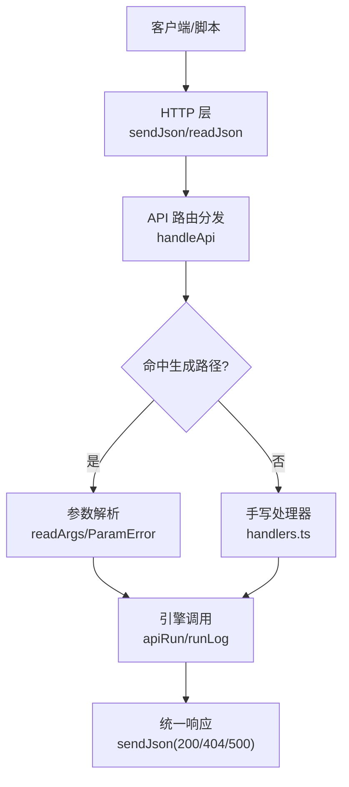
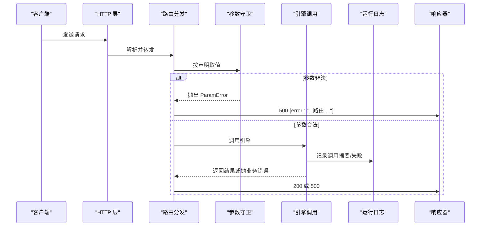
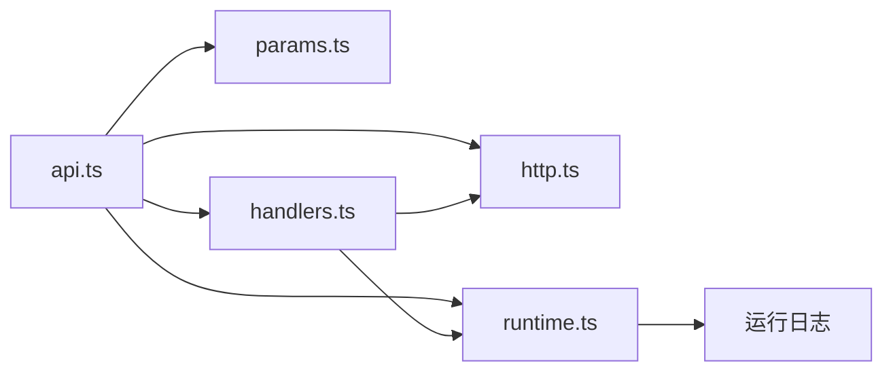

# 错误处理规范

<cite>
**本文引用的文件**
- [src/host/api.ts](file://src/host/api.ts)
- [src/host/handlers.ts](file://src/host/handlers.ts)
- [src/host/http.ts](file://src/host/http.ts)
- [src/host/params.ts](file://src/host/params.ts)
- [src/host/runtime.ts](file://src/host/runtime.ts)
- [src/engine/error-cards.ts](file://src/engine/error-cards.ts)
- [scripts/dev-server.mjs](file://scripts/dev-server.mjs)
- [tests/host-routes.test.ts](file://tests/host-routes.test.ts)
</cite>

## 目录
1. [引言](#引言)
2. [项目结构](#项目结构)
3. [核心组件](#核心组件)
4. [架构总览](#架构总览)
5. [详细组件分析](#详细组件分析)
6. [依赖关系分析](#依赖关系分析)
7. [性能考虑](#性能考虑)
8. [故障排除指南](#故障排除指南)
9. [结论](#结论)
10. [附录](#附录)

## 引言
本规范定义 LearnHub 的错误处理体系，覆盖 HTTP 状态码映射、业务错误分类、统一响应格式、全局与局部错误捕获、异常传播与边界策略、日志记录与调试信息收集、常见错误场景示例以及监控告警建议。目标是让所有调用方（面板、脚本、Agent）获得一致、可定位、可行动的错误体验。

## 项目结构
错误处理贯穿“请求进入 → 路由分发 → 参数校验 → 引擎执行 → 运行日志 → 响应序列化”的完整链路：
- 路由分发：注册表驱动 + 例外手写处理器
- 参数校验：集中式守卫，统一抛出可识别类型
- 引擎执行：业务异常原样透传
- 运行日志：失败与成功均落盘摘要
- 响应序列化：统一 JSON 输出

**图表来源**
- [src/host/api.ts:48-83](file://src/host/api.ts#L48-L83)
- [src/host/params.ts:32-229](file://src/host/params.ts#L32-L229)
- [src/host/runtime.ts:217-253](file://src/host/runtime.ts#L217-L253)
- [src/host/http.ts:26-40](file://src/host/http.ts#L26-L40)

**章节来源**
- [src/host/api.ts:1-84](file://src/host/api.ts#L1-L84)
- [src/host/handlers.ts:1-742](file://src/host/handlers.ts#L1-L742)
- [src/host/http.ts:1-55](file://src/host/http.ts#L1-L55)
- [src/host/params.ts:1-230](file://src/host/params.ts#L1-L230)
- [src/host/runtime.ts:1-255](file://src/host/runtime.ts#L1-L255)

## 核心组件
- 统一响应器 sendJson：设置 content-type 与 no-store，JSON 序列化一次输出。
- 路由分发 handleApi：先读体再查表；未命中返回 404；命中后走生成路径或手写 handler。
- 参数守卫 params：必填/可选语义收敛为 ParamError；消息中文且可定位。
- 运行日志 apiRun/runLog：成功/失败都记录摘要到运行日志文件，失败时继续抛出。
- 业务错误域 error-cards：独立数据域的错误卡 schema 校验与 Broken/Missing 纪律。

**章节来源**
- [src/host/http.ts:26-40](file://src/host/http.ts#L26-L40)
- [src/host/api.ts:48-83](file://src/host/api.ts#L48-L83)
- [src/host/params.ts:32-229](file://src/host/params.ts#L32-L229)
- [src/host/runtime.ts:217-253](file://src/host/runtime.ts#L217-L253)
- [src/engine/error-cards.ts:117-219](file://src/engine/error-cards.ts#L117-L219)

## 架构总览
错误处理采用“分层防御 + 单一出口”的策略：
- 入口层：统一读取请求体，避免未知路由误判为 404 而吞掉非法 JSON。
- 校验层：集中式参数守卫，将参数错误归一为 ParamError。
- 执行层：引擎内部业务错误原样向上抛，不污染错误形态。
- 日志层：每次调用前后记录摘要，失败也留痕。
- 响应层：仅三种状态码——200（成功）、404（未命中路由）、500（全部异常）。

**图表来源**
- [src/host/api.ts:48-83](file://src/host/api.ts#L48-L83)
- [src/host/params.ts:32-229](file://src/host/params.ts#L32-L229)
- [src/host/runtime.ts:217-253](file://src/host/runtime.ts#L217-L253)
- [src/host/http.ts:26-40](file://src/host/http.ts#L26-L40)

## 详细组件分析

### 标准错误码体系与映射
- 200：成功响应，body 由引擎返回对象经 sendJson 序列化。
- 404：路由未命中（含未知方法/路径），返回 { error: "unknown route: ..." }。
- 500：所有异常（参数错误、引擎业务错误、系统错误）统一出口，返回 { error: "..." }。

说明：
- 404 文案保留原始方法与剥前缀后的路由，便于定位。
- 500 中参数错误会附加“（路由 METHOD /route）”，业务错误原样透传。

**章节来源**
- [src/host/api.ts:58-82](file://src/host/api.ts#L58-L82)
- [src/host/static.ts:75-122](file://src/host/static.ts#L75-L122)
- [tests/host-routes.test.ts:162-178](file://tests/host-routes.test.ts#L162-L178)

### 业务错误分类
- 参数类错误：缺失必填、类型不符、范围非法等，统一通过 ParamError 表达。
- 数据域错误：如错误对比卡的 schema 校验失败，抛出带上下文的错误（Broken/Missing 纪律）。
- 外部依赖错误：如 AnkiConnect 不可达、LLM 调用失败等，保持领域语义。
- 资源类错误：静态资源未命中返回 404，包含具体原因。

**章节来源**
- [src/host/params.ts:32-229](file://src/host/params.ts#L32-L229)
- [src/engine/error-cards.ts:117-219](file://src/engine/error-cards.ts#L117-L219)
- [src/engine/anki.ts:205-209](file://src/engine/anki.ts#L205-L209)

### 错误响应格式规范
- 成功：{ 任意引擎返回对象 }，HTTP 200。
- 未命中：{ error: "unknown route: <method> <route>" }，HTTP 404。
- 异常：{ error: "<消息>" }，HTTP 500。
- 内容类型：application/json; charset=utf-8，缓存控制：no-store。

注意：
- 禁止在路由内手动 stringify 对象，避免双重编码。
- 参数错误消息会追加“（路由 METHOD /route）”。

**章节来源**
- [src/host/http.ts:26-32](file://src/host/http.ts#L26-L32)
- [src/host/api.ts:58-82](file://src/host/api.ts#L58-L82)
- [src/host/params.ts:32-229](file://src/host/params.ts#L32-L229)

### 全局错误处理器与局部捕获
- 全局：handleApi 统一 catch，区分 ParamError 与普通 Error，决定消息是否附加路由名。
- 局部：部分 handler 对非关键步骤进行 try/catch（例如实验报告获取失败回退 null），保证主流程稳定。

最佳实践：
- 仅在必要时使用局部捕获，避免吞掉重要错误。
- 局部捕获应明确降级策略（如置空、跳过、重试）。

**章节来源**
- [src/host/api.ts:77-82](file://src/host/api.ts#L77-L82)
- [src/host/handlers.ts:152-165](file://src/host/handlers.ts#L152-L165)

### 异常传播模式与错误边界
- 参数错误：在参数层抛出 ParamError，向上传播至 handleApi 统一处理。
- 引擎业务错误：原样上抛，不包装，确保诊断信息完整。
- I/O 与持久化错误：在各自模块抛出，上层不静默吞错（如错误卡加载失败抛 Broken）。
- 日志失败：runLog 捕获并忽略，不影响主流程。

**章节来源**
- [src/host/params.ts:32-229](file://src/host/params.ts#L32-L229)
- [src/engine/error-cards.ts:235-278](file://src/engine/error-cards.ts#L235-L278)
- [src/host/runtime.ts:217-231](file://src/host/runtime.ts#L217-L231)

### 错误日志记录标准与调试信息
- 运行日志：每条引擎调用记录成功摘要或失败原因，截断上限保护磁盘。
- 模型调用日志：agent 缝记录站点、耗时、字符数与 token 用量。
- 调试信息：参数错误附带路由名；404 携带方法与路由；静态资源错误提示具体原因。

建议：
- 对外暴露的错误消息不包含敏感路径片段。
- 生产环境开启结构化日志采集（时间戳、工具名、摘要）。

**章节来源**
- [src/host/runtime.ts:195-253](file://src/host/runtime.ts#L195-L253)
- [src/host/api.ts:58-82](file://src/host/api.ts#L58-L82)
- [src/host/static.ts:75-122](file://src/host/static.ts#L75-L122)

### 常见错误场景与处理示例
- 缺少必填参数：返回 500，消息形如“缺少必填参数：<key>（路由 ...）”。
- 非法可选参数：返回 500，消息形如“非法可选参数：<key>（应为...）（路由 ...）”。
- 未知路由：返回 404，消息形如“unknown route: <method> <route>”。
- 静态资源未命中：返回 404，消息包含 file not found。
- 错误卡数据损坏：加载或写入时抛 Broken，包含位置与错误行。

**章节来源**
- [src/host/params.ts:32-229](file://src/host/params.ts#L32-L229)
- [src/host/api.ts:58-82](file://src/host/api.ts#L58-L82)
- [src/host/static.ts:75-122](file://src/host/static.ts#L75-L122)
- [src/engine/error-cards.ts:117-219](file://src/engine/error-cards.ts#L117-L219)

### 错误监控与告警机制建议
- 指标采集：统计 4xx/5xx 比例、各路由错误分布、超时与重试次数。
- 告警阈值：5xx 突增、404 异常增长、特定路由持续失败触发告警。
- 日志聚合：集中收集运行日志与 agent 调用日志，支持按工具名、站点维度检索。
- 可观测性：在关键路径埋点（入队、队列恢复、任务失败），结合运行日志形成闭环。

[本节为通用建议，不直接引用具体代码]

## 依赖关系分析
错误处理的关键依赖如下：
- api.ts 依赖 http.ts（响应/请求）、params.ts（参数守卫）、runtime.ts（运行日志/引擎入口）、handlers.ts（例外处理器）。
- handlers.ts 依赖 runtime.ts（apiRun）、http.ts（sendJson）、jobs.ts（队列操作）等。
- runtime.ts 提供 runLog 与 apiRun，贯穿所有引擎调用。
- error-cards.ts 提供领域级 schema 校验与存储错误处理。

**图表来源**
- [src/host/api.ts:1-84](file://src/host/api.ts#L1-L84)
- [src/host/handlers.ts:1-742](file://src/host/handlers.ts#L1-L742)
- [src/host/runtime.ts:1-255](file://src/host/runtime.ts#L1-L255)
- [src/host/http.ts:1-55](file://src/host/http.ts#L1-L55)

**章节来源**
- [src/host/api.ts:1-84](file://src/host/api.ts#L1-L84)
- [src/host/handlers.ts:1-742](file://src/host/handlers.ts#L1-L742)
- [src/host/runtime.ts:1-255](file://src/host/runtime.ts#L1-L255)
- [src/host/http.ts:1-55](file://src/host/http.ts#L1-L55)

## 性能考虑
- 避免重复序列化：sendJson 只序列化一次，禁止在路由内再次 stringify。
- 日志截断：运行日志单条输出限制长度，防止大对象拖慢写入。
- 局部捕获最小化：减少不必要的 try/catch 开销。
- 长任务超时：脚本侧显式设置超时，避免隐式头超时导致假失败。

**章节来源**
- [src/host/http.ts:26-32](file://src/host/http.ts#L26-L32)
- [src/host/runtime.ts:195-231](file://src/host/runtime.ts#L195-L231)
- [scripts/gen-smoke.mjs:23-49](file://scripts/gen-smoke.mjs#L23-L49)
- [scripts/spike.mjs:21-44](file://scripts/spike.mjs#L21-L44)

## 故障排除指南
- 参数错误排查：检查必填字段是否存在、类型是否符合、范围是否合法；关注“（路由 ...）”后缀以定位接口。
- 路由未命中：确认请求路径与方法是否正确，是否使用了正确的前缀 /learnhub/api。
- 静态资源问题：确认扩展名在白名单、路径相对 vault 根有效。
- 错误卡数据损坏：查看 Broken 错误中的位置与错误行，修正 YAML 结构与约束。
- 运行日志定位：查阅“运行日志.md”，根据工具名与时间戳快速定位失败上下文。

**章节来源**
- [src/host/params.ts:32-229](file://src/host/params.ts#L32-L229)
- [src/host/api.ts:58-82](file://src/host/api.ts#L58-L82)
- [src/host/static.ts:75-122](file://src/host/static.ts#L75-L122)
- [src/engine/error-cards.ts:117-219](file://src/engine/error-cards.ts#L117-L219)
- [src/host/runtime.ts:217-231](file://src/host/runtime.ts#L217-L231)

## 结论
LearnHub 的错误处理以“统一出口、集中校验、完整日志、领域隔离”为核心原则。通过 ParamError、统一 500 出口、404 精确文案与运行日志，实现错误可发现、可定位、可行动。建议在后续演进中补充结构化指标与告警，进一步提升可观测性与稳定性。

## 附录
- 开发服务器错误处理参考：dev-server 对未知路由返回 404，异常返回 500，便于本地调试。
- 测试快照：host-routes 探针保障 200/404/500 数量与文案不变，确保向后兼容。

**章节来源**
- [scripts/dev-server.mjs:167-197](file://scripts/dev-server.mjs#L167-L197)
- [tests/host-routes.test.ts:162-178](file://tests/host-routes.test.ts#L162-L178)