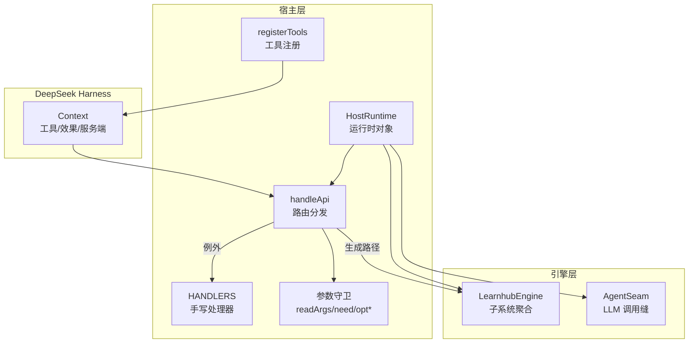
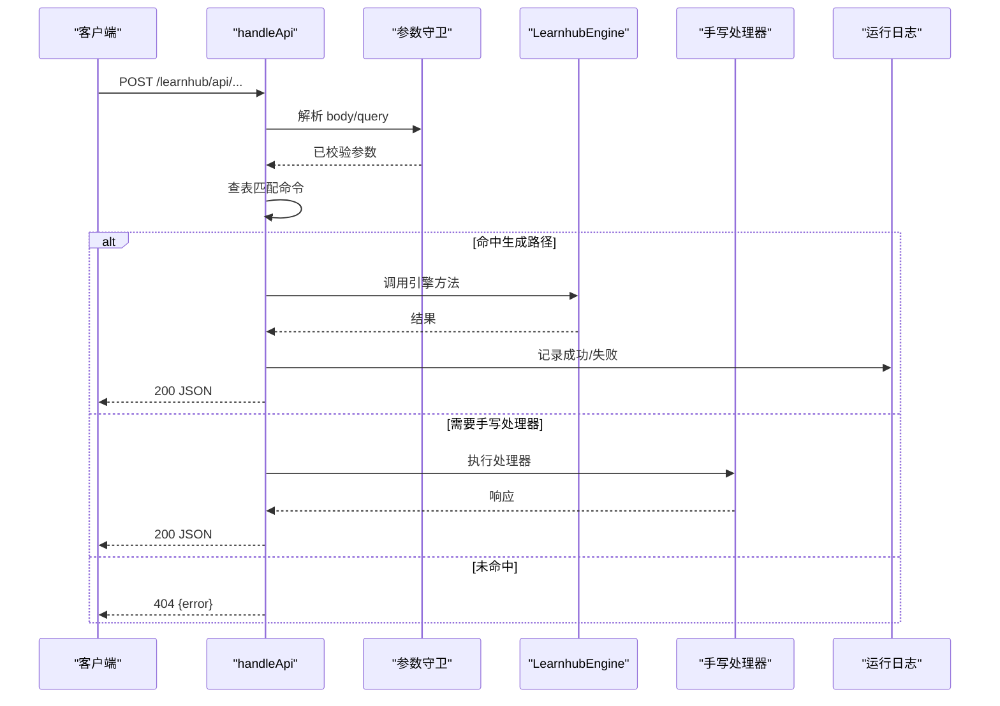
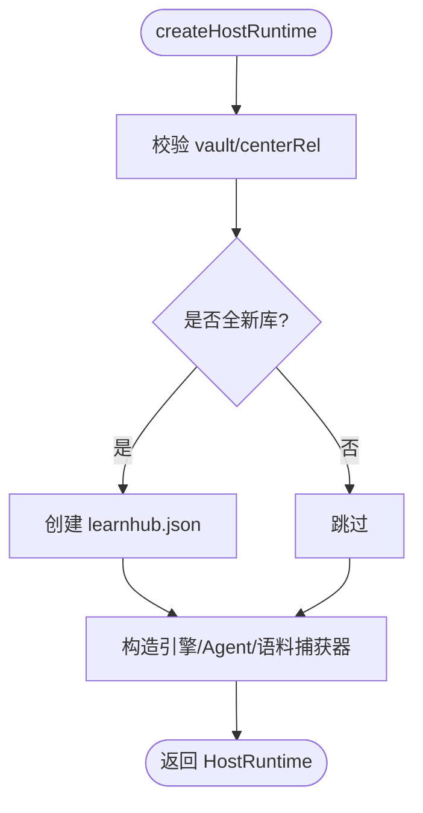
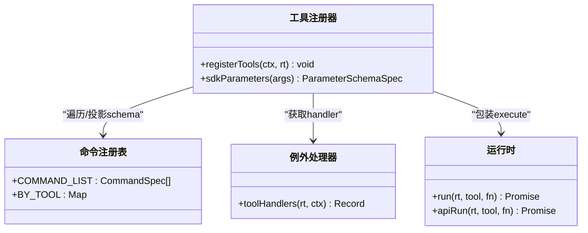
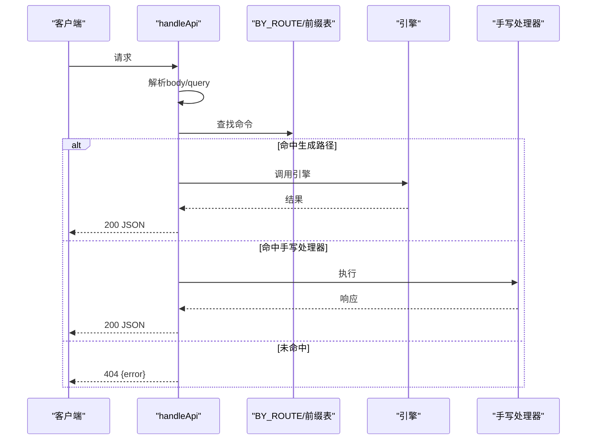
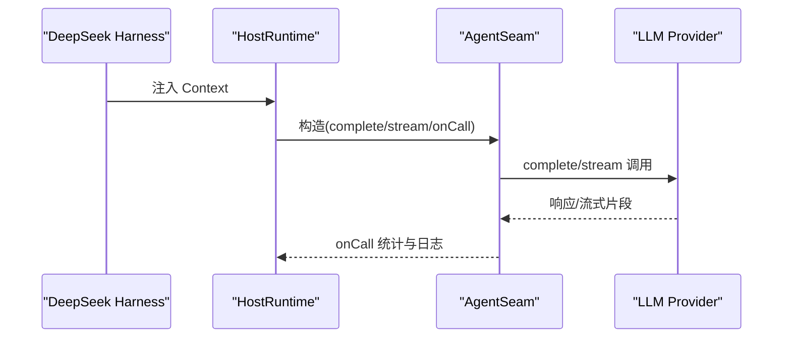
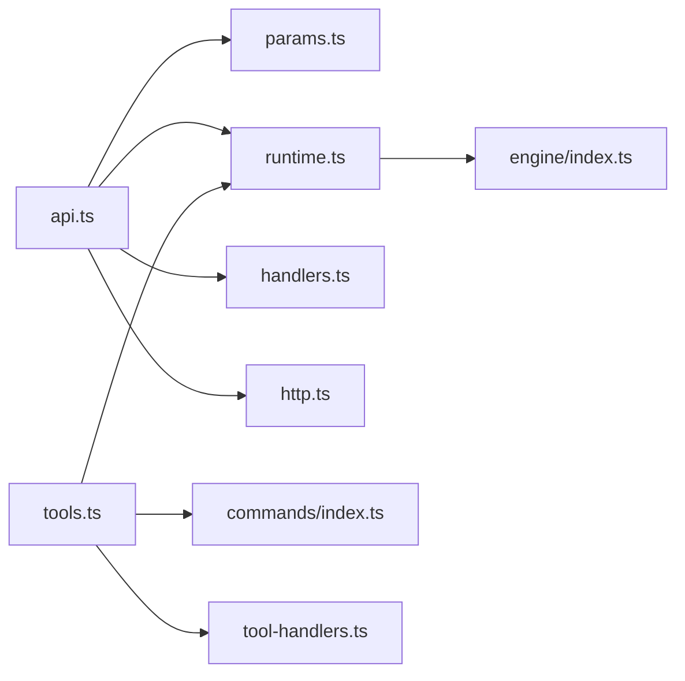

# 宿主集成

<cite>
**本文引用的文件**
- [runtime.ts](file://src/host/runtime.ts)
- [tools.ts](file://src/host/tools.ts)
- [tool-handlers.ts](file://src/host/tool-handlers.ts)
- [http.ts](file://src/host/http.ts)
- [route-table.ts](file://src/host/route-table.ts)
- [handlers.ts](file://src/host/handlers.ts)
- [api.ts](file://src/host/api.ts)
- [params.ts](file://src/host/params.ts)
- [index.ts（命令注册表）](file://src/commands/index.ts)
- [index.ts（引擎门面）](file://src/engine/index.ts)
</cite>

## 目录
1. [简介](#简介)
2. [项目结构](#项目结构)
3. [核心组件](#核心组件)
4. [架构总览](#架构总览)
5. [详细组件分析](#详细组件分析)
6. [依赖关系分析](#依赖关系分析)
7. [性能考量](#性能考量)
8. [故障排查指南](#故障排查指南)
9. [结论](#结论)
10. [附录：集成与扩展指南](#附录：集成与扩展指南)

## 简介
本文件面向 LearnHub 宿主集成层，系统性阐述 HostRuntime 宿主运行时管理机制、Agent 工具注册系统、HTTP API 路由系统、与 DeepSeek Harness 框架的集成方式、安全机制与权限控制，并提供可操作的集成示例与扩展开发指南。文档以代码事实为依据，通过图示与分节说明帮助读者快速理解并安全扩展该层。

## 项目结构
LearnHub 宿主集成层位于 src/host，围绕“显式运行时 + 数据化路由 + 统一工具面”的组织原则构建：
- 运行时与装配：HostRuntime 集中承载引擎实例、Agent 缝、任务表、标志位与配置；提供 run/apiRun 等统一调用封装。
- 工具面：基于命令注册表自动注册 Agent 工具，111 个工具函数通过声明驱动暴露，少数复杂逻辑走例外 handler。
- HTTP 路由：面板 API 采用“注册表驱动分发 + 手写例外 handler”的双通道模式，统一参数校验与错误出口。
- 与 DeepSeek Harness：通过 Context 注入工具与效果回调，AgentSeam 作为统一 LLM 调用缝，支持 complete/stream 双端口。

图表来源
- [api.ts:48-83](file://src/host/api.ts#L48-L83)
- [runtime.ts:118-193](file://src/host/runtime.ts#L118-L193)
- [tools.ts:101-125](file://src/host/tools.ts#L101-L125)
- [handlers.ts:101-741](file://src/host/handlers.ts#L101-L741)
- [index.ts（命令注册表）:25-71](file://src/commands/index.ts#L25-L71)

章节来源
- [runtime.ts:118-193](file://src/host/runtime.ts#L118-L193)
- [api.ts:48-83](file://src/host/api.ts#L48-L83)
- [tools.ts:101-125](file://src/host/tools.ts#L101-L125)
- [handlers.ts:101-741](file://src/host/handlers.ts#L101-L741)
- [index.ts（命令注册表）:25-71](file://src/commands/index.ts#L25-L71)

## 核心组件
- HostRuntime：显式运行时对象，包含引擎、Agent 缝、语料捕获器、Vault/CenterRel、任务表、标志位与出题审计率。构造时完成部署路径校验、新鲜库初始化、引擎与 Agent 缝装配、日志与运行指标落盘准备。
- Agent 工具注册：遍历命令注册表的 agent 通道，按 schema 生成 defineTool，execute 走 run(rt, tool, fn) 包装，统一记录运行日志与输出摘要。
- HTTP 路由：handleApi 先解析请求体，再查表匹配命令；命中则按声明取值直调引擎（生成路径），否则回落到 handlers.ts 的手写处理器；未命中返回 404。
- 参数守卫：单一参数校验入口，必填/可选语义明确，非法即 fail loud，错误统一为 ParamError，由分发层追加路由信息。
- 与 DeepSeek Harness：Context 在 apply 阶段注入，host 仅持有闭包化的 LLM 端口与工具注册能力；AgentSeam 屏蔽 provider 差异，统一 onCall 观测与语料捕获。

章节来源
- [runtime.ts:135-193](file://src/host/runtime.ts#L135-L193)
- [tools.ts:101-125](file://src/host/tools.ts#L101-L125)
- [api.ts:48-83](file://src/host/api.ts#L48-L83)
- [params.ts:3-27](file://src/host/params.ts#L3-L27)
- [index.ts（引擎门面）:149-196](file://src/engine/index.ts#L149-L196)

## 架构总览
下图展示从请求到执行的完整链路：客户端请求进入 /learnhub/api，分发层解析并查表；若命中生成路径，则按命令声明读取参数并调用引擎对应方法；若未命中或需特殊处理，交由手写处理器；所有引擎调用经 apiRun/run 包装，统一记录运行日志与异常。

图表来源
- [api.ts:48-83](file://src/host/api.ts#L48-L83)
- [runtime.ts:217-253](file://src/host/runtime.ts#L217-L253)
- [handlers.ts:101-741](file://src/host/handlers.ts#L101-L741)

## 详细组件分析

### HostRuntime 宿主运行时管理
- 职责边界：集中承载所有可变态（engine、agent、vault/centerRel、jobs、flags、quizAuditRate），避免模块级隐式状态，便于测试替换。
- 生命周期：
  - 启动：校验 vault 与 centerRel 存在性；创建 fresh 配置；构造引擎、Agent 缝、语料捕获器；初始化任务表与标志位。
  - 运行：run/apiRun 包装引擎调用，统一记录运行日志；onCall 钩子记录 LLM 调用统计与耗时。
  - 清理：无全局副作用；任务表与标志位在内存中维护，持久化由 jobs 模块负责。
- 关键设计：
  - resolveEngineEntry：按“子系统.方法”或“门面方法”字符串解析并绑定 this，确保引擎方法正确调用。
  - runLog：将每次引擎调用输出截断写入运行日志文件，失败不影响主流程。
  - apiRun：对引擎调用进行 try/catch 包裹，失败也记录日志后抛出，保证错误可追踪。

图表来源
- [runtime.ts:135-193](file://src/host/runtime.ts#L135-L193)
- [runtime.ts:204-253](file://src/host/runtime.ts#L204-L253)

章节来源
- [runtime.ts:118-193](file://src/host/runtime.ts#L118-L193)
- [runtime.ts:204-253](file://src/host/runtime.ts#L204-L253)

### Agent 工具注册系统（111 个工具）
- 注册机制：遍历 COMMAND_LIST，筛选 channel === 'agent' 的命令；使用 sdkParameters 将 CommandSpec.args 投影为 SDK 的 parameters；execute 走 run(rt, tool, async () => JSON.stringify(await engine(...))) 或例外 handler。
- 工具面契约：名称、描述、schema 与重构前逐字一致，保障向后兼容；execute 返回值统一为文本，由 output 渲染为 text。
- 例外处理器：toolHandlers 工厂函数返回工具名到处理器的映射，覆盖形状加工、实参换算、队列受理等无法走生成路径的工具。
- 工具指南：AGENT_GUIDE 提供 agent 独有工具的页面锚点与提示词模板，便于面板引导。

图表来源
- [tools.ts:25-125](file://src/host/tools.ts#L25-L125)
- [tool-handlers.ts:23-287](file://src/host/tool-handlers.ts#L23-L287)
- [runtime.ts:217-253](file://src/host/runtime.ts#L217-L253)
- [index.ts（命令注册表）:25-71](file://src/commands/index.ts#L25-L71)

章节来源
- [tools.ts:25-125](file://src/host/tools.ts#L25-L125)
- [tool-handlers.ts:23-287](file://src/host/tool-handlers.ts#L23-L287)
- [index.ts（命令注册表）:25-71](file://src/commands/index.ts#L25-L71)

### HTTP API 路由系统
- 端点定义：命令注册表中的 panel 通道声明 method/path/bind/log 等字段；精确匹配优先，其次前缀匹配（如 /vendor/）。
- 请求处理流程：
  - 解析请求体（POST/PUT）与查询串；
  - 查表匹配命令；
  - 若命中生成路径：按声明读取参数，调用引擎方法，记录日志，返回 200；
  - 若需手写处理器：调用 handlers.ts 中对应处理器；
  - 未命中：返回 404。
- 响应格式规范：统一 sendJson 序列化；错误统一为 { error: string } + 500；ParamError 附加路由信息以便定位。

图表来源
- [api.ts:48-83](file://src/host/api.ts#L48-L83)
- [route-table.ts:16-75](file://src/host/route-table.ts#L16-L75)
- [handlers.ts:101-741](file://src/host/handlers.ts#L101-L741)

章节来源
- [api.ts:48-83](file://src/host/api.ts#L48-L83)
- [route-table.ts:16-75](file://src/host/route-table.ts#L16-L75)
- [handlers.ts:101-741](file://src/host/handlers.ts#L101-L741)

### 与 DeepSeek Harness 框架集成
- Context 注入：apply 阶段注入 Context，host 仅持有闭包化的 LLM 端口与工具注册能力，不直接耦合 ctx 细节。
- AgentSeam：统一 LLM 调用缝，支持 complete/stream 双端口；onCall 钩子记录调用统计与耗时，并写入运行日志。
- 事件与消息：通过 AgentSeam 的 onCall 与 corpus.record 实现全量语料捕获与观测；LLM 调用链透明，provider/model 可配置。
- 状态同步：任务注册表与标志位反映队列状态；面板通过 /generate/status 等接口轮询进度。

图表来源
- [runtime.ts:163-193](file://src/host/runtime.ts#L163-L193)
- [index.ts（引擎门面）:149-196](file://src/engine/index.ts#L149-L196)

章节来源
- [runtime.ts:163-193](file://src/host/runtime.ts#L163-L193)
- [index.ts（引擎门面）:149-196](file://src/engine/index.ts#L149-L196)

### 安全机制与权限控制
- 参数守卫：统一参数校验入口，非法类型立即拒绝（fail loud），错误类型为 ParamError，附带路由信息，防止静默吞错。
- 输入白名单：静态资源伺服限制扩展名与路径（FILE_MIME/ASSET_MIME），交互件限课程根内 .html，CSP 禁外联。
- 错误出口：统一 500 出口，错误体为 { error: string }，避免泄露内部堆栈。
- 权限模型：当前实现以“宿主内网服务”为前提，未实现外部鉴权；如需外部访问，应在网关层增加认证与授权。

章节来源
- [params.ts:3-27](file://src/host/params.ts#L3-L27)
- [http.ts:12-32](file://src/host/http.ts#L12-L32)
- [api.ts:77-83](file://src/host/api.ts#L77-L83)

## 依赖关系分析
- 宿主层内部依赖：
  - api.ts 依赖 params.ts、runtime.ts、handlers.ts、http.ts；
  - tools.ts 依赖 commands/index.ts、runtime.ts、tool-handlers.ts；
  - runtime.ts 依赖 engine/index.ts、host/clock.ts、host/vault-fs.ts、host/corpus.ts。
- 与引擎层依赖：
  - 宿主通过 LearnhubEngine 门面访问各子系统，避免深耦合；
  - AgentSeam 作为 LLM 调用缝，屏蔽 provider 差异。
- 潜在循环风险：
  - host 不直接 import 引擎子模块，仅通过门面；
  - 命令注册表集中装配，避免分散导入造成环。

图表来源
- [api.ts:48-83](file://src/host/api.ts#L48-L83)
- [tools.ts:101-125](file://src/host/tools.ts#L101-L125)
- [runtime.ts:135-193](file://src/host/runtime.ts#L135-L193)

章节来源
- [api.ts:48-83](file://src/host/api.ts#L48-L83)
- [tools.ts:101-125](file://src/host/tools.ts#L101-L125)
- [runtime.ts:135-193](file://src/host/runtime.ts#L135-L193)

## 性能考量
- 任务串行队列：生成任务（大纲→正文→出题）串行执行，避免并发冲突；面板通过 /generate/status 轮询。
- 日志截断：运行日志输出截断上限，避免大输出阻塞 I/O。
- 参数校验集中：减少重复守卫代码，提升可维护性与一致性。
- 静态资源缓存：资产 MIME 表与 vendor 目录复用，减少重复加载。

## 故障排查指南
- 常见错误：
  - 404：路由未命中，检查命令注册表是否正确声明 panel 通道。
  - 500：参数守卫错误或引擎业务错误，查看 ParamError 消息与路由信息。
  - 生成任务失败：查看运行日志与任务注册表，确认 phase/status/message。
- 调试建议：
  - 启用语料捕获：通过 corpusDir 配置观察 LLM 调用详情。
  - 检查 vault/centerRel：确保路径存在且可写。
  - 使用冒烟/质量评审接口验证管线。

章节来源
- [api.ts:77-83](file://src/host/api.ts#L77-L83)
- [runtime.ts:217-253](file://src/host/runtime.ts#L217-L253)
- [handlers.ts:181-249](file://src/host/handlers.ts#L181-L249)

## 结论
LearnHub 宿主集成层通过显式运行时、数据化路由与统一工具面，实现了高内聚、低耦合的宿主适配能力。HostRuntime 集中管理生命周期与状态，Agent 工具注册系统以声明驱动暴露 111 个工具，HTTP 路由系统提供稳定可扩展的 API 表面，并与 DeepSeek Harness 无缝集成。安全机制以参数守卫与输入白名单为主，适合内网服务场景。扩展时应遵循注册表驱动与门面约束，保持向后兼容。

## 附录：集成与扩展指南
- 新增工具：
  - 在命令注册表中添加命令，声明 agent 通道与 args/schema；
  - 若需复杂逻辑，添加到 tool-handlers.ts 的例外处理器；
  - 确保 execute 走 run(rt, tool, fn) 包装。
- 新增路由：
  - 在命令注册表中声明 panel 通道与 route；
  - 若需特殊处理，添加到 handlers.ts 的手写处理器；
  - 使用 params.ts 的守卫函数校验参数。
- 与 DeepSeek Harness 集成：
  - 在 apply 阶段注入 Context；
  - 使用 AgentSeam 进行 LLM 调用，配置 onCall 观测；
  - 通过 corpus.record 捕获语料。
- 安全与权限：
  - 在网关层增加认证与授权；
  - 严格限制静态资源访问路径与扩展名；
  - 统一错误出口，避免泄露敏感信息。

章节来源
- [tools.ts:101-125](file://src/host/tools.ts#L101-L125)
- [tool-handlers.ts:23-287](file://src/host/tool-handlers.ts#L23-L287)
- [api.ts:48-83](file://src/host/api.ts#L48-L83)
- [params.ts:3-27](file://src/host/params.ts#L3-L27)
- [runtime.ts:163-193](file://src/host/runtime.ts#L163-L193)