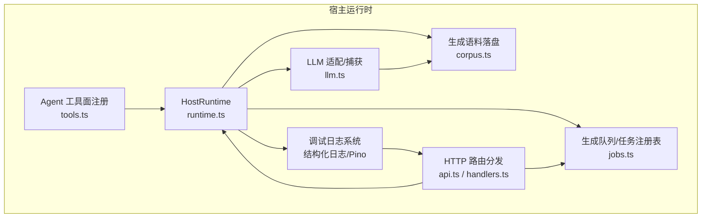
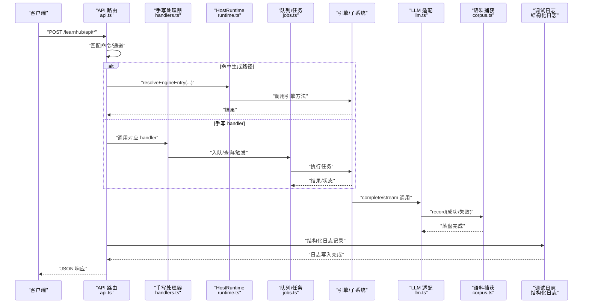
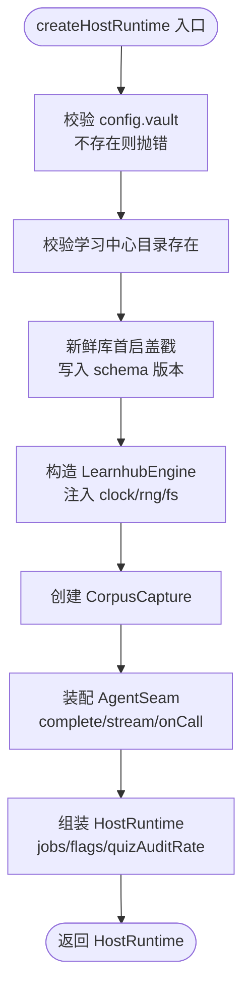
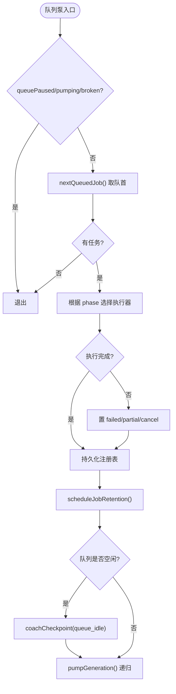
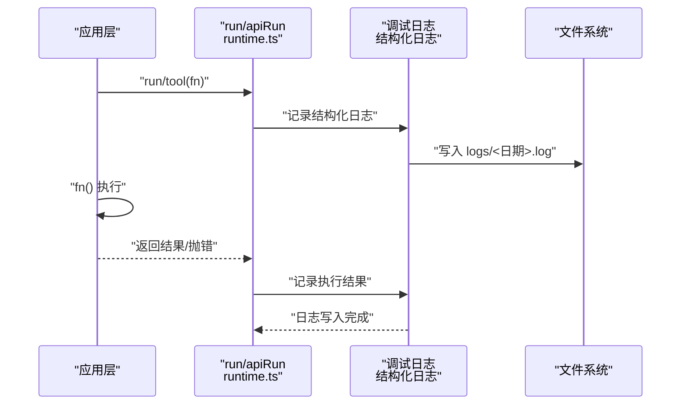
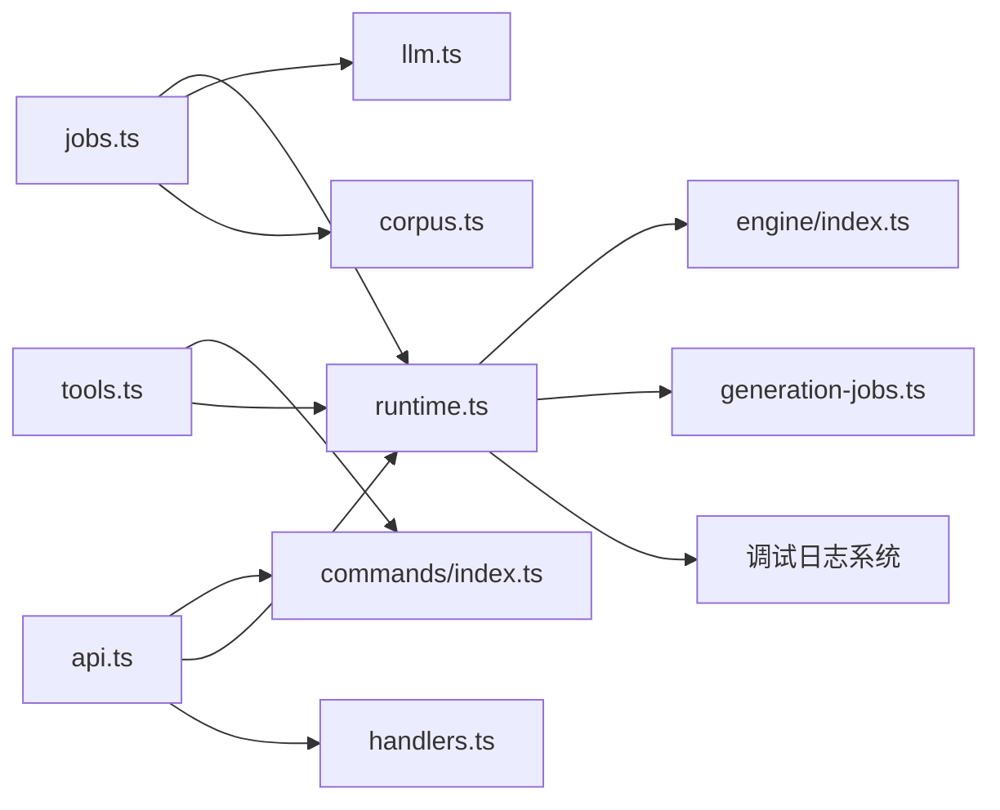

# 运行时管理

<cite>
**本文引用的文件**
- [runtime.ts](file://src/host/runtime.ts)
- [api.ts](file://src/host/api.ts)
- [handlers.ts](file://src/host/handlers.ts)
- [jobs.ts](file://src/host/jobs.ts)
- [tools.ts](file://src/host/tools.ts)
- [corpus.ts](file://src/host/corpus.ts)
- [llm.ts](file://src/host/llm.ts)
- [CONTEXT.md](file://CONTEXT.md)
</cite>

## 更新摘要
**变更内容**
- 将原有的"运行日志"系统替换为全新的"调试日志"系统
- 新增结构化日志接口，支持按天轮转和保留策略
- 集成 Pino 日志框架，提供事件驱动的日志记录
- 更新日志记录系统的架构设计和实现机制
- 调整故障排查指南以反映新的日志系统

## 目录
1. [简介](#简介)
2. [项目结构](#项目结构)
3. [核心组件](#核心组件)
4. [架构总览](#架构总览)
5. [详细组件分析](#详细组件分析)
6. [依赖关系分析](#依赖关系分析)
7. [性能考量](#性能考量)
8. [故障排查指南](#故障排查指南)
9. [结论](#结论)
10. [附录：配置与扩展](#附录：配置与扩展)

## 简介
本技术文档聚焦 LearnHub 运行时管理系统，围绕 HostRuntime 接口的设计理念与实现机制展开，系统阐述引擎实例化、Agent 缝装配、任务注册表管理与运行标志控制；详解 createHostRuntime 初始化流程（配置校验、目录检查、依赖注入）；说明运行时状态管理（生成任务跟踪、队列控制、会话状态）；解释全新调试日志记录系统（结构化日志、按天轮转、Pino 集成、事件驱动）；并提供配置示例与扩展开发指南，帮助自定义运行时行为与集成第三方服务。

## 项目结构
LearnHub 的运行时管理位于宿主层（host），以 runtime.ts 为入口，结合 jobs.ts（队列与任务）、llm.ts（LLM 适配与捕获）、corpus.ts（语料落盘）、api.ts/handlers.ts（HTTP 路由分发）、tools.ts（Agent 工具面）共同构成完整的运行时体系。新引入的调试日志系统提供了结构化的观测能力。

**图表来源**
- [runtime.ts:118-193](file://src/host/runtime.ts#L118-L193)
- [jobs.ts:696-740](file://src/host/jobs.ts#L696-L740)
- [llm.ts:173-222](file://src/host/llm.ts#L173-L222)
- [corpus.ts:186-340](file://src/host/corpus.ts#L186-L340)
- [api.ts:48-83](file://src/host/api.ts#L48-L83)
- [handlers.ts:101-741](file://src/host/handlers.ts#L101-L741)
- [tools.ts:102-125](file://src/host/tools.ts#L102-L125)

**章节来源**
- [runtime.ts:118-193](file://src/host/runtime.ts#L118-L193)
- [api.ts:48-83](file://src/host/api.ts#L48-L83)
- [handlers.ts:101-741](file://src/host/handlers.ts#L101-L741)
- [jobs.ts:696-740](file://src/host/jobs.ts#L696-L740)
- [llm.ts:173-222](file://src/host/llm.ts#L173-L222)
- [corpus.ts:186-340](file://src/host/corpus.ts#L186-L340)
- [tools.ts:102-125](file://src/host/tools.ts#L102-L125)

## 核心组件
- HostRuntime：显式承载所有可变态（engine、agent、corpus、vault/centerRel、jobs、flags、quizAuditRate），函数一律接收 rt 参数，便于测试替换。
- 生成队列与任务注册表：FIFO 全局单并发执行泵，支持内容管线、纯出题、生长批、图域任务；具备保留期清扫与恢复语义。
- LLM 适配层：统一 complete/stream 端口，负责 effort 翻译、空闲超时、截断重试、档位降级，并在缝出口全量落盘生成语料。
- 生成语料捕获器：按站分桶环形存储，支持 outcome 补标与失败码标注，提供 lastRef 引用用于失败详情。
- HTTP 路由分发：声明式命令注册表驱动 + 手写 handler 例外；统一错误出口与日志口径。
- Agent 工具面：基于命令注册表自动注册工具，schema 与 execute 由注册表决定，保持向后兼容。
- **调试日志系统**：结构化日志接口，按天轮转，支持 debug/info/warn/error 级别，保留 30 天，Pino 集成。

**章节来源**
- [runtime.ts:23-133](file://src/host/runtime.ts#L23-L133)
- [jobs.ts:269-740](file://src/host/jobs.ts#L269-L740)
- [llm.ts:34-55,75-104,173-222:34-55](file://src/host/llm.ts#L34-L55)
- [corpus.ts:27-72,186-340:27-72](file://src/host/corpus.ts#L27-L72)
- [api.ts:1-83](file://src/host/api.ts#L1-L83)
- [tools.ts:1-125](file://src/host/tools.ts#L1-L125)

## 架构总览
下图展示从 HTTP 请求到引擎调用、队列执行、LLM 调用与调试日志记录的完整链路。

**图表来源**
- [api.ts:48-83](file://src/host/api.ts#L48-L83)
- [handlers.ts:101-741](file://src/host/handlers.ts#L101-L741)
- [runtime.ts:204-253](file://src/host/runtime.ts#L204-L253)
- [jobs.ts:696-740](file://src/host/jobs.ts#L696-L740)
- [llm.ts:75-104,173-222:75-104](file://src/host/llm.ts#L75-L104)
- [corpus.ts:186-340](file://src/host/corpus.ts#L186-L340)

## 详细组件分析

### HostRuntime 接口与 createHostRuntime 初始化
- 设计理念：显式对象承载全部可变态，避免模块级可变状态；所有技术层函数通过 rt 参数注入，保证"宿主第一次可测"。
- 初始化流程：
  - 配置验证：校验 vault 存在且为绝对路径；学习中心目录必须存在；quizAuditRate 必须在 0–1。
  - 目录结构检查：若为新库（无 learnhub.json 且无课程注册表），创建 state/learnhub.json 并写入当前 schema 版本。
  - 依赖注入：构造 LearnhubEngine（注入 clock/rng/fs）、创建 CorpusCapture、装配 AgentSeam（complete/stream/onCall），将 corpus.record 接入 llm 适配器，onCall 输出调试日志。
  - 初始状态：jobs.genJobs/quizJobResults 为空 Map；flags 默认 queuePaused=false、pumping=false、lastSessionStartAt=0、genQueueBroken=null。

**图表来源**
- [runtime.ts:138-193](file://src/host/runtime.ts#L138-L193)

**章节来源**
- [runtime.ts:23-133](file://src/host/runtime.ts#L23-L133)
- [runtime.ts:138-193](file://src/host/runtime.ts#L138-L193)

### 任务注册表与队列控制
- 任务类型：
  - 节点内容管线：outline → sections → quiz（phase 可为 undefined 表示内容管线）。
  - 纯出题：phase=quiz，复用全局队列，与节点管线互斥。
  - 生长批：phase=growth，教练回合裁决，支持 inject/force 豁免停摆与阻尼。
  - 图域任务：seed/compass/decompile/plan/milestone，面板下发或 agent 触发。
- FIFO 执行泵：
  - pumpGeneration 在 queuePaused/pumping/genQueueBroken 任一为真时不启动；取 nextQueuedJob 执行；完成后继续泵下一个。
  - 队列空闲触发 coachCheckpoint(queue_idle)，随后结算复诊到期边，必要时清扫悬空任务。
- 保留期与清扫：
  - 终态记录按 status 保留不同时长（成功短留，失败/部分长留）；sweepGenJobs 清理课程删除或节点缺失导致的悬空任务。
- 写回闸与 Broken 态：
  - genQueueBroken 期间拒绝一切会全量落盘注册表的交互路径（入队/重置/恢复队列），防止覆盖坏档。

**图表来源**
- [jobs.ts:696-740](file://src/host/jobs.ts#L696-L740)
- [generation-jobs.ts:31-55](file://src/generation-jobs.ts#L31-L55)
- [jobs.ts:381-437](file://src/host/jobs.ts#L381-L437)

**章节来源**
- [jobs.ts:269-740](file://src/host/jobs.ts#L269-L740)
- [generation-jobs.ts:31-55](file://src/generation-jobs.ts#L31-L55)
- [generation-jobs.ts:94-121](file://src/generation-jobs.ts#L94-L121)

### 运行时状态管理
- 生成任务跟踪：
  - GenJob 字段包含 course/node、startedAt/finishedAt、status、phase、progress、message、failures、style/tier、count/quizCount、section/instruction、model、growthOutcome/growthInject/growthForce、payload 等。
  - 任务键 = course/node（内容管线）或 course/标签（图域任务）。
- 队列控制：
  - 重复入队幂等（queued 直接返回排队信息）；running/cancelling 拒绝新入队。
  - 取消旗标贯穿执行（isCancelled 回调在各阶段检查）。
- 会话状态管理：
  - sessionStartCheckpoint 节流 30 分钟，fire-and-forget 触发 coachCheckpoint(session_start)。
  - flags.lastSessionStartAt 记录最近一次会话开始时间。

**章节来源**
- [runtime.ts:46-113](file://src/host/runtime.ts#L46-L113)
- [jobs.ts:292-350](file://src/host/jobs.ts#L292-L350)
- [jobs.ts:505-544](file://src/host/jobs.ts#L505-L544)

### 调试日志系统
**更新** 全新的调试日志系统替代了原有的运行日志系统，提供更强大的结构化日志能力。

- 调试日志特性：
  - 位置：`学习中心/state/logs/<日历日>.log`，按天一个文件
  - 格式：`[HH:MM:SS.mmm] [LEVEL] <事件名> k=v`，纯文本行
  - 级别：debug/info/warn/error，默认 INFO
  - 保留：30 天自动清理
  - 容错：写盘失败不影响主流程
- 覆盖范围：
  - 引擎关键决策点（门过/拒、修复轮是否触发、两轮死因）
  - 宿主调用面（API 请求、工具调用、队列操作）
  - Agent 调用（LLM 请求、token 用量、耗时统计）
- 与原有系统的区别：
  - 不再使用 `运行日志.md` 文件
  - 结构化键值对格式，便于机器解析
  - 按天轮转，避免单文件过大
  - 支持多级日志级别过滤

**图表来源**
- [runtime.ts:217-253](file://src/host/runtime.ts#L217-L253)
- [CONTEXT.md:191-193](file://CONTEXT.md#L191-L193)

**章节来源**
- [runtime.ts:217-253](file://src/host/runtime.ts#L217-L253)
- [CONTEXT.md:191-193](file://CONTEXT.md#L191-L193)

### HTTP 路由与工具面
- 路由分发：
  - 精确命中优先，其次前缀匹配；未命中返回 404 并携带原始方法与路由。
  - 生成路径：按 command.engine + channel.bind 直调引擎；非生成路径走手写 handlers。
  - 错误出口唯一：{ error: string } + 500，sendJson 单次序列化。
- 工具面注册：
  - 遍历 COMMAND_LIST，按 agent 通道注册 defineTool；execute 取生成路径或 tool-handlers 例外。
  - sdkParameters 剥离投递层扩展键，保持 schema 向后兼容。

**章节来源**
- [api.ts:1-83](file://src/host/api.ts#L1-L83)
- [handlers.ts:101-741](file://src/host/handlers.ts#L101-L741)
- [tools.ts:72-125](file://src/host/tools.ts#L72-L125)

## 依赖关系分析
- 松耦合设计：
  - HostRuntime 作为依赖注入容器，避免模块级状态；各技术层函数通过 rt 参数获取能力。
  - LLM 适配层隔离 dsh-llm 与 cordis Context，仅暴露 LlmComplete/LlmStream 端口。
- 关键依赖链：
  - runtime.ts → engine/index.ts（LearnhubEngine/AgentSeam）、generation-jobs.ts（任务状态契约）。
  - jobs.ts → runtime.ts（调试日志）、llm.ts（contentEffort/llmSeam）、corpus.ts（STATIONS）。
  - api.ts → commands/index.ts（BY_ROUTE/COMMAND_LIST）、runtime.ts（resolveEngineEntry/apiRun）、handlers.ts（HANDLERS）。
  - tools.ts → commands/index.ts、runtime.ts（resolveEngineEntry/run）。

**图表来源**
- [runtime.ts:11-21](file://src/host/runtime.ts#L11-L21)
- [jobs.ts:7-32](file://src/host/jobs.ts#L7-L32)
- [api.ts:13-23](file://src/host/api.ts#L13-L23)
- [tools.ts:15-23](file://src/host/tools.ts#L15-L23)

**章节来源**
- [runtime.ts:11-21](file://src/host/runtime.ts#L11-L21)
- [jobs.ts:7-32](file://src/host/jobs.ts#L7-L32)
- [api.ts:13-23](file://src/host/api.ts#L13-L23)
- [tools.ts:15-23](file://src/host/tools.ts#L15-L23)

## 性能考量
- 队列单并发：全局泵确保同一时刻只执行一个任务，避免资源竞争与数据不一致。
- 异步日志与语料：调试日志与 corpus.record 均为 fire-and-forget，失败静默，不阻塞主流程。
- 环形存储：语料按站限制最大数量，避免磁盘无限增长。
- 日志轮转：按天轮转的调试日志，避免单文件过大，支持 30 天保留策略。
- 节流与会话：sessionStartCheckpoint 30 分钟节流，减少频繁 coachCheckpoint 开销。
- 档位策略：contentEffort 根据节点复杂度选择 fast/deep，平衡成本与质量。

## 故障排查指南
**更新** 故障排查指南已调整为针对新的调试日志系统。

- 配置错误：
  - config.vault 缺失或目录不存在：createHostRuntime 立即抛错，检查 profile patch 配置。
  - quizAuditRate 不在 0–1：装配时 fail loud，修正后重启。
- 队列 Broken 态：
  - genQueueBroken 非空时拒绝入队/重置/恢复队列；需修复任务档后重启。
- 任务丢失/悬空：
  - sweepGenJobs 清理课程删除或节点缺失的任务；检查课程注册表与图节点是否存在。
- LLM 调用失败：
  - 空闲超时/截断重试/档位降级；查看调试日志中的相关事件记录。
- 调试日志问题：
  - 检查 `学习中心/state/logs/` 目录是否存在及权限设置。
  - 确认日志轮转策略是否正确配置。
  - 查看日志级别过滤设置是否符合预期。
- 性能问题：
  - 通过调试日志分析关键决策点的耗时。
  - 监控日志文件大小和轮转频率。

**章节来源**
- [runtime.ts:138-154](file://src/host/runtime.ts#L138-L154)
- [jobs.ts:271-286](file://src/host/jobs.ts#L271-L286)
- [jobs.ts:394-437](file://src/host/jobs.ts#L394-L437)
- [llm.ts:277-298](file://src/host/llm.ts#L277-L298)
- [CONTEXT.md:191-193](file://CONTEXT.md#L191-L193)

## 结论
LearnHub 运行时管理系统通过显式 HostRuntime 实现依赖注入与可测试性，结合 FIFO 队列、LLM 适配与语料捕获，构建了高内聚、低耦合的运行时核心。全新引入的调试日志系统提供了结构化的观测能力，支持按天轮转、多级日志级别和事件驱动的记录方式。其设计强调故障可见性（调试日志、语料落盘、失败码标注）与可恢复性（保留期、清扫、恢复补挂），并通过声明式路由与工具面注册保持向后兼容。扩展时可基于现有接口注入自定义行为，如替换 LLM provider、扩展任务 phase、定制语料格式等。

## 附录：配置与扩展

### 配置示例
- 基础配置（profile patch）：
  - vault: 绝对路径（必填）
  - centerRel: 学习中心相对路径（缺省"学习中心"）
  - provider/model: AI 生成/判卷 provider 与模型
  - fastEffort/deepEffort: 思考档（off/low）
  - quizAuditRate: 第二意见门抽样率（0–1，0 关闭）
  - corpusDir: 生成语料落盘目录（缺省使用引擎 paths.corpusDir）
- **调试日志配置**：
  - 日志目录：`学习中心/state/logs/`
  - 轮转策略：按天轮转
  - 保留期限：30 天
  - 默认级别：INFO
  - 格式：`[HH:MM:SS.mmm] [LEVEL] <事件名> k=v`

**章节来源**
- [runtime.ts:23-44](file://src/host/runtime.ts#L23-L44)
- [CONTEXT.md:191-193](file://CONTEXT.md#L191-L193)

### 扩展开发指南
- 自定义 LLM Provider：
  - 修改 llmCfg.provider/model，或通过 ctx.llm.stream 注入自定义实现（保持 Message/ToolSchema 兼容）。
- 新增任务 Phase：
  - 在 generation-jobs.ts 的 GEN_JOB_PHASES 中添加；在 jobs.ts 的 pumpGeneration 中增加分支逻辑；在 handlers.ts 中添加入队入口。
- 定制语料格式：
  - 扩展 corpus.ts 的 renderMd/parseCorpusFile，保持 frontmatter 与段标记兼容；更新 STATIONS 词表。
- 集成第三方服务：
  - 通过 HostRuntime 注入额外依赖（如外部 API 客户端），在 handlers/tools 中调用；确保错误处理与调试日志记录一致。
- **调试日志扩展**：
  - 在关键决策点添加结构化日志记录。
  - 使用适当的日志级别（debug/info/warn/error）。
  - 遵循统一的日志格式规范。
  - 确保日志记录不会阻塞主流程。

**章节来源**
- [generation-jobs.ts:9-15](file://src/generation-jobs.ts#L9-L15)
- [jobs.ts:696-710](file://src/host/jobs.ts#L696-L710)
- [corpus.ts:226-262](file://src/host/corpus.ts#L226-262)
- [tools.ts:102-125](file://src/host/tools.ts#L102-125)
- [CONTEXT.md:191-193](file://CONTEXT.md#L191-L193)