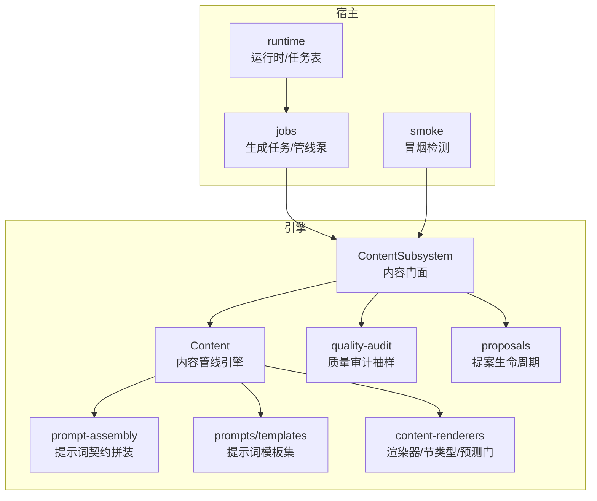
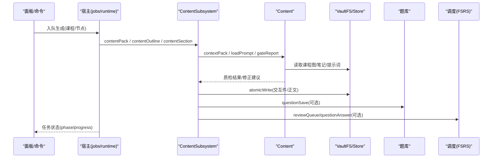
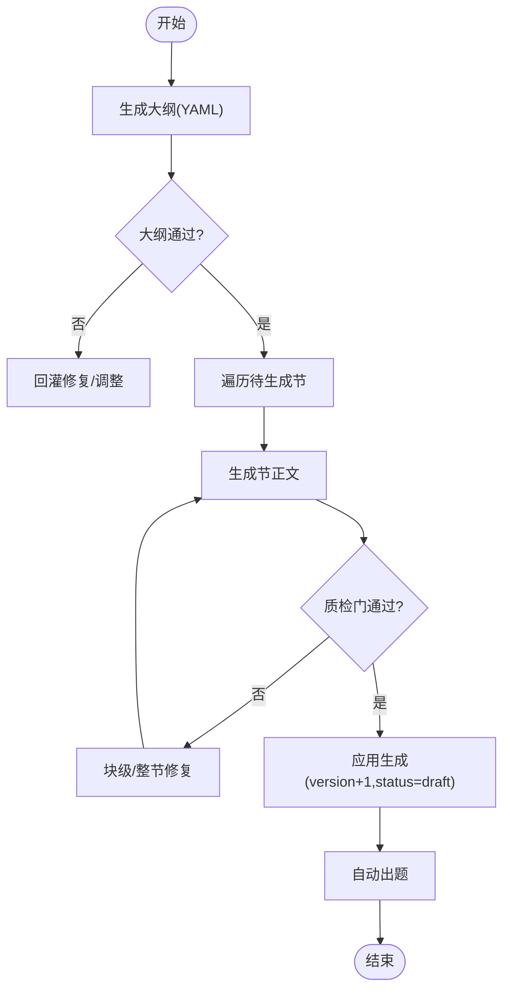
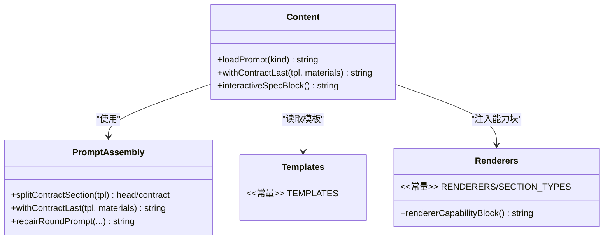
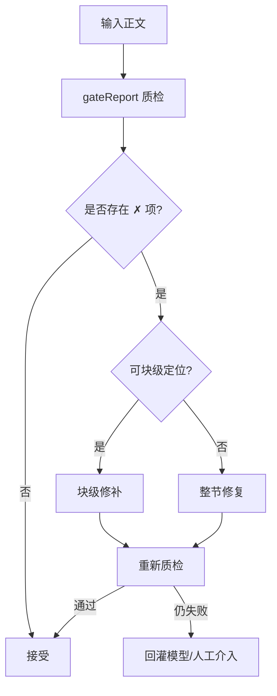
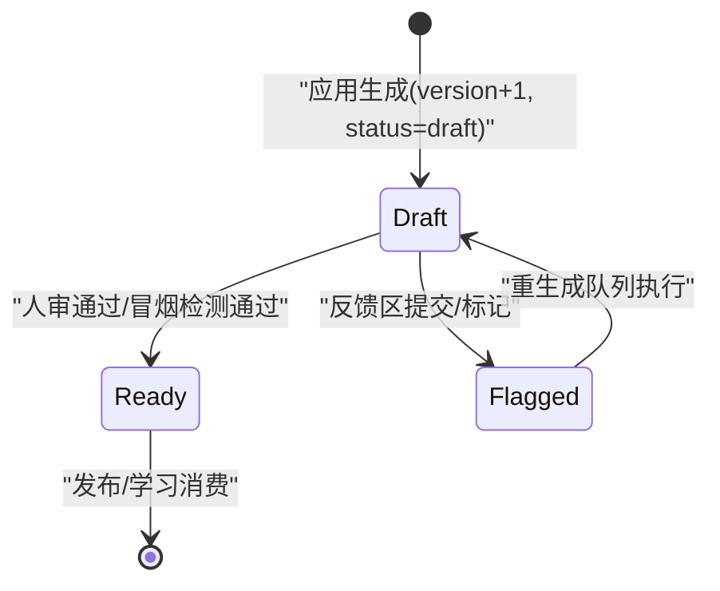
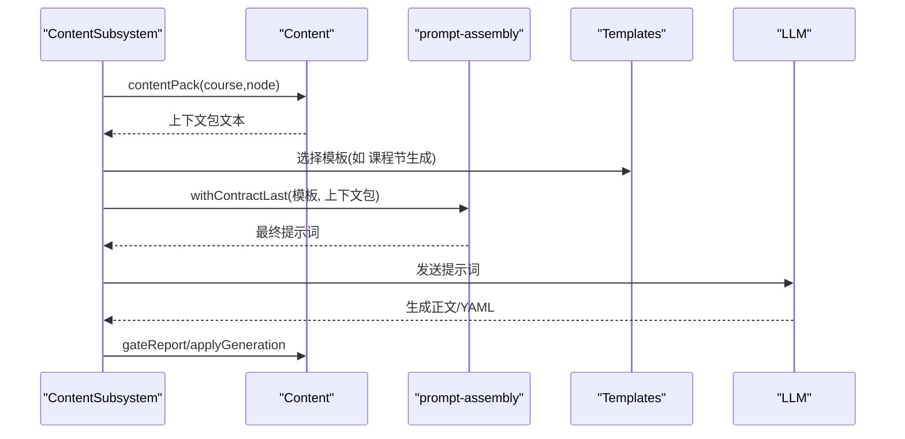
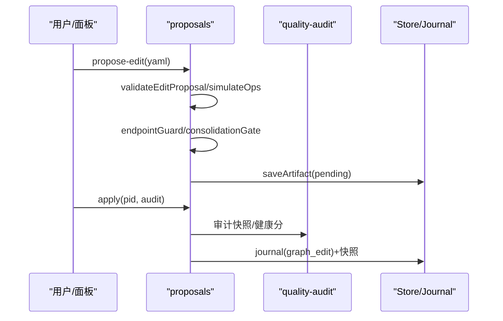
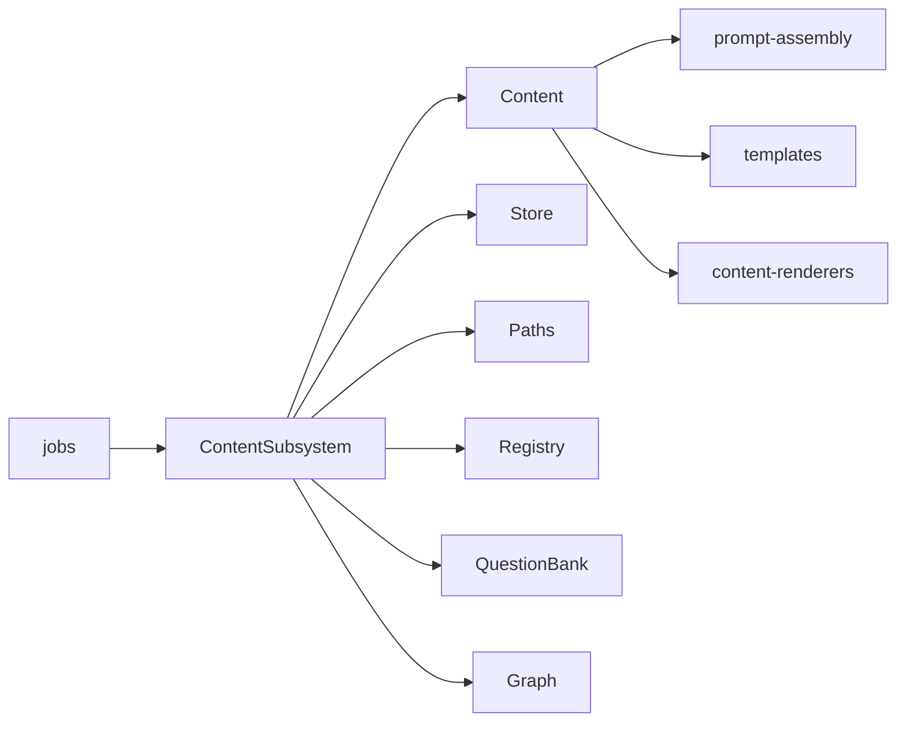

# 内容管理子系统

<cite>
**本文引用的文件**
- [content-subsystem.ts](file://src/engine/content-subsystem.ts)
- [content.ts](file://src/engine/content.ts)
- [prompt-assembly.ts](file://src/engine/prompt-assembly.ts)
- [templates.ts](file://src/engine/prompts/templates.ts)
- [content-renderers.ts](file://shared/content-renderers.ts)
- [quality-audit.ts](file://src/engine/quality-audit.ts)
- [proposals.ts](file://src/engine/proposals.ts)
- [jobs.ts](file://src/host/jobs.ts)
- [runtime.ts](file://src/host/runtime.ts)
- [smoke.ts](file://src/host/smoke.ts)
</cite>

## 目录
1. [简介](#简介)
2. [项目结构](#项目结构)
3. [核心组件](#核心组件)
4. [架构总览](#架构总览)
5. [详细组件分析](#详细组件分析)
6. [依赖关系分析](#依赖关系分析)
7. [性能考量](#性能考量)
8. [故障排查指南](#故障排查指南)
9. [结论](#结论)
10. [附录](#附录)

## 简介
本文件面向 LearnHub 的内容管理子系统，聚焦 ContentSubsystem 的职责边界与实现：内容生成流水线、提示词组装、质量审核、内容版本管理与从草稿到就绪的完整生命周期。文档同时解释内容结构定义、模板系统与渲染管道，并通过代码级流程图与时序图展示内容创建、编辑、审核与发布的端到端流程。

## 项目结构
内容管理子系统由“引擎层 + 宿主层 + 共享渲染契约”三部分构成：
- 引擎层
  - content-subsystem.ts：对外门面（ContentSubsystem），聚合课程视图、笔记读写、队列、题库、调度等能力，暴露内容管线入口。
  - content.ts：内容管线引擎，负责上下文包组装、质检门、落盘应用、大纲/节拆分、交互件处理、提示词加载与模板管理。
  - prompt-assembly.ts：提示词契约后置拼装工具，确保输出契约段始终位于最终提示词末尾。
  - prompts/templates.ts：所有生成站提示词模板的单源（课程大纲、课程节生成、题目生成、错误对比卡、罗盘初画、教练回合、种子提案等）。
  - quality-audit.ts：图质量面审计抽样与系统性发现候选计算。
  - proposals.ts：提案生命周期（schema 校验、结构检查、pending 落盘、人审 apply、journal+快照）。
- 宿主层
  - jobs.ts：生成任务注册表、泵驱动、课程生成管线（大纲→逐节正文→自动出题）、溢出修复阶梯、失败续跑。
  - runtime.ts：运行时与任务注册表形态（phase、progress、保留期清扫）。
  - smoke.ts：冒烟检测（正文就绪、题库存量、题目契约 shape、图节点在场）。
- 共享渲染契约
  - content-renderers.ts：渲染器清单、节类型菜单、预测门解析与能力块注入，是 UI 渲染与引擎提示词的单一事实源。

图表来源
- [content-subsystem.ts:101-177](file://src/engine/content-subsystem.ts#L101-L177)
- [content.ts:141-277](file://src/engine/content.ts#L141-L277)
- [prompt-assembly.ts:11-29](file://src/engine/prompt-assembly.ts#L11-L29)
- [templates.ts:17-602](file://src/engine/prompts/templates.ts#L17-L602)
- [content-renderers.ts:24-108](file://shared/content-renderers.ts#L24-L108)
- [quality-audit.ts:51-124](file://src/engine/quality-audit.ts#L51-L124)
- [proposals.ts:556-605](file://src/engine/proposals.ts#L556-L605)
- [jobs.ts:791-800](file://src/host/jobs.ts#L791-L800)
- [runtime.ts:46-63](file://src/host/runtime.ts#L46-L63)
- [smoke.ts:205-235](file://src/host/smoke.ts#L205-L235)

章节来源
- [content-subsystem.ts:101-177](file://src/engine/content-subsystem.ts#L101-L177)
- [content.ts:141-277](file://src/engine/content.ts#L141-L277)
- [prompt-assembly.ts:11-29](file://src/engine/prompt-assembly.ts#L11-L29)
- [templates.ts:17-602](file://src/engine/prompts/templates.ts#L17-L602)
- [content-renderers.ts:24-108](file://shared/content-renderers.ts#L24-L108)
- [quality-audit.ts:51-124](file://src/engine/quality-audit.ts#L51-L124)
- [proposals.ts:556-605](file://src/engine/proposals.ts#L556-L605)
- [jobs.ts:791-800](file://src/host/jobs.ts#L791-L800)
- [runtime.ts:46-63](file://src/host/runtime.ts#L46-L63)
- [smoke.ts:205-235](file://src/host/smoke.ts#L205-L235)

## 核心组件
- ContentSubsystem（内容门面）
  - 职责：编排课程视图、笔记骨架、生成上下文包、质检门、落盘应用、大纲/节拆分、反馈/重生成、复习队列、题库写入、问答作答与 FSRS 推进。
  - 关键方法：contentPack、contentApply、contentOutline、contentSection、contentSplit、contentReset、questionAnswer、reviewQueue、questions、contentCheck、contentVersion。
- Content（内容管线引擎）
  - 职责：上下文包组装、提示词加载与版本升级、质检门（超纲引用、别名一致性、可视化块/JSON/SVG/预测门、节形状、交互件存在性）、富内容修复、块级修补计划与应用、生成内容应用（version+1, status=draft）、大纲/节拆分、交互件提取与落盘。
  - 关键方法：contextPack、loadPrompt、gateReport、fixRichBlocks、extractInteractive、applyGeneration、manifestFromBody、sectionRepairPrompt/blockPatchPrompt/applyBlockPatch。
- 提示词装配与模板
  - prompt-assembly.ts：将“材料 + 输出契约段”按固定顺序拼装，保证契约段在末尾。
  - templates.ts：15 条生成站模板（课程大纲、课程节生成/风格变体、题目生成、笔记出题、错误对比卡、罗盘初画、教练回合、种子提案、项目里程碑等）。
- 渲染契约
  - content-renderers.ts：渲染器清单、节类型菜单、预测门解析与能力块注入；UI 与引擎共享同一事实源。
- 质量审计与提案
  - quality-audit.ts：审计轴、系统性候选、报告声明行。
  - proposals.ts：edit/seed/enrich 提案 schema 校验、受理/apply、写入单元、终点锚保护、生长方向不变式、健康分提示。

章节来源
- [content-subsystem.ts:101-800](file://src/engine/content-subsystem.ts#L101-L800)
- [content.ts:141-800](file://src/engine/content.ts#L141-L800)
- [prompt-assembly.ts:11-43](file://src/engine/prompt-assembly.ts#L11-L43)
- [templates.ts:17-602](file://src/engine/prompts/templates.ts#L17-L602)
- [content-renderers.ts:24-197](file://shared/content-renderers.ts#L24-L197)
- [quality-audit.ts:1-124](file://src/engine/quality-audit.ts#L1-L124)
- [proposals.ts:125-605](file://src/engine/proposals.ts#L125-L605)

## 架构总览
内容子系统采用“门面 + 引擎 + 宿主”分层：
- 门面（ContentSubsystem）屏蔽跨域细节，提供稳定的 API 给宿主与面板。
- 引擎（Content）专注内容管线：上下文包、提示词、质检、落盘、大纲/节拆分、交互件。
- 宿主（jobs/runtime/smoke）负责任务注册、泵驱动、阶段推进、冒烟检测与保留期清理。

图表来源
- [jobs.ts:791-800](file://src/host/jobs.ts#L791-L800)
- [content-subsystem.ts:129-228](file://src/engine/content-subsystem.ts#L129-L228)
- [content.ts:141-277](file://src/engine/content.ts#L141-L277)
- [content.ts:757-788](file://src/engine/content.ts#L757-L788)
- [content-subsystem.ts:720-800](file://src/engine/content-subsystem.ts#L720-L800)

## 详细组件分析

### 内容生成流水线（大纲 → 正文 → 出题）
- 大纲生成：调用 contentOutline，解析 YAML 清单，校验后写入 frontmatter content.sections（全 pending），正文不动。
- 逐节正文：对每个 pending 节，调用 contentSection，走质检门（gateReport），通过后应用 applyGeneration（version+1, status=draft），并标记完成。
- 自动出题：正文就绪后进入 quiz 阶段，按题目生成模板产出题组，经 schema/结构门禁后落盘题库。
- 溢出修复阶梯：单节终局失败不中止余节，超长节触发压缩修复→拆节（contentSplit）→再重试。

图表来源
- [content-subsystem.ts:231-241](file://src/engine/content-subsystem.ts#L231-L241)
- [content-subsystem.ts:290-308](file://src/engine/content-subsystem.ts#L290-L308)
- [content.ts:757-788](file://src/engine/content.ts#L757-L788)
- [content.ts:1380-1401](file://src/engine/content.ts#L1380-L1401)
- [jobs.ts:791-800](file://src/host/jobs.ts#L791-L800)

章节来源
- [content-subsystem.ts:231-308](file://src/engine/content-subsystem.ts#L231-L308)
- [content.ts:757-788](file://src/engine/content.ts#L757-L788)
- [content.ts:1380-1401](file://src/engine/content.ts#L1380-L1401)
- [jobs.ts:791-800](file://src/host/jobs.ts#L791-L800)

### 提示词组装与模板系统
- 模板来源：prompts/templates.ts 集中维护 15 条模板（课程大纲、课程节生成/苏格拉底/费曼、题目生成、笔记出题、错误对比卡、罗盘初画、教练回合、种子提案、项目里程碑等）。
- 能力注入：content-renderers.ts 提供渲染器清单与节类型菜单，loadPrompt 时以 {{renderers}} 占位符注入能力块。
- 契约后置：prompt-assembly.ts 的 withContractLast 将“材料 + 输出契约段”拼装，确保契约段在末尾，避免模型忽略“只输出 X”的指令。

图表来源
- [content.ts:327-378](file://src/engine/content.ts#L327-L378)
- [prompt-assembly.ts:11-43](file://src/engine/prompt-assembly.ts#L11-L43)
- [templates.ts:17-602](file://src/engine/prompts/templates.ts#L17-L602)
- [content-renderers.ts:24-108](file://shared/content-renderers.ts#L24-L108)

章节来源
- [content.ts:327-378](file://src/engine/content.ts#L327-L378)
- [prompt-assembly.ts:11-43](file://src/engine/prompt-assembly.ts#L11-L43)
- [templates.ts:17-602](file://src/engine/prompts/templates.ts#L17-L602)
- [content-renderers.ts:24-108](file://shared/content-renderers.ts#L24-L108)

### 质量审核与修复轮
- 质检门（gateReport）：
  - 超纲引用检测（checkOutOfScope）
  - 别名一致性（checkAliases/fixAliases）
  - 未注册代码块语言警告（checkRendererLangs）
  - 预测门结构校验（checkPredictBlocks）
  - 富内容块合法性（plot/chart JSON、svg 开头、mermaid 引号）
  - 节形状（长度阈值、可视化块上限、子标题限制）
  - 交互件存在性校验
- 修复策略：
  - 块级局部修补（blockPatchPlan/applyBlockPatch）针对 plot/chart/svg/learnhub-predict 第 N 块。
  - 整节修复（sectionRepairPrompt/sectionRepairBody）用于非块级违规或块级无法定位的情况。
  - 富内容块自动修复（fixRichBlocks）容忍尾随逗号/注释、裁剪 SVG 前导杂质、补 mermaid 引号。

图表来源
- [content.ts:412-587](file://src/engine/content.ts#L412-L587)
- [content.ts:670-736](file://src/engine/content.ts#L670-L736)
- [content.ts:757-788](file://src/engine/content.ts#L757-L788)

章节来源
- [content.ts:412-788](file://src/engine/content.ts#L412-L788)

### 内容版本管理与生命周期（draft → ready）
- 版本字段：frontmatter content.version 每次应用生成递增；status 初始为 draft，等待人工审核。
- 就绪判定：冒烟检测 hasReadyContent 确认笔记 frontmatter 有就绪节；题库存量与题目契约 shape 也需通过。
- 重置与恢复：contentReset 备份笔记与产物至 .trash，清空 content 与正文，便于重新生成。

图表来源
- [content.ts:1380-1401](file://src/engine/content.ts#L1380-L1401)
- [smoke.ts:205-235](file://src/host/smoke.ts#L205-L235)
- [content-subsystem.ts:244-287](file://src/engine/content-subsystem.ts#L244-L287)

章节来源
- [content.ts:1380-1401](file://src/engine/content.ts#L1380-L1401)
- [smoke.ts:205-235](file://src/host/smoke.ts#L205-L235)
- [content-subsystem.ts:244-287](file://src/engine/content-subsystem.ts#L244-L287)

### AI 驱动的内容生成流程（上下文包 + 模板 + 契约）
- 上下文包：contentPack 组装目标节点、前置摘要、后继预告、领域边界、禁止概念、enc 边、交付要求、复杂度档案、先做后教/专家思维轨迹、误解坑位、前置概念档位。
- 模板选择：根据站点（课程大纲/课程节生成/题目生成/错误对比卡/罗盘初画/教练回合/种子提案）选择对应模板。
- 契约后置：withContractLast 将“材料 + 输出契约段”拼装，确保“只输出 X”的指令最后被模型读到。

图表来源
- [content-subsystem.ts:129-146](file://src/engine/content-subsystem.ts#L129-L146)
- [content.ts:141-277](file://src/engine/content.ts#L141-L277)
- [prompt-assembly.ts:21-29](file://src/engine/prompt-assembly.ts#L21-L29)
- [templates.ts:17-602](file://src/engine/prompts/templates.ts#L17-L602)

章节来源
- [content-subsystem.ts:129-146](file://src/engine/content-subsystem.ts#L129-L146)
- [content.ts:141-277](file://src/engine/content.ts#L141-L277)
- [prompt-assembly.ts:21-29](file://src/engine/prompt-assembly.ts#L21-L29)
- [templates.ts:17-602](file://src/engine/prompts/templates.ts#L17-L602)

### 人工审核机制与提案通道
- 生成内容落地后 status=draft，需人审；审核通过后可进入 ready。
- 对于图结构变更（add_node/del_node/set_pre 等），走 proposals 通道：schema 校验 → 结构检查 → pending 落盘 → 人审 → apply 过 audit 门禁生效 → journal+快照。
- 质量审计：quality-audit 提供审计轴与系统性候选，辅助人审决策。

图表来源
- [proposals.ts:556-605](file://src/engine/proposals.ts#L556-L605)
- [proposals.ts:686-733](file://src/engine/proposals.ts#L686-L733)
- [quality-audit.ts:81-124](file://src/engine/quality-audit.ts#L81-L124)

章节来源
- [proposals.ts:556-733](file://src/engine/proposals.ts#L556-L733)
- [quality-audit.ts:81-124](file://src/engine/quality-audit.ts#L81-L124)

### 内容结构定义、模板系统与渲染管道
- 内容结构：frontmatter 包含 content.version/status/sections；正文按节组织（## 类型：标题），支持预测门机器块（learnhub-predict）。
- 模板系统：prompts/templates.ts 集中维护模板；content.ts 负责加载、版本升级与能力注入。
- 渲染管道：content-renderers.ts 提供渲染器清单与节类型菜单；UI 与引擎共享同一事实源，确保一致性与可维护性。

章节来源
- [content.ts:141-277](file://src/engine/content.ts#L141-L277)
- [content-renderers.ts:24-197](file://shared/content-renderers.ts#L24-L197)
- [templates.ts:17-602](file://src/engine/prompts/templates.ts#L17-L602)

### 具体流程示例（创建、编辑、审核、发布）
- 创建
  - 入队生成：jobs 注册任务，ContentSubsystem.contentPack 组装上下文包，调用模板生成大纲/正文。
  - 应用生成：contentApply 执行 gateReport，通过后 applyGeneration（version+1, status=draft）。
- 编辑
  - 大纲/节编辑：contentOutline/contentSection 解析 YAML/正文，走 gateReport 与 applyGeneration。
  - 反馈重生成：feedback 区提交 → flagged → 重生成队列。
- 审核
  - 冒烟检测：smoke 检查正文就绪、题库存量、题目契约 shape、图节点在场。
  - 提案 apply：proposals.applyEdit 过审计门禁，写 journal+快照。
- 发布
  - 审核通过后，内容状态转为 ready，学习流可消费。

章节来源
- [content-subsystem.ts:192-228](file://src/engine/content-subsystem.ts#L192-L228)
- [content-subsystem.ts:231-308](file://src/engine/content-subsystem.ts#L231-L308)
- [content.ts:1373-1401](file://src/engine/content.ts#L1373-L1401)
- [smoke.ts:205-235](file://src/host/smoke.ts#L205-L235)
- [proposals.ts:686-733](file://src/engine/proposals.ts#L686-L733)

## 依赖关系分析
- 耦合与内聚
  - ContentSubsystem 作为门面，高内聚地封装内容管线相关能力，低耦合地通过窄面依赖其他子系统（题库、调度、会话、图谱）。
  - Content 专注内容管线，零外部副作用（除 VaultFS/Store），便于测试与复用。
- 直接/间接依赖
  - ContentSubsystem → Content、Store、Paths、Registry、QuestionBank、Sessions、LearnerCards、Graph、Notes、VaultPrior。
  - Content → prompt-assembly、templates、content-renderers、complexity、notes、seed。
  - 宿主 jobs → ContentSubsystem、Store、Agent、LLM。
- 循环依赖
  - 通过门面窄面与模块切分避免环：ContentSubsystem 可自由 import 领域模块，跨子系统调用经门面回引。
- 外部集成点
  - LLM 调用（agent.complete/stream）、VaultFS（文件 IO）、Store（日志/作业/提案）、FSRS（调度）。

图表来源
- [content-subsystem.ts:101-177](file://src/engine/content-subsystem.ts#L101-L177)
- [content.ts:141-277](file://src/engine/content.ts#L141-L277)
- [jobs.ts:791-800](file://src/host/jobs.ts#L791-L800)

章节来源
- [content-subsystem.ts:101-177](file://src/engine/content-subsystem.ts#L101-L177)
- [content.ts:141-277](file://src/engine/content.ts#L141-L277)
- [jobs.ts:791-800](file://src/host/jobs.ts#L791-L800)

## 性能考量
- 生成任务并发：全局单并发闸（pumping），避免多任务竞争导致 vault 损坏。
- 断点续跑：单节终局失败不中止余节，continue→partial，支持后续续跑。
- 提示词优化：withContractLast 减少模型忽略契约的概率；{{renderers}} 注入避免重复描述。
- 质检门效率：块级修补优先于整节修复，降低回灌成本。
- 存储 I/O：atomicWrite 保证原子性，减少部分写入风险。

[本节提供通用指导，无需特定文件分析]

## 故障排查指南
- 生成队列损坏
  - 现象：入队/重置/恢复被拒绝，提示 genQueueBroken。
  - 处理：修复队列文件后重试。
- 正文未就绪
  - 现象：冒烟检测“正文就绪”失败。
  - 处理：检查 frontmatter content.status/version，确认至少一节就绪。
- 题库为空或契约失败
  - 现象：冒烟检测“题库存量/题目契约 shape”失败。
  - 处理：重新出题，检查题目生成模板与 schema。
- 图节点缺失
  - 现象：冒烟检测“图节点在场”失败。
  - 处理：确认课程注册表与图结构一致。
- 质检门失败
  - 现象：gateReport 返回 findings/warns。
  - 处理：按块级/整节修复指引修正，必要时回灌模型。

章节来源
- [jobs.ts:271-278](file://src/host/jobs.ts#L271-L278)
- [smoke.ts:205-235](file://src/host/smoke.ts#L205-L235)
- [content.ts:757-788](file://src/engine/content.ts#L757-L788)

## 结论
LearnHub 内容管理子系统通过门面（ContentSubsystem）与引擎（Content）清晰划分职责，结合提示词契约后置、严格质检门与块级修复策略，实现了从草稿到就绪的可控生成流程。宿主层的任务注册与泵驱动保障了生成过程的稳定性与可观测性。配合提案通道与质量审计，系统在自动化与人工审核之间取得平衡，既提升效率又守住质量底线。

[本节总结性内容，无需特定文件分析]

## 附录
- 关键路径参考
  - 内容门面：content-subsystem.ts
  - 内容引擎：content.ts
  - 提示词装配：prompt-assembly.ts
  - 模板集：templates.ts
  - 渲染契约：content-renderers.ts
  - 质量审计：quality-audit.ts
  - 提案通道：proposals.ts
  - 生成任务：jobs.ts
  - 运行时：runtime.ts
  - 冒烟检测：smoke.ts

[本节为索引，无需特定文件分析]