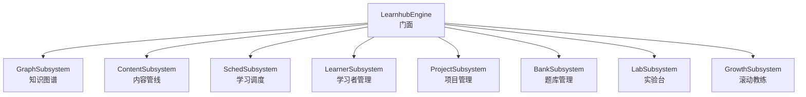
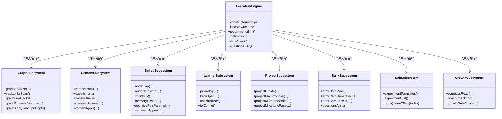
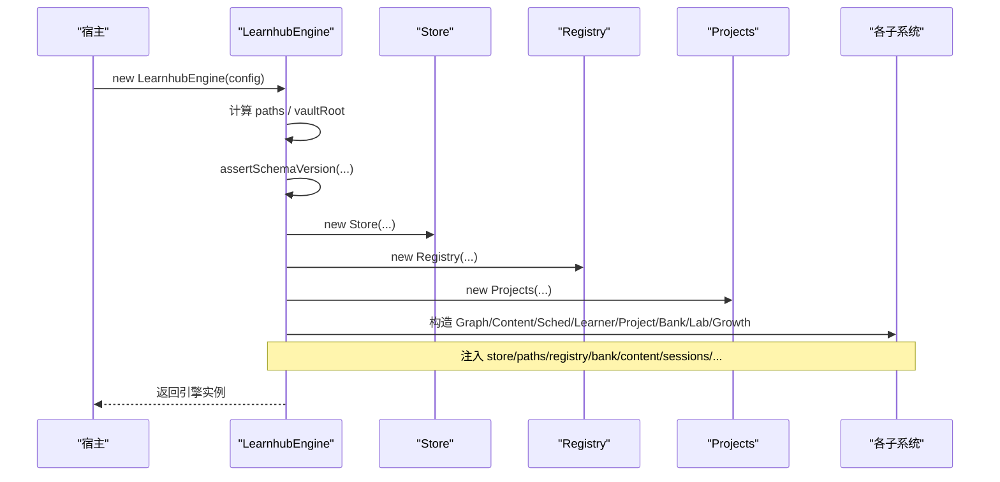
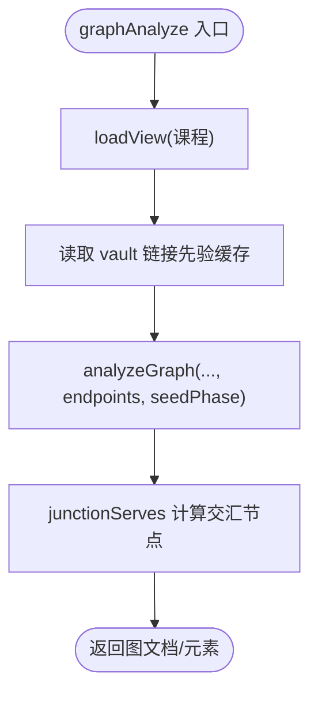
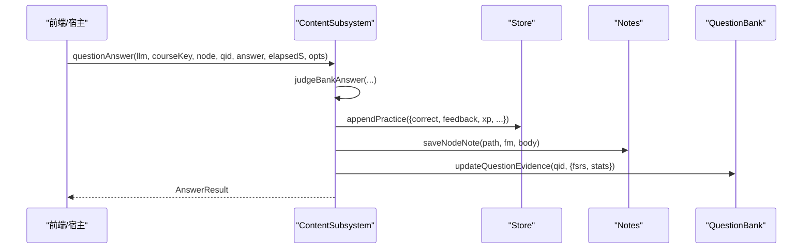
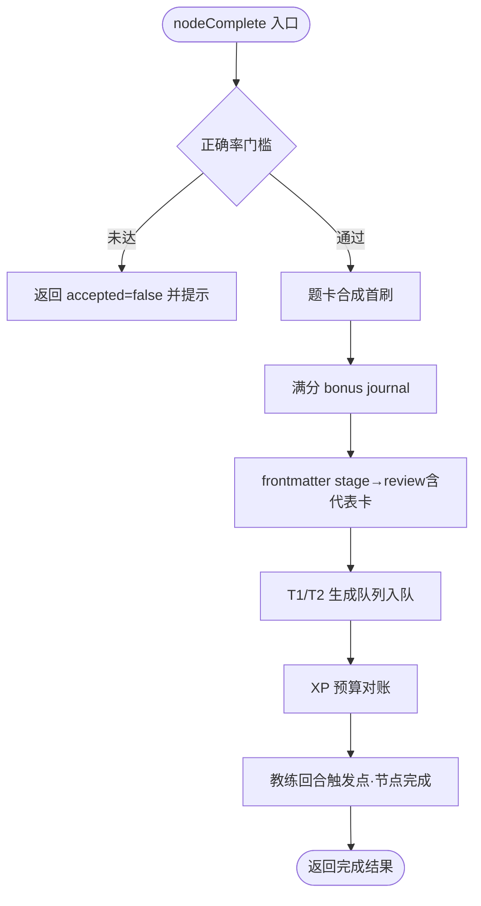
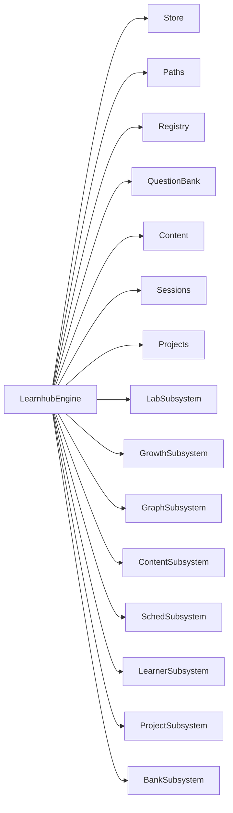

# 子系统架构

<cite>
**本文引用的文件**
- [src/engine/index.ts](file://src/engine/index.ts)
- [src/engine/graph-subsystem.ts](file://src/engine/graph-subsystem.ts)
- [src/engine/content-subsystem.ts](file://src/engine/content-subsystem.ts)
- [src/engine/sched-subsystem.ts](file://src/engine/sched-subsystem.ts)
- [src/engine/learner-cards.ts](file://src/engine/learner-cards.ts)
- [src/engine/projects.ts](file://src/engine/projects.ts)
- [src/engine/question-bank.ts](file://src/engine/question-bank.ts)
- [src/engine/nof1.ts](file://src/engine/nof1.ts)
- [src/engine/growth-subsystem.ts](file://src/engine/growth-subsystem.ts)
</cite>

## 目录
1. [引言](#引言)
2. [项目结构](#项目结构)
3. [核心组件](#核心组件)
4. [架构总览](#架构总览)
5. [详细组件分析](#详细组件分析)
6. [依赖分析](#依赖分析)
7. [性能考虑](#性能考虑)
8. [故障排查指南](#故障排查指南)
9. [结论](#结论)
10. [附录](#附录)

## 引言
本文件面向 LearnHub 引擎的子系统架构，聚焦以下子系统的职责边界与协作关系：GraphSubsystem（知识图谱）、ContentSubsystem（内容管线）、SchedSubsystem（学习调度）、LearnerSubsystem（学习者管理）、ProjectSubsystem（项目管理）、BankSubsystem（题库管理），并补充 LabSubsystem（实验台）与 GrowthSubsystem（滚动教练）在装配中的角色。文档重点说明：
- 子系统初始化顺序与依赖注入机制（通过构造函数窄面参数传递共享依赖）。
- 子系统间通信模式与数据流转方式（门面聚合转发、窄面回引、事件/流水/提案通道）。
- 具体装配与调用示例（以源码路径标注替代直接代码片段）。

## 项目结构
LearnHub 引擎采用“门面 + 领域子系统”的分层组织：
- 门面 LearnhubEngine 负责统一入口、装配所有子系统、暴露对外方法。
- 各子系统类位于 engine/ 下独立文件，按领域划分职责，并通过“窄面接口”向门面回引能力，避免循环依赖。
- 共享基础设施（存储、路径、注册表、FSRS、YAML、IO 等）由门面构造时注入到各子系统。

图表来源
- [src/engine/index.ts:149-398](file://src/engine/index.ts#L149-L398)

章节来源
- [src/engine/index.ts:149-398](file://src/engine/index.ts#L149-L398)

## 核心组件
- LearnhubEngine（门面）
  - 职责：统一装配所有子系统；提供课程视图加载、推荐、状态、审计、生成任务持久化等高层 API。
  - 关键装配点：在构造函数中创建并注入各子系统所需依赖（store、paths、registry、bank、content、schedCache、clock、fs、vaultRoot 等）。
- GraphSubsystem（知识图谱）
  - 职责：图分析、Vault 链接先验、图探索、提案门禁包装、enc 覆盖层回填、种子起草与建课/终点管理。
- ContentSubsystem（内容管线）
  - 职责：内容上下文包、笔记解析与反馈区、课程工作区树、题目列表与复习队列、作答流、节清单与正文落盘。
- SchedSubsystem（学习调度）
  - 职责：节点跳过/完成确认、XP 时间账本、记忆健康仪表盘、FSRS 参数优化器、沉淀层（sediment）写入与折叠。
- LearnerSubsystem（学习者管理）
  - 职责：今日 pin、JOL 配置、周复盘（Kata）、教练建议、讲解要点、我的卡（E1）、技能/回执/习惯等学习者输出域能力。
- ProjectSubsystem（项目管理）
  - 职责：项目生命周期、里程碑计划与产物（带快照覆盖）、过点对账、检索点会话、执行事件流与目标反编译。
- BankSubsystem（题库管理）
  - 职责：错误对比卡挖矿/生成/作答、题目管理面板、难度感知回流、一键清理、瑕疵题勘误与判罚冲正。
- LabSubsystem（实验台）
  - 职责：N-of-1 实验模板与运行、对复习队列当日生效臂、实验提案与申请。
- GrowthSubsystem（滚动教练）
  - 职责：罗盘读取/挂载、教练回合触发、生长批受理、复诊、边实验结算等。

章节来源
- [src/engine/graph-subsystem.ts:78-85](file://src/engine/graph-subsystem.ts#L78-L85)
- [src/engine/content-subsystem.ts:101-107](file://src/engine/content-subsystem.ts#L101-L107)
- [src/engine/sched-subsystem.ts:83-91](file://src/engine/sched-subsystem.ts#L83-L91)
- [src/engine/learner-cards.ts:352-365](file://src/engine/learner-cards.ts#L352-L365)
- [src/engine/projects.ts:592-599](file://src/engine/projects.ts#L592-L599)
- [src/engine/question-bank.ts:513-521](file://src/engine/question-bank.ts#L513-L521)
- [src/engine/nof1.ts:476-504](file://src/engine/nof1.ts#L476-L504)
- [src/engine/growth-subsystem.ts:91-98](file://src/engine/growth-subsystem.ts#L91-L98)

## 架构总览
子系统通过“窄面依赖注入”解耦：每个子系统只声明自身需要的门面能力（如 loadView、learningDay、loadPrompt、assertNoteOk、scanCourseBanks 等），由门面在构造时传入 this。这样既避免了子系统反向依赖门面实现细节，又保证了运行时可访问跨域能力。

图表来源
- [src/engine/index.ts:212-398](file://src/engine/index.ts#L212-L398)
- [src/engine/graph-subsystem.ts:78-85](file://src/engine/graph-subsystem.ts#L78-L85)
- [src/engine/content-subsystem.ts:101-107](file://src/engine/content-subsystem.ts#L101-L107)
- [src/engine/sched-subsystem.ts:83-91](file://src/engine/sched-subsystem.ts#L83-L91)
- [src/engine/learner-cards.ts:352-365](file://src/engine/learner-cards.ts#L352-L365)
- [src/engine/projects.ts:592-599](file://src/engine/projects.ts#L592-L599)
- [src/engine/question-bank.ts:513-521](file://src/engine/question-bank.ts#L513-L521)
- [src/engine/nof1.ts:476-504](file://src/engine/nof1.ts#L476-L504)
- [src/engine/growth-subsystem.ts:91-98](file://src/engine/growth-subsystem.ts#L91-L98)

## 详细组件分析

### 子系统初始化顺序与依赖注入
- 初始化顺序
  - 门面先创建基础对象：Paths、Registry、Store、Content、QuestionBank、ConceptRegistry、LearnerCards、ErrorCards、Skills、Habits、NoteSourceManifest、AnkiMirror、Projects、Sessions、GraphProposals。
  - 随后依次构造各子系统，并将已创建的实例或函数式能力作为窄面注入。
  - 最后将 schedCache（FSRS 缓存）与 learningDay/loadView 等门面方法以闭包形式注入，供子系统按需调用。
- 依赖注入机制
  - 每个子系统定义一个“窄面接口”（如 GraphDeps、ContentDeps、SchedDeps、LearnerDeps、ProjectDeps、BankDeps、LabDeps、GrowthDeps），仅包含该子系统实际消费的门面能力。
  - 门面在构造时将这些窄面以对象字面量传入，从而形成“运行时回引门面”的单向依赖，避免环。

图表来源
- [src/engine/index.ts:212-398](file://src/engine/index.ts#L212-L398)

章节来源
- [src/engine/index.ts:212-398](file://src/engine/index.ts#L212-L398)

### GraphSubsystem（知识图谱）
- 职责边界
  - 图分析与浏览、Vault 链接先验扫描与回填、图探索、提案门禁包装、enc 覆盖层回填、种子起草与建课/终点管理。
- 关键流程
  - graphAnalyze：加载课程视图 → 读取 Vault 链接先验缓存 → 分析图 → 标注交汇节点与终点信息。
  - vaultLinksScan：扫描 vault 链接 → 写 state/vault链接.json → 统计层级（proposal/review/report）。
  - graphLinkBackfill：基于 w ≥ 0.7 的候选边定向为 set_enc 提案（走人审）。
  - graphPropose/graphApply：受理 edit/seed/enrich 提案，apply 前进行 seed 审计门禁。
- 数据流转
  - 读侧：Registry.loadView → Graph/State → 分析结果。
  - 写侧：ProposalStore（pending/applied）→ 审计 → 应用变更。

图表来源
- [src/engine/graph-subsystem.ts:88-117](file://src/engine/graph-subsystem.ts#L88-L117)
- [src/engine/graph-subsystem.ts:125-152](file://src/engine/graph-subsystem.ts#L125-L152)

章节来源
- [src/engine/graph-subsystem.ts:88-117](file://src/engine/graph-subsystem.ts#L88-L117)
- [src/engine/graph-subsystem.ts:155-195](file://src/engine/graph-subsystem.ts#L155-L195)
- [src/engine/graph-subsystem.ts:198-265](file://src/engine/graph-subsystem.ts#L198-L265)
- [src/engine/graph-subsystem.ts:406-429](file://src/engine/graph-subsystem.ts#L406-L429)

### ContentSubsystem（内容管线）
- 职责边界
  - 内容上下文包、笔记 resolve/反馈区、课程工作区树、题库树、复习队列、作答流、节清单与正文落盘。
- 关键流程
  - contentPack：组装节点上下文 + Vault 先验注入段（零命中则无该段）。
  - reviewQueue：聚合题库到期卡、我的卡、错误对比卡、笔记源卡，排序后返回卡片序列。
  - questionAnswer：自动判卷 → practice 流水 + 计数/EMA → 节点 frontmatter 证据更新 → FSRS 推进（或挂起自评）。
- 数据流转
  - 读侧：Registry.loadView → Graph/State → 题库/卡片。
  - 写侧：Store.appendPractice/appendReview → Notes.saveNote → Bank.updateQuestionEvidence。

图表来源
- [src/engine/content-subsystem.ts:734-800](file://src/engine/content-subsystem.ts#L734-L800)

章节来源
- [src/engine/content-subsystem.ts:109-146](file://src/engine/content-subsystem.ts#L109-L146)
- [src/engine/content-subsystem.ts:538-717](file://src/engine/content-subsystem.ts#L538-L717)
- [src/engine/content-subsystem.ts:734-800](file://src/engine/content-subsystem.ts#L734-L800)

### SchedSubsystem（学习调度）
- 职责边界
  - 节点跳过/完成确认、XP 时间账本、记忆健康仪表盘、FSRS 参数优化器、沉淀层（sediment）写入与折叠。
- 关键流程
  - nodeComplete：合成首刷 → 满分 bonus → stage→review → T1/T2 入队 → XP 预算对账。
  - optimizeFsrsParams：训练新参 → 评估优于基线 → 写沉淀正典 → 逐课程缓存镜像 → 失效缓存 → 重建学习者档案投影。
  - sedimentSettle：按学习周结算校准画像与速度韧性，重建档案投影。
- 数据流转
  - 读侧：Store.practiceAll/journalTail/reviewLogAll → 计算指标。
  - 写侧：Store.appendJournal/appendReview → Sediment 追加事件 → 投影重建。

图表来源
- [src/engine/sched-subsystem.ts:124-270](file://src/engine/sched-subsystem.ts#L124-L270)

章节来源
- [src/engine/sched-subsystem.ts:93-121](file://src/engine/sched-subsystem.ts#L93-L121)
- [src/engine/sched-subsystem.ts:124-270](file://src/engine/sched-subsystem.ts#L124-L270)
- [src/engine/sched-subsystem.ts:368-450](file://src/engine/sched-subsystem.ts#L368-L450)
- [src/engine/sched-subsystem.ts:472-546](file://src/engine/sched-subsystem.ts#L472-L546)

### LearnerSubsystem（学习者管理）
- 职责边界
  - 今日 pin、JOL 配置、周复盘（Kata）、教练建议、讲解要点、我的卡（E1）、技能/回执/习惯等学习者输出域能力。
- 关键流程
  - pinToday/unpinToday/setGoalIntention：修改当日推荐排序与执行意图。
  - kataOpen/kataSave：打开/保存周复盘，附带沉淀结算与罗盘 ETA 挂载。
  - coachAdvice：基于近期选择分布与到期难题数生成温和提示。
- 数据流转
  - 读侧：Store.bandRecsAll/practiceAll/reviewLogAll/habitRepeatsAll → 计算建议。
  - 写侧：Store.savePins/appendBandRec → OutputArtifact（周复盘）→ 刷新指纹。

章节来源
- [src/engine/learner-cards.ts:367-416](file://src/engine/learner-cards.ts#L367-L416)
- [src/engine/learner-cards.ts:595-668](file://src/engine/learner-cards.ts#L595-L668)
- [src/engine/learner-cards.ts:764-798](file://src/engine/learner-cards.ts#L764-L798)

### ProjectSubsystem（项目管理）
- 职责边界
  - 项目生命周期、里程碑计划与产物（带快照覆盖）、过点对账、检索点会话、执行事件流与目标反编译。
- 关键流程
  - projectPlanPropose/applyPlan：计划修订走提案通道，旧计划 YAML 落快照。
  - projectMilestoneWrite：未生成直落，已生成转重生成提案（带快照覆盖）。
  - projectMilestonePass：显式过点，定价 = est × 关联节点题池难度校准，一次性入账并锁定。
- 数据流转
  - 读侧：Projects.view/load → 计划/产物状态。
  - 写侧：Store.updateProposal → 项目.md/frontmatter → 里程碑产物 → Journal（milestone_settle）。

章节来源
- [src/engine/projects.ts:355-408](file://src/engine/projects.ts#L355-L408)
- [src/engine/projects.ts:422-480](file://src/engine/projects.ts#L422-L480)
- [src/engine/projects.ts:757-778](file://src/engine/projects.ts#L757-L778)

### BankSubsystem（题库管理）
- 职责边界
  - 错误对比卡挖矿/生成/作答、题目管理面板、难度感知回流、一键清理、瑕疵题勘误与判罚冲正。
- 关键流程
  - errorCardMine：从 practice 流水挖掘高频错误模式候选。
  - errorCardGenerate：取未覆盖候选 → 组装材料 → LLM 产出 YAML → schema 校验 → 落盘错误卡。
  - errorCardAnswer：三选一答案唯一 → rating 3/1 → 推进卡自身 FSRS → 无绑定 XP 记账。
- 数据流转
  - 读侧：Store.practiceAll → ErrorCards.load → Bank.load。
  - 写侧：ErrorCards.addCards/updateCardEvidence → Store.appendJournal（xp_error）。

章节来源
- [src/engine/question-bank.ts:523-584](file://src/engine/question-bank.ts#L523-L584)
- [src/engine/question-bank.ts:572-684](file://src/engine/question-bank.ts#L572-L684)
- [src/engine/question-bank.ts:687-720](file://src/engine/question-bank.ts#L687-L720)

### LabSubsystem（实验台）与 GrowthSubsystem（滚动教练）
- LabSubsystem
  - 职责：N-of-1 实验模板与运行、对复习队列当日生效臂、实验提案与申请。
  - 关键点：nof1QueueEffect(today) 决定当次复习队列呈现顺序与默认难度带。
- GrowthSubsystem
  - 职责：罗盘读取/挂载、教练回合触发、生长批受理、复诊、边实验结算。
  - 关键点：coachCheckFor(c, today) 在节点完成/状态变化时触发就绪深度检查。

章节来源
- [src/engine/nof1.ts:476-504](file://src/engine/nof1.ts#L476-L504)
- [src/engine/growth-subsystem.ts:91-113](file://src/engine/growth-subsystem.ts#L91-L113)

## 依赖分析
- 耦合与内聚
  - 子系统之间不直接相互 import 对方类，而是通过门面的窄面接口间接协作，降低耦合度。
  - 每个子系统内部高内聚：例如 ContentSubsystem 专注内容管线，SchedSubsystem 专注调度与沉淀层。
- 直接/间接依赖
  - 门面 LearnhubEngine 是所有子系统的装配中心，持有 store、paths、registry、bank、content、sessions、projects、lab、growth 等实例。
  - 子系统通过窄面回引门面能力（如 loadView、learningDay、loadPrompt、assertNoteOk、scanCourseBanks），形成“运行时回引”。
- 外部依赖与集成点
  - FSRS 参数缓存 schedCache 在优化后失效，确保后续调度使用最新参数。
  - Store/Journal/Practice/Review 是跨子系统共享的追加型流水载体。
  - VaultFs 抽象文件系统，屏蔽底层实现差异。

图表来源
- [src/engine/index.ts:212-398](file://src/engine/index.ts#L212-L398)

章节来源
- [src/engine/index.ts:212-398](file://src/engine/index.ts#L212-L398)

## 性能考虑
- FSRS 参数缓存
  - 门面维护 schedCache（Map<string | null, FSRS>），按课程根键隔离；优化后清空缓存，避免重复构建成本。
- 批量与惰性
  - 内容管线与复习队列采用批量聚合（题库/我的卡/错误卡/笔记源卡）+ 稳定排序，减少多次 IO。
  - 内容生成与大纲落盘采用原子写与分步处理，避免中间态污染。
- 只读优先
  - 大量读操作（如 graphAnalyze、memoryHealth、difficultyAdvice）遵循只读原则，必要时才写 journal/sediment。

[本节为通用指导，无需特定文件引用]

## 故障排查指南
- Broken 笔记前置门
  - 多数子系统在操作前调用 assertNoteOk，若目标笔记 Broken 会抛出明确错误（含位置与原因），便于快速定位。
- 提案门禁
  - 图谱域 apply 前进行 seed 审计，ERROR 时拒绝 apply；warns 与健康分随 findings 返回，辅助决策。
- 参数优化失败
  - optimizeFsrsParams 在评估未优于基线时跳过写回，并返回 meta 元数据（logLoss/rmse 等）用于诊断。
- 生成任务文件损坏
  - loadGenJobs 对 gen-jobs.json 的 Missing/Broken 分别处理：Missing 视为空数组，Broken 抛错并给出修复指引。

章节来源
- [src/engine/index.ts:444-463](file://src/engine/index.ts#L444-L463)
- [src/engine/graph-subsystem.ts:415-429](file://src/engine/graph-subsystem.ts#L415-L429)
- [src/engine/sched-subsystem.ts:368-450](file://src/engine/sched-subsystem.ts#L368-L450)
- [src/engine/index.ts:724-753](file://src/engine/index.ts#L724-L753)

## 结论
LearnHub 引擎通过门面集中装配与“窄面依赖注入”实现了清晰的子系统边界与低耦合协作。Graph/Content/Sched/Learner/Project/Bank/Lab/Growth 各司其职，通过 Store/Journal/Practice/Review 等追加型流水与 ProposalStore 提案通道进行跨域通信。初始化顺序保证依赖可用，FSRS 缓存与原子写保障性能与一致性。该架构便于扩展新域、替换实现（如 VaultFs/Clock/Rng），并为测试注入提供便利。

[本节为总结性内容，无需特定文件引用]

## 附录
- 装配与调用示例（以源码路径标注）
  - 门面构造与子系统注入：参见 [src/engine/index.ts:212-398](file://src/engine/index.ts#L212-L398)。
  - GraphSubsystem 图分析入口：参见 [src/engine/graph-subsystem.ts:88-117](file://src/engine/graph-subsystem.ts#L88-L117)。
  - ContentSubsystem 复习队列与作答流：参见 [src/engine/content-subsystem.ts:538-717](file://src/engine/content-subsystem.ts#L538-L717)、[src/engine/content-subsystem.ts:734-800](file://src/engine/content-subsystem.ts#L734-L800)。
  - SchedSubsystem 完成确认与参数优化：参见 [src/engine/sched-subsystem.ts:124-270](file://src/engine/sched-subsystem.ts#L124-L270)、[src/engine/sched-subsystem.ts:368-450](file://src/engine/sched-subsystem.ts#L368-L450)。
  - LearnerSubsystem 周复盘与教练建议：参见 [src/engine/learner-cards.ts:595-668](file://src/engine/learner-cards.ts#L595-L668)、[src/engine/learner-cards.ts:764-798](file://src/engine/learner-cards.ts#L764-L798)。
  - ProjectSubsystem 计划与里程碑：参见 [src/engine/projects.ts:355-408](file://src/engine/projects.ts#L355-L408)、[src/engine/projects.ts:422-480](file://src/engine/projects.ts#L422-L480)、[src/engine/projects.ts:757-778](file://src/engine/projects.ts#L757-L778)。
  - BankSubsystem 错误对比卡：参见 [src/engine/question-bank.ts:572-684](file://src/engine/question-bank.ts#L572-L684)、[src/engine/question-bank.ts:687-720](file://src/engine/question-bank.ts#L687-L720)。
  - LabSubsystem 实验臂效果：参见 [src/engine/nof1.ts:476-504](file://src/engine/nof1.ts#L476-L504)。
  - GrowthSubsystem 罗盘与教练：参见 [src/engine/growth-subsystem.ts:91-113](file://src/engine/growth-subsystem.ts#L91-L113)。

[本节为参考索引，无需额外分析]