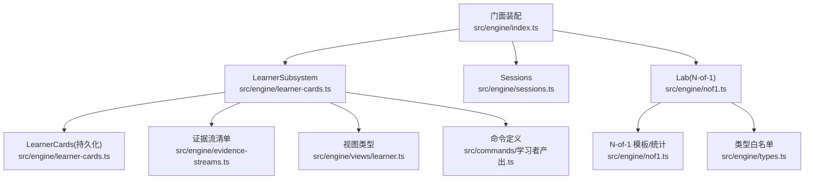
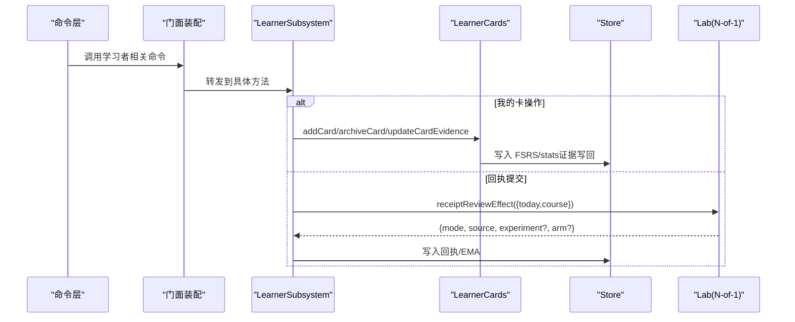
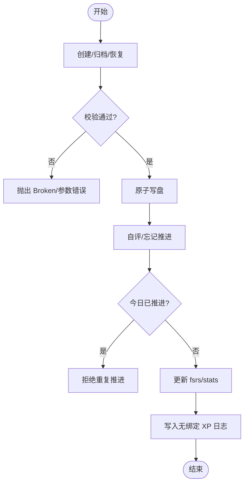
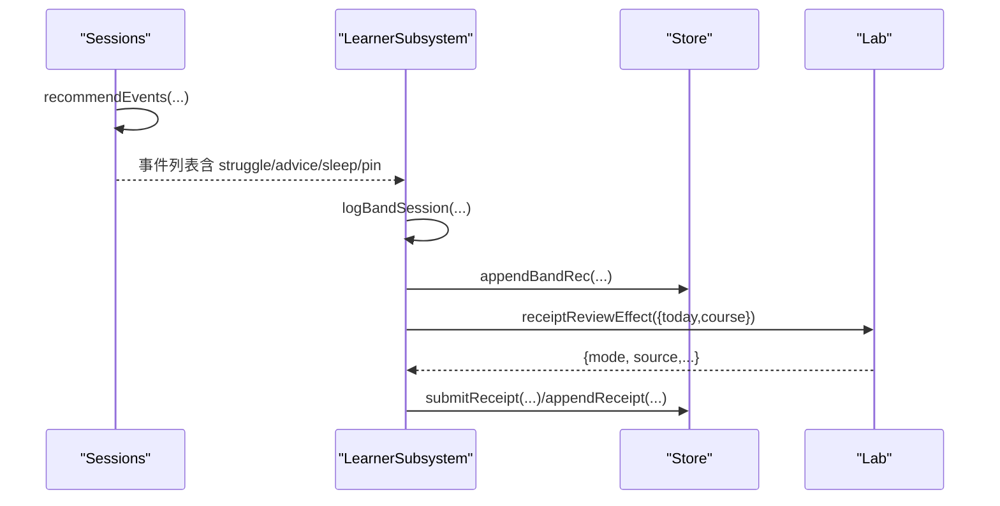
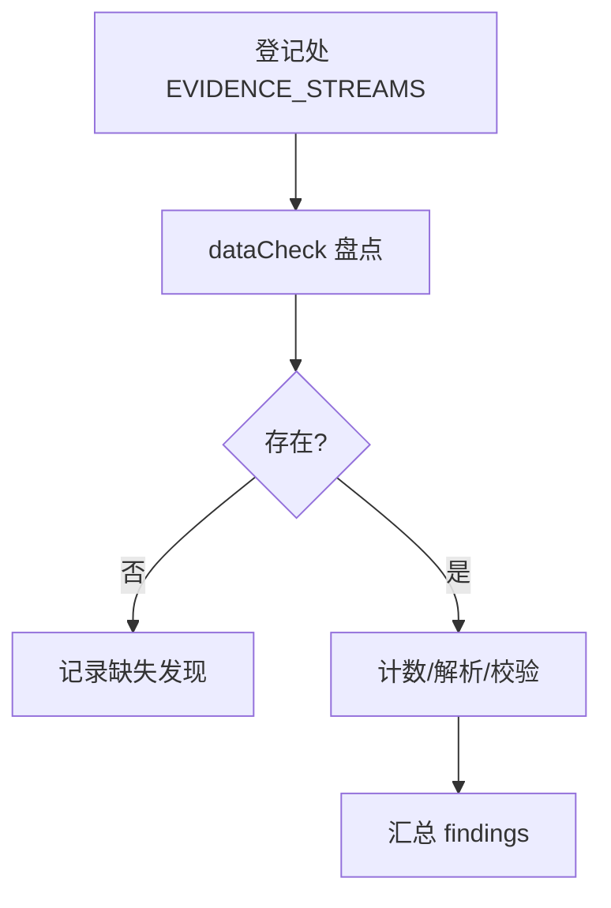
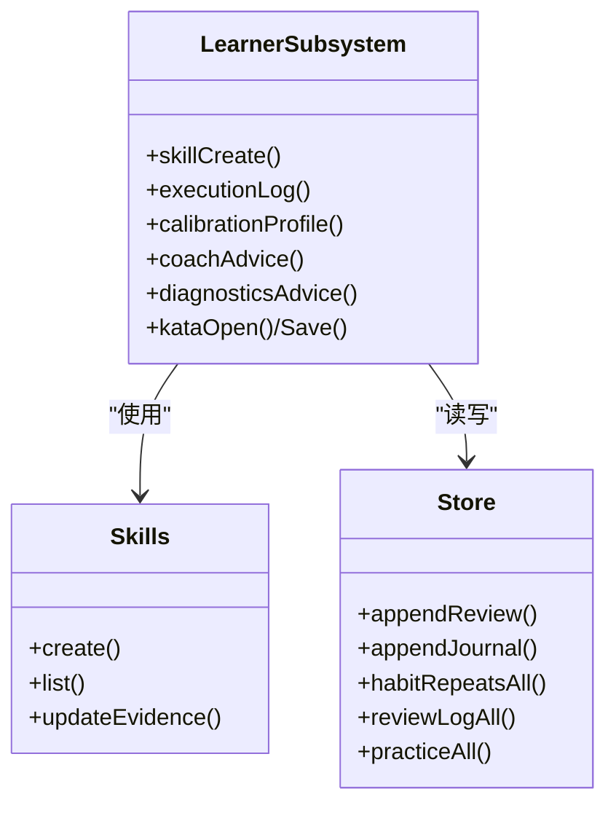
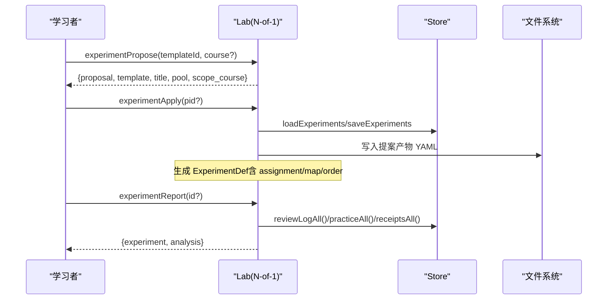
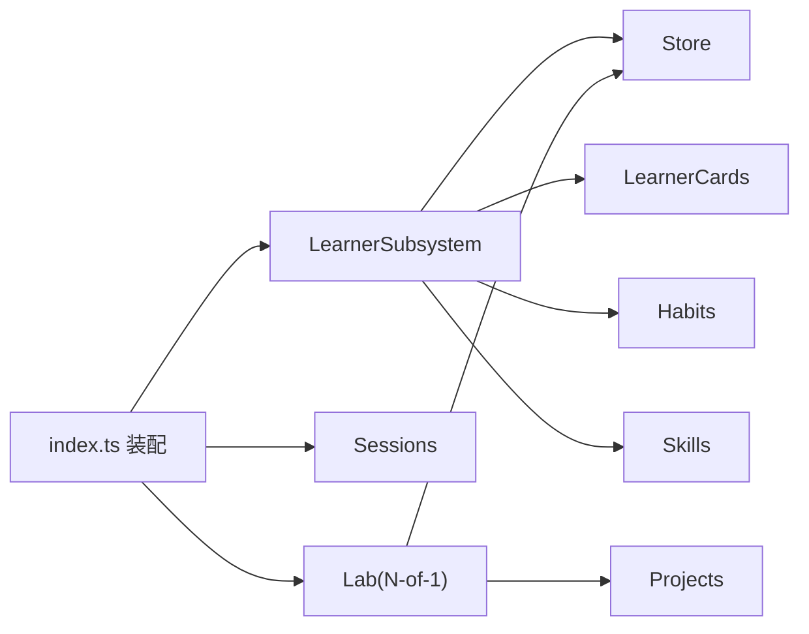

# 学习者管理子系统

<cite>
**本文引用的文件**
- [src/engine/index.ts](file://src/engine/index.ts)
- [src/engine/learner-cards.ts](file://src/engine/learner-cards.ts)
- [src/engine/sessions.ts](file://src/engine/sessions.ts)
- [src/engine/evidence-streams.ts](file://src/engine/evidence-streams.ts)
- [src/engine/nof1.ts](file://src/engine/nof1.ts)
- [src/engine/types.ts](file://src/engine/types.ts)
- [src/engine/views/learner.ts](file://src/engine/views/learner.ts)
- [src/commands/学习者产出.ts](file://src/commands/学习者产出.ts)
</cite>

## 目录
1. [简介](#简介)
2. [项目结构](#项目结构)
3. [核心组件](#核心组件)
4. [架构总览](#架构总览)
5. [详细组件分析](#详细组件分析)
6. [依赖关系分析](#依赖关系分析)
7. [性能考量](#性能考量)
8. [故障排查指南](#故障排查指南)
9. [结论](#结论)
10. [附录：代码示例路径](#附录代码示例路径)

## 简介
本文件面向 LearnHub 的“学习者管理子系统”，聚焦 LearnerSubsystem 的职责边界与实现要点，覆盖：
- 学习者卡片（我的卡）管理：创建、归档、复习推进、证据写回、队列视图。
- 学习会话记录与行为追踪：推荐事件、难度带日志、挣扎窗口、内容诊断、回执提交等。
- 证据流处理：统一流水清单、读侧盘点、与 N-of-1 实验结局采集对接。
- 能力模型与表现分析：校准画像、技能 lane 推进、执行事件 XP 入账、周复盘现实聚合。
- 无反馈学习模式（NoF1）：模板库、分臂策略、统计分析与报告、回执评审模式切换。

## 项目结构
学习者管理子系统以 LearnerSubsystem 为聚合入口，内部按功能域组织：
- 卡片域（E1）：LearnerCards + 视图类型，负责“我的卡”的持久化、校验、调度写回与队列视图。
- 会话与状态（Sessions）：课程状态、推荐事件、挣扎判定、前置建议、睡眠耦合建议等。
- 证据流（Evidence Streams）：集中登记所有有读侧的 JSONL 流水，供数据体检与实验读侧消费。
- 实验台（Lab/N-of-1）：单主体内随机化实验，提供模板、提案-确认制、分臂、统计分析与报告。
- 能力与习惯（Skills/Habits/Receipts）：技能 lane 推进、执行事件入账、回执提交与评审模式。

图示来源
- [src/engine/index.ts:275-293](file://src/engine/index.ts#L275-L293)
- [src/engine/learner-cards.ts:352-364](file://src/engine/learner-cards.ts#L352-L364)
- [src/engine/sessions.ts:293-357](file://src/engine/sessions.ts#L293-L357)
- [src/engine/evidence-streams.ts:26-39](file://src/engine/evidence-streams.ts#L26-L39)
- [src/engine/nof1.ts:476-518](file://src/engine/nof1.ts#L476-L518)
- [src/engine/types.ts:310-335](file://src/engine/types.ts#L310-L335)

章节来源
- [src/engine/index.ts:275-293](file://src/engine/index.ts#L275-L293)

## 核心组件
- LearnerSubsystem：学习者输出与自管理的聚合层，封装 pin/JOL/周复盘/讲解/我的卡/校准/技能/回执/习惯等能力，通过窄面依赖注入跨子系统能力。
- LearnerCards：独立“我的卡”域，包含 schema 校验、增删归档、FSRS 调度写回、一卡一天一次推进门禁。
- Sessions：课程状态、推荐事件生成、挣扎判定、前置建议、睡眠建议等。
- Evidence Streams：集中登记所有有读侧的 JSONL 流水，保障 inventory 与 dataCheck 对账。
- Lab(N-of-1)：D-1 实验通道，提供模板库、提案-确认、分臂、统计分析与报告；同时提供回执评审模式当日生效。

章节来源
- [src/engine/learner-cards.ts:311-364](file://src/engine/learner-cards.ts#L311-L364)
- [src/engine/learner-cards.ts:184-309](file://src/engine/learner-cards.ts#L184-L309)
- [src/engine/sessions.ts:293-357](file://src/engine/sessions.ts#L293-L357)
- [src/engine/evidence-streams.ts:1-39](file://src/engine/evidence-streams.ts#L1-L39)
- [src/engine/nof1.ts:476-518](file://src/engine/nof1.ts#L476-L518)

## 架构总览
学习者管理子系统通过门面装配，将各子域解耦：
- 门面在构造时注入 clock/fs/store/paths/registry/bank/projects/habits/skills/learnerCards/noteManifest 等端口。
- LearnerSubsystem 暴露方法给命令层与 UI，内部调用各子域完成业务。
- NoF1 作为独立实验台，既服务于自身实验流程，也向回执评审模式提供“当日臂覆盖默认值”的能力。

图示来源
- [src/engine/index.ts:275-293](file://src/engine/index.ts#L275-L293)
- [src/engine/learner-cards.ts:241-294](file://src/engine/learner-cards.ts#L241-L294)
- [src/engine/nof1.ts:748-765](file://src/engine/nof1.ts#L748-L765)

## 详细组件分析

### 学习者卡片管理（我的卡）
职责范围
- 卡片创建：支持 recall_cue（再讲一遍）与 cloze_rewrite（挖空重述），自动去重与长度限制。
- 卡片归档/恢复：管理面动作，不影响 canonical 度量。
- 复习推进：自评 2/3/4 或忘记 1，一卡一天一次推进，FSRS 调度块写回，XP 走无绑定行。
- 队列视图：到期在前、新卡随后，仅用于清点，复习入口并入复习队列。
- 证据写回：fsrs/stats 整体替换，经 schema 校验后原子写盘。

关键实现要点
- 校验器 enforce 字段约束、控制字符、挖空标记、节点关联一致性。
- 路径规则：课程根/我的卡/<节点>.yaml，缺失=合法空态，存在但坏=抛 Broken。
- 进度门禁：advanceStrict 保证“一卡一学习日一次推进”。

图示来源
- [src/engine/learner-cards.ts:114-182](file://src/engine/learner-cards.ts#L114-L182)
- [src/engine/learner-cards.ts:241-294](file://src/engine/learner-cards.ts#L241-L294)
- [src/engine/learner-cards.ts:939-979](file://src/engine/learner-cards.ts#L939-L979)

章节来源
- [src/engine/learner-cards.ts:184-309](file://src/engine/learner-cards.ts#L184-L309)
- [src/engine/learner-cards.ts:878-925](file://src/engine/learner-cards.ts#L878-L925)
- [src/engine/learner-cards.ts:939-979](file://src/engine/learner-cards.ts#L939-L979)

### 学习会话记录与行为追踪
- 推荐事件：综合复习/逾期/学习中/新课/挣扎/睡眠建议/pin 目标偏好，生成可排序的事件列表。
- 挣扎窗口：近期作答正确率低于阈值且达到最小次数，触发 enc 回退建议。
- 难度带日志：会话结束记录 band 选择与作答结算，供教练反馈与趋势分析。
- 内容诊断：基于练习信号与节重写历史，给出 R1/R2 建议并落 journal。
- 回执提交：按当日生效档（实验臂 > 配置默认）决定 AI 量表评审或学习者自评，分数同权入 EMA。

图示来源
- [src/engine/sessions.ts:361-572](file://src/engine/sessions.ts#L361-L572)
- [src/engine/learner-cards.ts:767-798](file://src/engine/learner-cards.ts#L767-L798)
- [src/engine/nof1.ts:748-765](file://src/engine/nof1.ts#L748-L765)

章节来源
- [src/engine/sessions.ts:293-357](file://src/engine/sessions.ts#L293-L357)
- [src/engine/sessions.ts:361-572](file://src/engine/sessions.ts#L361-L572)
- [src/engine/learner-cards.ts:767-798](file://src/engine/learner-cards.ts#L767-L798)

### 证据流处理
- 统一登记处：EVIDENCE_STREAMS 列出所有有读侧的追加流水（journal/practice/review-log/band-log/receipts/e-archive/erratum/habit-repeats/sediment/probation/exec/recall）。
- 读侧契约：dataCheck 据此盘点 present/条目数/Broken/Tail 撕裂等发现项。
- 新增流水需同步 paths.ts 成员与守卫测试，避免漂移。

图示来源
- [src/engine/evidence-streams.ts:1-39](file://src/engine/evidence-streams.ts#L1-L39)

章节来源
- [src/engine/evidence-streams.ts:1-39](file://src/engine/evidence-streams.ts#L1-L39)

### 能力模型、学习行为与表现分析
- 能力模型：技能条目维护 lane 与维持节拍，执行事件通过 advance 内核推进，区分习得/维持两类事件。
- 行为追踪：practice/review/journal/habit repeats 等全量读取，构建周复盘“现实”段。
- 表现分析：校准画像（JOL 配对）、教练反馈（低打扰）、挣扎提示、内容诊断建议。

图示来源
- [src/engine/learner-cards.ts:1070-1176](file://src/engine/learner-cards.ts#L1070-L1176)
- [src/engine/learner-cards.ts:1043-1068](file://src/engine/learner-cards.ts#L1043-L1068)
- [src/engine/learner-cards.ts:419-481](file://src/engine/learner-cards.ts#L419-L481)

章节来源
- [src/engine/learner-cards.ts:1070-1176](file://src/engine/learner-cards.ts#L1070-L1176)
- [src/engine/learner-cards.ts:1043-1068](file://src/engine/learner-cards.ts#L1043-L1068)
- [src/engine/learner-cards.ts:419-481](file://src/engine/learner-cards.ts#L419-L481)

### 无反馈学习模式（NoF1）
- 模板库：预置变量（难度带默认、会话组成、PS-I 顺序、检索点、回执评审模式），unlocked 控制是否可发起。
- 分臂策略：批次交替（按学习日轮臂）或卡级随机（Fisher–Yates 均分，播种确定）。
- 结局采集：
  - 真实保留率：从复习日志提取首次推进二元结果，按 exp 标注归属臂。
  - 练习侧 EMA：三股流（practice/receipts/exec）折叠为逐次 0–1 评分事件，按事件发生学习日归臂。
- 统计分析：臂间差、置换检验 p、自助法 95% 区间；未达最短观察窗只报进度不判效应。
- 回执评审模式：当日生效由实验臂覆盖默认配置，确保两臂公平对比。

图示来源
- [src/engine/nof1.ts:537-619](file://src/engine/nof1.ts#L537-L619)
- [src/engine/nof1.ts:680-712](file://src/engine/nof1.ts#L680-L712)
- [src/engine/nof1.ts:347-360](file://src/engine/nof1.ts#L347-L360)
- [src/engine/nof1.ts:400-429](file://src/engine/nof1.ts#L400-L429)

章节来源
- [src/engine/nof1.ts:56-148](file://src/engine/nof1.ts#L56-L148)
- [src/engine/nof1.ts:161-222](file://src/engine/nof1.ts#L161-L222)
- [src/engine/nof1.ts:267-342](file://src/engine/nof1.ts#L267-L342)
- [src/engine/nof1.ts:347-429](file://src/engine/nof1.ts#L347-L429)
- [src/engine/nof1.ts:748-765](file://src/engine/nof1.ts#L748-L765)

## 依赖关系分析
- 门面装配：index.ts 中为 LearnerSubsystem 注入 store/paths/registry/bank/projects/habits/skills/learnerCards/noteManifest 等端口，以及 sched/learningDay/loadView/enabledCourses/loadPrompt/assertNoteOk/nodeNote/saveNodeNote/sedimentSettle/compassEtaRefresh/experimentPropose/receiptReviewEffect/refreshSourceFingerprints 等能力。
- 子域耦合：
  - LearnerSubsystem 依赖 Sessions 进行推荐与状态计算（通过 viewOf 注入）。
  - NoF1 依赖 Store 读取 review/practice/receipts 等流水，依赖 Projects 读取 exec 事件。
  - 证据流清单与 dataCheck 形成读侧契约，保障新增流水可被盘点。

图示来源
- [src/engine/index.ts:275-293](file://src/engine/index.ts#L275-L293)
- [src/engine/learner-cards.ts:317-350](file://src/engine/learner-cards.ts#L317-L350)
- [src/engine/nof1.ts:436-474](file://src/engine/nof1.ts#L436-L474)

章节来源
- [src/engine/index.ts:275-293](file://src/engine/index.ts#L275-L293)

## 性能考量
- 批量扫描：scanCourseBanks 对课程题库一次性遍历，多处复用（bankSnapshot/difficultyAdvice/memoryHealth）。
- 推荐事件：按课程循环，先聚合 statsByCourse，减少重复 IO。
- NoF1 统计：置换检验与自助法迭代次数固定（9999），纯函数、确定性 RNG，适合离线分析。
- 证据流：集中登记便于 dataCheck 快速盘点，避免散落导致的遗漏。

[本节为通用指导，不直接分析具体文件]

## 故障排查指南
- 我的卡 Broken：文件存在但 schema 校验失败会抛错，dataCheck 会显式浮出；修复 YAML 结构或清理控制字符。
- 重复建卡：同节点同内容活跃卡会被拒绝，需先归档旧卡再存新版本。
- 重复推进：一卡一天一次推进，若当天已推进会拒绝；检查 stats.last。
- 回执评审模式冲突：自评臂禁止 force_full，AI 臂禁止 self_score/self_verdict；遵循当日生效档。
- NoF1 模板违规：练习侧结局必须 unit=batch，否则 propose/apply 时报错。

章节来源
- [src/engine/learner-cards.ts:114-182](file://src/engine/learner-cards.ts#L114-L182)
- [src/engine/learner-cards.ts:241-294](file://src/engine/learner-cards.ts#L241-L294)
- [src/engine/nof1.ts:377-384](file://src/engine/nof1.ts#L377-L384)
- [src/engine/nof1.ts:748-765](file://src/engine/nof1.ts#L748-L765)

## 结论
学习者管理子系统以 LearnerSubsystem 为核心，围绕“我的卡”、学习会话、证据流、能力模型与 NoF1 实验，构建了完整的学习者行为闭环。其设计强调：
- 领域隔离：我的卡独立域，不污染 canonical 度量。
- 数据契约：证据流集中登记，读侧可盘点。
- 实验驱动：NoF1 提供严谨的单主体对照评估，支持回执评审模式等干预。
- 可观测性：推荐事件、挣扎提示、教练反馈、校准画像等多维度指标辅助自我调节。

[本节为总结，不直接分析具体文件]

## 附录：代码示例路径
以下提供常用操作的“代码片段路径”，便于定位实现细节（不直接粘贴代码）：
- 获取学习者信息（课程注册表/启用课程）
  - [src/engine/index.ts:275-293](file://src/engine/index.ts#L275-L293)
  - [src/engine/learner-cards.ts:881-912](file://src/engine/learner-cards.ts#L881-L912)
- 创建/归档/恢复我的卡
  - [src/engine/learner-cards.ts:241-294](file://src/engine/learner-cards.ts#L241-L294)
  - [src/engine/learner-cards.ts:296-309](file://src/engine/learner-cards.ts#L296-L309)
- 我的卡自评与忘记
  - [src/engine/learner-cards.ts:939-979](file://src/engine/learner-cards.ts#L939-L979)
- 学习记录查询（实践/回执/复习日志）
  - [src/engine/nof1.ts:347-360](file://src/engine/nof1.ts#L347-L360)
  - [src/engine/nof1.ts:400-429](file://src/engine/nof1.ts#L400-L429)
- 行为分析（挣扎窗口/教练反馈/校准画像）
  - [src/engine/learner-cards.ts:484-500](file://src/engine/learner-cards.ts#L484-L500)
  - [src/engine/learner-cards.ts:778-798](file://src/engine/learner-cards.ts#L778-L798)
  - [src/engine/learner-cards.ts:1043-1068](file://src/engine/learner-cards.ts#L1043-L1068)
- NoF1 实验（提案/应用/报告/停止）
  - [src/engine/nof1.ts:537-619](file://src/engine/nof1.ts#L537-L619)
  - [src/engine/nof1.ts:680-712](file://src/engine/nof1.ts#L680-L712)
  - [src/engine/nof1.ts:621-678](file://src/engine/nof1.ts#L621-L678)
- 回执评审模式当日生效
  - [src/engine/nof1.ts:748-765](file://src/engine/nof1.ts#L748-L765)