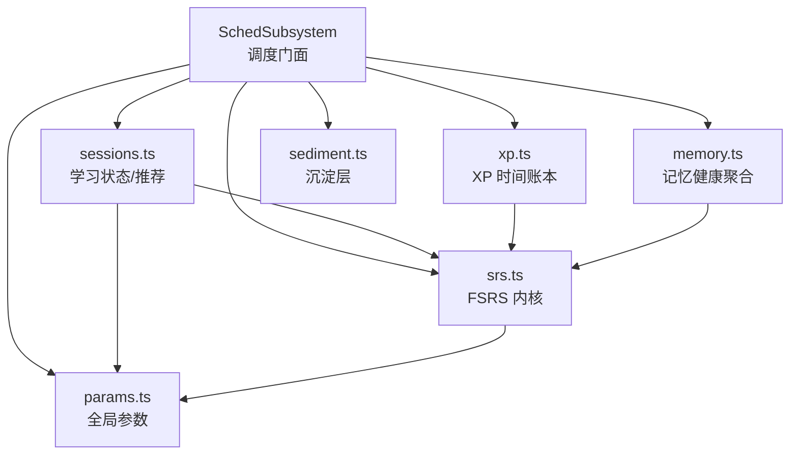
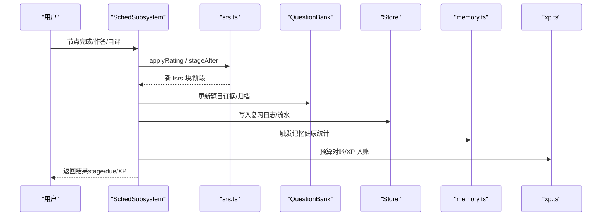
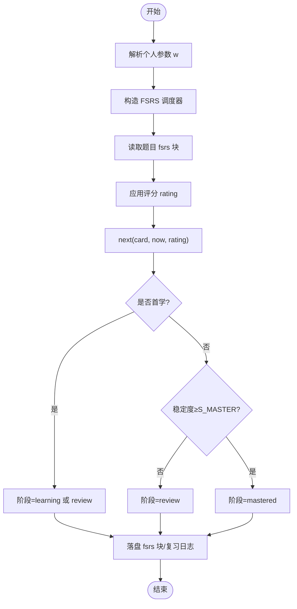
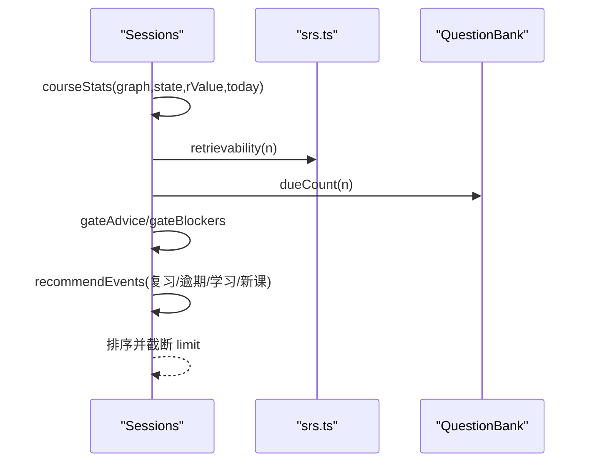
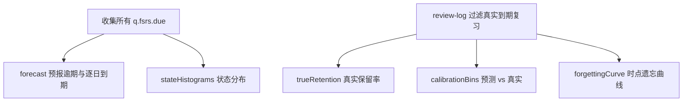
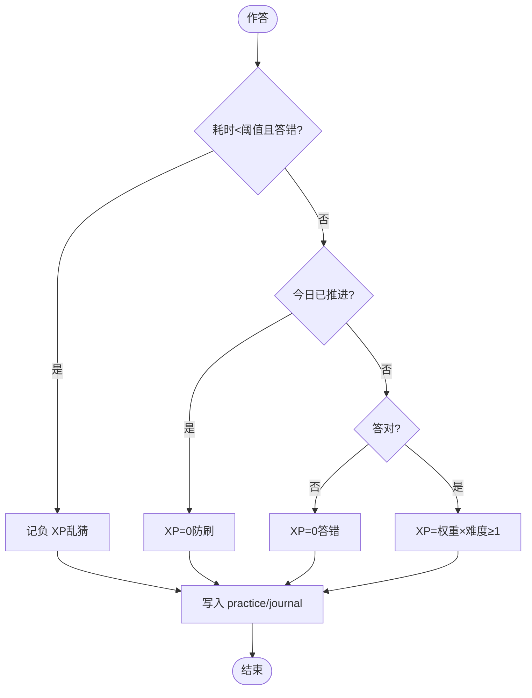
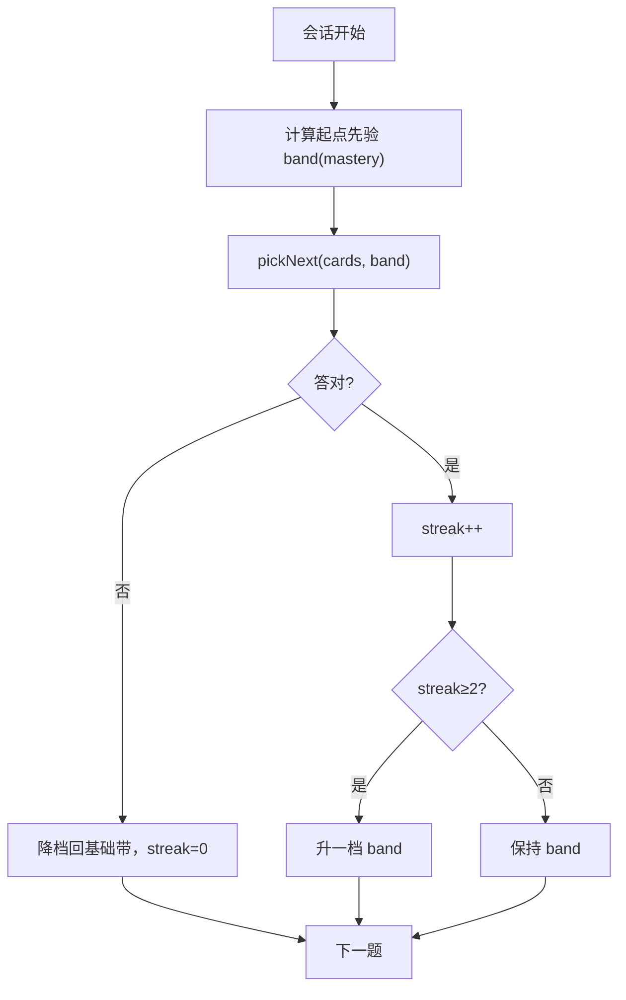
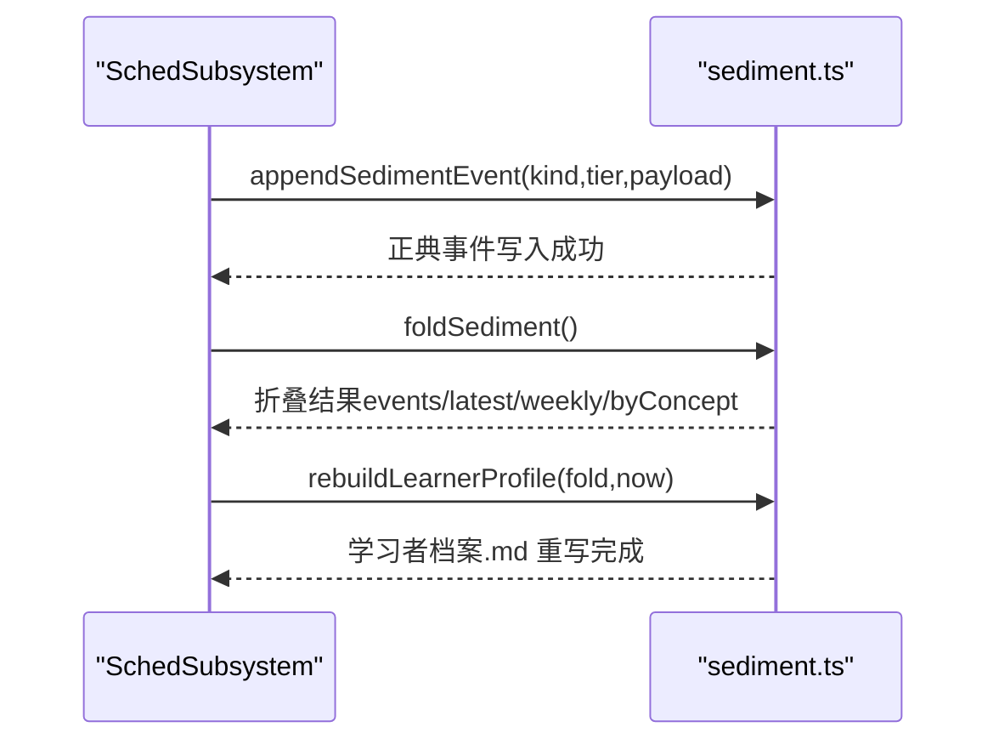
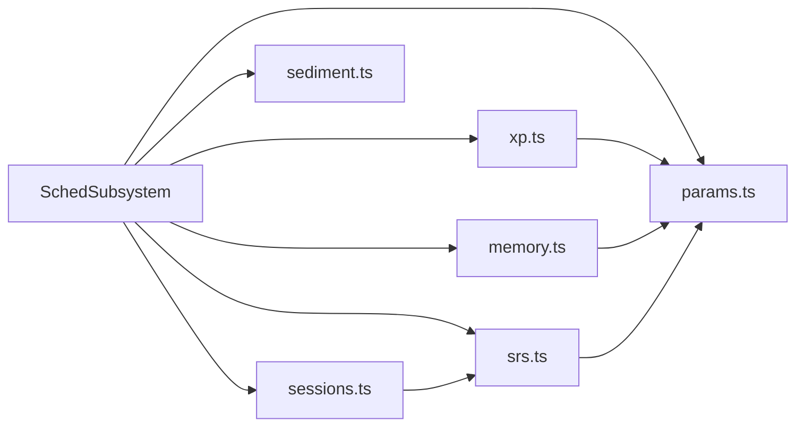

# 学习调度子系统

<cite>
**本文引用的文件**
- [sched-subsystem.ts](file://src/engine/sched-subsystem.ts)
- [srs.ts](file://src/engine/srs.ts)
- [sessions.ts](file://src/engine/sessions.ts)
- [xp.ts](file://src/engine/xp.ts)
- [memory.ts](file://src/engine/memory.ts)
- [params.ts](file://src/engine/params.ts)
- [sediment.ts](file://src/engine/sediment.ts)
- [adaptive.ts](file://src/engine/adaptive.ts)
</cite>

## 目录
1. [简介](#简介)
2. [项目结构](#项目结构)
3. [核心组件](#核心组件)
4. [架构总览](#架构总览)
5. [详细组件分析](#详细组件分析)
6. [依赖关系分析](#依赖关系分析)
7. [性能考量](#性能考量)
8. [故障排查指南](#故障排查指南)
9. [结论](#结论)
10. [附录：使用示例与最佳实践](#附录使用示例与最佳实践)

## 简介
本文件为 LearnHub 学习调度子系统的权威技术文档，聚焦 SchedSubsystem 及其协作模块，系统性阐述以下主题：
- FSRS 间隔重复算法的实现、复习计划生成与掌握度评估
- 学习状态管理、记忆曲线计算与个性化调整机制
- XP 经验值系统、学习进度追踪与能力画像构建
- 学习会话管理、复习任务调度与学习数据分析的实践用法

该子系统以“题目级 FSRS 卡”为核心数据模型，结合课程图结构与题库事实源，提供节点跳过/完成确认、复习队列、记忆健康仪表盘、FSRS 参数优化、沉淀层（学习者档案）等能力。

## 项目结构
学习调度子系统由多个职责清晰的引擎模块组成：
- 调度门面与流程编排：SchedSubsystem（节点跳过/完成、XP 视图、记忆健康、FSRS 参数优化、沉淀层）
- FSRS 内核：srs.ts（参数解析、卡片转换、评分推进、阶段机、可提取性 R、掌握度口径）
- 学习状态与推荐：sessions.ts（就绪集合、软闸建议、struggle 识别、推荐事件、课程学习包）
- XP 时间账本：xp.ts（作答 XP 结算、预算制定价、每日目标、streak、ETA）
- 记忆健康聚合：memory.ts（负载预报、状态分布、真实保留率、预测校准、遗忘曲线）
- 可调参数：params.ts（全局阈值与默认值）
- 沉淀层：sediment.ts（正典事件、折叠、学习者档案投影）
- 自适应难度：adaptive.ts（单节点内流式难度带选择）

图表来源
- [sched-subsystem.ts:83-546](file://src/engine/sched-subsystem.ts#L83-L546)
- [srs.ts:29-183](file://src/engine/srs.ts#L29-L183)
- [sessions.ts:293-641](file://src/engine/sessions.ts#L293-L641)
- [xp.ts:20-183](file://src/engine/xp.ts#L20-L183)
- [memory.ts:17-118](file://src/engine/memory.ts#L17-L118)
- [params.ts:1-59](file://src/engine/params.ts#L1-L59)
- [sediment.ts:59-224](file://src/engine/sediment.ts#L59-L224)

章节来源
- [sched-subsystem.ts:83-546](file://src/engine/sched-subsystem.ts#L83-L546)
- [srs.ts:29-183](file://src/engine/srs.ts#L29-L183)
- [sessions.ts:293-641](file://src/engine/sessions.ts#L293-L641)
- [xp.ts:20-183](file://src/engine/xp.ts#L20-L183)
- [memory.ts:17-118](file://src/engine/memory.ts#L17-L118)
- [params.ts:1-59](file://src/engine/params.ts#L1-L59)
- [sediment.ts:59-224](file://src/engine/sediment.ts#L59-L224)

## 核心组件
- SchedSubsystem：调度域门面，编排节点跳过/完成、XP 视图、记忆健康、FSRS 参数优化、沉淀层读写与学习者档案重建。
- srs.ts：FSRS-6 调度内核，负责参数解析、卡片转换、评分推进、阶段判定、可提取性 R、掌握度口径。
- sessions.ts：学习状态与动态推荐，包括就绪集合、软闸建议、struggle 识别、复习/逾期/新课事件、课程学习包。
- xp.ts：XP 时间账本与预算制定价，包含作答 XP 结算、每日目标、streak、ETA。
- memory.ts：记忆健康四面板聚合（负载预报、状态分布、真实保留率、预测校准、遗忘曲线）。
- sediment.ts：沉淀层正典与折叠，学习者档案投影。
- params.ts：全局可调参数集中表。
- adaptive.ts：单节点内流式难度自适应（A1），用于已调度题的会话选题顺序。

章节来源
- [sched-subsystem.ts:83-546](file://src/engine/sched-subsystem.ts#L83-L546)
- [srs.ts:29-183](file://src/engine/srs.ts#L29-L183)
- [sessions.ts:293-641](file://src/engine/sessions.ts#L293-L641)
- [xp.ts:20-183](file://src/engine/xp.ts#L20-L183)
- [memory.ts:17-118](file://src/engine/memory.ts#L17-L118)
- [sediment.ts:59-224](file://src/engine/sediment.ts#L59-L224)
- [params.ts:1-59](file://src/engine/params.ts#L1-L59)
- [adaptive.ts:17-81](file://src/engine/adaptive.ts#L17-L81)

## 架构总览
学习调度子系统围绕“题目级 FSRS 卡”和“课程图 + 题库事实源”展开，形成如下调用链：
- 用户操作（跳过/完成/作答/自评）→ SchedSubsystem → srs.ts（FSRS 推进）→ store/bank（持久化）
- 复习/新课推荐 → sessions.ts → srs.ts（R 计算）+ bank（到期题聚合）
- 记忆健康 → memory.ts 聚合 review-log 与题库快照
- XP 账本 → xp.ts 基于 practice/journal 派生 streak/ETA
- 参数优化 → sched-subsystem.optimizeFsrsParams → sediment.ts 写正典并重建学习者档案

图表来源
- [sched-subsystem.ts:124-270](file://src/engine/sched-subsystem.ts#L124-L270)
- [srs.ts:107-154](file://src/engine/srs.ts#L107-L154)
- [memory.ts:60-118](file://src/engine/memory.ts#L60-L118)
- [xp.ts:20-34](file://src/engine/xp.ts#L20-L34)

## 详细组件分析

### FSRS 间隔重复与复习计划
- 参数解析：resolveFsrsParams 统一从沉淀正典→课程缓存→默认参数获取 w；getScheduler 构造日粒度、无 fuzz、关闭短期步的 FSRS 实例。
- 卡片转换：cardFromFm/fmFromCard 实现 frontmatter fsrs 块与 ts-fsrs Card 的双向转换。
- 评分推进：applyRatingBlock/applyRating 将评分映射到 Rating，计算 elapsed_days，更新稳定性/难度/到期日，维护 reps/lapses。
- 阶段机：stageAfter 根据首次学习/稳定度阈值决定 review/learning/mastered。
- 可提取性：retrievability/retrievabilityBlock 按当前日期计算 R，供推荐与软闸使用。
- 掌握度：masteryValue/masteryOfFm 综合稳定度与练习证据，作为展示与排序依据。

图表来源
- [srs.ts:29-61](file://src/engine/srs.ts#L29-L61)
- [srs.ts:63-154](file://src/engine/srs.ts#L63-L154)
- [srs.ts:135-141](file://src/engine/srs.ts#L135-L141)
- [params.ts:4-17](file://src/engine/params.ts#L4-L17)

章节来源
- [srs.ts:29-183](file://src/engine/srs.ts#L29-L183)
- [params.ts:4-17](file://src/engine/params.ts#L4-L17)

### 学习状态管理与推荐
- 就绪集合：readySet 过滤未开始且非 opt 前置达标节点；gateBlockers 输出被 R_gate 拦下的候选及弱前置。
- 软闸建议：gateAdvice 将弱前置投影为可执行复习项（含到期题数与直达入口）。
- 推荐事件：recommendEvents 汇总复习/逾期/学习中/新课事件，叠加 struggle 提示与睡眠耦合建议。
- 课程学习包：lesson 返回分节正文、前置、下一步建议（剔除终点）。

图表来源
- [sessions.ts:50-87](file://src/engine/sessions.ts#L50-L87)
- [sessions.ts:198-287](file://src/engine/sessions.ts#L198-L287)
- [sessions.ts:361-571](file://src/engine/sessions.ts#L361-L571)
- [sessions.ts:609-641](file://src/engine/sessions.ts#L609-L641)

章节来源
- [sessions.ts:50-87](file://src/engine/sessions.ts#L50-L87)
- [sessions.ts:198-287](file://src/engine/sessions.ts#L198-L287)
- [sessions.ts:361-571](file://src/engine/sessions.ts#L361-L571)
- [sessions.ts:609-641](file://src/engine/sessions.ts#L609-L641)

### 记忆曲线计算与健康仪表盘
- 负载预报：forecast 统计逾期存量与未来 N 天逐日到期量。
- 状态分布：stateHistograms 对 stability/difficulty/retrievability 做分桶直方图。
- 真实保留率：dueReviewFirstPushes 过滤真实到期复习（排除 synthetic/首学推进），trueRetention 计算通过率。
- 预测校准：calibrationBins 按 r_pred 分箱对照实际通过率。
- 遗忘曲线：forgettingCurve 按时点间隔分桶统计保留率下降。

图表来源
- [memory.ts:17-34](file://src/engine/memory.ts#L17-L34)
- [memory.ts:36-58](file://src/engine/memory.ts#L36-L58)
- [memory.ts:60-92](file://src/engine/memory.ts#L60-L92)
- [memory.ts:94-118](file://src/engine/memory.ts#L94-L118)

章节来源
- [memory.ts:17-118](file://src/engine/memory.ts#L17-L118)

### XP 经验值系统与学习进度追踪
- 作答 XP：xpForAnswer 根据题型权重×难度、乱猜惩罚、重复作答守卫计算 XP。
- 预算制定价：nominalBudget 计算标称 N₀（est 优先，回落题目权重和），difficultyCalibration 用 FSRS difficulty 加权得到 k；完成时 settle 对账锁定定价。
- 每日目标与 streak：read/writeDailyGoal、streakFrom 宽容口径（连续漏天 ≤ graceDays 不断链）。
- ETA：etaDays = 剩余预算 ÷ 每日目标；perNodeXp 历史估算。

图表来源
- [xp.ts:20-34](file://src/engine/xp.ts#L20-L34)
- [xp.ts:45-79](file://src/engine/xp.ts#L45-L79)
- [xp.ts:85-120](file://src/engine/xp.ts#L85-L120)
- [xp.ts:122-183](file://src/engine/xp.ts#L122-L183)

章节来源
- [xp.ts:20-183](file://src/engine/xp.ts#L20-L183)

### 个性化调整机制
- 节点内自适应难度（A1）：combinedDifficulty 合成静态难度与 FSRS 难度；startBand 以 mastery 为起点先验；nextBand 连对升档、错忘降档；sessionOrder/pickNext 驱动会话选题顺序。
- 软闸建议：R_gate 拦截的新课候选附带弱前置复习建议，引导回补成分技能。
- 睡眠耦合：D-4 在推荐中附加「睡前练、醒后验」时段建议（读侧信息，不改调度）。

图表来源
- [adaptive.ts:17-81](file://src/engine/adaptive.ts#L17-L81)
- [sessions.ts:391-453](file://src/engine/sessions.ts#L391-L453)

章节来源
- [adaptive.ts:17-81](file://src/engine/adaptive.ts#L17-L81)
- [sessions.ts:391-453](file://src/engine/sessions.ts#L391-L453)

### 沉淀层与学习者档案
- 正典追加：appendSedimentEvent 出生即写，支持 immediate/weekly 分档。
- 折叠消费：foldSediment 稳定排序、计数、latest 最新态、weekly 按周分组、byConcept 概念索引。
- 学习者档案：renderLearnerProfile/rebuildLearnerProfile 生成可读投影，每次结算重建。

图表来源
- [sched-subsystem.ts:368-449](file://src/engine/sched-subsystem.ts#L368-L449)
- [sediment.ts:59-171](file://src/engine/sediment.ts#L59-L171)
- [sediment.ts:201-224](file://src/engine/sediment.ts#L201-L224)

章节来源
- [sched-subsystem.ts:368-449](file://src/engine/sched-subsystem.ts#L368-L449)
- [sediment.ts:59-224](file://src/engine/sediment.ts#L59-L224)

## 依赖关系分析
- SchedSubsystem 依赖 srs.ts（FSRS 内核）、sessions.ts（状态与推荐）、xp.ts（XP 与预算）、memory.ts（健康聚合）、sediment.ts（正典与档案）、params.ts（全局参数）。
- sessions.ts 依赖 srs.ts（R 计算/阶段机）与 params.ts（R_GATE 等）。
- xp.ts 依赖 params.ts（XP_BASE、阈值）与 dates/io 工具。
- memory.ts 依赖 types.ts（ReviewRec）与 dates 工具。
- srs.ts 依赖 ts-fsrs 库与 params.ts（DESIRED_RETENTION、S_MASTER）。

图表来源
- [sched-subsystem.ts:83-546](file://src/engine/sched-subsystem.ts#L83-L546)
- [srs.ts:29-183](file://src/engine/srs.ts#L29-L183)
- [sessions.ts:293-641](file://src/engine/sessions.ts#L293-L641)
- [xp.ts:20-183](file://src/engine/xp.ts#L20-L183)
- [memory.ts:17-118](file://src/engine/memory.ts#L17-L118)
- [sediment.ts:59-224](file://src/engine/sediment.ts#L59-L224)
- [params.ts:1-59](file://src/engine/params.ts#L1-L59)

章节来源
- [sched-subsystem.ts:83-546](file://src/engine/sched-subsystem.ts#L83-L546)
- [srs.ts:29-183](file://src/engine/srs.ts#L29-L183)
- [sessions.ts:293-641](file://src/engine/sessions.ts#L293-L641)
- [xp.ts:20-183](file://src/engine/xp.ts#L20-L183)
- [memory.ts:17-118](file://src/engine/memory.ts#L17-L118)
- [sediment.ts:59-224](file://src/engine/sediment.ts#L59-L224)
- [params.ts:1-59](file://src/engine/params.ts#L1-L59)

## 性能考量
- 日粒度调度：启用短学期关闭与 fuzz，减少频繁重排与抖动，提升稳定性与可解释性。
- 批量聚合：memory.ts 的 forecast/stateHistograms/trueRetention 采用单次遍历与 Map 聚合，避免重复扫描。
- 幂等与去重：dueReviewFirstPushes 按“课程/节点/题目/学习日”去重，确保保留率统计不夸大。
- 预算对账：nodeComplete 的 XP 预算一次性结算，避免重复定价与漂移。
- 参数优化门禁：optimizeFsrsParams 要求 ≥400 条真实复习日志，防止过拟合与无效训练。

[本节为通用性能指导，无需特定文件引用]

## 故障排查指南
- Broken 笔记阻断：assertNoBrokenNotes 在 status/recommend 前检查必需笔记完整性，出现损坏会 fail loud，需修复笔记后再继续。
- 正确率门槛：nodeComplete 在未满足及格线时拒绝推进 stage 并给出原因，建议先复习前置概念。
- 参数优化失败：若训练后 logLoss 未优于基线，将跳过写回并返回原因；检查数据量与基线来源。
- 日界配置错误：writeDayCutoff 对非法 'HH:mm' 抛错，需修正配置。
- 沉淀层校验：appendSedimentEvent 对 kind/tier/payload/concept 进行严格校验，非法输入会抛出错误。

章节来源
- [sessions.ts:36-40](file://src/engine/sessions.ts#L36-L40)
- [sched-subsystem.ts:155-160](file://src/engine/sched-subsystem.ts#L155-L160)
- [sched-subsystem.ts:378-411](file://src/engine/sched-subsystem.ts#L378-L411)
- [xp.ts:112-120](file://src/engine/xp.ts#L112-L120)
- [sediment.ts:59-84](file://src/engine/sediment.ts#L59-L84)

## 结论
学习调度子系统以 FSRS 为核心，结合课程图与题库事实源，实现了从节点状态管理、复习计划生成、掌握度评估到 XP 账本与记忆健康的全链路能力。通过沉淀层保证模型状态的连续性，通过预算制与对账机制保障学习进度的诚实度量。推荐与自适应难度进一步提升了学习效率与体验。

[本节为总结性内容，无需特定文件引用]

## 附录：使用示例与最佳实践
- 学习会话管理
  - 节点完成：调用 nodeComplete 初始化复习卡、写入阶段、生成 T1/T2 队列、进行 XP 预算对账。参考路径：[sched-subsystem.ts:124-270](file://src/engine/sched-subsystem.ts#L124-L270)
  - 节点跳过：调用 nodeSkip 将节点置为 skipped 并归档题库，取消跳过需显式恢复。参考路径：[sched-subsystem.ts:93-121](file://src/engine/sched-subsystem.ts#L93-L121)
- 复习任务调度
  - 复习/逾期推荐：调用 Sessions.recommendEvents 获取复习与逾期事件，结合 dueCount 与 R 值进行排序。参考路径：[sessions.ts:361-571](file://src/engine/sessions.ts#L361-L571)
  - 软闸建议：当 R_gate 拦截时，使用 gateAdvice 获取弱前置复习项。参考路径：[sessions.ts:198-209](file://src/engine/sessions.ts#L198-L209)
- 学习数据分析
  - 记忆健康：调用 memoryHealth 获取负载预报、状态分布、真实保留率、预测校准与遗忘曲线。参考路径：[sched-subsystem.ts:323-359](file://src/engine/sched-subsystem.ts#L323-L359)
  - XP 视图：调用 xpStatus 获取今日 XP、streak、每日目标与每课程 ETA。参考路径：[sched-subsystem.ts:272-309](file://src/engine/sched-subsystem.ts#L272-L309)
- 最佳实践
  - 保持数据诚实：仅真实到期复习计入保留率，synthetic 与首学推进不参与统计。参考路径：[memory.ts:60-92](file://src/engine/memory.ts#L60-L92)
  - 合理设置每日目标：read/writeDailyGoal 控制每日 XP 目标，streak 宽容口径避免误伤。参考路径：[xp.ts:85-120](file://src/engine/xp.ts#L85-L120)
  - 参数优化谨慎启用：确保 ≥400 条真实复习日志，比较 logLoss 决定是否写回。参考路径：[sched-subsystem.ts:368-449](file://src/engine/sched-subsystem.ts#L368-L449)

[本节为实践指导，无需特定文件引用]