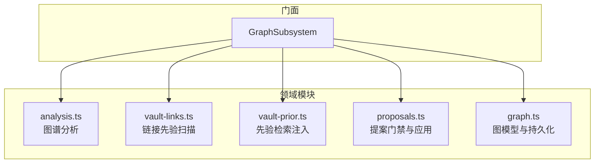
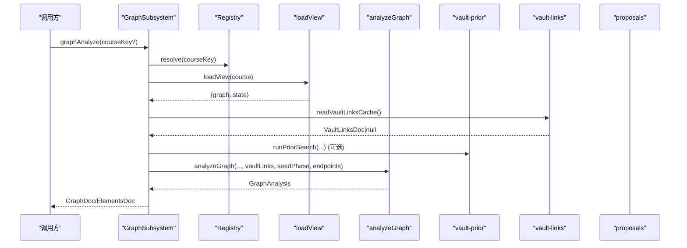
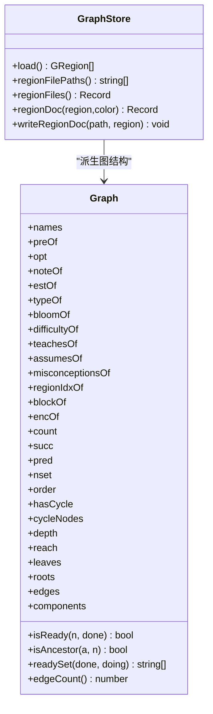
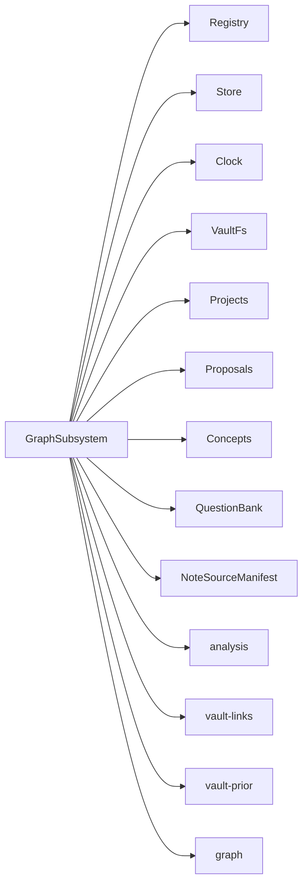

# 知识图谱子系统

<cite>
**本文引用的文件**   
- [graph-subsystem.ts](file://src/engine/graph-subsystem.ts)
- [graph.ts](file://src/engine/graph.ts)
- [analysis.ts](file://src/engine/analysis.ts)
- [vault-prior.ts](file://src/engine/vault-prior.ts)
- [vault-links.ts](file://src/engine/vault-links.ts)
- [proposals.ts](file://src/engine/proposals.ts)
</cite>

## 目录
1. [简介](#简介)
2. [项目结构](#项目结构)
3. [核心组件](#核心组件)
4. [架构总览](#架构总览)
5. [详细组件分析](#详细组件分析)
6. [依赖关系分析](#依赖关系分析)
7. [性能考量](#性能考量)
8. [故障排查指南](#故障排查指南)
9. [结论](#结论)
10. [附录：调用示例与路径](#附录调用示例与路径)

## 简介
本文件系统性地梳理 LearnHub 的知识图谱子系统，围绕 GraphSubsystem 的核心职责展开：图谱分析、Vault 链接先验处理、节点探索、提案门禁包装与覆盖层回填。文档同时解释图谱数据结构（Graph）、节点关系管理、版本控制与提案机制，并说明 Vault 链接扫描与分析流程，展示如何从个人笔记中提取关联关系并映射到课程图。最后提供具体代码片段路径，用于演示图谱分析方法、路径查询、节点浏览等核心功能的调用方式。

## 项目结构
知识图谱子系统位于 engine 域，以 GraphSubsystem 为门面入口，聚合以下关键能力：
- 图谱分析与可视化元素构建（analysis）
- Vault 链接先验扫描与评分（vault-links）
- Vault 先验检索注入（vault-prior）
- 提案受理与应用（proposals）
- 图模型与持久化（graph）

图表来源
- [graph-subsystem.ts:88-117](file://src/engine/graph-subsystem.ts#L88-L117)
- [analysis.ts:87-200](file://src/engine/analysis.ts#L87-L200)
- [vault-links.ts:1-200](file://src/engine/vault-links.ts#L1-L200)
- [vault-prior.ts:185-195](file://src/engine/vault-prior.ts#L185-L195)
- [proposals.ts:559-605](file://src/engine/proposals.ts#L559-L605)
- [graph.ts:198-443](file://src/engine/graph.ts#L198-L443)

章节来源
- [graph-subsystem.ts:1-78](file://src/engine/graph-subsystem.ts#L1-L78)

## 核心组件
- GraphSubsystem：统一门面，封装图谱分析、Vault 链接先验、节点探索、提案门禁包装、enc 覆盖层回填等能力。
- Graph：概念图模型与派生结构（邻接表、拓扑序、深度、可达集、传递约简边、连通分量、就绪判定）。
- analysis：图谱分析，输出统计、不可达节点、瓶颈、逾期热点、健康分、建议项与渲染元素。
- vault-links：Vault 链接先验扫描、去噪、置信度打分、分层与缓存。
- vault-prior：基于 BM25 式打分的 Vault 先验检索，支持概念登记表扩展与审计。
- proposals：提案生命周期（schema 校验、结构检查、受理、应用、拒绝），含 edit/seed/enrich 三类。

章节来源
- [graph-subsystem.ts:78-649](file://src/engine/graph-subsystem.ts#L78-L649)
- [graph.ts:198-443](file://src/engine/graph.ts#L198-L443)
- [analysis.ts:87-200](file://src/engine/analysis.ts#L87-L200)
- [vault-links.ts:1-200](file://src/engine/vault-links.ts#L1-L200)
- [vault-prior.ts:185-195](file://src/engine/vault-prior.ts#L185-L195)
- [proposals.ts:559-605](file://src/engine/proposals.ts#L559-L605)

## 架构总览
GraphSubsystem 作为门面，协调各子模块完成图谱相关任务：
- 图谱分析：加载课程视图 → 读取 Vault 链接先验 → 计算分析结果 → 标注交汇节点与终点信息。
- Vault 链接先验：扫描全库 .md → 解析 wikilink → 过滤噪声 → 打分分层 → 落盘缓存 → 供 analyze 与 backfill 使用。
- 节点探索：按区/块浏览、单节点详情、前置路径查询。
- 提案门禁：edit/seed/enrich 的 schema 校验、结构检查、终点锚保护、巩固门、生长闸门；apply 时审计门禁与写入单元。
- 覆盖层回填：基于 Ready 内容与题目 invokes 投影，批量生成 enrich 提案。

图表来源
- [graph-subsystem.ts:88-117](file://src/engine/graph-subsystem.ts#L88-L117)
- [analysis.ts:87-200](file://src/engine/analysis.ts#L87-L200)
- [vault-links.ts:158-195](file://src/engine/vault-links.ts#L158-L195)
- [vault-prior.ts:185-195](file://src/engine/vault-prior.ts#L185-L195)

## 详细组件分析

### GraphSubsystem 门面
- 职责
  - 图谱分析：graphAnalyze，整合课程视图、Vault 链接先验、种子阶段与终点标记。
  - Vault 链接先验：vaultLinksScan 扫描全库 wikilink，scoreTier 分层，写缓存；loadVaultLinkPrior 映射到本课程图。
  - 节点探索：graphNode（单节点详情+前置闭包）、graphBrowse（按区/块浏览）、graphPath（from→to 是否前置及链）。
  - 提案门禁包装：graphPropose/graphApply/graphReject，统一受理与应用的 kind 路由与审计门禁。
  - 覆盖层回填：graphEncBackfill，基于 Ready 内容与 invokes 投影生成 enrich 提案。
  - 种子起草：seedPropose，结合 Vault 先验与锚定方向，产出种子提案。
- 关键交互
  - 通过 GraphDeps 注入时钟、存储、路径、项目、提案、概念登记、题库、笔记清单等端口。
  - 对 proposals 进行 gate 包装，确保 apply 前审计通过。

章节来源
- [graph-subsystem.ts:78-649](file://src/engine/graph-subsystem.ts#L78-L649)

### 图谱数据结构 Graph
- 结构与派生
  - names/preOf/opt/noteOf/estOf/typeOf/bloomOf/difficultyOf/teachesOf/assumesOf/misconceptionsOf/regionIdxOf/blockOf/encOf/count/succ/pred/nset/order/hasCycle/cycleNodes/depth/reach/leaves/roots/edges/components。
  - 构造时建立邻接表、拓扑序（Kahn）、环检测、深度、可达集、传递约简边、连通分量。
  - 工具方法：isReady/isAncestor/readySet/edgeCount。
- 持久化
  - GraphStore 负责 data/*.yaml 的加载、序列化、原子写入；parseNode/loadRegionDoc 严格 schema。
  - structureCheck 合并结构检查（重名/断边/环）。

图表来源
- [graph.ts:198-443](file://src/engine/graph.ts#L198-L443)
- [graph.ts:198-276](file://src/engine/graph.ts#L198-L276)

章节来源
- [graph.ts:198-443](file://src/engine/graph.ts#L198-L443)

### 图谱分析 analysis
- 输出
  - stats（节点/边/根/叶/最大深度/连通分量/是否有环）
  - unreachable（不可达节点）
  - bottlenecks（高扇出枢纽）
  - lapse_hotspots（逾期热点）
  - health（健康分与分解）
  - suggestions（expand_blocks/missing_pre/unconverged/jump_candidates/merge_blocks/vault_link_candidates）
  - nodes/edges（渲染元素）
  - schema（节点字段全量）
- 关键点
  - 结合 effectiveStage、masteryOfFm、hasReadyContent 计算节点状态。
  - 将 Vault 链接先验候选纳入 suggestions.vault_link_candidates。
  - 种子图豁免 missing_pre 与健康阈值。

章节来源
- [analysis.ts:87-200](file://src/engine/analysis.ts#L87-L200)

### Vault 链接先验 vault-links
- 流程
  - 扫描排除区 → 正则解析 wikilink → 噪声过滤（嵌入/非 md/日期目标/自引用/歧义 basename）→ 置信度打分 → 分层（proposal/review/report）→ 写缓存。
- 打分与分层
  - linkScore(count, files, bidirectional) ∈ [0,1]
  - scoreTier(w) 分层：≥0.7 提案、0.4–0.7 待裁决、<0.4 仅报告。
- 映射
  - mapEdgesToNodes 将边映射到课程图节点名集合，供 analyze 与 backfill 使用。

章节来源
- [vault-links.ts:1-200](file://src/engine/vault-links.ts#L1-L200)
- [vault-links.ts:158-195](file://src/engine/vault-links.ts#L158-L195)

### Vault 先验检索 vault-prior
- 功能
  - priorTerms 分词、expandPriorTerms 概念登记表扩展（别名/易混概念低权重）。
  - searchVaultPrior BM25 式打分（IDF × 词频饱和 × 长度归一 + 标题加权），mtime 优先截断。
  - priorSection 生成提示词注入段（尊重已有理解与记法，只读）。
- 审计
  - 返回 audit（terms/expanded/scanned/matched/scanTruncated/hitsTrimmed/zeroHit/hitPaths）。

章节来源
- [vault-prior.ts:185-195](file://src/engine/vault-prior.ts#L185-L195)
- [vault-prior.ts:232-360](file://src/engine/vault-prior.ts#L232-L360)

### 提案机制 proposals
- 类型
  - edit：增删改节点/边、移动/改名、设置 note/enc 等。
  - seed：种子草案（起点/终点/工作表），经 gateRepairRound 修复后 proposeSeed。
  - enrich：覆盖层回填（enc 补边），指纹锚定正典版本。
- 门禁
  - schema 校验、结构检查（断边/环/冲突）、概念引用对表、终点锚保护、巩固门、生长闸门。
  - apply 审计门禁（ERROR 拒绝），写入单元顺序（铸名→图重写→锚 sealed→笔记联动→罗盘批内重写→边实验账本→快照→journal→提案 applied）。

章节来源
- [proposals.ts:559-605](file://src/engine/proposals.ts#L559-L605)
- [proposals.ts:686-800](file://src/engine/proposals.ts#L686-L800)

## 依赖关系分析
- GraphSubsystem 依赖：
  - registry/paths/store/clock/fs/projects/proposals/concepts/registry/bank/noteManifest 等端口。
  - 内部模块：analysis、audit、content、prompt-assembly、graph、notes、project-decompile、seed、sessions、srs、vault-links、vault-prior、views。
- 耦合与内聚
  - GraphSubsystem 作为门面集中编排，降低上层耦合；各子模块职责清晰、接口稳定。
  - 通过 GraphDeps 注入外部依赖，便于测试与替换。
- 外部依赖
  - VaultFs 抽象文件系统；Store 持久化；Clock 时间；ConceptRegistry 概念登记；QuestionBank 题库；NoteSourceManifest 笔记清单。

图表来源
- [graph-subsystem.ts:14-77](file://src/engine/graph-subsystem.ts#L14-L77)

章节来源
- [graph-subsystem.ts:14-77](file://src/engine/graph-subsystem.ts#L14-L77)

## 性能考量
- Vault 链接扫描
  - maxFiles 限制扫描面，避免超大 vault 拖垮；收集窗口倍数 MTIME_WINDOW_FACTOR 保证 mtime 优先在合理范围内生效。
  - 去噪规则减少无效边，linkScore 饱和函数避免长尾放大。
- 先验检索
  - BM25 参数 k1=1.2、b=0.75 为文献默认值，未调参；标题字段加权提升命中质量。
  - 概念登记表扩展提高召回，但低权重避免同义断言偏差。
- 图谱分析
  - 不可达 BFS、瓶颈/热点聚合、健康分计算均为线性或近似线性复杂度。
  - 传递约简边减少渲染边数，提升 UI 性能。

[本节为通用性能讨论，不直接分析具体文件]

## 故障排查指南
- 图谱分析异常
  - 检查种子图阶段与终点标记是否正确；确认 anchors 与 graph 一致。
  - 若 suggestions 中 missing_pre 过多，考虑扩展浅块或补齐空降节点。
- Vault 链接先验
  - 若 scanned_at=null，需先执行 vaultLinksScan；审计字段 truncated/zeroHit 指示扫描与命中情况。
  - 若 blocked_no_pre 较多，说明候选边不在 pre 闭包内，需人工裁决或调整 pre。
- 提案门禁
  - 受理失败常见原因：schema 错误、结构检查失败（断边/环）、概念引用对表失败、终点锚保护、巩固门、生长闸门。
  - apply 失败：审计存在 ERROR 会拒绝写入；请处理审计报告后再重试。
- 覆盖层回填
  - 若无变更，返回 ops=0；若有变更，生成 pending enrich 提案，过审后 apply 生效。

章节来源
- [graph-subsystem.ts:158-195](file://src/engine/graph-subsystem.ts#L158-L195)
- [graph-subsystem.ts:198-265](file://src/engine/graph-subsystem.ts#L198-L265)
- [proposals.ts:559-605](file://src/engine/proposals.ts#L559-L605)
- [proposals.ts:686-800](file://src/engine/proposals.ts#L686-L800)

## 结论
GraphSubsystem 以门面模式组织知识图谱子系统，将图谱分析、Vault 链接先验、节点探索、提案门禁与覆盖层回填有机整合。Graph 提供稳定的图模型与持久化能力；analysis 提供可操作的洞察与建议；vault-links 与 vault-prior 将学习者个人笔记转化为图谱先验；proposals 保障变更的安全性与可追溯性。该设计在保证可扩展性的同时，兼顾了性能与可观测性。

[本节为总结性内容，不直接分析具体文件]

## 附录：调用示例与路径
以下为各核心功能的调用入口与关键实现位置，便于快速定位与参考：

- 图谱分析
  - 入口：graphAnalyze
  - 实现路径：[graph-subsystem.ts:88-117](file://src/engine/graph-subsystem.ts#L88-L117)
  - 分析核心：[analysis.ts:87-200](file://src/engine/analysis.ts#L87-L200)

- Vault 链接扫描
  - 入口：vaultLinksScan
  - 实现路径：[graph-subsystem.ts:158-195](file://src/engine/graph-subsystem.ts#L158-L195)
  - 扫描与打分：[vault-links.ts:158-195](file://src/engine/vault-links.ts#L158-L195)

- Vault 先验检索注入
  - 入口：runPriorSearch（由 seedPropose 等调用）
  - 实现路径：[vault-prior.ts:185-195](file://src/engine/vault-prior.ts#L185-L195)
  - 搜索实现：[vault-prior.ts:232-360](file://src/engine/vault-prior.ts#L232-L360)

- 节点探索
  - 单节点详情：graphNode
    - 实现路径：[graph-subsystem.ts:268-311](file://src/engine/graph-subsystem.ts#L268-L311)
  - 区/块浏览：graphBrowse
    - 实现路径：[graph-subsystem.ts:315-372](file://src/engine/graph-subsystem.ts#L315-L372)
  - 前置路径查询：graphPath
    - 实现路径：[graph-subsystem.ts:376-404](file://src/engine/graph-subsystem.ts#L376-L404)

- 提案门禁与应用
  - 提议：graphPropose
    - 实现路径：[graph-subsystem.ts:406-412](file://src/engine/graph-subsystem.ts#L406-L412)
  - 应用：graphApply
    - 实现路径：[graph-subsystem.ts:415-429](file://src/engine/graph-subsystem.ts#L415-L429)
  - 编辑提案受理：proposeEdit
    - 实现路径：[proposals.ts:559-605](file://src/engine/proposals.ts#L559-L605)
  - 编辑提案应用：applyEdit
    - 实现路径：[proposals.ts:686-800](file://src/engine/proposals.ts#L686-L800)

- 覆盖层回填
  - 入口：graphEncBackfill
  - 实现路径：[graph-subsystem.ts:568-616](file://src/engine/graph-subsystem.ts#L568-L616)

- 种子起草
  - 入口：seedPropose
  - 实现路径：[graph-subsystem.ts:445-524](file://src/engine/graph-subsystem.ts#L445-L524)