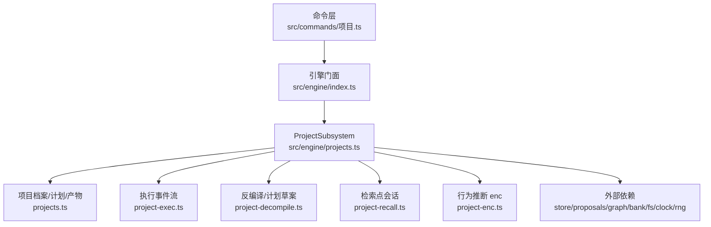
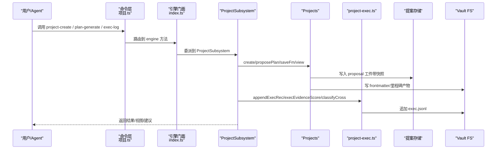
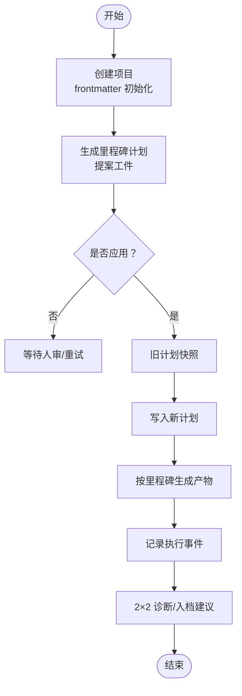
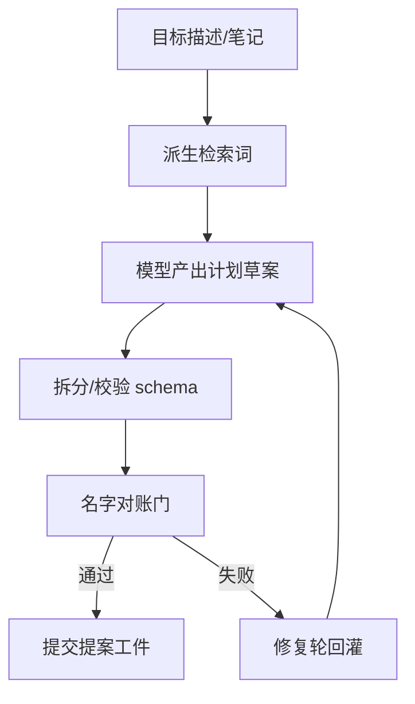
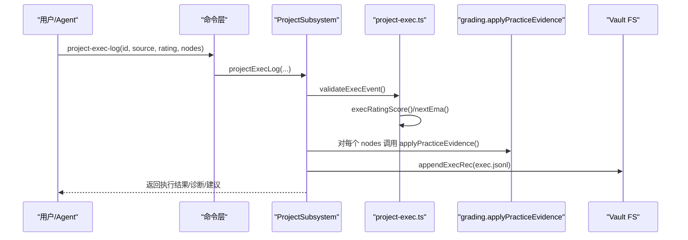
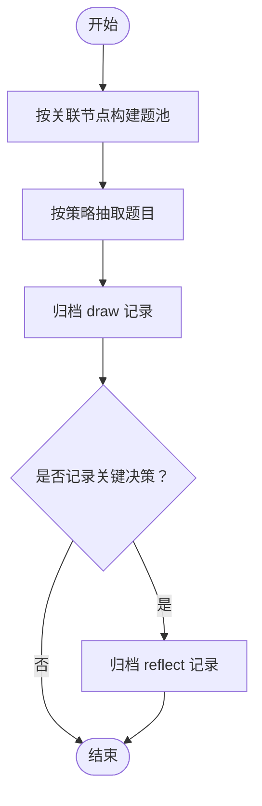
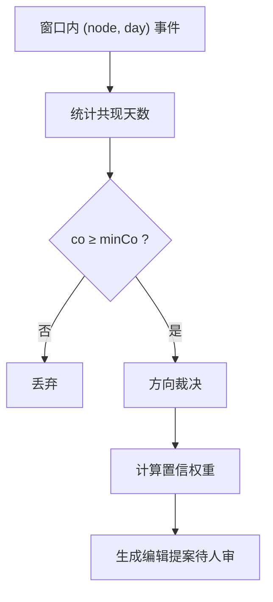
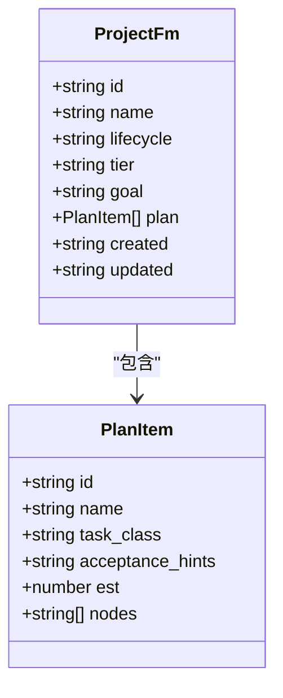
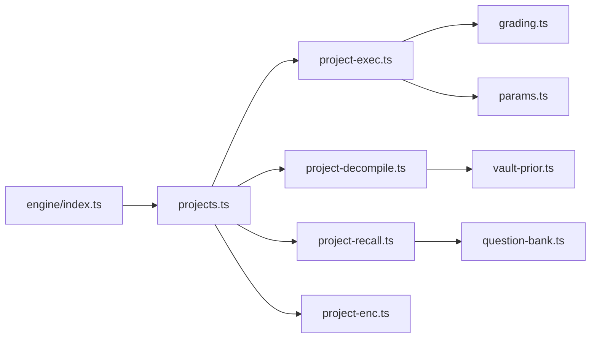

# 项目管理子系统

<cite>
**本文引用的文件**
- [src/engine/index.ts](file://src/engine/index.ts)
- [src/commands/项目.ts](file://src/commands/项目.ts)
- [src/engine/projects.ts](file://src/engine/projects.ts)
- [src/engine/project-decompile.ts](file://src/engine/project-decompile.ts)
- [src/engine/project-exec.ts](file://src/engine/project-exec.ts)
- [src/engine/project-recall.ts](file://src/engine/project-recall.ts)
- [src/engine/project-enc.ts](file://src/engine/project-enc.ts)
- [docs/design/2026-09-project-artifact-design.md](file://docs/design/2026-09-project-artifact-design.md)
- [docs/adr/0015-project-first-class-sister-entity.md](file://docs/adr/0015-project-first-class-sister-entity.md)
- [CONTEXT.md](file://CONTEXT.md)
</cite>

## 目录
1. [简介](#简介)
2. [项目结构](#项目结构)
3. [核心组件](#核心组件)
4. [架构总览](#架构总览)
5. [详细组件分析](#详细组件分析)
6. [依赖关系分析](#依赖关系分析)
7. [性能考量](#性能考量)
8. [故障排查指南](#故障排查指南)
9. [结论](#结论)
10. [附录：端到端操作示例（以路径引用代替代码）](#附录：端到端操作示例以路径引用代替代码)

## 简介
本文件系统性地说明 LearnHub 的“项目管理子系统”，围绕 ProjectSubsystem 的核心职责展开：项目生命周期管理、里程碑计划与产物、执行事件流、Mastery 交叉诊断、行为推断 enc 候选边、检索点会话，以及与课程图、题库、提案通道、日志流水的集成。文档同时覆盖项目结构定义、配置管理（frontmatter/参数）、版本控制（提案快照），并给出从创建到执行的完整流程指引（以源码路径引用替代具体代码片段）。

## 项目结构
- 命令层：在 src/commands/项目.ts 中声明项目域所有对外能力（创建、反编译、计划生成、里程碑产物、执行记录、生命周期、层级等），并通过 engine 映射到子系统方法。
- 子系统门面：LearnhubEngine 在 src/engine/index.ts 中装配 ProjectSubsystem，注入 store、paths、registry、bank、projects、noteManifest、concepts、vaultRoot、rng、clock、fs、learningDay 等端口。
- 领域实现：
  - projects.ts：项目工作区、frontmatter、计划与产物、提案通道、视图、里程碑门控、日志等。
  - project-decompile.ts：目标反编译（计划草案 + 名字对账门 + 修复轮提示词）。
  - project-exec.ts：执行事件流、评分映射、2×2 诊断、入档推荐。
  - project-recall.ts：里程碑检索点抽题与回忆自述流水。
  - project-enc.ts：基于共现的行为推断 enc 候选边与方向裁决。
- 设计依据：docs/design/2026-09-project-artifact-design.md 与 docs/adr/0015-project-first-class-sister-entity.md 提供概念边界与契约。

**图示来源**
- [src/engine/index.ts:294-298](file://src/engine/index.ts#L294-L298)
- [src/commands/项目.ts:26-44](file://src/commands/项目.ts#L26-L44)

**章节来源**
- [src/engine/index.ts:149-184](file://src/engine/index.ts#L149-L184)
- [src/commands/项目.ts:26-44](file://src/commands/项目.ts#L26-L44)

## 核心组件
- ProjectSubsystem（工程装配于 LearnhubEngine.project）：统一编排项目域能力，协调 Projects、提案存储、课程图、题库、笔记源、FSRS/srs、随机/时钟、Vault FS 等。
- Projects：项目工作区与 frontmatter 管理、计划与产物、提案申请与落地、视图聚合、里程碑门控、日志读写。
- project-exec：执行事件追加、评分映射、2×2 诊断、入档推荐、enc 边行使观测。
- project-decompile：目标反编译为计划草案，包含名字对账门与修复轮回灌。
- project-recall：按关联节点池抽取问题，归档 draw/reflect 流水。
- project-enc：窗口内共现 → 候选 enc 边 + 方向裁决 + 置信度权重。

**章节来源**
- [src/engine/index.ts:294-298](file://src/engine/index.ts#L294-L298)
- [src/engine/projects.ts:268-400](file://src/engine/projects.ts#L268-L400)
- [src/engine/project-exec.ts:41-104](file://src/engine/project-exec.ts#L41-L104)
- [src/engine/project-decompile.ts:19-60](file://src/engine/project-decompile.ts#L19-L60)
- [src/engine/project-recall.ts:19-61](file://src/engine/project-recall.ts#L19-L61)
- [src/engine/project-enc.ts:15-73](file://src/engine/project-enc.ts#L15-L73)

## 架构总览
项目子系统通过命令层暴露工具/面板路由，进入 Engine 后由 ProjectSubsystem 调度 Projects 与各专用模块。数据持久化遵循“无 SQLite、追加式流水”的原则：项目 exec.jsonl、recall.jsonl、proposal 工件、项目 frontmatter 与里程碑产物均落盘 Vault。

**图示来源**
- [src/commands/项目.ts:26-44](file://src/commands/项目.ts#L26-L44)
- [src/engine/index.ts:294-298](file://src/engine/index.ts#L294-L298)
- [src/engine/projects.ts:355-400](file://src/engine/projects.ts#L355-L400)
- [src/engine/project-exec.ts:251-261](file://src/engine/project-exec.ts#L251-L261)

## 详细组件分析

### 项目生命周期与配置管理
- 生命周期状态：active/paused/delivered/archived，可逆转换；纯状态变更，不触发 XP/settle/scheduling。
- 渐退档（tier）：骨架/补全/独立，影响里程碑产物形态与支持强度；升/降档由执行事件流驱动建议，学习者显式设置。
- 项目 frontmatter：id/name/lifecycle/tier/goal/plan/created/updated；空计划合法（初次规划起点）。
- 版本控制：计划与里程碑产物修订走提案通道，apply 时旧内容落快照，禁止静默覆盖。

**图示来源**
- [src/engine/projects.ts:302-322](file://src/engine/projects.ts#L302-L322)
- [src/engine/projects.ts:355-400](file://src/engine/projects.ts#L355-L400)
- [src/engine/project-exec.ts:155-178](file://src/engine/project-exec.ts#L155-L178)

**章节来源**
- [src/commands/项目.ts:162-185](file://src/commands/项目.ts#L162-L185)
- [src/engine/projects.ts:86-135](file://src/engine/projects.ts#L86-L135)
- [src/engine/projects.ts:355-400](file://src/engine/projects.ts#L355-L400)

### 项目分解与计划草案（反编译）
- 输入：项目 goal（显式或档案）+ 可选注册笔记；输出：里程碑计划草案（YAML）。
- 质量门：validatePlanArtifact + 名字对账门（reconcilePlanNodes），拒绝悬空/歧义引用。
- 修复轮：decompileRepairPrompt 将错误回灌模型，要求整体重出 YAML。
- 语义约束：不再自带建课（种子半区退役），计划仅引用既有图节点。

**图示来源**
- [src/engine/project-decompile.ts:24-60](file://src/engine/project-decompile.ts#L24-L60)
- [src/engine/project-decompile.ts:72-108](file://src/engine/project-decompile.ts#L72-L108)
- [src/engine/project-decompile.ts:115-121](file://src/engine/project-decompile.ts#L115-L121)

**章节来源**
- [src/engine/project-decompile.ts:19-60](file://src/engine/project-decompile.ts#L19-L60)
- [src/engine/project-decompile.ts:72-108](file://src/engine/project-decompile.ts#L72-L108)

### 执行编排与结果收集（执行事件流）
- 事件形状：ts/day/rating/source/nodes/tier/note；追加至 projects/<id>/exec.jsonl。
- 评分映射：rating→0-1 分数；EMA 滚动（首证取分，之后 0.7/0.3）。
- 上行回流：nodes 解析到图上节点（含 stub），单向调用 applyPracticeEvidence，同节点去重；粗 pre 占位边不回流。
- 下行建议：recommendTier 基于档内表现与 mastery 均值，输出 promote/demote/hold。
- 2×2 诊断：X=关联节点 mastery 均值，Y=执行证据 EMA；阈值来自 params，缺失按低侧处理。

**图示来源**
- [src/commands/项目.ts:136-161](file://src/commands/项目.ts#L136-L161)
- [src/engine/project-exec.ts:41-104](file://src/engine/project-exec.ts#L41-L104)
- [src/engine/project-exec.ts:155-178](file://src/engine/project-exec.ts#L155-L178)
- [src/engine/project-exec.ts:251-261](file://src/engine/project-exec.ts#L251-L261)

**章节来源**
- [src/engine/project-exec.ts:41-104](file://src/engine/project-exec.ts#L41-L104)
- [src/engine/project-exec.ts:155-178](file://src/engine/project-exec.ts#L155-L178)
- [src/engine/project-exec.ts:189-247](file://src/engine/project-exec.ts#L189-L247)

### 里程碑检索点与会话（recall）
- 抽题策略：跨池轮转，优先从未作答/FSRS due 早的题目；limit 控制数量。
- 流水归档：draw/reflect 两类记录写入 recall.jsonl；零 XP、零 journal、零调度写入。
- 用途：连接知识底座，非项目验收标准；口头核对答案，不进入题库作答通道。

**图示来源**
- [src/engine/project-recall.ts:35-61](file://src/engine/project-recall.ts#L35-L61)
- [src/engine/project-recall.ts:63-78](file://src/engine/project-recall.ts#L63-L78)

**章节来源**
- [src/engine/project-recall.ts:19-61](file://src/engine/project-recall.ts#L19-L61)
- [src/engine/project-recall.ts:63-78](file://src/engine/project-recall.ts#L63-L78)

### 行为推断 enc 候选边
- 窗口内共现：(node, day) 集合统计同日共现天数 ≥ minCo 的对。
- 方向裁决：若存在 pre 祖先关系则确定 skill/holder；否则 no_pre 信号，启发式倾向首事件更晚者为 holder。
- 权重：≥3 天 1.0 / 2 天 0.8 / 1 天 0.6；产出单个 pending edit 提案走人审。

**图示来源**
- [src/engine/project-enc.ts:21-48](file://src/engine/project-enc.ts#L21-L48)
- [src/engine/project-enc.ts:50-66](file://src/engine/project-enc.ts#L50-L66)
- [src/engine/project-enc.ts:68-73](file://src/engine/project-enc.ts#L68-L73)

**章节来源**
- [src/engine/project-enc.ts:15-73](file://src/engine/project-enc.ts#L15-L73)

### 项目结构与产物门控
- 工作区布局：学习中心/projects/<id>/项目.md（frontmatter）+ milestones/NN-<slug>.md（产物）。
- 产物门控：四块固定结构（给定/待办/验收清单/支持），验收清单至少一条行为句；独立档不得出现【待补全】；禁止课程域练习元数据泄漏。
- 遗留文件：计划修订后未匹配的文件作为 orphans 提示。

**图示来源**
- [src/engine/projects.ts:86-135](file://src/engine/projects.ts#L86-L135)
- [src/engine/project-decompile.ts:123-136](file://src/engine/project-decompile.ts#L123-L136)

**章节来源**
- [src/engine/projects.ts:137-182](file://src/engine/projects.ts#L137-L182)
- [src/engine/projects.ts:202-208](file://src/engine/projects.ts#L202-L208)

## 依赖关系分析
- 子系统装配：LearnhubEngine 在构造时注入 store、paths、registry、bank、projects、noteManifest、concepts、vaultRoot、rng、clock、fs、learningDay 等端口给 ProjectSubsystem。
- 模块耦合：
  - projects.ts 依赖 project-exec、project-decompile、project-recall、project-enc 提供的纯函数与 IO。
  - project-exec 依赖 grading、srs、params、io、types。
  - project-decompile 依赖 vault-prior、prompt-assembly、prompts。
  - project-recall 依赖 question-bank、shuffle、io。
  - project-enc 依赖 graph 的 isAncestor/firstDayOf 等查询接口（由调用方传入）。
- 外部契约：ADR-0015 明确项目为“姊妹实体”，与节点域解耦；P-7/P-6 等需求编号对应执行与行为推断机制。

**图示来源**
- [src/engine/index.ts:294-298](file://src/engine/index.ts#L294-L298)
- [src/engine/projects.ts:55-66](file://src/engine/projects.ts#L55-L66)

**章节来源**
- [src/engine/index.ts:294-298](file://src/engine/index.ts#L294-L298)
- [src/engine/projects.ts:55-66](file://src/engine/projects.ts#L55-L66)

## 性能考量
- 事件流追加：exec.jsonl/recall.jsonl 采用整行追加，读侧使用 readJsonlLines 原语，容忍撕裂尾行与中段坏行上报，避免静默丢行。
- EMA 滚动：执行证据与练习证据共用 nextEma，常数时间更新。
- 共现统计：窗口内按日分组、对每日活跃节点集合两两配对，复杂度 O(N^2) 但 N 为单日活跃节点数，通常较小。
- 提案工件：原子写入 atomicWrite，减少并发写风险。
- 视图聚合：view() 仅扫描 milestones 目录并与计划期望比对，开销线性于里程碑数量。

[本节为通用性能讨论，不直接分析具体文件]

## 故障排查指南
- 执行事件非法输入：
  - rating 必须为 1-4 整数；source 必须为 auto/self/ai；nodes 必须为非空字符串列表（去重保序）。
  - 参考：validateExecEvent 抛出错误信息。
- 计划草案校验失败：
  - 顶层必须是映射；seed 半区不被允许（ADR-0076）；plan 条目必填字段与唯一性检查；节点引用需通过名字对账门。
  - 参考：splitDecompileDoc、reconcilePlanNodes、validatePlanItems。
- 里程碑产物门控失败：
  - 缺少四块之一、验收清单无行为句、独立档出现【待补全】、出现课程域练习元数据。
  - 参考：gateMilestone。
- 提案 apply 被拒：
  - 同源双提案守卫：计划提案不得先于种子半区单独 apply；需使用联合入口。
  - 参考：Store.pairApplyBlock 与 applyPlan 守卫。
- 读取异常：
  - exec.jsonl/recall.jsonl 缺失视为合法空态；中段坏行会报 Broken；调用方应据此处理。
  - 参考：readJsonlLines 契约。

**章节来源**
- [src/engine/project-exec.ts:70-104](file://src/engine/project-exec.ts#L70-L104)
- [src/engine/project-decompile.ts:40-60](file://src/engine/project-decompile.ts#L40-L60)
- [src/engine/project-decompile.ts:72-108](file://src/engine/project-decompile.ts#L72-L108)
- [src/engine/projects.ts:137-177](file://src/engine/projects.ts#L137-L177)
- [src/engine/projects.ts:382-400](file://src/engine/projects.ts#L382-L400)

## 结论
项目管理子系统以“项目”为第一类实体，围绕里程碑计划与产物、执行事件流、Mastery 交叉诊断、行为推断 enc 候选边与检索点会话，形成闭环的学习实践体系。其设计强调：
- 与节点域解耦（零 XP、零 FSRS、不进 sessions/srs），通过执行事件与回溯回流影响节点掌握。
- 版本化与可审计：计划/产物修订走提案通道并保留快照。
- 只读建议：入档推荐与 2×2 诊断不充当门禁，学习者显式改档。
- 稳健 IO：追加式流水与严格校验，确保数据一致性与可回放性。

[本节为总结性内容，不直接分析具体文件]

## 附录：端到端操作示例（以路径引用代替代码）
以下示例展示从创建项目到执行与监控的完整流程，均以命令与子系统方法的路径引用呈现，便于读者在仓库中定位实现。

- 创建项目
  - 命令：learnhub_project_create
  - 入口：src/commands/项目.ts:26-44
  - 实现：src/engine/projects.ts:302-322

- 生成里程碑计划（提案）
  - 命令：learnhub_project_plan_generate
  - 入口：src/commands/项目.ts:318-339
  - 实现：src/engine/projects.ts:355-380

- 应用计划提案（带快照）
  - 命令：learnhub_project_apply
  - 入口：src/commands/项目.ts:10-25
  - 实现：src/engine/projects.ts:382-400

- 生成里程碑产物（按档）
  - 命令：learnhub_project_milestone_generate
  - 入口：src/commands/项目.ts:258-280
  - 实现：src/engine/projects.ts:137-182（产物门控）

- 记录一次项目执行
  - 命令：learnhub_project_exec_log
  - 入口：src/commands/项目.ts:136-161
  - 实现：src/engine/project-exec.ts:70-104, 251-261

- 查看项目 2×2 诊断与入档建议
  - 命令：learnhub_project_cross_view
  - 入口：src/commands/项目.ts:45-72
  - 实现：src/engine/project-exec.ts:155-178, 189-247

- 调整项目层级（渐退档）
  - 命令：learnhub_project_tier
  - 入口：src/commands/项目.ts:393-416
  - 实现：src/engine/projects.ts:324-330（frontmatter 保存）

- 里程碑检索点会话
  - 命令：learnhub_project_milestone_recall
  - 入口：src/commands/项目.ts:299-317
  - 实现：src/engine/project-recall.ts:35-61, 63-78

- 行为推断 enc 候选边
  - 命令：learnhub_project_enc_candidates
  - 入口：src/commands/项目.ts:116-135
  - 实现：src/engine/project-enc.ts:21-48, 50-73

- 项目日志追加
  - 命令：learnhub_project_log_append
  - 入口：src/commands/项目.ts:234-257
  - 实现：src/engine/projects.ts:69-72（日志头）

- 项目生命周期切换
  - 命令：learnhub_project_lifecycle
  - 入口：src/commands/项目.ts:162-185
  - 实现：src/engine/projects.ts:324-330

**章节来源**
- [src/commands/项目.ts:10-416](file://src/commands/项目.ts#L10-L416)
- [src/engine/projects.ts:69-72](file://src/engine/projects.ts#L69-L72)
- [src/engine/projects.ts:302-400](file://src/engine/projects.ts#L302-L400)
- [src/engine/project-exec.ts:70-104](file://src/engine/project-exec.ts#L70-L104)
- [src/engine/project-exec.ts:155-247](file://src/engine/project-exec.ts#L155-L247)
- [src/engine/project-recall.ts:35-78](file://src/engine/project-recall.ts#L35-L78)
- [src/engine/project-enc.ts:21-73](file://src/engine/project-enc.ts#L21-L73)