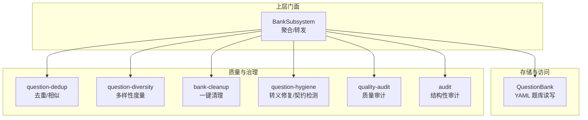
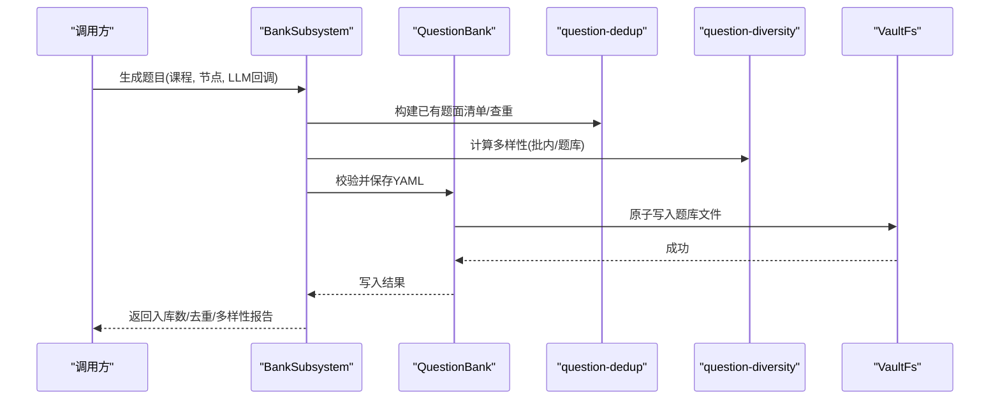
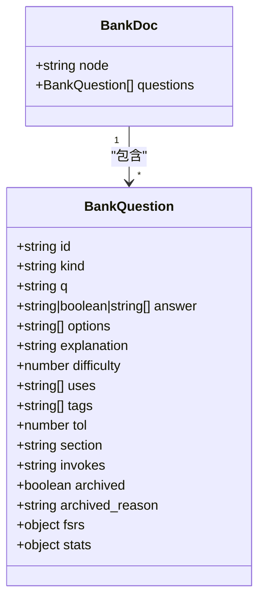
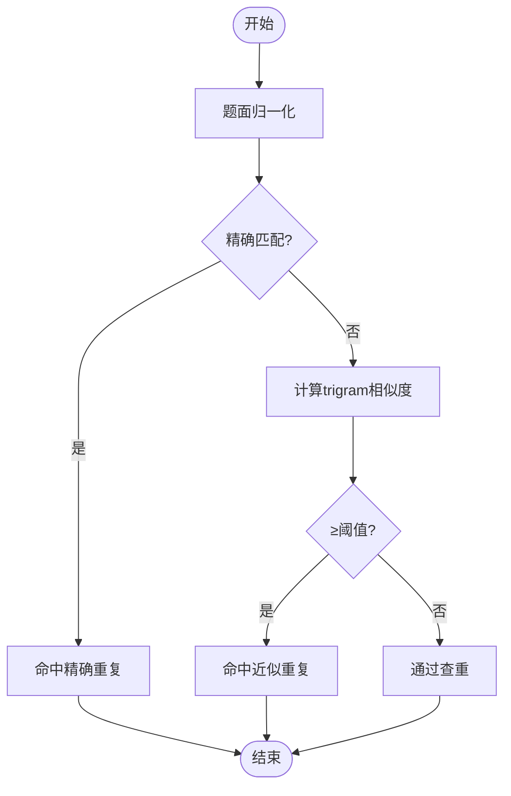
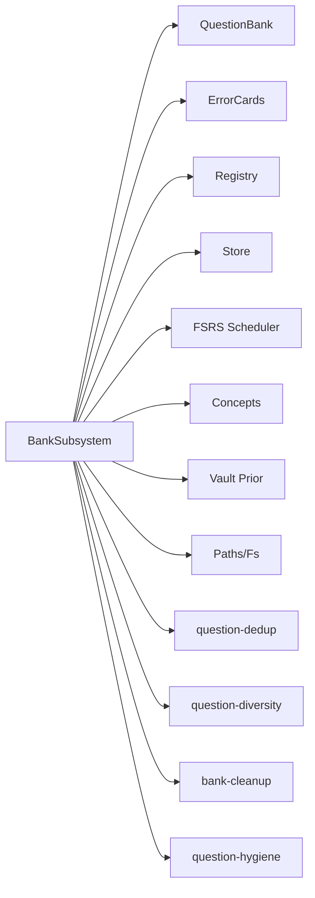

# 题库管理子系统

<cite>
**本文引用的文件**
- [question-bank.ts](file://src/engine/question-bank.ts)
- [question-dedup.ts](file://src/engine/question-dedup.ts)
- [question-diversity.ts](file://src/engine/question-diversity.ts)
- [bank-cleanup.ts](file://src/engine/bank-cleanup.ts)
- [question-hygiene.ts](file://src/engine/question-hygiene.ts)
- [quality-audit.ts](file://src/engine/quality-audit.ts)
- [audit.ts](file://src/engine/audit.ts)
- [strict-question-bank.test.ts](file://tests/strict-question-bank.test.ts)
- [question-dedup.test.ts](file://tests/question-dedup.test.ts)
- [question-diversity.test.ts](file://tests/question-diversity.test.ts)
</cite>

## 目录
1. [简介](#简介)
2. [项目结构](#项目结构)
3. [核心组件](#核心组件)
4. [架构总览](#架构总览)
5. [详细组件分析](#详细组件分析)
6. [依赖关系分析](#依赖关系分析)
7. [性能考量](#性能考量)
8. [故障排查指南](#故障排查指南)
9. [结论](#结论)
10. [附录：使用示例与最佳实践](#附录使用示例与最佳实践)

## 简介
本文件面向 LearnHub 的“题库管理子系统”，围绕 BankSubsystem 的核心职责展开：题目存储、去重算法、多样性保证、质量清理，以及题目数据结构、索引机制与检索优化。同时说明题目版本管理、变更追踪与回滚机制，并提供增删改查、批量操作与质量检查的使用指引（以代码路径引用代替直接粘贴源码）。

## 项目结构
题库子系统由多个模块协作完成：
- 存储与读写：QuestionBank 负责 YAML 题库文件的加载、校验、原子写入与单题级增删改归档。
- 查重与注入：question-dedup 提供题面归一化、trigram 相似度与已有题面注入提示词。
- 多样性度量：question-diversity 计算题型熵、干扰项编辑距离、self-BLEU 与平均对相似度。
- 质量清理：bank-cleanup 识别应归档的休眠题或跳过节点的全部未归档题；question-hygiene 做转义修复与记法契约检测。
- 审计与体检：audit 与 quality-audit 提供结构性审计与质量抽样审计能力，辅助题库健康度评估。
- 测试用例：覆盖严格模式下的题库行为、查重与多样性指标。

图表来源
- [question-bank.ts:264-453](file://src/engine/question-bank.ts#L264-L453)
- [question-dedup.ts:14-89](file://src/engine/question-dedup.ts#L14-L89)
- [question-diversity.ts:39-97](file://src/engine/question-diversity.ts#L39-L97)
- [bank-cleanup.ts:10-28](file://src/engine/bank-cleanup.ts#L10-L28)
- [question-hygiene.ts:15-192](file://src/engine/question-hygiene.ts#L15-L192)
- [quality-audit.ts:23-124](file://src/engine/quality-audit.ts#L23-L124)
- [audit.ts:35-316](file://src/engine/audit.ts#L35-L316)

章节来源
- [question-bank.ts:1-120](file://src/engine/question-bank.ts#L1-L120)
- [question-dedup.ts:1-89](file://src/engine/question-dedup.ts#L1-L89)
- [question-diversity.ts:1-97](file://src/engine/question-diversity.ts#L1-L97)
- [bank-cleanup.ts:1-29](file://src/engine/bank-cleanup.ts#L1-L29)
- [question-hygiene.ts:1-192](file://src/engine/question-hygiene.ts#L1-L192)
- [quality-audit.ts:1-124](file://src/engine/quality-audit.ts#L1-L124)
- [audit.ts:1-316](file://src/engine/audit.ts#L1-L316)

## 核心组件
- QuestionBank：题库持久化与单题级操作（追加、更新作者字段、证据写回、归档/恢复、批量归档），所有写前均通过 schema 校验，确保一致性。
- BankSubsystem：门面聚合层，将错误卡生成、难度建议、全量清单、错误卡队列等能力组合起来，并协调存储、调度、概念登记、先验注入等外部依赖。
- question-dedup：题面归一化、trigram 相似度、已有题面注入与重复判定。
- question-diversity：题型分布熵、干扰项编辑距离、self-BLEU、平均对相似度，输出批内与题库累计两份读数。
- bank-cleanup：基于规则识别应归档的候选（跳过节点全部未归档题、已完成节点的休眠题）。
- question-hygiene：转义损坏修复、ASCII 数学记法违规检测、填空答案边界约束。
- audit / quality-audit：结构性审计与质量抽样审计，为题库健康与生成质量提供可观测性。

章节来源
- [question-bank.ts:264-453](file://src/engine/question-bank.ts#L264-L453)
- [question-bank.ts:513-800](file://src/engine/question-bank.ts#L513-L800)
- [question-dedup.ts:14-89](file://src/engine/question-dedup.ts#L14-L89)
- [question-diversity.ts:39-97](file://src/engine/question-diversity.ts#L39-L97)
- [bank-cleanup.ts:10-28](file://src/engine/bank-cleanup.ts#L10-L28)
- [question-hygiene.ts:15-192](file://src/engine/question-hygiene.ts#L15-L192)
- [quality-audit.ts:23-124](file://src/engine/quality-audit.ts#L23-L124)
- [audit.ts:35-316](file://src/engine/audit.ts#L35-L316)

## 架构总览
BankSubsystem 作为门面，聚合 QuestionBank 与多个质量/治理模块，对外暴露统一接口。其关键流程包括：
- 题目入库：LLM 产出 → 转义修复与契约检测 → 去重 → 多样性报告 → 写入 YAML。
- 题目查询与管理：按课程/节点扫描题库，返回只读视图（不含答案），支持归档/恢复与证据写回。
- 错误对比卡：从练习流水挖掘高频错法，生成对比卡并落盘，支持作答推进 FSRS。
- 一键清理：识别休眠/跳过节点题目，预览分组后批量归档。

图表来源
- [question-bank.ts:309-318](file://src/engine/question-bank.ts#L309-L318)
- [question-dedup.ts:48-89](file://src/engine/question-dedup.ts#L48-L89)
- [question-diversity.ts:249-302](file://src/engine/question-diversity.ts#L249-L302)

章节来源
- [question-bank.ts:309-318](file://src/engine/question-bank.ts#L309-L318)
- [question-dedup.ts:48-89](file://src/engine/question-dedup.ts#L48-L89)
- [question-diversity.ts:249-302](file://src/engine/question-diversity.ts#L249-L302)

## 详细组件分析

### 题目数据结构与存储
- 题目对象包含 id、kind、q、answer、options、explanation、difficulty、uses、tags、tol、section、invokes、archived/archived_reason、fsrs、stats 等字段。
- 题库以 YAML 文件形式存放于课程根/题库/<节点>.yaml，每个文件一个 node 对应一组 questions。
- 读取时进行 schema 校验，缺失题库视为合法空态；存在但 Broken 则抛错不静默吞掉。

图表来源
- [question-bank.ts:82-111](file://src/engine/question-bank.ts#L82-L111)

章节来源
- [question-bank.ts:82-111](file://src/engine/question-bank.ts#L82-L111)
- [question-bank.ts:139-262](file://src/engine/question-bank.ts#L139-L262)

### 索引机制与检索优化
- 题目在文件系统层面按“课程根/题库/<节点>.yaml”组织，读取时按文件名序稳定遍历。
- 视图层（questionsAll）对每道题抽取只读字段（不含答案），并附带调度信息（due/last_review）与标签/选项等元数据，供管理面板展示。
- 错误卡与题库扫描采用“失败即跳过”策略：Broken 文件不阻塞其他条目，保障整体可用性。

章节来源
- [question-bank.ts:756-788](file://src/engine/question-bank.ts#L756-L788)
- [question-bank.ts:534-559](file://src/engine/question-bank.ts#L534-L559)

### 去重算法
- 两层判定：
  - 精确重复：题面归一化（去空白/标点、大小写折叠）后相等。
  - 近似重复：字符 trigram 集合的 Jaccard 相似度超过阈值（默认 0.8）。
- 已有题面清单仅包含题干、题型与难度，不包含答案，避免泄露答案到提示词。
- 查重命中时丢弃该题并报告命中对方原题面。

图表来源
- [question-dedup.ts:17-74](file://src/engine/question-dedup.ts#L17-L74)

章节来源
- [question-dedup.ts:14-89](file://src/engine/question-dedup.ts#L14-L89)
- [question-dedup.test.ts:16-55](file://tests/question-dedup.test.ts#L16-L55)

### 多样性保证
- 题型分布熵：衡量批内题型多样性，单一题型熵为 0，越多且越均匀熵越高。
- 干扰项编辑距离：单选/多选题的选项两两 Levenshtein 距离均值，越小越趋同。
- self-BLEU：每道题相对其余题面的 BLEU（多参考），长度加权平均，值越高越趋同。
- 平均对相似度：字符 trigram Jaccard 的长度加权平均值，作为 self-BLEU 的同轴第二读数。
- 报告分“批内”和“题库累计”两个范围，样本量随读数携带，避免误读。

章节来源
- [question-diversity.ts:1-97](file://src/engine/question-diversity.ts#L1-L97)
- [question-diversity.ts:99-302](file://src/engine/question-diversity.ts#L99-L302)
- [question-diversity.test.ts:102-195](file://tests/question-diversity.test.ts#L102-L195)

### 质量清理
- 规则：
  - 跳过节点（stage=skipped）的全部未归档题 → 标记为 skipped_node。
  - 已完成节点（review/mastered）中从未调度的题（休眠题）→ dormant_after_complete。
- 清理结果为候选列表，确认后走批量归档（reason=cleanup），永不物理删除。

章节来源
- [bank-cleanup.ts:10-28](file://src/engine/bank-cleanup.ts#L10-L28)

### 质量检查与转义修复
- 转义损坏修复：模型产出的 YAML/JSON 双引号可能吃掉 LaTeX 命令中的控制字符，模块会尝试还原并计数；无法修复的高危控制字符标记不可修复。
- 记法契约：剥掉数学定界与代码后，不得残留 ASCII 上标/下标或裸 LaTeX 命令。
- 填空边界：唯一答案填空不得疑似数值或代数式，否则需改用 numeric/single_choice。
- 存量体检：扫描题库文本，输出违规清单（控制字符、记法违规、解析过长等）。

章节来源
- [question-hygiene.ts:15-192](file://src/engine/question-hygiene.ts#L15-L192)
- [question-hygiene.ts:194-247](file://src/engine/question-hygiene.ts#L194-L247)

### 版本管理、变更追踪与回滚
- 版本管理：题库文件本身即为“版本载体”，每次修改通过原子写入覆盖原文件；无内置多版本快照。
- 变更追踪：通过 store 的 journal/erratum/practice 记录学习与实践事件；题目级 fsrs/stats 作为派生证据整体替换。
- 回滚机制：由于无历史版本快照，回滚需依赖外部备份或审计日志；归档/恢复用于状态切换而非内容回滚。

章节来源
- [question-bank.ts:309-318](file://src/engine/question-bank.ts#L309-L318)
- [question-bank.ts:378-403](file://src/engine/question-bank.ts#L378-L403)
- [question-bank.ts:405-452](file://src/engine/question-bank.ts#L405-L452)
- [audit.ts:286-316](file://src/engine/audit.ts#L286-L316)

## 依赖关系分析
- BankSubsystem 依赖：
  - QuestionBank：题库读写与单题操作。
  - errorCards：错误卡 CRUD。
  - registry/store/sched：课程注册、学习日、FSRS 调度。
  - concepts/explain/vaultPrior：概念与先验注入。
  - paths/fs：路径与文件系统。
- 质量模块之间低耦合：dedup/diversity/hygiene 均为纯函数，便于复用与测试。

图表来源
- [question-bank.ts:460-511](file://src/engine/question-bank.ts#L460-L511)

章节来源
- [question-bank.ts:460-511](file://src/engine/question-bank.ts#L460-L511)

## 性能考量
- 查重复杂度：trigram 相似度为 O(n·m) 级别（n 为候选题数，m 为平均题面长度），适合中小规模题库；大规模时可考虑分桶或布隆过滤器前置过滤。
- 多样性度量：self-BLEU 与编辑距离计算开销较高，建议在入库后一次性计算并缓存结果。
- 文件 I/O：所有写操作使用原子写入，避免部分写入导致 Broken；读取失败快速失败，避免污染整体流程。
- 扫描优化：错误卡与题库扫描采用“失败即跳过”，减少单个 Broken 文件对整体吞吐的影响。

[本节为通用指导，不直接分析具体文件]

## 故障排查指南
- 题库 Broken：YAML 解析失败或 schema 校验失败会抛出明确错误；检查 node/questions 结构与题型约束。
- 答案形状错误：multi_choice 需要至少 2 个正确项；填空题答案不能是数值或疑似代数式。
- 查重拦截：若新增题被判定为重复，查看命中对方原题面，调整题干措辞或考点。
- 多样性异常：若 self-BLEU 偏高或干扰项编辑距离偏低，说明趋同严重，需增加题型与选项差异。
- 清理建议：使用一键清理识别休眠/跳过节点题目，确认后再归档。

章节来源
- [question-bank.ts:127-137](file://src/engine/question-bank.ts#L127-L137)
- [question-hygiene.ts:107-121](file://src/engine/question-hygiene.ts#L107-L121)
- [question-dedup.ts:57-74](file://src/engine/question-dedup.ts#L57-L74)
- [bank-cleanup.ts:16-28](file://src/engine/bank-cleanup.ts#L16-L28)

## 结论
题库管理子系统以 QuestionBank 为核心，结合去重、多样性、质量清理与审计，形成从生成到入库的全链路质量保障。BankSubsystem 作为门面，屏蔽复杂依赖，提供一致的操作体验。通过严格的 schema 校验、原子写入与失败快速失败策略，系统在可用性与一致性之间取得平衡。未来可在大规模题库场景下引入更高效的索引与缓存策略，进一步提升性能。

[本节为总结，不直接分析具体文件]

## 附录：使用示例与最佳实践
以下示例均以代码路径引用形式给出，避免直接粘贴源码。

- 题目增删改查
  - 追加单题：见 [question-bank.ts:337-352](file://src/engine/question-bank.ts#L337-L352)
  - 更新作者字段（白名单合并）：见 [question-bank.ts:354-376](file://src/engine/question-bank.ts#L354-L376)
  - 证据写回（fsrs/stats）：见 [question-bank.ts:378-403](file://src/engine/question-bank.ts#L378-L403)
  - 归档/恢复单题：见 [question-bank.ts:405-425](file://src/engine/question-bank.ts#L405-L425)
  - 批量归档/恢复：见 [question-bank.ts:427-452](file://src/engine/question-bank.ts#L427-L452)
  - 全量清单（只读视图）：见 [question-bank.ts:756-788](file://src/engine/question-bank.ts#L756-L788)

- 批量操作
  - 批量归档：见 [question-bank.ts:427-452](file://src/engine/question-bank.ts#L427-L452)
  - 错误卡生成（批量）：见 [question-bank.ts:572-684](file://src/engine/question-bank.ts#L572-L684)

- 质量检查
  - 转义修复与契约检测：见 [question-hygiene.ts:51-192](file://src/engine/question-hygiene.ts#L51-L192)
  - 存量体检：见 [question-hygiene.ts:194-247](file://src/engine/question-hygiene.ts#L194-L247)
  - 一键清理候选：见 [bank-cleanup.ts:16-28](file://src/engine/bank-cleanup.ts#L16-L28)

- 去重与多样性
  - 去重判定：见 [question-dedup.ts:57-74](file://src/engine/question-dedup.ts#L57-L74)
  - 已有题面注入：见 [question-dedup.ts:76-89](file://src/engine/question-dedup.ts#L76-L89)
  - 多样性报告：见 [question-diversity.ts:249-302](file://src/engine/question-diversity.ts#L249-L302)

- 测试用例参考
  - 严格模式题库行为：见 [strict-question-bank.test.ts:25-123](file://tests/strict-question-bank.test.ts#L25-L123)
  - 去重集成测试：见 [question-dedup.test.ts:57-177](file://tests/question-dedup.test.ts#L57-L177)
  - 多样性全链测试：见 [question-diversity.test.ts:173-195](file://tests/question-diversity.test.ts#L173-L195)

章节来源
- [question-bank.ts:337-452](file://src/engine/question-bank.ts#L337-L452)
- [question-bank.ts:572-684](file://src/engine/question-bank.ts#L572-L684)
- [question-hygiene.ts:51-247](file://src/engine/question-hygiene.ts#L51-L247)
- [bank-cleanup.ts:16-28](file://src/engine/bank-cleanup.ts#L16-L28)
- [question-dedup.ts:57-89](file://src/engine/question-dedup.ts#L57-L89)
- [question-diversity.ts:249-302](file://src/engine/question-diversity.ts#L249-L302)
- [strict-question-bank.test.ts:25-123](file://tests/strict-question-bank.test.ts#L25-L123)
- [question-dedup.test.ts:57-177](file://tests/question-dedup.test.ts#L57-L177)
- [question-diversity.test.ts:173-195](file://tests/question-diversity.test.ts#L173-L195)