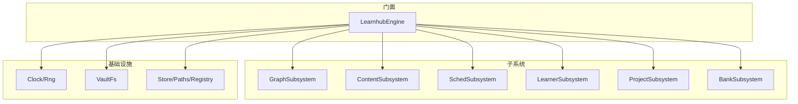
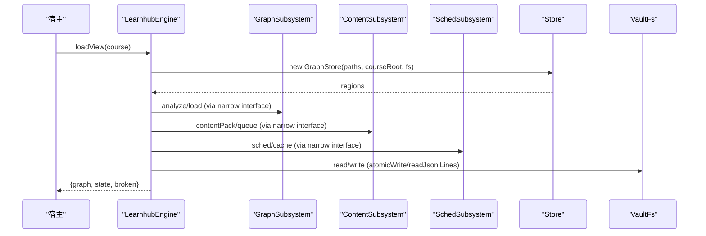
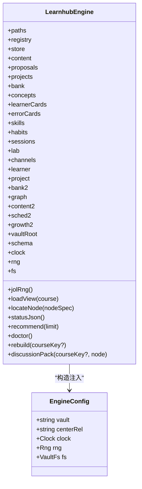
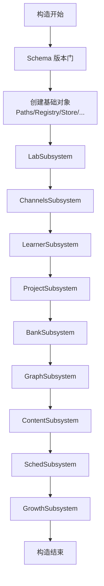
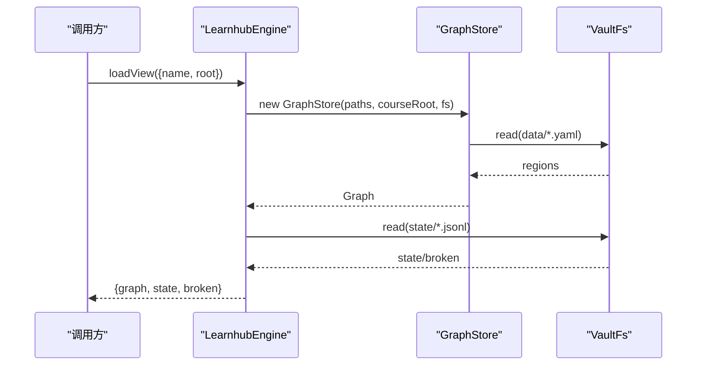
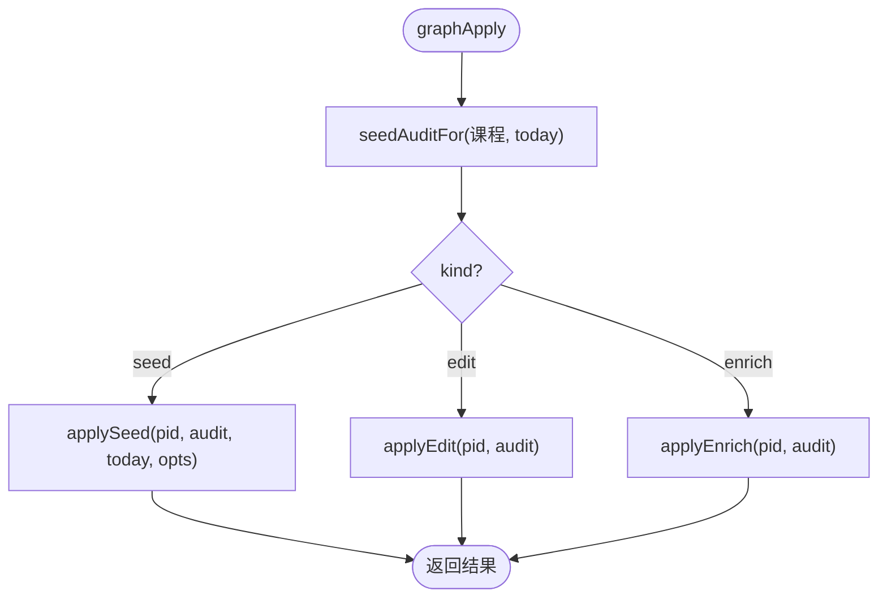
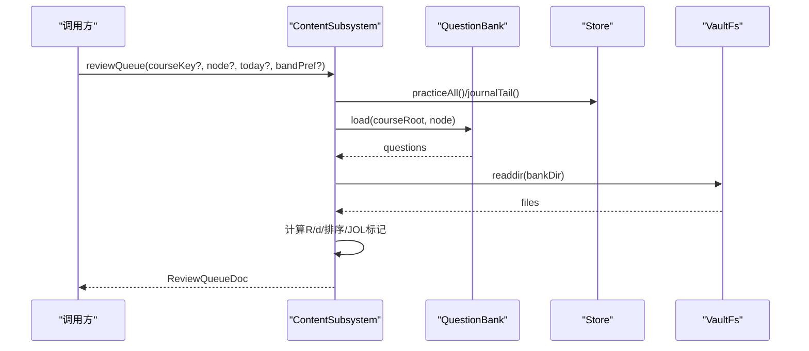
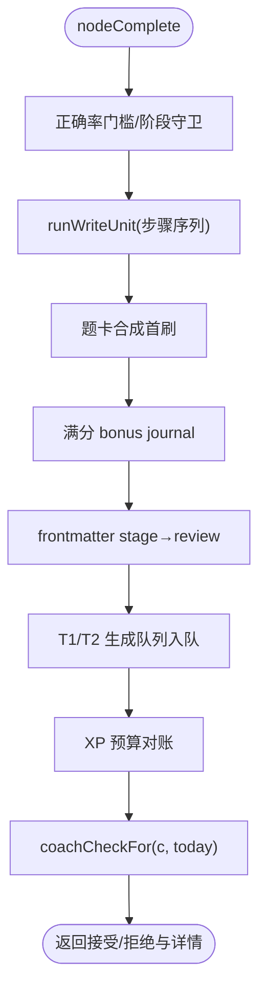
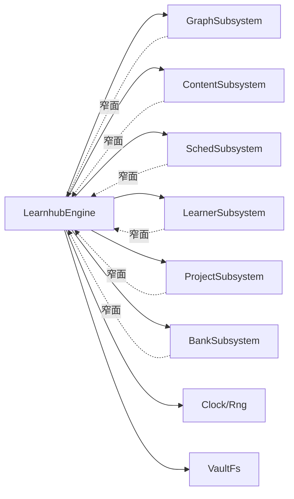

# 引擎架构

<cite>
**本文引用的文件**
- [src/engine/index.ts](file://src/engine/index.ts)
- [src/engine/graph-subsystem.ts](file://src/engine/graph-subsystem.ts)
- [src/engine/content-subsystem.ts](file://src/engine/content-subsystem.ts)
- [src/engine/sched-subsystem.ts](file://src/engine/sched-subsystem.ts)
- [src/engine/learner-cards.ts](file://src/engine/learner-cards.ts)
- [src/engine/projects.ts](file://src/engine/projects.ts)
- [src/engine/question-bank.ts](file://src/engine/question-bank.ts)
- [src/engine/clock.ts](file://src/engine/clock.ts)
- [src/engine/io.ts](file://src/engine/io.ts)
</cite>

## 目录
1. [简介](#简介)
2. [项目结构](#项目结构)
3. [核心组件](#核心组件)
4. [架构总览](#架构总览)
5. [详细组件分析](#详细组件分析)
6. [依赖关系分析](#依赖关系分析)
7. [性能考量](#性能考量)
8. [故障排查指南](#故障排查指南)
9. [结论](#结论)
10. [附录：使用模式与最佳实践](#附录使用模式与最佳实践)

## 简介
本文件面向 LearnHub 学习引擎核心，系统性阐述门面模式（LearnhubEngine）如何作为单一入口协调各子系统，解释 EngineConfig 配置接口与依赖注入机制（时钟、随机源、文件系统抽象），并详述 GraphSubsystem、ContentSubsystem、SchedSubsystem、LearnerSubsystem、ProjectSubsystem、BankSubsystem 等子系统的装配顺序与依赖关系。同时梳理数据流设计（课程视图加载、节点定位、状态管理）、错误处理策略与数据一致性保证机制，并提供具体代码示例路径以展示引擎的使用模式与最佳实践。

## 项目结构
- 门面层：LearnhubEngine 暴露统一 API，集中装配与调度所有子系统与领域对象。
- 子系统层：按领域切分（图谱、内容、调度、学习者产出、项目、题库等），通过窄面依赖注入耦合到门面。
- 基础设施层：Clock/Rng/VaultFs 等端口抽象，隔离运行时与环境差异；Store/Paths/Registry 等基础能力。
- 视图与工具：面向宿主与 UI 的只读视图与诊断工具，不直接写数据。

图表来源
- [src/engine/index.ts:133-398](file://src/engine/index.ts#L133-L398)

章节来源
- [src/engine/index.ts:133-398](file://src/engine/index.ts#L133-L398)

## 核心组件
- LearnhubEngine（门面）
  - 职责：构造期完成所有子系统装配；提供课程视图加载、节点定位、状态查询、推荐、审计、重建、讨论上下文包等统一入口；对外仅暴露稳定方法。
  - 关键装配：在构造函数中依次创建 Paths、Registry、Store、Content、QuestionBank、ConceptRegistry、LearnerCards、ErrorCards、Skills、Habits、NoteSourceManifest、AnkiMirror、Projects、Sessions，以及 Lab/Channels/Learner/Project/Bank/Graph/Content/Sched/Growth 等子系统，并通过窄面相互注入。
  - 配置与注入：EngineConfig 要求 vault、centerRel、clock、rng、fs；engine 内零直读系统时间/随机/文件系统，全部经端口注入。
- 子系统
  - GraphSubsystem：图分析、链接先验、提案门禁包装、覆盖层回填、节点浏览与路径查询。
  - ContentSubsystem：内容管线、笔记 resolve/反馈区、课程工作区、复习队列、题目作答与判卷、JOL 抽查、校准提示。
  - SchedSubsystem：节点跳过/完成确认、XP 账本、记忆健康仪表盘、FSRS 参数优化、沉淀层事件与档案重建。
  - LearnerSubsystem：学习者输出（我的卡、技能、习惯、回执、周复盘等）。
  - ProjectSubsystem：项目域（计划、里程碑产物、执行事件、召回、关联边推断）。
  - BankSubsystem：题库读写、题目质量审计、错误对比卡、Anki 通道协作。
- 基础设施
  - Clock/Rng：纯函数化时间/随机，测试可注入固定值，确保确定性。
  - VaultFs：唯一 IO 端口，原子写、JSONL 读取、配置读写等原语。

章节来源
- [src/engine/index.ts:133-398](file://src/engine/index.ts#L133-L398)
- [src/engine/clock.ts:1-20](file://src/engine/clock.ts#L1-L20)
- [src/engine/io.ts:1-103](file://src/engine/io.ts#L1-L103)

## 架构总览
门面 LearnhubEngine 采用“装配器 + 窄面注入”的模式：
- 构造期：解析 schema 版本门 → 初始化基础对象 → 按依赖顺序创建子系统 → 将门面私有方法与共享实例以窄面形式注入各子系统。
- 运行期：外部调用门面方法 → 门面路由到对应子系统 → 子系统通过窄面回调门面或访问共享能力（store/fs/paths/registry 等）。
- 数据流：课程视图 = 图（data/*.yaml）+ frontmatter 状态（state/*.jsonl）+ 正文（课程笔记）；所有写操作经 VaultFs 原子写，读操作遵循 Missing/Broken 纪律。

图表来源
- [src/engine/index.ts:410-417](file://src/engine/index.ts#L410-L417)
- [src/engine/graph-subsystem.ts:88-117](file://src/engine/graph-subsystem.ts#L88-L117)
- [src/engine/content-subsystem.ts:125-146](file://src/engine/content-subsystem.ts#L125-L146)
- [src/engine/sched-subsystem.ts:368-449](file://src/engine/sched-subsystem.ts#L368-L449)
- [src/engine/io.ts:34-39](file://src/engine/io.ts#L34-L39)

## 详细组件分析

### LearnhubEngine 门面与 EngineConfig
- EngineConfig
  - vault：vault 根绝对路径（必填）。
  - centerRel：学习中心相对路径（缺省“学习中心”）。
  - clock：当前时刻毫秒时间戳提供者（必填）。
  - rng：[0,1) 均匀随机源（必填）。
  - fs：VaultFs 存储端口（必填）。
- 门面职责
  - 构造期：schema 版本硬门 → 创建基础对象 → 按依赖顺序装配子系统 → 注入窄面。
  - 运行期：课程视图加载、节点定位、状态/推荐、审计、重建、讨论上下文包、生成任务注册表读写等。
  - 缓存：FSRS 调度器按课程根缓存，参数写回后失效。

图表来源
- [src/engine/index.ts:133-398](file://src/engine/index.ts#L133-L398)

章节来源
- [src/engine/index.ts:133-398](file://src/engine/index.ts#L133-L398)

### 子系统装配顺序与依赖关系
- 装配顺序（构造期内）
  1) 解析 schema 版本 → 创建 Paths/Registry/Store/Content/QuestionBank/ConceptRegistry/LearnerCards/ErrorCards/Skills/Habits/NoteSourceManifest/AnkiMirror/Projects/Sessions。
  2) 创建 LabSubsystem（实验台）→ ChannelsSubsystem（通道域）→ LearnerSubsystem（学习者输出）→ ProjectSubsystem（项目域）→ BankSubsystem（题库域）→ GraphSubsystem（图谱域）→ ContentSubsystem（内容管线）→ SchedSubsystem（调度域）→ GrowthSubsystem（滚动教练）。
  3) 每个子系统通过窄面注入共享能力（store/fs/paths/registry）与门面回调（learningDay/loadView/ensureNote/assertNoteOk/sched 等）。
- 依赖方向
  - 门面 → 子系统（单向）
  - 子系统之间通过门面窄面解耦，避免环依赖。
  - 基础设施（Clock/Rng/VaultFs）被所有子系统共享。

图表来源
- [src/engine/index.ts:212-398](file://src/engine/index.ts#L212-L398)

章节来源
- [src/engine/index.ts:212-398](file://src/engine/index.ts#L212-L398)

### 数据流：课程视图加载、节点定位、状态管理
- 课程视图加载
  - 通过 GraphStore 加载 data/*.yaml 得到图区域 → 构建 Graph → 读取 state/*.jsonl 聚合 frontmatter 状态 → 返回 graph/state/broken。
- 节点定位
  - 支持“课程/节点”精确命中；否则在所有启用课程中搜索唯一命中；多命中抛错。
- 状态管理
  - Broken 笔记前置校验（assertNoteOk）→ 缺失时按需创建占位笔记（ensureNote）→ 后续写操作经 atomicWrite。

图表来源
- [src/engine/index.ts:410-417](file://src/engine/index.ts#L410-L417)
- [src/engine/index.ts:419-435](file://src/engine/index.ts#L419-L435)
- [src/engine/index.ts:437-463](file://src/engine/index.ts#L437-L463)

章节来源
- [src/engine/index.ts:410-463](file://src/engine/index.ts#L410-L463)

### 子系统详解

#### GraphSubsystem（图谱域）
- 功能：图分析、Vault 链接先验扫描与回填、节点详情/浏览/路径查询、提案 propose/apply/reject、种子起草、概念合并、enc 覆盖层回填。
- 关键点：
  - 链接先验缓存：Missing=合法空态，Broken 抛错。
  - 提案门禁：apply 前执行 seedAuditFor，ERROR 阻断。
  - enc 回填：基于 Ready 内容与 invokes 投影生成 pending enrich 提案，sha256 指纹锚定正典。

图表来源
- [src/engine/graph-subsystem.ts:415-429](file://src/engine/graph-subsystem.ts#L415-L429)
- [src/engine/index.ts:636-647](file://src/engine/index.ts#L636-L647)

章节来源
- [src/engine/graph-subsystem.ts:88-117](file://src/engine/graph-subsystem.ts#L88-L117)
- [src/engine/graph-subsystem.ts:155-195](file://src/engine/graph-subsystem.ts#L155-L195)
- [src/engine/graph-subsystem.ts:198-265](file://src/engine/graph-subsystem.ts#L198-L265)
- [src/engine/graph-subsystem.ts:415-429](file://src/engine/graph-subsystem.ts#L415-L429)

#### ContentSubsystem（内容管线）
- 功能：内容上下文包组装（含 Vault 先验注入段）、大纲/节落盘、整课重置、单节重写、课程工作区树、复习队列、题目作答与判卷、JOL 抽查与校准提示、笔记反馈提交。
- 关键点：
  - 终点保护：终点不参与生成与调度。
  - 队列排序：主键 R 升序，档内难度由易到难，再 due/节点/题序稳定排序。
  - 会话带偏好：A1 会话起点先验为节点 Mastery，叠加显式带偏移。

图表来源
- [src/engine/content-subsystem.ts:538-717](file://src/engine/content-subsystem.ts#L538-L717)

章节来源
- [src/engine/content-subsystem.ts:109-146](file://src/engine/content-subsystem.ts#L109-L146)
- [src/engine/content-subsystem.ts:192-228](file://src/engine/content-subsystem.ts#L192-L228)
- [src/engine/content-subsystem.ts:244-287](file://src/engine/content-subsystem.ts#L244-L287)
- [src/engine/content-subsystem.ts:538-717](file://src/engine/content-subsystem.ts#L538-L717)

#### SchedSubsystem（调度域）
- 功能：节点跳过/完成确认、XP 预算对账、记忆健康仪表盘、FSRS 参数优化、沉淀层事件追加/折叠/档案重建。
- 关键点：
  - 完成确认：合成首刷、满分 bonus、stage→review、T1/T2 入队、XP 预算对账，写入单元保障顺序与幂等。
  - 参数优化：训练集来自真实复习日志（排除 synthetic），评估优于基线才写回正典与缓存，随后失效调度器缓存并重建学习者档案。
  - 沉淀结算：按学习周蒸馏校准画像与速度韧性，幂等不重复写。

图表来源
- [src/engine/sched-subsystem.ts:124-270](file://src/engine/sched-subsystem.ts#L124-L270)

章节来源
- [src/engine/sched-subsystem.ts:93-121](file://src/engine/sched-subsystem.ts#L93-L121)
- [src/engine/sched-subsystem.ts:124-270](file://src/engine/sched-subsystem.ts#L124-L270)
- [src/engine/sched-subsystem.ts:368-449](file://src/engine/sched-subsystem.ts#L368-L449)
- [src/engine/sched-subsystem.ts:472-546](file://src/engine/sched-subsystem.ts#L472-L546)

#### LearnerSubsystem（学习者输出）
- 功能：我的卡（E1）、技能与执行事件、习惯、回执、周复盘、罗盘 ETA、教练回合感知面、生长批受理、复诊等。
- 关键点：
  - 我的卡独立调度（fsrs 字段），不入节点掌握度与定价；复习并入复习队列但无绑定 XP。
  - 与 Content/Sched/Graph 通过门面窄面交互，保持边界清晰。

章节来源
- [src/engine/learner-cards.ts:1-200](file://src/engine/learner-cards.ts#L1-L200)

#### ProjectSubsystem（项目域）
- 功能：项目身份与计划、里程碑产物、执行事件、召回、关联边推断、提案产物校验。
- 关键点：
  - 产物形态随渐退档（骨架/补全/独立）变化；计划修订走提案通道，带快照 diff。
  - 与图谱/内容/调度解耦，零 XP 零 FSRS。

章节来源
- [src/engine/projects.ts:1-200](file://src/engine/projects.ts#L1-L200)

#### BankSubsystem（题库域）
- 功能：题库读写、题目质量审计、错误对比卡、Anki 通道协作、题目多样性/去重/卫生检查。
- 关键点：
  - 题目级 FSRS 调度（每题一张卡），作答驱动推进；复习日志记录用于健康仪表盘。
  - 与内容/图谱/调度通过门面窄面交互。

章节来源
- [src/engine/question-bank.ts:1-200](file://src/engine/question-bank.ts#L1-L200)

## 依赖关系分析
- 耦合与内聚
  - 门面高内聚：集中装配与路由；子系统低耦合：通过窄面依赖门面能力，避免跨域直接引用。
  - 基础设施（Clock/Rng/VaultFs）被广泛复用，形成稳定的底层契约。
- 直接/间接依赖
  - 门面 → 子系统（直接）
  - 子系统 → 门面窄面（间接）
  - 子系统 → 基础设施（直接）
- 外部依赖与集成点
  - VaultFs 实现位于 host/vault-fs.ts（适配器），engine 侧零 node:fs 导入。
  - FSRS 参数优化通过 bindingImpl 接缝注入，便于测试替换。

图表来源
- [src/engine/index.ts:212-398](file://src/engine/index.ts#L212-L398)

章节来源
- [src/engine/index.ts:212-398](file://src/engine/index.ts#L212-L398)

## 性能考量
- 调度器缓存：按课程根缓存 FSRS 实例，参数写回后失效，避免重复构建成本。
- 批量扫描与惰性加载：课程视图每次现读（小文件天然最新）；复习队列按风险/难度稳定排序，减少 UI 抖动。
- 原子写与 JSONL 容错：atomicWrite 防并发损坏；readJsonlLinesReport 容忍撕裂尾行，提升鲁棒性。
- 建议
  - 大作业场景优先使用 batch 接口（如 reviewQueue 过滤 node）。
  - 频繁读场景利用缓存（如 schedCache）与只读视图。
  - 谨慎触发整课重置与参数优化，注意其副作用与耗时。

## 故障排查指南
- Broken/Missing 纪律
  - 文件缺失视为合法空态（Missing），存在但非法则抛 Broken（fail loud）。
  - 常见位置：笔记 frontmatter、题库 YAML、JSONL 流水、Vault 先验缓存。
- 典型错误与修复
  - 节点不在图内：检查课程注册与节点名拼写。
  - Broken 笔记：根据报错路径与原因修复 frontmatter 或正文。
  - 提案 apply 失败：查看 seedAuditFor 的健康分与警告，先修复 ERROR。
  - JSONL 损坏：定位撕裂尾行或非法行，修复或删除后重试。
- 一致性保障
  - 写入单元（runWriteUnit）：步骤顺序明确，失败中止不回滚，journal 记录过程。
  - 参数优化：评估未优于基线不写回；写回后失效缓存并重建档案。
  - 沉淀层：正典与缓存镜像双写，崩溃窗口收敛；周档幂等不重复写。

章节来源
- [src/engine/io.ts:34-39](file://src/engine/io.ts#L34-L39)
- [src/engine/io.ts:71-101](file://src/engine/io.ts#L71-L101)
- [src/engine/sched-subsystem.ts:178-265](file://src/engine/sched-subsystem.ts#L178-L265)
- [src/engine/sched-subsystem.ts:368-449](file://src/engine/sched-subsystem.ts#L368-L449)

## 结论
LearnhubEngine 通过门面模式与窄面注入，将复杂的多子系统协作收敛为单一稳定入口，配合 Clock/Rng/VaultFs 等端口抽象，实现了环境无关、可测试、可扩展的学习引擎核心。子系统按领域切分，职责清晰，数据流围绕课程视图（图+状态+正文）展开，错误处理与一致性机制贯穿始终。遵循本文的装配顺序、数据流约定与故障排查策略，可在保证一致性的前提下高效扩展与演进。

## 附录：使用模式与最佳实践
- 初始化与配置
  - 提供 EngineConfig：vault、centerRel、clock、rng、fs。
  - 参考路径：[src/engine/index.ts:133-147](file://src/engine/index.ts#L133-L147)
- 课程视图与节点定位
  - 加载视图：loadView(course)。
  - 定位节点：locateNode("课程/节点") 或全局搜索。
  - 参考路径：[src/engine/index.ts:410-435](file://src/engine/index.ts#L410-L435)
- 内容生成与质检
  - 组装上下文包：contentPack(courseKey, node, opts)。
  - 应用正文：contentApply(courseKey, node, body)。
  - 参考路径：[src/engine/content-subsystem.ts:125-228](file://src/engine/content-subsystem.ts#L125-L228)
- 复习与作答
  - 获取队列：reviewQueue(courseKey?, node?, today?, bandPref?)。
  - 作答：questionAnswer(llmComplete, courseKey, node, qid, answer, elapsedS?, opts?)。
  - 参考路径：[src/engine/content-subsystem.ts:538-800](file://src/engine/content-subsystem.ts#L538-L800)
- 调度与完成
  - 完成确认：nodeComplete(courseKey?, node, force?)。
  - 跳过节点：nodeSkip(courseKey?, node, skipped)。
  - 参考路径：[src/engine/sched-subsystem.ts:93-270](file://src/engine/sched-subsystem.ts#L93-L270)
- 图谱与提案
  - 图分析：graphAnalyze(courseKey?, elementsOnly?)。
  - 提案申请：graphPropose(kind, yamlText) → graphApply(kind, pid, opts?)。
  - 参考路径：[src/engine/graph-subsystem.ts:88-117](file://src/engine/graph-subsystem.ts#L88-L117), [src/engine/graph-subsystem.ts:415-429](file://src/engine/graph-subsystem.ts#L415-L429)
- 参数优化与沉淀
  - 优化 FSRS 参数：optimizeFsrsParams(impl?)。
  - 沉淀事件追加/折叠/重建：sedimentAppend/foldRebuildProfile。
  - 参考路径：[src/engine/sched-subsystem.ts:368-449](file://src/engine/sched-subsystem.ts#L368-L449), [src/engine/sched-subsystem.ts:452-469](file://src/engine/sched-subsystem.ts#L452-L469)