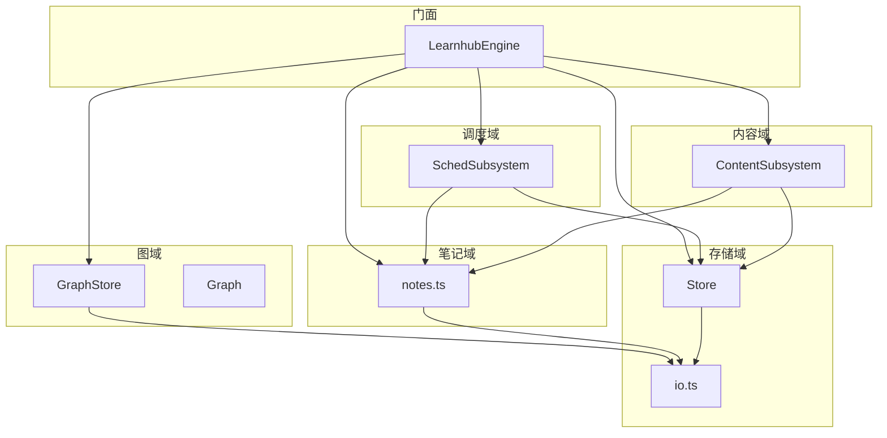
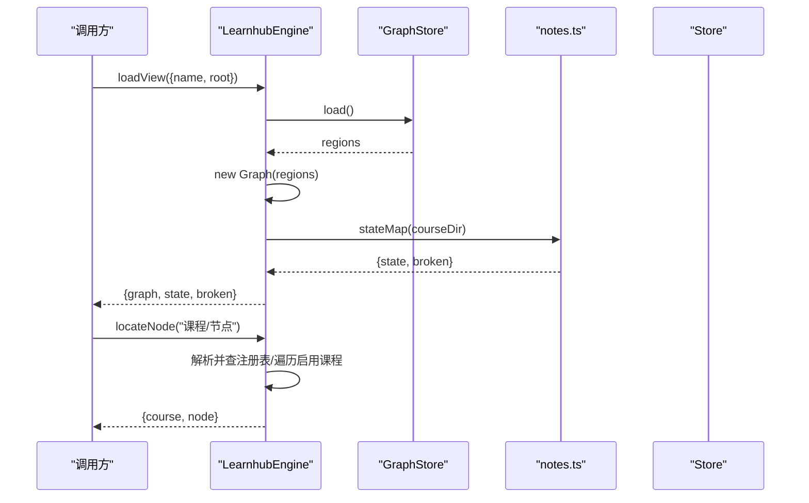
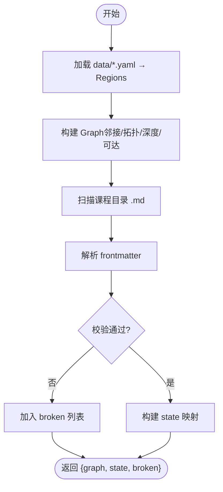
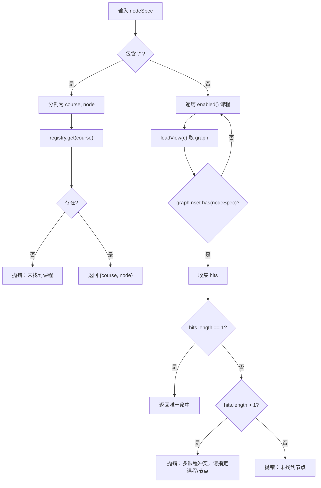
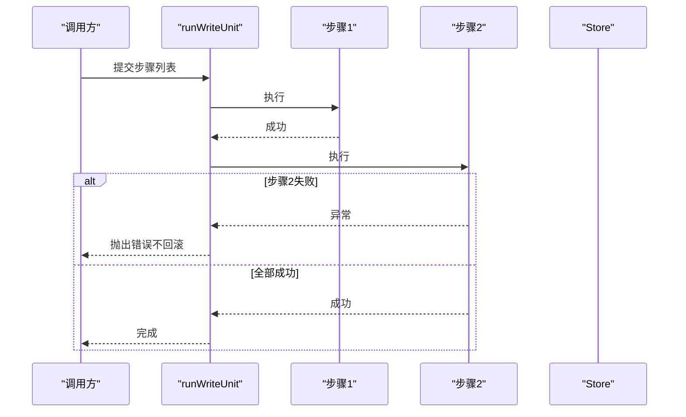
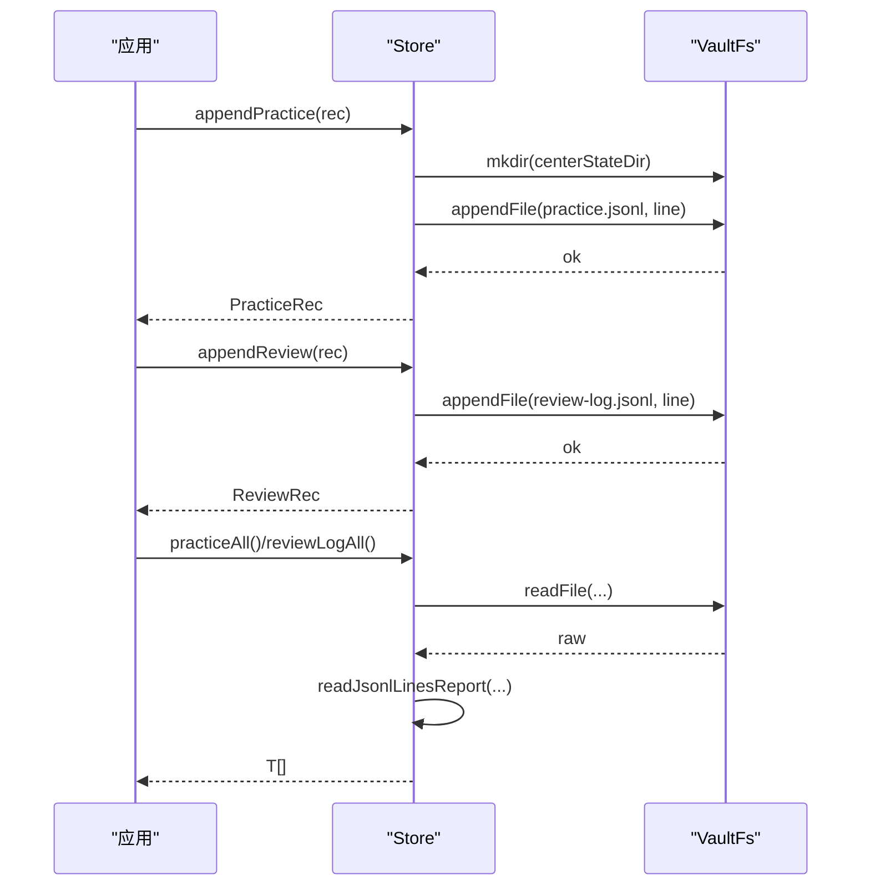
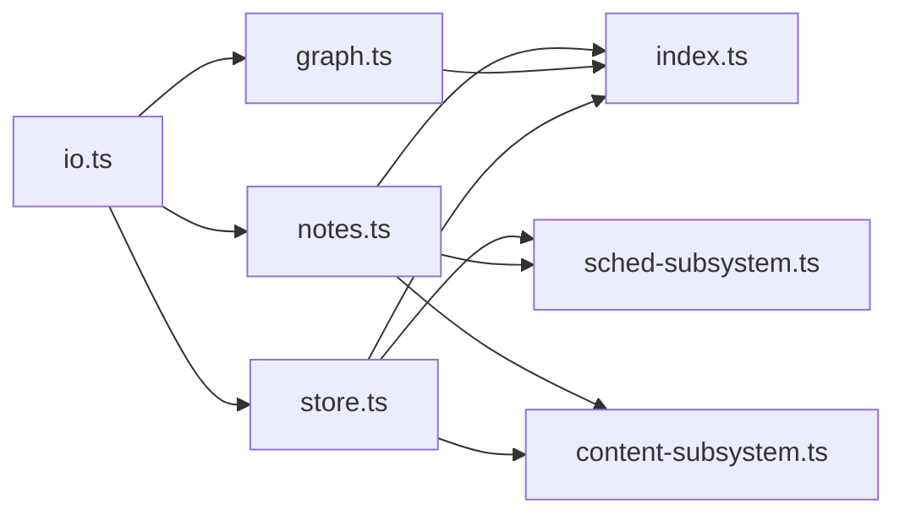

# 数据流设计

<cite>
**本文引用的文件**
- [src/engine/index.ts](file://src/engine/index.ts)
- [src/engine/graph.ts](file://src/engine/graph.ts)
- [src/engine/notes.ts](file://src/engine/notes.ts)
- [src/engine/store.ts](file://src/engine/store.ts)
- [src/engine/io.ts](file://src/engine/io.ts)
- [src/engine/sched-subsystem.ts](file://src/engine/sched-subsystem.ts)
- [src/engine/content-subsystem.ts](file://src/engine/content-subsystem.ts)
- [src/engine/types.ts](file://src/engine/types.ts)
</cite>

## 目录
1. [引言](#引言)
2. [项目结构](#项目结构)
3. [核心组件](#核心组件)
4. [架构总览](#架构总览)
5. [详细组件分析](#详细组件分析)
6. [依赖关系分析](#依赖关系分析)
7. [性能考量](#性能考量)
8. [故障排查指南](#故障排查指南)
9. [结论](#结论)
10. [附录](#附录)

## 引言
本文件面向 LearnHub 引擎的数据流设计，聚焦以下目标：
- 课程视图加载流程：图结构加载、frontmatter 状态读取、broken 笔记检测。
- 节点定位算法：「课程/节点」格式解析与多课程搜索逻辑。
- 数据一致性保证：原子写入、版本控制与回滚策略。
- 学习事件流：练习记录、复习日志等追加型数据的存储与处理。
- 通过具体代码路径展示关键步骤与错误处理机制。

## 项目结构
LearnHub 引擎以“门面 + 子系统”组织：
- 门面（LearnhubEngine）统一暴露能力，所有数据访问必须经门面。
- 子系统按领域拆分：GraphStore/Graph（图）、Notes（frontmatter）、Store（JSONL 流水）、Sched（调度/完成确认/XP）、Content（内容管线）等。
- IO 原语集中在 io.ts，提供 VaultFs 端口、原子写、JSONL 只读等基础能力。

图表来源
- [src/engine/index.ts:149-398](file://src/engine/index.ts#L149-L398)
- [src/engine/graph.ts:198-276](file://src/engine/graph.ts#L198-L276)
- [src/engine/notes.ts:16-334](file://src/engine/notes.ts#L16-L334)
- [src/engine/store.ts:46-479](file://src/engine/store.ts#L46-L479)
- [src/engine/io.ts:9-103](file://src/engine/io.ts#L9-L103)
- [src/engine/sched-subsystem.ts:83-555](file://src/engine/sched-subsystem.ts#L83-L555)
- [src/engine/content-subsystem.ts:262-290](file://src/engine/content-subsystem.ts#L262-L290)

章节来源
- [src/engine/index.ts:149-398](file://src/engine/index.ts#L149-L398)

## 核心组件
- 课程视图加载：loadView 组合 GraphStore 与 stateMap，返回 { graph, state, broken }。
- 节点定位：locateNode 支持「课程/节点」直命中；否则在启用课程中搜索唯一命中。
- frontmatter 读写：notes.ts 负责解析、校验、保存，使用 atomicWrite 保证原子性。
- 数据一致性：Store 的 JSONL 追加、proposal 全量原子替换、快照版本化；io.ts 提供 readJsonlLinesReport 对撕裂尾行豁免。
- 学习事件流：Store.appendPractice / appendReview / appendJournal 等追加型记录，read 侧统一走 readJsonlLines。

章节来源
- [src/engine/index.ts:410-435](file://src/engine/index.ts#L410-L435)
- [src/engine/notes.ts:16-334](file://src/engine/notes.ts#L16-L334)
- [src/engine/store.ts:46-479](file://src/engine/store.ts#L46-L479)
- [src/engine/io.ts:30-103](file://src/engine/io.ts#L30-L103)

## 架构总览
下图展示了课程视图加载与节点操作的关键调用链：从门面到图/笔记/存储子系统的协作。

图表来源
- [src/engine/index.ts:410-435](file://src/engine/index.ts#L410-L435)
- [src/engine/graph.ts:198-276](file://src/engine/graph.ts#L198-L276)
- [src/engine/notes.ts:247-334](file://src/engine/notes.ts#L247-L334)

## 详细组件分析

### 课程视图加载流程
- 图结构加载：GraphStore.load 读取 data/*.yaml，解析为 Region 列表；Graph 构造时计算邻接、拓扑序、深度、可达集、连通分量、就绪判定等。
- frontmatter 状态读取：stateMap 递归扫描课程目录下的 .md，解析 frontmatter 并校验，产出 state 映射与 broken 列表。
- Broken 笔记检测：validateNoteFrontmatter 对 stage/fsrs/content/practice 等字段进行契约校验；scanCourseNotes 将非法或不可读文件标记为 broken。

图表来源
- [src/engine/graph.ts:198-276](file://src/engine/graph.ts#L198-L276)
- [src/engine/graph.ts:278-443](file://src/engine/graph.ts#L278-L443)
- [src/engine/notes.ts:247-334](file://src/engine/notes.ts#L247-L334)

章节来源
- [src/engine/index.ts:410-417](file://src/engine/index.ts#L410-L417)
- [src/engine/graph.ts:198-276](file://src/engine/graph.ts#L198-L276)
- [src/engine/notes.ts:247-334](file://src/engine/notes.ts#L247-L334)

### 节点定位算法
- 「课程/节点」直命中：若包含 '/'，则按 '课程' 和 '节点' 两部分解析，查询注册表获取课程入口。
- 多课程搜索：若不包含 '/'，则遍历启用课程，逐个 loadView 检查 graph.nset 是否包含该节点名；唯一命中才返回；零或多命中分别抛错。

图表来源
- [src/engine/index.ts:419-435](file://src/engine/index.ts#L419-L435)

章节来源
- [src/engine/index.ts:419-435](file://src/engine/index.ts#L419-L435)

### 数据一致性保证机制
- 原子写入：atomicWrite 通过临时文件 + rename 实现整档原子替换，用于 notes.saveNote、graph.writeRegionDoc、store.saveProposals 等关键写点。
- 版本控制：
  - 笔记 frontmatter.content.version 递增，节级 ready/version+1。
  - 图快照：Store.saveSnapshot 按课程-v<N>.json 持久化。
  - 提案：Store.createProposal/saveProposals 全量原子替换，pair 联动守卫避免单边生效。
- 回滚策略：
  - 写单元 runWriteUnit：将多步写操作封装为步骤序列，失败上抛中止，不回滚不续跑；journal 记录每步名称，便于审计与恢复。
  - JSONL 追加：practice/review-log/journal 等追加型数据天然幂等可重放；读侧 readJsonlLinesReport 对撕裂尾行豁免，中段损坏报 Broken。

图表来源
- [src/engine/sched-subsystem.ts:178-265](file://src/engine/sched-subsystem.ts#L178-L265)
- [src/engine/io.ts:30-39](file://src/engine/io.ts#L30-L39)
- [src/engine/store.ts:168-206](file://src/engine/store.ts#L168-L206)

章节来源
- [src/engine/io.ts:30-39](file://src/engine/io.ts#L30-L39)
- [src/engine/store.ts:168-206](file://src/engine/store.ts#L168-L206)
- [src/engine/sched-subsystem.ts:178-265](file://src/engine/sched-subsystem.ts#L178-L265)

### 学习事件流的记录与处理
- 练习记录：Store.appendPractice 追加 JSONL 行，字段包括 ts/course/node/ex/answer/correct/judge/qid/elapsed_s/xp/predicted 等。
- 复习日志：Store.appendReview 追加 review-log，携带 rating/rating_source/elapsed_days/stability_before/difficulty_before/r_pred/exp/event_kind/exec_source 等。
- 日志读取：readJsonlLines/readJsonlLinesReport 统一读侧契约，缺失=Missing 合法空态，中段坏行=Broken 报错，末行撕裂豁免。
- 净值修正：勘误冲正（erratum）按净值聚合 practice 统计，原始 practice 永不改写。

图表来源
- [src/engine/store.ts:100-149](file://src/engine/store.ts#L100-L149)
- [src/engine/io.ts:56-103](file://src/engine/io.ts#L56-L103)

章节来源
- [src/engine/store.ts:100-149](file://src/engine/store.ts#L100-L149)
- [src/engine/io.ts:56-103](file://src/engine/io.ts#L56-L103)

### 前端/宿主交互示例（代码路径）
- 课程视图加载：[src/engine/index.ts:410-417](file://src/engine/index.ts#L410-L417)
- 节点定位：[src/engine/index.ts:419-435](file://src/engine/index.ts#L419-L435)
- frontmatter 校验与保存：[src/engine/notes.ts:96-219](file://src/engine/notes.ts#L96-L219), [src/engine/notes.ts:315-334](file://src/engine/notes.ts#L315-L334)
- 原子写与 JSONL 读取：[src/engine/io.ts:30-103](file://src/engine/io.ts#L30-L103)
- 完成确认写单元：[src/engine/sched-subsystem.ts:178-265](file://src/engine/sched-subsystem.ts#L178-L265)
- 内容重置与备份：[src/engine/content-subsystem.ts:262-290](file://src/engine/content-subsystem.ts#L262-L290)

## 依赖关系分析
- 低层模块（io.ts）无领域依赖，被 graph/notes/store 等回引，不构成反向依赖。
- 门面集中装配各子系统，子系统通过窄面注入回调（如 assertNoteOk/loadView/ensureNote），避免环依赖。
- Store 依赖 io.ts 的原子写与 JSONL 读取；SchedSubsystem 依赖 Store 与 Notes；ContentSubsystem 依赖 Notes 与 Store。

图表来源
- [src/engine/io.ts:9-103](file://src/engine/io.ts#L9-L103)
- [src/engine/notes.ts:1-334](file://src/engine/notes.ts#L1-L334)
- [src/engine/graph.ts:1-514](file://src/engine/graph.ts#L1-L514)
- [src/engine/store.ts:1-479](file://src/engine/store.ts#L1-L479)
- [src/engine/sched-subsystem.ts:1-555](file://src/engine/sched-subsystem.ts#L1-L555)
- [src/engine/content-subsystem.ts:1-1020](file://src/engine/content-subsystem.ts#L1-L1020)
- [src/engine/index.ts:1-859](file://src/engine/index.ts#L1-L859)

章节来源
- [src/engine/index.ts:149-398](file://src/engine/index.ts#L149-L398)

## 性能考量
- 图构建复杂度：Graph 构造遍历 nodes 与 pre 边，拓扑排序与可达集计算近似 O(V+E)，适合课程规模。
- 状态扫描：stateMap 递归扫描课程目录，I/O 密集但文件量小，天然最新。
- JSONL 读取：readJsonlLinesReport 线性扫描，撕裂尾行豁免减少重试成本。
- 缓存：门面缓存 sched 实例（按 courseRoot/null 键），避免重复初始化开销。

## 故障排查指南
- Broken 笔记：
  - 现象：loadView 返回 broken 列表；assertNoteOk 在定向操作前拦截并抛错。
  - 排查：查看 notes.validateNoteFrontmatter 的错误信息；运行 dataCheck 定位问题。
  - 参考路径：[src/engine/index.ts:437-448](file://src/engine/index.ts#L437-L448), [src/engine/notes.ts:96-219](file://src/engine/notes.ts#L96-L219)
- JSONL 损坏：
  - 现象：readJsonlLinesReport 抛出 Broken（带路径与行号）。
  - 处理：修复或删除该行；撕裂尾行自动豁免。
  - 参考路径：[src/engine/io.ts:56-103](file://src/engine/io.ts#L56-L103)
- 写单元失败：
  - 现象：runWriteUnit 步骤失败上抛，不回滚；journal 记录已执行步骤。
  - 处理：根据 journal 定位失败步骤，修复后重新执行。
  - 参考路径：[src/engine/sched-subsystem.ts:178-265](file://src/engine/sched-subsystem.ts#L178-L265)

章节来源
- [src/engine/index.ts:437-448](file://src/engine/index.ts#L437-L448)
- [src/engine/notes.ts:96-219](file://src/engine/notes.ts#L96-L219)
- [src/engine/io.ts:56-103](file://src/engine/io.ts#L56-L103)
- [src/engine/sched-subsystem.ts:178-265](file://src/engine/sched-subsystem.ts#L178-L265)

## 结论
LearnHub 引擎通过门面统一数据访问、子系统按领域拆分、IO 原语保障一致性的方式，实现了稳健的数据流设计：
- 课程视图加载清晰分离图结构与 frontmatter 状态，broken 检测显式浮出。
- 节点定位支持「课程/节点」直命中与多课程唯一匹配，歧义明确报错。
- 原子写、版本控制与写单元机制确保关键写点的可靠性与可审计性。
- 学习事件流采用追加型 JSONL，读侧统一契约，支持净值修正与健壮读取。

## 附录
- 类型定义参考：节点键、成长算子、提案记录等见 types.ts。
- 章节来源
  - [src/engine/types.ts:228-255](file://src/engine/types.ts#L228-L255)