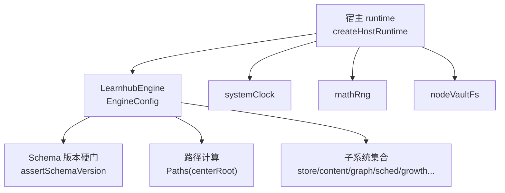
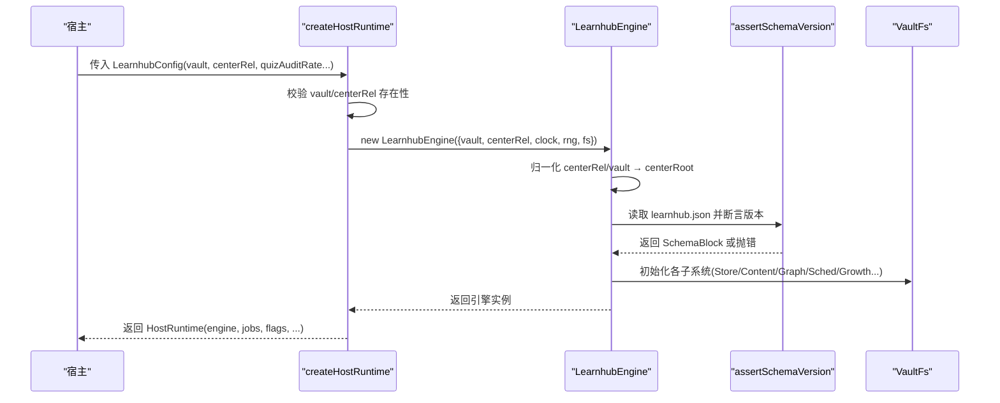
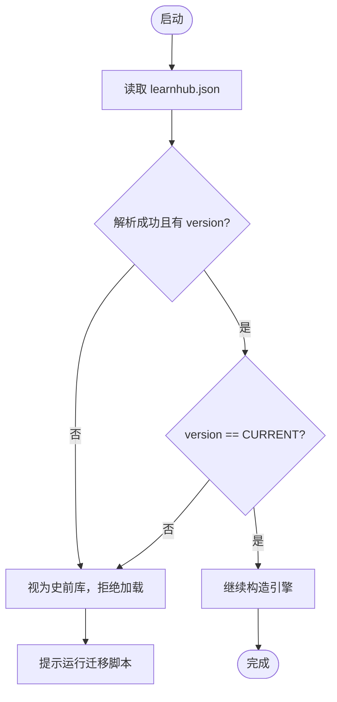
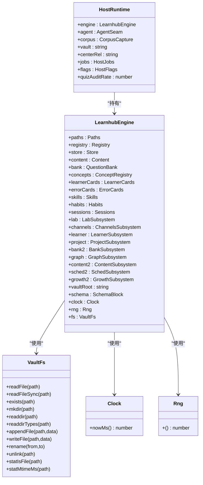

# 配置管理

<cite>
**本文引用的文件**
- [src/engine/index.ts](file://src/engine/index.ts)
- [src/host/runtime.ts](file://src/host/runtime.ts)
- [src/host/clock.ts](file://src/host/clock.ts)
- [src/host/vault-fs.ts](file://src/host/vault-fs.ts)
- [src/engine/schema.ts](file://src/engine/schema.ts)
- [tests/schema-cutover.test.ts](file://tests/schema-cutover.test.ts)
- [preset/learnhub/preset.yml](file://preset/learnhub/preset.yml)
- [preset/learnhub/user-root-composition.yml](file://preset/learnhub/user-root-composition.yml)
- [src/engine/params.ts](file://src/engine/params.ts)
</cite>

## 目录
1. [简介](#简介)
2. [项目结构](#项目结构)
3. [核心组件](#核心组件)
4. [架构总览](#架构总览)
5. [详细组件分析](#详细组件分析)
6. [依赖关系分析](#依赖关系分析)
7. [性能考量](#性能考量)
8. [故障排查指南](#故障排查指南)
9. [结论](#结论)
10. [附录](#附录)

## 简介
本文件面向 LearnHub 引擎的配置管理系统，聚焦 EngineConfig 接口的各项配置选项、schema 版本管理机制、预设配置系统、运行时参数动态调整与配置验证流程。目标是帮助读者在不深入源码的情况下，理解如何正确装配引擎、迁移数据、覆盖默认行为，并在不同场景下采用最佳实践。

## 项目结构
LearnHub 的配置体系由三层构成：
- 宿主装配层：负责读取部署级配置（vault、centerRel、AI 模型等），并注入时钟、随机源与文件系统适配到引擎。
- 引擎门面层：定义 EngineConfig 接口，构造 LearnhubEngine，执行 schema 版本硬门，组装各子系统。
- 存储与时间抽象层：通过 VaultFs、Clock、Rng 将“读盘/写盘/时间/随机”从引擎中解耦，便于测试与替换实现。

图表来源
- [src/host/runtime.ts:138-193](file://src/host/runtime.ts#L138-L193)
- [src/engine/index.ts:133-224](file://src/engine/index.ts#L133-L224)
- [src/host/clock.ts:8-12](file://src/host/clock.ts#L8-L12)
- [src/host/vault-fs.ts:11-24](file://src/host/vault-fs.ts#L11-L24)
- [src/engine/schema.ts:63-79](file://src/engine/schema.ts#L63-L79)

章节来源
- [src/host/runtime.ts:138-193](file://src/host/runtime.ts#L138-L193)
- [src/engine/index.ts:133-224](file://src/engine/index.ts#L133-L224)

## 核心组件
- EngineConfig：引擎启动所需的最小配置集，包含 vault 根路径、学习中心相对路径、时钟、随机源、文件系统接口。
- LearnhubEngine：引擎门面，负责路径归一化、schema 版本检查、子系统装配与调度器缓存。
- HostRuntime：宿主运行时对象，承载可变态（engine、agent、jobs、flags 等）与部署配置（vault、centerRel、quizAuditRate 等）。
- VaultFs/Clock/Rng：存储与时钟/随机抽象，使引擎可被测试与替换实现。

章节来源
- [src/engine/index.ts:133-147](file://src/engine/index.ts#L133-L147)
- [src/host/runtime.ts:23-44](file://src/host/runtime.ts#L23-L44)
- [src/host/runtime.ts:115-133](file://src/host/runtime.ts#L115-L133)
- [src/host/vault-fs.ts:11-24](file://src/host/vault-fs.ts#L11-L24)
- [src/host/clock.ts:8-12](file://src/host/clock.ts#L8-L12)

## 架构总览
下图展示了从宿主装配到引擎构造的完整调用链，包括配置校验、路径计算、schema 版本硬门与子系统装配。

图表来源
- [src/host/runtime.ts:138-193](file://src/host/runtime.ts#L138-L193)
- [src/engine/index.ts:212-224](file://src/engine/index.ts#L212-L224)
- [src/engine/schema.ts:63-79](file://src/engine/schema.ts#L63-L79)

## 详细组件分析

### EngineConfig 配置项说明与设置方法
- vault（必填）：vault 根目录绝对路径。用于定位课程与状态文件。
- centerRel（可选）：学习中心相对 vault 的路径，缺省为“学习中心”。用于拼接 centerRoot。
- clock（必填）：时钟端口，提供 nowMs()。宿主注入 systemClock；测试可注入固定时钟以获得确定性。
- rng（必填）：随机源端口，提供 Math.random 风格的函数。宿主注入 mathRng；测试可注入定长随机流以复现实验。
- fs（必填）：VaultFs 文件系统接口，统一所有读盘/落盘操作。宿主注入 nodeVaultFs。

设置要点
- 路径归一化：vault 与 centerRel 在构造时进行反斜杠转义与首尾斜杠清理，确保跨平台一致性。
- 注入点：宿主 createHostRuntime 负责装配上述端口，并通过 LearnhubEngine 构造函数注入。

章节来源
- [src/engine/index.ts:133-147](file://src/engine/index.ts#L133-L147)
- [src/engine/index.ts:212-224](file://src/engine/index.ts#L212-L224)
- [src/host/runtime.ts:138-163](file://src/host/runtime.ts#L138-L163)
- [src/host/clock.ts:8-12](file://src/host/clock.ts#L8-L12)
- [src/host/vault-fs.ts:11-24](file://src/host/vault-fs.ts#L11-L24)

### Schema 版本管理机制
- 当前主版本常量：CURRENT_SCHEMA_VERSION = 3。
- 版本位置：学习中心 state/learnhub.json 的 schema.version。
- 硬门策略：非当前主版本（含缺失/损坏/史前库）一律拒载，抛出带迁移指引的错误。
- 断裂档案：breaks 字段记录历史断裂，供一次性迁移脚本使用；引擎不消费该字段。
- 子格式演进：formats 允许主版本内自由演变；破坏性变更仍走主版本断裂。

迁移与兼容性
- 旧库必须运行一次性迁移脚本（scripts/migrate-v2.mjs），将现有课程树整体移入存档区，写入新 schema.version 并追加 breaks。
- 首次启动且全新 vault（无 learnhub.json 与课程注册表）会直接写入 CURRENT_SCHEMA_VERSION，免跑迁移脚本。

图表来源
- [src/engine/schema.ts:16-17](file://src/engine/schema.ts#L16-L17)
- [src/engine/schema.ts:63-79](file://src/engine/schema.ts#L63-L79)
- [src/host/runtime.ts:155-162](file://src/host/runtime.ts#L155-L162)

章节来源
- [src/engine/schema.ts:16-17](file://src/engine/schema.ts#L16-L17)
- [src/engine/schema.ts:63-79](file://src/engine/schema.ts#L63-L79)
- [tests/schema-cutover.test.ts:1-25](file://tests/schema-cutover.test.ts#L1-25)
- [src/host/runtime.ts:155-162](file://src/host/runtime.ts#L155-L162)

### 预设配置系统工作原理
- preset.yml：描述预设名称与说明，作为 agent 或工具链的元信息入口。
- user-root-composition.yml：用户根占位 preset，实际 composition 引用仓库内维护的文件，保持单一事实来源。
- 覆盖规则：安装时将 user-root-composition.yml 复制到本机指定目录，并将 path 改为本机仓库真实位置；修改仓库文件即生效，无需同步拷贝。

注意
- 本预设主要用于 agent/技能库组织，不直接参与引擎 EngineConfig 装配；但可作为上层编排的元数据来源。

章节来源
- [preset/learnhub/preset.yml:1-3](file://preset/learnhub/preset.yml#L1-L3)
- [preset/learnhub/user-root-composition.yml:1-9](file://preset/learnhub/user-root-composition.yml#L1-L9)

### 运行时参数的动态调整机制与配置验证
- 宿主侧运行时参数（LearnhubConfig）：
  - vault、centerRel：部署路径，缺失或不存在立即失败。
  - provider、model、fastEffort、deepEffort：AI 生成/判卷相关参数，路由不支持时自动降级。
  - quizAuditRate：出题第二意见门抽样率，必须在 0–1 之间，否则装配时报错。
  - corpusDir：生成语料落盘目录覆盖，缺省使用 engine.paths.corpusDir。
- 引擎内部可调参数（params.ts）：
  - 期望保留率、复习占比、每日能力、过载因子、软重启阈值、XP 定价、日界缺省、复诊窗口、生长闸门阈值等。
  - 这些参数多为只读常量，用于驱动调度、评估与 UI 呈现；如需持久化覆盖（如 day_cutoff），通过 state/learnhub.json 的对应字段实现。

验证与容错
- 宿主装配阶段对必填字段与范围进行严格校验（fail loud）。
- 引擎内部参数多配合 clamp 或条件逻辑，避免越界影响稳定性。

章节来源
- [src/host/runtime.ts:23-44](file://src/host/runtime.ts#L23-L44)
- [src/host/runtime.ts:138-163](file://src/host/runtime.ts#L138-L163)
- [src/engine/params.ts:1-59](file://src/engine/params.ts#L1-L59)

### 配置示例与最佳实践
- 最小可用装配（宿主侧）：
  - 提供 vault 与 centerRel，并确保目录存在；注入 systemClock、mathRng、nodeVaultFs。
  - 若需要控制出题质量，设置 quizAuditRate 在 0–1 范围内。
- 测试环境：
  - 使用固定时钟与定长随机源，保证同一输入同一输出。
  - 通过自定义 VaultFs 实现隔离读写，避免污染真实 vault。
- 生产环境：
  - 确保 learnhub.json 已具备 CURRENT_SCHEMA_VERSION；旧库先运行迁移脚本。
  - 合理设置 daily capacity、overload factor、recovery clear ratio 等参数，平衡负载与恢复速度。
  - 使用 corpusDir 集中收集生成语料，便于离线评审与审计。

章节来源
- [src/host/runtime.ts:138-193](file://src/host/runtime.ts#L138-L193)
- [src/engine/index.ts:212-224](file://src/engine/index.ts#L212-L224)
- [src/engine/params.ts:1-59](file://src/engine/params.ts#L1-L59)

## 依赖关系分析
- 宿主 runtime 依赖：
  - 引擎门面 LearnhubEngine（构造与调用）
  - AgentSeam（统一 AI 调用缝）
  - LLM 适配（llmSeam/llmStreamSeam）
  - 语料捕获（corpus capture）
  - 时钟/随机/文件系统适配
- 引擎门面依赖：
  - Paths（路径计算）
  - Store/Content/Graph/Sched/Growth 等子系统
  - Schema 版本检查
- 存储与时间抽象：
  - VaultFs：统一文件读写、目录枚举、类型判断、时间戳获取。
  - Clock/Rng：时间/随机抽象，便于测试与替换。

图表来源
- [src/host/runtime.ts:115-133](file://src/host/runtime.ts#L115-L133)
- [src/engine/index.ts:149-196](file://src/engine/index.ts#L149-L196)
- [src/host/vault-fs.ts:11-24](file://src/host/vault-fs.ts#L11-L24)
- [src/host/clock.ts:8-12](file://src/host/clock.ts#L8-L12)

章节来源
- [src/host/runtime.ts:115-133](file://src/host/runtime.ts#L115-L133)
- [src/engine/index.ts:149-196](file://src/engine/index.ts#L149-L196)
- [src/host/vault-fs.ts:11-24](file://src/host/vault-fs.ts#L11-L24)
- [src/host/clock.ts:8-12](file://src/host/clock.ts#L8-L12)

## 性能考量
- 调度器缓存：LearnhubEngine 按课程 root 缓存 FSRS 实例，避免每答一题重建与重复读盘。
- 路径与文件访问：通过 VaultFs 统一 IO，减少耦合；批量扫描与快照尽量复用 store/graph 结构。
- 日志与语料：运行日志与语料捕获异步落盘，失败静默，不影响主流程。
- 参数调优：根据 DAILY_CAPACITY、OVERLOAD_FACTOR、RECOVERY_CLEAR_RATIO 等参数调节负载与恢复节奏，避免过载与频繁重启。

章节来源
- [src/engine/index.ts:198-210](file://src/engine/index.ts#L198-L210)
- [src/host/runtime.ts:195-231](file://src/host/runtime.ts#L195-L231)
- [src/engine/params.ts:1-59](file://src/engine/params.ts#L1-L59)

## 故障排查指南
- 启动失败（schema 版本不符或缺失）：
  - 现象：构造 LearnhubEngine 时抛出错误，提示 learnhub.json 版本不匹配或缺失。
  - 处理：运行一次性迁移脚本，将课程树移入存档区并写入新 schema.version；或确认全新 vault 已自动生成版本戳。
- 路径不存在：
  - 现象：config.vault 或学习中心目录不存在时报错。
  - 处理：检查 profile patch 中的 vault 配置与实际目录是否存在。
- 参数非法：
  - 现象：quizAuditRate 不在 0–1 范围时报错。
  - 处理：修正配置值后重启。
- 任务注册表损坏：
  - 现象：state/生成任务.json 不可读或非数组时报错。
  - 处理：修复或删除该文件后重启宿主；broken 期间拒绝写回防止覆盖。

章节来源
- [src/engine/schema.ts:63-79](file://src/engine/schema.ts#L63-L79)
- [src/host/runtime.ts:138-163](file://src/host/runtime.ts#L138-L163)
- [src/engine/index.ts:724-753](file://src/engine/index.ts#L724-L753)

## 结论
LearnHub 的配置管理体系通过清晰的层次划分与严格的装配校验，确保了引擎的可测试性、可移植性与稳定性。EngineConfig 定义了最小必要配置，HostRuntime 负责部署级装配与运行时参数管理，schema 版本硬门保障数据一致性，预设配置系统提供上层编排元信息。遵循本文的最佳实践与故障排查步骤，可在不同环境中稳定运行并灵活扩展。

## 附录
- 关键常量与参数参考：
  - 期望保留率、复习占比、每日能力、过载因子、软重启阈值、XP 定价、日界缺省、复诊窗口、生长闸门阈值等，详见 params.ts。
- 预设文件位置：
  - preset/learnhub/preset.yml 与 user-root-composition.yml，用于 agent/技能库组织与引用。

章节来源
- [src/engine/params.ts:1-59](file://src/engine/params.ts#L1-L59)
- [preset/learnhub/preset.yml:1-3](file://preset/learnhub/preset.yml#L1-L3)
- [preset/learnhub/user-root-composition.yml:1-9](file://preset/learnhub/user-root-composition.yml#L1-L9)