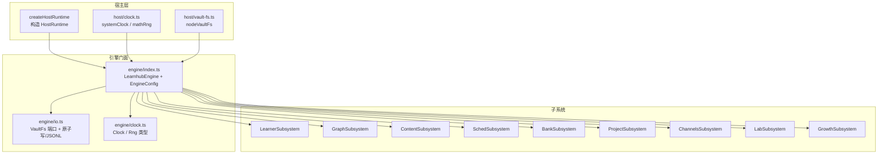
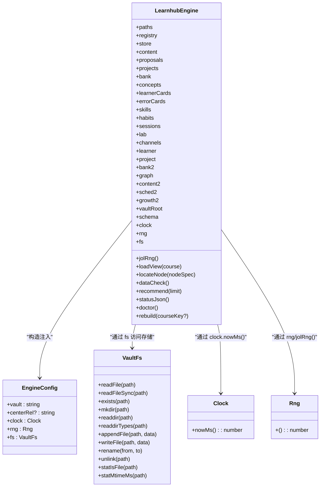
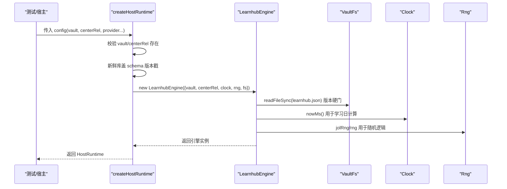

# 门面设计模式

<cite>
**本文引用的文件**
- [src/engine/index.ts](file://src/engine/index.ts)
- [src/engine/clock.ts](file://src/engine/clock.ts)
- [src/engine/io.ts](file://src/engine/io.ts)
- [src/host/runtime.ts](file://src/host/runtime.ts)
- [src/host/clock.ts](file://src/host/clock.ts)
- [tests/host-runtime.test.ts](file://tests/host-runtime.test.ts)
</cite>

## 目录
1. [简介](#简介)
2. [项目结构](#项目结构)
3. [核心组件](#核心组件)
4. [架构总览](#架构总览)
5. [详细组件分析](#详细组件分析)
6. [依赖关系分析](#依赖关系分析)
7. [性能考量](#性能考量)
8. [故障排查指南](#故障排查指南)
9. [结论](#结论)
10. [附录：初始化与使用示例](#附录初始化与使用示例)

## 简介
本文件围绕 LearnHub 引擎的门面设计模式，系统性阐述 LearnhubEngine 作为单一入口点的设计理念与实践：如何协调各子系统、统一数据访问接口与错误处理策略；并详解 EngineConfig 配置接口的字段含义与装配方式（vault 路径、时钟端口、随机源、文件系统抽象）。同时说明门面模式在依赖注入中的作用，以及如何通过构造函数注入实现松耦合的组件装配。文末提供基于仓库代码的初始化与基本使用方法指引。

## 项目结构
LearnHub 引擎将“领域能力”封装在 engine/ 下，并通过 src/engine/index.ts 暴露门面类 LearnhubEngine；宿主层在 src/host/runtime.ts 中完成运行时装配，将 Clock/Rng/VaultFs 等适配器注入到引擎。测试位于 tests/ 下，用于验证运行时行为与契约。

图表来源
- [src/host/runtime.ts:138-193](file://src/host/runtime.ts#L138-L193)
- [src/engine/index.ts:133-398](file://src/engine/index.ts#L133-L398)
- [src/engine/io.ts:9-28](file://src/engine/io.ts#L9-L28)
- [src/engine/clock.ts:11-19](file://src/engine/clock.ts#L11-L19)

章节来源
- [src/host/runtime.ts:138-193](file://src/host/runtime.ts#L138-L193)
- [src/engine/index.ts:133-398](file://src/engine/index.ts#L133-L398)

## 核心组件
- LearnhubEngine：引擎门面，聚合所有子系统与基础能力，对外暴露统一的业务方法；内部负责子系统装配、路径归一、schema 版本硬门、学习日计算、节点定位与前置校验等。
- EngineConfig：构造门面所需的配置对象，包含 vault 根路径、中心相对路径、时钟、随机源、文件系统抽象。
- VaultFs：文件系统抽象端口，屏蔽底层 node:fs 差异，使引擎零直接依赖系统 IO。
- Clock/Rng：时间与时序相关行为的抽象端口，便于测试注入确定性输入。

章节来源
- [src/engine/index.ts:133-398](file://src/engine/index.ts#L133-L398)
- [src/engine/io.ts:9-28](file://src/engine/io.ts#L9-L28)
- [src/engine/clock.ts:11-19](file://src/engine/clock.ts#L11-L19)

## 架构总览
门面模式在此处的价值在于：
- 统一入口：调用方仅依赖 LearnhubEngine，无需感知内部子系统划分。
- 依赖注入：通过 EngineConfig 将外部适配（时钟、随机、文件系统）注入，降低耦合，提升可测性。
- 数据访问收口：所有读盘/落盘均经 VaultFs，避免引擎内直连系统 IO。
- 错误处理策略：Broken/Missing 语义在门面与子系统边界集中定义，保证一致的错误传播与提示。

图表来源
- [src/engine/index.ts:133-398](file://src/engine/index.ts#L133-L398)
- [src/engine/io.ts:9-28](file://src/engine/io.ts#L9-L28)
- [src/engine/clock.ts:11-19](file://src/engine/clock.ts#L11-L19)

## 详细组件分析

### LearnhubEngine：单一入口与子系统编排
- 职责边界：一切数据访问收口至门面背后模块；工具、HTTP 路由、UI 不得绕过 engine 直写数据文件。
- 构造期：
  - 路径归一：vault 与 centerRel 规范化为 posix 风格，生成 Paths。
  - schema 版本硬门：同步读取 learnhub.json 并断言当前主版本，非当前版本拒载。
  - 子系统装配：创建 Registry、Store、Content、QuestionBank、ConceptRegistry、LearnerCards、ErrorCards、Skills、Habits、NoteSourceManifest、AnkiMirror、Sessions，以及 Lab/Channels/Learner/Project/Bank/Graph/Content/Sched/Growth 等子系统实例，并通过回调互相注入依赖。
  - 调度器缓存：按课程 root 缓存 FSRS 实例，减少重复构建成本。
- 运行期：
  - 学习日计算：从配置读取 cutoff，结合 clock.nowMs() 计算今日日期。
  - 视图加载：loadView 组合 GraphStore 与 stateMap，返回图与状态。
  - 节点定位：支持“课程/节点”或跨课唯一命中定位，失败时抛出明确错误。
  - 数据体检：dataCheck/questionAudit 只读扫描，输出缺失/损坏清单。
  - 推荐与状态：recommend/statusJson 聚合多域信息，形成面向 UI 的文档。
  - 重建：rebuild 执行审计并更新就绪列表。

章节来源
- [src/engine/index.ts:1-147](file://src/engine/index.ts#L1-L147)
- [src/engine/index.ts:149-398](file://src/engine/index.ts#L149-L398)
- [src/engine/index.ts:400-612](file://src/engine/index.ts#L400-L612)

### EngineConfig：配置接口与注入点
- vault：必填，vault 根目录绝对路径。
- centerRel：可选，学习中心相对 vault 的路径，缺省为“学习中心”。
- clock：必填，Clock 端口，提供 nowMs() 获取当前毫秒时间戳。
- rng：必填，Rng 端口，提供 [0,1) 均匀分布随机数。
- fs：必填，VaultFs 端口，引擎侧一切读盘落盘的唯通道。

章节来源
- [src/engine/index.ts:133-147](file://src/engine/index.ts#L133-L147)

### VaultFs：文件系统抽象
- 目的：将引擎与具体文件系统解耦，测试可替换为内存/影子实现。
- 能力：异步/同步读、存在性检查、递归 mkdir、目录枚举、追加/写入/重命名/删除、统计 isFile/mtime 等。
- 原子写：atomicWrite 通过临时文件 + rename 实现原子落盘。
- JSONL 读取：readJsonlLines/readJsonlLinesReport 提供健壮的行级解析与撕裂尾行豁免。

章节来源
- [src/engine/io.ts:1-103](file://src/engine/io.ts#L1-L103)

### Clock/Rng：时间与随机抽象
- Clock：仅提供 nowMs()，日历语义由 dates.ts 纯函数处理。
- Rng：函数类型 () => number，用于 JOL 抽查、洗牌等随机逻辑。
- 宿主实现：systemClock/mathRng 分别对应 Date.now() 与 Math.random。

章节来源
- [src/engine/clock.ts:1-19](file://src/engine/clock.ts#L1-L19)
- [src/host/clock.ts:1-13](file://src/host/clock.ts#L1-L13)

### 门面模式在依赖注入中的作用
- 通过构造函数注入 EngineConfig，将外部适配（时钟、随机、文件系统）注入到引擎，使引擎不关心具体实现。
- 子系统之间通过回调与共享实例进行装配，保持高内聚、低耦合。
- 测试可通过注入固定时钟与定长随机流，实现“同一输入同一输出”的可断言性。

章节来源
- [src/host/runtime.ts:138-193](file://src/host/runtime.ts#L138-L193)
- [src/engine/index.ts:212-398](file://src/engine/index.ts#L212-L398)

## 依赖关系分析
- 宿主层 createHostRuntime 负责：
  - 校验部署路径（vault/centerRel 存在性）。
  - 新鲜库出生盖戳（learnhub.json 写入当前 schema 版本）。
  - 构造 LearnhubEngine，注入 systemClock、mathRng、nodeVaultFs。
  - 构造 AgentSeam 与语料捕获器，组装 HostRuntime。
- 引擎内部：
  - 通过 VaultFs 访问文件系统，避免直接依赖 node:fs。
  - 通过 Clock/Rng 抽象时间与时序行为。
  - 子系统间通过回调与共享实例协作，如 growth2.growthGateErrors、sched2.sedimentFold 等。

图表来源
- [src/host/runtime.ts:138-193](file://src/host/runtime.ts#L138-L193)
- [src/engine/index.ts:212-225](file://src/engine/index.ts#L212-L225)

章节来源
- [src/host/runtime.ts:138-193](file://src/host/runtime.ts#L138-L193)
- [src/engine/index.ts:212-225](file://src/engine/index.ts#L212-L225)

## 性能考量
- 调度器缓存：按课程 root 缓存 FSRS 实例，避免每答一题重建与重复读参带来的开销。
- 视图加载：loadView 每次现读图与状态，文件量小且天然最新，适合读多写少的场景。
- 原子写：atomicWrite 使用临时文件 + rename，避免部分写入导致的损坏。
- JSONL 读取：readJsonlLinesReport 对撕裂尾行做豁免，减少异常分支成本。

章节来源
- [src/engine/index.ts:198-210](file://src/engine/index.ts#L198-L210)
- [src/engine/index.ts:410-417](file://src/engine/index.ts#L410-L417)
- [src/engine/io.ts:30-39](file://src/engine/io.ts#L30-L39)
- [src/engine/io.ts:71-96](file://src/engine/io.ts#L71-L96)

## 故障排查指南
- 版本硬门失败：非当前主版本的 learnhub.json 会拒绝载入，需升级或迁移。
- 节点 Broken：定向操作前会检查目标笔记是否 Broken，抛错携带位置与原因，便于快速定位。
- 生成任务档损坏：loadGenJobs 对 ENOENT 视为合法空态，其他读错误或非法 JSON 上抛 Broken，宿主应捕获并给出修复指引。
- 数据体检：dataCheck/questionAudit 提供只读扫描结果，帮助识别缺失/违规项。

章节来源
- [src/engine/index.ts:222-225](file://src/engine/index.ts#L222-L225)
- [src/engine/index.ts:444-463](file://src/engine/index.ts#L444-L463)
- [src/engine/index.ts:724-753](file://src/engine/index.ts#L724-L753)
- [src/engine/index.ts:467-520](file://src/engine/index.ts#L467-L520)

## 结论
LearnhubEngine 通过门面模式将复杂子系统与外部适配收敛为单一入口，借助 EngineConfig 的构造函数注入实现松耦合与高可测性。VaultFs/Clock/Rng 的抽象确保引擎与平台细节解耦，错误处理策略在边界处集中定义，提升了系统的稳定性与可维护性。

## 附录：初始化与使用示例
以下示例基于仓库中的实际装配与测试用例，展示如何构造引擎并调用基本方法。为避免泄露实现细节，此处以路径引用代替代码片段。

- 宿主装配引擎
  - 参考：[createHostRuntime 构造流程:138-193](file://src/host/runtime.ts#L138-L193)
  - 关键点：校验 vault/centerRel、新鲜库盖戳、注入 systemClock/mathRng/nodeVaultFs。

- 测试中构造 runtime
  - 参考：[makeRuntime 与 createHostRuntime 调用:71-76](file://tests/host-runtime.test.ts#L71-L76)
  - 关键点：临时 vault、空旗标、隔离环境。

- 基本用法
  - 加载视图：[loadView:410-417](file://src/engine/index.ts#L410-L417)
  - 定位节点：[locateNode:419-435](file://src/engine/index.ts#L419-L435)
  - 数据体检：[dataCheck:467-470](file://src/engine/index.ts#L467-L470)、[questionAudit:471-520](file://src/engine/index.ts#L471-L520)
  - 推荐与状态：[recommend:561-569](file://src/engine/index.ts#L561-L569)、[statusJson:534-559](file://src/engine/index.ts#L534-L559)
  - 重建：[rebuild:597-612](file://src/engine/index.ts#L597-L612)

- 配置字段说明
  - EngineConfig 字段：[EngineConfig:133-147](file://src/engine/index.ts#L133-L147)
  - Clock/Rng 类型：[Clock/Rng:11-19](file://src/engine/clock.ts#L11-L19)
  - VaultFs 端口：[VaultFs:9-28](file://src/engine/io.ts#L9-L28)