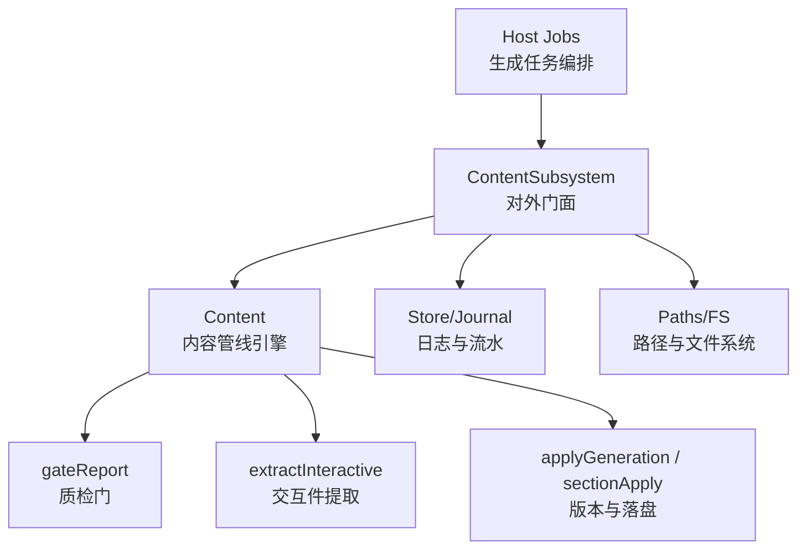
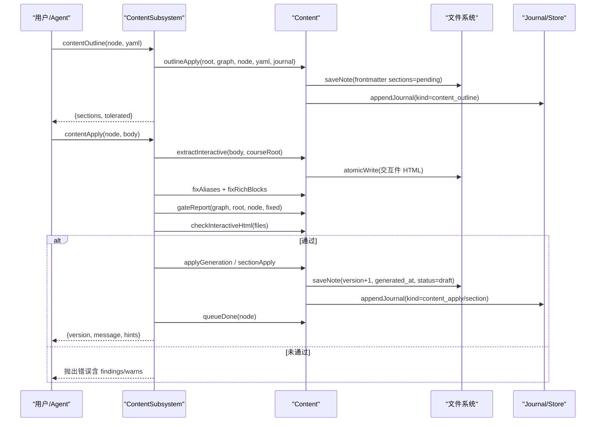
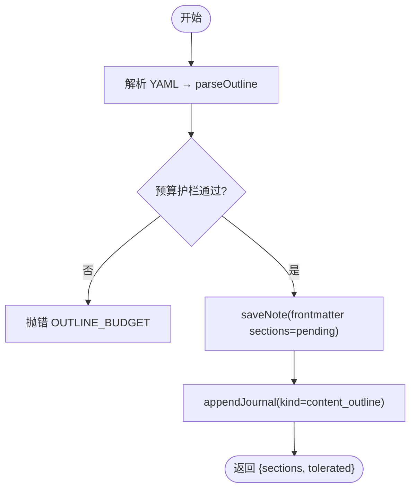
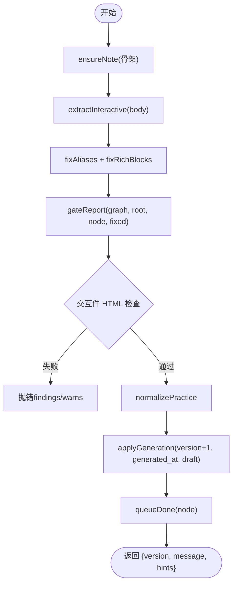
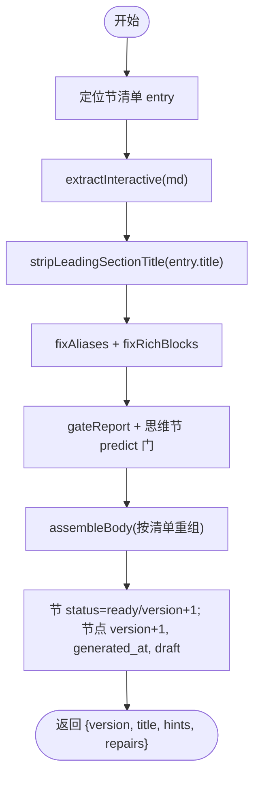
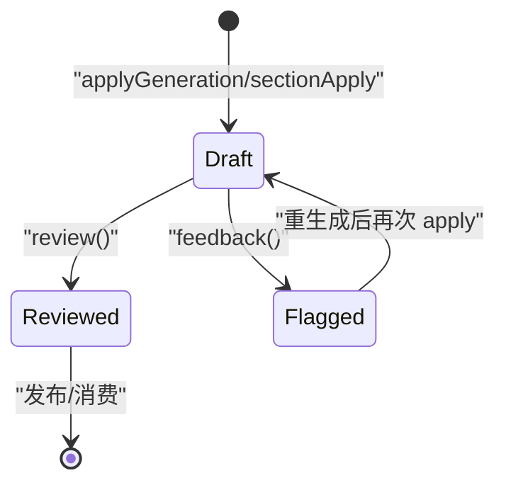
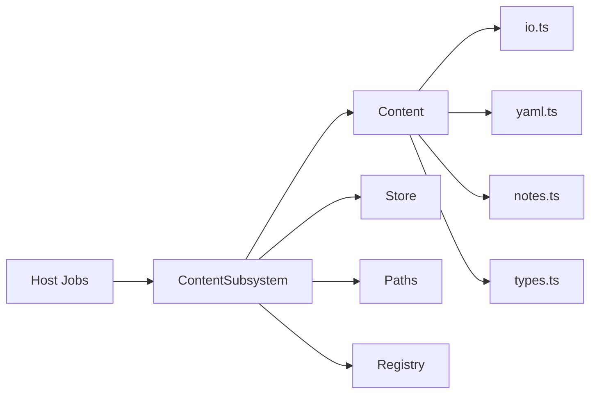

# 内容创建流程

<cite>
**本文引用的文件**
- [src/engine/content.ts](file://src/engine/content.ts)
- [src/engine/content-subsystem.ts](file://src/engine/content-subsystem.ts)
- [shared/content-renderers.ts](file://shared/content-renderers.ts)
- [src/host/jobs.ts](file://src/host/jobs.ts)
- [src/engine/types.ts](file://src/engine/types.ts)
</cite>

## 目录
1. [简介](#简介)
2. [项目结构](#项目结构)
3. [核心组件](#核心组件)
4. [架构总览](#架构总览)
5. [详细组件分析](#详细组件分析)
6. [依赖关系分析](#依赖关系分析)
7. [性能考量](#性能考量)
8. [故障排查指南](#故障排查指南)
9. [结论](#结论)
10. [附录：API 使用与最佳实践](#附录api-使用与最佳实践)

## 简介
本技术文档聚焦 LearnHub 的内容创建流程，从大纲生成到正文落盘的全链路机制。重点覆盖：
- 内容管线核心方法：contentOutline、contentApply、contentSection 的工作机制
- 内容状态机转换：draft→pending→ready 的流转条件与触发点
- 版本管理：version 递增、generated_at 时间戳更新与增量更新策略
- 质检门（gateReport）检查规则与错误处理
- 交互件文件处理：learnhub-interactive 标记块解析、HTML 落盘、引用块重组
- API 使用示例与最佳实践
- 错误处理策略与数据一致性保证

## 项目结构
内容创建相关代码主要分布在引擎层与宿主层：
- 引擎层 content.ts：实现内容管线、质检门、节清单/拆节、正文组装、练习区处理等
- 子系统 content-subsystem.ts：对外门面，封装课程注册表、视图加载、存储写入、队列完成等跨域调用
- 共享渲染器 shared/content-renderers.ts：渲染器与节类型清单、交互件类型、预测门解析
- 宿主 jobs.ts：生成任务编排、逐节生成管线、失败回退与续跑
- 类型 types.ts：阶段机、内容状态、节清单条目等核心类型定义



图表来源
- [src/engine/content-subsystem.ts:192-228](file://src/engine/content-subsystem.ts#L192-L228)
- [src/engine/content.ts:758-788](file://src/engine/content.ts#L758-L788)
- [src/engine/content.ts:949-1011](file://src/engine/content.ts#L949-L1011)
- [src/host/jobs.ts:791-797](file://src/host/jobs.ts#L791-L797)

章节来源
- [src/engine/content.ts:1-100](file://src/engine/content.ts#L1-L100)
- [src/engine/content-subsystem.ts:1-100](file://src/engine/content-subsystem.ts#L1-L100)
- [shared/content-renderers.ts:1-120](file://shared/content-renderers.ts#L1-L120)
- [src/host/jobs.ts:791-797](file://src/host/jobs.ts#L791-L797)
- [src/engine/types.ts:8-61](file://src/engine/types.ts#L8-L61)

## 核心组件
- ContentSubsystem：提供 contentOutline、contentApply、contentSection、contentCheck、contentReset 等门面方法，负责课程解析、视图加载、笔记骨架确保、存储写入与队列完成
- Content：实现内容管线核心逻辑，包括上下文包、提示词模板、质检门、节清单/拆节、正文组装、练习区处理、反馈与重生成、应用生成与审核
- 共享渲染器：定义渲染器能力、节类型菜单、交互件类型、预测门解析与 UI 渲染契约
- Host Jobs：编排生成任务，按拓扑序逐节生成，处理失败回退与续跑

章节来源
- [src/engine/content-subsystem.ts:192-308](file://src/engine/content-subsystem.ts#L192-L308)
- [src/engine/content.ts:138-277](file://src/engine/content.ts#L138-L277)
- [shared/content-renderers.ts:20-87](file://shared/content-renderers.ts#L20-L87)
- [src/host/jobs.ts:791-797](file://src/host/jobs.ts#L791-L797)

## 架构总览
内容创建流程分为三个阶段：
1. 大纲生成：AI 输出 YAML → parseOutline → outlineApply → 写入 frontmatter sections（全 pending）
2. 正文生成：逐节生成 → extractInteractive → fixAliases → gateReport → checkInteractiveHtml → normalizePractice → applyGeneration/sectionApply → 落盘并更新版本与状态
3. 出题与收尾：就绪节自动出题，失败节点记录结构化失败清单，支持断点续跑



图表来源
- [src/engine/content-subsystem.ts:192-228](file://src/engine/content-subsystem.ts#L192-L228)
- [src/engine/content.ts:790-815](file://src/engine/content.ts#L790-L815)
- [src/engine/content.ts:892-915](file://src/engine/content.ts#L892-L915)
- [src/engine/content.ts:1381-1405](file://src/engine/content.ts#L1381-L1405)

## 详细组件分析

### 大纲生成：contentOutline
- 输入：课程键、节点、YAML 文本
- 处理：parseOutline 校验 schema（id 唯一、type ∈ 节类型菜单、title 非空），计算预算护栏，写入 frontmatter content.sections（全 pending）
- 输出：节清单与 tolerated（解析容忍命中）
- 关键点：大纲期定的 tier 随大纲记录；PS-I 顺序变体留痕；预算超限时抛错



图表来源
- [src/engine/content.ts:829-854](file://src/engine/content.ts#L829-L854)
- [src/engine/content.ts:892-915](file://src/engine/content.ts#L892-L915)

章节来源
- [src/engine/content-subsystem.ts:231-241](file://src/engine/content-subsystem.ts#L231-L241)
- [src/engine/content.ts:829-915](file://src/engine/content.ts#L829-L915)

### 正文生成：contentApply
- 输入：课程键、节点、正文 Markdown
- 处理：
  - ensureNote：节点笔记不存在时建骨架（allo on-demand）
  - extractInteractive：解析 learnhub-interactive 标记块，提取 HTML 并替换为 ```interactive 引用块
  - fixAliases + fixRichBlocks：别名一致性修复与富内容块程序化修复
  - gateReport：运行质检门（超纲引用、别名、未注册语言、预测门、可视化块、节形状、mermaid 引号、interactive 文件存在性）
  - checkInteractiveHtml：交互件体积上限、禁外联、完成上报必查、widget-config 契约
  - normalizePractice：练习区容错归一化
  - applyGeneration：version+1、generated_at 更新、status=draft、manifest 对齐（如有 sections）
  - queueDone：勾掉生成队列未完成项
- 输出：版本号、消息、enc 反哺提醒



图表来源
- [src/engine/content-subsystem.ts:192-228](file://src/engine/content-subsystem.ts#L192-L228)
- [src/engine/content.ts:790-815](file://src/engine/content.ts#L790-L815)
- [src/engine/content.ts:758-788](file://src/engine/content.ts#L758-L788)
- [src/engine/content.ts:1381-1405](file://src/engine/content.ts#L1381-L1405)

章节来源
- [src/engine/content-subsystem.ts:192-228](file://src/engine/content-subsystem.ts#L192-L228)
- [src/engine/content.ts:758-815](file://src/engine/content.ts#L758-L815)
- [src/engine/content.ts:1381-1405](file://src/engine/content.ts#L1381-L1405)

### 单节正文：contentSection
- 输入：课程键、节点、节 id、Markdown
- 处理：
  - 解析节清单，定位目标节
  - extractInteractive：同 contentApply
  - stripLeadingSectionTitle：去除模型输出的同名标题前缀
  - fixAliases + fixRichBlocks：同 contentApply
  - gateReport：追加思维节专属门（predict block 至少一处）
  - assembleBody：按清单重组正文，protected 区域（练习/答案/反馈/机器块）原样保留
  - 更新节状态：status=ready、version+1；节点 content.version+1、generated_at 更新、status=draft
- 输出：版本号、节标题、enc 反哺提醒、程序化修复明细



图表来源
- [src/engine/content.ts:949-1011](file://src/engine/content.ts#L949-L1011)
- [src/engine/content.ts:1022-1050](file://src/engine/content.ts#L1022-L1050)

章节来源
- [src/engine/content-subsystem.ts:290-297](file://src/engine/content-subsystem.ts#L290-L297)
- [src/engine/content.ts:949-1011](file://src/engine/content.ts#L949-L1011)

### 内容状态机转换
- 内容状态 ContentStatus：draft、reviewed、flagged
- 学习阶段 Stage：unseen、ready、learning、review、mastered、skipped
- 节清单 SectionManifest.status：pending、ready
- 流转条件：
  - 大纲生成后：sections 全 pending
  - 单节正文通过后：节 status=ready，节点 content.status=draft（待人审）
  - 人审通过：content.status=reviewed
  - 反馈标记：content.status=flagged，并入重生成队列
  - 首答推进：节点 stage 从 ready/unseen → learning（后续调度由题目聚合驱动）



图表来源
- [src/engine/types.ts:8-14](file://src/engine/types.ts#L8-L14)
- [src/engine/content.ts:1367-1378](file://src/engine/content.ts#L1367-L1378)
- [src/engine/content.ts:1407-1414](file://src/engine/content.ts#L1407-L1414)

章节来源
- [src/engine/types.ts:8-61](file://src/engine/types.ts#L8-L61)
- [src/engine/content.ts:1367-1414](file://src/engine/content.ts#L1367-L1414)

### 版本管理机制
- version 字段：节点级 content.version，每次 applyGeneration/sectionApply 递增
- generated_at：每次应用生成时更新为当天日期字符串
- 增量更新策略：
  - 大纲生成：仅写 sections（pending），不触正文
  - 正文生成：整篇 applyGeneration 或单节 sectionApply，按清单重组正文，protected 区域保留
  - 面板增量刷新：基于 contentVersion 查询（jobs.ts 中 generationStatus 携带 contentVersion）

章节来源
- [src/engine/content.ts:1381-1405](file://src/engine/content.ts#L1381-L1405)
- [src/engine/content.ts:994-1007](file://src/engine/content.ts#L994-L1007)
- [src/host/jobs.ts:1077-1101](file://src/host/jobs.ts#L1077-L1101)

### 质检门（gateReport）检查规则
- 超纲引用检测：正文提到图内概念深度大于本节点 → warn
- 别名一致性：正文出现不采用名 → finding
- 未注册代码块语言：面板无渲染器 → warn
- 预测门块结构：learnhub-predict 块字段齐全、options 2–4 项互异、answer ∈ options → finding
- 富内容块语法：plot/chart 合法 JSON、svg 以 <svg 开头 → finding
- 节形状门禁：### 子标题 warn；正文字数超预算 ×2 → finding，×1.3 → warn；可视化块超上限 → finding
- mermaid 引号：节点文本含 | 未双引号包裹 → warn
- interactive 引用文件存在性：引用块对应 HTML 必须已落盘 → finding

章节来源
- [src/engine/content.ts:412-488](file://src/engine/content.ts#L412-L488)
- [src/engine/content.ts:503-543](file://src/engine/content.ts#L503-L543)
- [src/engine/content.ts:758-788](file://src/engine/content.ts#L758-L788)

### 交互件文件处理流程
- 解析：extractInteractive 正则匹配 ```learnhub-interactive:<相对路径>\n<html>```，验证路径合法性（课程根内相对 .html 路径，无 ..）
- 落盘：atomicWrite 将 HTML 写入课程根/交互/<语义化名称>.html
- 替换：正文中原标记块替换为 ```interactive\n<课程根>/<rel>``` 引用块
- 检查：checkInteractiveHtml 校验体积上限（200KB）、禁外联、LEARNHUB_COMPLETE 完成上报、widget-config 契约缺失降级 warn、类型不在菜单 → finding

章节来源
- [src/engine/content.ts:790-815](file://src/engine/content.ts#L790-L815)
- [src/engine/content.ts:1063-1090](file://src/engine/content.ts#L1063-L1090)
- [shared/content-renderers.ts:20-22](file://shared/content-renderers.ts#L20-L22)

### 生成管线与错误处理
- 宿主编排：pumpGeneration 串行执行节点管线，单节终局失败不中止余节（ADR-0054 continue→partial）
- 失败回退：溢出节走「压缩修复→大纲拆节」阶梯（深度一层、总节数不越上限）
- 结构化失败清单：记录失败节，支持续跑
- 队列写回闸：任务档损坏期间拒绝入队/重置/恢复，防静默销毁现场

章节来源
- [src/host/jobs.ts:791-797](file://src/host/jobs.ts#L791-L797)
- [src/host/jobs.ts:271-278](file://src/host/jobs.ts#L271-L278)

## 依赖关系分析
- ContentSubsystem 依赖 Content、Store、Paths、Registry、QuestionBank、Sessions、LearnerCards 等
- Content 依赖 io（atomicWrite）、yaml、dates、complexity、notes、seed、grading、concepts、prompt-assembly、prompts/templates、content-renderers
- 宿主 jobs 依赖 engine.content2（门面）、agent、corpus、store、paths、fs



图表来源
- [src/engine/content-subsystem.ts:18-36](file://src/engine/content-subsystem.ts#L18-L36)
- [src/engine/content.ts:10-27](file://src/engine/content.ts#L10-L27)
- [src/host/jobs.ts:791-797](file://src/host/jobs.ts#L791-L797)

章节来源
- [src/engine/content-subsystem.ts:18-36](file://src/engine/content-subsystem.ts#L18-L36)
- [src/engine/content.ts:10-27](file://src/engine/content.ts#L10-L27)

## 性能考量
- 节形状门禁限制正文字数与可视化块数量，避免单节过长影响渲染与学习体验
- 交互件体积上限 200KB，防止沙箱卡顿
- 批量操作使用 atomicWrite 保证原子性，减少竞争条件
- 生成管线串行执行，避免并发冲突，支持断点续跑

[本节为通用指导，无需特定文件来源]

## 故障排查指南
- 大纲护栏未过：检查 YAML schema（id/title/type），确认预算合理
- 质检门未过：根据 findings/warns 定位违规项（超纲引用、别名、未注册语言、预测门、可视化块、节形状、mermaid 引号、interactive 文件缺失）
- 交互件错误：检查路径合法性、HTML 体积、外联资源、完成上报、widget-config 契约
- 队列损坏：查看 genQueueBroken 标志，按指引修复任务档
- 版本不一致：确认 applyGeneration/sectionApply 是否成功，journal 是否有对应记录

章节来源
- [src/engine/content.ts:892-915](file://src/engine/content.ts#L892-L915)
- [src/engine/content.ts:758-788](file://src/engine/content.ts#L758-L788)
- [src/engine/content.ts:1063-1090](file://src/engine/content.ts#L1063-L1090)
- [src/host/jobs.ts:271-278](file://src/host/jobs.ts#L271-L278)

## 结论
LearnHub 内容创建流程通过严格的质量门禁、版本管理与交互件处理机制，确保内容从大纲到正文的可靠生成。状态机清晰、错误处理结构化、支持断点续跑与增量更新，为大规模内容生产提供了稳定基础。

[本节为总结，无需特定文件来源]

## 附录：API 使用与最佳实践

### 大纲生成 API
- 方法：contentOutline(courseKey, node, yamlText)
- 输入：YAML 包含 sections 数组，每项需 id/title/type
- 输出：{sections, tolerated}
- 最佳实践：
  - 确保 type 在 SECTION_TYPES 菜单内
  - 控制大纲规模，避免预算超限
  - 利用 tolerated 字段记录解析边界信息

章节来源
- [src/engine/content-subsystem.ts:231-241](file://src/engine/content-subsystem.ts#L231-L241)
- [src/engine/content.ts:829-854](file://src/engine/content.ts#L829-L854)

### 正文生成 API
- 方法：contentApply(courseKey, node, body)
- 输入：Markdown 正文，可包含 learnhub-interactive 标记块
- 输出：{version, message, hints}
- 最佳实践：
  - 使用 fixRichBlocks 自动修复 plot/chart/svg 格式
  - 确保 learnhub-interactive 路径合法且 HTML 自包含
  - 关注 gateReport findings/warns，及时修复

章节来源
- [src/engine/content-subsystem.ts:192-228](file://src/engine/content-subsystem.ts#L192-L228)
- [src/engine/content.ts:790-815](file://src/engine/content.ts#L790-L815)

### 单节正文 API
- 方法：contentSection(courseKey, node, sectionId, md)
- 输入：节 Markdown，以 ## 标题 开头（会被 stripLeadingSectionTitle 处理）
- 输出：{version, title, hints, repairs}
- 最佳实践：
  - 确保节类型符合预期（如思维节需 predict block）
  - 利用 assembleBody 保护练习/答案/反馈区域
  - 关注 encBackfeedHints，补全 enc 边

章节来源
- [src/engine/content-subsystem.ts:290-297](file://src/engine/content-subsystem.ts#L290-L297)
- [src/engine/content.ts:949-1011](file://src/engine/content.ts#L949-L1011)

### 交互件创作规范
- 使用 learnhub-interactive 标记块内联完整 HTML
- widget-config 必填，type 在 INTERACTIVE_TYPES 菜单内
- 实现 LEARNHUB_COMPLETE 完成上报与 LEARNHUB_TEACHER 监听
- 单文件自包含，禁外部 CDN 与网络请求

章节来源
- [src/engine/content.ts:281-325](file://src/engine/content.ts#L281-L325)
- [shared/content-renderers.ts:20-22](file://shared/content-renderers.ts#L20-L22)

### 错误处理策略
- 结构化错误码：OUTLINE_SHAPE、GATE_FAILED、SPLIT_FAILED
- 失败回退：continue→partial，支持断点续跑
- 队列写回闸：broken 期间拒绝写操作，防数据丢失

章节来源
- [src/engine/content.ts:819-824](file://src/engine/content.ts#L819-L824)
- [src/engine/content.ts:981-993](file://src/engine/content.ts#L981-L993)
- [src/host/jobs.ts:271-278](file://src/host/jobs.ts#L271-L278)

### 数据一致性保证
- atomicWrite 保证文件写入原子性
- journal 记录所有关键操作，便于审计与恢复
- 版本递增与 generated_at 更新确保增量同步
- 状态机约束：draft→reviewed/flagged，节清单 pending→ready

章节来源
- [src/engine/content.ts:1381-1405](file://src/engine/content.ts#L1381-L1405)
- [src/engine/content.ts:994-1007](file://src/engine/content.ts#L994-L1007)
- [src/engine/types.ts:8-61](file://src/engine/types.ts#L8-L61)