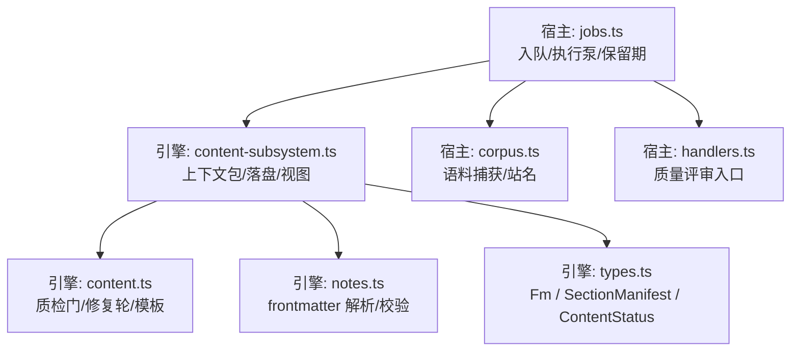
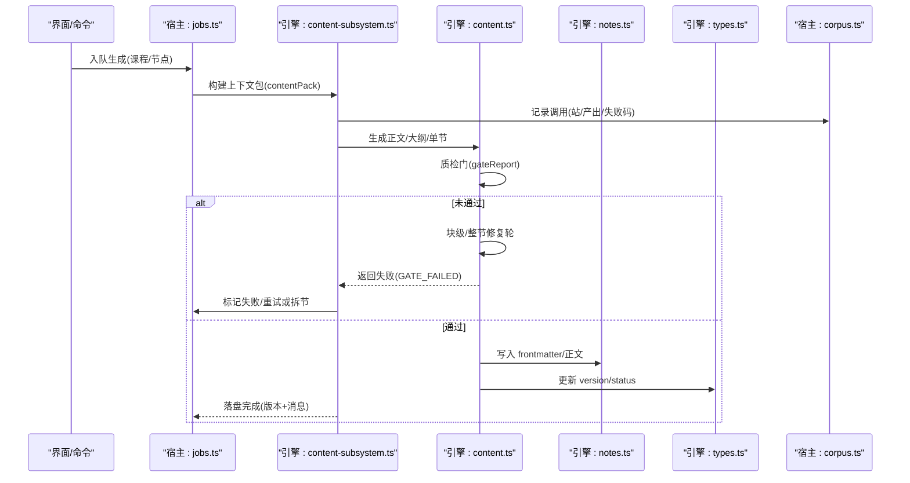
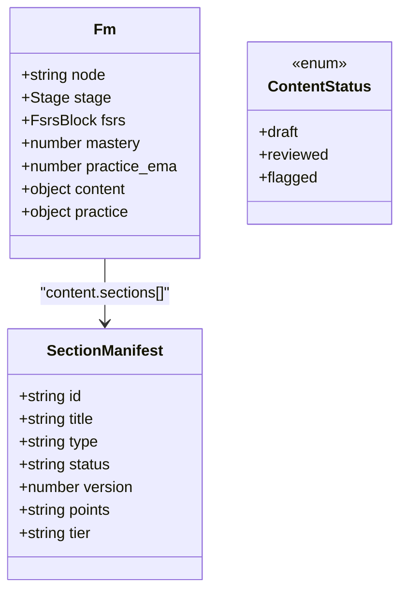
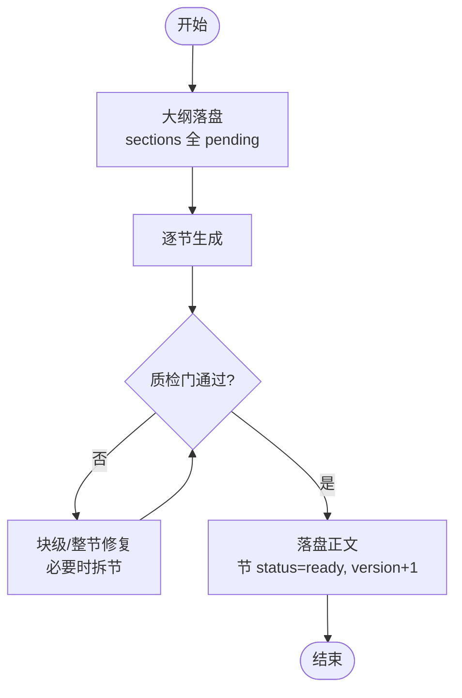
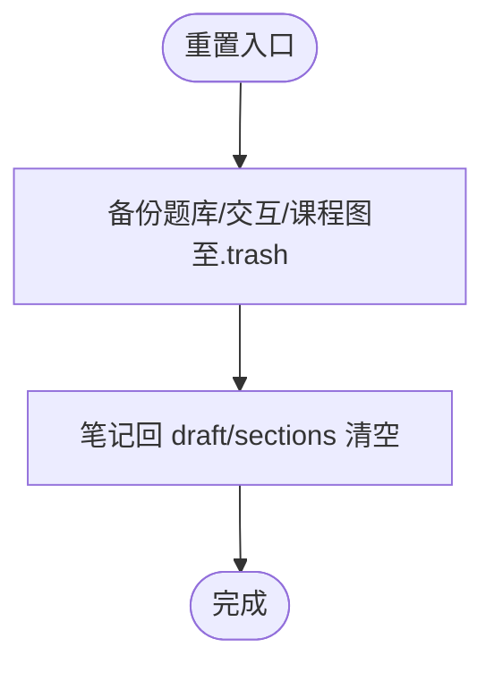
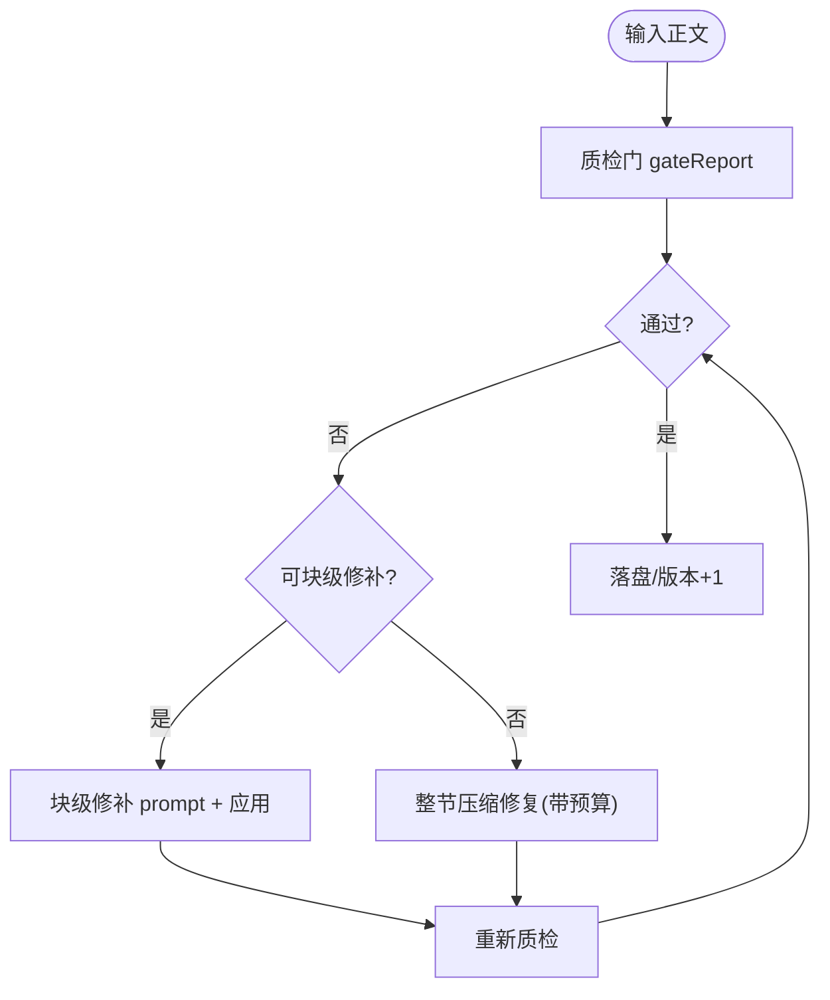
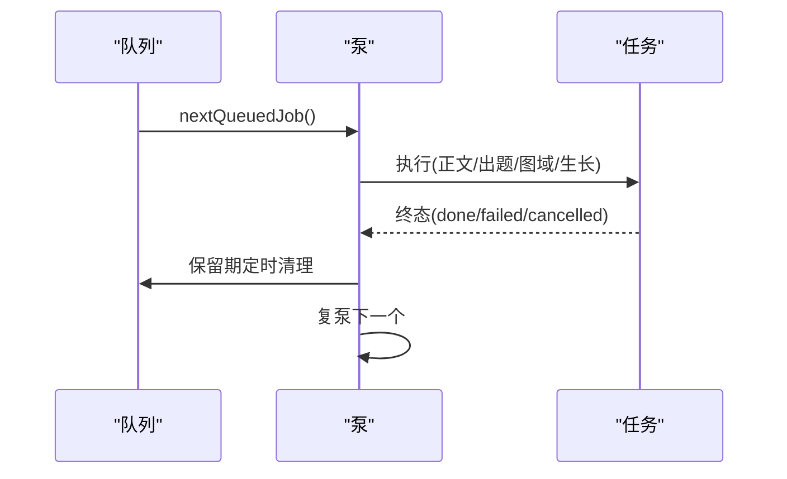
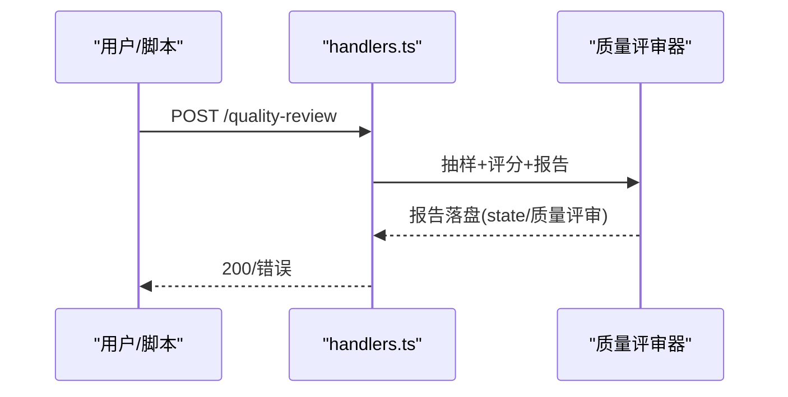
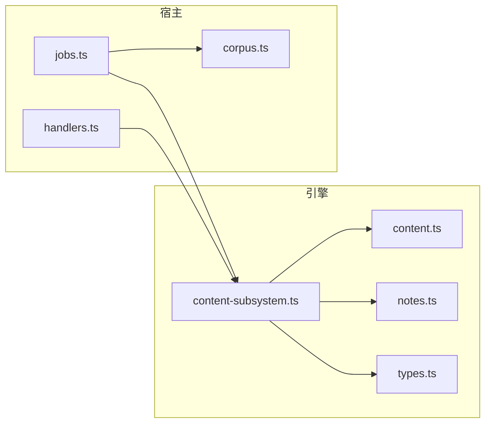

# 内容数据流

<cite>
**本文引用的文件**
- [content.ts](file://src/engine/content.ts)
- [content-subsystem.ts](file://src/engine/content-subsystem.ts)
- [types.ts](file://src/engine/types.ts)
- [notes.ts](file://src/engine/notes.ts)
- [jobs.ts](file://src/host/jobs.ts)
- [corpus.ts](file://src/host/corpus.ts)
- [handlers.ts](file://src/host/handlers.ts)
- [README.md](file://tests/README.md)
</cite>

## 目录
1. [简介](#简介)
2. [项目结构](#项目结构)
3. [核心组件](#核心组件)
4. [架构总览](#架构总览)
5. [详细组件分析](#详细组件分析)
6. [依赖关系分析](#依赖关系分析)
7. [性能考量](#性能考量)
8. [故障排查指南](#故障排查指南)
9. [结论](#结论)
10. [附录](#附录)

## 简介
本技术文档聚焦 LearnHub 的“内容数据流”：从课程笔记（Markdown + frontmatter）到可发布内容的完整流水线，覆盖解析、生成、质检、版本与状态流转、以及质量评审。文档以代码级事实为依据，给出数据结构、处理流程、错误处理与一致性保障，并配合图示帮助理解。

## 项目结构
围绕内容数据流的关键位置如下：
- 引擎层
  - 内容管线与质检门：content.ts
  - 内容子系统门面（装配 vault 先验、提示词、落盘等）：content-subsystem.ts
  - 共享类型与数据模型：types.ts
  - 笔记 frontmatter 解析与校验：notes.ts
- 宿主层
  - 全局生成队列与任务执行泵：jobs.ts
  - 语料捕获与站名映射：corpus.ts
  - 质量评审路由：handlers.ts
- 测试与验收
  - 管线接缝与门禁清单：tests/README.md

**图表来源**
- [jobs.ts:269-322](file://src/host/jobs.ts#L269-L322)
- [content-subsystem.ts:125-146](file://src/engine/content-subsystem.ts#L125-L146)
- [content.ts:380-788](file://src/engine/content.ts#L380-L788)
- [notes.ts:37-74](file://src/engine/notes.ts#L37-L74)
- [types.ts:40-61](file://src/engine/types.ts#L40-L61)
- [corpus.ts:91-117](file://src/host/corpus.ts#L91-L117)
- [handlers.ts:218-235](file://src/host/handlers.ts#L218-L235)

**章节来源**
- [jobs.ts:269-322](file://src/host/jobs.ts#L269-L322)
- [content-subsystem.ts:125-146](file://src/engine/content-subsystem.ts#L125-L146)
- [content.ts:380-788](file://src/engine/content.ts#L380-L788)
- [notes.ts:37-74](file://src/engine/notes.ts#L37-L74)
- [types.ts:40-61](file://src/engine/types.ts#L40-L61)
- [corpus.ts:91-117](file://src/host/corpus.ts#L91-L117)
- [handlers.ts:218-235](file://src/host/handlers.ts#L218-L235)

## 核心组件
- 内容子系统（ContentSubsystem）
  - 组装生成上下文包（含 Vault 先验注入段）、加载提示词、运行质检门、落盘正文/大纲/单节、整课重置、节清单视图等。
- 内容管线（Content）
  - 质检门集合（超纲引用、别名一致性、可视化块、预测门、交互件契约、节形状等），修复轮（块级局部修补、整节压缩修复、拆节阶梯）。
- 宿主队列（jobs.ts）
  - 全局 FIFO 队列、单并发泵、终态保留期与清扫、图域任务（种子/罗盘/反编译/计划/里程碑）、教练生长批、纯出题任务。
- 数据模型（types.ts）
  - Fm（课程笔记 frontmatter）、SectionManifest（节清单条目）、ContentStatus（内容状态）、Stage（阶段机）等。
- 笔记解析（notes.ts）
  - frontmatter 拆分、渲染、校验、Broken 识别、就绪判定。
- 语料捕获（corpus.ts）
  - 站点命名、行尾归一、语料 frontmatter 解析；与失败补标联动。
- 质量评审（handlers.ts）
  - 离线批量评审器入口，按站抽样、量规评分、输出报告。

**章节来源**
- [content-subsystem.ts:125-146](file://src/engine/content-subsystem.ts#L125-L146)
- [content.ts:380-788](file://src/engine/content.ts#L380-L788)
- [jobs.ts:269-322](file://src/host/jobs.ts#L269-L322)
- [types.ts:40-61](file://src/engine/types.ts#L40-L61)
- [notes.ts:37-74](file://src/engine/notes.ts#L37-L74)
- [corpus.ts:91-117](file://src/host/corpus.ts#L91-L117)
- [handlers.ts:218-235](file://src/host/handlers.ts#L218-L235)

## 架构总览
下图展示“创建→生成→质检→落盘→发布”的主路径，以及队列、语料、质量评审的协作关系。

**图表来源**
- [jobs.ts:269-322](file://src/host/jobs.ts#L269-L322)
- [content-subsystem.ts:125-146](file://src/engine/content-subsystem.ts#L125-L146)
- [content.ts:757-788](file://src/engine/content.ts#L757-L788)
- [notes.ts:37-74](file://src/engine/notes.ts#L37-L74)
- [types.ts:40-61](file://src/engine/types.ts#L40-L61)
- [corpus.ts:91-117](file://src/host/corpus.ts#L91-L117)

## 详细组件分析

### 数据模型设计（Fm / Content / SectionManifest）
- Fm（课程笔记 frontmatter）
  - 关键字段：node、stage、fsrs、content.version/status/sections/tier、practice.attempts/correct。
  - 作用：调度状态唯一事实源；内容版本与状态驱动学习流与面板显示。
- SectionManifest（节清单条目）
  - 关键字段：id/title/type/status(version/pending-ready)、points、tier。
  - 作用：逐节生成管线的进度事实源；前端按 id/type 装配轮次。
- ContentStatus（内容状态）
  - 值：draft / reviewed / flagged。
  - 作用：表示内容是否待审/已审/被标记问题。

**图表来源**
- [types.ts:40-61](file://src/engine/types.ts#L40-L61)
- [types.ts:15-28](file://src/engine/types.ts#L15-L28)

**章节来源**
- [types.ts:40-61](file://src/engine/types.ts#L40-L61)
- [types.ts:15-28](file://src/engine/types.ts#L15-L28)

### 内容状态机转换机制（draft → pending → ready）
- draft：正文首次落盘或重置后初始状态。
- pending：大纲期或单节生成前的中间态（节清单中为 pending 表示尚未生成正文）。
- ready：单节正文通过质检门并落盘后，对应节清单项置 ready。
- 触发点
  - 大纲落盘：contentOutline → sections 全 pending。
  - 单节落盘：contentSection → 指定节置 ready/version+1。
  - 整课重置：contentReset → 全部回 draft/sections 清空。
- 注意：ContentStatus 与 Stage 不同，前者描述内容生产状态，后者描述学习阶段。

**图表来源**
- [content-subsystem.ts:231-241](file://src/engine/content-subsystem.ts#L231-L241)
- [content-subsystem.ts:290-297](file://src/engine/content-subsystem.ts#L290-L297)
- [content-subsystem.ts:244-287](file://src/engine/content-subsystem.ts#L244-L287)
- [content.ts:757-788](file://src/engine/content.ts#L757-L788)

**章节来源**
- [content-subsystem.ts:231-241](file://src/engine/content-subsystem.ts#L231-L241)
- [content-subsystem.ts:290-297](file://src/engine/content-subsystem.ts#L290-L297)
- [content-subsystem.ts:244-287](file://src/engine/content-subsystem.ts#L244-L287)
- [content.ts:757-788](file://src/engine/content.ts#L757-L788)

### 内容版本控制策略（版本号管理、增量更新、回滚）
- 版本号管理
  - 每节独立 version：每次成功落盘自增；节清单中的 version 用于追踪重写次数。
  - 节点级 content.version：整节点内容版本，面板增量刷新依据。
- 增量更新
  - 断点续跑：已 ready 节跳过；仅对 pending 节继续生成。
  - 节间连贯注入：前节尾部窗口与完整节清单，保证上下文一致。
- 回滚机制
  - 整课重置：将课程产物移入 .trash 备份目录，笔记回 draft/sections 清空；沉淀层不受影响。
  - 任务档损坏保护：broken 期间拒绝写回注册表，避免覆盖现场。

**图表来源**
- [content-subsystem.ts:244-287](file://src/engine/content-subsystem.ts#L244-L287)
- [jobs.ts:269-286](file://src/host/jobs.ts#L269-L286)

**章节来源**
- [content-subsystem.ts:244-287](file://src/engine/content-subsystem.ts#L244-L287)
- [jobs.ts:269-286](file://src/host/jobs.ts#L269-L286)

### 内容质检流程（语法检查、语义验证、格式规范校验）
- 语义与规范
  - 超纲引用检测：禁止引用更深未学概念。
  - 别名一致性：正文术语统一为采用名。
  - 代码块语言白名单：未知语言警告。
  - 预测门合法性：字段齐全、选项互异、答案在选项中。
  - 富内容块：plot/chart 必须合法 JSON；svg 必须以 <svg 开头。
  - 节形状：子标题告警、正文字数阈值（按复杂度档位派生）、可视化块数量上限。
  - 交互件契约：widget-config、完成上报、AI 老师接口、单文件自包含等。
- 自动修复
  - 块级局部修补：定位具体违规块（plot/chart/svg/learnhub-predict），只替换违规块。
  - 整节压缩修复：超长时提供明确压缩目标与计数口径。
  - 富内容清洗：JSON 尾随逗号/注释容忍、SVG 前导杂质裁剪、Mermaid 引号补齐。
- 失败码与重试
  - GATE_FAILED：携带 wordBudget 与定位信息，支持一次修复轮；仍失败则抛错或进入拆节阶梯。

**图表来源**
- [content.ts:412-788](file://src/engine/content.ts#L412-L788)

**章节来源**
- [content.ts:412-788](file://src/engine/content.ts#L412-L788)

### 生成队列与执行泵（全局单并发、保留期、清扫）
- 入队
  - enqueueGeneration：同节点重复入队幂等；终点恒拒；broken 态拒绝写回。
  - enqueueQuizGeneration：纯出题复用队列，phase=quiz。
- 执行泵
  - pumpGeneration：取队首任务执行；完成后复泵；空闲触发教练回合与复诊结算。
- 保留期与清扫
  - scheduleJobRetention：终态盖 finishedAt；超时清理。
  - sweepGenJobs：删除悬空/过期任务；broken 态跳过落盘。

**图表来源**
- [jobs.ts:269-322](file://src/host/jobs.ts#L269-L322)
- [jobs.ts:378-437](file://src/host/jobs.ts#L378-L437)
- [jobs.ts:690-740](file://src/host/jobs.ts#L690-L740)

**章节来源**
- [jobs.ts:269-322](file://src/host/jobs.ts#L269-L322)
- [jobs.ts:378-437](file://src/host/jobs.ts#L378-L437)
- [jobs.ts:690-740](file://src/host/jobs.ts#L690-L740)

### 质量评审（离线批量评审器）
- 功能
  - 从生成语料按站抽样（失败/容忍优先、成功等距），按质量量规两段式评分（盲评→对账）。
  - 证据引用需确定性定位核对；报告不产生自动动作，不进 canonical。
- 入口
  - POST /quality-review：参数校验、站点过滤、repeats≥1。

**图表来源**
- [handlers.ts:218-235](file://src/host/handlers.ts#L218-L235)

**章节来源**
- [handlers.ts:218-235](file://src/host/handlers.ts#L218-L235)

## 依赖关系分析
- 耦合与内聚
  - content-subsystem 作为门面聚合 vault 先验、提示词、落盘与视图，降低上层耦合。
  - content.ts 专注质检与修复，职责单一、内聚度高。
  - jobs.ts 集中队列与执行，屏蔽多类任务差异。
- 外部依赖
  - 语料捕获（corpus.ts）贯穿 LLM 调用与失败补标。
  - 类型定义（types.ts）为跨模块契约，避免环依赖。
- 潜在环风险
  - 类型与工具函数置于中立层（如 types.ts），避免导入环。

**图表来源**
- [content-subsystem.ts:125-146](file://src/engine/content-subsystem.ts#L125-L146)
- [content.ts:380-788](file://src/engine/content.ts#L380-L788)
- [notes.ts:37-74](file://src/engine/notes.ts#L37-L74)
- [types.ts:40-61](file://src/engine/types.ts#L40-L61)
- [jobs.ts:269-322](file://src/host/jobs.ts#L269-L322)
- [corpus.ts:91-117](file://src/host/corpus.ts#L91-L117)
- [handlers.ts:218-235](file://src/host/handlers.ts#L218-L235)

**章节来源**
- [content-subsystem.ts:125-146](file://src/engine/content-subsystem.ts#L125-L146)
- [content.ts:380-788](file://src/engine/content.ts#L380-L788)
- [notes.ts:37-74](file://src/engine/notes.ts#L37-L74)
- [types.ts:40-61](file://src/engine/types.ts#L40-L61)
- [jobs.ts:269-322](file://src/host/jobs.ts#L269-L322)
- [corpus.ts:91-117](file://src/host/corpus.ts#L91-L117)
- [handlers.ts:218-235](file://src/host/handlers.ts#L218-L235)

## 性能考量
- 单并发队列：避免并发写冲突与资源争用，适合 I/O 密集与 LLM 调用限流场景。
- 断点续跑：已 ready 节跳过，减少冗余生成成本。
- 块级局部修补：精准定位与最小化重算，降低模型调用与重试成本。
- 语料环形保留：限制存储占用，同时保留足够样本供审计与回归。
- 扫描面/结果面截断：控制检索与注入规模，避免过大上下文导致延迟与成本上升。

[本节为通用指导，无需特定文件来源]

## 故障排查指南
- 常见错误与定位
  - GATE_FAILED：质检门未过，查看 gateReport 中的 findings/warns，结合 blockPatchPlan 尝试块级修补。
  - ENDPOINT_GENERATION_FORBIDDEN：终点节点不允许生成正文，属预期行为。
  - Broken 任务档：队列处于 broken 态，需修复任务档后再操作。
- 一致性保障
  - 终态保留期：finishedAt 起算，便于恢复与重试。
  - 语料捕获：失败补标 outcome/code，便于回溯死因。
  - 日志与运行记录：关键步骤落 journal，便于审计。
- 参考验收清单
  - tests/README.md 列出管线各站门禁与修复策略的验收要点，可作为排障对照。

**章节来源**
- [jobs.ts:269-322](file://src/host/jobs.ts#L269-L322)
- [content.ts:757-788](file://src/engine/content.ts#L757-L788)
- [README.md:27-108](file://tests/README.md#L27-L108)

## 结论
LearnHub 的内容数据流以“队列驱动、质检把关、版本可控、可追溯”为核心原则：通过全局队列与单并发泵保证稳定性；以多层质检门与修复轮确保内容质量；借助 frontmatter 与节清单实现细粒度版本与进度管理；通过语料捕获与质量评审形成闭环改进。该设计兼顾可扩展性与可维护性，适合持续演进的学习内容生产体系。

[本节为总结，无需特定文件来源]

## 附录
- API 使用建议（基于现有接口的最佳实践）
  - 生成正文：通过宿主队列入队（enqueueGeneration），等待终态后读取结果；若失败，根据失败码与语料引用定位问题。
  - 大纲与单节：先 contentOutline 建立节清单（pending），再逐节 contentSection 生成并落盘（ready）。
  - 质检：contentCheck 用于手改正文后的快速校验；gateReport 提供 findings/warns 与定位。
  - 质量评审：POST /quality-review 进行离线批量评审，关注低分件与证据定位。
- 注意事项
  - 终点节点不参与生成；broken 态下拒绝写回；终态保留期内可重试。
  - 节长度与可视化块受复杂度档位约束，超长应优先压缩而非扩写。

[本节为补充说明，无需特定文件来源]