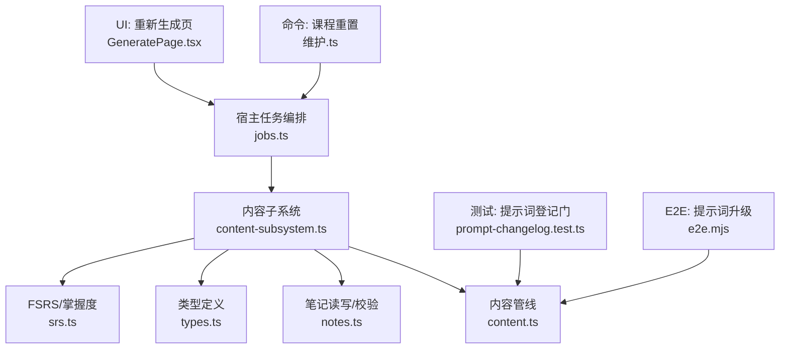
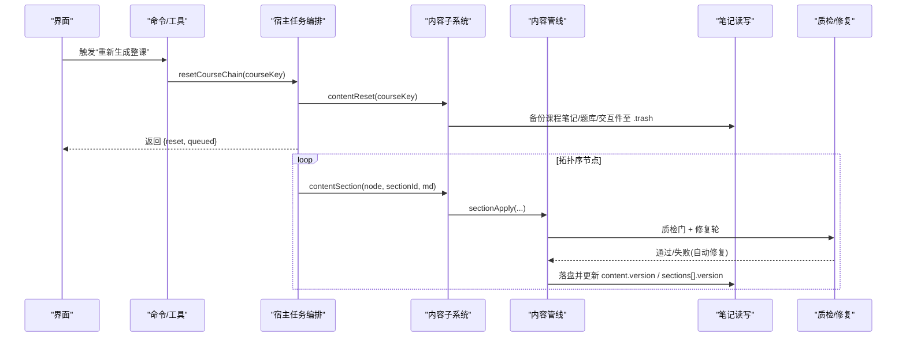
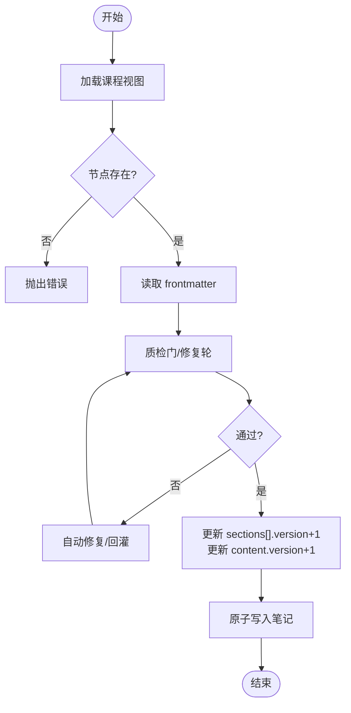
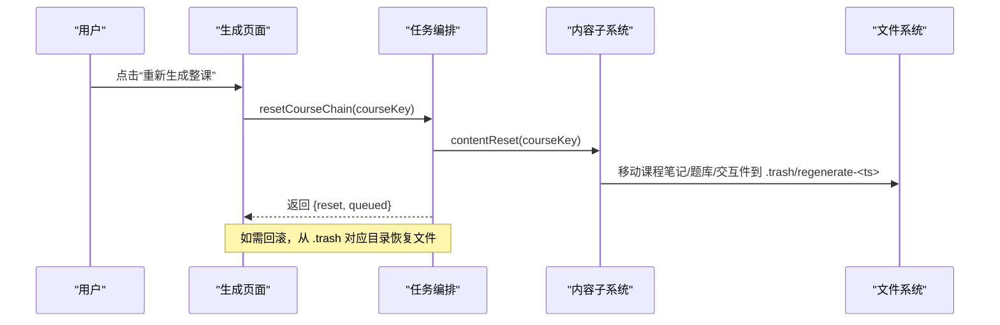
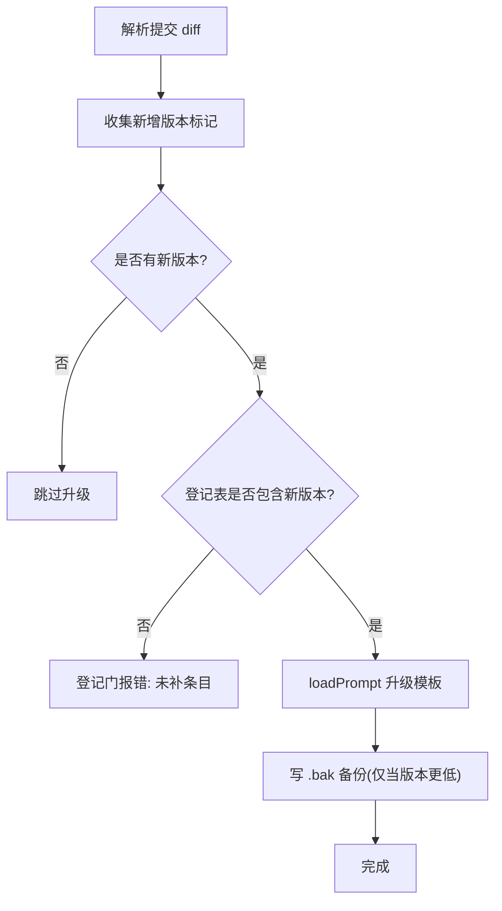
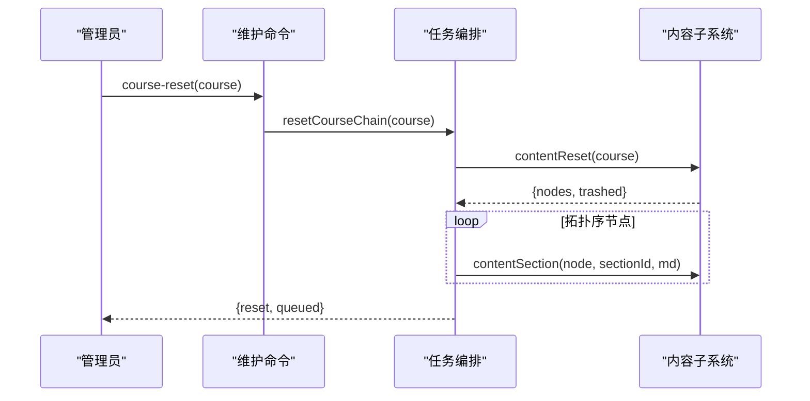
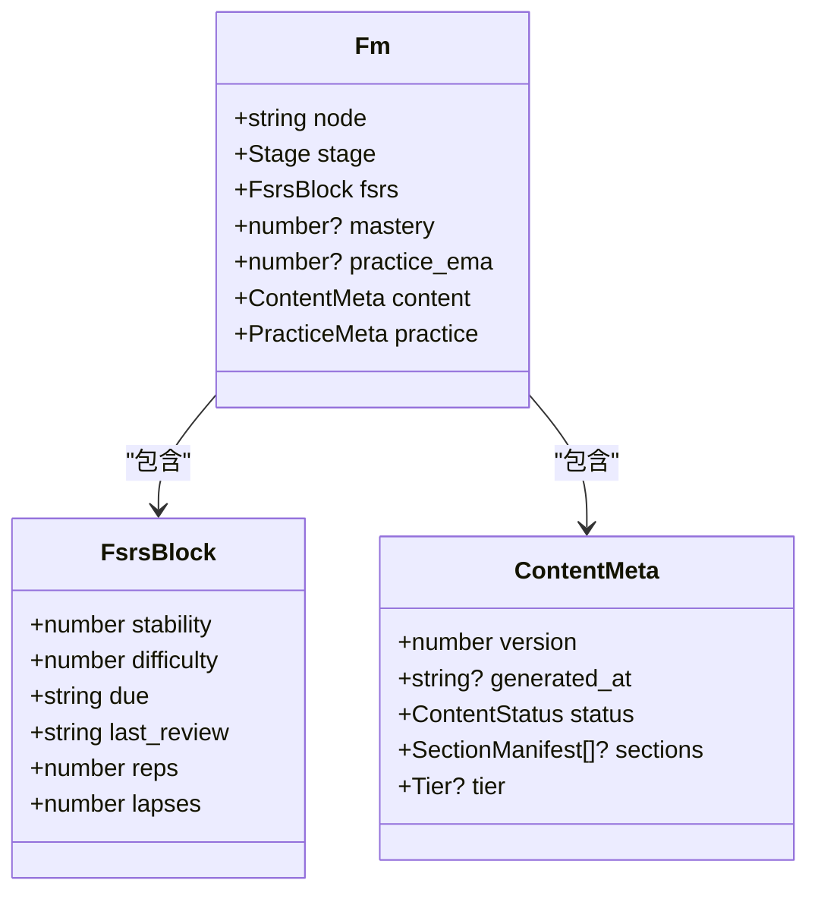
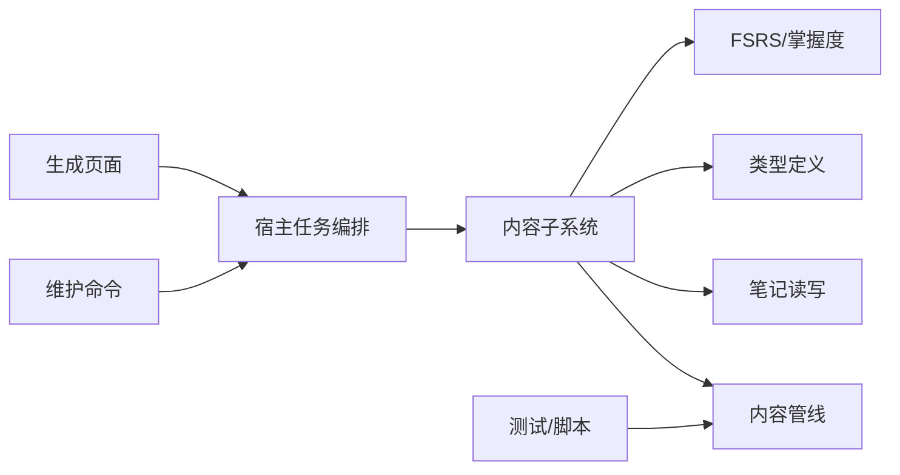

# 内容版本管理

<cite>
**本文引用的文件**
- [src/engine/content.ts](file://src/engine/content.ts)
- [src/engine/content-subsystem.ts](file://src/engine/content-subsystem.ts)
- [src/engine/notes.ts](file://src/engine/notes.ts)
- [src/engine/types.ts](file://src/engine/types.ts)
- [src/engine/srs.ts](file://src/engine/srs.ts)
- [src/engine/grading.ts](file://src/engine/grading.ts)
- [src/host/jobs.ts](file://src/host/jobs.ts)
- [src/commands/维护.ts](file://src/commands/维护.ts)
- [ui/src/pages/GeneratePage.tsx](file://ui/src/pages/GeneratePage.tsx)
- [tests/prompt-changelog.test.ts](file://tests/prompt-changelog.test.ts)
- [scripts/e2e.mjs](file://scripts/e2e.mjs)
- [docs/adr/0007-mastery-canonical-derived-not-persisted.md](file://docs/adr/0007-mastery-canonical-derived-not-persisted.md)
</cite>

## 目录
1. [简介](#简介)
2. [项目结构](#项目结构)
3. [核心组件](#核心组件)
4. [架构总览](#架构总览)
5. [详细组件分析](#详细组件分析)
6. [依赖关系分析](#依赖关系分析)
7. [性能考量](#性能考量)
8. [故障排查指南](#故障排查指南)
9. [结论](#结论)
10. [附录](#附录)

## 简介
本技术文档聚焦 LearnHub 的“内容版本管理”，围绕以下目标展开：
- 版本字段 version 的管理策略、递增规则与历史追踪
- 内容回滚机制：快照保存、回滚执行、历史恢复
- 差异比较：diff 计算、变更检测、冲突解决策略
- 批量版本操作：整课重置、版本迁移、批量更新
- 版本与学习进度关联：掌握度计算的版本隔离与进度兼容性
- API 使用示例与最佳实践
- 版本数据模型设计与存储结构说明

## 项目结构
与内容版本管理直接相关的代码分布在引擎层（content 管线、笔记 frontmatter、调度）、宿主任务编排（作业队列、整课重置）、命令与 UI 入口，以及测试与脚本对提示词版本升级的验证。

图表来源
- [src/engine/content-subsystem.ts:287-306](file://src/engine/content-subsystem.ts#L287-L306)
- [src/engine/content.ts:945-956](file://src/engine/content.ts#L945-L956)
- [src/engine/notes.ts:16-28](file://src/engine/notes.ts#L16-L28)
- [src/engine/types.ts:40-62](file://src/engine/types.ts#L40-L62)
- [src/engine/srs.ts:165-183](file://src/engine/srs.ts#L165-L183)
- [src/host/jobs.ts:1052-1075](file://src/host/jobs.ts#L1052-L1075)
- [src/commands/维护.ts:49-70](file://src/commands/维护.ts#L49-L70)
- [ui/src/pages/GeneratePage.tsx:44-80](file://ui/src/pages/GeneratePage.tsx#L44-L80)
- [tests/prompt-changelog.test.ts:47-94](file://tests/prompt-changelog.test.ts#L47-L94)
- [scripts/e2e.mjs:433-439](file://scripts/e2e.mjs#L433-L439)

章节来源
- [src/engine/content-subsystem.ts:287-306](file://src/engine/content-subsystem.ts#L287-L306)
- [src/engine/content.ts:945-956](file://src/engine/content.ts#L945-L956)
- [src/engine/notes.ts:16-28](file://src/engine/notes.ts#L16-L28)
- [src/engine/types.ts:40-62](file://src/engine/types.ts#L40-L62)
- [src/engine/srs.ts:165-183](file://src/engine/srs.ts#L165-L183)
- [src/host/jobs.ts:1052-1075](file://src/host/jobs.ts#L1052-L1075)
- [src/commands/维护.ts:49-70](file://src/commands/维护.ts#L49-L70)
- [ui/src/pages/GeneratePage.tsx:44-80](file://ui/src/pages/GeneratePage.tsx#L44-L80)
- [tests/prompt-changelog.test.ts:47-94](file://tests/prompt-changelog.test.ts#L47-L94)
- [scripts/e2e.mjs:433-439](file://scripts/e2e.mjs#L433-L439)

## 核心组件
- 内容子系统（ContentSubsystem）：对外暴露 contentVersion、contentSection、contentSplit、contentReset 等能力，串联图、笔记、题库与生成流水线。
- 内容管线（Content）：负责单节落盘、质检门、拆节、交互件提取、提示词加载与版本升级、修复轮等。
- 笔记 frontmatter（notes）：承载节点状态与内容版本信息，提供默认值、校验、扫描与原子写入。
- 类型定义（types）：Fm、FsrsBlock、SectionManifest 等核心数据结构。
- FSRS/掌握度（srs）：派生掌握度、可提取性、评分推进；掌握度为读侧派生值，不落盘。
- 宿主任务编排（jobs）：整课重置、按拓扑序入队重生成、任务状态持久化。
- 命令与 UI：维护命令与生成页面提供用户触发点与反馈。

章节来源
- [src/engine/content-subsystem.ts:161-177](file://src/engine/content-subsystem.ts#L161-L177)
- [src/engine/content.ts:331-358](file://src/engine/content.ts#L331-L358)
- [src/engine/notes.ts:16-28](file://src/engine/notes.ts#L16-L28)
- [src/engine/types.ts:40-62](file://src/engine/types.ts#L40-L62)
- [src/engine/srs.ts:165-183](file://src/engine/srs.ts#L165-L183)
- [src/host/jobs.ts:1052-1075](file://src/host/jobs.ts#L1052-L1075)
- [src/commands/维护.ts:49-70](file://src/commands/维护.ts#L49-L70)
- [ui/src/pages/GeneratePage.tsx:44-80](file://ui/src/pages/GeneratePage.tsx#L44-L80)

## 架构总览
内容版本管理的核心流程如下：
- 读取课程视图（图+状态），定位节点与节清单
- 通过质检门与程序化修复保证输出质量
- 将节正文重组并落盘，更新节版本与节点内容版本
- 整课重置时备份旧产物到 .trash，保留图谱与学习进度，按拓扑序重建

图表来源
- [src/host/jobs.ts:1052-1075](file://src/host/jobs.ts#L1052-L1075)
- [src/engine/content-subsystem.ts:245-262](file://src/engine/content-subsystem.ts#L245-L262)
- [src/engine/content-subsystem.ts:287-306](file://src/engine/content-subsystem.ts#L287-L306)
- [src/engine/content.ts:945-956](file://src/engine/content.ts#L945-L956)

## 详细组件分析

### 版本字段管理与递增规则
- 节点内容版本 content.version：
  - 新笔记默认 version=0（draft）
  - 单节落盘成功后，该节 status=ready、sections[].version+1，同时 content.version+1（节点级版本提升）
  - 查询接口 contentVersion 返回 state[node].content.version
- 节版本 sections[].version：
  - 每个节独立计数，用于标识该节正文是否已落盘及落盘次序
- 提示词模板版本：
  - 内置模板以 <!-- learnhub:prompt/vN --> 标记版本
  - loadPrompt 在 vault 中若发现旧版本或无标记，会覆盖为新版本并写 .bak 备份
  - 登记表与变更门确保 bump 版本必须同步登记条目

图表来源
- [src/engine/content-subsystem.ts:287-306](file://src/engine/content-subsystem.ts#L287-L306)
- [src/engine/content.ts:945-956](file://src/engine/content.ts#L945-L956)
- [src/engine/notes.ts:16-28](file://src/engine/notes.ts#L16-L28)
- [src/engine/content.ts:331-358](file://src/engine/content.ts#L331-L358)

章节来源
- [src/engine/content-subsystem.ts:161-177](file://src/engine/content-subsystem.ts#L161-L177)
- [src/engine/content-subsystem.ts:287-306](file://src/engine/content-subsystem.ts#L287-L306)
- [src/engine/content.ts:945-956](file://src/engine/content.ts#L945-L956)
- [src/engine/notes.ts:16-28](file://src/engine/notes.ts#L16-L28)
- [src/engine/content.ts:331-358](file://src/engine/content.ts#L331-L358)
- [tests/prompt-changelog.test.ts:47-94](file://tests/prompt-changelog.test.ts#L47-L94)
- [scripts/e2e.mjs:433-439](file://scripts/e2e.mjs#L433-L439)

### 内容回滚机制（快照保存、回滚执行、历史恢复）
- 整课重置时的快照：
  - 将课程笔记、题库、交互件与生成图片目录整体移动到 .trash/regenerate-<时间戳>/ 下，作为可恢复快照
  - 图谱、注册表、学习进度、提示词快照、生成队列保持不变
- 回滚执行：
  - 从 .trash 对应时间戳目录恢复所需文件（由调用方或运维脚本完成）
  - 恢复后重新运行生成管线即可重建当前版本
- 历史版本恢复：
  - 由于每次重置都带时间戳子目录，可按需选择任意一次快照进行恢复

图表来源
- [src/engine/content-subsystem.ts:245-262](file://src/engine/content-subsystem.ts#L245-L262)
- [src/host/jobs.ts:1052-1075](file://src/host/jobs.ts#L1052-L1075)
- [ui/src/pages/GeneratePage.tsx:44-80](file://ui/src/pages/GeneratePage.tsx#L44-L80)

章节来源
- [src/engine/content-subsystem.ts:245-262](file://src/engine/content-subsystem.ts#L245-L262)
- [src/host/jobs.ts:1052-1075](file://src/host/jobs.ts#L1052-L1075)
- [ui/src/pages/GeneratePage.tsx:44-80](file://ui/src/pages/GeneratePage.tsx#L44-L80)

### 差异比较功能（diff 计算、变更检测、冲突解决）
- 提示词版本登记与 diff 解析：
  - 通过解析提交 diff，识别新增的版本标记与登记条目，确保 bump 版本与登记表一致
  - 同一提交内多处新增标记均被记录，避免漏检
- 变更检测：
  - 模板版本标记变化即视为需要升级；若 vault 已有旧版本则先写 .bak 再覆盖
- 冲突解决策略：
  - 若新版本与登记不一致，登记门会报错，要求同提交补登记条目
  - 模板升级时不会重复改写 .bak（相同版本不覆盖）

图表来源
- [tests/prompt-changelog.test.ts:47-94](file://tests/prompt-changelog.test.ts#L47-L94)
- [scripts/e2e.mjs:433-439](file://scripts/e2e.mjs#L433-L439)
- [src/engine/content.ts:331-358](file://src/engine/content.ts#L331-L358)

章节来源
- [tests/prompt-changelog.test.ts:47-94](file://tests/prompt-changelog.test.ts#L47-L94)
- [scripts/e2e.mjs:433-439](file://scripts/e2e.mjs#L433-L439)
- [src/engine/content.ts:331-358](file://src/engine/content.ts#L331-L358)

### 批量版本操作（整课重置、版本迁移、批量更新）
- 整课重置：
  - 命令 course-reset 与 HTTP 路由 /course/reset 提供入口
  - 重置前检查 Broken 笔记，拒绝不安全重置
  - 备份后按拓扑序逐节点入队生成，立即返回队列数量
- 版本迁移：
  - 提示词模板版本升级由 loadPrompt 自动处理，配合登记门保障一致性
- 批量更新：
  - 通过 jobs 批量入队生成，支持取消与暂停恢复

图表来源
- [src/commands/维护.ts:49-70](file://src/commands/维护.ts#L49-L70)
- [src/host/jobs.ts:1052-1075](file://src/host/jobs.ts#L1052-L1075)
- [src/engine/content-subsystem.ts:245-262](file://src/engine/content-subsystem.ts#L245-L262)

章节来源
- [src/commands/维护.ts:49-70](file://src/commands/维护.ts#L49-L70)
- [src/host/jobs.ts:1052-1075](file://src/host/jobs.ts#L1052-L1075)
- [src/engine/content-subsystem.ts:245-262](file://src/engine/content-subsystem.ts#L245-L262)

### 版本与学习进度的关联（掌握度计算的版本隔离与进度兼容性）
- 掌握度为派生值：
  - masteryOfFm 基于 fsrs 稳定度与练习证据 EMA 计算，不落盘
  - 因此内容版本变更不影响掌握度计算口径，保持读侧一致性
- 版本隔离：
  - 内容版本控制的是正文与节清单，FSRS 卡片与复习日志独立于内容版本
  - 重置整课时图谱与学习进度不变，仅重建内容产物
- 进度兼容性：
  - 新内容版本生成后，学习流继续消费现有 FSRS 状态，无需额外迁移

图表来源
- [src/engine/types.ts:40-62](file://src/engine/types.ts#L40-L62)
- [src/engine/srs.ts:165-183](file://src/engine/srs.ts#L165-L183)
- [docs/adr/0007-mastery-canonical-derived-not-persisted.md:1-6](file://docs/adr/0007-mastery-canonical-derived-not-persisted.md#L1-L6)

章节来源
- [src/engine/types.ts:40-62](file://src/engine/types.ts#L40-L62)
- [src/engine/srs.ts:165-183](file://src/engine/srs.ts#L165-L183)
- [docs/adr/0007-mastery-canonical-derived-not-persisted.md:1-6](file://docs/adr/0007-mastery-canonical-derived-not-persisted.md#L1-L6)

### API 使用示例与最佳实践
- 查询节点内容版本：
  - 使用 contentVersion(courseKey, node) 获取 state[node].content.version
- 单节重写：
  - 使用 contentSection(courseKey, node, sectionId, md) 进入质检门与修复轮，通过后落盘并递增版本
- 整课重置：
  - 通过维护命令或 /course/reset 触发，注意确认破坏性影响；图谱与学习进度保留
- 最佳实践：
  - 在重写前确保节点不在 Broken 状态
  - 批量操作时使用任务编排，避免并发冲突
  - 提示词升级需同步登记条目，避免登记门失败

章节来源
- [src/engine/content-subsystem.ts:161-177](file://src/engine/content-subsystem.ts#L161-L177)
- [src/engine/content-subsystem.ts:287-306](file://src/engine/content-subsystem.ts#L287-L306)
- [src/commands/维护.ts:49-70](file://src/commands/维护.ts#L49-L70)
- [tests/prompt-changelog.test.ts:47-94](file://tests/prompt-changelog.test.ts#L47-L94)

## 依赖关系分析
- 内容子系统依赖内容管线、笔记读写、类型定义、FSRS 模块
- 宿主任务编排依赖内容子系统与文件系统
- 命令与 UI 通过宿主任务编排触发批量操作
- 测试与脚本验证提示词版本升级与登记一致性

图表来源
- [src/engine/content-subsystem.ts:287-306](file://src/engine/content-subsystem.ts#L287-L306)
- [src/engine/content.ts:945-956](file://src/engine/content.ts#L945-L956)
- [src/engine/notes.ts:16-28](file://src/engine/notes.ts#L16-L28)
- [src/engine/types.ts:40-62](file://src/engine/types.ts#L40-L62)
- [src/engine/srs.ts:165-183](file://src/engine/srs.ts#L165-L183)
- [src/host/jobs.ts:1052-1075](file://src/host/jobs.ts#L1052-L1075)
- [src/commands/维护.ts:49-70](file://src/commands/维护.ts#L49-L70)
- [ui/src/pages/GeneratePage.tsx:44-80](file://ui/src/pages/GeneratePage.tsx#L44-L80)
- [tests/prompt-changelog.test.ts:47-94](file://tests/prompt-changelog.test.ts#L47-L94)

## 性能考量
- 原子写入：笔记与关键状态采用原子写入，避免部分写导致的损坏
- 批量入队：整课重置按拓扑序串行入队，减少并发竞争
- 质检门前置：在落盘前进行格式与长度校验，降低后续修复成本
- 提示词升级缓存：loadPrompt 仅在版本更低时覆盖，避免重复写盘

## 故障排查指南
- 节点不在图内：contentVersion/contentSection 会抛出错误，需检查课程注册与图构建
- Broken 笔记：整课重置前会拒绝，需先修复或确认
- 提示词版本不一致：登记门报错，需在同提交补登记条目
- 交互件缺失：质检门会报告 interactive 引用文件不存在，需补齐路径

章节来源
- [src/engine/content-subsystem.ts:161-177](file://src/engine/content-subsystem.ts#L161-L177)
- [src/engine/content-subsystem.ts:245-262](file://src/engine/content-subsystem.ts#L245-L262)
- [tests/prompt-changelog.test.ts:47-94](file://tests/prompt-changelog.test.ts#L47-L94)

## 结论
LearnHub 的内容版本管理以 frontmatter 中的 content.version 为核心，结合节的独立版本与提示词版本标记，形成完整的版本追踪与回滚机制。整课重置通过 .trash 快照实现安全恢复，宿主任务编排保障批量操作的有序执行。掌握度作为派生值，与内容版本解耦，确保学习进度兼容性与稳定性。通过登记门与 E2E 测试，提示词版本升级具备强一致性与可追溯性。

## 附录
- 数据模型说明：
  - Fm.content.version：节点内容版本，随节落盘递增
  - SectionManifest.version：节正文版本，独立计数
  - FsrsBlock：FSRS 状态块，与内容版本无关
  - 掌握度：由 srs.ts 派生，不落盘

章节来源
- [src/engine/types.ts:40-62](file://src/engine/types.ts#L40-L62)
- [src/engine/srs.ts:165-183](file://src/engine/srs.ts#L165-L183)
- [docs/adr/0007-mastery-canonical-derived-not-persisted.md:1-6](file://docs/adr/0007-mastery-canonical-derived-not-persisted.md#L1-L6)