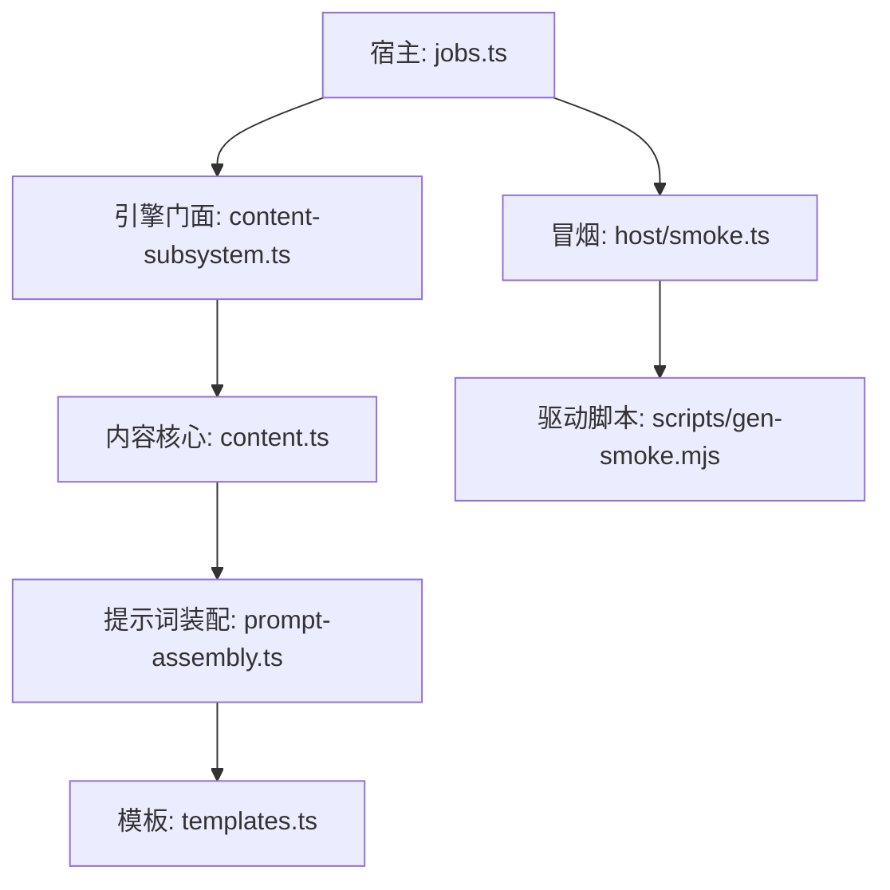
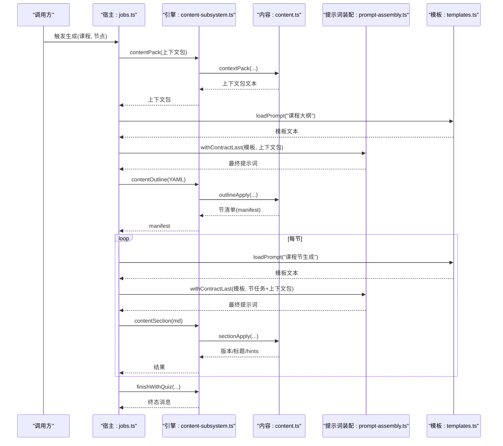
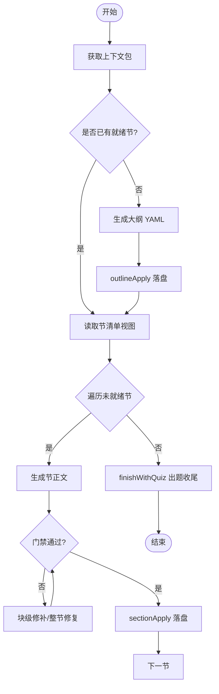
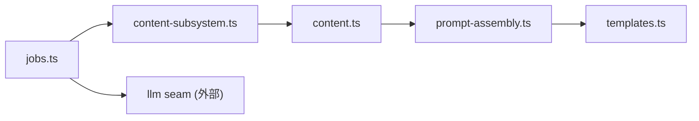

# 内容管线阶段

<cite>
**本文引用的文件**
- [src/engine/content.ts](file://src/engine/content.ts)
- [src/engine/content-subsystem.ts](file://src/engine/content-subsystem.ts)
- [src/engine/prompt-assembly.ts](file://src/engine/prompt-assembly.ts)
- [src/host/jobs.ts](file://src/host/jobs.ts)
- [src/engine/prompts/templates.ts](file://src/engine/prompts/templates.ts)
- [src/host/smoke.ts](file://src/host/smoke.ts)
- [scripts/gen-smoke.mjs](file://scripts/gen-smoke.mjs)
- [tests/host-runtime.test.ts](file://tests/host-runtime.test.ts)
</cite>

## 目录
1. [简介](#简介)
2. [项目结构](#项目结构)
3. [核心组件](#核心组件)
4. [架构总览](#架构总览)
5. [详细组件分析](#详细组件分析)
6. [依赖关系分析](#依赖关系分析)
7. [性能与并发](#性能与并发)
8. [监控与调试](#监控与调试)
9. [故障排查指南](#故障排查指南)
10. [结论](#结论)
11. [附录：调用示例与配置项](#附录调用示例与配置项)

## 简介
本文件面向 LearnHub 内容管线的“生成侧”实现，聚焦以下关键阶段：
- 上下文包组装（contentPack）
- 提示词装配（promptAssembly / withContractLast）
- 内容生成与执行（contentApply、contentOutline、contentSection、contentSplit）
- 出题收尾（finishWithQuiz）
- 队列与任务调度（jobs.ts 中的全局单并发泵）
- 冒烟测试与回归（smoke）

文档将说明各阶段的输入输出数据格式、阶段间的数据传递机制（状态保持、错误传播、重试策略）、并行与批处理机制、监控与调试能力，并给出扩展点与自定义阶段开发指南。

## 项目结构
内容管线由“宿主层（jobs.ts）+ 引擎层（content.ts / content-subsystem.ts）+ 提示词装配（prompt-assembly.ts）+ 模板（templates.ts）”组成，并通过“冒烟（smoke.ts + gen-smoke.mjs）”进行端到端验证。

图表来源
- [src/host/jobs.ts:800-956](file://src/host/jobs.ts#L800-L956)
- [src/engine/content-subsystem.ts:125-146](file://src/engine/content-subsystem.ts#L125-L146)
- [src/engine/content.ts:148-277](file://src/engine/content.ts#L148-L277)
- [src/engine/prompt-assembly.ts:21-29](file://src/engine/prompt-assembly.ts#L21-L29)
- [src/engine/prompts/templates.ts:17-200](file://src/engine/prompts/templates.ts#L17-L200)
- [src/host/smoke.ts:1-18](file://src/host/smoke.ts#L1-L18)
- [scripts/gen-smoke.mjs:1-22](file://scripts/gen-smoke.mjs#L1-L22)

章节来源
- [src/host/jobs.ts:800-956](file://src/host/jobs.ts#L800-L956)
- [src/engine/content-subsystem.ts:125-146](file://src/engine/content-subsystem.ts#L125-L146)
- [src/engine/content.ts:148-277](file://src/engine/content.ts#L148-L277)
- [src/engine/prompt-assembly.ts:21-29](file://src/engine/prompt-assembly.ts#L21-L29)
- [src/engine/prompts/templates.ts:17-200](file://src/engine/prompts/templates.ts#L17-L200)
- [src/host/smoke.ts:1-18](file://src/host/smoke.ts#L1-L18)
- [scripts/gen-smoke.mjs:1-22](file://scripts/gen-smoke.mjs#L1-L22)

## 核心组件
- 内容子系统（ContentSubsystem）：对外暴露 contentPack、contentOutline、contentSection、contentApply、contentSplit、contentCheck 等入口，负责课程解析、视图加载、门禁与落盘。
- 内容核心（Content）：实现上下文包组装、质检门、正文/大纲/拆节应用、交互件提取与校验、enc 边反哺等。
- 提示词装配（prompt-assembly）：统一“材料在前、契约段置尾”的拼装策略，确保模型最后读到“只输出 X”的硬约束。
- 宿主作业调度（jobs.ts）：全局单并发 FIFO 队列，串联 outline → sections → quiz；支持取消、续跑、溢出拆节、失败记录与保留期清理。
- 模板（templates.ts）：集中管理所有生成站提示词模板（大纲、节生成、拆分、题目生成等）。

章节来源
- [src/engine/content-subsystem.ts:125-146](file://src/engine/content-subsystem.ts#L125-L146)
- [src/engine/content.ts:148-277](file://src/engine/content.ts#L148-L277)
- [src/engine/prompt-assembly.ts:21-29](file://src/engine/prompt-assembly.ts#L21-L29)
- [src/host/jobs.ts:800-956](file://src/host/jobs.ts#L800-L956)
- [src/engine/prompts/templates.ts:17-200](file://src/engine/prompts/templates.ts#L17-L200)

## 架构总览
内容管线以“节点”为粒度，按拓扑序串行入队，全局单并发泵依次执行。每个节点经历：
- 大纲生成（outline）：产出节清单 YAML，经门禁后落盘 frontmatter.content.sections
- 逐节正文（sections）：每节一次 LLM 调用，带节间连贯注入；失败可块级修补或整节修复；溢出时自动拆节
- 出题收尾（quiz）：逐节出题 + 综合题，多样性与第二意见抽样可观测

图表来源
- [src/host/jobs.ts:800-956](file://src/host/jobs.ts#L800-L956)
- [src/engine/content-subsystem.ts:125-146](file://src/engine/content-subsystem.ts#L125-L146)
- [src/engine/content.ts:148-277](file://src/engine/content.ts#L148-L277)
- [src/engine/prompt-assembly.ts:21-29](file://src/engine/prompt-assembly.ts#L21-L29)
- [src/engine/prompts/templates.ts:17-200](file://src/engine/prompts/templates.ts#L17-L200)

## 详细组件分析

### 上下文包组装（contentPack）
- 功能：聚合图结构、状态、先验检索审计、终点判定，生成“目标节点 + 前置摘要 + 后继预告 + 领域边界 + 禁止概念 + 规范约束 + enc 边 + 复杂度档案 + 交付要求”等段落的 Markdown 文本。
- 输入：courseKey、node、可选 omitDeliverables/endpoints/onPrior
- 输出：Markdown 文本（可能附带 Vault 先验注入段）
- 关键点：
  - 终点节点恒拒生成（方向标记，零正文零题库）
  - 先验检索审计通过 onPrior 回调注入到任务记录
  - 交付要求可按需裁剪（大纲调用 omitDeliverables=true）

章节来源
- [src/engine/content-subsystem.ts:125-146](file://src/engine/content-subsystem.ts#L125-L146)
- [src/engine/content.ts:148-277](file://src/engine/content.ts#L148-L277)

### 提示词装配（promptAssembly）
- 功能：将“材料块”与“输出契约段”拼接，保证“只输出 X”的指令位于最终提示词末尾，避免“中间丢失”。
- 输入：模板字符串、材料字符串
- 输出：最终提示词（材料在前，契约段在后）
- 关键点：
  - splitContractSection 定位最后一个“## 输出…”作为契约段
  - repairRoundPrompt 用于种子/里程碑等修复轮，统一回灌形态

章节来源
- [src/engine/prompt-assembly.ts:11-42](file://src/engine/prompt-assembly.ts#L11-L42)

### 内容生成与执行（contentApply / contentOutline / contentSection / contentSplit）
- contentOutline：解析大纲 YAML，校验预算与形状，写入 frontmatter.content.sections（pending），返回 tolerated 列表。
- contentSection：单节正文落盘，门禁通过后重组正文，节置 ready/version+1，返回 hints（enc 候选反哺提醒）。
- contentApply：整篇正文落盘，先拆出 learnhub-interactive 标记块并落盘 HTML，再运行别名替换与富内容块修复，门禁通过后 applyGeneration 更新版本与正文。
- contentSplit：溢出的 pending 节原位替换为 2–3 个子节（YAML），返回子节清单与 tolerated。

图表来源
- [src/host/jobs.ts:800-956](file://src/host/jobs.ts#L800-L956)
- [src/engine/content.ts:829-943](file://src/engine/content.ts#L829-L943)
- [src/engine/content.ts:949-1011](file://src/engine/content.ts#L949-L1011)
- [src/engine/content.ts:1381-1405](file://src/engine/content.ts#L1381-L1405)

章节来源
- [src/engine/content-subsystem.ts:192-241](file://src/engine/content-subsystem.ts#L192-L241)
- [src/engine/content.ts:829-943](file://src/engine/content.ts#L829-L943)
- [src/engine/content.ts:949-1011](file://src/engine/content.ts#L949-L1011)
- [src/engine/content.ts:1381-1405](file://src/engine/content.ts#L1381-L1405)

### 出题收尾（finishWithQuiz）
- 功能：逐节出题 + 综合题，汇总多样性指标与第二意见抽样统计，设置任务终态。
- 输入：job、complete、quizCount（可选）
- 输出：任务消息（含成功/失败/部分完成语义）

章节来源
- [src/host/jobs.ts:959-986](file://src/host/jobs.ts#L959-L986)

### 冒烟测试（smoke）
- 功能：在临时 vault 中跑通全管线（种子起草→提案直通→正文管线→复过既有门），产出成功率、失败码分布、token 消耗与结构断言报告。
- 入口：POST /learnhub/api/smoke（宿主进程内）
- 驱动：scripts/gen-smoke.mjs 调用宿主 API 并渲染报告

章节来源
- [src/host/smoke.ts:1-18](file://src/host/smoke.ts#L1-L18)
- [scripts/gen-smoke.mjs:1-22](file://scripts/gen-smoke.mjs#L1-L22)

## 依赖关系分析
- jobs.ts 依赖 engine（content2/bank2/project）与 llm seam，承担编排与持久化。
- content-subsystem.ts 作为门面，解耦跨域调用（registry/store/bank/sessions/learner-cards 等）。
- content.ts 提供纯函数式工具（质检门、正文组装、enc 反哺、富内容块修复）。
- prompt-assembly.ts 被多处复用，确保提示词契约一致性。
- templates.ts 集中模板，避免分散维护成本。

图表来源
- [src/host/jobs.ts:800-956](file://src/host/jobs.ts#L800-L956)
- [src/engine/content-subsystem.ts:125-146](file://src/engine/content-subsystem.ts#L125-L146)
- [src/engine/content.ts:148-277](file://src/engine/content.ts#L148-L277)
- [src/engine/prompt-assembly.ts:21-29](file://src/engine/prompt-assembly.ts#L21-L29)
- [src/engine/prompts/templates.ts:17-200](file://src/engine/prompts/templates.ts#L17-L200)

章节来源
- [src/host/jobs.ts:800-956](file://src/host/jobs.ts#L800-L956)
- [src/engine/content-subsystem.ts:125-146](file://src/engine/content-subsystem.ts#L125-L146)
- [src/engine/content.ts:148-277](file://src/engine/content.ts#L148-L277)
- [src/engine/prompt-assembly.ts:21-29](file://src/engine/prompt-assembly.ts#L21-L29)
- [src/engine/prompts/templates.ts:17-200](file://src/engine/prompts/templates.ts#L17-L200)

## 性能与并发
- 全局单并发：同一时刻仅执行一个节点的管线，避免资源竞争与写冲突。
- 批量与分片：
  - 逐节正文：每节一次 LLM 调用，失败不中断后续节（continue→partial）。
  - 出题：逐节出题 + 综合题，可配置综合题数量（quizCount）控制成本。
- 溢出处理：当单节正文超长且压缩修复仍失败时，自动拆节（2–3 个子节），降低单节负载。
- 档位策略：高复杂度节点使用更高 effort（deep），其余 fast，平衡质量与成本。
- 资源回收：任务注册表保留期（失败/取消留 24h，成功留 30 分钟）后清扫。

章节来源
- [src/host/jobs.ts:800-956](file://src/host/jobs.ts#L800-L956)
- [src/host/jobs.ts:959-986](file://src/host/jobs.ts#L959-L986)

## 监控与调试
- 任务消息与日志：每个阶段更新 job.message/phase/progress，finally 中记录 runLog。
- 语料捕获：failCorpus 标注最近一条捕获（含 outcome/code），便于离线评审与对账。
- 多样性与第二意见：finishWithQuiz 汇总 diversityNoteOf 与 auditNoteOf。
- 先验审计：onPrior 回调记录扫描面、截断、命中情况，随任务消息带出。
- 冒烟报告：smoke 接口输出各站成功率、失败码分布、token 消耗与结构断言逐项。

章节来源
- [src/host/jobs.ts:89-117](file://src/host/jobs.ts#L89-L117)
- [src/host/jobs.ts:951-956](file://src/host/jobs.ts#L951-L956)
- [src/host/smoke.ts:1-18](file://src/host/smoke.ts#L1-L18)

## 故障排查指南
- 常见错误码与位置：
  - OUTLINE_BUDGET/OUTLINE_SHAPE：大纲护栏/形状失败，查看 outlineRepairFeedback 裁决逻辑。
  - SPLIT_FAILED：拆节失败（超上限/id 冲突/非 pending 节）。
  - ENDPOINT_GENERATION_FORBIDDEN：终点节点不可生成。
- 排查步骤：
  1) 查看 job.failures 与 job.message，定位失败阶段与节标题。
  2) 检查 failCorpus 返回的语料引用，进入对应站点（outline/section/split/quiz）。
  3) 若为正文过长，确认 wordBudget 与压缩目标；必要时允许拆节。
  4) 若为富内容块非法，检查 fixRichBlocks 与 checkVisualBlocks 的 findings。
  5) 使用冒烟脚本快速复现并收集报告。

章节来源
- [src/host/jobs.ts:627-638](file://src/host/jobs.ts#L627-L638)
- [src/host/jobs.ts:892-927](file://src/host/jobs.ts#L892-L927)
- [src/engine/content.ts:820-824](file://src/engine/content.ts#L820-L824)
- [src/engine/content.ts:861-867](file://src/engine/content.ts#L861-L867)
- [src/engine/content.ts:871-886](file://src/engine/content.ts#L871-L886)

## 结论
LearnHub 内容管线通过“上下文包 + 提示词契约后置 + 严格门禁 + 修复阶梯 + 自动拆节 + 全局单并发队列”的组合，实现了稳定、可观测、可扩展的内容生成流程。其设计兼顾了质量（契约与门禁）、效率（分批与档位）、鲁棒性（修复与溢出处理）与可维护性（模板集中、装配统一）。

## 附录：调用示例与配置项
- 上下文包
  - 调用：contentPack(courseKey, node, { omitDeliverables?: boolean; endpoints?: Set<string>; onPrior?: (audit) => void })
  - 用途：大纲/节生成前准备上下文；omitDeliverables 用于大纲裁剪交付要求
- 提示词装配
  - 调用：withContractLast(tpl, materials)
  - 用途：统一“材料在前、契约段置尾”，避免模型忽略“只输出 X”
- 大纲落盘
  - 调用：contentOutline(courseKey, node, yamlText)
  - 输出：{ sections, tolerated }
- 单节正文落盘
  - 调用：contentSection(courseKey, node, sectionId, md)
  - 输出：{ version, title, hints }
- 整篇正文落盘
  - 调用：contentApply(courseKey, node, body)
  - 输出：{ version, message, hints }
- 拆节
  - 调用：contentSplit(courseKey, node, sectionId, yamlText)
  - 输出：{ sections, tolerated }
- 出题收尾
  - 调用：finishWithQuiz(rt, complete, job, contentMsg, quizCount?)
  - 作用：逐节出题 + 综合题，汇总多样性与第二意见统计

章节来源
- [src/engine/content-subsystem.ts:125-146](file://src/engine/content-subsystem.ts#L125-L146)
- [src/engine/content-subsystem.ts:192-241](file://src/engine/content-subsystem.ts#L192-L241)
- [src/host/jobs.ts:959-986](file://src/host/jobs.ts#L959-L986)
- [src/engine/prompt-assembly.ts:21-29](file://src/engine/prompt-assembly.ts#L21-L29)