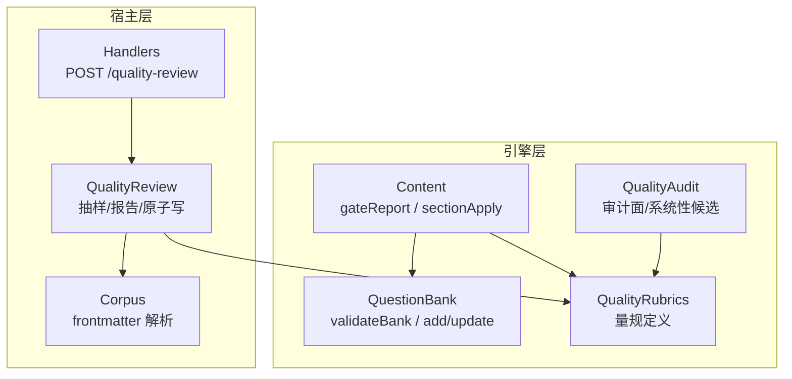
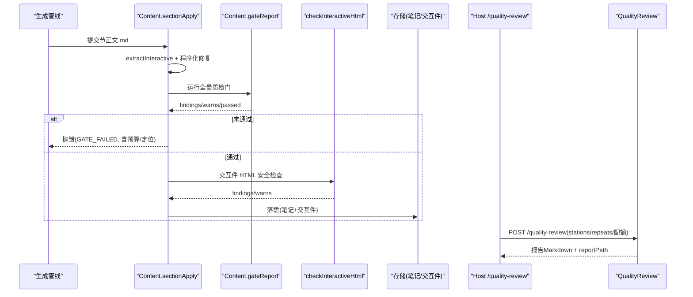
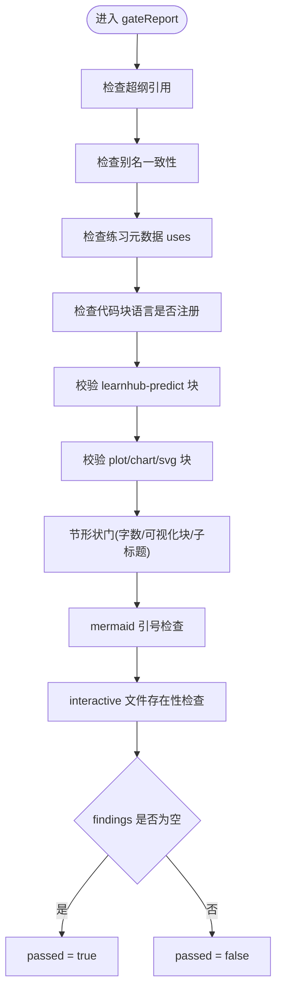
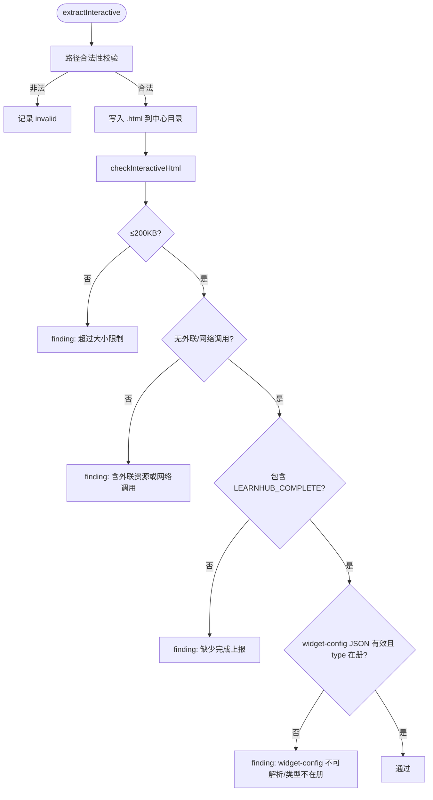
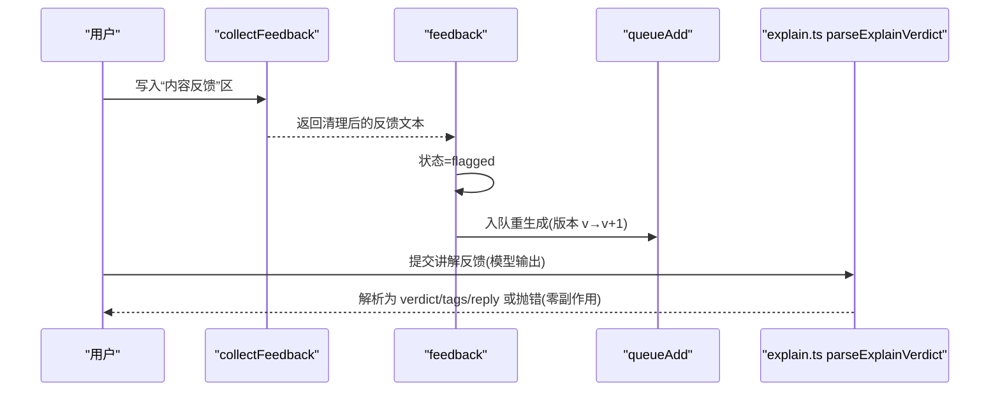
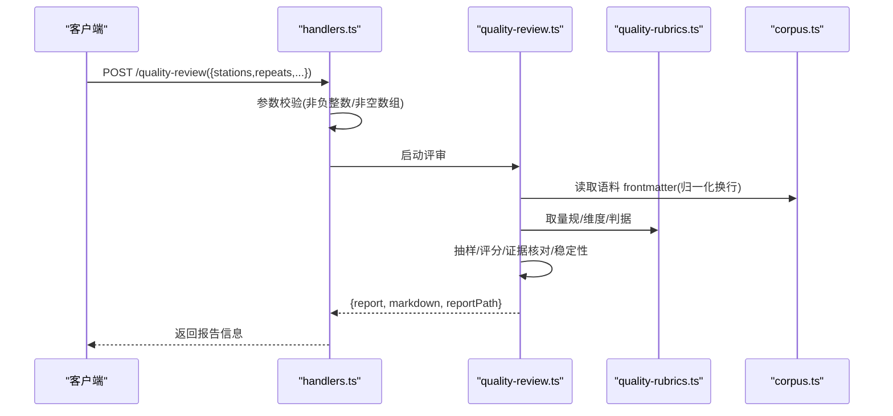
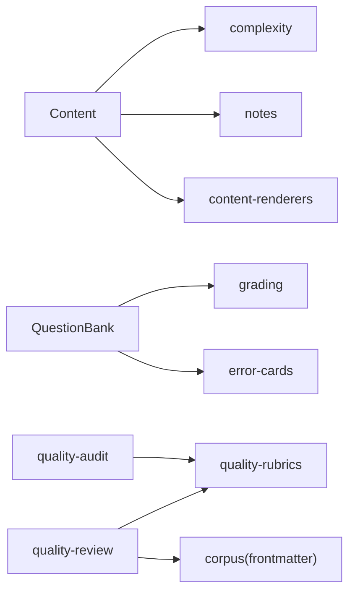

# 内容质检流程

<cite>
**本文引用的文件**
- [content.ts](file://src/engine/content.ts)
- [question-bank.ts](file://src/engine/question-bank.ts)
- [quality-rubrics.ts](file://src/engine/quality-rubrics.ts)
- [quality-audit.ts](file://src/engine/quality-audit.ts)
- [quality-review.ts](file://src/host/quality-review.ts)
- [handlers.ts](file://src/host/handlers.ts)
- [audit.ts](file://src/engine/audit.ts)
- [corpus.ts](file://src/host/corpus.ts)
- [explain.ts](file://src/engine/explain.ts)
</cite>

## 目录
1. [简介](#简介)
2. [项目结构](#项目结构)
3. [核心组件](#核心组件)
4. [架构总览](#架构总览)
5. [详细组件分析](#详细组件分析)
6. [依赖关系分析](#依赖关系分析)
7. [性能考量](#性能考量)
8. [故障排查指南](#故障排查指南)
9. [结论](#结论)
10. [附录](#附录)

## 简介
本技术文档面向 LearnHub 的内容质检流程，覆盖语法检查、语义验证与格式规范校验；重点说明 gateReport 的检查规则（节点依赖、前置条件、内容完整性）、题库关联检查（题目引用、难度匹配、质量评分）、交互件 HTML 合法性检查（路径、安全扫描、资源完整性），以及内容反馈收集与处理机制（解析、分类、自动修复建议）。文末提供 API 使用示例与扩展自定义检查规则的方法，并给出质检结果的数据结构与错误报告格式。

## 项目结构
LearnHub 的质检能力集中在引擎层（Content、QuestionBank、QualityRubrics、QualityAudit）与宿主层（Host handlers、quality-review、corpus 语料读取）。节级落盘前会执行“可自动化质检门”，失败则抛出结构化错误供修复轮消费；题库侧在写入与更新时进行 schema 门禁；离线评审器按量规对生成产物进行抽样评审并输出人读报告。



图表来源
- [content.ts:758-788](file://src/engine/content.ts#L758-L788)
- [question-bank.ts:139-262](file://src/engine/question-bank.ts#L139-L262)
- [quality-rubrics.ts:60-440](file://src/engine/quality-rubrics.ts#L60-L440)
- [quality-audit.ts:50-120](file://src/engine/quality-audit.ts#L50-L120)
- [handlers.ts:220-235](file://src/host/handlers.ts#L220-L235)
- [quality-review.ts:223-255](file://src/host/quality-review.ts#L223-L255)
- [corpus.ts:104-117](file://src/host/corpus.ts#L104-L117)

章节来源
- [content.ts:758-788](file://src/engine/content.ts#L758-L788)
- [question-bank.ts:139-262](file://src/engine/question-bank.ts#L139-L262)
- [quality-rubrics.ts:60-440](file://src/engine/quality-rubrics.ts#L60-L440)
- [quality-audit.ts:50-120](file://src/engine/quality-audit.ts#L50-L120)
- [handlers.ts:220-235](file://src/host/handlers.ts#L220-L235)
- [quality-review.ts:223-255](file://src/host/quality-review.ts#L223-L255)
- [corpus.ts:104-117](file://src/host/corpus.ts#L104-L117)

## 核心组件
- Content.gateReport：聚合全部可自动化质检门，返回 findings/warns/passed，驱动修复轮与落盘决策。
- QuestionBank.validateBank：题库 YAML 的结构与业务约束校验（题型、答案、难度等）。
- QualityRubrics：五类产物的质量量规（大纲/节正文/题目/教练回合/种子·终点），为评审器与人审提供统一标准。
- QualityAudit：图质量面审计（教练回合裁决质量、种子·终点资格）与系统性发现候选计算。
- Host quality-review：离线批量评审器，负责抽样、评分、稳定性统计、报告渲染与原子落盘。
- Corpus frontmatter 解析：统一归一化行尾、解析语料元数据，保证跨平台一致性。

章节来源
- [content.ts:758-788](file://src/engine/content.ts#L758-L788)
- [question-bank.ts:139-262](file://src/engine/question-bank.ts#L139-L262)
- [quality-rubrics.ts:60-440](file://src/engine/quality-rubrics.ts#L60-L440)
- [quality-audit.ts:50-120](file://src/engine/quality-audit.ts#L50-L120)
- [quality-review.ts:223-255](file://src/host/quality-review.ts#L223-L255)
- [corpus.ts:104-117](file://src/host/corpus.ts#L104-L117)

## 架构总览
内容质检贯穿“生成→质检门→修复→落盘”的闭环，同时通过离线评审器对生成产物进行质量抽检与报告沉淀。



图表来源
- [content.ts:949-1011](file://src/engine/content.ts#L949-L1011)
- [content.ts:758-788](file://src/engine/content.ts#L758-L788)
- [content.ts:1063-1090](file://src/engine/content.ts#L1063-L1090)
- [handlers.ts:220-235](file://src/host/handlers.ts#L220-L235)
- [quality-review.ts:223-255](file://src/host/quality-review.ts#L223-L255)

## 详细组件分析

### 内容质检门 gateReport
gateReport 是节级落盘前的“自动化质检门”，将多项检查汇总为 findings（阻断项）与 warns（警告项），并据此决定 passed。

- 超纲引用检测：正文提及的概念深度大于当前节点 → 警告。
- 别名一致性：正文出现不采用名 → 阻断（可通过 fixAliases 程序化修复）。
- 练习元数据 uses 标注：若存在练习元数据但缺少 uses → 警告。
- 代码块语言注册：未注册的语言会被面板降级为源码显示 → 警告。
- 预测门块结构校验：learnhub-predict 块字段齐全、选项互异、answer ∈ options → 阻断。
- 富内容块校验：plot/chart 必须为合法 JSON 对象；svg 必须以 <svg 开头 → 阻断。
- 节形状门：节内 ### 子标题 → 警告；正文过长按档位阈值判定 warn/finding；可视化块合计超限 → 阻断。
- mermaid 引号问题：节点文本含特殊字符未整体双引号包裹 → 警告。
- interactive 引用完整性：落盘后引用的 .html 文件不存在 → 阻断。



图表来源
- [content.ts:758-788](file://src/engine/content.ts#L758-L788)
- [content.ts:412-463](file://src/engine/content.ts#L412-L463)
- [content.ts:482-543](file://src/engine/content.ts#L482-L543)
- [content.ts:503-519](file://src/engine/content.ts#L503-L519)

章节来源
- [content.ts:758-788](file://src/engine/content.ts#L758-L788)
- [content.ts:412-463](file://src/engine/content.ts#L412-L463)
- [content.ts:482-543](file://src/engine/content.ts#L482-L543)
- [content.ts:503-519](file://src/engine/content.ts#L503-L519)

### 题库关联检查
题库校验在写入与更新时执行，确保题型、答案、难度、uses 等字段符合契约；多选至少两个正确项；数值题容差为正数；排序/匹配题答案与选项一致；开放题参考要点可选。

- validateBank：逐题校验，错误以 questions.n 路径定位。
- questionAnswerShapeError：服务端兜底，强制 multi_choice 至少两个正确项。
- updateQuestion：白名单字段修订，再次过 validateBank。
- 难度与 uses：difficulty 整数 1–3；uses 字符串数组用于 enc 投影与反哺。

```mermaid
classDiagram
class QuestionBank {
+load(courseRoot,node) BankDoc
+save(courseRoot,yamlText,expectedNode) {node,count,path}
+addQuestion(courseRoot,node,question) {id,count}
+updateQuestion(courseRoot,node,qid,patch) void
+archiveQuestion(courseRoot,node,qid,archived,reason) void
}
class Validate {
+validateBank(doc,expectedNode) {errors?,spec?}
+questionAnswerShapeError(q) string?
}
QuestionBank --> Validate : "调用"
```

图表来源
- [question-bank.ts:139-262](file://src/engine/question-bank.ts#L139-L262)
- [question-bank.ts:320-376](file://src/engine/question-bank.ts#L320-L376)

章节来源
- [question-bank.ts:139-262](file://src/engine/question-bank.ts#L139-L262)
- [question-bank.ts:320-376](file://src/engine/question-bank.ts#L320-L376)

### 交互件 HTML 合法性检查
交互件由标记块 ```learnhub-interactive:<相对路径>.html 提取，落盘前进行路径与安全扫描：

- 路径验证：仅允许课程根内相对路径，禁止 ..、空段、非 .html。
- 体积上限：单文件不超过 200KB。
- 安全扫描：禁止外联资源或网络调用（fetch/XMLHttpRequest），需自包含。
- 完成上报：必须包含 LEARNHUB_COMPLETE 上报。
- widget-config：JSON 可解析且 type 在类型菜单中。



图表来源
- [content.ts:790-815](file://src/engine/content.ts#L790-L815)
- [content.ts:1063-1090](file://src/engine/content.ts#L1063-L1090)

章节来源
- [content.ts:790-815](file://src/engine/content.ts#L790-L815)
- [content.ts:1063-1090](file://src/engine/content.ts#L1063-L1090)

### 内容反馈收集与处理
- 收集：从课程文件的“## 内容反馈”区读取用户文字，去除注释与括号包裹。
- 标记与入队：将节点状态置 flagged，并将重生成任务加入队列（版本递增）。
- 解析与归档：讲解反馈判词经 explain.ts 解析为 JSON，失败则零副作用不入档；成功则入 E 档案。



图表来源
- [content.ts:1356-1378](file://src/engine/content.ts#L1356-L1378)
- [explain.ts:68-79](file://src/engine/explain.ts#L68-L79)

章节来源
- [content.ts:1356-1378](file://src/engine/content.ts#L1356-L1378)
- [explain.ts:68-79](file://src/engine/explain.ts#L68-L79)

### 离线质量评审与报告
- 入口：POST /quality-review，参数 badQuota/okQuota/repeats/stations/systemic 等。
- 行为：按站抽样、两段式提示词评分、证据定位核对、稳定性统计、系统候选计算。
- 输出：Markdown 报告原子落盘至 state/质量评审，reportPath 回传。



图表来源
- [handlers.ts:220-235](file://src/host/handlers.ts#L220-L235)
- [quality-review.ts:223-255](file://src/host/quality-review.ts#L223-L255)
- [corpus.ts:104-117](file://src/host/corpus.ts#L104-L117)
- [quality-rubrics.ts:60-440](file://src/engine/quality-rubrics.ts#L60-L440)

章节来源
- [handlers.ts:220-235](file://src/host/handlers.ts#L220-L235)
- [quality-review.ts:223-255](file://src/host/quality-review.ts#L223-L255)
- [corpus.ts:104-117](file://src/host/corpus.ts#L104-L117)
- [quality-rubrics.ts:60-440](file://src/engine/quality-rubrics.ts#L60-L440)

### 图质量面审计与系统性候选
- 审计面：教练回合裁决质量（算子选择+理由 vs 图面）、种子·终点资格（ADR-0040/0056）。
- 系统性候选：按（站×维度）低分率越线即入候选，附带低分件引用与判据出处，供人审蒸馏新票或改量规。

章节来源
- [quality-audit.ts:50-120](file://src/engine/quality-audit.ts#L50-L120)
- [quality-rubrics.ts:292-439](file://src/engine/quality-rubrics.ts#L292-L439)

### 数据流与处理逻辑
- 节级落盘：sectionApply 先提取交互件并落盘，再执行 alias 与 rich blocks 程序化修复，随后 gateReport；若失败抛错（含 sectionId/标题/预算），供修复轮消费。
- 题库写入：save/add/update 均过 validateBank，错误直接拒绝落盘。
- 评审报告：quality-review 原子写报告，避免半新半旧观测。

章节来源
- [content.ts:949-1011](file://src/engine/content.ts#L949-L1011)
- [question-bank.ts:309-376](file://src/engine/question-bank.ts#L309-L376)
- [quality-review.ts:223-255](file://src/host/quality-review.ts#L223-L255)

## 依赖关系分析
- Content 依赖 Graph/Paths/Clock/VaultFs，并与 complexity/notes/yaml/seed/concepts/renderers 协作。
- QuestionBank 依赖 grading/sessions/srs/xp/bank-advice/error-cards/question-audit 等子系统。
- quality-review 依赖 corpus/frontmatter 解析与 quality-rubrics 量规表。
- audit 模块复用 quality-review 的统计与报告能力，仅注入审计面与候选计算。



图表来源
- [content.ts:1-28](file://src/engine/content.ts#L1-L28)
- [question-bank.ts:23-80](file://src/engine/question-bank.ts#L23-L80)
- [quality-review.ts:223-255](file://src/host/quality-review.ts#L223-L255)
- [quality-audit.ts:1-17](file://src/engine/quality-audit.ts#L1-L17)

章节来源
- [content.ts:1-28](file://src/engine/content.ts#L1-L28)
- [question-bank.ts:23-80](file://src/engine/question-bank.ts#L23-L80)
- [quality-review.ts:223-255](file://src/host/quality-review.ts#L223-L255)
- [quality-audit.ts:1-17](file://src/engine/quality-audit.ts#L1-L17)

## 性能考量
- 节形状门按档位预算派生阈值，避免全局硬编码；可视化块计数合并 mermaid/svg/plot/chart/interactive，减少重复扫描。
- 富内容块 JSON 解析支持尾随逗号与行注释容忍，降低 fast 档模型高频失误导致的返工成本。
- 交互件 HTML 检查在落盘前集中执行，尽早拦截大体积与不安全资源，避免运行时开销。
- 评审器抽样配额与 repeats 控制调用成本；报告原子写避免并发竞争。

[本节为通用指导，无需特定文件引用]

## 故障排查指南
- 节级质检失败：查看抛出的 GATE_FAILED 错误，包含 sectionId/标题/预算与具体 finding/warn 清单；根据定位（如“第 N 块”）进行局部修补或整节修复。
- 交互件缺失：确认 extractInteractive 的路径合法且文件已落盘；检查 checkInteractiveHtml 的 finding（大小/外联/完成上报/widget-config）。
- 题库写入失败：检查 validateBank 的错误列表，逐项修正题型/答案/难度/uses 等字段。
- 评审报告异常：确认 stations 非空、repeats≥1；检查 corpus frontmatter 解析是否受 CRLF 影响（已归一化处理）。

章节来源
- [content.ts:949-1011](file://src/engine/content.ts#L949-L1011)
- [content.ts:1063-1090](file://src/engine/content.ts#L1063-L1090)
- [question-bank.ts:139-262](file://src/engine/question-bank.ts#L139-L262)
- [corpus.ts:104-117](file://src/host/corpus.ts#L104-L117)

## 结论
LearnHub 的内容质检以 gateReport 为核心，结合题库 schema 校验与交互件安全扫描，形成“生成→质检→修复→落盘”的强约束闭环；离线评审器基于统一量规对产物进行质量抽检与报告沉淀，辅以图质量面审计识别系统性问题。该体系兼顾自动化与人工终审，确保内容质量的可控与可追溯。

[本节为总结性内容，无需特定文件引用]

## 附录

### 质检 API 使用示例
- 节级落盘：调用 Content.sectionApply(root, graph, node, sectionId, md, journal)，内部执行 gateReport 与交互件检查，失败抛错携带 sectionId/标题/预算。
- 题库写入：调用 QuestionBank.save/add/update，内部执行 validateBank，错误直接拒绝。
- 离线评审：POST /learnhub/api/quality-review，参数包括 stations、repeats、badQuota、okQuota、systemic.minSamples 等，返回 report/markdown/reportPath。

章节来源
- [content.ts:949-1011](file://src/engine/content.ts#L949-L1011)
- [question-bank.ts:309-376](file://src/engine/question-bank.ts#L309-L376)
- [handlers.ts:220-235](file://src/host/handlers.ts#L220-L235)
- [quality-review.ts:223-255](file://src/host/quality-review.ts#L223-L255)

### 自定义检查规则的扩展方式
- 新增内容级检查：在 Content.gateReport 中追加检查步骤，返回 findings/warns；必要时提供 fixRichBlocks 或 blockPatchPlan 支持局部修复。
- 新增题库约束：在 validateBank 中添加字段校验逻辑，并在 questionAnswerShapeError 中补充服务端兜底。
- 新增交互件规则：在 checkInteractiveHtml 中增加体积/安全/契约检查项。
- 新增量规维度：在 quality-rubrics.ts 中扩展维度与判据，并在 quality-review.ts 中消费；如需审计面，可在 quality-audit.ts 中配置 AUDIT_AXES。

章节来源
- [content.ts:758-788](file://src/engine/content.ts#L758-L788)
- [content.ts:561-587](file://src/engine/content.ts#L561-L587)
- [content.ts:1063-1090](file://src/engine/content.ts#L1063-L1090)
- [question-bank.ts:139-262](file://src/engine/question-bank.ts#L139-L262)
- [quality-rubrics.ts:60-440](file://src/engine/quality-rubrics.ts#L60-L440)
- [quality-audit.ts:50-120](file://src/engine/quality-audit.ts#L50-L120)

### 质检结果数据结构与错误报告格式
- 节级质检门返回：{ passed: boolean; findings: string[]; warns: string[] }。
- 节级落盘失败错误：code=GATE_FAILED，附加 sectionId/sectionTitle/wordBudget/wordBlock。
- 题库校验错误：validateBank 返回 errors 数组，按 questions.n 定位。
- 交互件检查返回：{ findings: string[]; warns: string[] }。
- 离线评审报告：返回 { report, markdown, reportPath }，报告为 Markdown，包含采样、评分、低分件、稳定性与系统候选。

章节来源
- [content.ts:758-788](file://src/engine/content.ts#L758-L788)
- [content.ts:981-992](file://src/engine/content.ts#L981-L992)
- [question-bank.ts:139-262](file://src/engine/question-bank.ts#L139-L262)
- [content.ts:1063-1090](file://src/engine/content.ts#L1063-L1090)
- [quality-review.ts:223-255](file://src/host/quality-review.ts#L223-L255)