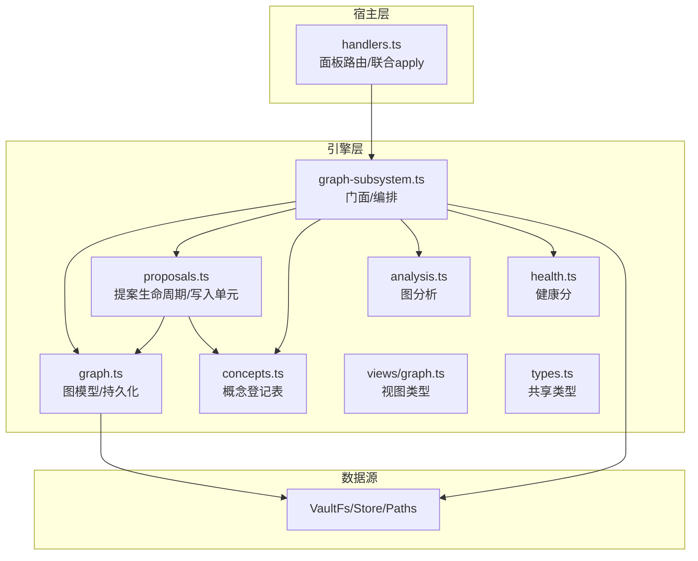
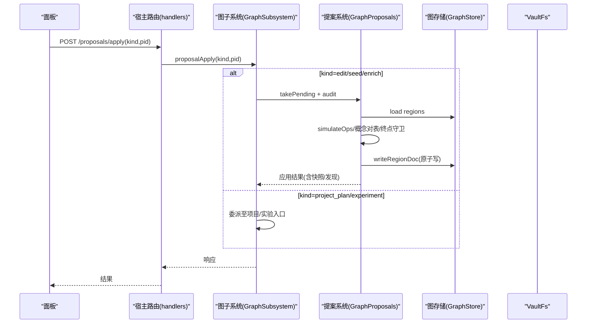
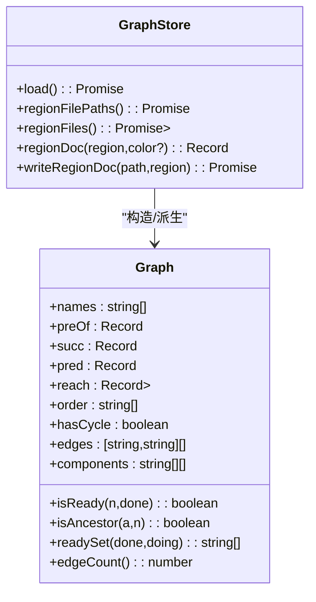
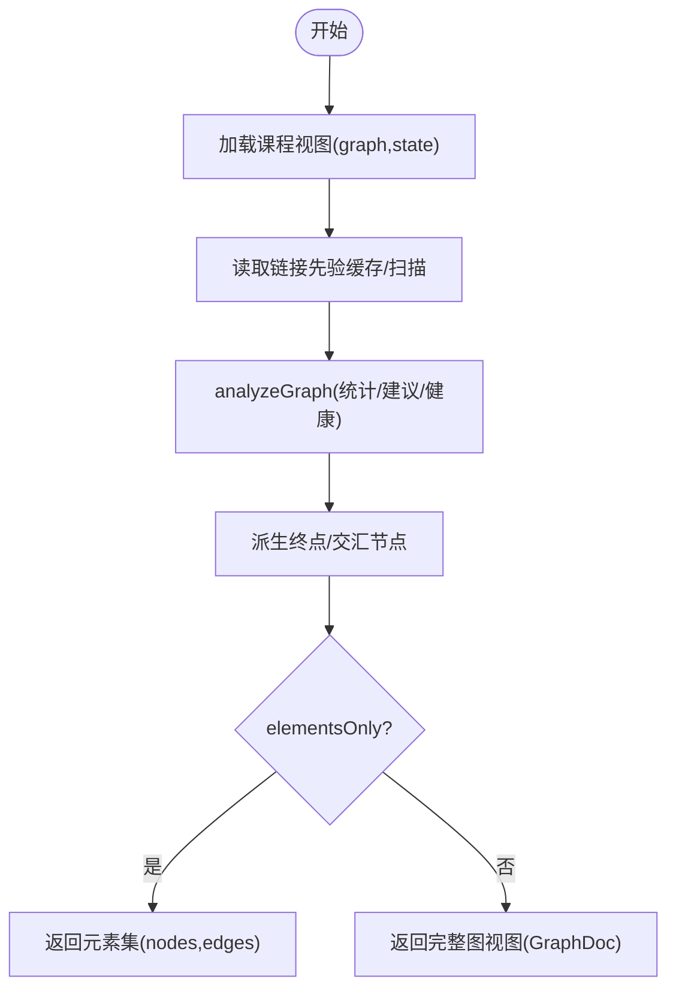
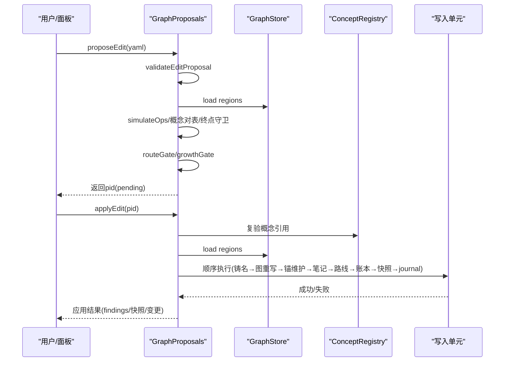
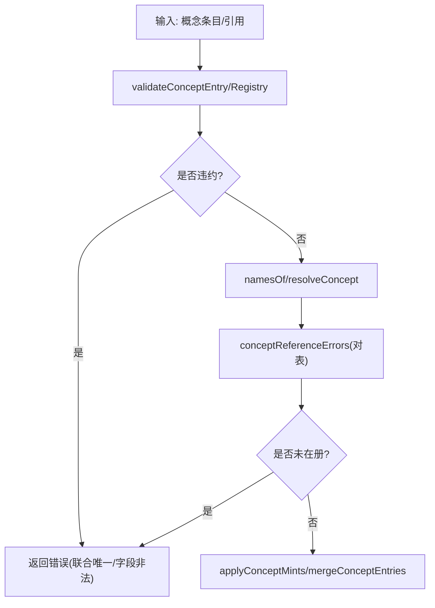
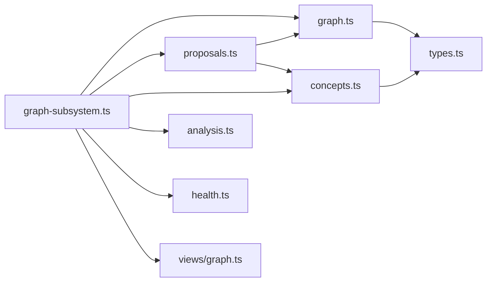

# 图谱数据流

<cite>
**本文引用的文件**
- [graph.ts](file://src/engine/graph.ts)
- [graph-subsystem.ts](file://src/engine/graph-subsystem.ts)
- [proposals.ts](file://src/engine/proposals.ts)
- [concepts.ts](file://src/engine/concepts.ts)
- [views/graph.ts](file://src/engine/views/graph.ts)
- [types.ts](file://src/engine/types.ts)
- [analysis.ts](file://src/engine/analysis.ts)
- [health.ts](file://src/engine/health.ts)
- [handlers.ts](file://src/host/handlers.ts)
- [data-check.ts](file://src/engine/data-check.ts)
</cite>

## 目录
1. [简介](#简介)
2. [项目结构](#项目结构)
3. [核心组件](#核心组件)
4. [架构总览](#架构总览)
5. [详细组件分析](#详细组件分析)
6. [依赖关系分析](#依赖关系分析)
7. [性能考量](#性能考量)
8. [故障排查指南](#故障排查指南)
9. [结论](#结论)
10. [附录](#附录)

## 简介
本技术文档围绕 LearnHub 知识图谱的数据流展开，系统性阐述图谱的构建与维护机制：节点与边关系管理、概念依赖分析、版本控制（提案系统）、变更合并策略、查询与优化、以及与内容的关联同步。文档同时给出数据结构模型、关键流程时序图与流程图，并提供可操作的 API 使用路径与数据完整性检查修复建议，帮助读者在不深入源码的情况下理解并正确使用图谱子系统。

## 项目结构
LearnHub 的图谱子系统位于 engine 层，以 graph.ts 为核心数据模型与持久化读写，graph-subsystem.ts 作为门面聚合分析、先验、探索、提案门禁与覆盖层回填等能力；proposals.ts 负责提案生命周期与写入单元事务；concepts.ts 维护受控概念登记表；views/graph.ts 定义对外视图类型；types.ts 提供共享类型；analysis.ts 与 health.ts 提供分析与健康分计算；host/handlers.ts 暴露面板路由与联合 apply 逻辑；data-check.ts 提供只读数据体检。

图表来源
- [graph.ts:1-514](file://src/engine/graph.ts#L1-L514)
- [graph-subsystem.ts:1-649](file://src/engine/graph-subsystem.ts#L1-L649)
- [proposals.ts:1-800](file://src/engine/proposals.ts#L1-L800)
- [concepts.ts:1-335](file://src/engine/concepts.ts#L1-L335)
- [views/graph.ts:1-241](file://src/engine/views/graph.ts#L1-L241)
- [types.ts:1-200](file://src/engine/types.ts#L1-L200)
- [analysis.ts:69-96](file://src/engine/analysis.ts#L69-L96)
- [health.ts:47-69](file://src/engine/health.ts#L47-L69)
- [handlers.ts:81-103](file://src/host/handlers.ts#L81-L103)

章节来源
- [graph.ts:1-514](file://src/engine/graph.ts#L1-L514)
- [graph-subsystem.ts:1-649](file://src/engine/graph-subsystem.ts#L1-L649)
- [proposals.ts:1-800](file://src/engine/proposals.ts#L1-L800)
- [concepts.ts:1-335](file://src/engine/concepts.ts#L1-L335)
- [views/graph.ts:1-241](file://src/engine/views/graph.ts#L1-L241)
- [types.ts:1-200](file://src/engine/types.ts#L1-L200)
- [analysis.ts:69-96](file://src/engine/analysis.ts#L69-L96)
- [health.ts:47-69](file://src/engine/health.ts#L47-L69)
- [handlers.ts:81-103](file://src/host/handlers.ts#L81-L103)

## 核心组件
- 图数据模型与持久化（Graph/GraphStore）：负责 data/*.yaml 的加载、解析、派生邻接表、拓扑序、传递约简边、连通分量、就绪判定与健康指标；提供快照与区域文档序列化。
- 图子系统（GraphSubsystem）：编排 analyze、vault 链接先验、浏览、路径查询、提案受理/应用、enc 覆盖层回填、种子起草等。
- 提案系统（GraphProposals）：edit/seed/enrich 三类提案的 schema 校验、模拟执行、概念引用对表、终点锚保护、写入单元事务、快照与日志。
- 概念登记（ConceptRegistry）：课程级受控词表，精确匹配解析、合并并入、冲突检测、引用对表。
- 视图与类型（views/graph.ts, types.ts）：对外返回的图分析、节点详情、浏览、路径结果等结构化视图；统一阶段、内容状态、Bloom 层级、难度等类型。
- 分析与健康（analysis.ts, health.ts）：图分析（统计、瓶颈、遗忘热点、建议）、健康分（动作句比例、est 覆盖率、前置完备等）。
- 宿主路由（handlers.ts）：面板端 /proposals/apply 的联合 apply 检测与分发。

章节来源
- [graph.ts:175-276](file://src/engine/graph.ts#L175-L276)
- [graph-subsystem.ts:88-117](file://src/engine/graph-subsystem.ts#L88-L117)
- [proposals.ts:556-605](file://src/engine/proposals.ts#L556-L605)
- [concepts.ts:282-335](file://src/engine/concepts.ts#L282-L335)
- [views/graph.ts:77-143](file://src/engine/views/graph.ts#L77-L143)
- [types.ts:8-107](file://src/engine/types.ts#L8-L107)
- [analysis.ts:69-96](file://src/engine/analysis.ts#L69-L96)
- [health.ts:47-69](file://src/engine/health.ts#L47-L69)
- [handlers.ts:81-103](file://src/host/handlers.ts#L81-L103)

## 架构总览
下图展示从面板到引擎再到存储的端到端数据流：面板发起请求，经宿主路由进入 GraphSubsystem，调用 proposals 进行提案受理与应用，最终通过 GraphStore 写回 data/*.yaml，并更新 state 区日志与快照。

图表来源
- [handlers.ts:81-103](file://src/host/handlers.ts#L81-L103)
- [graph-subsystem.ts:624-647](file://src/engine/graph-subsystem.ts#L624-L647)
- [proposals.ts:682-760](file://src/engine/proposals.ts#L682-L760)
- [graph.ts:203-276](file://src/engine/graph.ts#L203-L276)

## 详细组件分析

### 图数据模型与持久化（Graph/GraphStore）
- 节点与边：GNode/GBlock/GRegion 描述节点属性（pre/opt/note/enc/est/type/bloom/difficulty/teaches/assumes/misconceptions），Graph 构造时派生 preOf/succ/pred/reach/depth/order/edges/components 等索引。
- 结构检查：structureCheck 检测重名、断边、环；misconceptionCapErrors 限制同一概念误解条目上限。
- 持久化：GraphStore 按文件名顺序加载 data/*.yaml，regionDoc/writeRegionDoc 实现序列化与原子写；snapshotDoc 生成整图快照。

图表来源
- [graph.ts:278-443](file://src/engine/graph.ts#L278-L443)
- [graph.ts:198-276](file://src/engine/graph.ts#L198-L276)

章节来源
- [graph.ts:175-276](file://src/engine/graph.ts#L175-L276)
- [graph.ts:278-443](file://src/engine/graph.ts#L278-L443)
- [graph.ts:445-492](file://src/engine/graph.ts#L445-L492)

### 图子系统（GraphSubsystem）
- 图分析：graphAnalyze 整合 vault 链接先验、锚点、终点标记、交汇节点服务数，输出 GraphDoc/ElementsDoc。
- 链接先验回填：vaultLinksScan 扫描 Vault 链接，graphLinkBackfill 将高置信度候选映射为 enc 覆盖层提案。
- 浏览与路径：graphBrowse 按区/块过滤节点清单；graphPath 查询 from 是否在 to 的前置闭包内并返回链路与跨度。
- 提案与覆盖层：graphPropose/graphApply/graphReject 统一受理/应用/拒绝；graphEncBackfill 基于 Ready 内容与题目 invokes 投影生成 enrich 提案。
- 种子起草：seedPropose 组装提示词、门错修复轮、validateSeedProposal 后 proposeSeed。

图表来源
- [graph-subsystem.ts:88-117](file://src/engine/graph-subsystem.ts#L88-L117)
- [graph-subsystem.ts:125-152](file://src/engine/graph-subsystem.ts#L125-L152)
- [graph-subsystem.ts:155-195](file://src/engine/graph-subsystem.ts#L155-L195)
- [graph-subsystem.ts:198-265](file://src/engine/graph-subsystem.ts#L198-L265)
- [graph-subsystem.ts:267-404](file://src/engine/graph-subsystem.ts#L267-L404)
- [graph-subsystem.ts:406-429](file://src/engine/graph-subsystem.ts#L406-L429)
- [graph-subsystem.ts:445-524](file://src/engine/graph-subsystem.ts#L445-L524)
- [graph-subsystem.ts:568-616](file://src/engine/graph-subsystem.ts#L568-L616)

章节来源
- [graph-subsystem.ts:88-117](file://src/engine/graph-subsystem.ts#L88-L117)
- [graph-subsystem.ts:125-195](file://src/engine/graph-subsystem.ts#L125-L195)
- [graph-subsystem.ts:198-265](file://src/engine/graph-subsystem.ts#L198-L265)
- [graph-subsystem.ts:267-404](file://src/engine/graph-subsystem.ts#L267-L404)
- [graph-subsystem.ts:406-429](file://src/engine/graph-subsystem.ts#L406-L429)
- [graph-subsystem.ts:445-524](file://src/engine/graph-subsystem.ts#L445-L524)
- [graph-subsystem.ts:568-616](file://src/engine/graph-subsystem.ts#L568-L616)

### 提案系统与变更管理（GraphProposals）
- 受理流程：proposeEdit/proposeEnrich/proposeSeed 进行 schema 校验、模拟执行、概念引用对表、终点锚保护、路线门预检、生长闸门（插入/旁支调速），通过后落盘 pending 产物。
- 应用流程：applyEdit/applyEnrich/applySeed 在审计通过后，按写入单元顺序执行：铸名→图区重写→终点锚 sealed 维护→笔记联动→罗盘批内重写→边实验账本→快照→journal→提案 applied。
- 冲突检测与合并：conceptGateErrors 与 consolidationGateErrors 确保概念引用合法；endpointGuardErrors 防止越界生长；applyConceptMints 幂等合并概念条目；proposalApply 支持 project_plan/experiment 联合入口。

图表来源
- [proposals.ts:125-341](file://src/engine/proposals.ts#L125-L341)
- [proposals.ts:556-605](file://src/engine/proposals.ts#L556-L605)
- [proposals.ts:682-760](file://src/engine/proposals.ts#L682-L760)
- [proposals.ts:760-800](file://src/engine/proposals.ts#L760-L800)

章节来源
- [proposals.ts:125-341](file://src/engine/proposals.ts#L125-L341)
- [proposals.ts:556-605](file://src/engine/proposals.ts#L556-L605)
- [proposals.ts:682-800](file://src/engine/proposals.ts#L682-L800)

### 概念登记表（ConceptRegistry）
- 契约与解析：validateConceptEntry/validateConceptRegistry 保证 canonical/aliases/definition/confusable 形态与联合唯一性；resolveConcept 精确匹配解析。
- 引用对表：conceptReferenceErrors 用于提案受理/应用时对 teaches/assumes/misconceptions 的在册校验；invokesUnregistered/invokesTagged 统一题目 invokes 口径。
- 合并与冲突：mintConflicts 严格防冲突；applyConceptMints 幂等合并；mergeConceptEntries 执行并入（from 并入 into，旧地址经别名续解析）。

图表来源
- [concepts.ts:45-90](file://src/engine/concepts.ts#L45-L90)
- [concepts.ts:112-138](file://src/engine/concepts.ts#L112-L138)
- [concepts.ts:140-178](file://src/engine/concepts.ts#L140-L178)
- [concepts.ts:180-245](file://src/engine/concepts.ts#L180-L245)
- [concepts.ts:247-335](file://src/engine/concepts.ts#L247-L335)

章节来源
- [concepts.ts:45-90](file://src/engine/concepts.ts#L45-L90)
- [concepts.ts:112-138](file://src/engine/concepts.ts#L112-L138)
- [concepts.ts:140-178](file://src/engine/concepts.ts#L140-L178)
- [concepts.ts:180-245](file://src/engine/concepts.ts#L180-L245)
- [concepts.ts:247-335](file://src/engine/concepts.ts#L247-L335)

### 视图与类型（views/graph.ts, types.ts）
- 视图类型：GraphDoc/GraphElementsDoc/GraphNodeDoc/GraphBrowseDoc/GraphPathResult 等明确返回结构，包含 endpoints、stats、schema、nodes、edges、prereq_closure 等。
- 共享类型：Stage/ContentStatus/Fm/EncEdge/BloomLevel/ConceptTier/GNode/GBlock/GRegion/CourseEntry/JournalRec/PracticeRec/ReviewRec 等统一领域词汇。

章节来源
- [views/graph.ts:7-143](file://src/engine/views/graph.ts#L7-L143)
- [views/graph.ts:145-241](file://src/engine/views/graph.ts#L145-L241)
- [types.ts:8-107](file://src/engine/types.ts#L8-L107)
- [types.ts:109-200](file://src/engine/types.ts#L109-L200)

### 宿主路由与联合 apply（handlers.ts）
- pairJointTarget：检测 seed/project_plan 的 pair 联动，自动走联合 apply 入口，避免面板用户被单边守卫文案误导。
- 路由分发：/proposals/apply 根据 kind 分发到图谱/项目/实验入口，保持行为一致性与可观测性。

章节来源
- [handlers.ts:81-103](file://src/host/handlers.ts#L81-L103)

## 依赖关系分析
- 模块耦合：graph-subsystem 聚合 graph/proposals/concepts/analysis/health，降低 graph.ts 反向依赖风险；proposals 依赖 graph/concepts/store/paths/fs；concepts 独立且被多模块消费。
- 外部依赖：VaultFs/Store/Paths 提供文件系统与存储抽象；Clock 提供时间；Registry 提供课程注册表。
- 循环依赖规避：ADR-0043 将图域新文件放在领主同域，避免枢纽文件反向依赖下游模块。

图表来源
- [graph-subsystem.ts:1-77](file://src/engine/graph-subsystem.ts#L1-L77)
- [proposals.ts:1-38](file://src/engine/proposals.ts#L1-L38)
- [graph.ts:1-19](file://src/engine/graph.ts#L1-L19)
- [concepts.ts:1-28](file://src/engine/concepts.ts#L1-L28)
- [views/graph.ts:1-6](file://src/engine/views/graph.ts#L1-L6)
- [types.ts:1-10](file://src/engine/types.ts#L1-L10)

章节来源
- [graph-subsystem.ts:1-77](file://src/engine/graph-subsystem.ts#L1-L77)
- [proposals.ts:1-38](file://src/engine/proposals.ts#L1-L38)
- [graph.ts:1-19](file://src/engine/graph.ts#L1-L19)
- [concepts.ts:1-28](file://src/engine/concepts.ts#L1-L28)
- [views/graph.ts:1-6](file://src/engine/views/graph.ts#L1-L6)
- [types.ts:1-10](file://src/engine/types.ts#L1-L10)

## 性能考量
- 图构造复杂度：Graph 构造遍历所有节点与边，计算拓扑序、深度、可达集、传递约简边与连通分量，整体近似 O(N+E)，适合中等规模课程图。
- 路径查询：graphPath 采用 BFS 自 to 回溯父指针，时间复杂度 O(V+E)，空间 O(V)。
- 健康分计算：graphHealthScore 线性扫描 names 与 estOf，忽略终点，开销低。
- 写入原子性：regionDoc/writeRegionDoc 使用 atomicWrite，避免并发写导致的不一致。
- 建议：对大图场景可考虑按需加载 region 与延迟派生 reach；对高频查询可缓存 preOf/succ/pred 派生结果。

[本节为通用性能讨论，不直接分析具体文件]

## 故障排查指南
- 数据体检：data-check 提供只读盘点，识别 Missing/Broken 状态，不修改 Vault；结合 concept_registry、anchor book、note frontmatter、question bank 等契约校验定位问题。
- 常见错误：
  - 图 YAML 字段非法或未知键：parseNode/loadRegionDoc 抛 SchemaError，需修正字段名与枚举值。
  - 断边/环：structureCheck 报告重名、断边、环，需补全前置或删除环。
  - 概念引用未在册：conceptReferenceErrors 指出位置，需在 concepts 中铸名或使用既有名字。
  - 终点锚保护：endpointGuardErrors 阻止直改锚定终点或长过目标，需走显式动作或重新种子。
  - 覆盖层回填无变更：graphEncBackfill 返回 ops=0，说明已全覆盖或无可提升边。
- 修复建议：优先通过 propose-edit 或 enrich 提案修正，避免手工改文件；利用 applyFindings 的健康分提示定位短板。

章节来源
- [data-check.ts:1-24](file://src/engine/data-check.ts#L1-L24)
- [graph.ts:129-173](file://src/engine/graph.ts#L129-L173)
- [graph.ts:445-492](file://src/engine/graph.ts#L445-L492)
- [proposals.ts:355-379](file://src/engine/proposals.ts#L355-L379)
- [proposals.ts:615-680](file://src/engine/proposals.ts#L615-L680)
- [graph-subsystem.ts:568-616](file://src/engine/graph-subsystem.ts#L568-L616)

## 结论
LearnHub 的知识图谱子系统以严格的 schema 与契约为基础，通过提案系统实现安全的变更管理与版本控制；图模型提供高效的派生结构与查询能力；概念登记表保障术语一致性；宿主路由与写入单元确保事务性与可观测性。结合分析与健康分、链接先验与覆盖层回填，形成“构建—验证—优化—应用”的闭环，支撑课程知识的持续演进与内容联动。

[本节为总结，不直接分析具体文件]

## 附录
- 常用 API 路径（示例）：
  - 图分析：learnhub_graph_analyze(courseKey?, elementsOnly?)
  - 链接先验扫描：learnhub_vault_links_scan()
  - 链接先验回填：learnhub_graph_link_backfill(courseKey?)
  - 节点详情：learnhub_graph_node(courseKey, node)
  - 区/块浏览：learnhub_graph_browse(courseKey?, region?, block?)
  - 路径查询：learnhub_graph_path(courseKey?, from, to)
  - 提案受理：learnhub_graph_propose(kind, yamlText)
  - 提案应用：learnhub_graph_apply(kind, pid?, opts?)
  - 覆盖层回填：learnhub_graph_enc_backfill(courseKey?)
  - 种子起草：learnhub_seed_propose(input, agent)
- 数据管理模式：
  - 正典：data/*.yaml（图结构）、state/*（流水/快照/先验缓存）
  - 变更：提案 YAML 落盘 → 人审 → apply 生效 → journal + 快照
  - 概念：课程根/概念登记表.yaml，仅并入不删除，历史地址经别名续解析

[本节为补充信息，不直接分析具体文件]