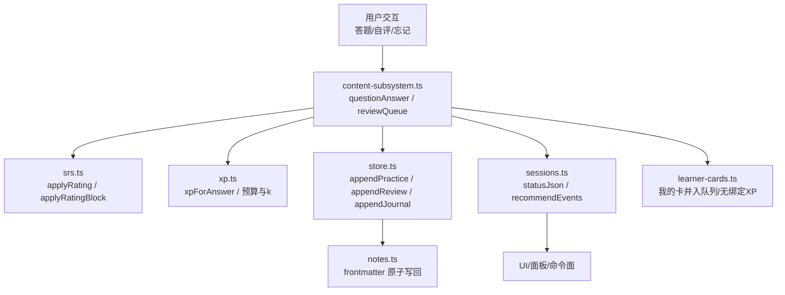
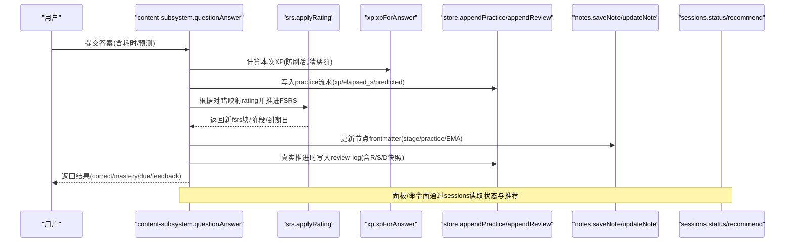
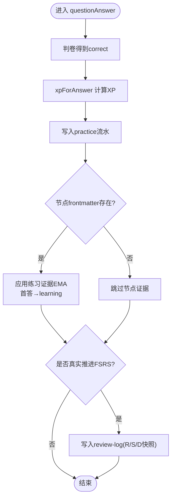
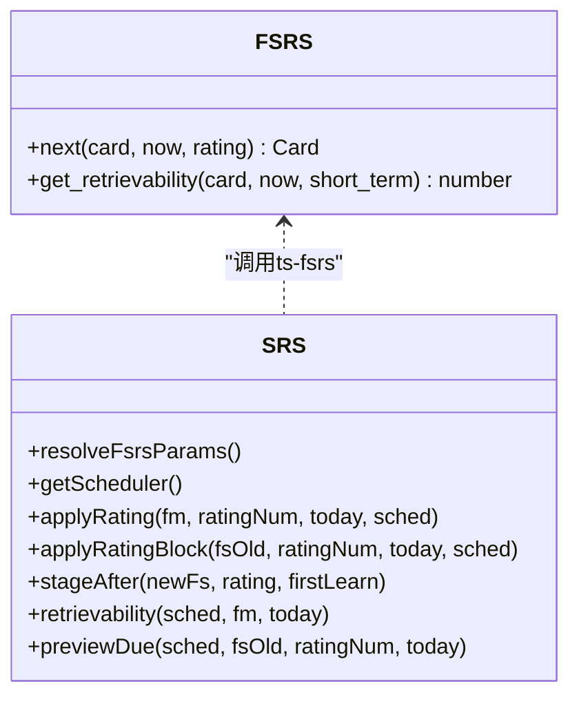
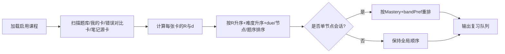
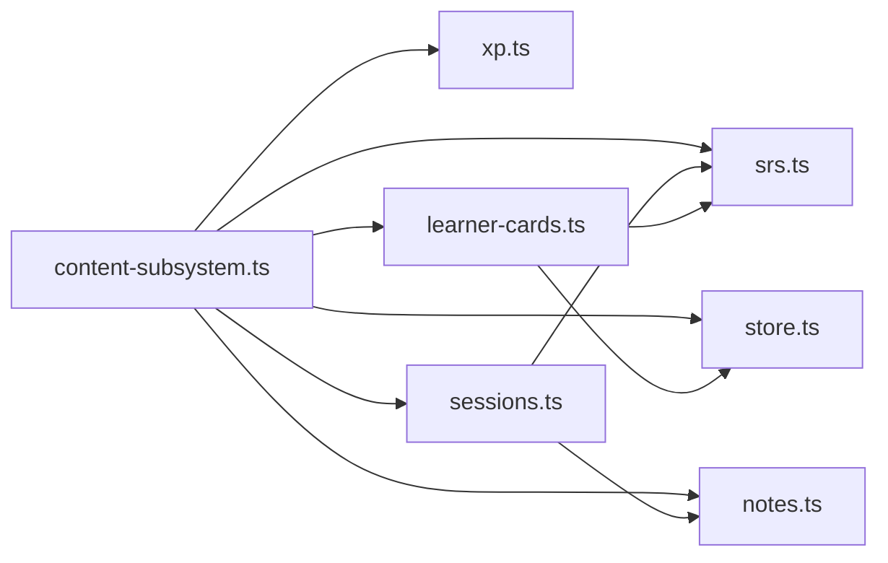
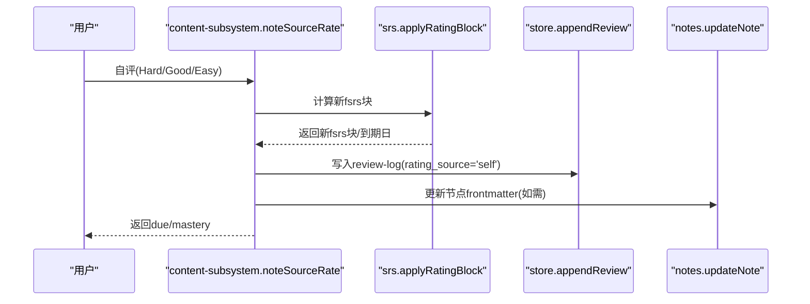

# 学习数据流

<cite>
**本文引用的文件**
- [srs.ts](file://src/engine/srs.ts)
- [store.ts](file://src/engine/store.ts)
- [content-subsystem.ts](file://src/engine/content-subsystem.ts)
- [xp.ts](file://src/engine/xp.ts)
- [sessions.ts](file://src/engine/sessions.ts)
- [learner-cards.ts](file://src/engine/learner-cards.ts)
- [types.ts](file://src/engine/types.ts)
- [params.ts](file://src/engine/params.ts)
- [notes.ts](file://src/engine/notes.ts)
- [0021-learner-cards-join-review-queue-unbound-xp.md](file://docs/adr/0021-learner-cards-join-review-queue-unbound-xp.md)
- [CONTEXT.md](file://CONTEXT.md)
</cite>

## 目录
1. [简介](#简介)
2. [项目结构](#项目结构)
3. [核心组件](#核心组件)
4. [架构总览](#架构总览)
5. [详细组件分析](#详细组件分析)
6. [依赖关系分析](#依赖关系分析)
7. [性能与一致性](#性能与一致性)
8. [故障排查指南](#故障排查指南)
9. [结论](#结论)
10. [附录：API 使用示例与数据模型](#附录api-使用示例与数据模型)

## 简介
本技术文档面向 LearnHub 的“学习数据流”，聚焦学习者答题数据的采集、处理与存储，复习调度（FSRS）应用、掌握度更新、XP 经验值与技能画像构建、学习会话状态管理，以及持久化策略（内存缓存、文件存储、数据同步）。文档以代码级事实为依据，配合流程图与时序图，帮助读者理解从一次作答到复习计划生成、再到能力画像更新的完整闭环。

## 项目结构
围绕学习数据流的关键模块分布在 engine 层：
- 调度内核：srs.ts（FSRS 参数解析、评分推进、阶段机、可提取性 R、掌握度口径）
- 存储层：store.ts（JSONL 追加式日志：practice/journal/review-log；提案、快照、pin、回执等）
- 内容子系统：content-subsystem.ts（复习队列装配、作答入口、笔记源卡、错误对比卡、JOL 抽查、难度带偏好）
- XP 与预算：xp.ts（时间账本、每日目标、streak、ETA、节点定价校准）
- 会话与推荐：sessions.ts（课程状态、推荐事件、A3 软闸建议、睡眠耦合建议）
- 学习者产出：learner-cards.ts（我的卡、无绑定 XP、队列合并、独立调度）
- 类型与参数：types.ts、params.ts（ReviewRec、PracticeRec、JournalRec、XP 常量、阈值）
- 笔记与 frontmatter：notes.ts（原子写、frontmatter 读写、状态视图）

图表来源
- [content-subsystem.ts:734-800](file://src/engine/content-subsystem.ts#L734-L800)
- [srs.ts:107-163](file://src/engine/srs.ts#L107-L163)
- [xp.ts:20-34](file://src/engine/xp.ts#L20-L34)
- [store.ts:51-143](file://src/engine/store.ts#L51-L143)
- [sessions.ts:318-357](file://src/engine/sessions.ts#L318-L357)
- [learner-cards.ts:538-717](file://src/engine/learner-cards.ts#L538-L717)

章节来源
- [content-subsystem.ts:734-800](file://src/engine/content-subsystem.ts#L734-L800)
- [srs.ts:107-163](file://src/engine/srs.ts#L107-L163)
- [store.ts:51-143](file://src/engine/store.ts#L51-L143)
- [sessions.ts:318-357](file://src/engine/sessions.ts#L318-L357)
- [learner-cards.ts:538-717](file://src/engine/learner-cards.ts#L538-L717)

## 核心组件
- FSRS 调度内核（srs.ts）
  - 参数正典化：沉淀正典 → 课程缓存 → 官方默认
  - 评分推进：applyRating/applyRatingBlock，维护 reps/lapses/stability/difficulty/due/last_review
  - 阶段机：stageAfter 决定 learning/review/mastered
  - 可提取性 R：retrievability/retrievabilityBlock
  - 掌握度口径 B：masteryOfFm = 0.7·稳定度完成度 + 0.3·练习证据
- 存储层（store.ts）
  - JSONL 追加：journal/practice/review-log
  - 原子写：proposals/pins/snapshots/e-archive/experiments
  - 读侧契约：缺失=空态，中段损坏=Broken 报错
- 内容子系统（content-subsystem.ts）
  - 复习队列装配：题卡/我的卡/错误对比卡/笔记源卡统一排序（R 升序，同档内难度由易到难）
  - 作答入口：questionAnswer 自动判卷、记 practice、推进 FSRS、更新节点 stage/frontmatter
  - JOL 抽查、难度带偏好、N-of-1 实验臂影响
- XP 与预算（xp.ts）
  - 时间账本：对=权重×难度、错=0、乱猜负 XP、同日重复 0
  - 节点定价：nominalBudget × difficultyCalibration（基于 FSRS difficulty 加权）
  - streak/ETA/每日目标
- 会话与推荐（sessions.ts）
  - statusJson/recommendEvents：复习/逾期/学习中/新课/struggle/睡眠建议
  - A3 软闸：gateAdvice 指向前置到期题
- 学习者产出（learner-cards.ts）
  - 我的卡并入复习队列，独立调度（sched(null)），无绑定 XP 走中心账本
  - 自评 Hard/Good/Easy + 忘记，不写入题库与节点证据

章节来源
- [srs.ts:29-61](file://src/engine/srs.ts#L29-L61)
- [srs.ts:107-183](file://src/engine/srs.ts#L107-L183)
- [store.ts:1-26](file://src/engine/store.ts#L1-L26)
- [store.ts:51-143](file://src/engine/store.ts#L51-L143)
- [content-subsystem.ts:538-717](file://src/engine/content-subsystem.ts#L538-L717)
- [xp.ts:20-79](file://src/engine/xp.ts#L20-L79)
- [sessions.ts:318-572](file://src/engine/sessions.ts#L318-L572)
- [learner-cards.ts:1-15](file://src/engine/learner-cards.ts#L1-L15)

## 架构总览
下图展示一次作答到复习计划生成的端到端流程，包括数据存储、FSRS 推进、掌握度更新与 XP 入账。

图表来源
- [content-subsystem.ts:734-800](file://src/engine/content-subsystem.ts#L734-L800)
- [srs.ts:107-163](file://src/engine/srs.ts#L107-L163)
- [xp.ts:20-34](file://src/engine/xp.ts#L20-L34)
- [store.ts:51-143](file://src/engine/store.ts#L51-L143)
- [notes.ts:315-328](file://src/engine/notes.ts#L315-L328)
- [sessions.ts:318-357](file://src/engine/sessions.ts#L318-L357)

## 详细组件分析

### 1) 答题数据采集与处理（questionAnswer）
- 输入：课程/节点/题号/答案/耗时/可选预测
- 判卷：按题型规则或 AI 判分，得到 score/correct
- XP 结算：xpForAnswer 考虑题型权重、难度、是否乱猜、是否同日重复
- Practice 流水：记录 course/node/qid/answer/correct/judge/elapsed_s/xp/predicted
- 节点证据：应用练习证据 EMA，首答将节点 stage 推进为 learning
- FSRS 推进：对=Good(3)、错=Again(1)，每题每天至多推进一次；复习刷卡流支持 deferSchedule（挂起自评）
- 代表卡回刷：若节点有未归档题，刷新代表卡 fsrs.due 最早者，派生 mastery
- 复习日志：仅真实推进时落 review-log，携带 rating_source 与 R/S/D 快照

图表来源
- [content-subsystem.ts:734-800](file://src/engine/content-subsystem.ts#L734-L800)
- [xp.ts:20-34](file://src/engine/xp.ts#L20-L34)
- [store.ts:100-116](file://src/engine/store.ts#L100-L116)
- [srs.ts:107-163](file://src/engine/srs.ts#L107-L163)

章节来源
- [content-subsystem.ts:734-800](file://src/engine/content-subsystem.ts#L734-L800)
- [xp.ts:20-34](file://src/engine/xp.ts#L20-L34)
- [store.ts:100-116](file://src/engine/store.ts#L100-L116)
- [srs.ts:107-163](file://src/engine/srs.ts#L107-L163)

### 2) FSRS 复习调度与卡片推进
- 参数正典化：优先使用沉淀正典，其次课程缓存，最后默认参数
- 评分推进：applyRating/applyRatingBlock 维护 reps/lapses/stability/difficulty/due/last_review
- 阶段机：stageAfter 依据稳定性与是否首学决定 learning/review/mastered
- 可提取性 R：用于队列排序与教练提示
- 预览到期：previewDue 用于自评按钮的到期预览

图表来源
- [srs.ts:29-61](file://src/engine/srs.ts#L29-L61)
- [srs.ts:107-163](file://src/engine/srs.ts#L107-L163)

章节来源
- [srs.ts:29-61](file://src/engine/srs.ts#L29-L61)
- [srs.ts:107-163](file://src/engine/srs.ts#L107-L163)

### 3) 复习队列装配与学习调度
- 队列组成：题卡（课程题库）、我的卡（E1）、错误对比卡（C-3）、笔记源卡（C1）
- 排序策略：主键 R 升序（到期风险最高先刷），同档内难度由易到难，再 due/节点/题序稳定排序
- 单节点会话：起点先验=节点 Mastery，叠加显式难度带偏好（挑战/简单/标准）
- JOL 抽查：按配置抽样标记预测卡，提升自我校准
- 我的卡与错误对比卡：独立调度（sched(null)），不入测量面统计，只进队列与无绑定 XP

图表来源
- [content-subsystem.ts:538-717](file://src/engine/content-subsystem.ts#L538-L717)
- [learner-cards.ts:538-717](file://src/engine/learner-cards.ts#L538-L717)

章节来源
- [content-subsystem.ts:538-717](file://src/engine/content-subsystem.ts#L538-L717)
- [learner-cards.ts:538-717](file://src/engine/learner-cards.ts#L538-L717)

### 4) 掌握度更新与两口径并存
- 口径 A：nodeMastery（题库正确率），用于作答响应/LessonView 写回
- 口径 B：masteryOfFm = 0.7·稳定度完成度 + 0.3·练习证据（EMA/准确率），用于图着色/lesson/coursesTree
- 代表卡刷新：节点聚合 fsrs.due 最早者，稳定度分量随复习前进

章节来源
- [content-subsystem.ts:817-840](file://src/engine/content-subsystem.ts#L817-L840)
- [srs.ts:165-183](file://src/engine/srs.ts#L165-L183)

### 5) XP 经验值与技能等级评估
- XP 时间账本：对=权重×难度、错=0、乱猜负 XP、同日重复 0
- 节点定价：nominalBudget × difficultyCalibration（基于 FSRS difficulty 加权）
- streak：宽容口径（≤1天漏不断链），从行为流水派生
- 技能条目 lane：执行事件（acquisition/maintenance）并行于题目 FSRS，不进复习队列，但产生 review-log 行（rating_source='execution'）

章节来源
- [xp.ts:20-79](file://src/engine/xp.ts#L20-L79)
- [xp.ts:124-183](file://src/engine/xp.ts#L124-L183)
- [types.ts:170-189](file://src/engine/types.ts#L170-L189)
- [skills.ts:160-192](file://src/engine/skills.ts#L160-L192)

### 6) 学习会话管理与中断恢复
- 会话状态跟踪：节点 stage（unseen/ready/learning/review/mastered/skipped）由 frontmatter 驱动
- 进度保存：practice/journal/review-log 追加式记录，支持断点续算
- 中断恢复：readJsonlLines 容错撕裂尾行；Broken 笔记 fail loud 避免掩盖损坏
- 推荐事件：recommendEvents 综合复习/逾期/学习中/新课/struggle/睡眠建议

章节来源
- [sessions.ts:318-572](file://src/engine/sessions.ts#L318-L572)
- [store.ts:475-479](file://src/engine/store.ts#L475-L479)
- [notes.ts:315-328](file://src/engine/notes.ts#L315-L328)

### 7) 持久化策略：内存缓存、文件存储、数据同步
- 内存缓存：FSRS 参数解析走 resolveFsrsParams（沉淀正典→课程缓存→默认），避免重复 IO
- 文件存储：JSONL 追加（practice/journal/review-log），原子写（proposals/pins/snapshots）
- 数据同步：notes.ts 原子写 frontmatter；store.ts 提供统一的 readJsonlLines 读契约
- 日志审计：corpus 捕获 LLM 调用，便于问题定位

章节来源
- [srs.ts:29-61](file://src/engine/srs.ts#L29-L61)
- [store.ts:1-26](file://src/engine/store.ts#L1-L26)
- [notes.ts:315-328](file://src/engine/notes.ts#L315-L328)
- [host/corpus.ts:281-313](file://src/host/corpus.ts#L281-L313)

## 依赖关系分析
- content-subsystem 依赖 srs（FSRS 推进）、xp（XP 结算）、store（日志）、notes（frontmatter）、sessions（状态/推荐）、learner-cards（我的卡）
- sessions 依赖 srs（R/阶段）、notes（frontmatter）、params（阈值）
- store 被多个子系统共享，作为唯一写入出口，保证一致性与可审计性
- learner-cards 与题库域隔离，但复用 srs.applyRatingBlock 与 store 追加

图表来源
- [content-subsystem.ts:1-100](file://src/engine/content-subsystem.ts#L1-L100)
- [sessions.ts:1-30](file://src/engine/sessions.ts#L1-L30)
- [learner-cards.ts:1-75](file://src/engine/learner-cards.ts#L1-L75)

章节来源
- [content-subsystem.ts:1-100](file://src/engine/content-subsystem.ts#L1-L100)
- [sessions.ts:1-30](file://src/engine/sessions.ts#L1-L30)
- [learner-cards.ts:1-75](file://src/engine/learner-cards.ts#L1-L75)

## 性能与一致性
- 性能优化
  - FSRS 参数正典化减少重复构造调度器
  - 复习队列按 R 分档排序，降低无效高成本卡片
  - JSONL 追加式写入，避免大对象锁竞争
  - 单节点会话按 Mastery 与 bandPref 预排序，减少切换开销
- 一致性保证
  - 所有写操作经 store.ts 统一出口，确保日志可审计
  - frontmatter 原子写，避免半写状态
  - Broken 笔记 fail loud，防止静默降级
  - 复习日志仅真实推进时写入，保证统计口径诚实

[本节为通用指导，无需特定文件引用]

## 故障排查指南
- 常见错误
  - 笔记 Broken：status/recommend/lesson 会抛错，需修复 frontmatter
  - 提案/实验定义损坏：loadProposals/loadExperiments 报 Broken，需修复或删除
  - 复习日志缺失/损坏：readJsonlLines 中段损坏报 Broken，仪表盘/优化器不可用
- 定位方法
  - 查看 journal/practice/review-log 最近条目，确认写入点
  - 检查 notes.ts 原子写是否成功
  - 使用 corpus 捕获的 LLM 调用记录定位生成问题

章节来源
- [store.ts:168-206](file://src/engine/store.ts#L168-L206)
- [store.ts:386-420](file://src/engine/store.ts#L386-L420)
- [store.ts:475-479](file://src/engine/store.ts#L475-L479)
- [notes.ts:315-328](file://src/engine/notes.ts#L315-L328)

## 结论
LearnHub 的学习数据流以 FSRS 为核心，结合严谨的存储契约与原子写机制，实现了从作答到复习调度的闭环。通过两口径掌握度、XP 时间账本与技能 lane，系统既关注短期表现也兼顾长期能力画像。会话管理与中断恢复保障了用户体验与数据可靠性。未来可在参数优化、个性化推荐与可视化方面继续增强。

[本节为总结，无需特定文件引用]

## 附录：API 使用示例与数据模型

### 关键 API 与调用路径
- 复习队列获取：content-subsystem.reviewQueue(courseKey?, node?, today?, bandPref?)
  - 用途：获取待复习卡片（题卡/我的卡/错误对比卡/笔记源卡）
  - 参考路径：[content-subsystem.ts:538-717](file://src/engine/content-subsystem.ts#L538-L717)
- 作答提交：content-subsystem.questionAnswer(llmComplete, courseKey, node, qid, answer, elapsedS?, opts?)
  - 用途：提交答案，自动判卷、记 practice、推进 FSRS、更新节点
  - 参考路径：[content-subsystem.ts:734-800](file://src/engine/content-subsystem.ts#L734-L800)
- 自评推进：content-subsystem.noteSourceRate(sourceId, qid, r) 或 learner-cards 对应接口
  - 用途：复习自评语义（Hard/Good/Easy）推进 FSRS
  - 参考路径：[content-subsystem.ts:73-78](file://src/engine/content-subsystem.ts#L73-L78)
- 忘记申报：content-subsystem.noteSourceForget(sourceId, qid)
  - 用途：直接翻面，按答错记，0 XP
  - 参考路径：[content-subsystem.ts:73-78](file://src/engine/content-subsystem.ts#L73-L78)
- 状态与推荐：sessions.statusJson(enabled, statsByCourse, today, dayCutoff) / recommendEvents(...)
  - 用途：获取课程状态与今日推荐事件
  - 参考路径：[sessions.ts:318-357](file://src/engine/sessions.ts#L318-L357), [sessions.ts:361-572](file://src/engine/sessions.ts#L361-L572)

### 数据模型速览
- ReviewRec：复习日志条目（ts/course/node/qid/rating/rating_source/elapsed_days/stability_before/difficulty_before/r_pred/exp/event_kind/exec_source）
  - 参考路径：[types.ts:170-189](file://src/engine/types.ts#L170-L189)
- PracticeRec：作答流水（ts/course/node/ex/answer/correct/judge/qid/feedback/elapsed_s/xp/predicted）
  - 参考路径：[store.ts:100-116](file://src/engine/store.ts#L100-L116)
- JournalRec：日志条目（ts/course/node/rating/kind/elapsed_days/session/duration_s/xp/detail）
  - 参考路径：[store.ts:51-64](file://src/engine/store.ts#L51-L64)
- FsrsBlock：FSRS 块（reps/lapses/stability/difficulty/due/last_review）
  - 参考路径：[srs.ts:83-92](file://src/engine/srs.ts#L83-L92)
- Fm：节点 frontmatter（stage/fsrs/content/practice/practice_ema 等）
  - 参考路径：[notes.ts:315-328](file://src/engine/notes.ts#L315-L328)

### 学习数据流时序图（自评场景）

图表来源
- [content-subsystem.ts:73-78](file://src/engine/content-subsystem.ts#L73-L78)
- [srs.ts:143-163](file://src/engine/srs.ts#L143-L163)
- [store.ts:125-143](file://src/engine/store.ts#L125-L143)
- [notes.ts:321-328](file://src/engine/notes.ts#L321-L328)

### 无绑定 XP 与我的卡（ADR-0021）
- 我的卡并入复习队列，独立调度（sched(null)），不入测量面统计
- 自评入账走无绑定 XP（kind='xp_learner'），计入总账/每日目标/streak，不进逐课程报表
- 参考裁决：[0021-learner-cards-join-review-queue-unbound-xp.md:5-11](file://docs/adr/0021-learner-cards-join-review-queue-unbound-xp.md#L5-L11)

章节来源
- [0021-learner-cards-join-review-queue-unbound-xp.md:5-11](file://docs/adr/0021-learner-cards-join-review-queue-unbound-xp.md#L5-L11)
- [learner-cards.ts:538-717](file://src/engine/learner-cards.ts#L538-L717)

### 能力画像与行为分析
- XP 时间账本：行为流水即事实，streak/ETA 派生
- 技能 lane：执行事件（acquisition/maintenance）并行于题目 FSRS，产生 review-log 行
- 参考路径：[xp.ts:124-183](file://src/engine/xp.ts#L124-L183), [types.ts:170-189](file://src/engine/types.ts#L170-L189)

章节来源
- [xp.ts:124-183](file://src/engine/xp.ts#L124-L183)
- [types.ts:170-189](file://src/engine/types.ts#L170-L189)

### 数据一致性要点
- 所有写操作经 store.ts 统一出口，确保日志可审计
- frontmatter 原子写，避免半写状态
- Broken 笔记 fail loud，防止静默降级
- 复习日志仅真实推进时写入，保证统计口径诚实

章节来源
- [store.ts:1-26](file://src/engine/store.ts#L1-L26)
- [notes.ts:315-328](file://src/engine/notes.ts#L315-L328)
- [CONTEXT.md:59-69](file://CONTEXT.md#L59-L69)