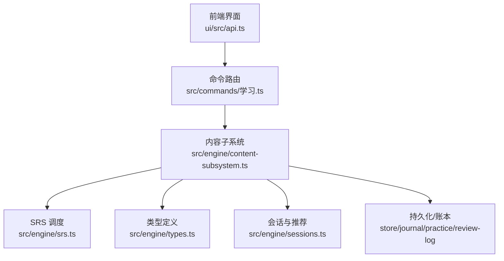
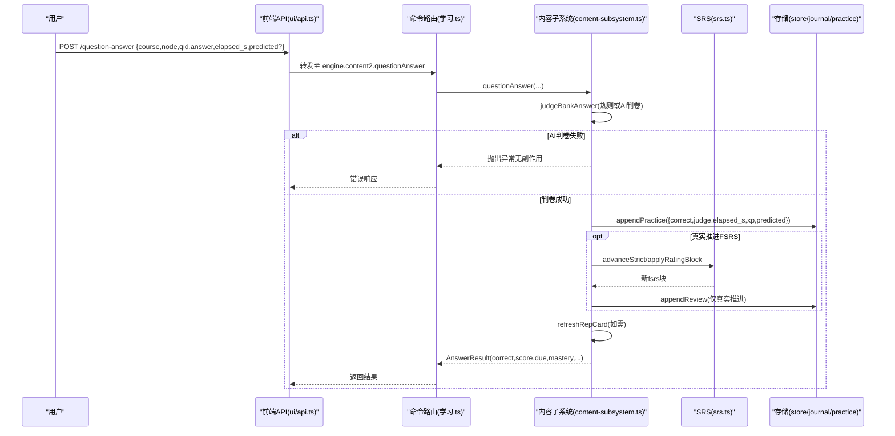
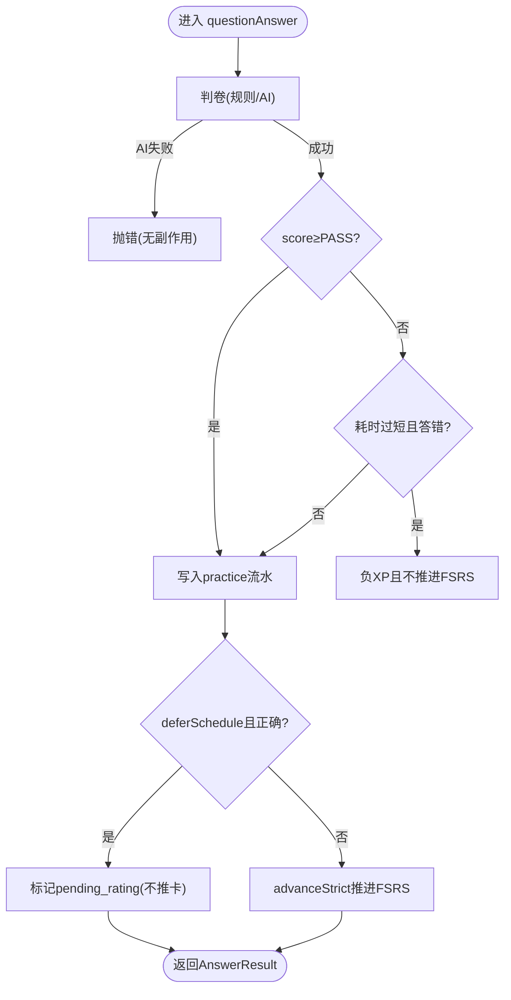
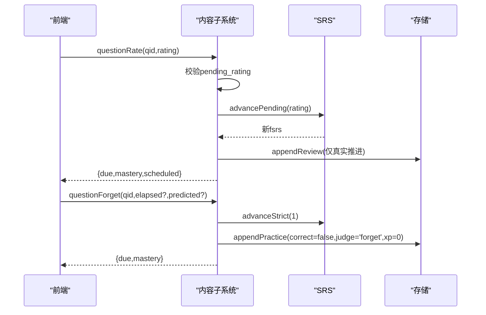
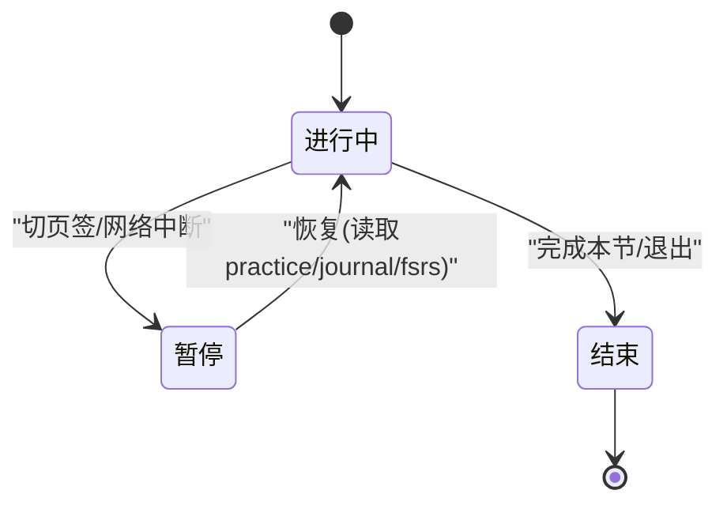
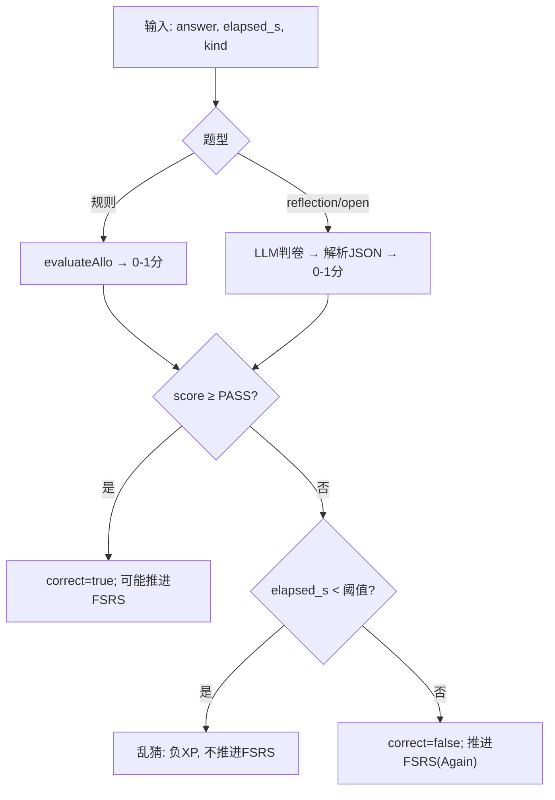
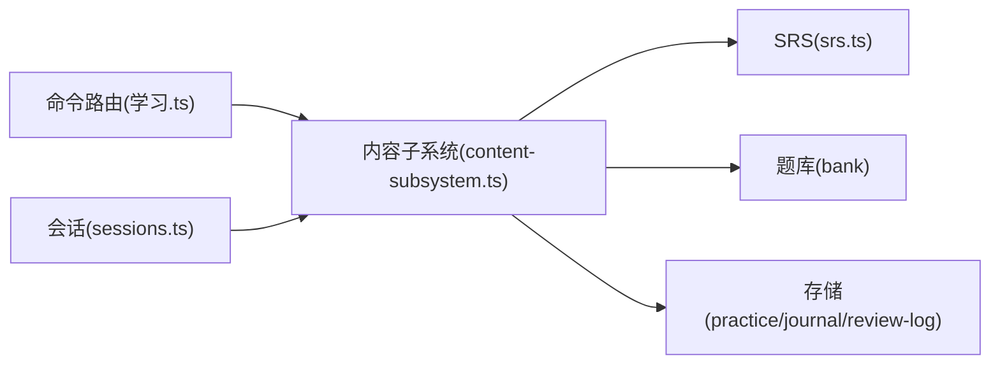

# 答题数据处理

<cite>
**本文引用的文件**
- [content-subsystem.ts](file://src/engine/content-subsystem.ts)
- [sessions.ts](file://src/engine/sessions.ts)
- [srs.ts](file://src/engine/srs.ts)
- [types.ts](file://src/engine/types.ts)
- [学习.ts](file://src/commands/学习.ts)
- [api.ts](file://ui/src/api.ts)
- [0027-practice-session-continuity-over-freshness.md](file://docs/adr/0027-practice-session-continuity-over-freshness.md)
- [CONTEXT.md](file://CONTEXT.md)
- [transactional-grading.test.ts](file://tests/transactional-grading.test.ts)
</cite>

## 目录
1. [简介](#简介)
2. [项目结构](#项目结构)
3. [核心组件](#核心组件)
4. [架构总览](#架构总览)
5. [详细组件分析](#详细组件分析)
6. [依赖关系分析](#依赖关系分析)
7. [性能考虑](#性能考虑)
8. [故障排查指南](#故障排查指南)
9. [结论](#结论)
10. [附录](#附录)

## 简介
本技术文档聚焦 LearnHub 的“答题数据处理”能力，覆盖学习者作答数据的采集、验证与存储流程；说明作答记录结构、成绩计算与正确性判断逻辑；阐述答题会话的状态管理（创建、更新、进度保存、中断恢复）；解释评分系统实现（分数标准化、难度系数调整、时间惩罚等规则）；并给出一致性保障机制（事务处理、错误恢复、数据同步策略）。文末提供 API 使用示例与性能优化建议、常见问题解决方案。

## 项目结构
围绕答题数据处理的代码主要分布在以下模块：
- 引擎层（engine）：内容子系统负责判卷、作答、复习结算、FSRS 调度推进；会话与推荐模块负责学习状态与事件生成；SRS 模块封装 FSRS 数学与卡片推进；类型定义集中描述作答流水、复习日志等数据结构。
- 命令面（commands）：对外暴露 /question-answer、/question-rate、/question-forget、/review-queue 等路由。
- 前端 API（ui）：封装 HTTP 调用，统一请求参数与响应类型。
- ADR/上下文：会话连续性、判卷逃生门、练习会话边界等设计决策与术语说明。

图表来源
- [api.ts:56-86](file://ui/src/api.ts#L56-L86)
- [学习.ts:425-447](file://src/commands/学习.ts#L425-L447)
- [content-subsystem.ts:734-849](file://src/engine/content-subsystem.ts#L734-L849)
- [srs.ts:143-164](file://src/engine/srs.ts#L143-L164)
- [types.ts:147-189](file://src/engine/types.ts#L147-L189)

章节来源
- [api.ts:56-86](file://ui/src/api.ts#L56-L86)
- [学习.ts:425-447](file://src/commands/学习.ts#L425-L447)
- [content-subsystem.ts:734-849](file://src/engine/content-subsystem.ts#L734-L849)
- [srs.ts:143-164](file://src/engine/srs.ts#L143-L164)
- [types.ts:147-189](file://src/engine/types.ts#L147-L189)

## 核心组件
- 内容子系统（content-subsystem.ts）
  - 判卷：规则题直接评估；reflection/open_question 走 AI 判卷，失败重试后仍失败则抛错（不写任何副作用）。
  - 作答：记录 practice 流水、节点证据 EMA、首答推进节点 stage；按 deferSchedule 控制是否挂起 FSRS 推进。
  - 复习结算：questionRate 仅推进 FSRS，不重复记账与 XP；questionForget 按答错记证据与 0 XP。
- SRS 模块（srs.ts）
  - applyRatingBlock：将 1-4 评级映射为 FSRS 卡片推进，返回新 fsrs 块与元信息。
  - previewDue：预览不同自评档位后的下次到期日。
- 会话与推荐（sessions.ts）
  - 学习日、课程状态、动态推荐事件、软闸建议、struggle 判定等。
- 类型（types.ts）
  - PracticeRec：practice 作答流水条目（含 elapsed_s、xp、predicted 等）。
  - ReviewRec：复习日志条目（rating_source、elapsed_days 等）。

章节来源
- [content-subsystem.ts:734-849](file://src/engine/content-subsystem.ts#L734-L849)
- [content-subsystem.ts:852-903](file://src/engine/content-subsystem.ts#L852-L903)
- [content-subsystem.ts:934-971](file://src/engine/content-subsystem.ts#L934-L971)
- [content-subsystem.ts:974-1000](file://src/engine/content-subsystem.ts#L974-L1000)
- [srs.ts:143-164](file://src/engine/srs.ts#L143-L164)
- [sessions.ts:175-214](file://src/engine/sessions.ts#L175-L214)
- [types.ts:147-189](file://src/engine/types.ts#L147-L189)

## 架构总览
下图展示一次完整作答到存储与调度的端到端流程，包括规则/AI 判卷、practice 流水写入、FSRS 推进与代表卡回刷。

图表来源
- [api.ts:56-86](file://ui/src/api.ts#L56-L86)
- [学习.ts:425-447](file://src/commands/学习.ts#L425-L447)
- [content-subsystem.ts:734-849](file://src/engine/content-subsystem.ts#L734-L849)
- [srs.ts:143-164](file://src/engine/srs.ts#L143-L164)

## 详细组件分析

### 作答与判卷（questionAnswer）
- 判卷路径
  - 规则题：evaluateAllo 直接产出 score/feedback。
  - reflection/open_question：构造提示词调用 LLM，解析 JSON；失败自动重问一次；仍失败抛错且不落盘任何数据（事务性）。
- 正确性判断
  - 以 PASS_SCORE 阈值判定 correct；reflection/open_question 由 AI 输出归一化为 0-1 分再比较。
- 练习证据与节点阶段
  - 首次作答将节点从 ready/unseen 推进 learning；后续根据 correct 更新 EMA。
- FSRS 推进与会话挂起
  - 默认：对=Good(3)、错=Again(1)，同日每卡仅推进一次（advanceStrict）。
  - 复习刷卡流：deferSchedule=true 且 correct 时，仅记账并设置 pending_rating，不推卡；待 questionRate 结算。
- 乱猜与 XP
  - 耗时过短且答错视为乱猜，负 XP 且不推进 FSRS，避免污染难度校准。
- 直通披露
  - 错题返回 diff 摘要，帮助对齐答案键。

图表来源
- [content-subsystem.ts:734-849](file://src/engine/content-subsystem.ts#L734-L849)
- [content-subsystem.ts:852-903](file://src/engine/content-subsystem.ts#L852-L903)

章节来源
- [content-subsystem.ts:734-849](file://src/engine/content-subsystem.ts#L734-L849)
- [content-subsystem.ts:852-903](file://src/engine/content-subsystem.ts#L852-L903)

### 复习结算与忘记申报（questionRate / questionForget）
- questionRate
  - 准入：stats.last=today 且 stats.pending_rating=true（来自 deferSchedule 作答）。
  - 行为：仅推进 FSRS（Hard/Good/Easy → 2/3/4），不重复记账、不给 XP；写 review 日志；回刷代表卡。
- questionForget
  - 语义：不作答直接翻面，按答错记证据与 0 XP；当日已真实推进拒绝重复；允许“完成学习”初始化后的覆推 Again。
  - JOL：支持 predicted 字段随流水配对。

图表来源
- [content-subsystem.ts:934-971](file://src/engine/content-subsystem.ts#L934-L971)
- [content-subsystem.ts:974-1000](file://src/engine/content-subsystem.ts#L974-L1000)
- [srs.ts:143-164](file://src/engine/srs.ts#L143-L164)

章节来源
- [content-subsystem.ts:934-971](file://src/engine/content-subsystem.ts#L934-L971)
- [content-subsystem.ts:974-1000](file://src/engine/content-subsystem.ts#L974-L1000)
- [srs.ts:143-164](file://src/engine/srs.ts#L143-L164)

### 会话管理与进度保存
- 会话边界
  - 一次连续作答过程属于一个会话；同一次学习里每题只作答一次；后台生成/修订不重置会话（ADR-0027）。
  - 直通卡：当日已推进的题在会话中直接披露答案与解析，不计统计与 XP。
- 进度保存与中断恢复
  - 通过 practice.jsonl、journal.jsonl、review-log.jsonl 与题库 frontmatter（fsrs/stats）共同保证可恢复；会话期间题目集与正文不热替换，确保体验稳定。
- 推荐与软闸
  - sessions.recommendEvents 综合 due、R-gate、struggle、pin、睡眠建议等生成事件；被 R-gate 拦下的候选附带可执行复习建议项。

图表来源
- [0027-practice-session-continuity-over-freshness.md:1-4](file://docs/adr/0027-practice-session-continuity-over-freshness.md#L1-L4)
- [CONTEXT.md:308-318](file://CONTEXT.md#L308-L318)
- [sessions.ts:361-572](file://src/engine/sessions.ts#L361-L572)

章节来源
- [0027-practice-session-continuity-over-freshness.md:1-4](file://docs/adr/0027-practice-session-continuity-over-freshness.md#L1-L4)
- [CONTEXT.md:308-318](file://CONTEXT.md#L308-L318)
- [sessions.ts:361-572](file://src/engine/sessions.ts#L361-L572)

### 评分系统与计算规则
- 分数标准化
  - 规则题：evaluateAllo 输出 0-1 分；reflection/open_question：AI 输出经解析归一化（开放题除以 10）。
  - PASS_SCORE 阈值决定 correct。
- 难度系数调整
  - 会话内选题基于节点 Mastery 先验 + 显式难度带偏好（bandPref），按距离排序自适应调整难度带。
- 时间惩罚
  - elapsed_s < 阈值且答错视为乱猜：负 XP 且不推进 FSRS，防止干扰难度校准。
- 复习自评
  - Hard/Good/Easy 映射 2/3/4，影响下次间隔与稳定性；previewDue 用于按钮预览。

图表来源
- [content-subsystem.ts:734-849](file://src/engine/content-subsystem.ts#L734-L849)
- [content-subsystem.ts:852-903](file://src/engine/content-subsystem.ts#L852-L903)
- [srs.ts:143-164](file://src/engine/srs.ts#L143-L164)

章节来源
- [content-subsystem.ts:734-849](file://src/engine/content-subsystem.ts#L734-L849)
- [content-subsystem.ts:852-903](file://src/engine/content-subsystem.ts#L852-L903)
- [srs.ts:143-164](file://src/engine/srs.ts#L143-L164)

### 数据一致性与事务性
- 判卷失败事务性
  - AI 判卷失败（两次尝试）抛错，不写 bank/note/practice/journal；测试覆盖空输出、畸形分数等场景。
- 同日重复守卫
  - advanceStrict/alreadyAdvanced 确保每卡每天仅推进一次；deferSchedule 作答后同日再作答视为重复，保持 pending 态。
- 证据与调度分离
  - practice 流水与 review-log 分开；只有真实推进才写 review-log；代表卡回刷仅在真实推进后重算。

章节来源
- [transactional-grading.test.ts:40-106](file://tests/transactional-grading.test.ts#L40-L106)
- [content-subsystem.ts:734-849](file://src/engine/content-subsystem.ts#L734-L849)
- [content-subsystem.ts:934-971](file://src/engine/content-subsystem.ts#L934-L971)

## 依赖关系分析
- 命令路由依赖内容子系统暴露的 questionAnswer/questionRate/questionForget。
- 内容子系统依赖 SRS 进行卡片推进，依赖 store 写入 practice/journal/review-log，依赖 bank 更新题目证据。
- 会话与推荐依赖 graph/state 与题库聚合统计，驱动事件与软闸建议。

图表来源
- [学习.ts:425-447](file://src/commands/学习.ts#L425-L447)
- [content-subsystem.ts:734-849](file://src/engine/content-subsystem.ts#L734-L849)
- [sessions.ts:361-572](file://src/engine/sessions.ts#L361-L572)

章节来源
- [学习.ts:425-447](file://src/commands/学习.ts#L425-L447)
- [content-subsystem.ts:734-849](file://src/engine/content-subsystem.ts#L734-L849)
- [sessions.ts:361-572](file://src/engine/sessions.ts#L361-L572)

## 性能考虑
- 减少不必要的 FSRS 推进：deferSchedule 路径仅在自评结算时推进，降低重复计算。
- 会话内自适应选题：按 Mastery 先验与 bandPref 选择接近当前能力的题，提升流畅度与学习效率。
- 判卷失败快速失败：AI 判卷失败立即抛错，避免无效 IO。
- 批量查询与缓存：推荐事件与状态汇总尽量复用图与状态视图，减少重复加载。

## 故障排查指南
- AI 判卷失败
  - 现象：questionAnswer 抛错，无任何数据写入。
  - 排查：查看 state/判卷失败.jsonl 中的原始模型输出与定位信息；检查题目类型是否为 reflection/open_question。
- 同日重复作答
  - 现象：再次提交相同题目被拒绝或仅记账不推进。
  - 排查：确认 stats.last 与 today；若使用了 deferSchedule，需等待 questionRate 结算。
- 忘记申报冲突
  - 现象：questionForget 报错“今日已有作答记录”。
  - 排查：确认是否已在练习流真实推进；“完成学习”初始化后的覆推 Again 是允许的。
- 乱猜判定
  - 现象：极短耗时且答错导致负 XP。
  - 排查：检查 elapsed_s 与阈值；必要时引导学习者放慢节奏。

章节来源
- [content-subsystem.ts:852-903](file://src/engine/content-subsystem.ts#L852-L903)
- [content-subsystem.ts:734-849](file://src/engine/content-subsystem.ts#L734-L849)
- [content-subsystem.ts:974-1000](file://src/engine/content-subsystem.ts#L974-L1000)

## 结论
LearnHub 的答题数据处理以“判卷—记账—调度—回刷”为主线，结合会话连续性、软闸建议与自适应选题，形成闭环的学习体验。通过严格的事务性约束与同日守卫，确保数据一致性与公平性；通过 AI 判卷与规则判卷双通道，兼顾灵活性与可靠性。未来可在参数优化、短期增强建模等方面持续演进。

## 附录

### API 使用示例（路径引用）
- 作答
  - 前端调用：POST /question-answer
  - 参考路径：[api.ts:56-61](file://ui/src/api.ts#L56-L61)
  - 命令绑定：[学习.ts:425-447](file://src/commands/学习.ts#L425-L447)
- 复习自评
  - 前端调用：POST /question-rate
  - 参考路径：[api.ts:62-64](file://ui/src/api.ts#L62-L64)
  - 引擎实现：[content-subsystem.ts:934-971](file://src/engine/content-subsystem.ts#L934-L971)
- 忘记申报
  - 前端调用：POST /question-forget
  - 参考路径：[api.ts:65-67](file://ui/src/api.ts#L65-L67)
  - 引擎实现：[content-subsystem.ts:974-1000](file://src/engine/content-subsystem.ts#L974-L1000)
- 复习队列
  - 前端调用：GET /review-queue
  - 参考路径：[api.ts:80-83](file://ui/src/api.ts#L80-L83)
  - 引擎实现：[content-subsystem.ts:669-717](file://src/engine/content-subsystem.ts#L669-L717)

章节来源
- [api.ts:56-86](file://ui/src/api.ts#L56-L86)
- [学习.ts:425-447](file://src/commands/学习.ts#L425-L447)
- [content-subsystem.ts:669-717](file://src/engine/content-subsystem.ts#L669-L717)
- [content-subsystem.ts:934-1000](file://src/engine/content-subsystem.ts#L934-L1000)