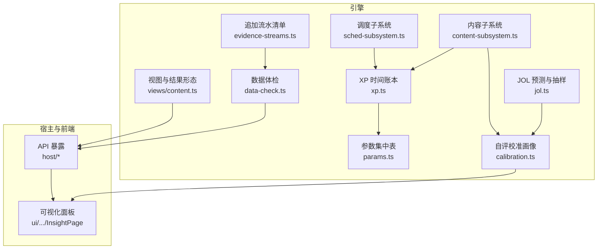
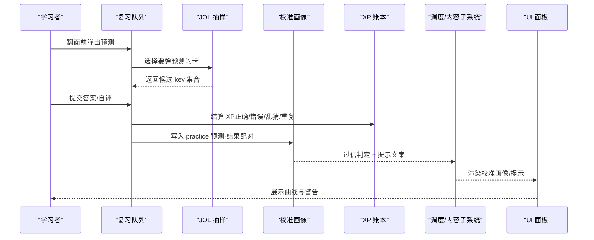
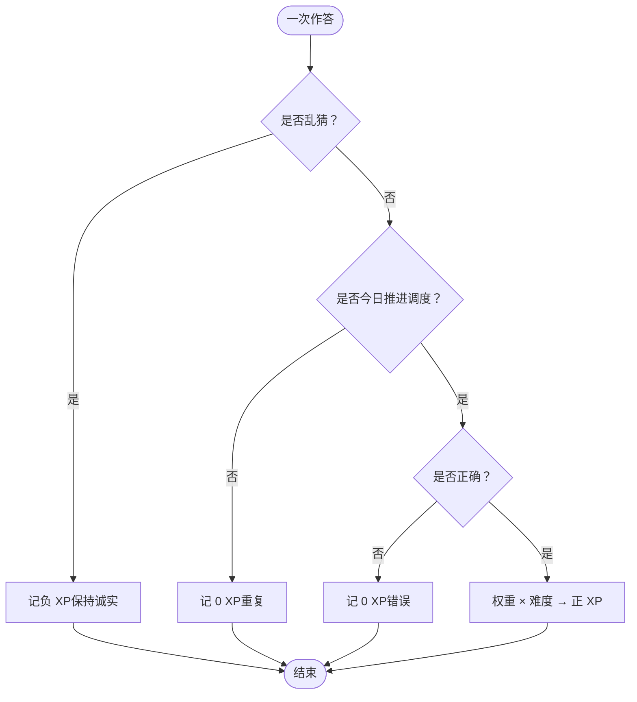
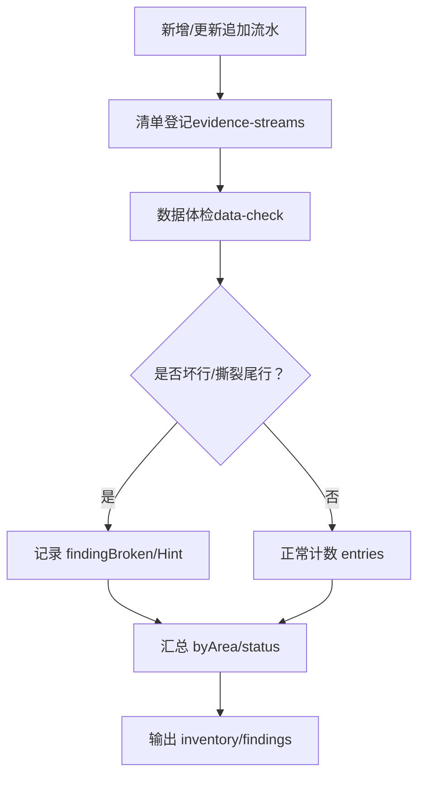
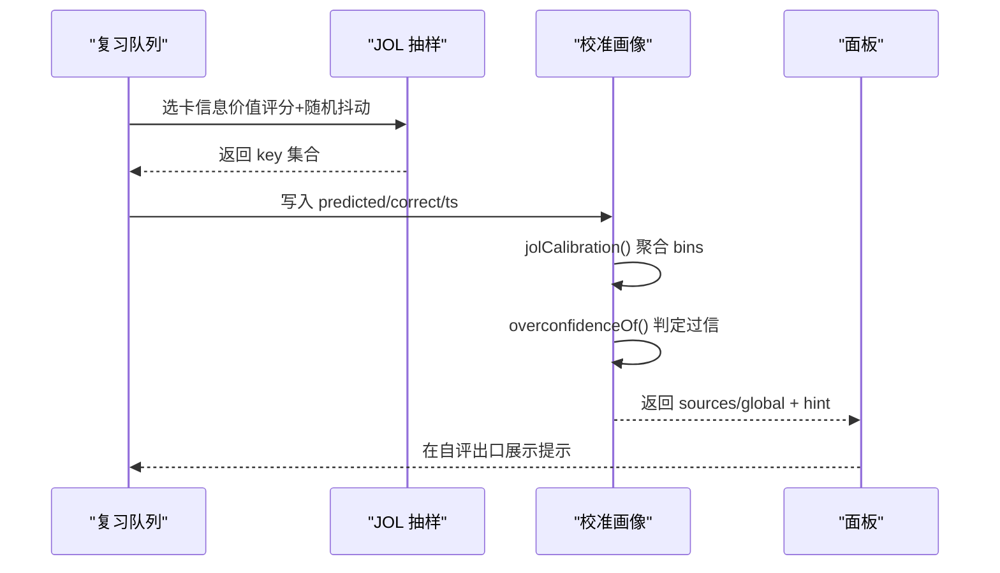
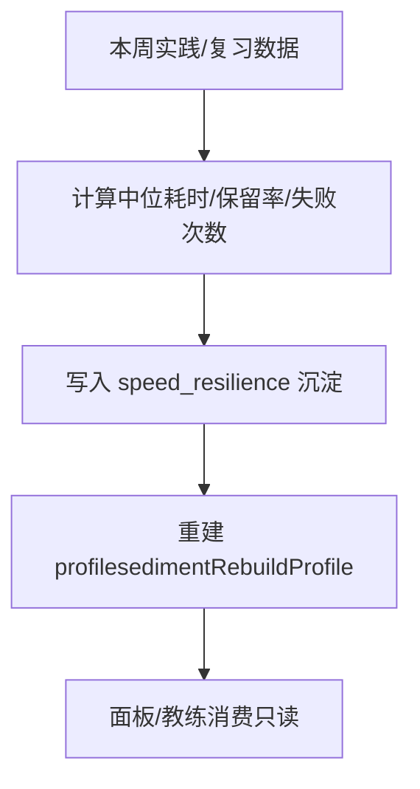
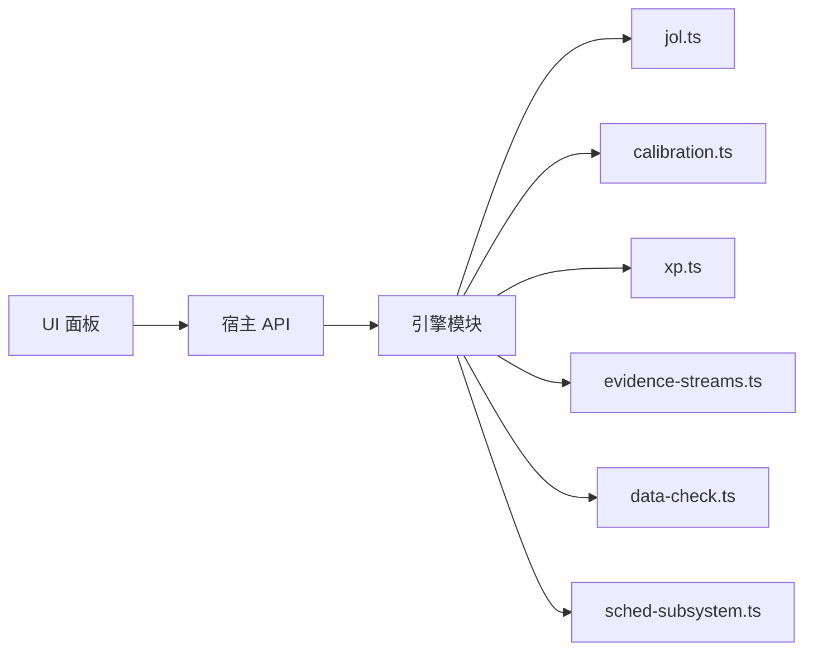

# 能力画像构建

<cite>
**本文引用的文件**
- [src/engine/xp.ts](file://src/engine/xp.ts)
- [src/engine/params.ts](file://src/engine/params.ts)
- [src/engine/jol.ts](file://src/engine/jol.ts)
- [src/engine/calibration.ts](file://src/engine/calibration.ts)
- [src/engine/evidence-streams.ts](file://src/engine/evidence-streams.ts)
- [src/engine/data-check.ts](file://src/engine/data-check.ts)
- [src/engine/sched-subsystem.ts](file://src/engine/sched-subsystem.ts)
- [src/engine/content-subsystem.ts](file://src/engine/content-subsystem.ts)
- [src/engine/views/content.ts](file://src/engine/views/content.ts)
- [ui/src/pages/InsightPage/CalibrationProfileCard.tsx](file://ui/src/pages/InsightPage/CalibrationProfileCard.tsx)
- [ui/src/pages/InsightPage/index.tsx](file://ui/src/pages/InsightPage/index.tsx)
- [docs/adr/0022-self-calibration-profile.md](file://docs/adr/0022-self-calibration-profile.md)
- [CONTEXT.md](file://CONTEXT.md)
</cite>

## 目录
1. [引言](#引言)
2. [项目结构](#项目结构)
3. [核心组件](#核心组件)
4. [架构总览](#架构总览)
5. [详细组件分析](#详细组件分析)
6. [依赖关系分析](#依赖关系分析)
7. [性能考量](#性能考量)
8. [故障排查指南](#故障排查指南)
9. [结论](#结论)
10. [附录](#附录)

## 引言
本技术文档面向 LearnHub 学习者能力画像的构建，聚焦以下目标：
- XP 经验值计算系统：规则、等级提升机制与成就（里程碑）入账。
- 学习者能力画像数据模型：技能维度、掌握度评估、学习行为分析的数据结构与口径。
- 沉淀层设计：事件流处理、数据折叠、档案重建等机制。
- 校准画像构建：JOL（Judgment of Learning）预测、置信度评估与学习效果分析。
- 速度韧性指标：答题速度分析、压力测试与学习稳定性评估。
- 可视化展示与自定义指标扩展：面板呈现方案与扩展方法。
- 数据分析工具与报告生成：数据体检、证据盘点与可读报告。

## 项目结构
围绕能力画像的核心代码分布在引擎层（计算与派生）、宿主层（API 暴露）、前端 UI（可视化）以及文档与契约（ADR/CONTEXT）。关键路径包括：
- XP 时间账本与预算制：xp.ts、params.ts
- JOL 预测与校准画像：jol.ts、calibration.ts
- 沉淀层与追加流水清单：evidence-streams.ts、data-check.ts
- 调度与内容子系统对画像的联动：content-subsystem.ts、sched-subsystem.ts
- 视图与结果形态：views/content.ts
- 前端可视化：InsightPage 下的校准画像卡片与洞察页入口

图表来源
- [src/engine/xp.ts:1-184](file://src/engine/xp.ts#L1-L184)
- [src/engine/params.ts:1-59](file://src/engine/params.ts#L1-L59)
- [src/engine/jol.ts:1-79](file://src/engine/jol.ts#L1-L79)
- [src/engine/calibration.ts:1-111](file://src/engine/calibration.ts#L1-L111)
- [src/engine/evidence-streams.ts:1-40](file://src/engine/evidence-streams.ts#L1-L40)
- [src/engine/data-check.ts:118-982](file://src/engine/data-check.ts#L118-L982)
- [src/engine/content-subsystem.ts:650-671](file://src/engine/content-subsystem.ts#L650-L671)
- [src/engine/sched-subsystem.ts:527-554](file://src/engine/sched-subsystem.ts#L527-L554)
- [src/engine/views/content.ts:180-221](file://src/engine/views/content.ts#L180-L221)
- [ui/src/pages/InsightPage/CalibrationProfileCard.tsx:1-94](file://ui/src/pages/InsightPage/CalibrationProfileCard.tsx#L1-L94)

章节来源
- [src/engine/xp.ts:1-184](file://src/engine/xp.ts#L1-L184)
- [src/engine/params.ts:1-59](file://src/engine/params.ts#L1-L59)
- [src/engine/jol.ts:1-79](file://src/engine/jol.ts#L1-L79)
- [src/engine/calibration.ts:1-111](file://src/engine/calibration.ts#L1-L111)
- [src/engine/evidence-streams.ts:1-40](file://src/engine/evidence-streams.ts#L1-L40)
- [src/engine/data-check.ts:118-982](file://src/engine/data-check.ts#L118-L982)
- [src/engine/content-subsystem.ts:650-671](file://src/engine/content-subsystem.ts#L650-L671)
- [src/engine/sched-subsystem.ts:527-554](file://src/engine/sched-subsystem.ts#L527-L554)
- [src/engine/views/content.ts:180-221](file://src/engine/views/content.ts#L180-L221)
- [ui/src/pages/InsightPage/CalibrationProfileCard.tsx:1-94](file://ui/src/pages/InsightPage/CalibrationProfileCard.tsx#L1-L94)

## 核心组件
- XP 时间账本：以“有效专注分钟”为语义，按题型权重×难度结算；乱猜负分、重复作答零分；支持每日目标、streak、ETA 与节点/里程碑预算定价。
- JOL 预测与抽样：复习前弹出三点预测（会/不会/没把握），按信息价值优先抽样；聚合校准曲线并设置数据门槛。
- 自评校准画像：跨源配对（v1 为 JOL × 实际作答），分源自省面为主、全局参考视图带域特异警戒；过信检测触发轻提示与加强抽查。
- 沉淀层与追加流水：统一登记所有有读侧的 JSONL 追加流水；数据体检逐流盘点，坏行/撕裂尾行分级上报。
- 调度与内容子系统联动：在复习队列中注入 JOL 抽查与校准提示；周级沉淀速度韧性指标并重建画像。
- 视图与结果形态：作答/忘记/自评等结果携带 mastery、xp、diff 等字段，供上层消费。

章节来源
- [src/engine/xp.ts:1-184](file://src/engine/xp.ts#L1-L184)
- [src/engine/jol.ts:1-79](file://src/engine/jol.ts#L1-L79)
- [src/engine/calibration.ts:1-111](file://src/engine/calibration.ts#L1-L111)
- [src/engine/evidence-streams.ts:1-40](file://src/engine/evidence-streams.ts#L1-L40)
- [src/engine/content-subsystem.ts:650-671](file://src/engine/content-subsystem.ts#L650-L671)
- [src/engine/sched-subsystem.ts:527-554](file://src/engine/sched-subsystem.ts#L527-L554)
- [src/engine/views/content.ts:180-221](file://src/engine/views/content.ts#L180-L221)

## 架构总览
能力画像由“行为流水 → 派生指标 → 可视化/决策”的流水线构成：
- 行为流水：practice、journal、review-log 等追加流水记录原始事件。
- 派生指标：XP、streak、ETA、JOL 校准、速度韧性、掌握度等从流水派生，不污染 canonical 状态。
- 可视化/决策：面板展示校准画像、记忆健康、XP 进度；调度/内容子系统根据画像调整体验（如提示、抽查密度）。

图表来源
- [src/engine/jol.ts:21-45](file://src/engine/jol.ts#L21-L45)
- [src/engine/calibration.ts:51-110](file://src/engine/calibration.ts#L51-L110)
- [src/engine/xp.ts:23-34](file://src/engine/xp.ts#L23-L34)
- [src/engine/content-subsystem.ts:650-671](file://src/engine/content-subsystem.ts#L650-L671)
- [ui/src/pages/InsightPage/CalibrationProfileCard.tsx:11-94](file://ui/src/pages/InsightPage/CalibrationProfileCard.tsx#L11-L94)

## 详细组件分析

### XP 经验值计算系统
- 获取规则
  - 答对：按题型权重 × 难度（最小 1）结算正 XP。
  - 答错：0 XP。
  - 乱猜：耗时低于阈值且答错，记负 XP。
  - 同日重复：该题当日已推进调度，0 XP（防刷）。
- 等级提升与成就
  - 节点预算：N₀ = est（内容定价）或 Σ(权重×难度)，再乘以难度校准 k（FSRS difficulty 加权均值，限定范围）。
  - 里程碑过点：一次性入账 N = N₀ × k，重复过点不再入账。
  - 每日目标与 streak：从 practice/journal 流水派生，宽容漏天不断链。
  - ETA：剩余节点 × 每节点 XP ÷ 每日目标，向上取整。
- 存储与派生
  - 实践流水 practice.xp/elapsed_s、日志 journal.xp（如满分 bonus）即事实；汇总全部派生，零新增数据文件。

图表来源
- [src/engine/xp.ts:23-34](file://src/engine/xp.ts#L23-L34)
- [src/engine/params.ts:20-31](file://src/engine/params.ts#L20-L31)

章节来源
- [src/engine/xp.ts:1-184](file://src/engine/xp.ts#L1-L184)
- [src/engine/params.ts:1-59](file://src/engine/params.ts#L1-L59)
- [CONTEXT.md:59-69](file://CONTEXT.md#L59-L69)

### 学习者能力画像数据模型
- 技能维度
  - 节点维度：节点图结构（region/block/node），pre 解锁门禁 R_GATE，enc 成分技能边（用于生成上下文与审计）。
  - 掌握度两口径：A=题库正确率（nodeMastery）；B=masteryOfFm=0.7·S/(2·S_MASTER)+0.3·练习 EMA。
- 掌握度评估
  - FSRS 六参数/21 参数个人化（每题一张卡），复习队列按 due 升序平铺；复习自评语义驱动 FSRS 推进。
- 学习行为分析
  - 实践/复习/回执/习惯等追加流水作为事实源；派生指标（XP、streak、ETA、JOL 校准、速度韧性）均从流水计算。

章节来源
- [docs/research/2026-09-big-directions.md:20-31](file://docs/research/2026-09-big-directions.md#L20-L31)
- [src/engine/views/content.ts:180-221](file://src/engine/views/content.ts#L180-L221)

### 沉淀层设计原理
- 事件流处理
  - 追加流水清单单点登记（evidence-streams.ts），覆盖中心/课程/项目三个半径；每条流具备 stream、scope、getter、pathOf 定义。
  - data-check 逐流盘点 present/entries，中段坏行报 Broken，撕裂尾行报 Hint，缺失视为合法空态。
- 数据折叠
  - 完成折叠（seed.ts 的 CompletionFold）与概率/复诊折叠（probation 相关）将多事件聚合成可读视图，便于诊断与推荐。
- 档案重建
  - 通过 sedimentAppend/sedimentRebuildProfile 等接口按周/日重建速度韧性等画像指标，保证可回溯与一致性。

图表来源
- [src/engine/evidence-streams.ts:1-40](file://src/engine/evidence-streams.ts#L1-L40)
- [src/engine/data-check.ts:118-982](file://src/engine/data-check.ts#L118-L982)

章节来源
- [src/engine/evidence-streams.ts:1-40](file://src/engine/evidence-streams.ts#L1-L40)
- [src/engine/data-check.ts:118-982](file://src/engine/data-check.ts#L118-L982)

### 校准画像构建（JOL、置信度、学习效果）
- JOL 预测
  - 复习前弹出三点预测（会/不会/没把握），抽样优先“有信息价值”（曾有偏差、到期边界 R、静态难度中段）。
  - 校准曲线按预测档聚合实际正确率与忘记数，不足门槛静默不造假。
- 置信度评估
  - 过信检测：「会」档在足够样本下实际正确率持续低于阈值即检出；提供证据快照（n、accuracy、threshold）。
  - 显式轻提示：当过信且提示开启时，在自评出口给出温和提醒，同时提高 JOL 抽查密度。
- 学习效果分析
  - 分源自省面为主，全局聚合仅参考视图并标注域特异警戒；只读派生，不改变 canonical 状态。

图表来源
- [src/engine/jol.ts:21-79](file://src/engine/jol.ts#L21-L79)
- [src/engine/calibration.ts:51-110](file://src/engine/calibration.ts#L51-L110)
- [src/engine/content-subsystem.ts:650-671](file://src/engine/content-subsystem.ts#L650-L671)
- [ui/src/pages/InsightPage/CalibrationProfileCard.tsx:11-94](file://ui/src/pages/InsightPage/CalibrationProfileCard.tsx#L11-L94)

章节来源
- [src/engine/jol.ts:1-79](file://src/engine/jol.ts#L1-L79)
- [src/engine/calibration.ts:1-111](file://src/engine/calibration.ts#L1-L111)
- [docs/adr/0022-self-calibration-profile.md:1-27](file://docs/adr/0022-self-calibration-profile.md#L1-L27)
- [src/engine/content-subsystem.ts:650-671](file://src/engine/content-subsystem.ts#L650-L671)
- [ui/src/pages/InsightPage/CalibrationProfileCard.tsx:1-94](file://ui/src/pages/InsightPage/CalibrationProfileCard.tsx#L1-L94)

### 速度韧性指标
- 计算方法
  - 每周统计：回答数量、中位耗时、到期复习次数、真实保留率、失败次数等，写入 speed_resilience 沉淀。
  - 窗口与闸门：滚动学习日窗口、样本下限、通过率/插入率/旁支占比等闸门控制生长与插入节奏。
- 压力测试与稳定性
  - 通过真实保留率与失败次数衡量压力下的稳定性；结合中位耗时变化观察学习负荷与疲劳。
- 重建与消费
  - sched-subsystem 定期执行沉淀任务，调用 sedimentAppend 写入周级指标，并通过 sedimentRebuildProfile 重建画像。

图表来源
- [src/engine/sched-subsystem.ts:527-554](file://src/engine/sched-subsystem.ts#L527-L554)
- [src/engine/params.ts:43-59](file://src/engine/params.ts#L43-L59)

章节来源
- [src/engine/sched-subsystem.ts:527-554](file://src/engine/sched-subsystem.ts#L527-L554)
- [src/engine/params.ts:43-59](file://src/engine/params.ts#L43-L59)

### 可视化展示与自定义指标扩展
- 可视化方案
  - 洞察页集成记忆健康、自评校准画像、课程状态总览等卡片；校准画像卡片按源展示 bins、过信标签与全局参考视图。
  - 面板通过 API 拉取 /calibration/profile、/jol、/calibration/hints 等数据，渲染条状图与提示。
- 自定义指标扩展
  - 新增指标需遵循追加流水契约：在 evidence-streams.ts 登记新流，并在 data-check 中纳入盘点；派生逻辑置于引擎层，UI 消费只读视图。
  - 若涉及 JOL 或校准，需在 calibration.ts 中扩展源枚举与聚合逻辑，确保低数据静默与只读约束。

章节来源
- [ui/src/pages/InsightPage/index.tsx:108-180](file://ui/src/pages/InsightPage/index.tsx#L108-L180)
- [ui/src/pages/InsightPage/CalibrationProfileCard.tsx:1-94](file://ui/src/pages/InsightPage/CalibrationProfileCard.tsx#L1-L94)
- [src/engine/evidence-streams.ts:1-40](file://src/engine/evidence-streams.ts#L1-L40)
- [src/engine/data-check.ts:118-982](file://src/engine/data-check.ts#L118-L982)

## 依赖关系分析
- 模块耦合
  - xp.ts 依赖 params.ts 的常量与日期工具；calibration.ts 依赖 jol.ts 的聚合函数；content-subsystem.ts 在复习队列中注入 JOL 与提示。
  - evidence-streams.ts 为 data-check.ts 提供清单；sched-subsystem.ts 使用沉淀接口写入速度韧性并重建画像。
- 外部依赖与集成点
  - 宿主 API 暴露 /calibration/profile、/jol、/calibration/hints 等端点；UI 通过 api.ts 调用这些端点。
- 循环依赖检查
  - 当前实现以单向依赖为主：UI→API→Engine；Engine 内部按职责分层，未见明显环。

图表来源
- [ui/src/pages/InsightPage/index.tsx:108-180](file://ui/src/pages/InsightPage/index.tsx#L108-L180)
- [src/engine/calibration.ts:1-111](file://src/engine/calibration.ts#L1-L111)
- [src/engine/jol.ts:1-79](file://src/engine/jol.ts#L1-L79)
- [src/engine/xp.ts:1-184](file://src/engine/xp.ts#L1-L184)
- [src/engine/evidence-streams.ts:1-40](file://src/engine/evidence-streams.ts#L1-L40)
- [src/engine/data-check.ts:118-982](file://src/engine/data-check.ts#L118-L982)
- [src/engine/sched-subsystem.ts:527-554](file://src/engine/sched-subsystem.ts#L527-L554)

章节来源
- [src/engine/calibration.ts:1-111](file://src/engine/calibration.ts#L1-L111)
- [src/engine/jol.ts:1-79](file://src/engine/jol.ts#L1-L79)
- [src/engine/xp.ts:1-184](file://src/engine/xp.ts#L1-L184)
- [src/engine/evidence-streams.ts:1-40](file://src/engine/evidence-streams.ts#L1-L40)
- [src/engine/data-check.ts:118-982](file://src/engine/data-check.ts#L118-L982)
- [src/engine/sched-subsystem.ts:527-554](file://src/engine/sched-subsystem.ts#L527-L554)

## 性能考量
- 低数据静默：JOL 校准与画像仅在配对数达到门槛后显示，避免噪声与误判。
- 只读派生：校准画像与速度韧性均为派生指标，不污染 canonical 状态，降低写放大。
- 抽样优化：JOL 抽样优先高信息价值卡片，减少无效交互与计算开销。
- 批量沉淀：周级沉淀与重建批量写入，减少频繁 I/O。

## 故障排查指南
- 证据流异常
  - 缺失：合法空态，不报 status 问题；inventory 标记 present=false。
  - 坏行：记录 Broken finding，定位到具体流与行号。
  - 撕裂尾行：记录 Hint finding，不影响整体 status。
- 校准画像无数据
  - 配对不足：低于 JOL_CALIBRATION_MIN 时不显示曲线，属正常。
  - 提示未出现：检查 hints_enabled 配置与过信判定条件。
- XP 异常
  - 重复作答 0 XP：确认题目当日是否已推进调度。
  - 乱猜负 XP：检查 elapsed_s 与阈值；确保调度隔离由调用方保证。

章节来源
- [src/engine/data-check.ts:118-982](file://src/engine/data-check.ts#L118-L982)
- [src/engine/jol.ts:1-79](file://src/engine/jol.ts#L1-L79)
- [src/engine/calibration.ts:51-110](file://src/engine/calibration.ts#L51-L110)
- [src/engine/xp.ts:23-34](file://src/engine/xp.ts#L23-L34)

## 结论
LearnHub 的能力画像体系以“行为流水即事实”为核心原则，通过 XP 时间账本、JOL 预测-校准、速度韧性沉淀与数据体检，构建了可解释、可扩展、可观测的学习者画像。其只读派生与低数据静默策略保障了稳健性；分源自省面与全局参考视图兼顾了构念效度与可读性。未来可在追加流水与校准源上继续扩展，丰富指标与可视化表达。

## 附录
- 术语对照
  - JOL：Judgment of Learning（学习判断）
  - XP：经验值（有效专注分钟）
  - Streak：连续学习天数（宽容漏天）
  - ETA：预计完成天数
  - 沉淀层：追加流水与周期重建的指标层
- 参考契约与裁决
  - ADR-0022：自评校准画像的分源自省面定位与红线约束
  - CONTEXT.md：XP 语义与 Unbound XP 的记账口径