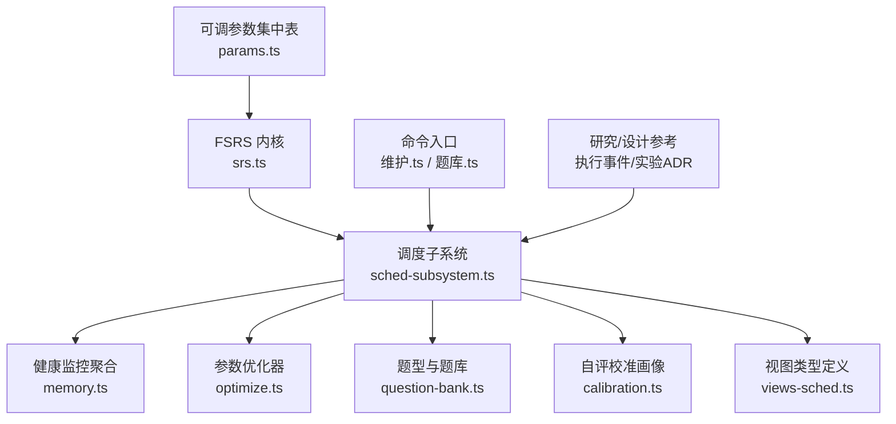
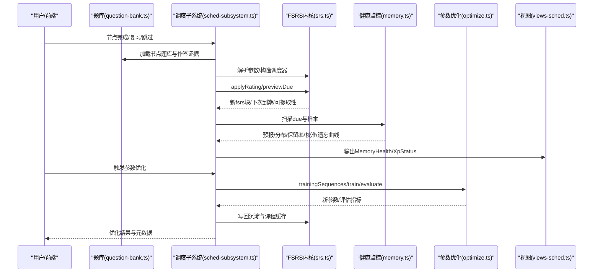
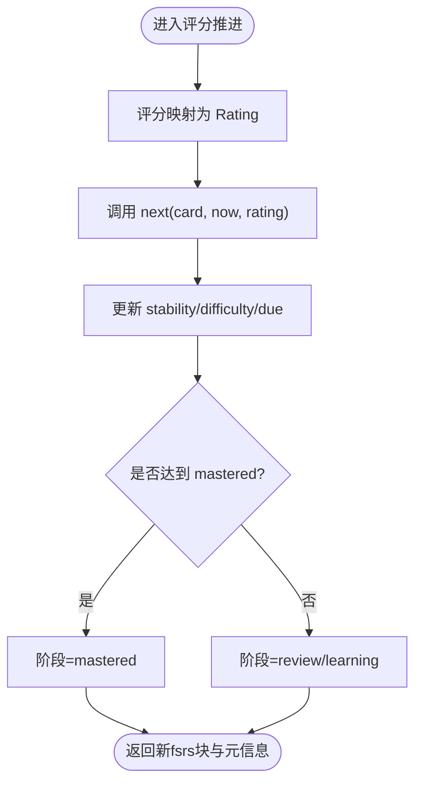
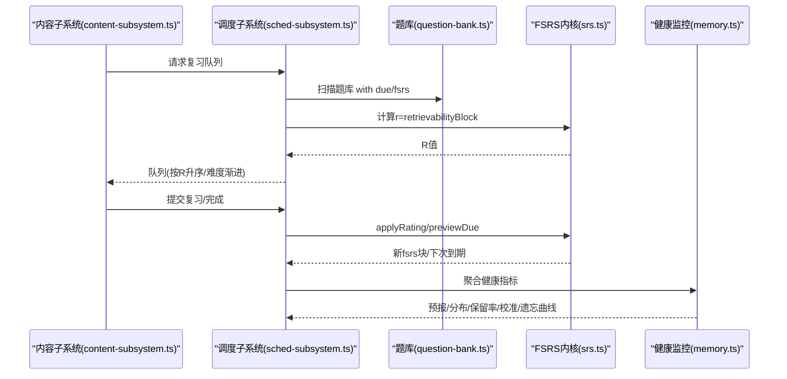
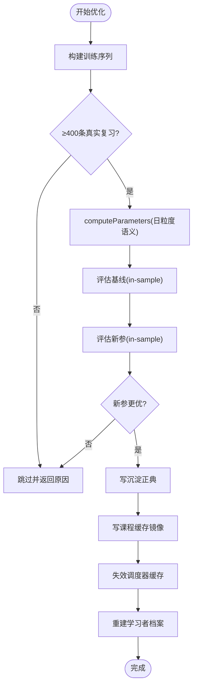
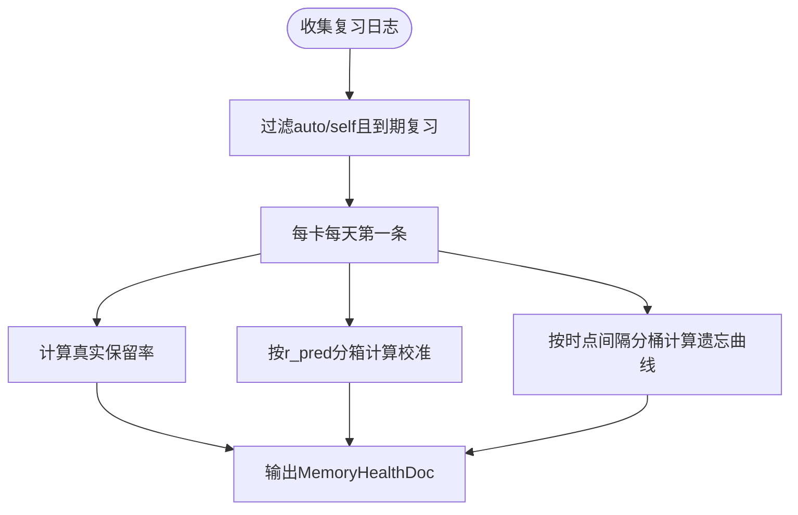
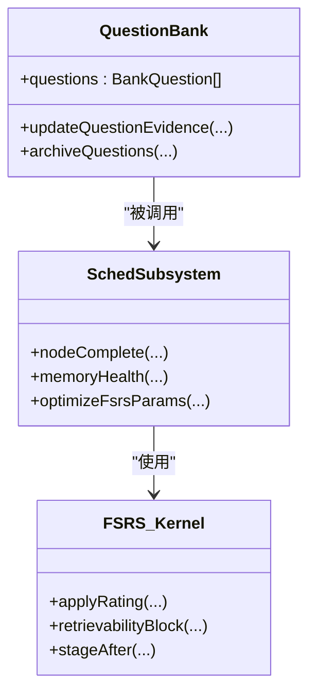
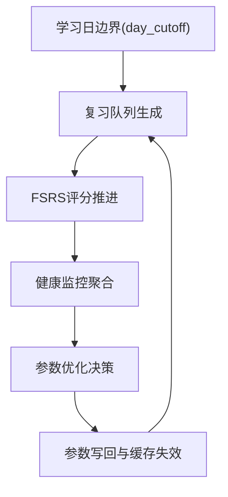
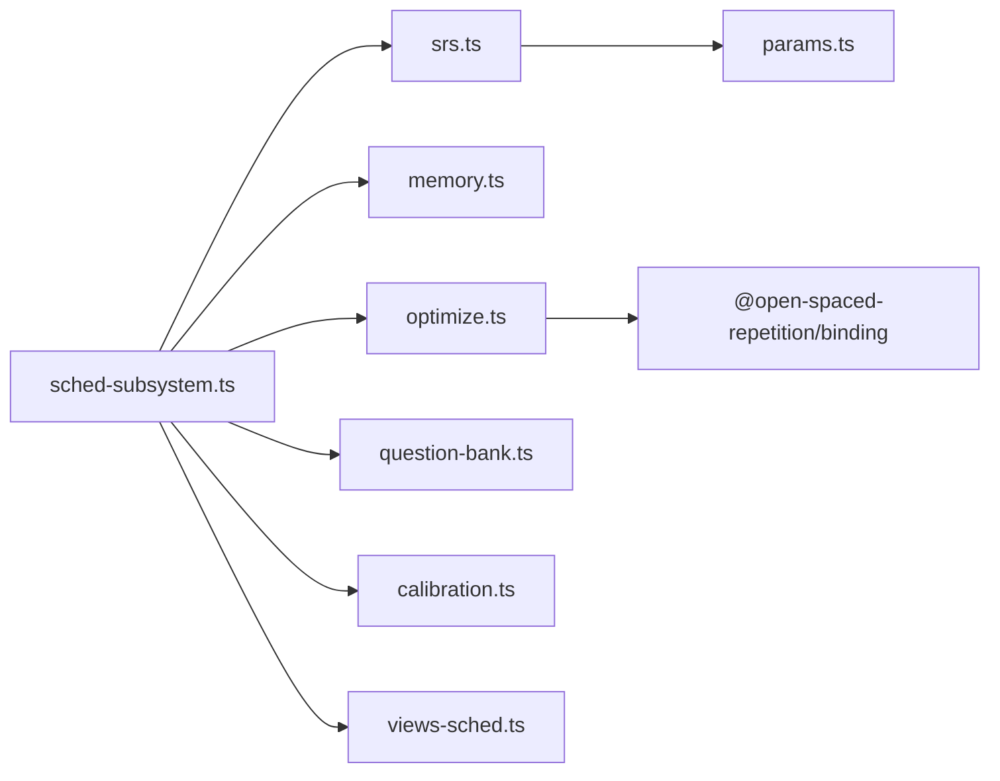

# 调度算法流程

<cite>
**本文引用的文件**
- [srs.ts](file://src/engine/srs.ts)
- [sched-subsystem.ts](file://src/engine/sched-subsystem.ts)
- [memory.ts](file://src/engine/memory.ts)
- [optimize.ts](file://src/engine/optimize.ts)
- [params.ts](file://src/engine/params.ts)
- [types.ts](file://src/engine/types.ts)
- [question-bank.ts](file://src/engine/question-bank.ts)
- [calibration.ts](file://src/engine/calibration.ts)
- [health.ts](file://src/engine/health.ts)
- [views-sched.ts](file://src/engine/views/sched.ts)
- [题库.ts](file://src/commands/题库.ts)
- [维护.ts](file://src/commands/维护.ts)
- [2026-09-ts-fsrs-execution-events.md](file://docs/research/2026-09-ts-fsrs-execution-events.md)
- [0023-n-of-1-experiment.md](file://docs/adr/0023-n-of-1-experiment.md)
- [CONTEXT.md](file://CONTEXT.md)
</cite>

## 目录
1. [简介](#简介)
2. [项目结构](#项目结构)
3. [核心组件](#核心组件)
4. [架构总览](#架构总览)
5. [详细组件分析](#详细组件分析)
6. [依赖关系分析](#依赖关系分析)
7. [性能考量](#性能考量)
8. [故障排查指南](#故障排查指南)
9. [结论](#结论)
10. [附录](#附录)

## 简介
本技术文档面向 LearnHub 的学习调度与 FSRS（间隔重复）算法，系统性说明从题目选择、复习计划生成到执行跟踪的完整流程；深入解释记忆曲线建模、复习时机预测、难度参数调整等核心机制；并覆盖个人化参数训练、模型评估与更新策略、记忆健康监控、与题库系统的集成方式、调试工具与故障排查建议。文档同时给出可操作的配置示例与调优建议，帮助读者在工程实践中正确落地与持续优化。

## 项目结构
LearnHub 的调度相关代码集中在 engine 域，围绕“FSRS 内核 + 调度子系统 + 健康监控 + 参数优化”四层组织：
- FSRS 内核：封装 ts-fsrs 调用、状态转换、可提取性计算、阶段机与掌握度派生。
- 调度子系统：节点跳过/完成确认、XP 账本、记忆健康仪表盘、参数优化、沉淀层。
- 健康监控：负载预报、状态分布、真实保留率、校准曲线、遗忘曲线、JOL 预测-校准。
- 参数优化：从真实复习日志重训 FSRS-6 参数，带门禁与评估对比。
- 题库集成：题卡级 FSRS 状态、作答证据、批量调度与优先级管理。

图表来源
- [srs.ts:1-192](file://src/engine/srs.ts#L1-L192)
- [sched-subsystem.ts:1-555](file://src/engine/sched-subsystem.ts#L1-L555)
- [memory.ts:1-119](file://src/engine/memory.ts#L1-L119)
- [optimize.ts:1-141](file://src/engine/optimize.ts#L1-L141)
- [params.ts:1-59](file://src/engine/params.ts#L1-L59)
- [views-sched.ts:1-39](file://src/engine/views/sched.ts#L1-L39)
- [维护.ts:168-181](file://src/commands/维护.ts#L168-L181)
- [题库.ts:327-361](file://src/commands/题库.ts#L327-L361)

章节来源
- [srs.ts:1-192](file://src/engine/srs.ts#L1-L192)
- [sched-subsystem.ts:1-555](file://src/engine/sched-subsystem.ts#L1-L555)
- [memory.ts:1-119](file://src/engine/memory.ts#L1-L119)
- [optimize.ts:1-141](file://src/engine/optimize.ts#L1-L141)
- [params.ts:1-59](file://src/engine/params.ts#L1-L59)
- [views-sched.ts:1-39](file://src/engine/views/sched.ts#L1-L39)
- [维护.ts:168-181](file://src/commands/维护.ts#L168-L181)
- [题库.ts:327-361](file://src/commands/题库.ts#L327-L361)

## 核心组件
- FSRS 内核（srs.ts）
  - 参数解析：统一从沉淀正典→课程缓存→官方默认取参，保证调度与优化基线一致。
  - 卡片映射：frontmatter fsrs 块与 ts-fsrs Card 双向转换，支持首学/复习/重学路径。
  - 评分推进：applyRating/applyRatingBlock 将评分映射为 FSRS 转移，产出新 fsrs 块与元信息。
  - 可提取性：retrievability/retrievabilityBlock 提供当前 R 值，用于队列排序与预览。
  - 阶段机：stageAfter 根据稳定性阈值判定 review/mastered/learning。
  - 掌握度：masteryValue/masteryOfFm 融合稳定度与练习证据，供读侧展示。
- 调度子系统（sched-subsystem.ts）
  - 节点跳过/完成：完成时批量初始化未作答题卡、写入代表卡、触发内容管线与 XP 对账。
  - 记忆健康：跨课程扫描 due 与样本，聚合预报、分布、保留率、校准、遗忘曲线与 JOL。
  - 参数优化：构建训练序列、门禁校验、训练+评估、写回沉淀与课程缓存、重建学习者档案。
  - 沉淀结算：周档校准画像与速度韧性事件，幂等且只追加。
- 健康监控（memory.ts）
  - 每日负载预报：逾期存量与未来 N 日逐日到期量。
  - 状态直方图：Stability/Difficulty/Retrievability 分桶统计。
  - 真实保留率：仅计入 auto/self 的到期复习，每卡每天第一条。
  - 校准曲线：按 r_pred 分箱对照实际通过率。
  - 遗忘曲线：按时点间隔分桶的保留率下降。
- 参数优化（optimize.ts）
  - 训练序列：排除 synthetic，限制 execution 混训门，每卡每天第一条，delta_t 链首条为 0。
  - 评估与写回：in-sample logLoss 对比基线，优于才写回；记录 splitEval 泛化估计。
  - 默认参数：generatorParameters 默认 w 向量作为对照基线。
- 可调参数（params.ts）
  - 期望保留率、前置解锁门槛、mastered 阈值、估时与预算、过信阈值等集中管理。
- 题库集成（question-bank.ts）
  - 题卡级 FSRS 状态、作答统计、归档与证据更新；完成确认时批量初始化与入队。
- 自评校准（calibration.ts）
  - JOL 预测-校准画像、过信检测、全局警告提示；纯函数、零 canonical 写入。
- 视图类型（views-sched.ts）
  - MemoryHealthDoc/XpStatus 等对外视图契约，确保 UI 与引擎数据一致。

章节来源
- [srs.ts:21-192](file://src/engine/srs.ts#L21-L192)
- [sched-subsystem.ts:83-555](file://src/engine/sched-subsystem.ts#L83-L555)
- [memory.ts:14-119](file://src/engine/memory.ts#L14-L119)
- [optimize.ts:25-141](file://src/engine/optimize.ts#L25-L141)
- [params.ts:1-59](file://src/engine/params.ts#L1-L59)
- [question-bank.ts:82-109](file://src/engine/question-bank.ts#L82-L109)
- [calibration.ts:1-111](file://src/engine/calibration.ts#L1-L111)
- [views-sched.ts:6-39](file://src/engine/views/sched.ts#L6-L39)

## 架构总览
下图展示了学习调度的端到端流程：从题库加载与节点完成，到 FSRS 参数解析、评分推进、队列生成与健康监控闭环。

图表来源
- [sched-subsystem.ts:124-270](file://src/engine/sched-subsystem.ts#L124-L270)
- [sched-subsystem.ts:323-450](file://src/engine/sched-subsystem.ts#L323-L450)
- [srs.ts:29-163](file://src/engine/srs.ts#L29-L163)
- [memory.ts:17-119](file://src/engine/memory.ts#L17-L119)
- [optimize.ts:44-141](file://src/engine/optimize.ts#L44-L141)
- [views-sched.ts:11-39](file://src/engine/views/sched.ts#L11-L39)

## 详细组件分析

### FSRS 内核与记忆曲线建模
- 参数解析与调度器构造：统一通过 resolveFsrsParams 获取参数，getScheduler 以日粒度、无 fuzz、关闭短期学习步的方式创建调度器，确保与优化器基线一致。
- 记忆曲线与可提取性：retrievability/retrievabilityBlock 基于 ts-fsrs 实例曲线计算当前 R，用于队列排序与预览。
- 评分推进与阶段机：applyRating/applyRatingBlock 将评分映射为 FSRS 转移，stageAfter 依据稳定性阈值判定阶段；masteryValue 融合稳定度与练习证据得到掌握度。
- 非单调区间处理：研究文档指出 FSRS-6 幂律形式单调，日粒度天然缓冲；起步采用评级映射吸收与短窗排除，后续可按观测面升级曲线族。

图表来源
- [srs.ts:107-163](file://src/engine/srs.ts#L107-L163)
- [srs.ts:135-141](file://src/engine/srs.ts#L135-L141)
- [2026-09-ts-fsrs-execution-events.md:54-71](file://docs/research/2026-09-ts-fsrs-execution-events.md#L54-L71)

章节来源
- [srs.ts:29-163](file://src/engine/srs.ts#L29-L163)
- [2026-09-ts-fsrs-execution-events.md:54-71](file://docs/research/2026-09-ts-fsrs-execution-events.md#L54-L71)

### 学习调度全流程（题目选择→复习计划→执行跟踪）
- 题目选择与队列生成：content-subsystem.reviewQueue 扫描启用课程，结合 sched 与 retrievabilityBlock 生成因到期风险升序为主的复习队列；支持课程/节点过滤。
- 复习计划生成：节点完成时批量初始化未作答题卡，写入代表卡，触发内容管线与 XP 对账；复习流自评语义驱动 FSRS 推进。
- 执行跟踪：practice 流水与 review-log 记录每次作答与复习推进；健康监控聚合真实保留率、校准与遗忘曲线。

图表来源
- [sched-subsystem.ts:124-270](file://src/engine/sched-subsystem.ts#L124-L270)
- [memory.ts:17-119](file://src/engine/memory.ts#L17-L119)
- [srs.ts:94-163](file://src/engine/srs.ts#L94-L163)

章节来源
- [sched-subsystem.ts:124-270](file://src/engine/sched-subsystem.ts#L124-L270)
- [memory.ts:17-119](file://src/engine/memory.ts#L17-L119)
- [srs.ts:94-163](file://src/engine/srs.ts#L94-L163)

### 调度参数优化机制（个人化训练、评估与更新）
- 训练序列构建：trainingSequences 排除 synthetic，限制 execution 混训门，每卡每天第一条，delta_t 链首条为 0。
- 门禁与评估：OPTIMIZE_MIN_REVIEWS 门槛；in-sample logLoss 对比基线（现参或默认），严格优于才写回；记录 splitEval 泛化估计。
- 写回策略：沉淀正典（fsrs_params 事件）+ 课程缓存镜像；调度器缓存失效；重建学习者档案投影。

图表来源
- [optimize.ts:44-141](file://src/engine/optimize.ts#L44-L141)
- [sched-subsystem.ts:361-450](file://src/engine/sched-subsystem.ts#L361-L450)

章节来源
- [optimize.ts:44-141](file://src/engine/optimize.ts#L44-L141)
- [sched-subsystem.ts:361-450](file://src/engine/sched-subsystem.ts#L361-L450)

### 记忆健康监控（遗忘率统计、校准分析与预测模型）
- 真实保留率：仅计入 auto/self 的到期复习，每卡每天第一条；空态 rate=null。
- 校准曲线：按 r_pred 分箱对照实际通过率；空桶 actual=null。
- 遗忘曲线：按时点间隔分桶的保留率下降；≤2天桶可作为增强期观测面。
- JOL 预测-校准：practice 流水中 predicted/correct 配对，聚合为 bins；过信检测提供轻提示。

图表来源
- [memory.ts:60-119](file://src/engine/memory.ts#L60-L119)
- [views-sched.ts:11-25](file://src/engine/views/sched.ts#L11-L25)
- [calibration.ts:53-111](file://src/engine/calibration.ts#L53-L111)

章节来源
- [memory.ts:60-119](file://src/engine/memory.ts#L60-L119)
- [views-sched.ts:11-25](file://src/engine/views/sched.ts#L11-L25)
- [calibration.ts:53-111](file://src/engine/calibration.ts#L53-L111)

### 调度系统与题库系统集成（状态同步、批量调度、优先级管理）
- 状态同步：题卡级 fsrs 块与 stats 字段；完成确认时批量初始化未作答题卡，写入代表卡。
- 批量调度：节点完成触发 onStageChange，T1/T2 生成队列入队；复习队列按 R 升序为主、同档难度渐进。
- 优先级管理：R_GATE 前置解锁门槛；overload 保护停推新课；软重启与恢复模式控制节奏。

图表来源
- [question-bank.ts:82-109](file://src/engine/question-bank.ts#L82-L109)
- [sched-subsystem.ts:124-270](file://src/engine/sched-subsystem.ts#L124-L270)
- [srs.ts:94-163](file://src/engine/srs.ts#L94-L163)

章节来源
- [question-bank.ts:82-109](file://src/engine/question-bank.ts#L82-L109)
- [sched-subsystem.ts:124-270](file://src/engine/sched-subsystem.ts#L124-L270)
- [srs.ts:94-163](file://src/engine/srs.ts#L94-L163)

### 概念总览（不绑定具体文件）

[此图为概念流程图，不直接映射具体源码文件]

## 依赖关系分析
- 模块耦合
  - sched-subsystem 依赖 srs、memory、optimize、question-bank、calibration、views-sched。
  - srs 依赖 params、dates、grading、sediment、ts-fsrs。
  - optimize 依赖 dates、types、ts-fsrs、binding（动态导入）。
  - memory 依赖 types、dates。
  - calibration 依赖 jol、params。
- 外部依赖
  - ts-fsrs：调度器与卡片操作。
  - @open-spaced-repetition/binding：参数优化（computeParameters、evaluate）。
- 循环依赖规避
  - 领域分层清晰：调度子系统作为门面，其他模块通过窄面注入回引；避免环状引用。

图表来源
- [sched-subsystem.ts:1-555](file://src/engine/sched-subsystem.ts#L1-L555)
- [srs.ts:1-192](file://src/engine/srs.ts#L1-L192)
- [optimize.ts:1-141](file://src/engine/optimize.ts#L1-L141)

章节来源
- [sched-subsystem.ts:1-555](file://src/engine/sched-subsystem.ts#L1-L555)
- [srs.ts:1-192](file://src/engine/srs.ts#L1-L192)
- [optimize.ts:1-141](file://src/engine/optimize.ts#L1-L141)

## 性能考量
- 日粒度调度：enable_short_term=false，减少频繁状态更新与计算开销。
- 缓存策略：参数解析优先沉淀正典，课程缓存降级；调度器缓存按课程根键控，参数写回后失效。
- 批处理：节点完成时批量初始化题卡与入队，减少多次 IO。
- 评估效率：时序切分评估在小数据下可能不可用，退回 in-sample 对照，避免阻塞。
- 健康监控聚合：按课程扫描题库，复用 retrievabilityBlock 口径，避免重复计算。

[本节为通用指导，无需特定文件引用]

## 故障排查指南
- 参数优化未写回
  - 检查真实复习日志数量是否 ≥400；查看训练序列计数与过滤条件。
  - 对比基线与新课程评估指标（logLoss），若未严格优于则跳过。
  - 确认 binding 可用与参数长度符合 FSRS-6 要求。
- 复习队列异常
  - 检查 R_GATE 与 retrievabilityBlock 计算；确认 due 与 last_review 时间戳有效。
  - 验证 day_cutoff 与学习日边界，避免凌晨记录误判。
- 健康监控为空或失真
  - 确认 review-log 中 rating_source 过滤逻辑（排除 synthetic）；检查每卡每天第一条去重。
  - 校准曲线空桶时 actual=null，属正常空态。
- 节点完成未推进
  - 检查 PASS_SCORE 与 attempts 门槛；确认 stage 幂等判据避免重复落盘。
  - 查看 XP 对账与代表卡写入步骤是否成功。

章节来源
- [optimize.ts:44-141](file://src/engine/optimize.ts#L44-L141)
- [sched-subsystem.ts:124-270](file://src/engine/sched-subsystem.ts#L124-L270)
- [memory.ts:60-119](file://src/engine/memory.ts#L60-L119)
- [params.ts:1-59](file://src/engine/params.ts#L1-L59)

## 结论
LearnHub 的调度系统以 FSRS-6 为核心，结合日粒度调度、参数优化与健康监控，形成从题目选择、复习计划到执行跟踪的闭环。通过统一的参数解析、严格的写回门禁与多源健康指标，系统在个性化与稳健性之间取得平衡。建议在生产环境中定期触发参数优化、关注健康监控指标变化，并结合研究文档中的执行事件通道与曲线族升级路径，持续优化记忆建模与调度效果。

[本节为总结，无需特定文件引用]

## 附录

### 算法配置示例
- 期望保留率：DESIRED_RETENTION = 0.9（影响下次间隔目标）。
- 前置解锁门槛：R_GATE = 0.85（节点解锁的可提取性阈值）。
- Mastered 阈值：S_MASTER = 30.0（稳定性达此标记掌握）。
- 日界：DAY_CUTOFF_DEFAULT = '02:00'（学习日边界）。
- 过信阈值：CALIBRATION_OVERCONF_THRESHOLD = 0.6（JOL 过信检测）。

章节来源
- [params.ts:1-59](file://src/engine/params.ts#L1-L59)

### 命令与入口
- 手动触发参数优化：维护命令 expose optimize-params，调用 sched2.optimizeFsrsParams。
- 题库管理：题库命令暴露 question-update/questions-all 等接口，便于批量调度与状态同步。

章节来源
- [维护.ts:168-181](file://src/commands/维护.ts#L168-L181)
- [题库.ts:327-361](file://src/commands/题库.ts#L327-L361)

### 研究与设计参考
- 执行事件与 FSRS 适配：研究文档明确执行事件 → 表现评级 → 1-4 映射通道，优化器后置启用，非单调区间按阶梯处理。
- N-of-1 实验：单主体内随机化，只动内容参数不动调度核心，实验变量白名单与统计口径明确。

章节来源
- [2026-09-ts-fsrs-execution-events.md:7-71](file://docs/research/2026-09-ts-fsrs-execution-events.md#L7-L71)
- [0023-n-of-1-experiment.md:1-9](file://docs/adr/0023-n-of-1-experiment.md#L1-L9)

### 术语与上下文
- 复习队列：到期调度卡构成的跨课程扁平队列，按预测遗忘风险升序为主、同档难度渐进出示。
- 掌握度：由记忆稳定度与练习证据复合派生的连续度量，无自评；防饱和。
- 作答正确率：节点题库累计答对比例，仅用于完成门禁与单题作答统计。

章节来源
- [CONTEXT.md:35-49](file://CONTEXT.md#L35-L49)