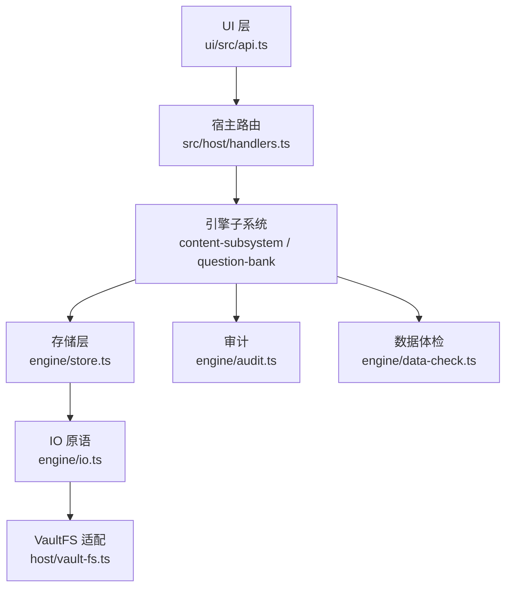
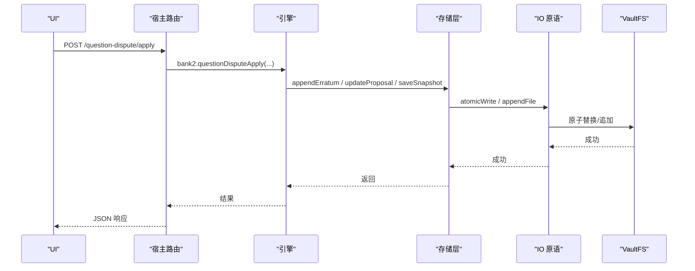
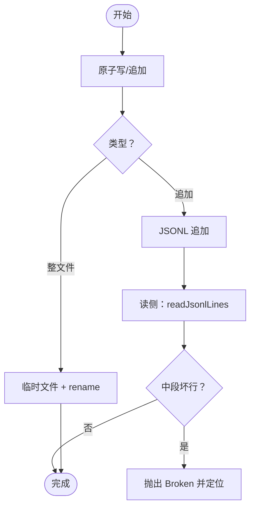
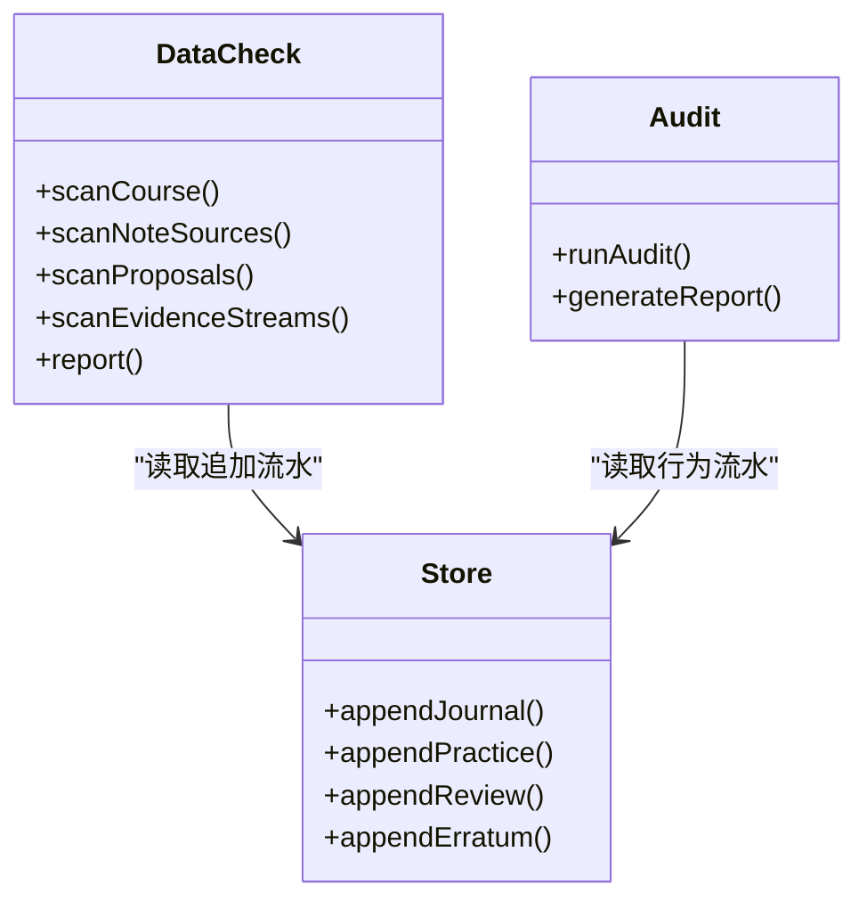
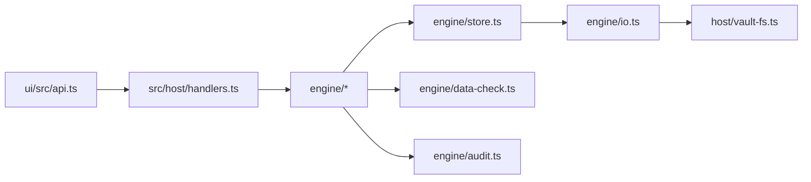

# 数据一致性

<cite>
**本文引用的文件**
- [store.ts](file://src/engine/store.ts)
- [data-check.ts](file://src/engine/data-check.ts)
- [audit.ts](file://src/engine/audit.ts)
- [vault-fs.ts](file://src/host/vault-fs.ts)
- [transactional-grading.test.ts](file://tests/transactional-grading.test.ts)
- [handlers.ts](file://src/host/handlers.ts)
- [api.ts](file://ui/src/api.ts)
- [content-subsystem.ts](file://src/engine/content-subsystem.ts)
- [question-bank.ts](file://src/engine/question-bank.ts)
- [io.ts](file://src/engine/io.ts)
- [repair-policy.test.ts](file://tests/repair-policy.test.ts)
- [0047-architecture-gates-and-ratchet-timing.md](file://docs/adr/0047-architecture-gates-and-ratchet-timing.md)
</cite>

## 目录
1. [简介](#简介)
2. [项目结构](#项目结构)
3. [核心组件](#核心组件)
4. [架构总览](#架构总览)
5. [详细组件分析](#详细组件分析)
6. [依赖关系分析](#依赖关系分析)
7. [性能考量](#性能考量)
8. [故障排查指南](#故障排查指南)
9. [结论](#结论)
10. [附录：API 使用模式与最佳实践](#附录api-使用模式与最佳实践)

## 简介
本文件面向 LearnHub 的数据一致性机制，覆盖事务处理、数据同步、校验与审计、错误恢复、并发控制、以及监控调试等关键主题。LearnHub 采用“文件系统即数据库”的明文持久化方案，通过原子写入、追加流水、契约校验与结构化审计，实现跨模块的一致性保障；同时以只读体检（Data Check）和结构性审计（Audit）提供质量门禁与可观测性。

## 项目结构
围绕一致性的代码主要分布在以下位置：
- 存储与事务原语：engine/store.ts、engine/io.ts
- 数据体检与校验：engine/data-check.ts
- 结构性审计：engine/audit.ts
- 宿主文件系统适配：host/vault-fs.ts
- 写路径与事务边界示例：tests/transactional-grading.test.ts、src/engine/content-subsystem.ts、src/engine/question-bank.ts
- 宿主 API 路由与调用封装：src/host/handlers.ts、ui/src/api.ts
- 修复策略门与棘轮门：tests/repair-policy.test.ts、docs/adr/0047-architecture-gates-and-ratchet-timing.md

**图示来源**
- [api.ts:70-86](file://ui/src/api.ts#L70-L86)
- [handlers.ts:554-572](file://src/host/handlers.ts#L554-L572)
- [store.ts:1-10](file://src/engine/store.ts#L1-L10)
- [vault-fs.ts:1-25](file://src/host/vault-fs.ts#L1-L25)

**章节来源**
- [store.ts:1-10](file://src/engine/store.ts#L1-L10)
- [vault-fs.ts:1-25](file://src/host/vault-fs.ts#L1-L25)

## 核心组件
- 存储层（Store）：提供 journal/practice/review-log/proposals/snapshots/pins/experiments/receipts/e-archive/erratum 等读写能力，统一通过原子写入或 JSONL 追加保证持久化一致性。
- IO 原语（atomicWrite/readJsonlLines）：封装临时文件 + rename 的原子替换与 JSONL 健壮读取（中段坏行报 Broken、尾行撕裂豁免）。
- 数据体检（Data Check）：只读盘点全仓数据，按 Missing/Broken/Archived/Hint 四级分类，输出 inventory 与 findings，不修改任何数据。
- 结构性审计（Audit）：对图、笔记、题库、enc 边等进行 E/W/I 级检查，生成报告并作为生成/结算门禁。
- VaultFS 适配：将 node:fs 暴露为统一接口，隔离引擎与宿主实现。

**章节来源**
- [store.ts:46-479](file://src/engine/store.ts#L46-L479)
- [data-check.ts:1-131](file://src/engine/data-check.ts#L1-L131)
- [audit.ts:1-324](file://src/engine/audit.ts#L1-L324)
- [vault-fs.ts:1-25](file://src/host/vault-fs.ts#L1-L25)

## 架构总览
LearnHub 的一致性由三层协作完成：
- 持久化层：所有写操作要么原子替换（整文件），要么追加到 JSONL 流水（幂等消费、可重放）。
- 校验与审计层：读侧严格契约校验（Broken 立即失败），结构性审计在生成/结算前阻断不一致状态。
- 宿主与 UI 层：HTTP 路由统一入口，封装 apiRun 日志与错误传播；UI 仅通过 HTTP 调用，避免直接访问文件系统。

**图示来源**
- [handlers.ts:554-572](file://src/host/handlers.ts#L554-L572)
- [store.ts:422-471](file://src/engine/store.ts#L422-L471)
- [store.ts:204-206](file://src/engine/store.ts#L204-L206)
- [store.ts:291-293](file://src/engine/store.ts#L291-L293)

## 详细组件分析

### 事务处理机制（数据库事务、文件系统事务、跨组件事务）
- 文件系统事务：所有整文件写均通过 atomicWrite（临时文件 + rename）实现原子替换，确保崩溃后不会出现半写文件。
- 追加流水：journal/practice/review-log/receipts/e-archive/erratum/habit-repeats/band-log 等采用 JSONL 追加，读侧用 readJsonlLines 容错（中段坏行报 Broken，尾行撕裂豁免）。
- 跨组件事务：提案（proposals）支持 pair 联动，pairApplyBlock 强制同源双提案同进同退，避免单边生效导致的状态不一致。
- 写路径事务性：测试验证 AI 判卷失败时，bank/note/practice/journal 均不回滚但保持原状（fail-fast 且零副作用）。

**图示来源**
- [store.ts:204-206](file://src/engine/store.ts#L204-L206)
- [store.ts:291-293](file://src/engine/store.ts#L291-L293)
- [store.ts:422-471](file://src/engine/store.ts#L422-L471)
- [transactional-grading.test.ts:40-107](file://tests/transactional-grading.test.ts#L40-L107)

**章节来源**
- [store.ts:166-277](file://src/engine/store.ts#L166-L277)
- [store.ts:422-471](file://src/engine/store.ts#L422-L471)
- [transactional-grading.test.ts:40-107](file://tests/transactional-grading.test.ts#L40-L107)

### 数据同步策略（本地缓存、远程同步、冲突解决）
- 本地缓存：vault-links 先验缓存用于内容生成与审计分流，缺失视为合法空态，不阻塞主流程。
- 远程同步：仓库未显式实现远程同步；一致性主要通过本地原子写与只读体检保证。若引入远程同步，应遵循“原子落盘 + 冲突以服务端权威为准 + 本地增量合并”的原则。
- 冲突解决：以“源清单 + 指纹比对”的方式检测漂移（note source manifest vs 实际文件），不一致时记录 finding 并挂起相关卡池，等待人工或工具修复。

**章节来源**
- [data-check.ts:364-467](file://src/engine/data-check.ts#L364-L467)

### 数据校验与审计机制（完整性检查、变更追踪、审计日志）
- 完整性检查：Data Check 对注册表、图、笔记、题库、概念登记、终点锚、存档区、提案、生成任务、证据流等逐项扫描，产出 findings 与 inventory。
- 变更追踪：journal/practice/review-log/receipts/e-archive/erratum 等追加流水构成不可变事实源，支持回溯与聚合统计。
- 审计日志：Audit 输出 ERROR/WARN/INFO 三类问题，并生成报告文件；种子图阶段豁免部分形状告警，避免噪音。

**图示来源**
- [data-check.ts:1-131](file://src/engine/data-check.ts#L1-L131)
- [audit.ts:26-324](file://src/engine/audit.ts#L26-L324)
- [store.ts:49-164](file://src/engine/store.ts#L49-L164)

**章节来源**
- [data-check.ts:1-131](file://src/engine/data-check.ts#L1-L131)
- [data-check.ts:364-467](file://src/engine/data-check.ts#L364-L467)
- [audit.ts:35-316](file://src/engine/audit.ts#L35-L316)

### 错误恢复机制（损坏检测、自动修复、手动干预）
- 损坏检测：Data Check 将损坏标记为 Broken，并在对应 area 计数；读侧原语对中段坏行抛异常，尾行撕裂豁免。
- 自动修复：部分场景具备自愈能力（如修复转义损坏、提示词模板版本迁移），但学习中心数据（practice/journal 等）永不静默降级。
- 手动干预：Broken 需人工修复或删除相关文件；提案 pair 联动、终点锚悬空、笔记源镜像不一致等均要求显式动作修复。

**章节来源**
- [data-check.ts:691-737](file://src/engine/data-check.ts#L691-L737)
- [data-check.ts:789-800](file://src/engine/data-check.ts#L789-L800)

### 并发访问控制（锁机制、乐观锁、悲观锁）
- 当前实现未引入显式分布式锁；一致性主要依赖：
  - 原子替换（atomicWrite）避免并发写导致的半写文件。
  - 追加流水（JSONL）天然幂等，读侧容错。
  - 业务层守卫（如 pairApplyBlock）防止非法并发应用。
- 建议：在高并发写入场景引入文件级锁或进程间锁（如 flock 语义），并对写路径加重试与幂等键，避免重复写入。

**章节来源**
- [store.ts:204-206](file://src/engine/store.ts#L204-L206)
- [store.ts:257-276](file://src/engine/store.ts#L257-L276)

### 具体代码示例与最佳实践（一致性相关 API）
- 原子写整文件：保存提案清单、快照、pin、实验定义等。
  - 参考路径：[store.ts:204-206](file://src/engine/store.ts#L204-L206)、[store.ts:291-293](file://src/engine/store.ts#L291-L293)、[store.ts:318-321](file://src/engine/store.ts#L318-L321)、[store.ts:417-420](file://src/engine/store.ts#L417-L420)
- 追加流水：记录练习、复习日志、回执、勘误、习惯重复等。
  - 参考路径：[store.ts:51-64](file://src/engine/store.ts#L51-L64)、[store.ts:100-116](file://src/engine/store.ts#L100-L116)、[store.ts:125-143](file://src/engine/store.ts#L125-L143)、[store.ts:422-471](file://src/engine/store.ts#L422-L471)
- 提案联动：创建带 pair 的提案，应用时通过 pairApplyBlock 校验。
  - 参考路径：[store.ts:208-228](file://src/engine/store.ts#L208-L228)、[store.ts:257-276](file://src/engine/store.ts#L257-L276)
- 事务性判卷：AI 判卷失败时不产生任何副作用，后续重试可正常推进。
  - 参考路径：[transactional-grading.test.ts:40-107](file://tests/transactional-grading.test.ts#L40-L107)
- 宿主 API 调用：通过 handlers 统一封装，错误与日志集中管理。
  - 参考路径：[handlers.ts:554-572](file://src/host/handlers.ts#L554-L572)、[api.ts:70-86](file://ui/src/api.ts#L70-L86)

**章节来源**
- [store.ts:51-164](file://src/engine/store.ts#L51-L164)
- [store.ts:204-276](file://src/engine/store.ts#L204-L276)
- [store.ts:422-471](file://src/engine/store.ts#L422-L471)
- [transactional-grading.test.ts:40-107](file://tests/transactional-grading.test.ts#L40-L107)
- [handlers.ts:554-572](file://src/host/handlers.ts#L554-L572)
- [api.ts:70-86](file://ui/src/api.ts#L70-L86)

## 依赖关系分析
- 存储层依赖 IO 原语与 VaultFS 抽象，避免耦合宿主实现。
- 数据体检与审计依赖存储层的追加流水与文件系统枚举能力。
- 宿主路由与 UI 通过 HTTP 解耦，降低直接访问文件系统的风险。

**图示来源**
- [api.ts:70-86](file://ui/src/api.ts#L70-L86)
- [handlers.ts:554-572](file://src/host/handlers.ts#L554-L572)
- [store.ts:1-10](file://src/engine/store.ts#L1-L10)
- [vault-fs.ts:1-25](file://src/host/vault-fs.ts#L1-L25)

**章节来源**
- [store.ts:1-10](file://src/engine/store.ts#L1-L10)
- [vault-fs.ts:1-25](file://src/host/vault-fs.ts#L1-L25)

## 性能考量
- 追加流水适合高吞吐写入，读侧按需过滤与分页（如 journalTail、activityCounts）。
- 原子写整文件适用于小中型配置/清单类数据；超大对象应考虑分片与增量更新。
- 体检与审计为只读扫描，建议在低峰期或异步执行，避免阻塞用户请求。
- JSONL 读侧对中段坏行的快速失败有助于尽早发现问题，减少无效计算。

## 故障排查指南
- 常见 Broken 原因：
  - JSON/YAML 解析失败、字段类型不符、必填项缺失。
  - 提案 pair 悬空、artifact 路径不存在。
  - 笔记源清单与实际文件不一致、源文件缺失。
  - 证据流中段坏行、提案注册表非数组。
- 定位方法：
  - 查看 Data Check 报告的 findings 与 location/detail。
  - 检查对应文件的权限与可读性。
  - 对于追加流水，关注撕裂尾行（hint）与中段坏行（broken）。
- 修复建议：
  - 修复文件格式与字段；删除损坏条目或文件。
  - 重新生成或恢复产物；修正笔记源清单。
  - 对提案进行联合 apply 或重新 propose。

**章节来源**
- [data-check.ts:691-737](file://src/engine/data-check.ts#L691-L737)
- [data-check.ts:789-800](file://src/engine/data-check.ts#L789-L800)

## 结论
LearnHub 通过“原子写 + 追加流水 + 契约校验 + 结构化审计”的组合，实现了强一致性与高可观测性的数据一致性体系。其设计强调“失败即告警、不静默降级”，并通过 Data Check 与 Audit 提供持续的质量门禁。未来可在高并发场景引入显式锁与幂等键，进一步提升鲁棒性。

## 附录：API 使用模式与最佳实践
- 写路径最佳实践：
  - 使用 atomicWrite 保存整文件配置/清单，避免半写。
  - 使用 JSONL 追加记录行为与事件，便于回溯与聚合。
  - 对需要原子性的多步写，使用提案 pair 机制保证同源数据同进同退。
- 读路径最佳实践：
  - 使用 readJsonlLines 读取追加流水，容忍尾行撕裂，中段坏行立即失败。
  - 使用 Data Check 定期巡检，及时暴露 Missing/Broken/Archived/Hint。
- 宿主与 UI：
  - 通过 handlers 统一封装 API，集中日志与错误处理。
  - UI 仅通过 HTTP 调用，避免直接访问文件系统。

**章节来源**
- [store.ts:204-206](file://src/engine/store.ts#L204-L206)
- [store.ts:422-471](file://src/engine/store.ts#L422-L471)
- [data-check.ts:1-131](file://src/engine/data-check.ts#L1-L131)
- [handlers.ts:554-572](file://src/host/handlers.ts#L554-L572)
- [api.ts:70-86](file://ui/src/api.ts#L70-L86)