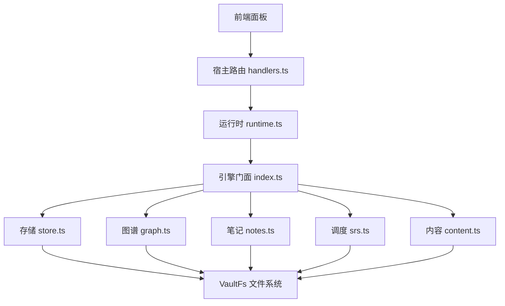
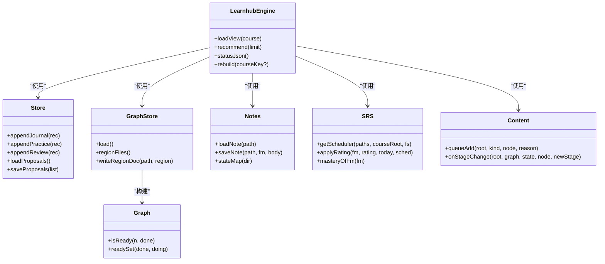
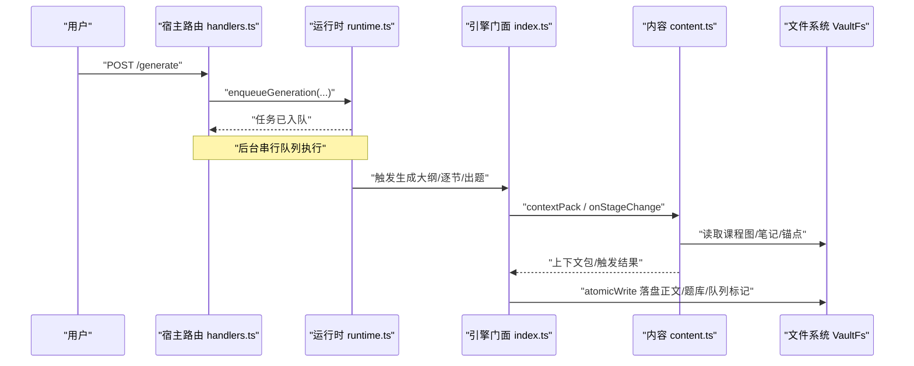
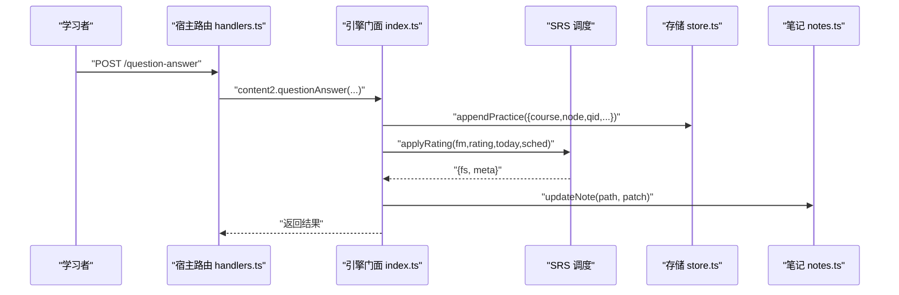
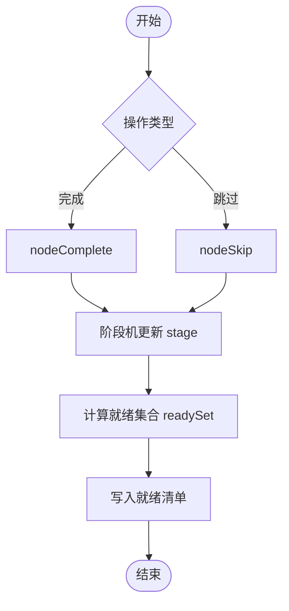
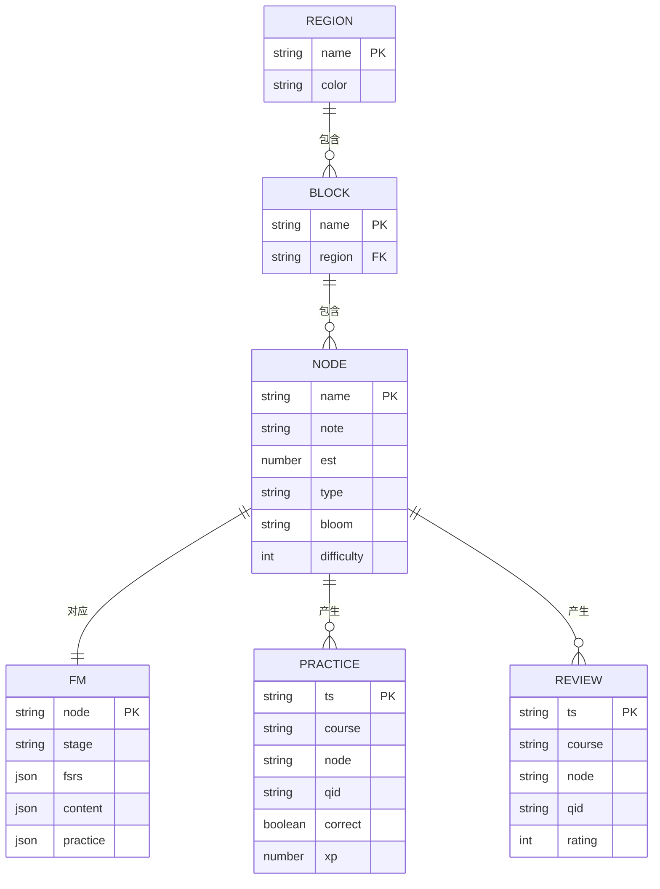
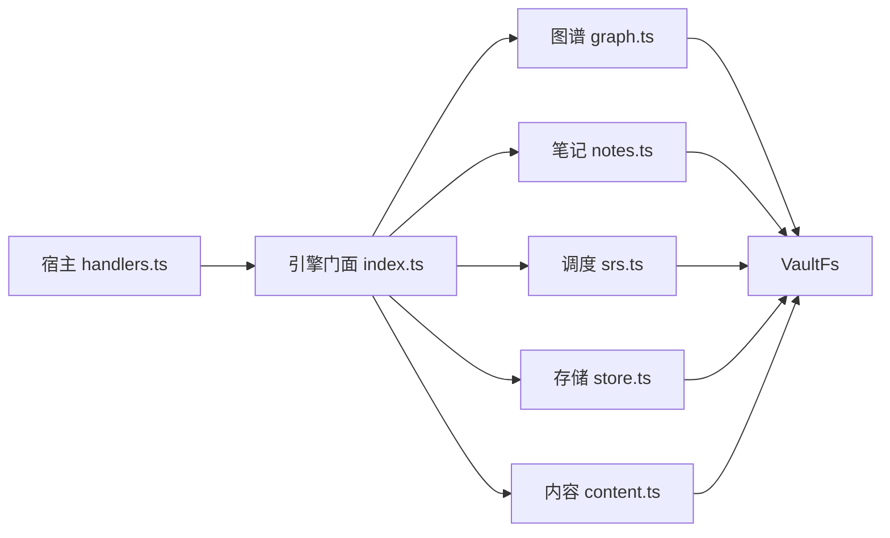
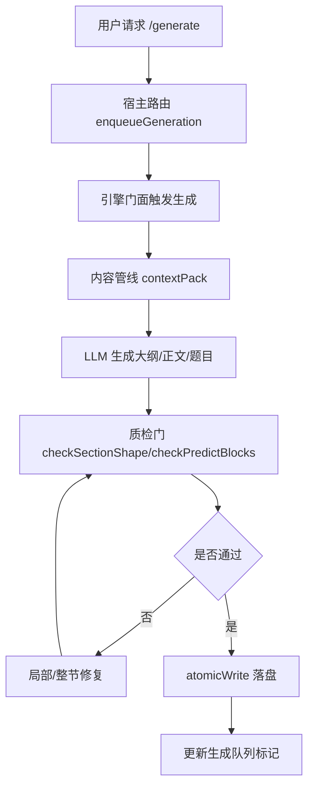
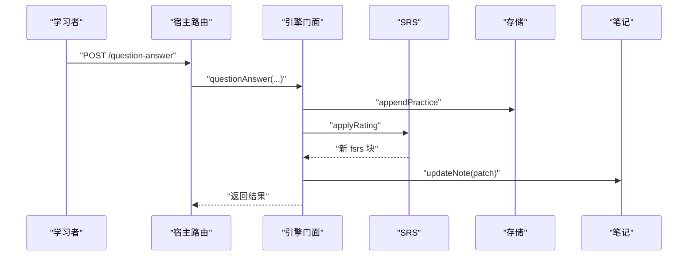

# 数据流设计

<cite>
**本文引用的文件**
- [src/engine/index.ts](file://src/engine/index.ts)
- [src/engine/types.ts](file://src/engine/types.ts)
- [src/engine/store.ts](file://src/engine/store.ts)
- [src/engine/schema.ts](file://src/engine/schema.ts)
- [src/engine/graph.ts](file://src/engine/graph.ts)
- [src/engine/notes.ts](file://src/engine/notes.ts)
- [src/engine/srs.ts](file://src/engine/srs.ts)
- [src/engine/content.ts](file://src/engine/content.ts)
- [src/host/runtime.ts](file://src/host/runtime.ts)
- [src/host/handlers.ts](file://src/host/handlers.ts)
</cite>

## 目录
1. [简介](#简介)
2. [项目结构](#项目结构)
3. [核心组件](#核心组件)
4. [架构总览](#架构总览)
5. [详细组件分析](#详细组件分析)
6. [依赖关系分析](#依赖关系分析)
7. [性能与缓存策略](#性能与缓存策略)
8. [故障排查指南](#故障排查指南)
9. [结论](#结论)
10. [附录：关键数据流图与序列图](#附录：关键数据流图与序列图)

## 简介
本文件面向 LearnHub 的数据流设计，聚焦学习内容创建、学习者答题、进度更新等关键路径的数据流向；阐述数据模型与实体关系（图谱、笔记状态、学习记录等）；说明一致性保障（事务、冲突解决、同步策略）、缓存与查询优化、版本管理与迁移机制；并提供数据流图与序列图，帮助开发者理解复杂交互。

## 项目结构
LearnHub 采用“宿主层 + 引擎门面 + 子系统”的分层组织：
- 宿主层（host）：HTTP 路由、运行时装配、任务队列、日志与外部适配（LLM、文件系统）。
- 引擎门面（engine/index.ts）：统一入口，聚合各子系统（图谱、内容、调度、学习者、项目、题库等），对外暴露稳定接口。
- 子系统与领域模块：按职责拆分（graph、content、sched、learner、projects、bank、nof1、growth 等）。
- 存储抽象（io/VaultFs）：所有持久化通过 VaultFs 访问，保证可替换实现与测试隔离。

图表来源
- [src/host/handlers.ts:101-174](file://src/host/handlers.ts#L101-L174)
- [src/host/runtime.ts:138-193](file://src/host/runtime.ts#L138-L193)
- [src/engine/index.ts:149-398](file://src/engine/index.ts#L149-L398)
- [src/engine/graph.ts:198-276](file://src/engine/graph.ts#L198-L276)
- [src/engine/notes.ts:66-74](file://src/engine/notes.ts#L66-L74)
- [src/engine/srs.ts:53-61](file://src/engine/srs.ts#L53-L61)
- [src/engine/store.ts:46-149](file://src/engine/store.ts#L46-L149)
- [src/engine/content.ts:51-112](file://src/engine/content.ts#L51-L112)

章节来源
- [src/host/handlers.ts:101-174](file://src/host/handlers.ts#L101-L174)
- [src/host/runtime.ts:138-193](file://src/host/runtime.ts#L138-L193)
- [src/engine/index.ts:149-398](file://src/engine/index.ts#L149-L398)

## 核心组件
- 引擎门面 LearnhubEngine：装配并协调各子系统，提供课程视图加载、推荐、诊断、重建、讨论包等能力。
- 存储 Store：JSONL 追加流水（journal/practice/review-log）、提案清单、快照、pin、回执、习惯重复、勘误冲正等。
- 图谱 GraphStore/Graph：data/*.yaml 为图结构事实源；构建邻接表、拓扑序、深度、可达集、就绪判定等。
- 笔记 Notes：frontmatter 是调度状态唯一事实源；读写原子化，校验严格。
- 调度 SRS：FSRS 参数解析、卡片转换、评分推进、阶段机、掌握度派生。
- 内容 Content：生成队列、上下文包、质检门、修复轮、提示词模板管理。
- 宿主 Runtime/Handlers：路由到引擎方法，封装运行日志、任务入队、会话触点。

章节来源
- [src/engine/index.ts:149-398](file://src/engine/index.ts#L149-L398)
- [src/engine/store.ts:46-149](file://src/engine/store.ts#L46-L149)
- [src/engine/graph.ts:198-443](file://src/engine/graph.ts#L198-L443)
- [src/engine/notes.ts:18-35](file://src/engine/notes.ts#L18-L35)
- [src/engine/srs.ts:29-61](file://src/engine/srs.ts#L29-L61)
- [src/engine/content.ts:62-137](file://src/engine/content.ts#L62-L137)
- [src/host/runtime.ts:138-193](file://src/host/runtime.ts#L138-L193)
- [src/host/handlers.ts:101-174](file://src/host/handlers.ts#L101-L174)

## 架构总览
数据主权与事实源约定：
- 课程笔记 frontmatter 是调度状态唯一事实源。
- data/*.yaml 是图结构唯一事实源。
- state/ 仅承载追加型流水（journal/practice/review-log JSONL）与人审产物（proposals.json / snapshots/）。
- 无 SQLite、无投影回写，避免多源不一致。

图表来源
- [src/engine/index.ts:149-398](file://src/engine/index.ts#L149-L398)
- [src/engine/store.ts:46-149](file://src/engine/store.ts#L46-L149)
- [src/engine/graph.ts:198-443](file://src/engine/graph.ts#L198-L443)
- [src/engine/notes.ts:66-74](file://src/engine/notes.ts#L66-L74)
- [src/engine/srs.ts:53-61](file://src/engine/srs.ts#L53-L61)
- [src/engine/content.ts:62-137](file://src/engine/content.ts#L62-L137)

## 详细组件分析

### 学习内容创建（种子→大纲→逐节→出题）
- 入口：宿主路由 POST /generate、POST /generate/section、POST /course/reset。
- 流程要点：
  - 入队生成任务（全局串行队列），返回即完成。
  - 引擎根据节点阶段变化触发 T1/T2 生成（前置满足时入队）。
  - 内容管线组装上下文包，调用 LLM 生成大纲/正文/练习题。
  - 质检门检查（别名、可视化块、长度、预测门等），必要时局部或整节修复。
  - 落盘使用 atomicWrite 保证原子性；失败不阻塞主流程但留痕。

图表来源
- [src/host/handlers.ts:388-409](file://src/host/handlers.ts#L388-L409)
- [src/engine/content.ts:62-137](file://src/engine/content.ts#L62-L137)
- [src/engine/content.ts:141-277](file://src/engine/content.ts#L141-L277)
- [src/engine/content.ts:757-788](file://src/engine/content.ts#L757-L788)

章节来源
- [src/host/handlers.ts:388-409](file://src/host/handlers.ts#L388-L409)
- [src/engine/content.ts:62-137](file://src/engine/content.ts#L62-L137)
- [src/engine/content.ts:141-277](file://src/engine/content.ts#L141-L277)
- [src/engine/content.ts:757-788](file://src/engine/content.ts#L757-L788)

### 学习者答题与复习刷卡（question-answer/rate/forget）
- 入口：POST /question-answer、POST /question-rate、POST /question-forget。
- 数据流：
  - 作答：记录 practice 流水（含 elapsed_s、predicted、xp 等），可选延迟调度。
  - 自评：映射到 FSRS 评分（Again/Hard/Good/Easy），推进卡片状态。
  - 忘记申报：记证据、0 XP，不影响调度。
  - 复习队列：按遗忘风险排序，支持定向复习与难度带偏好。

图表来源
- [src/host/handlers.ts:533-556](file://src/host/handlers.ts#L533-L556)
- [src/engine/srs.ts:107-133](file://src/engine/srs.ts#L107-L133)
- [src/engine/store.ts:100-121](file://src/engine/store.ts#L100-L121)
- [src/engine/notes.ts:315-328](file://src/engine/notes.ts#L315-L328)

章节来源
- [src/host/handlers.ts:533-556](file://src/host/handlers.ts#L533-L556)
- [src/engine/srs.ts:107-133](file://src/engine/srs.ts#L107-L133)
- [src/engine/store.ts:100-121](file://src/engine/store.ts#L100-L121)
- [src/engine/notes.ts:315-328](file://src/engine/notes.ts#L315-L328)

### 进度更新（节点完成/跳过/就绪清单）
- 入口：POST /node/complete、POST /node/skip。
- 逻辑：
  - 完成：触发教练回合感知点，可能进入 review/mastered 阶段。
  - 跳过：显式重新裁决，改变症状与路线。
  - 就绪清单：基于图 pre/opt 计算 readySet，写入 ready.md 供面板展示。

图表来源
- [src/host/handlers.ts:312-335](file://src/host/handlers.ts#L312-L335)
- [src/engine/graph.ts:424-443](file://src/engine/graph.ts#L424-L443)
- [src/engine/graph.ts:494-511](file://src/engine/graph.ts#L494-L511)

章节来源
- [src/host/handlers.ts:312-335](file://src/host/handlers.ts#L312-L335)
- [src/engine/graph.ts:424-443](file://src/engine/graph.ts#L424-L443)
- [src/engine/graph.ts:494-511](file://src/engine/graph.ts#L494-L511)

### 数据模型与实体关系
- 图谱：Region → Block → Node（name/pre/opt/note/enc/est/type/bloom/difficulty/teaches/assumes/misconceptions）。
- 笔记：Fm（node/stage/fsrs/content/practice），frontmatter 为调度事实源。
- 学习记录：JournalRec、PracticeRec、ReviewRec、ProposalRec、ErratumRec 等。
- 关系：Node 的 pre/enc 构成学习依赖；Fm.stage 驱动调度；Practice/Review 影响 FSRS 与 mastery。

图表来源
- [src/engine/types.ts:40-61](file://src/engine/types.ts#L40-L61)
- [src/engine/types.ts:81-107](file://src/engine/types.ts#L81-L107)
- [src/engine/types.ts:132-200](file://src/engine/types.ts#L132-L200)
- [src/engine/graph.ts:175-196](file://src/engine/graph.ts#L175-L196)

章节来源
- [src/engine/types.ts:40-61](file://src/engine/types.ts#L40-L61)
- [src/engine/types.ts:81-107](file://src/engine/types.ts#L81-L107)
- [src/engine/types.ts:132-200](file://src/engine/types.ts#L132-L200)
- [src/engine/graph.ts:175-196](file://src/engine/graph.ts#L175-L196)

### 数据一致性与同步策略
- 事实源约定：frontmatter 与 data/*.yaml 分别作为调度与图结构的权威来源；state/ 仅追加流水。
- 原子写入：所有写盘走 atomicWrite，避免部分写入导致的不一致。
- 提案机制：proposals.json 全留痕（pending/applied/rejected），pair 联动防单边生效。
- 版本硬门：schema.version 非当前版本拒载，指引一次性迁移脚本。
- 错误处理：Broken/Missing 明确区分，读侧对损坏数据 fail loud，不静默降级。

章节来源
- [src/engine/index.ts:1-10](file://src/engine/index.ts#L1-L10)
- [src/engine/store.ts:168-206](file://src/engine/store.ts#L168-L206)
- [src/engine/schema.ts:37-80](file://src/engine/schema.ts#L37-L80)
- [src/engine/notes.ts:315-328](file://src/engine/notes.ts#L315-L328)

### 缓存策略与性能优化
- FSRS 参数缓存：按课程根缓存调度器实例，避免每次重建成本。
- 视图加载：loadView 每次现读图与 frontmatter，保证最新且轻量。
- 就绪清单：按需写入 ready.md，减少实时计算开销。
- 生成队列：串行队列避免并发竞争，降低资源抖动。
- 质检门：局部修补与块级定位，减少整节重跑成本。

章节来源
- [src/engine/index.ts:198-210](file://src/engine/index.ts#L198-L210)
- [src/engine/index.ts:410-417](file://src/engine/index.ts#L410-L417)
- [src/engine/graph.ts:494-511](file://src/engine/graph.ts#L494-L511)
- [src/engine/content.ts:670-731](file://src/engine/content.ts#L670-L731)

### 数据版本管理与迁移机制
- schema.version：启动时强制校验，旧库拒载并提示迁移脚本。
- breaks 档案：记录断裂历史，便于审计与回溯。
- formats：子格式独立演进，破坏性变更仍走主版本断裂。
- 新鲜库自动盖戳：首次部署直接写入当前版本，免迁移。

章节来源
- [src/engine/schema.ts:37-80](file://src/engine/schema.ts#L37-L80)
- [src/host/runtime.ts:155-162](file://src/host/runtime.ts#L155-L162)

## 依赖关系分析
- 宿主层依赖引擎门面，不深导入内部模块（R1 约束）。
- 引擎门面聚合子系统，子系统间通过构造注入共享端口（clock/rng/fs/store/paths）。
- 存储层通过 VaultFs 抽象，解耦具体文件系统实现。
- 图谱与笔记强耦合于 data/*.yaml 与 frontmatter，其他模块通过门面访问。

图表来源
- [src/host/handlers.ts:101-174](file://src/host/handlers.ts#L101-L174)
- [src/engine/index.ts:149-398](file://src/engine/index.ts#L149-L398)

章节来源
- [src/host/handlers.ts:101-174](file://src/host/handlers.ts#L101-L174)
- [src/engine/index.ts:149-398](file://src/engine/index.ts#L149-L398)

## 性能与缓存策略
- FSRS 参数缓存：按课程根缓存调度器，避免重复初始化。
- 视图加载：轻量现读，适合小图场景。
- 就绪清单：预计算并落盘，UI 直读。
- 生成队列：串行执行，避免并发冲突与资源争用。
- 质检门：块级定位与局部修补，减少大段重写。

[本节为通用指导，无需特定文件引用]

## 故障排查指南
- Broken/Missing 区分：store 与 notes 对损坏数据 fail loud，避免静默降级。
- 提案链守卫：pairApplyBlock 防止同源双提案单边生效。
- 生成任务档 Broken：host 置错误文案，拒绝写回防覆盖。
- 版本硬门：schema 不匹配时给出迁移指引。

章节来源
- [src/engine/store.ts:168-206](file://src/engine/store.ts#L168-L206)
- [src/engine/store.ts:257-276](file://src/engine/store.ts#L257-L276)
- [src/engine/schema.ts:59-80](file://src/engine/schema.ts#L59-L80)
- [src/host/runtime.ts:105-113](file://src/host/runtime.ts#L105-L113)

## 结论
LearnHub 以“事实源单一、追加流水、原子写入、版本硬门”为核心原则，构建了可扩展、可审计、可迁移的学习数据流体系。通过引擎门面统一入口、子系统解耦、VaultFs 抽象与严格的契约校验，确保学习内容创建、答题与进度更新的一致性与可观测性。配合缓存与质检优化，兼顾性能与质量。

[本节为总结，无需特定文件引用]

## 附录：关键数据流图与序列图

### 学习内容创建数据流图

图表来源
- [src/host/handlers.ts:388-409](file://src/host/handlers.ts#L388-L409)
- [src/engine/content.ts:141-277](file://src/engine/content.ts#L141-L277)
- [src/engine/content.ts:757-788](file://src/engine/content.ts#L757-L788)

### 学习者答题序列图

图表来源
- [src/host/handlers.ts:533-556](file://src/host/handlers.ts#L533-L556)
- [src/engine/srs.ts:107-133](file://src/engine/srs.ts#L107-L133)
- [src/engine/store.ts:100-121](file://src/engine/store.ts#L100-L121)
- [src/engine/notes.ts:315-328](file://src/engine/notes.ts#L315-L328)