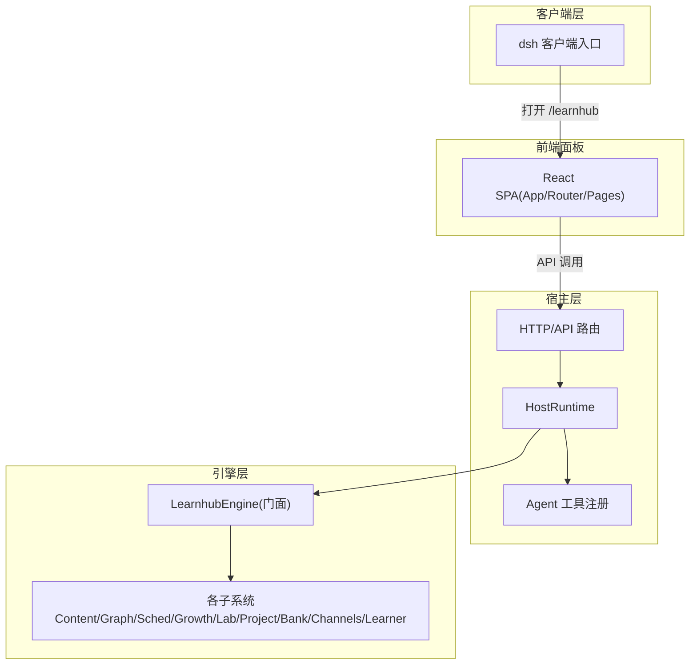
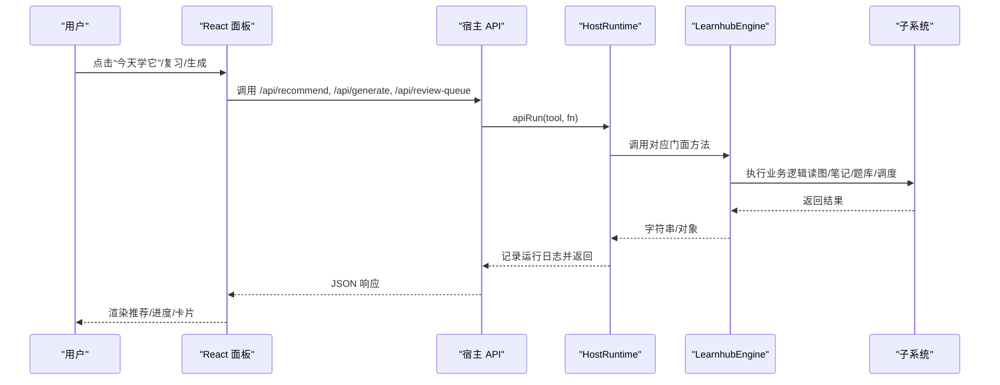
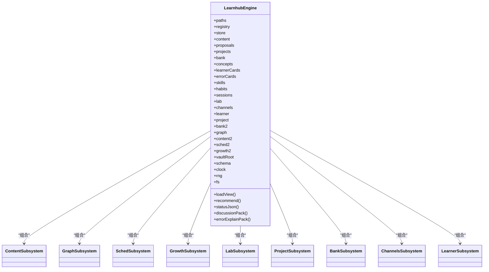
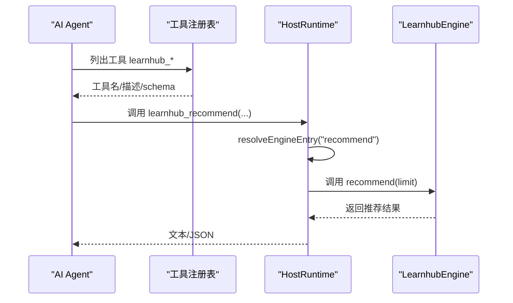
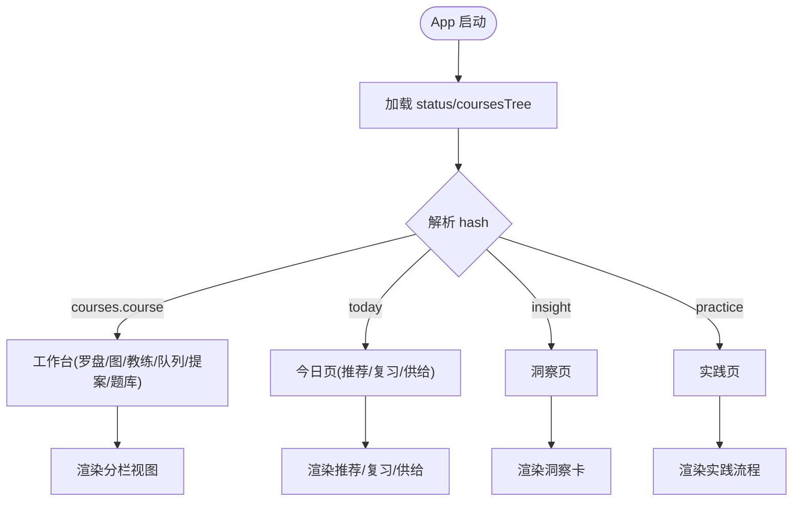
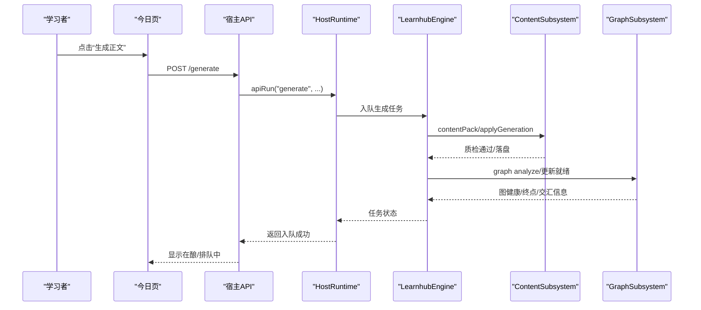
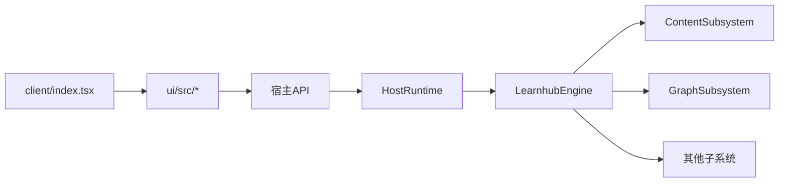

# 架构设计

<cite>
**本文引用的文件**
- [src/engine/index.ts](file://src/engine/index.ts)
- [src/host/runtime.ts](file://src/host/runtime.ts)
- [src/client/index.tsx](file://src/client/index.tsx)
- [ui/src/App.tsx](file://ui/src/App.tsx)
- [ui/src/lib/router.ts](file://ui/src/lib/router.ts)
- [src/engine/agent.ts](file://src/engine/agent.ts)
- [src/host/tools.ts](file://src/host/tools.ts)
- [src/engine/content-subsystem.ts](file://src/engine/content-subsystem.ts)
- [src/engine/graph-subsystem.ts](file://src/engine/graph-subsystem.ts)
- [package.json](file://package.json)
</cite>

## 目录
1. [简介](#简介)
2. [项目结构](#项目结构)
3. [核心组件](#核心组件)
4. [架构总览](#架构总览)
5. [详细组件分析](#详细组件分析)
6. [依赖关系分析](#依赖关系分析)
7. [性能考量](#性能考量)
8. [故障排查指南](#故障排查指南)
9. [结论](#结论)
10. [附录](#附录)

## 简介
本文件为 LearnHub 学习中心插件的架构设计文档，面向引擎层、宿主层与客户端层的职责划分与交互关系，系统阐述 LearnhubEngine 门面模式、HostRuntime 运行时管理、Agent 工具注册体系、前端 React 应用组件与状态管理、数据流设计与关键业务闭环（学习内容创建、学习者答题、进度更新），并给出边界定义、扩展点与集成模式。

## 项目结构
仓库采用“引擎 + 宿主 + 客户端 + 前端面板”的分层组织：
- 引擎层（engine）：以 LearnhubEngine 为门面，聚合内容、图、题库、调度、成长、通道、项目等子系统；通过窄面注入实现解耦。
- 宿主层（host）：提供 HostRuntime 运行时对象，装配引擎、Agent 缝、任务注册表、日志与工具注册；对外暴露 API 路由与 Agent 工具。
- 客户端层（client）：嵌入宿主侧边栏，打开独立标签页 SPA，桥接讨论/讲解到宿主会话。
- 前端面板（ui）：React SPA，基于 hash 路由与轻量状态管理，承载今日、课程工作台、洞察、项目与实践等页面。

图表来源
- [src/host/runtime.ts:138-193](file://src/host/runtime.ts#L138-L193)
- [src/host/tools.ts:102-125](file://src/host/tools.ts#L102-L125)
- [src/engine/index.ts:149-398](file://src/engine/index.ts#L149-L398)
- [ui/src/App.tsx:47-179](file://ui/src/App.tsx#L47-L179)
- [src/client/index.tsx:11-155](file://src/client/index.tsx#L11-L155)

章节来源
- [package.json:1-83](file://package.json#L1-L83)

## 核心组件
- LearnhubEngine 门面：统一数据访问与领域能力入口，内部组合多个子系统，屏蔽存储细节与跨域装配。
- HostRuntime 运行时：显式承载引擎实例、Agent 缝、语料捕获、任务注册表与标志位；所有技术函数接收 runtime 参数，便于测试与可测性。
- AgentSeam 统一 Agent 缝：封装 LLM 调用、工具回路预算、门错修复轮、调用观测记录，隔离适配器与站点逻辑。
- 工具注册系统：从命令注册表生成 Agent 工具描述与执行器，将 engine 方法或 handler 绑定为可被 AI 调用的工具。
- 前端 App：基于 hash 路由与集中式 frame 状态，协调页面导航、数据加载、教练通知与主题切换。

章节来源
- [src/engine/index.ts:149-398](file://src/engine/index.ts#L149-L398)
- [src/host/runtime.ts:118-193](file://src/host/runtime.ts#L118-L193)
- [src/engine/agent.ts:85-200](file://src/engine/agent.ts#L85-L200)
- [src/host/tools.ts:102-125](file://src/host/tools.ts#L102-L125)
- [ui/src/App.tsx:47-179](file://ui/src/App.tsx#L47-L179)

## 架构总览
整体采用“门面 + 子系统 + 运行时 + 工具面”的分层架构：
- 门面（LearnhubEngine）：对外暴露稳定接口，内部按领域切分子系统，避免宿主直连具体实现。
- 运行时（HostRuntime）：装配引擎、Agent 缝、持久化任务表与运行标志；提供 run/apiRun 包装日志与错误处理。
- 工具面：将引擎能力暴露给 Agent 与外部调用方，保持 schema 与行为契约稳定。
- 客户端与前端：通过 HTTP 与消息桥接与宿主交互，UI 使用 hash 路由与轻量状态管理。

图表来源
- [src/host/runtime.ts:233-253](file://src/host/runtime.ts#L233-L253)
- [src/engine/index.ts:410-569](file://src/engine/index.ts#L410-L569)
- [ui/src/App.tsx:62-81](file://ui/src/App.tsx#L62-L81)

## 详细组件分析

### LearnhubEngine 门面与子系统架构
- 门面职责：
  - 统一路径与配置解析（vault/centerRel）。
  - 初始化各子系统与共享端口（clock/rng/fs/store/registry）。
  - 暴露课程视图、推荐、状态、重建、审计、讨论包、错误讲解包等能力。
- 子系统组织：
  - ContentSubsystem：内容管线、笔记 resolve、工作区、题库树、先验注入、质检与落盘。
  - GraphSubsystem：图分析、Vault 链接先验、图探索、提案门禁包装、enc 覆盖回填。
  - SchedSubsystem：FSRS 调度、沉淀层、记忆健康、JOL 抽查、睡眠建议等。
  - GrowthSubsystem：教练回合感知、生长批受理、复诊、罗盘 ETA。
  - LabSubsystem：N-of-1 实验、挑战点恒温器、沙盘、睡眠耦合建议。
  - ProjectSubsystem：项目目标反编译、计划里程碑、执行事件流、Mastery 交叉。
  - BankSubsystem：题库体检、清理、回流、勘误冲正。
  - ChannelsSubsystem：C1 笔记源、Anki 通道、漂移治理、排除清单。
  - LearnerSubsystem：学习者输出、习惯、技能、回执、执行事件。

图表来源
- [src/engine/index.ts:149-398](file://src/engine/index.ts#L149-L398)
- [src/engine/content-subsystem.ts:101-200](file://src/engine/content-subsystem.ts#L101-L200)
- [src/engine/graph-subsystem.ts:78-200](file://src/engine/graph-subsystem.ts#L78-L200)

章节来源
- [src/engine/index.ts:149-398](file://src/engine/index.ts#L149-L398)
- [src/engine/content-subsystem.ts:101-200](file://src/engine/content-subsystem.ts#L101-L200)
- [src/engine/graph-subsystem.ts:78-200](file://src/engine/graph-subsystem.ts#L78-L200)

### HostRuntime 运行时管理与 Agent 工具注册
- HostRuntime：
  - 构造时校验部署路径、创建 fresh schema、装配引擎、Agent 缝、语料捕获器、任务表与标志位。
  - 提供 resolveEngineEntry 将“子系统.方法”字符串解析为可调用函数，统一入口。
  - 提供 run/apiRun 包装日志与失败记录。
- Agent 工具注册：
  - 从命令注册表生成工具 schema 与 execute，execute 通过 resolveEngineEntry 调用引擎方法或 handler。
  - 工具描述与页面跳转提示 AGENT_GUIDE 用于引导 AI 正确调用。

图表来源
- [src/host/runtime.ts:138-193](file://src/host/runtime.ts#L138-L193)
- [src/host/runtime.ts:204-215](file://src/host/runtime.ts#L204-L215)
- [src/host/tools.ts:102-125](file://src/host/tools.ts#L102-L125)

章节来源
- [src/host/runtime.ts:138-193](file://src/host/runtime.ts#L138-L193)
- [src/host/tools.ts:102-125](file://src/host/tools.ts#L102-L125)

### 前端 React 应用组件架构与状态管理
- 路由：基于 hash 的两级路由（区键 + 子路由/参数段），规范形与回退策略明确，支持深链与前进后退。
- 状态：AppFrame 集中维护 status/tree/course/lesson/focusJob 等全局态，页面通过 props/frame 获取与回调。
- 页面：TodayPage 聚合推荐流、复习队列、供给快照与闸门计数；WorkbenchPage 首屏为罗盘+图；PracticeFlow 驱动练习流程。
- 通信：通过 api.ts 调用后端接口，useCommand/usePolling 管理请求与轮询。

图表来源
- [ui/src/lib/router.ts:1-164](file://ui/src/lib/router.ts#L1-L164)
- [ui/src/App.tsx:47-179](file://ui/src/App.tsx#L47-L179)
- [ui/src/pages/TodayPage/index.tsx:36-200](file://ui/src/pages/TodayPage/index.tsx#L36-L200)

章节来源
- [ui/src/lib/router.ts:1-164](file://ui/src/lib/router.ts#L1-L164)
- [ui/src/App.tsx:47-179](file://ui/src/App.tsx#L47-L179)
- [ui/src/pages/TodayPage/index.tsx:36-200](file://ui/src/pages/TodayPage/index.tsx#L36-L200)

### 数据流设计：学习内容创建、学习者答题、进度更新
- 学习内容创建：
  - 前端触发生成（如推荐卡“生成正文”），宿主入队 GenJob，引擎组装上下文包（含 Vault 先验注入）、质检门与落盘。
  - 生成过程经 Agent 缝与工具回路迭代，产出 YAML/正文，过门禁后 apply 写入。
- 学习者答题：
  - 今日页发起复习会话，拉取 review-queue，逐题作答；引擎计算掌握度、XP、调度更新，写 practice 流水。
  - 答错时可触发“讲解这道题”，引擎组装错误讲解上下文包，进入对话。
- 进度更新：
  - 推荐流、供给快照、闸门计数同源刷新；完成节点点亮“已生成”，推荐项随状态变化重排。
  - 教练台/生成队列/提案收件箱联动，体现生长批与图变更。

图表来源
- [src/engine/content-subsystem.ts:125-200](file://src/engine/content-subsystem.ts#L125-L200)
- [src/engine/graph-subsystem.ts:88-117](file://src/engine/graph-subsystem.ts#L88-L117)
- [ui/src/pages/TodayPage/index.tsx:131-138](file://ui/src/pages/TodayPage/index.tsx#L131-L138)

章节来源
- [src/engine/content-subsystem.ts:125-200](file://src/engine/content-subsystem.ts#L125-L200)
- [src/engine/graph-subsystem.ts:88-117](file://src/engine/graph-subsystem.ts#L88-L117)
- [ui/src/pages/TodayPage/index.tsx:131-138](file://ui/src/pages/TodayPage/index.tsx#L131-L138)

### 关键决策、模式与原则
- 门面模式（LearnhubEngine）：收敛数据访问与领域能力，屏蔽子系统装配与存储细节，保证宿主仅消费稳定接口。
- 运行时对象（HostRuntime）：显式装配与可测性，所有技术函数接收 runtime，避免模块级隐式状态。
- 统一 Agent 缝（AgentSeam）：隔离 LLM 适配器与站点逻辑，提供工具回路预算、门错修复轮与观测记录。
- 子系统窄面注入：跨域调用通过窄面接口，降低环依赖与耦合。
- 只读纪律与事实源：课程 frontmatter 与 data/*.yaml 作为唯一事实源，state/ 仅追加型流水与产物。
- 可扩展点：
  - 新增子系统：在门面组合新子系统，并通过窄面暴露能力。
  - 新增工具：在命令注册表声明 channel/tool/bind，自动注册为 Agent 工具。
  - 新增页面：在 ui/src/pages 下添加页面，并在 router 中登记视图键与路由。

章节来源
- [src/engine/index.ts:149-398](file://src/engine/index.ts#L149-L398)
- [src/host/runtime.ts:138-193](file://src/host/runtime.ts#L138-L193)
- [src/engine/agent.ts:85-200](file://src/engine/agent.ts#L85-L200)
- [src/host/tools.ts:102-125](file://src/host/tools.ts#L102-L125)

## 依赖关系分析
- 引擎对子系统：LearnhubEngine 组合多个子系统，子系统之间通过窄面回引门面，避免直接环依赖。
- 宿主对引擎：通过 HostRuntime 装配与 resolveEngineEntry 动态解析入口，工具注册表驱动工具面。
- 前端对宿主：通过 api.ts 调用 REST/WS 接口，路由与状态管理在 ui 层内聚。
- 客户端对宿主：通过 window.postMessage 桥接讨论/讲解，打开独立标签页 SPA。

图表来源
- [ui/src/App.tsx:47-179](file://ui/src/App.tsx#L47-L179)
- [src/host/runtime.ts:138-193](file://src/host/runtime.ts#L138-L193)
- [src/engine/index.ts:149-398](file://src/engine/index.ts#L149-L398)
- [src/client/index.tsx:11-155](file://src/client/index.tsx#L11-L155)

章节来源
- [ui/src/App.tsx:47-179](file://ui/src/App.tsx#L47-L179)
- [src/host/runtime.ts:138-193](file://src/host/runtime.ts#L138-L193)
- [src/engine/index.ts:149-398](file://src/engine/index.ts#L149-L398)
- [src/client/index.tsx:11-155](file://src/client/index.tsx#L11-L155)

## 性能考量
- FSRS 调度器缓存：按课程根缓存调度器实例，避免每答一题重建成本。
- 只读扫描与缓存：Vault 链接先验扫描结果缓存于 state，减少重复扫描。
- 批量与节流：推荐流与供给快照同拍刷新，避免频繁网络请求；轮询间隔合理设置。
- 日志截断：运行日志输出截断上限，防止大输出阻塞主流程。

[本节为通用指导，不直接分析具体文件]

## 故障排查指南
- 生成任务档 Broken：
  - 现象：生成队列报错，拒绝写回注册表。
  - 处理：修复或删除损坏的任务文件后重启宿主再试。
- 节点笔记 Broken：
  - 现象：定向操作抛错，携带位置与原因。
  - 处理：根据 reason 修正 frontmatter 或正文，再重试。
- Agent 工具回路预算耗尽：
  - 现象：K≤6 轮后仍在请求工具，中止并报错。
  - 处理：检查工具白名单与 runTool 实现，确保模型不再无界循环。
- 路由异常：
  - 现象：旧键深链或非法 hash 导致页面空白。
  - 处理：规范化到默认视图或工作台首屏，检查 navigate/navigateCourse 使用。

章节来源
- [src/engine/index.ts:724-753](file://src/engine/index.ts#L724-L753)
- [src/engine/index.ts:444-463](file://src/engine/index.ts#L444-L463)
- [src/engine/agent.ts:122-186](file://src/engine/agent.ts#L122-L186)
- [ui/src/lib/router.ts:77-104](file://ui/src/lib/router.ts#L77-L104)

## 结论
LearnHub 通过 LearnhubEngine 门面与 HostRuntime 运行时实现了清晰的三层架构与稳定的扩展点。子系统窄面注入与 Agent 缝确保了可测试性与可替换性。前端基于 hash 路由与集中状态管理，提供了流畅的学习体验。数据流围绕内容创建、答题与进度更新形成闭环，配合质量审计与图谱健康评估，保障系统的健壮性与演进能力。

## 附录
- 系统边界：
  - 引擎边界：所有数据访问必须经过 LearnhubEngine；工具、HTTP 路由、UI 不得绕过门面直写数据文件。
  - 宿主边界：运行时对象承载全部可变态；技术函数一律接收 runtime。
  - 前端边界：路由权威为 location.hash；页面状态由 AppFrame 统一管理。
- 集成模式：
  - dsh 插件集成：通过 cordis.patch.yml 与 client 入口注入侧边栏与窗口桥接。
  - Agent 工具集成：命令注册表驱动工具注册，schema 与行为契约保持稳定。
  - 面板集成：构建产物 web/dist 由宿主每次请求现读，无需重建客户端。

章节来源
- [src/engine/index.ts:1-10](file://src/engine/index.ts#L1-L10)
- [src/host/runtime.ts:138-193](file://src/host/runtime.ts#L138-L193)
- [ui/src/lib/router.ts:1-22](file://ui/src/lib/router.ts#L1-L22)
- [package.json:30-37](file://package.json#L30-L37)