# UI测试

<cite>
**本文引用的文件**
- [tests/ui-smoke.test.ts](file://tests/ui-smoke.test.ts)
- [tests/ui-types.test.ts](file://tests/ui-types.test.ts)
- [tests/ui-router.test.ts](file://tests/ui-router.test.ts)
- [tests/ui-honesty-dom.test.ts](file://tests/ui-honesty-dom.test.ts)
- [tests/ui-pages-dom.test.ts](file://tests/ui-pages-dom.test.ts)
- [tests/ui-seam-dom.test.ts](file://tests/ui-seam-dom.test.ts)
- [tests/ui-budget.test.ts](file://tests/ui-budget.test.ts)
- [tests/helpers/ui-dom.ts](file://tests/helpers/ui-dom.ts)
- [ui/src/lib/router.ts](file://ui/src/lib/router.ts)
- [ui/src/pages/TodayPage/index.tsx](file://ui/src/pages/TodayPage/index.tsx)
- [ui/src/pages/InsightPage/index.tsx](file://ui/src/pages/InsightPage/index.tsx)
- [ui/src/pages/WorkbenchPage/index.tsx](file://ui/src/pages/WorkbenchPage/index.tsx)
- [ui/src/components/LessonView.tsx](file://ui/src/components/LessonView.tsx)
- [ui/src/components/CoachCockpit.tsx](file://ui/src/components/CoachCockpit.tsx)
- [ui/src/components/SeedFormModal.tsx](file://ui/src/components/SeedFormModal.tsx)
- [ui/src/components/CommandBoundary.tsx](file://ui/src/components/CommandBoundary.tsx)
- [ui/src/hooks/usePolling.ts](file://ui/src/hooks/usePolling.ts)
</cite>

## 目录
1. [简介](#简介)
2. [项目结构](#项目结构)
3. [核心组件](#核心组件)
4. [架构总览](#架构总览)
5. [详细组件分析](#详细组件分析)
6. [依赖关系分析](#依赖关系分析)
7. [性能与兼容性](#性能与兼容性)
8. [故障排查指南](#故障排查指南)
9. [结论](#结论)
10. [附录](#附录)

## 简介
本文件系统化梳理该学习平台插件的前端UI测试体系，覆盖React组件的单元测试、集成测试、DOM交互模拟、页面路由与导航验证、类型契约校验、视觉回归与快照策略，以及浏览器兼容性与性能测试指导。文档以仓库现有测试代码为依据，提供可操作的实践方法与示例路径，帮助读者快速理解并扩展测试覆盖面。

## 项目结构
前端UI位于 ui/src，测试位于 tests，采用分层测试策略：
- L2冒烟门：在Node环境用react-dom/server对页面与壳组件进行静态渲染，确保首渲染不崩溃、页面清单与实现一致。
- L3 DOM交互测试：基于happy-dom + @testing-library/react，模拟用户交互、网络桩、消息提示与弹窗，断言可见行为与API调用。
- 路由与类型门：校验hash路由解析、视图键与URL往返一致性；约束UI公共面调用点数量与类型派生来源。
- 预算与视觉纪律：限制单文件大小、禁止硬编码色值与内联布局样式，强制语义化类名。

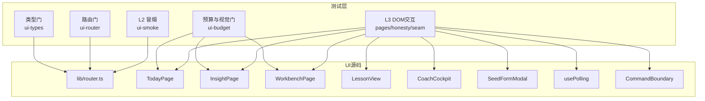

图表来源
- [tests/ui-smoke.test.ts:1-147](file://tests/ui-smoke.test.ts#L1-L147)
- [tests/ui-router.test.ts:1-305](file://tests/ui-router.test.ts#L1-L305)
- [tests/ui-types.test.ts:1-92](file://tests/ui-types.test.ts#L1-L92)
- [tests/ui-budget.test.ts:1-234](file://tests/ui-budget.test.ts#L1-L234)
- [ui/src/lib/router.ts:1-164](file://ui/src/lib/router.ts#L1-L164)

章节来源
- [tests/ui-smoke.test.ts:1-147](file://tests/ui-smoke.test.ts#L1-L147)
- [tests/ui-router.test.ts:1-305](file://tests/ui-router.test.ts#L1-L305)
- [tests/ui-types.test.ts:1-92](file://tests/ui-types.test.ts#L1-L92)
- [tests/ui-budget.test.ts:1-234](file://tests/ui-budget.test.ts#L1-L234)

## 核心组件
- 冒烟渲染门（L2）：通过react-dom/server将页面与壳组件渲染为静态标记，冻结表维护“必须渲染”的页面与壳，新页面必须显式归类，否则失败。
- DOM交互测试（L3）：使用happy-dom模拟DOM，@testing-library/react进行渲染与查询，拦截fetch到测试路由表，断言用户可见行为与API调用。
- 路由门：校验parseHash/navigate/onRouteChange/syncHash等函数与视图键、区键、子路由、工作台分栏的一致性，保障深链可达与回退正常。
- 类型门：约束UI公共面api调用点数量不变，响应类型从命令注册表output派生，避免手工镜像漂移。
- 预算与视觉门：限制单文件行数、禁止硬编码色值与内联布局style，强制语义化类名引用与定义一致。

章节来源
- [tests/ui-smoke.test.ts:1-147](file://tests/ui-smoke.test.ts#L1-L147)
- [tests/ui-dom.ts:1-129](file://tests/helpers/ui-dom.ts#L1-L129)
- [tests/ui-router.test.ts:1-305](file://tests/ui-router.test.ts#L1-L305)
- [tests/ui-types.test.ts:1-92](file://tests/ui-types.test.ts#L1-L92)
- [tests/ui-budget.test.ts:1-234](file://tests/ui-budget.test.ts#L1-L234)

## 架构总览
测试框架与UI模块的交互流程如下：
- 测试入口通过node:test运行，动态导入ui模块（tsx-loader内存转译）。
- DOM环境由happy-dom注入全局window/document等对象，@testing-library/react用于渲染与事件模拟。
- fetch被替换为测试桩，所有请求命中测试路由表，未登记返回404，驱动组件进入缝级三态（加载中/数据/错误）。
- AppFrame替身记录跳转与打开动作，便于断言导航结果。

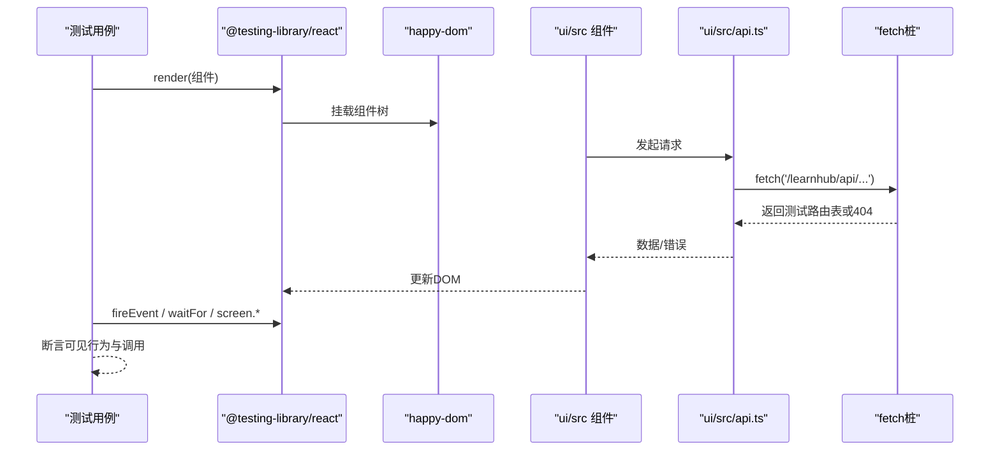

图表来源
- [tests/helpers/ui-dom.ts:1-129](file://tests/helpers/ui-dom.ts#L1-L129)
- [ui/src/lib/router.ts:1-164](file://ui/src/lib/router.ts#L1-L164)

## 详细组件分析

### 学习面板（TodayPage）测试
- 推荐流主数据三态：成功加载显示“接下来”卡片；主数据失败整页失败态且可重试；生成中节点显示逐节进度而非仅队列。
- 供给卡与闸门计数：停摆态显示中性原因与排队数；恢复队列走/generate/resume；失败任务就地重试，内容断点续跑与生长批重新裁决分别走不同路由。
- 我的资产菜单：Anki出口归洞察通道卡，菜单仅剩笔记源与我的卡。
- 文案语义锁：使用锚词断言，避免锁定整句措辞，保证术语一致性。

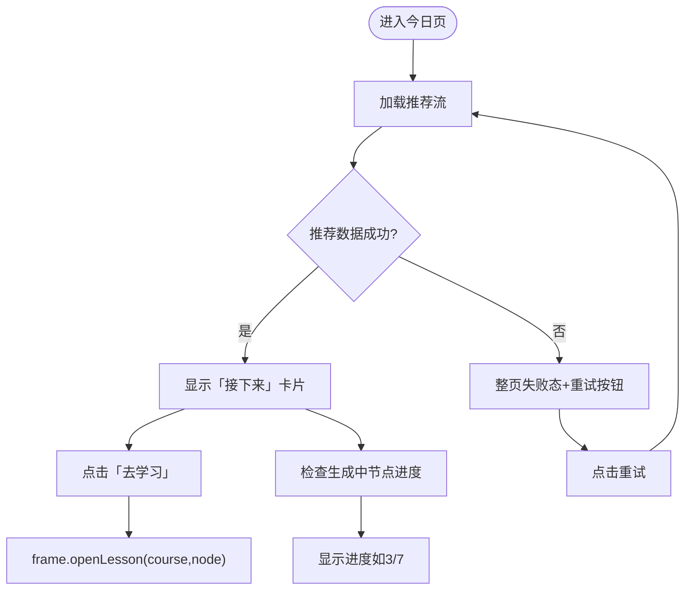

图表来源
- [tests/ui-pages-dom.test.ts:33-176](file://tests/ui-pages-dom.test.ts#L33-L176)
- [ui/src/pages/TodayPage/index.tsx](file://ui/src/pages/TodayPage/index.tsx)

章节来源
- [tests/ui-pages-dom.test.ts:33-176](file://tests/ui-pages-dom.test.ts#L33-L176)

### 题库管理（WorkbenchPage/BankColumn）测试
- 工作区分栏：罗盘、教练台、队列、提案、题库五栏，路由与视图键一一对应，URL参数段支持课程id与分栏切换。
- 题库列展示：休眠题到期列名为“未调度”，符合术语许可；失败任务行提供重试入口，按类型路由至对应处理。
- 文案语义锁：列名与提示遵循术语词典，避免禁用词汇。

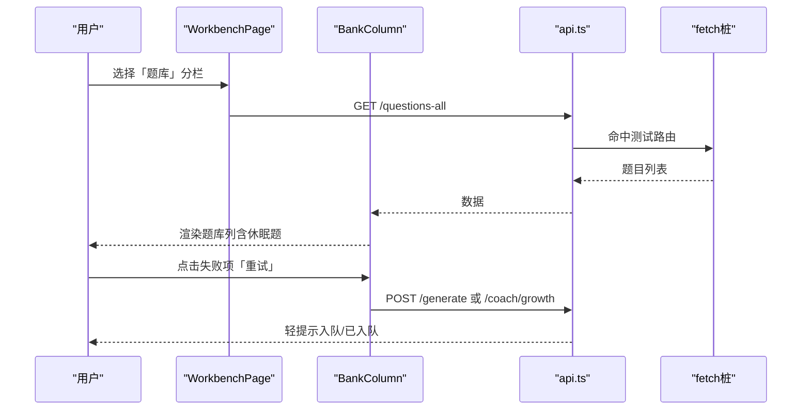

图表来源
- [tests/ui-pages-dom.test.ts:476-489](file://tests/ui-pages-dom.test.ts#L476-L489)
- [ui/src/pages/WorkbenchPage/index.tsx](file://ui/src/pages/WorkbenchPage/index.tsx)

章节来源
- [tests/ui-pages-dom.test.ts:476-489](file://tests/ui-pages-dom.test.ts#L476-L489)

### 项目工作区（ProjectsPage）测试
- 项目页签与路由：#/projects直达项目区，视图键与保活分支一致，无参数段时默认视图稳定。
- 深链与回退：旧键深链回落默认视图，前进后退历史条目正确。

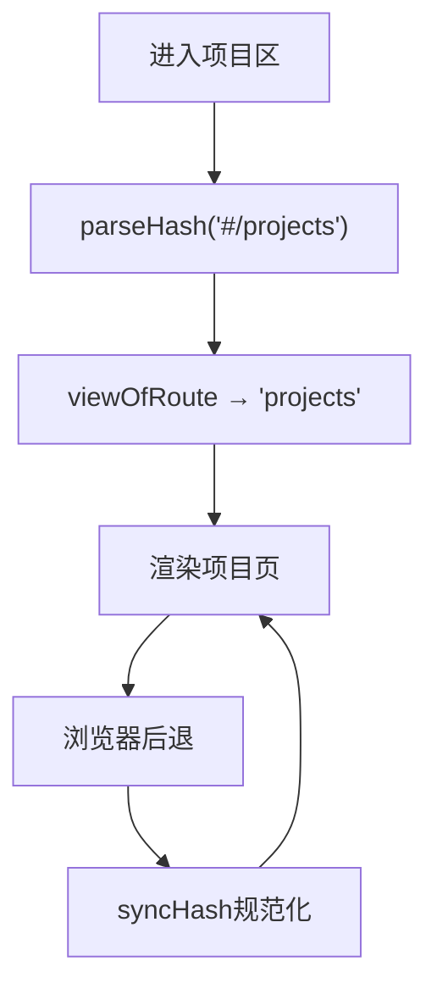

图表来源
- [tests/ui-router.test.ts:57-95](file://tests/ui-router.test.ts#L57-L95)
- [ui/src/lib/router.ts:77-113](file://ui/src/lib/router.ts#L77-L113)

章节来源
- [tests/ui-router.test.ts:57-95](file://tests/ui-router.test.ts#L57-L95)

### 学习视图（LessonView）测试
- 无题引导：有正文无题显示空态引导，“AI出题”入队/question-generate。
- 失败横幅：结构化失败清单，支持定点重写、重试续跑、关闭；“转AI修复”预填失败原文开讨论弹窗。
- 返回逻辑：关闭学习视图，回到上一视图。

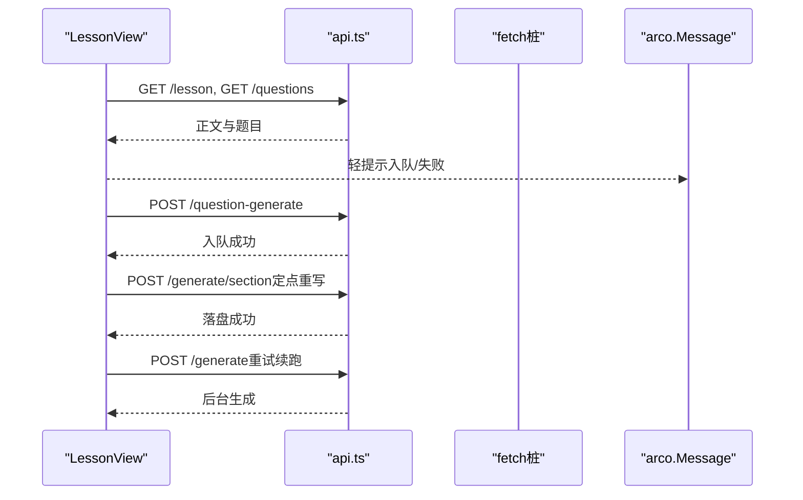

图表来源
- [tests/ui-pages-dom.test.ts:219-326](file://tests/ui-pages-dom.test.ts#L219-L326)
- [ui/src/components/LessonView.tsx](file://ui/src/components/LessonView.tsx)

章节来源
- [tests/ui-pages-dom.test.ts:219-326](file://tests/ui-pages-dom.test.ts#L219-L326)

### 教练台（CoachCockpit）测试
- 零终点禁用：无终点时“生长一步”“罗盘重画”禁用并说明先到图屏加终点。
- 有终点可用：按钮启用，可触发后续操作。
- 在途任务条：点击回调携带任务key，定位到生成页。

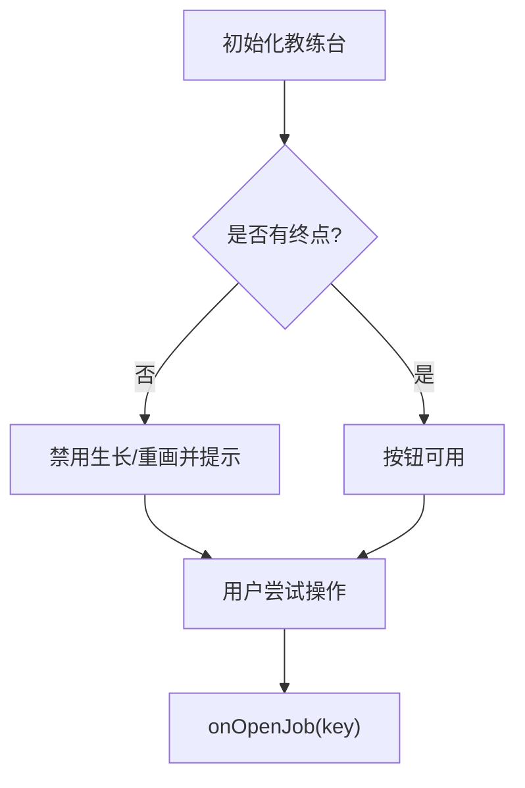

图表来源
- [tests/ui-honesty-dom.test.ts:45-76](file://tests/ui-honesty-dom.test.ts#L45-L76)
- [ui/src/components/CoachCockpit.tsx](file://ui/src/components/CoachCockpit.tsx)

章节来源
- [tests/ui-honesty-dom.test.ts:45-76](file://tests/ui-honesty-dom.test.ts#L45-L76)

### 建课表单（SeedFormModal）测试
- 建课成功：提交后显示成功提示并收起表单。
- 建课被拒：非成功样式，表单不收起，提示拒绝原因。

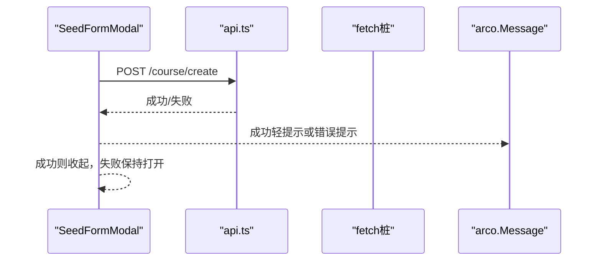

图表来源
- [tests/ui-honesty-dom.test.ts:78-111](file://tests/ui-honesty-dom.test.ts#L78-L111)
- [ui/src/components/SeedFormModal.tsx](file://ui/src/components/SeedFormModal.tsx)

章节来源
- [tests/ui-honesty-dom.test.ts:78-111](file://tests/ui-honesty-dom.test.ts#L78-L111)

### 洞察区（InsightPage）测试
- 六件同住一页：周复盘、记忆健康、校准画像、沙盘、N-of-1实验、睡眠、Anki通道、运行环境均可达。
- 待确认实验提案：卡上可见并直达提案收件箱。
- 周复盘转实验：转出后留回执并直达收件箱，同页刷新出现待确认入口。

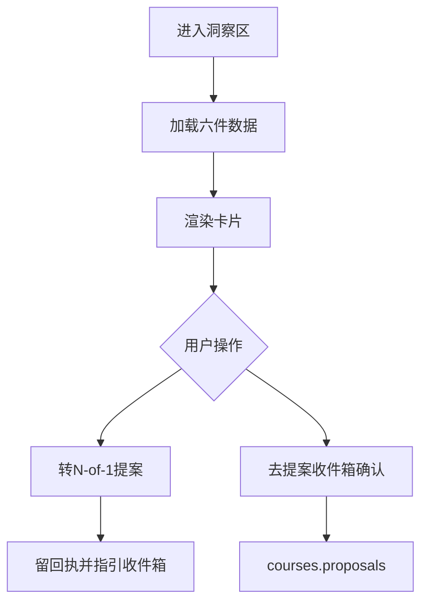

图表来源
- [tests/ui-pages-dom.test.ts:328-446](file://tests/ui-pages-dom.test.ts#L328-L446)
- [ui/src/pages/InsightPage/index.tsx](file://ui/src/pages/InsightPage/index.tsx)

章节来源
- [tests/ui-pages-dom.test.ts:328-446](file://tests/ui-pages-dom.test.ts#L328-L446)

### 数据获取缝（useCommand/CommandBoundary/usePolling）测试
- useCommand：首载loading→数据到达；失败只写error，ApiError消息经errorMessage透出；已有数据刷新失败保持旧数据；命令重取真实再发请求；latest-wins丢弃旧响应；set本地写入绕过取数；deps变化即重取。
- CommandBoundary：加载/失败/内容三态统一呈现，重试入口可点；page变体整页失败，空态由调用方派生。
- usePolling：挂载即取数；learnhub:tab命中本页签立即补取，非本页签不动。

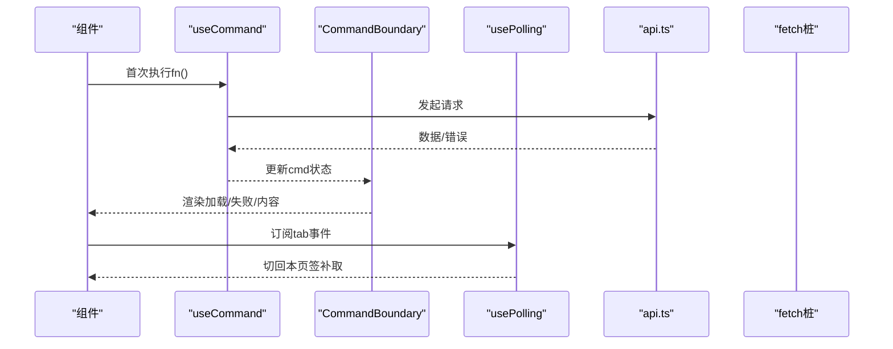

图表来源
- [tests/ui-seam-dom.test.ts:1-177](file://tests/ui-seam-dom.test.ts#L1-L177)
- [ui/src/components/CommandBoundary.tsx](file://ui/src/components/CommandBoundary.tsx)
- [ui/src/hooks/usePolling.ts](file://ui/src/hooks/usePolling.ts)

章节来源
- [tests/ui-seam-dom.test.ts:1-177](file://tests/ui-seam-dom.test.ts#L1-L177)

## 依赖关系分析
- 测试工具链：node:test + happy-dom + @testing-library/react + arco-design/web-react，均通过ui依赖树动态导入，确保实例一致性。
- 路由依赖：lib/router.ts提供parseHash/navigate/onRouteChange/syncHash等核心能力，测试通过window桩直接验证。
- 类型依赖：ui/src/types.ts从命令注册表output派生响应类型，避免手工镜像；调用点数量受控于类型门。
- 视觉纪律：global.css定义语义类，测试扫描className引用与定义一致性，禁止硬编码色值与内联布局style。

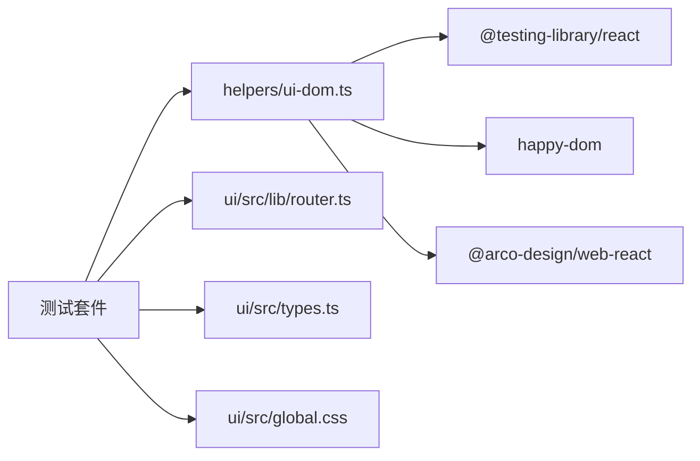

图表来源
- [tests/helpers/ui-dom.ts:1-129](file://tests/helpers/ui-dom.ts#L1-L129)
- [ui/src/lib/router.ts:1-164](file://ui/src/lib/router.ts#L1-L164)
- [tests/ui-types.test.ts:1-92](file://tests/ui-types.test.ts#L1-L92)
- [tests/ui-budget.test.ts:1-234](file://tests/ui-budget.test.ts#L1-L234)

章节来源
- [tests/helpers/ui-dom.ts:1-129](file://tests/helpers/ui-dom.ts#L1-L129)
- [ui/src/lib/router.ts:1-164](file://ui/src/lib/router.ts#L1-L164)
- [tests/ui-types.test.ts:1-92](file://tests/ui-types.test.ts#L1-L92)
- [tests/ui-budget.test.ts:1-234](file://tests/ui-budget.test.ts#L1-L234)

## 性能与兼容性
- 并发控制：测试并发上限设为3，避免多进程抢满CPU导致内存峰值过高与偶发失败。
- DOM环境：happy-dom提供轻量DOM，避免引入完整浏览器开销；React act环境标志显式设置，确保异步更新稳定。
- 浏览器兼容：测试聚焦Node环境下的DOM模拟与路由逻辑，实际浏览器兼容性需结合目标浏览器矩阵进行端到端验证；当前测试不直接依赖特定浏览器特性。
- 性能关注点：usePolling轮询间隔与tab激活门影响取数频率；大型页面建议拆分与懒加载，配合冒烟门确保首渲染性能。

章节来源
- [tests/README.md:1-5](file://tests/README.md#L1-L5)
- [tests/helpers/ui-dom.ts:1-129](file://tests/helpers/ui-dom.ts#L1-L129)
- [tests/ui-seam-dom.test.ts:160-177](file://tests/ui-seam-dom.test.ts#L160-L177)

## 故障排查指南
- 冒烟失败：检查页面是否在冻结表render/exempt/shell中显式归类；新页面未归类将失败。
- 路由不一致：检查区键、子路由、工作台分栏与视图键是否一一对应；旧键深链是否按预期回落。
- 类型漂移：检查ui/src/types.ts是否新增手工interface；api调用点数量是否变化。
- 视觉违规：检查壳级组件是否出现硬编码色值或内联style；语义类是否引用未定义或非法字符。
- DOM交互异常：检查fetch桩是否登记路由；组件是否进入缝级三态；localStorage清理是否到位。

章节来源
- [tests/ui-smoke.test.ts:95-135](file://tests/ui-smoke.test.ts#L95-L135)
- [tests/ui-router.test.ts:188-305](file://tests/ui-router.test.ts#L188-L305)
- [tests/ui-types.test.ts:43-92](file://tests/ui-types.test.ts#L43-L92)
- [tests/ui-budget.test.ts:47-234](file://tests/ui-budget.test.ts#L47-L234)
- [tests/helpers/ui-dom.ts:80-129](file://tests/helpers/ui-dom.ts#L80-L129)

## 结论
该项目的UI测试体系以分层策略为核心，通过冒烟门、DOM交互测试、路由与类型门、预算与视觉门共同构建质量防线。测试聚焦用户可见行为与接口契约，避免过度耦合内部实现，同时通过严格的规则约束提升代码可维护性。建议在此基础上逐步补充视觉回归与快照测试，完善跨浏览器兼容性验证，并持续优化性能相关测试场景。

## 附录
- 具体测试示例路径：
  - 学习面板：[tests/ui-pages-dom.test.ts:33-176](file://tests/ui-pages-dom.test.ts#L33-L176)
  - 题库管理：[tests/ui-pages-dom.test.ts:476-489](file://tests/ui-pages-dom.test.ts#L476-L489)
  - 项目工作区：[tests/ui-router.test.ts:57-95](file://tests/ui-router.test.ts#L57-L95)
  - 学习视图：[tests/ui-pages-dom.test.ts:219-326](file://tests/ui-pages-dom.test.ts#L219-L326)
  - 教练台：[tests/ui-honesty-dom.test.ts:45-76](file://tests/ui-honesty-dom.test.ts#L45-L76)
  - 建课表单：[tests/ui-honesty-dom.test.ts:78-111](file://tests/ui-honesty-dom.test.ts#L78-L111)
  - 洞察区：[tests/ui-pages-dom.test.ts:328-446](file://tests/ui-pages-dom.test.ts#L328-L446)
  - 数据获取缝：[tests/ui-seam-dom.test.ts:1-177](file://tests/ui-seam-dom.test.ts#L1-L177)