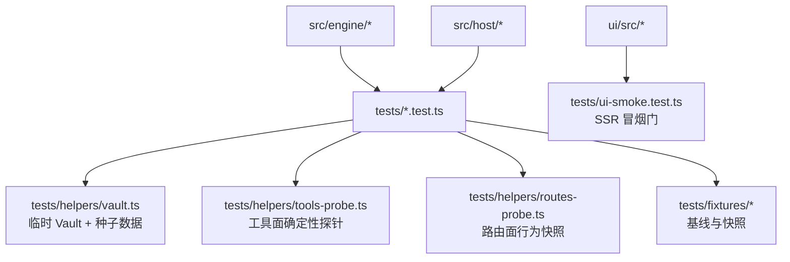
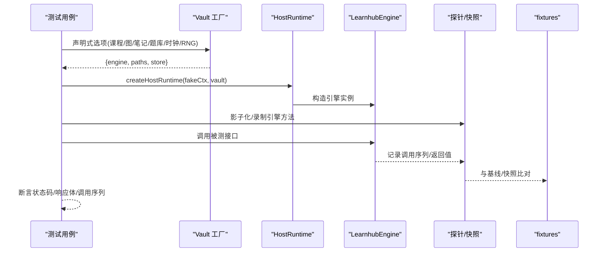
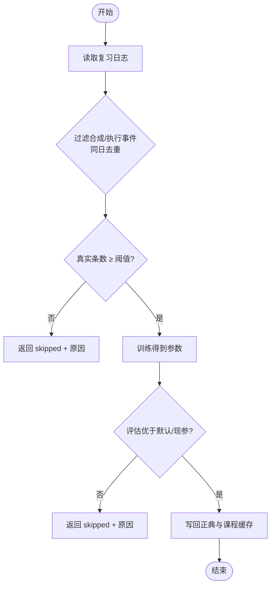
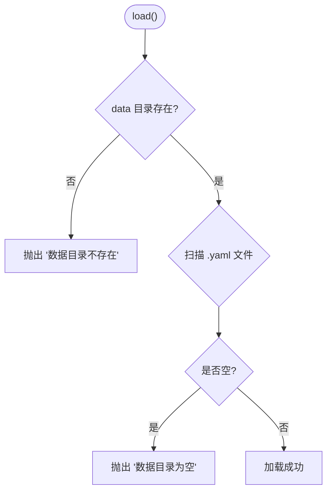
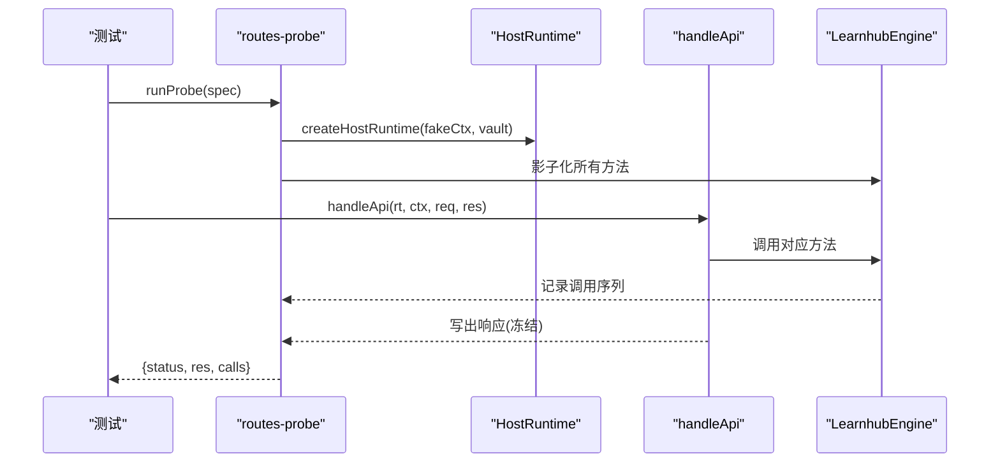
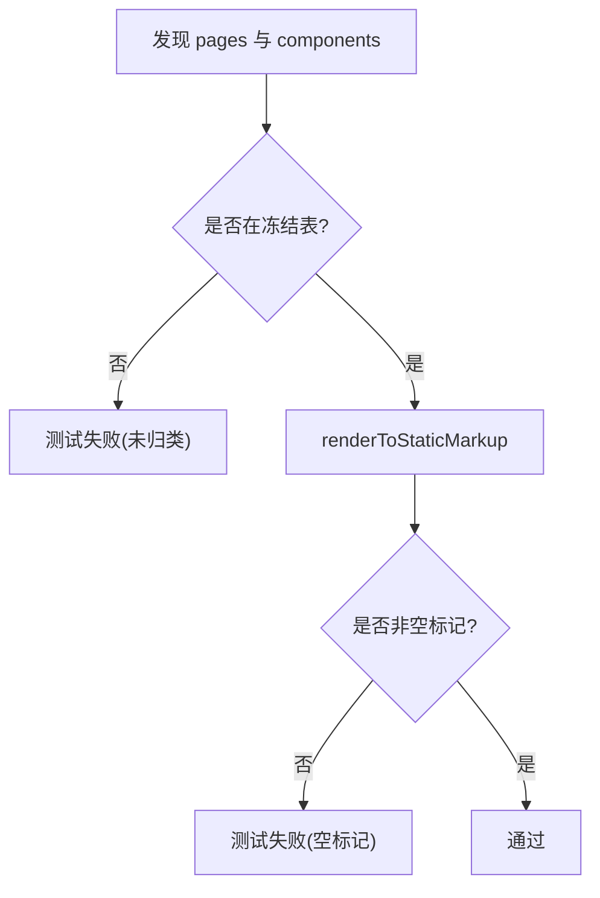
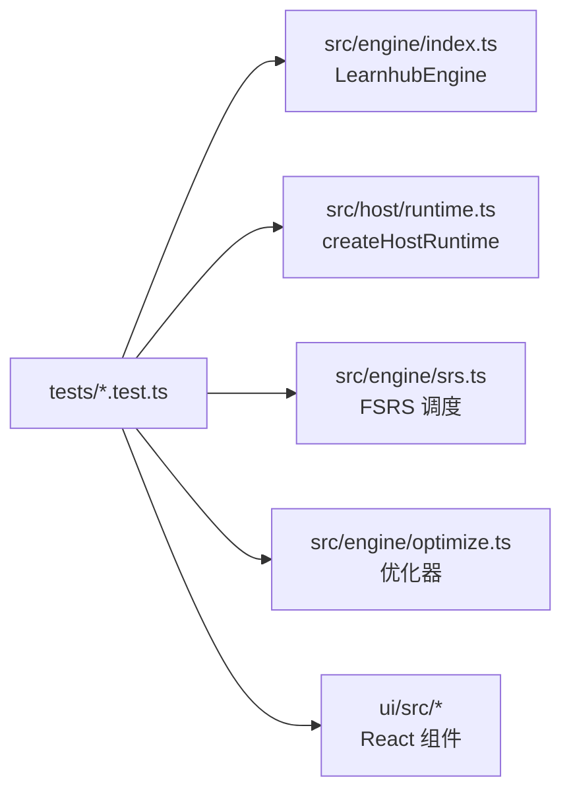

# 单元测试

<cite>
**本文引用的文件**
- [package.json](file://package.json)
- [tests/README.md](file://tests/README.md)
- [tests/helpers/vault.ts](file://tests/helpers/vault.ts)
- [tests/helpers/tools-probe.ts](file://tests/helpers/tools-probe.ts)
- [tests/helpers/routes-probe.ts](file://tests/helpers/routes-probe.ts)
- [tests/fsrs-optimize.test.ts](file://tests/fsrs-optimize.test.ts)
- [tests/graph-load.test.ts](file://tests/graph-load.test.ts)
- [tests/host-routes.test.ts](file://tests/host-routes.test.ts)
- [tests/ui-smoke.test.ts](file://tests/ui-smoke.test.ts)
- [tests/clock-rng-port.test.ts](file://tests/clock-rng-port.test.ts)
- [src/engine/srs.ts](file://src/engine/srs.ts)
- [src/engine/optimize.ts](file://src/engine/optimize.ts)
- [src/engine/types.ts](file://src/engine/types.ts)
- [src/host/runtime.ts](file://src/host/runtime.ts)
</cite>

## 目录
1. [简介](#简介)
2. [项目结构](#项目结构)
3. [核心组件](#核心组件)
4. [架构总览](#架构总览)
5. [详细组件分析](#详细组件分析)
6. [依赖关系分析](#依赖关系分析)
7. [性能与可维护性](#性能与可维护性)
8. [故障排查指南](#故障排查指南)
9. [结论](#结论)
10. [附录](#附录)

## 简介
本文件面向 Learnhub 插件的单元测试体系，系统化说明测试规范、最佳实践与工程化流程。内容覆盖：
- 测试用例的组织结构与命名约定
- 引擎核心模块、宿主层与前端组件的测试策略
- 测试辅助工具：工具探针、Vault 模拟器、测试环境设置
- 异步测试与错误测试的覆盖策略
- FSRS 算法、知识图谱操作、内容生成逻辑的具体测试示例
- 覆盖率要求与持续集成中的执行流程

## 项目结构
仓库采用 Node.js 原生测试运行器（node:test），所有测试位于 tests 目录，按功能域组织；测试辅助工具集中在 tests/helpers；固定数据与快照在 tests/fixtures。

**图表来源**
- [tests/helpers/vault.ts:1-233](file://tests/helpers/vault.ts#L1-L233)
- [tests/helpers/tools-probe.ts:1-153](file://tests/helpers/tools-probe.ts#L1-L153)
- [tests/helpers/routes-probe.ts:1-186](file://tests/helpers/routes-probe.ts#L1-L186)
- [tests/ui-smoke.test.ts:1-147](file://tests/ui-smoke.test.ts#L1-L147)

**章节来源**
- [package.json:38-48](file://package.json#L38-L48)
- [tests/README.md](file://tests/README.md)

## 核心组件
- 测试运行器与脚本
  - 使用 node:test 与 assert/strict，通过 npm test 统一执行，并发度为 3。
- Vault 测试工厂
  - withVault 提供“声明式选项 → 临时 vault → LearnhubEngine”的标准化装配，支持课程注册表、图、笔记、题库、reviewLog、schema 版本、时钟与随机源注入。
- 工具探针
  - tools-probe 将 111 个工具转为确定性调用探针，影子化引擎方法并记录调用序列，用于回归对比。
- 路由探针
  - routes-probe 把路由表与参数键清单转化为 HTTP 探针，逐字比对状态码、响应体与引擎调用序列。
- UI 冒烟测试
  - ui-smoke 使用 react-dom/server 对页面与壳组件进行 SSR 渲染断言，冻结表强制显式归类新页面与组件。

**章节来源**
- [package.json:38-48](file://package.json#L38-L48)
- [tests/helpers/vault.ts:1-233](file://tests/helpers/vault.ts#L1-L233)
- [tests/helpers/tools-probe.ts:1-153](file://tests/helpers/tools-probe.ts#L1-L153)
- [tests/helpers/routes-probe.ts:1-186](file://tests/helpers/routes-probe.ts#L1-L186)
- [tests/ui-smoke.test.ts:1-147](file://tests/ui-smoke.test.ts#L1-L147)

## 架构总览
下图展示测试框架如何围绕“引擎/宿主/UI”三层构建确定性断言：

**图表来源**
- [tests/helpers/vault.ts:87-156](file://tests/helpers/vault.ts#L87-L156)
- [tests/helpers/routes-probe.ts:120-178](file://tests/helpers/routes-probe.ts#L120-L178)
- [tests/helpers/tools-probe.ts:65-138](file://tests/helpers/tools-probe.ts#L65-L138)

## 详细组件分析

### 测试规范与最佳实践
- 用例组织
  - 每个 .test.ts 聚焦一个子系统或场景；纯函数与规则类逻辑优先放在独立测试块，便于快速定位。
  - 复杂流程通过 withVault 准备环境，避免全局污染。
- 命名约定
  - 文件名以被测模块名或场景命名（如 fsrs-optimize.test.ts）。
  - 测试描述体现输入/条件与期望结果，便于检索与理解。
- 断言风格
  - 使用 assert/strict 的 deepEqual/equal/match/rejects 等精确断言。
  - 对错误路径使用 assert.rejects 并匹配错误消息片段，确保语义稳定。
- 稳定性
  - 通过固定时钟与 RNG 端口注入实现“同一输入同一输出”。
  - 对外部副作用（文件系统、网络）通过影子化与探针隔离。

**章节来源**
- [tests/clock-rng-port.test.ts:1-66](file://tests/clock-rng-port.test.ts#L1-L66)
- [tests/graph-load.test.ts:1-31](file://tests/graph-load.test.ts#L1-L31)
- [tests/host-routes.test.ts:1-181](file://tests/host-routes.test.ts#L1-L181)

### 引擎核心模块测试
- FSRS 算法与参数优化
  - 训练序列过滤：排除 synthetic、同日重复、仅取每卡第一条，计算 delta_t 链。
  - 门禁与写回：真实复习日志不足阈值时跳过；评估优于默认/现参才写回；参数长度校验。
  - 绑定冒烟：验证真实训练器产出 21 维参数向量与时序切分指标。
- 调度内核
  - 参数解析优先级：沉淀正典 → 课程缓存 → 官方默认；保证调度器一致性。
- 类型契约
  - ReviewRec 明确 rating_source 与事件种类，优化器据此过滤合成/执行事件。

**图表来源**
- [tests/fsrs-optimize.test.ts:51-181](file://tests/fsrs-optimize.test.ts#L51-L181)
- [src/engine/optimize.ts](file://src/engine/optimize.ts)
- [src/engine/srs.ts:29-49](file://src/engine/srs.ts#L29-L49)
- [src/engine/types.ts:170-189](file://src/engine/types.ts#L170-L189)

**章节来源**
- [tests/fsrs-optimize.test.ts:1-181](file://tests/fsrs-optimize.test.ts#L1-L181)
- [src/engine/srs.ts:1-51](file://src/engine/srs.ts#L1-L51)
- [src/engine/types.ts:170-189](file://src/engine/types.ts#L170-L189)

### 知识图谱操作测试
- GraphStore.load 的错误区分
  - 目录不存在 vs 目录为空（无 .yaml 区文件）分别报因，避免误导排查。
- 测试要点
  - 使用临时目录与 nodeVaultFs 构造不同场景，断言错误消息不再合并。

**图表来源**
- [tests/graph-load.test.ts:13-30](file://tests/graph-load.test.ts#L13-L30)

**章节来源**
- [tests/graph-load.test.ts:1-31](file://tests/graph-load.test.ts#L1-L31)

### 宿主层测试
- 路由表与分发纪律
  - 对账清单：代码路由集合必须与基线一致。
  - 行为快照：每条路由的空参/全参/逐个缺参变体，逐字复现状态码、响应体与引擎调用序列。
  - 守卫收口：手写 typeof body.x 与内联 missing required field 清零，统一走 params.ts。
- 运行时与工具面
  - 工具探针：按 parameters schema 自动生成参数，影子化引擎方法，比较文本与调用序列。
  - 队列型工具：响应后 fire-and-forget 调用不入快照，只比文本。

**图表来源**
- [tests/helpers/routes-probe.ts:120-178](file://tests/helpers/routes-probe.ts#L120-L178)
- [tests/host-routes.test.ts:49-181](file://tests/host-routes.test.ts#L49-L181)
- [tests/helpers/tools-probe.ts:65-138](file://tests/helpers/tools-probe.ts#L65-L138)

**章节来源**
- [tests/host-routes.test.ts:1-181](file://tests/host-routes.test.ts#L1-L181)
- [tests/helpers/routes-probe.ts:1-186](file://tests/helpers/routes-probe.ts#L1-L186)
- [tests/helpers/tools-probe.ts:1-153](file://tests/helpers/tools-probe.ts#L1-L153)

### 前端组件测试
- SSR 冒烟门
  - 使用 react-dom/server 渲染页面与壳组件，冻结表强制显式归类新页面与组件。
  - 全局桩最小化（localStorage/window/matchMedia），不桩 document，保持 Arco 服务端形态。
  - 新页面两表都不在即失败，逼迫显式归类。

**图表来源**
- [tests/ui-smoke.test.ts:37-147](file://tests/ui-smoke.test.ts#L37-L147)

**章节来源**
- [tests/ui-smoke.test.ts:1-147](file://tests/ui-smoke.test.ts#L1-L147)

### 测试辅助工具使用方法
- Vault 模拟器
  - withVault(options, run)：声明式创建临时 vault，写入课程注册表、图、笔记、题库、reviewLog、schema 版本与日界配置，注入时钟与 RNG，返回 engine、paths、store。
  - noteText/tfQuestion/localDay/answer：便捷构造笔记、题目、日期与作答包装。
- 工具探针
  - toolInventory：获取已注册工具清单。
  - argsFor：按 parameters schema 生成合法参数（必填给值，可选缺省）。
  - runToolProbe/runToolProbes：执行工具并记录文本与调用序列。
- 路由探针
  - runProbe/runProbes：构造 fakeReq/fakeRes，影子化引擎，捕获响应前调用序列。
  - cleanupProbeVault：清理共享临时 vault。

**章节来源**
- [tests/helpers/vault.ts:1-233](file://tests/helpers/vault.ts#L1-L233)
- [tests/helpers/tools-probe.ts:1-153](file://tests/helpers/tools-probe.ts#L1-L153)
- [tests/helpers/routes-probe.ts:1-186](file://tests/helpers/routes-probe.ts#L1-L186)

### 异步测试与错误测试策略
- 异步测试
  - 基于 async/await 与 node:test 的 test 回调；使用 withVault 包裹异步流程，finally 中清理临时目录。
  - 对 LLM 路径通过 fakeCtx 使其 fail loud，避免网络依赖。
- 错误测试
  - 使用 assert.rejects 捕获异常并匹配错误消息片段，确保语义不变。
  - 针对边界情况（目录缺失、空目录、非法 JSON 体）分别断言错误信息，避免合并文案导致误判。

**章节来源**
- [tests/graph-load.test.ts:13-30](file://tests/graph-load.test.ts#L13-L30)
- [tests/host-routes.test.ts:115-129](file://tests/host-routes.test.ts#L115-L129)

### 具体测试用例示例
- FSRS 算法
  - 训练序列过滤与 delta_t 计算；阈值门禁；评估比较与写回；参数长度校验；绑定冒烟。
  - 参考路径：[tests/fsrs-optimize.test.ts:51-181](file://tests/fsrs-optimize.test.ts#L51-L181)
- 知识图谱操作
  - GraphStore.load 错误区分（目录不存在 vs 目录为空）。
  - 参考路径：[tests/graph-load.test.ts:13-30](file://tests/graph-load.test.ts#L13-L30)
- 内容生成逻辑
  - 通过 withVault 注入课程/节点/题库，调用 engine.content2.* 接口，断言返回结构与副作用。
  - 参考路径：[tests/helpers/vault.ts:87-156](file://tests/helpers/vault.ts#L87-L156)

**章节来源**
- [tests/fsrs-optimize.test.ts:1-181](file://tests/fsrs-optimize.test.ts#L1-L181)
- [tests/graph-load.test.ts:1-31](file://tests/graph-load.test.ts#L1-L31)
- [tests/helpers/vault.ts:87-156](file://tests/helpers/vault.ts#L87-L156)

## 依赖关系分析
- 测试与源码耦合点
  - 引擎：LearnhubEngine、子系统句柄、SRS 调度器、优化器。
  - 宿主：HostRuntime、路由分发、工具注册。
  - UI：react-dom/server 渲染入口。
- 外部依赖
  - ts-fsrs：FSRS 调度与参数。
  - @deepseek-ai/cordis：Context 与工具注册接口。
  - Node 内置模块：fs/promises、os、path、module。

**图表来源**
- [tests/helpers/vault.ts:14-20](file://tests/helpers/vault.ts#L14-L20)
- [tests/helpers/routes-probe.ts:24-27](file://tests/helpers/routes-probe.ts#L24-L27)
- [tests/ui-smoke.test.ts:33-35](file://tests/ui-smoke.test.ts#L33-L35)

**章节来源**
- [tests/helpers/vault.ts:1-233](file://tests/helpers/vault.ts#L1-L233)
- [tests/helpers/routes-probe.ts:1-186](file://tests/helpers/routes-probe.ts#L1-L186)
- [tests/ui-smoke.test.ts:1-147](file://tests/ui-smoke.test.ts#L1-L147)

## 性能与可维护性
- 性能
  - 并发执行：npm test 使用 --test-concurrency=3，平衡速度与资源占用。
  - 快照与探针：仅在响应写出前冻结调用序列，避免队列型工具的时序噪音。
- 可维护性
  - 冻结表机制：UI 页面与组件变更需显式归类，防止遗漏。
  - 基线/快照：路由与工具行为通过 fixtures 锁定，重构不漂移。
  - 端口注入：时钟与 RNG 注入使测试确定性强，易于调试。

[本节为通用指导，无需特定文件引用]

## 故障排查指南
- 常见失败
  - 路由行为漂移：检查 routes-probe 快照差异，确认状态码、响应体与调用序列。
  - 工具行为不一致：检查 tools-probe 文本与调用序列，注意队列型工具只比文本。
  - UI 渲染失败：检查冻结表是否包含新页面/组件，确认 SSR 能渲染出非空标记。
- 定位步骤
  - 缩小范围：先跑单测文件，再逐步扩大。
  - 查看快照 diff：对比 fixtures 中的基线与当前输出。
  - 检查端口注入：确认时钟与 RNG 是否正确注入。

**章节来源**
- [tests/host-routes.test.ts:49-181](file://tests/host-routes.test.ts#L49-L181)
- [tests/helpers/routes-probe.ts:1-186](file://tests/helpers/routes-probe.ts#L1-L186)
- [tests/helpers/tools-probe.ts:1-153](file://tests/helpers/tools-probe.ts#L1-L153)
- [tests/ui-smoke.test.ts:1-147](file://tests/ui-smoke.test.ts#L1-L147)

## 结论
本项目的单元测试体系以“确定性”为核心，通过 Vault 模拟器、工具探针、路由探针与 UI 冒烟门，构建了覆盖引擎、宿主与前端的多层回归网。结合冻结表与快照基线，确保重构与演进过程中的行为不变性。配合固定时钟与 RNG 注入，测试具备强可重复性与易调试性。建议在新功能开发中遵循本文规范，持续完善用例与快照，保障系统质量。

[本节为总结性内容，无需特定文件引用]

## 附录
- 覆盖率要求
  - 当前仓库未配置覆盖率统计工具；建议在 CI 中引入覆盖率报告（如 c8/istanbul）并设定最低阈值，重点关注核心模块（FSRS、调度、路由、工具注册）。
- 持续集成执行流程
  - 触发：提交或 PR 触发 CI。
  - 步骤：安装依赖 → 类型检查 → 运行 npm test（并发 3）→ 收集日志与快照 diff → 失败时保留临时目录以便调试。
  - 产物：测试报告、快照 diff 归档。

**章节来源**
- [package.json:38-48](file://package.json#L38-L48)