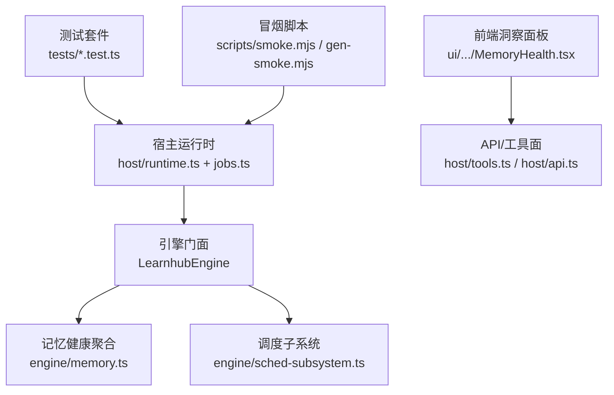
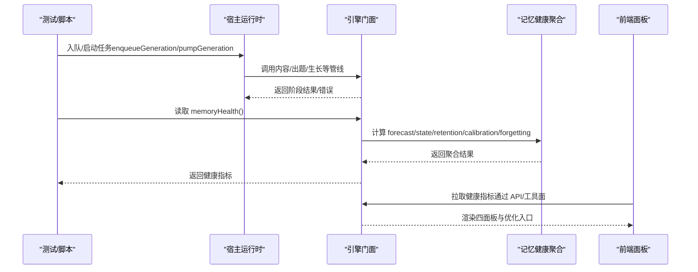
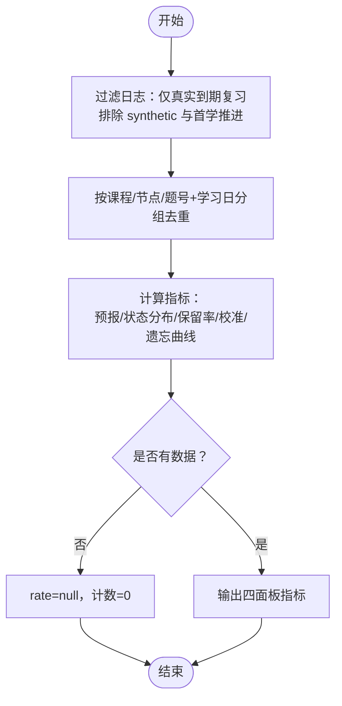
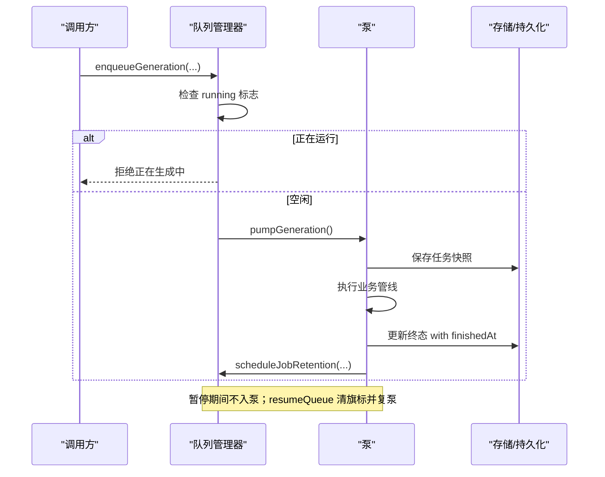
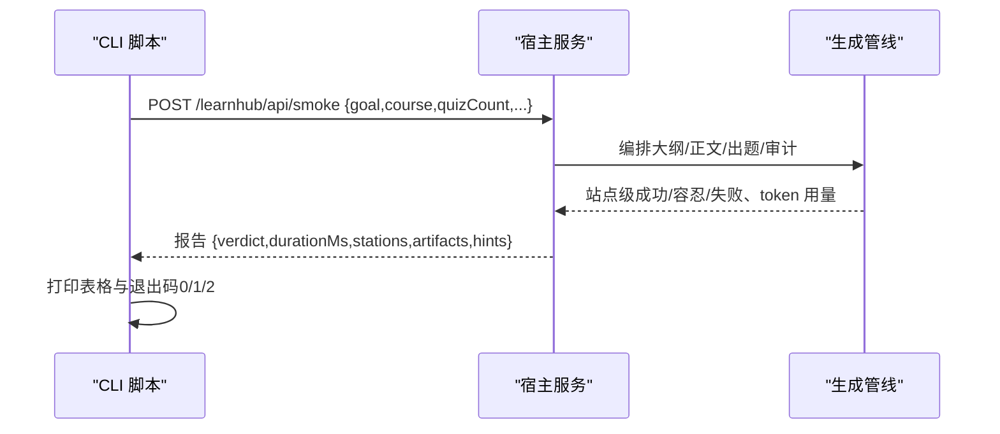
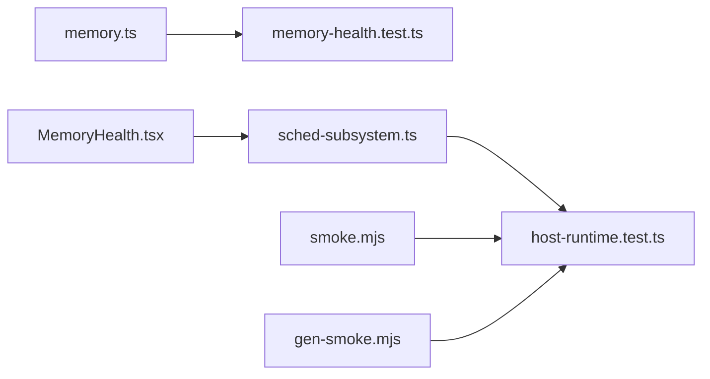

# 性能测试

<cite>
**本文引用的文件**
- [memory.ts](file://src/engine/memory.ts)
- [memory-health.test.ts](file://tests/memory-health.test.ts)
- [MemoryHealth.tsx](file://ui/src/pages/InsightPage/MemoryHealth.tsx)
- [host-runtime.test.ts](file://tests/host-runtime.test.ts)
- [health.ts](file://src/engine/health.ts)
- [sched-subsystem.ts](file://src/engine/sched-subsystem.ts)
- [smoke.mjs](file://scripts/smoke.mjs)
- [gen-smoke.mjs](file://scripts/gen-smoke.mjs)
- [package.json](file://package.json)
- [README.md](file://tests/README.md)
</cite>

## 目录
1. [引言](#引言)
2. [项目结构](#项目结构)
3. [核心组件](#核心组件)
4. [架构总览](#架构总览)
5. [详细组件分析](#详细组件分析)
6. [依赖关系分析](#依赖关系分析)
7. [性能考量](#性能考量)
8. [故障排查指南](#故障排查指南)
9. [结论](#结论)
10. [附录](#附录)

## 引言
本文件面向“学习中心”插件的性能测试与监控，目标是建立可重复、可度量、可回归的性能基线，覆盖以下维度：
- 内存使用与健康：通过记忆健康指标与资源清理验证，识别泄漏与异常增长。
- 响应时间与吞吐：以冒烟脚本与宿主队列行为为观测点，评估端到端时延与并发能力。
- 稳定性：长时间运行下的会话保持、任务恢复与资源释放。
- 压力与负载：并发用户模拟与高负载场景的边界条件。
- 基准维护：收集趋势数据并设置告警阈值。
- CI/CD 集成：将类型门、冒烟与关键单测纳入流水线，失败即阻断。

## 项目结构
仓库围绕引擎（engine）、宿主（host）、前端（ui）与测试（tests/scripts）组织。性能相关的关键位置包括：
- 引擎侧聚合口径：记忆健康统计（预报、状态分布、保留率、遗忘曲线）。
- 宿主侧运行时：任务队列泵、暂停/恢复、超时与结果等待语义。
- 前端洞察面板：可视化展示记忆健康与参数优化入口。
- 冒烟脚本：对真实 vault 读路径与生成管线进行快速验证。
- 测试套件：并发度受限的单测，保障稳定且低内存占用。

图表来源
- [memory.ts:1-119](file://src/engine/memory.ts#L1-L119)
- [host-runtime.test.ts:1-247](file://tests/host-runtime.test.ts#L1-L247)
- [MemoryHealth.tsx:1-301](file://ui/src/pages/InsightPage/MemoryHealth.tsx#L1-L301)
- [sched-subsystem.ts:402-423](file://src/engine/sched-subsystem.ts#L402-L423)
- [smoke.mjs:1-65](file://scripts/smoke.mjs#L1-L65)
- [gen-smoke.mjs:1-156](file://scripts/gen-smoke.mjs#L1-L156)

章节来源
- [package.json:38-47](file://package.json#L38-L47)
- [README.md:1-5](file://tests/README.md#L1-L5)

## 核心组件
- 记忆健康聚合：提供每日负载预报、状态直方图、真实保留率、预测校准与遗忘曲线等纯函数口径，作为性能与学习效果的观测基础。
- 宿主队列与任务管理：实现入队、执行、终态、保留期清扫、暂停/恢复、取消与超时等完整生命周期。
- 冒烟驱动：对真实 vault 读路径与生成管线进行端到端验证，输出成功率、token 消耗与产物断言。
- 前端洞察面板：可视化呈现记忆健康四面板与 FSRS 参数优化入口，支持 JOL 抽样与过信提示开关。

章节来源
- [memory.ts:1-119](file://src/engine/memory.ts#L1-L119)
- [host-runtime.test.ts:162-247](file://tests/host-runtime.test.ts#L162-L247)
- [gen-smoke.mjs:1-156](file://scripts/gen-smoke.mjs#L1-L156)
- [MemoryHealth.tsx:76-131](file://ui/src/pages/InsightPage/MemoryHealth.tsx#L76-L131)

## 架构总览
下图展示了从测试/脚本到引擎与宿主的调用链，以及前端如何消费健康指标。

图表来源
- [host-runtime.test.ts:162-247](file://tests/host-runtime.test.ts#L162-L247)
- [memory.ts:1-119](file://src/engine/memory.ts#L1-L119)
- [MemoryHealth.tsx:133-301](file://ui/src/pages/InsightPage/MemoryHealth.tsx#L133-L301)

## 详细组件分析

### 记忆健康与内存健康测试
- 目标与指标
  - 每日负载预报：逾期存量与未来 N 天逐日到期量，用于容量规划与峰值预警。
  - 状态分布：stability/difficulty/retrievability 的分桶直方图，观察整体记忆强度与难度结构。
  - 真实保留率：仅计入真实到期复习（排除合成首学），衡量模型与调度的有效性。
  - 预测校准与遗忘曲线：按 r_pred 与 elapsed_days 分箱，评估预测是否过信/欠信及随间隔的衰减。
- 内存健康测试要点
  - 空态不造假：无数据时 rate=null、计数为零，避免误判。
  - 与 reviewQueue 口径一致：到期队列 = 逾期 + 今日到期，确保跨模块一致性。
  - 过滤规则严格：仅 auto/self 评分、确有旧卡（非首学推进）、每卡每天第一条。
- 实现与验证
  - 聚合函数位于 engine/memory.ts，测试覆盖于 tests/memory-health.test.ts。
  - 前端面板 MemoryHealth.tsx 提供可视化与参数优化入口，便于持续观察。

图表来源
- [memory.ts:60-119](file://src/engine/memory.ts#L60-L119)
- [memory-health.test.ts:10-149](file://tests/memory-health.test.ts#L10-L149)

章节来源
- [memory.ts:1-119](file://src/engine/memory.ts#L1-L119)
- [memory-health.test.ts:1-149](file://tests/memory-health.test.ts#L1-L149)
- [MemoryHealth.tsx:133-301](file://ui/src/pages/InsightPage/MemoryHealth.tsx#L133-L301)

### 宿主队列与长时间运行稳定性
- 目标与指标
  - 队列泵状态机：running 重复入队拒绝；任务完成后释放泵槽；保留期后自动清扫。
  - 暂停/恢复：暂停旗标阻止泵启动，恢复时清旗标并复泵。
  - 超时与消失：等待任务超时或注册表消失应 fail loud。
  - 资源释放：终态盖 finishedAt 并进入保留期，定时器到期出册。
- 实施策略
  - 通过 host-runtime.test.ts 构造临时 vault 与影子化引擎方法，验证状态机与恢复语义。
  - 使用 until 轮询直至条件成立，保证确定性断言。
  - 保留期清扫由 sweepGenJobs 统一入口处理，避免分散逻辑。

图表来源
- [host-runtime.test.ts:162-247](file://tests/host-runtime.test.ts#L162-L247)

章节来源
- [host-runtime.test.ts:162-247](file://tests/host-runtime.test.ts#L162-L247)

### 冒烟测试与吞吐/时延观测
- 目标与指标
  - 读路径冒烟：在真实 vault 上快速验证 statusJson、推荐、图谱分析、课程树等接口可用性。
  - 生成冒烟：POST /learnhub/api/smoke 触发全管线，输出各站成功率、失败码、token 消耗与产物断言。
  - 时延与吞吐：通过报告 durationMs、jobStatus/jobMessage、stations 调用次数估算端到端时延与吞吐。
- 实施策略
  - smoke.mjs 针对只读路径做最小成本验证。
  - gen-smoke.mjs 负责驱动宿主、解析报告、打印结构化摘要，并提供常见排障指引。
  - 超时控制：node:http 自定义请求，避免 fetch 默认头超时导致长任务中断。

图表来源
- [gen-smoke.mjs:20-156](file://scripts/gen-smoke.mjs#L20-L156)
- [smoke.mjs:1-65](file://scripts/smoke.mjs#L1-L65)

章节来源
- [gen-smoke.mjs:1-156](file://scripts/gen-smoke.mjs#L1-L156)
- [smoke.mjs:1-65](file://scripts/smoke.mjs#L1-L65)

### 压力与负载测试策略
- 并发用户模拟
  - 利用宿主队列的并发闸门（全局单并发泵）与暂停/恢复机制，构造排队任务并批量 resume，观察吞吐与时延变化。
  - 通过多次 enqueueGeneration/enqueueQuizGeneration 制造负载，记录 jobStatus 转换耗时。
- 高负载场景
  - 故意挂住管线（Promise gate）制造 running 窗口，验证重复入队拒绝与取消语义。
  - 注入超时与注册表消失，验证 fail loud 行为。
- 指标采集
  - 结合冒烟报告的 stations 调用次数与 durationMs，评估不同负载下的吞吐与延迟。
  - 关注保留期清扫与内存占用（测试并发上限已限制以避免机器过载）。

章节来源
- [host-runtime.test.ts:187-247](file://tests/host-runtime.test.ts#L187-L247)
- [README.md:1-5](file://tests/README.md#L1-L5)

### 基准测试的建立与维护
- 基线来源
  - 类型门：scan-types.mjs 统计有错文件数，配合 arch-baseline 棘轮机制。
  - 装配一致性：scan-deps-face.mjs 校验 deps/used/wiring 三向一致，硬门 0。
  - 冒烟报告：每次跑通生成报告，沉淀成功率、token 消耗与产物断言。
- 趋势分析与告警
  - 将 durationMs、stations.calls、failureCodes 分布纳入趋势图，设定阈值（如 logLoss 不优于基线则跳过写回）。
  - 对队列泵状态机与保留期清扫行为进行回归断言，防止退化。

章节来源
- [sched-subsystem.ts:402-423](file://src/engine/sched-subsystem.ts#L402-L423)
- [scan-deps-face.mjs:1-282](file://scripts/scan-deps-face.mjs#L1-L282)
- [gen-smoke.mjs:103-156](file://scripts/gen-smoke.mjs#L103-L156)

### 性能优化建议与问题诊断
- 瓶颈识别
  - 队列泵阻塞：running 窗口过长会导致入队拒绝，需定位管线步骤耗时。
  - 模型调用过多：冒烟报告中 inputTokens/outputTokens 激增可能意味着提示词过大或重试过多。
  - 保留率下降：真实保留率降低或校准曲线偏离，提示 FSRS 参数需要优化。
- 优化策略
  - 调整并发与暂停策略：在高负载下先暂停再批量恢复，减少抖动。
  - 裁剪上下文包：大纲调用使用裁剪包，减少 token 与解析失败概率。
  - 参数优化门禁：仅在评估更优时写回 fsrs_params，避免劣化。
- 诊断方法
  - 使用 health.ts 的健康分与 estSpreadNote 提示标注质量风险。
  - 借助 MemoryHealth 面板观察预报峰值与遗忘曲线，指导复习节奏与题目难度分布。

章节来源
- [health.ts:1-105](file://src/engine/health.ts#L1-L105)
- [MemoryHealth.tsx:76-131](file://ui/src/pages/InsightPage/MemoryHealth.tsx#L76-L131)
- [sched-subsystem.ts:402-423](file://src/engine/sched-subsystem.ts#L402-L423)

## 依赖关系分析
- 耦合与内聚
  - 记忆健康聚合为纯函数，低耦合、高内聚，便于单元测试与复用。
  - 宿主队列与引擎门面通过影子化方法解耦，测试无需真实模型即可验证状态机。
- 外部依赖
  - 冒烟脚本依赖宿主服务暴露 /learnhub/api/smoke。
  - 前端面板依赖 API/工具面获取健康指标与触发优化。
- 循环依赖
  - 未见明显循环依赖；聚合函数与宿主/前端通过清晰接口交互。

图表来源
- [memory.ts:1-119](file://src/engine/memory.ts#L1-L119)
- [memory-health.test.ts:1-149](file://tests/memory-health.test.ts#L1-L149)
- [sched-subsystem.ts:402-423](file://src/engine/sched-subsystem.ts#L402-L423)
- [host-runtime.test.ts:162-247](file://tests/host-runtime.test.ts#L162-L247)
- [MemoryHealth.tsx:133-301](file://ui/src/pages/InsightPage/MemoryHealth.tsx#L133-L301)
- [smoke.mjs:1-65](file://scripts/smoke.mjs#L1-L65)
- [gen-smoke.mjs:1-156](file://scripts/gen-smoke.mjs#L1-L156)

章节来源
- [memory.ts:1-119](file://src/engine/memory.ts#L1-L119)
- [host-runtime.test.ts:162-247](file://tests/host-runtime.test.ts#L162-L247)
- [gen-smoke.mjs:1-156](file://scripts/gen-smoke.mjs#L1-L156)

## 性能考量
- 内存使用
  - 测试并发上限设为 3，避免 node:test 默认高并发导致内存峰值过高。
  - 冒烟脚本走真实 provider，单次成本控制在几次调用内，避免挂循环。
- 响应时间
  - 通过冒烟报告 durationMs 与 jobStatus 转换耗时评估端到端时延。
  - 队列泵单并发闸保证可预测的吞吐，避免竞争导致的抖动。
- 吞吐量
  - 通过批量 enqueue 与 resumeQueue 模拟多任务排队，观察吞吐与时延变化。
  - 保留期清扫与任务恢复确保长期运行的稳定性。

[本节为通用指导，不直接分析具体文件]

## 故障排查指南
- 常见问题
  - 未取到冒烟报告：检查编译重启、peer 依赖、端口占用与 vault 配置。
  - 队列泵不启动：确认 queuePaused 旗标与 resumeQueue 调用。
  - 任务超时：检查 waitForGenJob 超时与注册表是否存在。
- 诊断步骤
  - 查看冒烟报告中的 stations 失败码与 hints。
  - 检查队列任务消息中的失败清单与节失败原因。
  - 使用健康分与 estSpreadNote 提示定位图质量与标注问题。

章节来源
- [gen-smoke.mjs:72-101](file://scripts/gen-smoke.mjs#L72-L101)
- [host-runtime.test.ts:725-751](file://tests/host-runtime.test.ts#L725-L751)
- [health.ts:37-47](file://src/engine/health.ts#L37-L47)

## 结论
本项目已具备完善的性能测试与监控基础：
- 记忆健康聚合提供稳定的观测口径，前端可视化便于日常巡检。
- 宿主队列状态机与冒烟脚本覆盖了端到端的可用性与稳定性验证。
- 通过类型门、装配一致性与冒烟报告，建立了可回归的基准体系。
建议在 CI/CD 中固化这些检查，并结合趋势与阈值告警，持续保障性能与质量。

[本节为总结性内容，不直接分析具体文件]

## 附录
- 运行命令
  - 类型门与测试：npm test
  - 冒烟：npm run smoke
  - 只读冒烟：node scripts/smoke.mjs <vault>
- 关键配置
  - 测试并发：--test-concurrency=3
  - 冒烟超时：LEARNHUB_SMOKE_TIMEOUT_MS
  - 宿主地址：LEARNHUB_BASE

章节来源
- [package.json:38-47](file://package.json#L38-L47)
- [gen-smoke.mjs:51-58](file://scripts/gen-smoke.mjs#L51-L58)
- [README.md:1-5](file://tests/README.md#L1-L5)