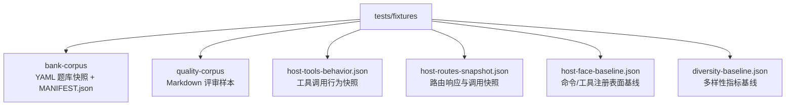
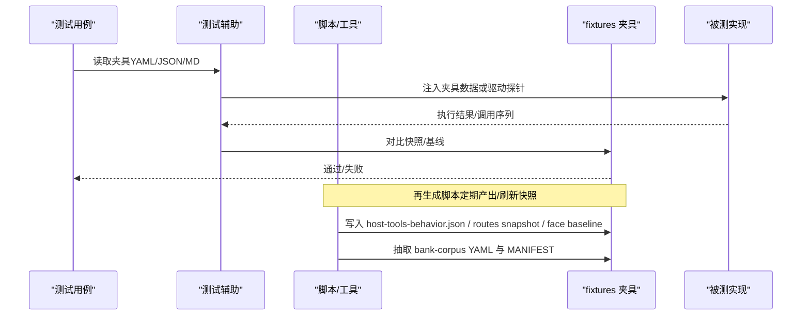
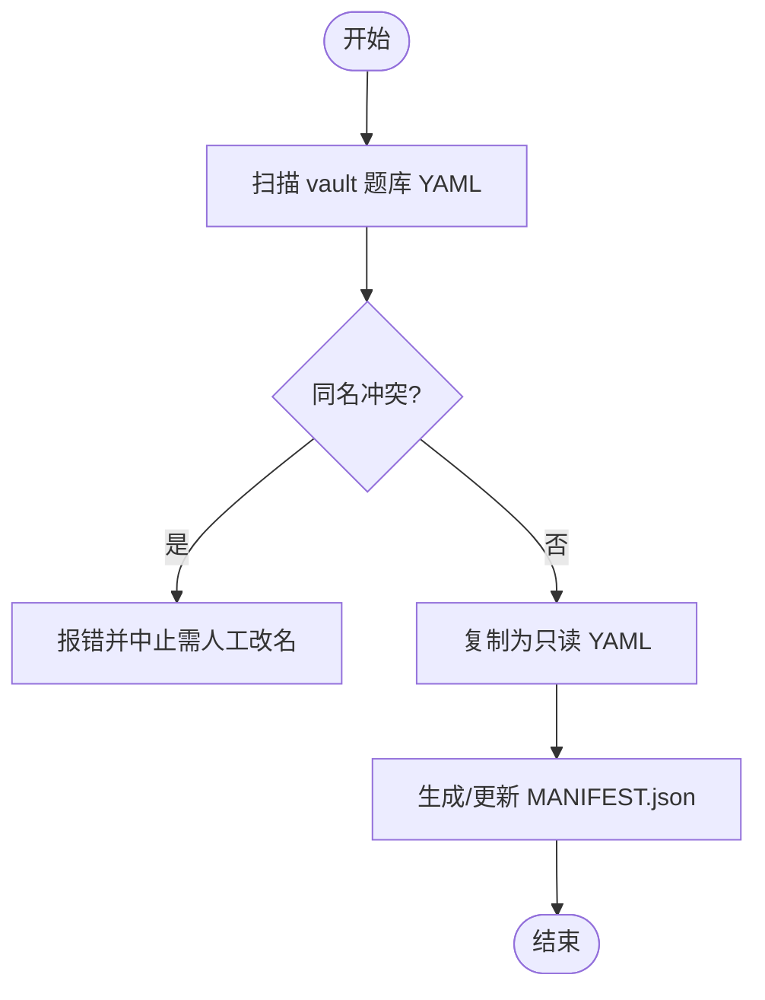
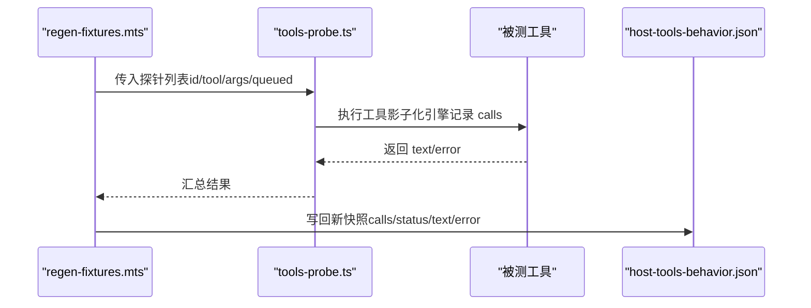
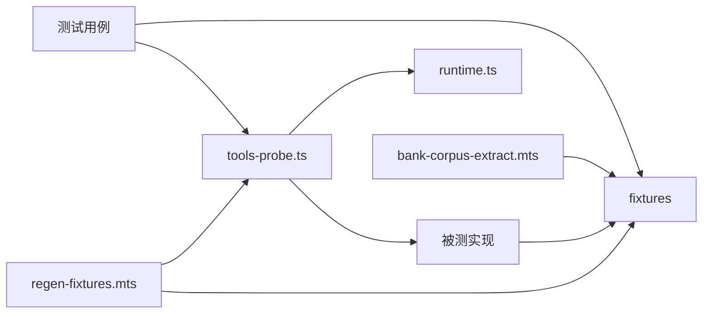

# 测试夹具

<cite>
**本文引用的文件**
- [tests/README.md](file://tests/README.md)
- [tests/fixtures/bank-corpus/MANIFEST.json](file://tests/fixtures/bank-corpus/MANIFEST.json)
- [tests/fixtures/bank-corpus/判断命题真假并用与或非组合命题.yaml](file://tests/fixtures/bank-corpus/判断命题真假并用与或非组合命题.yaml)
- [tests/fixtures/diversity-baseline.json](file://tests/fixtures/diversity-baseline.json)
- [tests/fixtures/host-tools-behavior.json](file://tests/fixtures/host-tools-behavior.json)
- [tests/fixtures/host-routes-snapshot.json](file://tests/fixtures/host-routes-snapshot.json)
- [tests/fixtures/host-face-baseline.json](file://tests/fixtures/host-face-baseline.json)
- [scripts/bank-corpus-extract.mts](file://scripts/bank-corpus-extract.mts)
- [tests/helpers/regen-fixtures.mts](file://tests/helpers/regen-fixtures.mts)
- [tests/helpers/regen-face-baseline.mts](file://tests/helpers/regen-face-baseline.mts)
- [tests/helpers/tools-probe.ts](file://tests/helpers/tools-probe.ts)
- [src/host/runtime.ts](file://src/host/runtime.ts)
- [src/host/corpus.ts](file://src/host/corpus.ts)
- [tests/question-diversity.test.ts](file://tests/question-diversity.test.ts)
- [tests/host-routes.test.ts](file://tests/host-routes.test.ts)
- [tests/tools-face.test.ts](file://tests/tools-face.test.ts)
- [tests/host-runtime.test.ts](file://tests/host-runtime.test.ts)
</cite>

## 目录
1. [简介](#简介)
2. [项目结构](#项目结构)
3. [核心组件](#核心组件)
4. [架构总览](#架构总览)
5. [详细组件分析](#详细组件分析)
6. [依赖关系分析](#依赖关系分析)
7. [性能考虑](#性能考虑)
8. [故障排查指南](#故障排查指南)
9. [结论](#结论)
10. [附录](#附录)

## 简介
本文件系统化说明仓库中“测试夹具”的作用、组织与管理策略，覆盖静态数据与动态生成的测试数据两类；解释 fixtures 目录的分类（bank-corpus、quality-corpus 等）、文件格式规范（YAML/JSON）及适用场景；给出版本控制与更新流程、夹具再生成工具的使用方法（自动化脚本与手动流程），并提供设计最佳实践、常见使用模式与调试技巧。目标是让不同技术背景的读者都能理解并正确使用这些夹具来保障回归稳定性与可复现性。

## 项目结构
fixtures 目录按用途分为：
- bank-corpus：题库语料快照（只读原始 YAML），作为多样性基线的输入源。包含 MANIFEST.json 与各节点题库 YAML。
- quality-corpus：质量评审用样例语料（Markdown），用于离线评审器与回归测试。
- host-*：宿主行为与路由的快照/基线（JSON），用于工具面与路由面的回归门。
- diversity-baseline.json：基于 bank-corpus 计算出的多样性指标基线（只读）。

**图表来源**
- [tests/fixtures/bank-corpus/MANIFEST.json:1-31](file://tests/fixtures/bank-corpus/MANIFEST.json#L1-L31)
- [tests/fixtures/diversity-baseline.json:1-156](file://tests/fixtures/diversity-baseline.json#L1-L156)
- [tests/fixtures/host-tools-behavior.json:1-200](file://tests/fixtures/host-tools-behavior.json#L1-L200)
- [tests/fixtures/host-routes-snapshot.json:1-200](file://tests/fixtures/host-routes-snapshot.json#L1-L200)
- [tests/fixtures/host-face-baseline.json:1-200](file://tests/fixtures/host-face-baseline.json#L1-L200)

**章节来源**
- [tests/fixtures/bank-corpus/MANIFEST.json:1-31](file://tests/fixtures/bank-corpus/MANIFEST.json#L1-L31)
- [tests/fixtures/diversity-baseline.json:1-156](file://tests/fixtures/diversity-baseline.json#L1-L156)

## 核心组件
- 题库语料快照（bank-corpus）
  - 由 scripts/bank-corpus-extract.mts 从 vault 存档区抽取，生成只读的 YAML 与清单 MANIFEST.json。
  - 被 tests/question-diversity.test.ts 与 diversity-baseline.json 共同消费，确保多样性指标可重放、可审计。
- 质量评审样本（quality-corpus）
  - Markdown 格式，按站点/任务分目录存放，供质量评审器抽样与回归断言。
- 宿主行为快照（host-tools-behavior.json）
  - 记录每个工具的入参、返回文本、错误信息与引擎调用序列，用于工具门面回归。
- 路由快照（host-routes-snapshot.json）
  - 记录 HTTP 路由的请求、状态码、响应体与引擎调用序列，用于路由回归。
- 注册表面基线（host-face-baseline.json）
  - 描述工具面与路由面暴露的入口集合，用于接口契约回归。
- 多样性基线（diversity-baseline.json）
  - 对 bank-corpus 聚合计算的题型分布熵、干扰项距离、自相似性等指标，作为不可变基线。

**章节来源**
- [scripts/bank-corpus-extract.mts:1-112](file://scripts/bank-corpus-extract.mts#L1-L112)
- [tests/question-diversity.test.ts:1-120](file://tests/question-diversity.test.ts#L1-L120)
- [tests/question-diversity.test.ts:236-257](file://tests/question-diversity.test.ts#L236-L257)
- [tests/fixtures/diversity-baseline.json:1-156](file://tests/fixtures/diversity-baseline.json#L1-L156)
- [tests/tools-face.test.ts:1-30](file://tests/tools-face.test.ts#L1-L30)
- [tests/host-routes.test.ts:1-40](file://tests/host-routes.test.ts#L1-L40)
- [tests/host-runtime.test.ts:1173-1235](file://tests/host-runtime.test.ts#L1173-L1235)

## 架构总览
下图展示夹具在测试与再生成管线中的位置与交互：

**图表来源**
- [tests/helpers/tools-probe.ts:1-153](file://tests/helpers/tools-probe.ts#L1-L153)
- [tests/helpers/regen-fixtures.mts:1-31](file://tests/helpers/regen-fixtures.mts#L1-L31)
- [tests/helpers/regen-face-baseline.mts:1-22](file://tests/helpers/regen-face-baseline.mts#L1-L22)
- [scripts/bank-corpus-extract.mts:1-112](file://scripts/bank-corpus-extract.mts#L1-L112)

## 详细组件分析

### 题库语料（bank-corpus）
- 作用：提供稳定的、只读的题库原始 YAML，作为多样性指标与相关测试的固定输入。
- 组织：
  - 每个节点一个 YAML 文件，字段包括 node、questions[]（含 kind/q/options/answer/explanation/difficulty/section/uses/id/fsrs/stats 等）。
  - MANIFEST.json 记录来源路径、节点名、题量与字节数，便于审计与一致性校验。
- 生成与更新：
  - 使用 scripts/bank-corpus-extract.mts 从 vault 存档区抽取，幂等且可检查（--check）。
  - 抽取后禁止手工修改 YAML；如需更新，重新运行抽取脚本。
- 消费：
  - tests/question-diversity.test.ts 以同一函数复算 diversity-baseline.json，任何算法变更必须逐值比对。

**图表来源**
- [scripts/bank-corpus-extract.mts:36-112](file://scripts/bank-corpus-extract.mts#L36-L112)

**章节来源**
- [tests/fixtures/bank-corpus/MANIFEST.json:1-31](file://tests/fixtures/bank-corpus/MANIFEST.json#L1-L31)
- [tests/fixtures/bank-corpus/判断命题真假并用与或非组合命题.yaml:1-112](file://tests/fixtures/bank-corpus/判断命题真假并用与或非组合命题.yaml#L1-L112)
- [scripts/bank-corpus-extract.mts:1-112](file://scripts/bank-corpus-extract.mts#L1-L112)
- [tests/question-diversity.test.ts:236-257](file://tests/question-diversity.test.ts#L236-L257)

### 质量评审样本（quality-corpus）
- 作用：提供真实或合成的生成产物（Markdown），用于质量评审器的抽样、评分与报告回归。
- 组织：按站点/任务分目录（如“种子起草”“教练生长”），文件名带时间戳与序号，便于追踪。
- 消费：质量评审相关测试与脚本会读取该目录进行抽样与断言。

**章节来源**
- [tests/quality-review-runner.test.ts:20-30](file://tests/quality-review-runner.test.ts#L20-L30)
- [tests/quality-review.test.ts:1-60](file://tests/quality-review.test.ts#L1-L60)

### 宿主工具行为快照（host-tools-behavior.json）
- 作用：固化每个工具的参数变体（全参/缺必填）、返回文本、错误信息与引擎调用序列，用于工具门面回归。
- 生成：tests/helpers/tools-probe.ts 构造运行时与影子引擎，逐工具探测并记录；tests/helpers/regen-fixtures.mts 负责写回 JSON。
- 消费：tools-face.test.ts 等测试将实际输出与快照逐条比对，要求零漂移。

**图表来源**
- [tests/helpers/regen-fixtures.mts:1-31](file://tests/helpers/regen-fixtures.mts#L1-L31)
- [tests/helpers/tools-probe.ts:1-153](file://tests/helpers/tools-probe.ts#L1-L153)
- [tests/fixtures/host-tools-behavior.json:1-200](file://tests/fixtures/host-tools-behavior.json#L1-L200)

**章节来源**
- [tests/tools-face.test.ts:1-30](file://tests/tools-face.test.ts#L1-L30)
- [tests/helpers/tools-probe.ts:1-153](file://tests/helpers/tools-probe.ts#L1-L153)
- [tests/helpers/regen-fixtures.mts:1-31](file://tests/helpers/regen-fixtures.mts#L1-L31)

### 路由快照（host-routes-snapshot.json）
- 作用：固化路由请求、状态码、响应体与引擎调用序列，用于路由回归。
- 生成：tests/helpers/regen-fixtures.mts 调用路由探针，写回快照。
- 消费：host-routes.test.ts 将当前路由行为与快照比对，检测 status/calls 漂移。

**章节来源**
- [tests/host-routes.test.ts:1-40](file://tests/host-routes.test.ts#L1-L40)
- [tests/helpers/regen-fixtures.mts:19-31](file://tests/helpers/regen-fixtures.mts#L19-L31)

### 注册表面基线（host-face-baseline.json）
- 作用：记录工具面与路由面暴露的入口集合（共享/仅工具/仅路由），用于接口契约回归。
- 生成：tests/helpers/regen-face-baseline.mts 扫描宿主代码与命令注册表，输出三集合。
- 消费：host-runtime.test.ts 等测试断言注册表面未发生非预期变化。

**章节来源**
- [tests/helpers/regen-face-baseline.mts:1-22](file://tests/helpers/regen-face-baseline.mts#L1-L22)
- [tests/host-runtime.test.ts:1235-1240](file://tests/host-runtime.test.ts#L1235-L1240)

### 多样性基线（diversity-baseline.json）
- 作用：对 bank-corpus 聚合计算题型分布熵、干扰项距离、自相似性等指标，作为不可变基线。
- 生成：scripts/diversity-baseline.mts（与测试调用同一函数）复算；tests/question-diversity.test.ts 强制逐值比对。
- 约束：任何算法口径变更必须人审 diff 并更新基线。

**章节来源**
- [tests/fixtures/diversity-baseline.json:1-156](file://tests/fixtures/diversity-baseline.json#L1-L156)
- [tests/question-diversity.test.ts:1-120](file://tests/question-diversity.test.ts#L1-L120)

## 依赖关系分析
- 测试用例依赖 fixtures 提供的静态数据（YAML/JSON/MD）与动态探针（tools-probe）。
- 再生成脚本依赖宿主运行时与工具/路由实现，产出新的快照/基线。
- 平台与环境：
  - runtime.ts 提供 vault、centerRel、AI provider 等配置，影响探针与快照的可重复性。
  - corpus.ts 提供语料 frontmatter 解析与换行归一，保证跨平台一致。

**图表来源**
- [tests/helpers/tools-probe.ts:1-153](file://tests/helpers/tools-probe.ts#L1-L153)
- [src/host/runtime.ts:18-41](file://src/host/runtime.ts#L18-L41)
- [src/host/corpus.ts:91-117](file://src/host/corpus.ts#L91-L117)
- [tests/helpers/regen-fixtures.mts:1-31](file://tests/helpers/regen-fixtures.mts#L1-L31)
- [scripts/bank-corpus-extract.mts:1-112](file://scripts/bank-corpus-extract.mts#L1-L112)

**章节来源**
- [src/host/runtime.ts:18-41](file://src/host/runtime.ts#L18-L41)
- [src/host/corpus.ts:91-117](file://src/host/corpus.ts#L91-L117)

## 性能考虑
- 快照体积较大时，建议增量更新与按需重跑（例如仅重跑失败的探针）。
- 抽取 bank-corpus 时使用 --check 避免不必要写盘。
- 工具探针每次创建独立临时 vault，避免跨测试污染；必要时复用共享临时目录以减少 IO。
- 多样性指标计算为纯函数，适合并行批处理；注意短中文题的 self-BLEU 平滑开销。

## 故障排查指南
- 工具行为快照不一致
  - 现象：tools-face.test.ts 报 text/calls 漂移。
  - 排查：确认 tools-probe 是否捕获到队列型工具响应后的调用（应忽略）；检查 runtime 配置（vault/centerRel）是否稳定；必要时运行 regen-fixtures.mts 更新快照并逐条人审。
- 路由快照不一致
  - 现象：host-routes.test.ts 报 status/calls 漂移。
  - 排查：检查路由实现变更；确认请求体与查询参数；运行 regen-fixtures.mts 更新并审查差异。
- 多样性基线不匹配
  - 现象：question-diversity.test.ts 报数值差异。
  - 排查：确认 bank-corpus 是否被误改；使用 scripts/diversity-baseline.mts 复算并人审 diff；确保使用同一函数。
- 语料解析异常（Windows 换行）
  - 现象：frontmatter 解析失败或空。
  - 排查：corpus.ts 已做换行归一；若仍失败，检查夹具文件编码与行尾；确保通过脚本抽取而非手工编辑。

**章节来源**
- [tests/helpers/tools-probe.ts:61-95](file://tests/helpers/tools-probe.ts#L61-L95)
- [tests/helpers/regen-fixtures.mts:1-31](file://tests/helpers/regen-fixtures.mts#L1-L31)
- [tests/question-diversity.test.ts:236-257](file://tests/question-diversity.test.ts#L236-L257)
- [src/host/corpus.ts:104-117](file://src/host/corpus.ts#L104-L117)

## 结论
本项目的测试夹具体系通过“只读静态数据 + 确定性快照 + 可复算基线”的组合，确保了工具面、路由面、内容质量与多样性指标的回归稳定性。配合自动化再生成脚本与严格的人审流程，既保证了可维护性，又避免了静默漂移。遵循本文的最佳实践与流程，可在演进过程中持续保持高置信度的测试门禁。

## 附录

### 夹具文件格式规范
- YAML（bank-corpus）
  - 用途：题库原始数据，包含题目元数据与 FSRS/统计信息。
  - 规则：只读；通过 scripts/bank-corpus-extract.mts 抽取；MANIFEST.json 记录来源与规模。
- JSON（host-* 与 diversity-baseline）
  - 用途：快照与基线，结构化强、易比对。
  - 规则：通过再生成脚本产出；测试逐条/逐项比对；禁止手工修改。
- Markdown（quality-corpus）
  - 用途：质量评审样本，保留 frontmatter 与正文。
  - 规则：按站点/任务分目录；文件名带时间戳与序号；由评审器抽样消费。

**章节来源**
- [tests/fixtures/bank-corpus/MANIFEST.json:1-31](file://tests/fixtures/bank-corpus/MANIFEST.json#L1-L31)
- [tests/fixtures/diversity-baseline.json:1-156](file://tests/fixtures/diversity-baseline.json#L1-L156)
- [tests/fixtures/host-tools-behavior.json:1-200](file://tests/fixtures/host-tools-behavior.json#L1-L200)
- [tests/fixtures/host-routes-snapshot.json:1-200](file://tests/fixtures/host-routes-snapshot.json#L1-L200)

### 版本控制与更新流程
- 原则
  - 只读夹具：YAML/JSON/MD 均不应手工修改。
  - 可复算：所有数字基线由脚本复算，测试强制比对。
  - 最小变更：仅当实现或数据源变更时才更新快照/基线。
- 流程
  - 更新 bank-corpus：运行 scripts/bank-corpus-extract.mts（可选 --check 验证一致性）。
  - 更新工具/路由快照：运行 tests/helpers/regen-fixtures.mts，逐条人审差异。
  - 更新注册表面基线：运行 tests/helpers/regen-face-baseline.mts，核对 shared/toolOnly/routeOnly。
  - 更新多样性基线：运行 scripts/diversity-baseline.mts（与测试同函数），人审 diff。

**章节来源**
- [scripts/bank-corpus-extract.mts:1-112](file://scripts/bank-corpus-extract.mts#L1-L112)
- [tests/helpers/regen-fixtures.mts:1-31](file://tests/helpers/regen-fixtures.mts#L1-L31)
- [tests/helpers/regen-face-baseline.mts:1-22](file://tests/helpers/regen-face-baseline.mts#L1-L22)

### 再生成工具使用方法
- 工具面快照
  - 命令：node tests/helpers/regen-fixtures.mts
  - 输出：tests/fixtures/host-tools-behavior.json
  - 要点：队列型工具响应后调用不入快照；text/error/calls 必须逐字复现。
- 路由快照
  - 命令：同上（同一脚本内）
  - 输出：tests/fixtures/host-routes-snapshot.json
  - 要点：status/calls/res 必须逐条比对。
- 注册表面基线
  - 命令：node tests/helpers/regen-face-baseline.mts
  - 输出：tests/fixtures/host-face-baseline.json
  - 要点：入口名 = 注册表点路径/hub 裸名，不归一。
- 题库语料抽取
  - 命令：node scripts/bank-corpus-extract.mts [--vault <path>] [--check]
  - 输出：tests/fixtures/bank-corpus/*.yaml 与 MANIFEST.json
  - 要点：幂等；同名冲突报错；--check 仅校验不写盘。

**章节来源**
- [tests/helpers/regen-fixtures.mts:1-31](file://tests/helpers/regen-fixtures.mts#L1-L31)
- [tests/helpers/regen-face-baseline.mts:1-22](file://tests/helpers/regen-face-baseline.mts#L1-L22)
- [scripts/bank-corpus-extract.mts:1-112](file://scripts/bank-corpus-extract.mts#L1-L112)

### 设计最佳实践
- 数据独立性：夹具与实现解耦，测试只依赖夹具契约。
- 可重复性：固定随机种子、时间、vault 路径与中心相对路径；探针隔离临时 vault。
- 可维护性：只读夹具 + 脚本再生成；基线变更需人审；文档化变更原因。
- 可观测性：快照包含 calls/status/res，便于定位漂移根因。
- 安全边界：队列型工具“响应后”调用不入快照，避免时序噪声。

### 常见使用模式
- 行为快照测试：工具/路由调用 → 影子引擎记录 → 与快照比对。
- 多样性回归：bank-corpus → 复算指标 → 与 diversity-baseline.json 比对。
- 质量评审：quality-corpus → 抽样 → 评分与报告回归。

### 调试技巧
- 逐步缩小范围：先确认夹具是否最新（--check），再定位实现变更。
- 查看 calls 差异：工具/路由快照中的 calls 字段可快速定位子系统调用漂移。
- 换行问题：Windows 检出可能导致 frontmatter 解析异常，优先通过脚本抽取与规范化。
- 环境隔离：确保 vault 与 centerRel 稳定，避免跨机器差异。

**章节来源**
- [tests/helpers/tools-probe.ts:61-95](file://tests/helpers/tools-probe.ts#L61-L95)
- [src/host/corpus.ts:104-117](file://src/host/corpus.ts#L104-L117)
- [tests/question-diversity.test.ts:236-257](file://tests/question-diversity.test.ts#L236-L257)