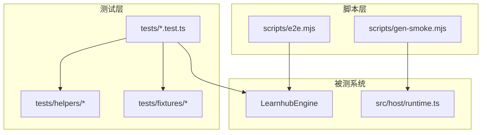
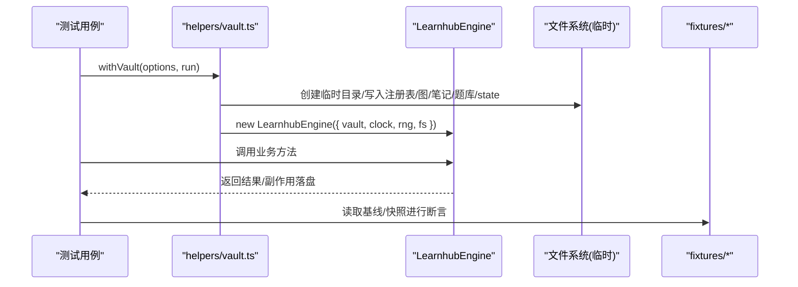
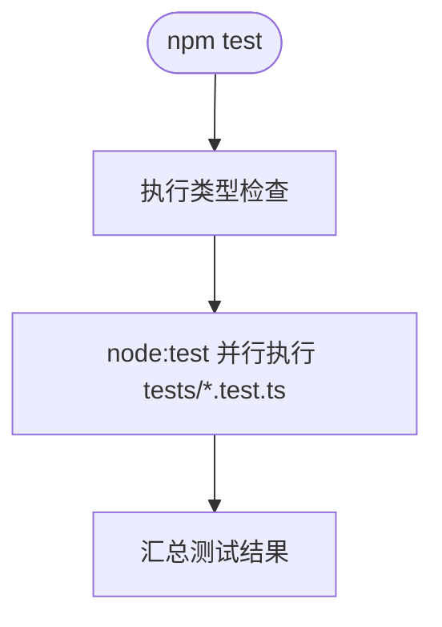
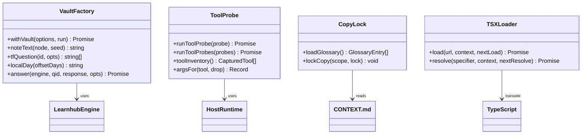
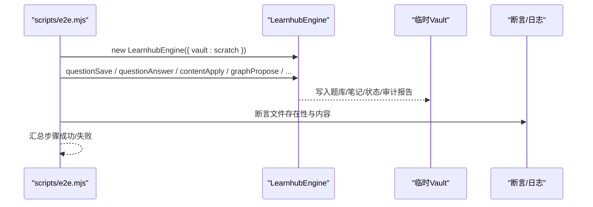
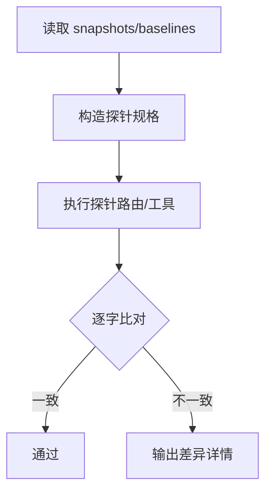
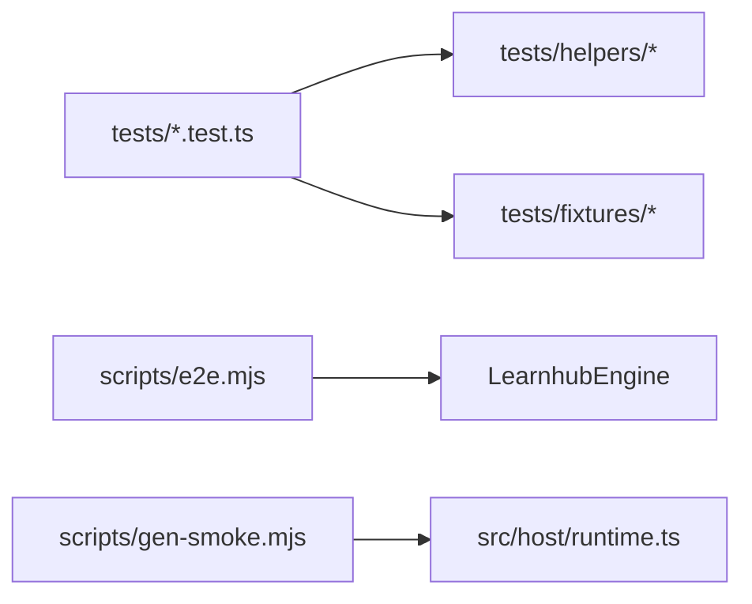

# 测试架构

<cite>
**本文引用的文件**
- [package.json](file://package.json)
- [tests/README.md](file://tests/README.md)
- [tests/helpers/vault.ts](file://tests/helpers/vault.ts)
- [tests/helpers/tools-probe.ts](file://tests/helpers/tools-probe.ts)
- [tests/helpers/copy-lock.ts](file://tests/helpers/copy-lock.ts)
- [tests/helpers/tsx-loader.mjs](file://tests/helpers/tsx-loader.mjs)
- [scripts/e2e.mjs](file://scripts/e2e.mjs)
- [scripts/gen-smoke.mjs](file://scripts/gen-smoke.mjs)
- [tests/host-routes.test.ts](file://tests/host-routes.test.ts)
- [tests/tools-face.test.ts](file://tests/tools-face.test.ts)
- [src/host/runtime.ts](file://src/host/runtime.ts)
</cite>

## 目录
1. [简介](#简介)
2. [项目结构](#项目结构)
3. [核心组件](#核心组件)
4. [架构总览](#架构总览)
5. [详细组件分析](#详细组件分析)
6. [依赖关系分析](#依赖关系分析)
7. [性能考量](#性能考量)
8. [故障排查指南](#故障排查指南)
9. [结论](#结论)
10. [附录](#附录)

## 简介
本仓库采用分层测试策略，覆盖单元测试、集成测试与端到端（E2E）测试。测试以 Node.js 原生测试运行器为核心，配合脚本驱动冒烟与 E2E 流程；通过夹具与辅助工具实现可复现的临时 Vault、确定性时钟与随机源注入、以及 UI 渲染门等能力。测试数据以 fixtures 管理，关键行为通过快照基线保障重构不漂移。

## 项目结构
- tests：测试用例与夹具、辅助工具
  - helpers：共享夹具与探针（Vault 工厂、工具面探针、语义锁、TSX 加载钩子等）
  - fixtures：基线与快照数据（路由表、工具行为、多样性基线等）
  - *.test.ts：按领域划分的单测/集成测
- scripts：测试与质量门禁脚本
  - e2e.mjs：端到端写路径测试（复制真实 vault 最小集到临时目录执行全链路）
  - gen-smoke.mjs：冒烟脚本（调用宿主 /learnhub/api/smoke 并打印报告）
- src/host/runtime.ts：运行时配置入口（vault、centerRel、provider、模型、effort、抽样率等）

图表来源
- [tests/helpers/vault.ts:87-156](file://tests/helpers/vault.ts#L87-L156)
- [scripts/e2e.mjs:123-191](file://scripts/e2e.mjs#L123-L191)
- [scripts/gen-smoke.mjs:23-49](file://scripts/gen-smoke.mjs#L23-L49)
- [src/host/runtime.ts:23-41](file://src/host/runtime.ts#L23-L41)

章节来源
- [package.json:38-48](file://package.json#L38-L48)
- [tests/README.md](file://tests/README.md)

## 核心组件
- 测试运行器与执行命令
  - 使用 node:test 并行执行 tests/*.test.ts，并发度为 3
  - 类型检查作为前置步骤，确保类型门通过后再跑测试
- 夹具与辅助工具
  - withVault：声明式构造临时 Vault + LearnhubEngine，支持注册表、图、笔记、题库、状态、时钟与随机源注入
  - tools-probe：将 111+ 工具转为确定性探针，记录文本输出与引擎调用序列，用于回归快照比对
  - copy-lock：基于 CONTEXT.md 的术语词表进行“正断言 canonical + 反断言 Avoid”的文案语义锁
  - tsx-loader.mjs：在 Node 环境下对 ui/src 下的 .tsx 做内存转译，支撑 UI 冒烟渲染
- 端到端与冒烟
  - e2e.mjs：从真实 vault 动态探测种子课程，复制到临时目录，执行题库保存、作答、审计、doctor、面板扩展接口等全链路
  - gen-smoke.mjs：POST 到宿主 /learnhub/api/smoke，解析并打印站点成功率、token 消耗、产物断言等

章节来源
- [package.json:38-48](file://package.json#L38-L48)
- [tests/helpers/vault.ts:87-156](file://tests/helpers/vault.ts#L87-L156)
- [tests/helpers/tools-probe.ts:122-144](file://tests/helpers/tools-probe.ts#L122-L144)
- [tests/helpers/copy-lock.ts:99-124](file://tests/helpers/copy-lock.ts#L99-L124)
- [tests/helpers/tsx-loader.mjs:26-38](file://tests/helpers/tsx-loader.mjs#L26-L38)
- [scripts/e2e.mjs:123-191](file://scripts/e2e.mjs#L123-L191)
- [scripts/gen-smoke.mjs:23-49](file://scripts/gen-smoke.mjs#L23-L49)

## 架构总览
测试体系围绕“可复现环境 + 行为快照 + 端到端验证”构建：
- 单元测试：针对纯函数或子系统边界，使用 withVault 快速构造隔离环境，固定时钟与 RNG 保证确定性
- 集成测试：校验路由表、工具面、参数守卫、状态码分布等契约不变量，依赖 fixtures 中的基线与快照
- 端到端：在临时 vault 上执行真实写路径，验证持久化结果与跨模块协作

图表来源
- [tests/helpers/vault.ts:87-156](file://tests/helpers/vault.ts#L87-L156)
- [tests/host-routes.test.ts:49-83](file://tests/host-routes.test.ts#L49-L83)

## 详细组件分析

### 测试运行器与执行流程
- 执行入口：npm test 先执行 typecheck，再以 node --experimental-transform-types 启动 node:test，并发度 3
- 适用场景：所有 tests/*.test.ts 统一由该命令驱动，便于 CI 与本地开发一致

章节来源
- [package.json:38-48](file://package.json#L38-L48)

### 夹具与辅助工具
- withVault（Vault 工厂）
  - 职责：根据 options 生成临时 Vault，写入课程注册表、图、笔记、题库、state 等，构造 LearnhubEngine 并暴露 engine/store/paths
  - 关键点：默认单课程/单区域/单节点；schema 版本戳在构造前落盘；clock/rng 注入保证确定性；files 逃生口支持任意落盘
  - 复杂度：文件写入 O(n)，n 为 notes/banks/files 条目数；内存占用与 Vault 规模线性相关
- tools-probe（工具面探针）
  - 职责：为每个工具生成参数变体，执行 execute 并捕获文本与引擎调用序列，用于与 host-tools-behavior.json 逐字比对
  - 关键点：队列型工具只比文本；时间戳与 vault 路径被屏蔽；影子引擎拦截 hub 与子系统方法
- copy-lock（文案语义锁）
  - 职责：从 CONTEXT.md 解析术语词表，对 UI/文案作用域进行 canonical 正断言与 Avoid 反断言
  - 关键点：括号感知切分、长 canonical 遮蔽短词、避免误咬；allow 列表豁免特定上下文
- tsx-loader.mjs（UI 渲染门）
  - 职责：在 Node 环境下对 ui/src 下 .tsx 做内存转译，补齐相对导入后缀，使 node:test 可直接渲染页面组件
  - 关键点：仅拦截 ui/src 下的 .tsx；CSS 空模块替代；resolve 钩子重试 .tsx/.ts/index

图表来源
- [tests/helpers/vault.ts:87-156](file://tests/helpers/vault.ts#L87-L156)
- [tests/helpers/tools-probe.ts:65-95](file://tests/helpers/tools-probe.ts#L65-L95)
- [tests/helpers/copy-lock.ts:65-83](file://tests/helpers/copy-lock.ts#L65-L83)
- [tests/helpers/tsx-loader.mjs:26-38](file://tests/helpers/tsx-loader.mjs#L26-L38)

章节来源
- [tests/helpers/vault.ts:87-156](file://tests/helpers/vault.ts#L87-L156)
- [tests/helpers/tools-probe.ts:122-144](file://tests/helpers/tools-probe.ts#L122-L144)
- [tests/helpers/copy-lock.ts:99-124](file://tests/helpers/copy-lock.ts#L99-L124)
- [tests/helpers/tsx-loader.mjs:26-38](file://tests/helpers/tsx-loader.mjs#L26-L38)

### 端到端与冒烟
- e2e.mjs（端到端写路径）
  - 流程：从真实 vault 动态探测种子课程 → 复制最小集到临时目录 → 重置笔记 frontmatter → 依次执行 questionSave、questionAnswer、rebuild、doctor、contentApply、graphPropose/Apply、courseDelete 等 → 断言持久化结果
  - 关键点：学习日口径来自引擎；XP 预算对账；交互件契约 v2；富内容块门禁；提示词迁移；图谱健康分与建议
- gen-smoke.mjs（冒烟）
  - 流程：POST 到宿主 /learnhub/api/smoke，等待报告 → 打印各站成功率、失败码分布、token 消耗、产物断言 → 退出码反映整体判定
  - 关键点：超时控制、错误指引、语料目录绝对路径传递

图表来源
- [scripts/e2e.mjs:123-191](file://scripts/e2e.mjs#L123-L191)
- [scripts/e2e.mjs:247-312](file://scripts/e2e.mjs#L247-L312)
- [scripts/e2e.mjs:357-415](file://scripts/e2e.mjs#L357-L415)
- [scripts/e2e.mjs:416-439](file://scripts/e2e.mjs#L416-L439)
- [scripts/e2e.mjs:440-502](file://scripts/e2e.mjs#L440-L502)
- [scripts/e2e.mjs:503-613](file://scripts/e2e.mjs#L503-L613)
- [scripts/e2e.mjs:614-687](file://scripts/e2e.mjs#L614-L687)

章节来源
- [scripts/e2e.mjs:123-191](file://scripts/e2e.mjs#L123-L191)
- [scripts/gen-smoke.mjs:23-49](file://scripts/gen-smoke.mjs#L23-L49)
- [scripts/gen-smoke.mjs:103-156](file://scripts/gen-smoke.mjs#L103-L156)

### 路由与工具面回归测试
- 路由表回归（host-routes.test.ts）
  - 对账清单：代码中的路由集合必须与 baseline.json 一致
  - 行为快照：每条路由 × 多种参数组合，逐字比对 status/res/calls
  - 分发纪律：未命中回落 404、方法不匹配、前缀路由命中规则
  - 守卫收口：手写 typeof body.x 与内联 missing required field 清零，统一走 params.ts
- 工具面回归（tools-face.test.ts）
  - 261 条探针：每个工具全参一次 + 逐个缺必填一次，比对 text/error/calls
  - 队列型工具只比文本（fire-and-forget 时序噪音不入快照）

图表来源
- [tests/host-routes.test.ts:49-83](file://tests/host-routes.test.ts#L49-L83)
- [tests/tools-face.test.ts:21-35](file://tests/tools-face.test.ts#L21-L35)

章节来源
- [tests/host-routes.test.ts:49-83](file://tests/host-routes.test.ts#L49-L83)
- [tests/tools-face.test.ts:21-35](file://tests/tools-face.test.ts#L21-L35)

### 测试数据管理与环境隔离
- 固定数据
  - fixtures：路由基线、工具行为快照、多样性基线等，用于回归对比
  - 语义锁：CONTEXT.md 的词表是权威来源，避免文案漂移
- 环境隔离
  - withVault：每次测试 mkdtemp 创建独立目录，finally 中递归删除
  - tools-probe：共享临时 vault 并在 after 清理
  - e2e：从真实 vault 复制最小集到临时目录，绝不触碰真实数据

章节来源
- [tests/helpers/vault.ts:87-156](file://tests/helpers/vault.ts#L87-L156)
- [tests/helpers/tools-probe.ts:37-51](file://tests/helpers/tools-probe.ts#L37-L51)
- [scripts/e2e.mjs:18-23](file://scripts/e2e.mjs#L18-L23)
- [tests/helpers/copy-lock.ts:65-83](file://tests/helpers/copy-lock.ts#L65-L83)

### 依赖注入与模拟框架
- 依赖注入
  - 时钟与随机源：withVault 支持注入 systemClock/mathRng 或自定义实现，保证确定性
  - 文件系统：nodeVaultFs 抽象，便于替换为内存或临时实现
  - 运行时配置：runtime.ts 提供 provider/model/fastEffort/deepEffort/quizAuditRate 等开关
- 模拟与探针
  - tools-probe：影子引擎拦截 hub 与子系统方法，记录调用序列
  - routes-probe：对路由进行参数变体探测，比对响应与调用序列
  - tsx-loader.mjs：对 .tsx 内存转译，避免引入额外构建步骤

章节来源
- [tests/helpers/vault.ts:134-140](file://tests/helpers/vault.ts#L134-L140)
- [tests/helpers/tools-probe.ts:65-95](file://tests/helpers/tools-probe.ts#L65-L95)
- [src/host/runtime.ts:23-41](file://src/host/runtime.ts#L23-L41)
- [tests/helpers/tsx-loader.mjs:26-38](file://tests/helpers/tsx-loader.mjs#L26-L38)

### 测试套件组织模式与最佳实践
- 命名规范
  - 测试文件以功能域命名（如 host-routes.test.ts、tools-face.test.ts），与源码模块对应
  - 夹具与辅助工具集中在 tests/helpers，数据集中在 tests/fixtures
- 设计原则
  - 可复现：固定时钟/RNG、临时 Vault、屏蔽时间与路径
  - 契约优先：路由/工具行为快照、状态码分布、参数守卫集中化
  - 渐进验证：单元→集成→冒烟→E2E，层层递进
- 最佳实践
  - 使用 withVault 快速构造最小可用环境
  - 用 fixtures 锁定关键行为，避免重构漂移
  - 文案变更通过语义锁约束，避免 UI 文案漂移
  - E2E 仅在必要时运行，优先使用快照与单元/集成测试

章节来源
- [tests/host-routes.test.ts:49-83](file://tests/host-routes.test.ts#L49-L83)
- [tests/tools-face.test.ts:21-35](file://tests/tools-face.test.ts#L21-L35)
- [tests/helpers/vault.ts:87-156](file://tests/helpers/vault.ts#L87-L156)
- [tests/helpers/copy-lock.ts:99-124](file://tests/helpers/copy-lock.ts#L99-L124)

## 依赖关系分析
- 测试与运行时
  - tests 依赖 src/host/runtime.ts 提供的运行时配置
  - e2e 直接实例化 LearnhubEngine 操作临时 vault
  - 冒烟脚本通过 HTTP 调用宿主服务
- 测试内部依赖
  - helpers 被多个测试复用（vault、tools-probe、copy-lock、tsx-loader）
  - fixtures 被路由/工具回归测试引用

图表来源
- [tests/host-routes.test.ts:49-83](file://tests/host-routes.test.ts#L49-L83)
- [scripts/e2e.mjs:123-191](file://scripts/e2e.mjs#L123-L191)
- [scripts/gen-smoke.mjs:23-49](file://scripts/gen-smoke.mjs#L23-L49)
- [src/host/runtime.ts:23-41](file://src/host/runtime.ts#L23-L41)

章节来源
- [tests/host-routes.test.ts:49-83](file://tests/host-routes.test.ts#L49-L83)
- [scripts/e2e.mjs:123-191](file://scripts/e2e.mjs#L123-L191)
- [scripts/gen-smoke.mjs:23-49](file://scripts/gen-smoke.mjs#L23-L49)
- [src/host/runtime.ts:23-41](file://src/host/runtime.ts#L23-L41)

## 性能考量
- 并发执行：node:test 并发度 3，平衡速度与资源占用
- 临时文件：withVault 与 e2e 均使用 mkdtemp，避免磁盘污染
- 快照比对：逐字比对提升稳定性，但需维护快照数量与大小
- UI 渲染：tsx-loader.mjs 内存转译，避免额外构建开销

[本节为通用指导，无需具体文件引用]

## 故障排查指南
- 冒烟失败
  - 常见原因：宿主未启动、端口占用、peer 包缺失、vault 路径不正确
  - 处理：参考 gen-smoke.mjs 的错误指引，逐项排查
- 路由/工具回归失败
  - 现象：status/res/calls 与快照不一致
  - 处理：定位差异项，确认是否有意变更；必要时更新快照
- 文案漂移
  - 现象：语义锁报错
  - 处理：核对 CONTEXT.md 词表与作用域，调整 allow 或修正文案
- 环境干扰
  - 现象：测试间相互影响
  - 处理：确认 withVault 清理逻辑、tools-probe 清理钩子是否执行

章节来源
- [scripts/gen-smoke.mjs:72-101](file://scripts/gen-smoke.mjs#L72-L101)
- [tests/host-routes.test.ts:49-83](file://tests/host-routes.test.ts#L49-L83)
- [tests/tools-face.test.ts:21-35](file://tests/tools-face.test.ts#L21-L35)
- [tests/helpers/copy-lock.ts:99-124](file://tests/helpers/copy-lock.ts#L99-L124)
- [tests/helpers/tools-probe.ts:37-51](file://tests/helpers/tools-probe.ts#L37-L51)

## 结论
本项目的测试架构以“可复现环境 + 行为快照 + 端到端验证”为核心，结合夹具与辅助工具，实现了高稳定性的回归保障与清晰的演进路径。通过分层测试与严格的数据/环境隔离，能够在保持快速反馈的同时，覆盖从单元到 E2E 的关键路径。建议持续维护快照与语义锁，遵循现有组织模式与最佳实践，确保长期可维护性。

## 附录
- 运行命令
  - npm test：类型检查 + 并行执行测试
  - npm run smoke：冒烟（调用宿主 /learnhub/api/smoke）
  - scripts/e2e.mjs <vault>：端到端写路径测试
- 关键配置
  - runtime.ts：vault、centerRel、provider、model、fastEffort、deepEffort、quizAuditRate 等
  - package.json：scripts 定义测试入口与并发度

章节来源
- [package.json:38-48](file://package.json#L38-L48)
- [src/host/runtime.ts:23-41](file://src/host/runtime.ts#L23-L41)