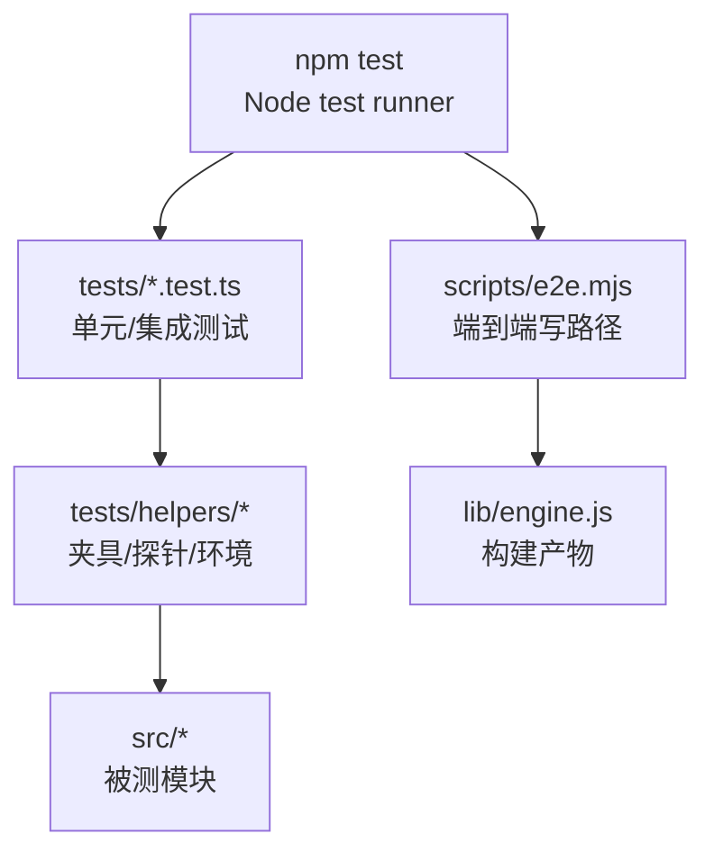
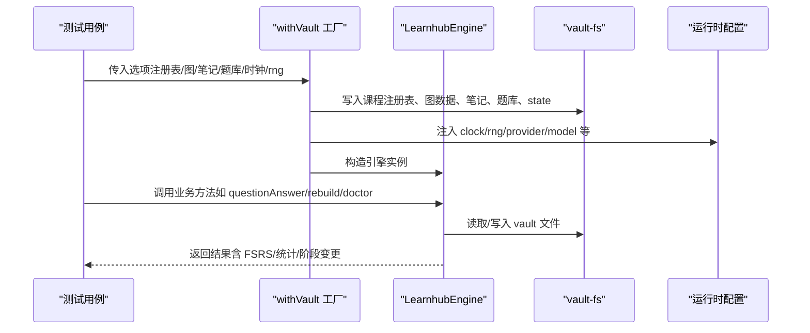
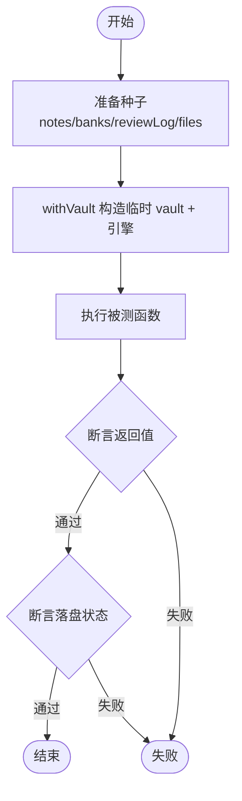
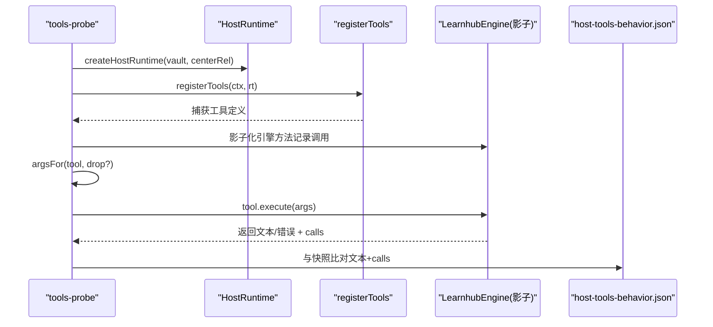
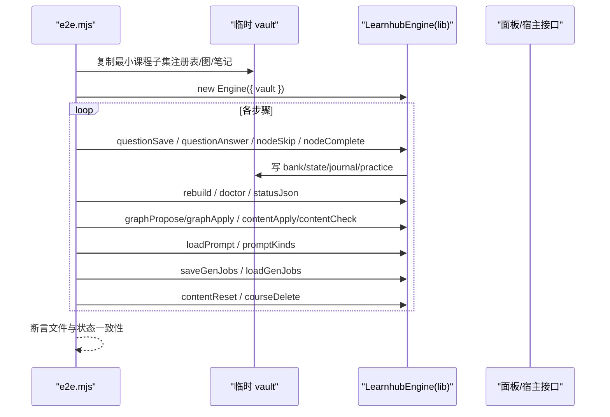
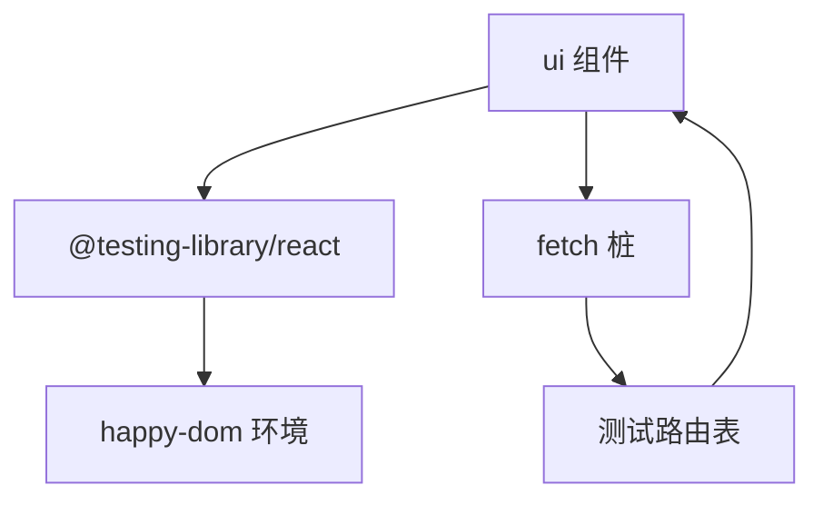
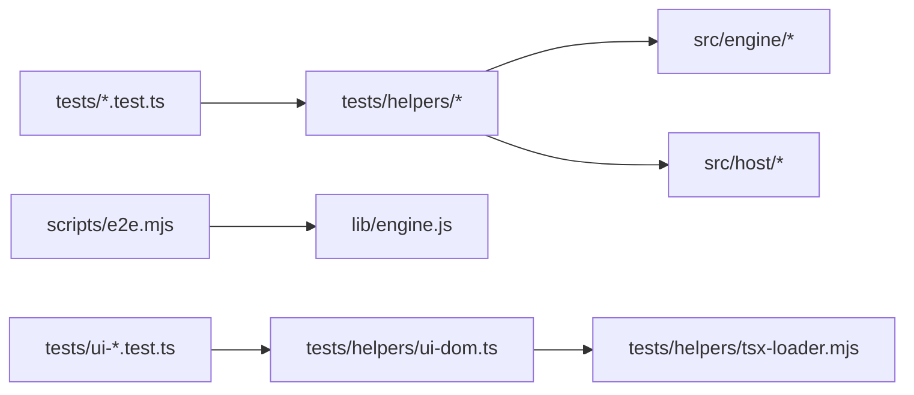

# 测试策略

<cite>
**本文引用的文件**
- [package.json](file://package.json)
- [tests/README.md](file://tests/README.md)
- [scripts/e2e.mjs](file://scripts/e2e.mjs)
- [tests/helpers/vault.ts](file://tests/helpers/vault.ts)
- [tests/helpers/tools-probe.ts](file://tests/helpers/tools-probe.ts)
- [tests/helpers/ui-dom.ts](file://tests/helpers/ui-dom.ts)
- [tests/helpers/tsx-loader.mjs](file://tests/helpers/tsx-loader.mjs)
- [src/host/runtime.ts](file://src/host/runtime.ts)
- [tests/memory-health.test.ts](file://tests/memory-health.test.ts)
</cite>

## 目录
1. [简介](#简介)
2. [项目结构](#项目结构)
3. [核心组件](#核心组件)
4. [架构总览](#架构总览)
5. [详细组件分析](#详细组件分析)
6. [依赖关系分析](#依赖关系分析)
7. [性能与压力测试](#性能与压力测试)
8. [故障排查指南](#故障排查指南)
9. [结论](#结论)
10. [附录：编写指南与最佳实践](#附录编写指南与最佳实践)

## 简介
本测试策略文档面向 Learnhub 插件工程，系统化阐述测试分层（单元测试、集成测试、端到端测试）、测试辅助工具与夹具、模拟与存根使用场景、覆盖率与持续集成流程、性能与压力测试方法、调试技巧与常见问题，以及测试用例组织方式。目标是让不同技术背景的读者都能理解并高效参与质量保障。

## 项目结构
- 测试入口与运行命令由包脚本统一编排，采用 Node.js 内置 test runner，并发执行 tests 下的所有 .test.ts。
- 测试代码集中在 tests 目录，按功能域划分；测试辅助工具集中在 tests/helpers；测试数据与基线快照在 tests/fixtures。
- 端到端测试通过独立脚本 scripts/e2e.mjs 驱动，基于真实构建产物与最小可运行 vault 副本进行全链路验证。

图表来源
- [package.json:38-48](file://package.json#L38-L48)
- [scripts/e2e.mjs:1-20](file://scripts/e2e.mjs#L1-L20)

章节来源
- [package.json:38-48](file://package.json#L38-L48)

## 核心组件
- 测试运行器与并发：通过 npm 脚本启用 Node 的 --test 与 --test-concurrency=3，并行执行全部测试，缩短反馈时间。
- 端到端写路径测试：scripts/e2e.mjs 将学习中心的最小必要子集复制到临时目录，构造一个隔离的 vault，依次执行题库保存、作答、跳过/完成、审计、doctor、面板扩展接口等关键路径，断言文件系统与状态一致性。
- 共享 Vault 工厂：tests/helpers/vault.ts 提供 withVault 工厂，声明式生成临时 vault 与 LearnhubEngine，支持注入时钟、随机源、注册表、图数据、笔记种子、题库种子、review log 等，确保测试可重复与可断言。
- 工具面探针：tests/helpers/tools-probe.ts 将 111 个工具转换为确定性调用探针，记录引擎调用序列与返回哨兵，配合 fixtures 中的 host-tools-behavior.json 做回归比对。
- UI DOM 测试环境：tests/helpers/ui-dom.ts 用 happy-dom 模拟浏览器环境，结合 @testing-library/react 渲染页面组件，拦截 fetch 到测试路由表，保证 UI 交互测试稳定可控。
- TSX 加载钩子：tests/helpers/tsx-loader.mjs 为 ui/src 下的 .tsx 提供内存转译，避免引入额外构建步骤，使 node:test 可直接渲染 React 组件。

章节来源
- [package.json:38-48](file://package.json#L38-L48)
- [scripts/e2e.mjs:1-20](file://scripts/e2e.mjs#L1-L20)
- [tests/helpers/vault.ts:1-233](file://tests/helpers/vault.ts#L1-L233)
- [tests/helpers/tools-probe.ts:1-153](file://tests/helpers/tools-probe.ts#L1-L153)
- [tests/helpers/ui-dom.ts:1-129](file://tests/helpers/ui-dom.ts#L1-L129)
- [tests/helpers/tsx-loader.mjs:1-66](file://tests/helpers/tsx-loader.mjs#L1-L66)

## 架构总览
测试体系围绕“隔离、可重复、可观测”的原则设计：
- 隔离：每个测试通过临时 vault、固定时钟与随机源、mock 网络与宿主能力，避免外部干扰。
- 可重复：通过 withVault 的声明式种子、工具探针的快照比对、UI 路由桩，确保每次运行结果一致。
- 可观测：工具探针记录引擎调用序列，E2E 脚本同步 stderr 打点，便于定位失败步骤。

图表来源
- [tests/helpers/vault.ts:87-156](file://tests/helpers/vault.ts#L87-L156)
- [src/host/runtime.ts:23-41](file://src/host/runtime.ts#L23-L41)

## 详细组件分析

### 单元测试：以 withVault 为核心的领域逻辑验证
- 目标：验证引擎子系统（调度、质量、图谱、内容管线等）在受控输入下的行为。
- 关键点：
  - 使用 withVault 创建临时 vault，注入 systemClock/mathRng 或自定义时钟/随机源，保证同一输入产生确定输出。
  - 通过 notes/banks 种子快速构造典型场景（如复习到期、今日到期、远期到期），覆盖边界条件。
  - 断言不仅包含返回值，还检查 vault 落盘（frontmatter、JSONL、状态文件）以确保持久化正确性。

图表来源
- [tests/helpers/vault.ts:87-156](file://tests/helpers/vault.ts#L87-L156)

章节来源
- [tests/memory-health.test.ts:75-98](file://tests/memory-health.test.ts#L75-L98)
- [tests/helpers/vault.ts:1-233](file://tests/helpers/vault.ts#L1-L233)

### 集成测试：工具面回归与宿主装配
- 目标：确保 111 个工具的参数 schema、执行路径与引擎调用序列保持稳定。
- 关键点：
  - tools-probe 将工具转为确定性探针，按 parameters 自动生成参数变体（必填缺省），捕获文本与引擎调用序列。
  - 与 fixtures/host-tools-behavior.json 快照比对，任何实现切面改动必须复现旧行为。
  - 队列型工具仅比对文本，忽略响应后调用序列，避免时序噪声。

图表来源
- [tests/helpers/tools-probe.ts:1-153](file://tests/helpers/tools-probe.ts#L1-L153)

章节来源
- [tests/helpers/tools-probe.ts:1-153](file://tests/helpers/tools-probe.ts#L1-L153)

### 端到端测试：真实 bundle 的全链路写路径
- 目标：在不触碰真实 vault 的前提下，验证题库保存、作答、跳过/完成、审计、doctor、面板扩展接口、提示词迁移、富内容块门禁、图谱健康分与建议、生成任务注册表等关键路径。
- 关键点：
  - 动态探测启用课程，复制最小子集到临时目录，重置笔记 frontmatter 为未学状态，确保首次学习语义。
  - 逐步断言 FSRS 推进、练习证据落盘、XP 预算对账、图谱 edit propose→apply 联动、多题型判卷、交互件契约 v2、风格变体提示词迁移、模型输出围栏容错、节形状门禁、图谱健康分与建议、enc 反哺 hints、question_get 答案不泄漏、生成任务持久化、contentReset/courseDelete 等。
  - 插件加载冒烟：加载构建产物并用 mock ctx apply，校验工具注册期 schema 与名称。

图表来源
- [scripts/e2e.mjs:1-695](file://scripts/e2e.mjs#L1-L695)

章节来源
- [scripts/e2e.mjs:1-695](file://scripts/e2e.mjs#L1-L695)

### UI 测试：DOM 环境与路由桩
- 目标：在 node:test 中渲染 React 组件，验证页面交互与 API 调用，不启动真实浏览器。
- 关键点：
  - 使用 happy-dom 注入 window/document/navigator/localStorage 等全局对象。
  - 通过 tsx-loader.mjs 对 ui/src 的 .tsx 进行内存转译，零构建步骤。
  - 拦截全局 fetch，将 /learnhub/api/* 请求映射到测试路由表，未登记路由返回 404，符合页面三态失败语义。
  - 提供 render/screen/fireEvent/waitFor/cleanup 等 RTL 工具，确保测试清理与稳定性。

图表来源
- [tests/helpers/ui-dom.ts:1-129](file://tests/helpers/ui-dom.ts#L1-L129)
- [tests/helpers/tsx-loader.mjs:1-66](file://tests/helpers/tsx-loader.mjs#L1-L66)

章节来源
- [tests/helpers/ui-dom.ts:1-129](file://tests/helpers/ui-dom.ts#L1-L129)
- [tests/helpers/tsx-loader.mjs:1-66](file://tests/helpers/tsx-loader.mjs#L1-L66)

## 依赖关系分析
- 测试运行依赖 Node 内置 test runner，并发度通过 --test-concurrency 控制。
- 测试夹具与探针依赖 src 中的 engine、host 模块，通过 withVault、createHostRuntime、registerTools 等装配被测环境。
- 端到端测试依赖构建产物 lib/engine.js，确保与发布版本一致。
- UI 测试依赖 ui 包的 react、@testing-library、happy-dom，并通过 tsx-loader.mjs 解决 .tsx 加载。

图表来源
- [package.json:38-48](file://package.json#L38-L48)
- [scripts/e2e.mjs:1-20](file://scripts/e2e.mjs#L1-L20)
- [tests/helpers/ui-dom.ts:1-129](file://tests/helpers/ui-dom.ts#L1-L129)
- [tests/helpers/tsx-loader.mjs:1-66](file://tests/helpers/tsx-loader.mjs#L1-L66)

章节来源
- [package.json:38-48](file://package.json#L38-L48)

## 性能与压力测试
- 当前仓库未提供专门的基准/压测脚本。可通过以下方式实施：
  - 利用 e2e.mjs 的临时 vault 模式，批量执行 questionAnswer/rebuild/doctor 等操作，测量耗时与资源占用。
  - 使用 tools-probe 的 runToolProbes 批量触发工具调用，观察引擎调用序列与吞吐。
  - 调整 npm test 的 --test-concurrency 评估并发对整体时延的影响。
  - 针对 AI 相关路径，可通过 runtime 配置 fastEffort/deepEffort 降低思考档开销，提升测试速度。

[本节为通用指导，无需特定文件引用]

## 故障排查指南
- 工具面回归失败：检查 tools-probe 捕获的 calls 与 host-tools-behavior.json 的差异，确认是否因实现切面导致调用顺序变化。
- E2E 步骤失败：查看同步 stderr 打点（[step] 名称），定位具体步骤；检查临时 vault 目录下的 state/bank/journal/practice 文件。
- UI 测试 404：确认 fetch 桩路由表是否登记了对应 method path；未登记路由会返回 404，页面按缝级失败处理。
- 日期与时区问题：使用 localDay 助手计算本地学习日，避免 UTC 日与本地日界错位导致的 streak/skills-lane 问题。
- 类型与 JSX 加载：确保 tsx-loader.mjs 已 register，且 ui/src 的相对导入带扩展名或由解析钩子补齐。

章节来源
- [scripts/e2e.mjs:109-121](file://scripts/e2e.mjs#L109-L121)
- [tests/helpers/vault.ts:208-219](file://tests/helpers/vault.ts#L208-L219)
- [tests/helpers/ui-dom.ts:80-112](file://tests/helpers/ui-dom.ts#L80-L112)

## 结论
本项目的测试体系以“隔离、可重复、可观测”为核心，通过 withVault、tools-probe、ui-dom 等夹具与探针，覆盖了从单元到端到端的完整质量保障链。建议在生产环境中延续这些实践：严格使用夹具构造测试环境、保持快照基线更新、在 CI 中并行执行测试、对关键路径保留 e2e 脚本，并对 UI 交互增加路由桩与 DOM 测试。

[本节为总结性内容，无需特定文件引用]

## 附录：编写指南与最佳实践
- 测试分层
  - 单元测试：聚焦纯函数与子系统，使用 withVault 构造最小种子，断言返回值与落盘。
  - 集成测试：覆盖工具面与宿主装配，使用 tools-probe 与快照比对。
  - 端到端测试：验证跨模块写路径，使用 e2e.mjs 的临时 vault 与断言链。
- 夹具与工具
  - 优先使用 withVault 的 notes/banks/reviewLog/files 字段构造场景，避免手写文件。
  - 使用 localDay 处理本地学习日，避免 UTC 陷阱。
  - UI 测试使用 ui-dom 的 routes/fetch 桩与 RTL 工具，确保清理与稳定性。
- 模拟与存根
  - 外部服务：通过 runtime 配置 provider/model/fastEffort/deepEffort 控制 AI 行为，必要时注入自定义 complete。
  - 数据库：通过 vault-fs 与临时 vault 替代真实存储，确保测试隔离。
- 覆盖率与 CI
  - 当前仓库未内置覆盖率收集；可在 CI 中引入 istanbul 或 c8 对 tests 执行进行覆盖统计。
  - 使用 npm test 的并发执行加速反馈；对关键路径保留 e2e 脚本作为质量门。
- 调试技巧
  - E2E：查看 [step] 打点与临时 vault 目录；必要时缩小范围至单一步骤。
  - 工具面：对比 calls 与快照，关注队列型工具的文本差异。
  - UI：检查 fetch 桩路由表与组件渲染树，使用 waitFor 等待异步状态。
- 测试套件组织
  - 按功能域命名测试文件（如 memory-health.test.ts、host-runtime.test.ts）。
  - 公共夹具放在 tests/helpers，测试数据放在 tests/fixtures。
  - 端到端脚本独立于单元测试，便于单独运行与调试。

[本节为通用指导，无需特定文件引用]