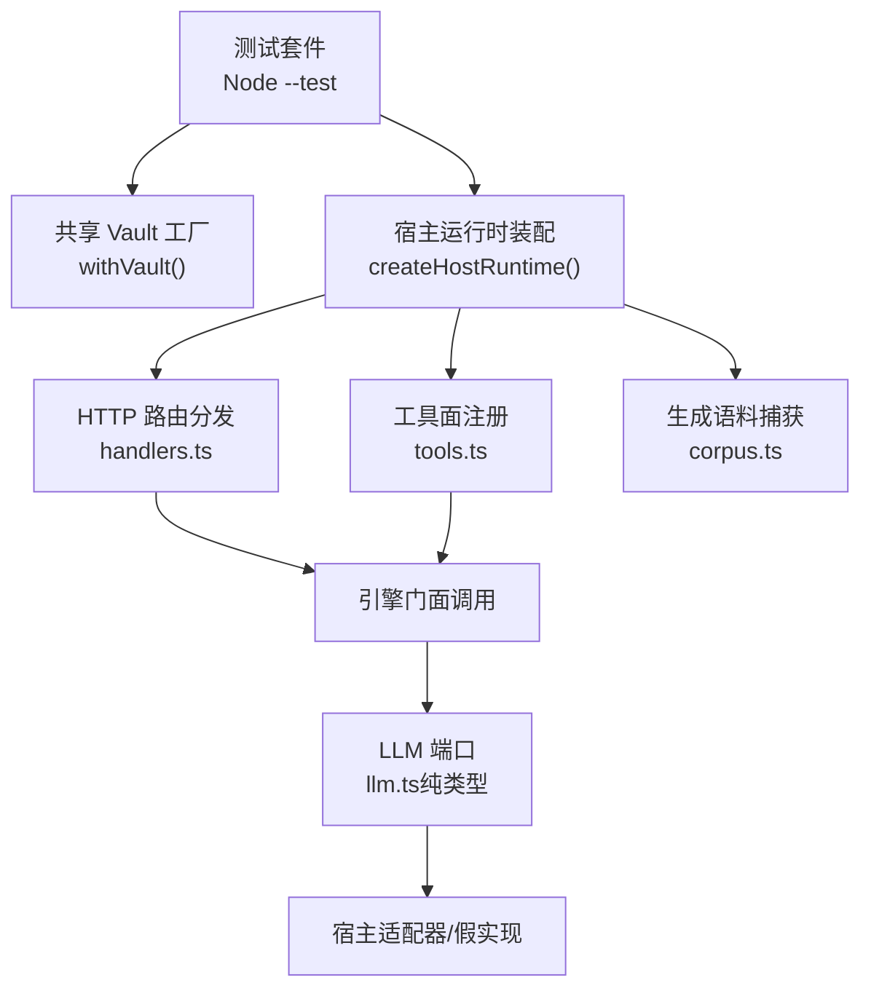
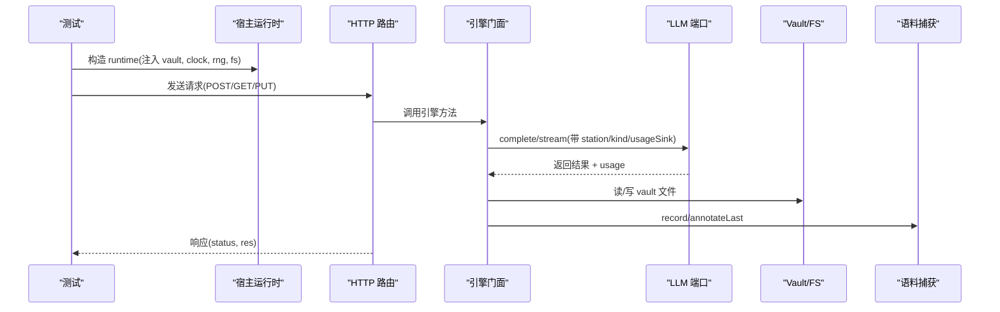
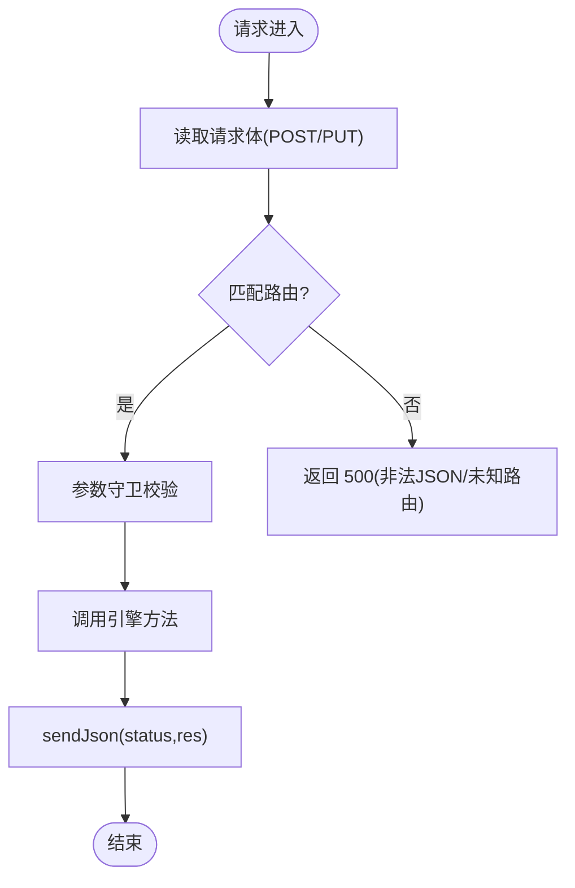
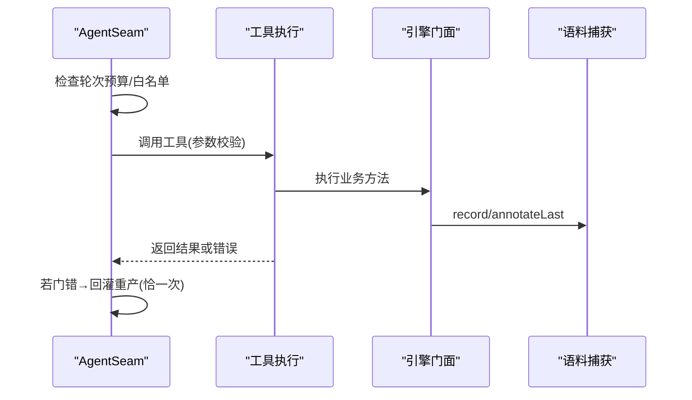
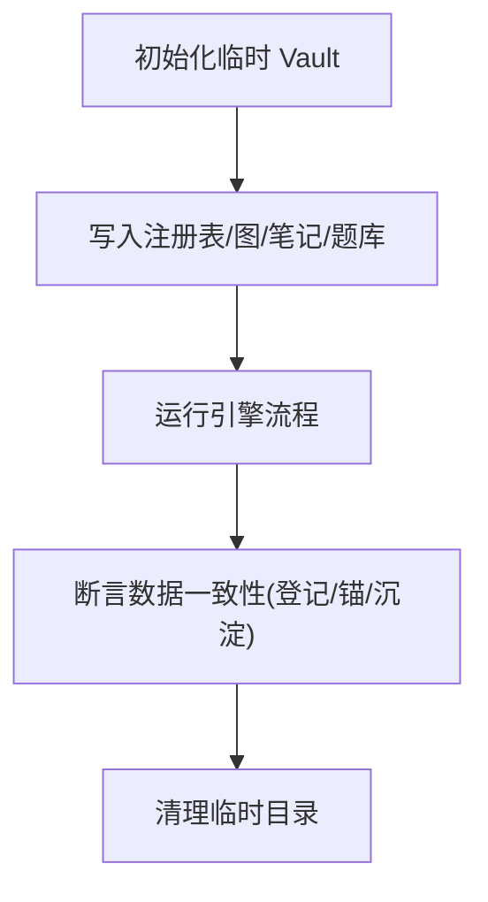
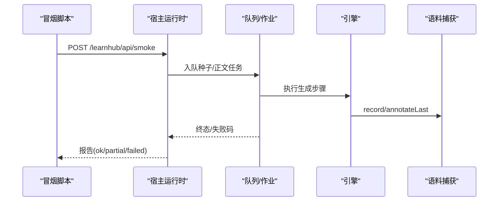
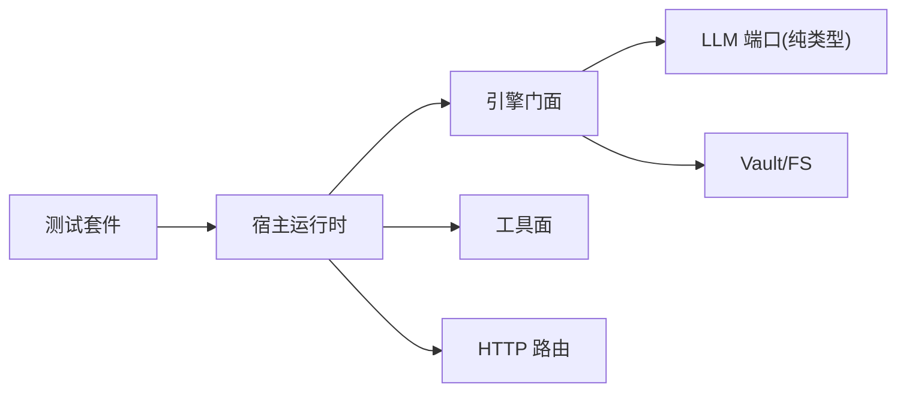

# 集成测试

<cite>
**本文引用的文件**
- [package.json](file://package.json)
- [tests/README.md](file://tests/README.md)
- [tests/helpers/vault.ts](file://tests/helpers/vault.ts)
- [tests/helpers/tools-probe.ts](file://tests/helpers/tools-probe.ts)
- [src/host/handlers.ts](file://src/host/handlers.ts)
- [tests/host-routes.test.ts](file://tests/host-routes.test.ts)
- [src/engine/llm.ts](file://src/engine/llm.ts)
- [tests/corpus.test.ts](file://tests/corpus.test.ts)
- [tests/gen-smoke.test.ts](file://tests/gen-smoke.test.ts)
- [tests/spike.test.ts](file://tests/spike.test.ts)
- [tests/concept-registry.test.ts](file://tests/concept-registry.test.ts)
- [tests/memory-health.test.ts](file://tests/memory-health.test.ts)
- [tests/project-exec.test.ts](file://tests/project-exec.test.ts)
- [docs/adr/0047-architecture-gates-and-ratchet-timing.md](file://docs/adr/0047-architecture-gates-and-ratchet-timing.md)
</cite>

## 目录
1. [简介](#简介)
2. [项目结构](#项目结构)
3. [核心组件](#核心组件)
4. [架构总览](#架构总览)
5. [详细组件分析](#详细组件分析)
6. [依赖关系分析](#依赖关系分析)
7. [性能考量](#性能考量)
8. [故障排查指南](#故障排查指南)
9. [结论](#结论)
10. [附录](#附录)

## 简介
本文件面向“集成测试”目标与范围，覆盖子系统间交互、外部服务集成、HTTP API 路由、Agent 工具链路、数据库（Vault）一致性、外部服务模拟与存根、端到端工作流以及测试环境与数据准备最佳实践。该仓库采用 Node.js 原生测试运行器与 TypeScript 转译模式，配合共享 vault 工厂、宿主运行时装配与探针基线，形成从单元到冒烟/回归的完整集成测试体系。

## 项目结构
- 测试入口与并发策略：通过脚本命令统一执行类型检查与测试套件，并发上限刻意限制以控制内存峰值。
- 共享测试设施：vault 工厂负责临时仓库与引擎实例构造；tools-probe 提供工具面行为快照驱动；host-routes 测试维护路由表与参数守卫的行为快照。
- 宿主与引擎分离：宿主层提供 HTTP 路由、工具注册、队列泵等；引擎层暴露门面接口，LLM 端口纯类型定义，便于注入假实现进行确定性测试。

图表来源
- [tests/helpers/vault.ts:87-156](file://tests/helpers/vault.ts#L87-L156)
- [tests/helpers/tools-probe.ts:65-95](file://tests/helpers/tools-probe.ts#L65-L95)
- [src/host/handlers.ts:144-170](file://src/host/handlers.ts#L144-L170)
- [src/engine/llm.ts:1-27](file://src/engine/llm.ts#L1-L27)

章节来源
- [package.json:38-48](file://package.json#L38-L48)
- [tests/README.md:1-4](file://tests/README.md#L1-L4)

## 核心组件
- 共享 Vault 工厂：声明式创建临时仓库、课程注册表、图、笔记与题库种子，并注入时钟与随机源，保证可重复性与隔离性。
- 宿主运行时装配：集中承载 engine、agent、corpus、vault、jobs、flags 等可变态，技术层函数一律接收 runtime 参数，便于并行测试互不污染。
- 工具面探针：为每个工具生成全参/缺参变体，影子化引擎方法记录调用序列，产出行为快照用于回归比对。
- LLM 端口与捕获：引擎侧仅依赖纯类型端口，宿主注入真/假实现；缝出口落盘生成语料，包含提示词、输出、工具调用段与 usage 计量。

章节来源
- [tests/helpers/vault.ts:87-156](file://tests/helpers/vault.ts#L87-L156)
- [tests/README.md:118-125](file://tests/README.md#L118-L125)
- [tests/helpers/tools-probe.ts:1-12](file://tests/helpers/tools-probe.ts#L1-L12)
- [src/engine/llm.ts:1-27](file://src/engine/llm.ts#L1-L27)

## 架构总览
集成测试围绕“宿主装配 → 路由/工具 → 引擎门面 → LLM 端口 → 存储/文件系统”的主干路径展开，辅以语料捕获与行为快照，确保端到端可观测、可回放、可断言。

图表来源
- [tests/helpers/vault.ts:87-156](file://tests/helpers/vault.ts#L87-L156)
- [src/host/handlers.ts:144-170](file://src/host/handlers.ts#L144-L170)
- [src/engine/llm.ts:1-27](file://src/engine/llm.ts#L1-L27)
- [tests/corpus.test.ts:1-200](file://tests/corpus.test.ts#L1-L200)

## 详细组件分析

### HTTP API 路由测试（请求/响应验证与状态码）
- 路由表与参数守卫：路由由数据表驱动，handleApi 保留“先读体再查表”的语义；参数守卫统一在 params.ts，非法 JSON 未知路由仍返回 500。
- 行为快照：每条路由的多组输入（空参/全参/逐个缺参）产生 {status, res, 引擎调用序列} 快照，逐字重放比对，确保响应形状与守卫消息不变。
- 状态码分布：对 sendJson 调用点统计 200/404/500 数量，保持历史一致；404 含静态伺服未命中，500 来自统一 catch。

图表来源
- [tests/host-routes.test.ts:108-178](file://tests/host-routes.test.ts#L108-L178)
- [src/host/handlers.ts:144-170](file://src/host/handlers.ts#L144-L170)

章节来源
- [tests/README.md:127-131](file://tests/README.md#L127-L131)
- [tests/host-routes.test.ts:108-178](file://tests/host-routes.test.ts#L108-L178)

### Agent 工具集成测试（调用链路与错误处理）
- 工具白名单与预算封顶：AgentSeam 限制工具调用轮次与白名单，越界调用 fail loud；支持任务取消传导。
- 门错修复轮：将门错误与被拒候选原文回灌重产恰一次，仍败则抛站点 fatal 死因。
- 工具面探针：按 parameters 自动生成参数变体，影子化引擎方法记录调用序列，对比行为快照确保零漂移。

图表来源
- [tests/README.md:84-85](file://tests/README.md#L84-L85)
- [tests/helpers/tools-probe.ts:65-95](file://tests/helpers/tools-probe.ts#L65-L95)

章节来源
- [tests/README.md:84-85](file://tests/README.md#L84-L85)
- [tests/helpers/tools-probe.ts:1-12](file://tests/helpers/tools-probe.ts#L1-L12)

### 数据库集成测试与数据一致性（Vault）
- 临时 Vault 与种子：withVault 创建临时仓库，写入课程注册表、图、笔记与题库种子，并固定 schema 版本与日界，保证可重复。
- 数据一致性：概念登记表唯一性、Missing/Broken 盘点、锚点悬空检测、沉淀层折叠与只读视图等均有对应测试覆盖。
- 记忆健康口径：排除合成与首学推进、每卡每天第一条、rating≥2 记成功等规则通过真实日志聚合验证。

图表来源
- [tests/helpers/vault.ts:87-156](file://tests/helpers/vault.ts#L87-L156)
- [tests/concept-registry.test.ts:150-184](file://tests/concept-registry.test.ts#L150-L184)
- [tests/memory-health.test.ts:29-49](file://tests/memory-health.test.ts#L29-L49)

章节来源
- [tests/helpers/vault.ts:87-156](file://tests/helpers/vault.ts#L87-L156)
- [tests/concept-registry.test.ts:150-184](file://tests/concept-registry.test.ts#L150-L184)
- [tests/memory-health.test.ts:29-49](file://tests/memory-health.test.ts#L29-L49)

### 外部服务模拟与存根（LLM、文件系统、其他依赖）
- LLM 端口：引擎侧仅依赖纯类型端口，宿主注入真/假实现；测试使用固定回放与脚本化应答，实现字节级确定性。
- 文件系统：通过 nodeVaultFs 抽象，测试可注入 mock 或真实 FS；vault 工厂默认使用 nodeVaultFs。
- 其他依赖：队列泵、时钟、随机源均可注入；UI 渲染冒烟使用 happy-dom 与自定义 loader 避免浏览器依赖。

章节来源
- [src/engine/llm.ts:1-27](file://src/engine/llm.ts#L1-L27)
- [tests/README.md:118-125](file://tests/README.md#L118-L125)
- [tests/README.md:144-152](file://tests/README.md#L144-L152)

### 端到端工作流示例（生成冒烟与质量评审）
- 生成冒烟：临时 vault 跑通种子起草→提案直通→正文管线→复跑既有门，输出成功率、失败码分布、usage token 求和与产物断言。
- 质量评审：从生成语料抽样，两段式评分，证据引用定位核对，报告落盘且评审调用本身进语料。

图表来源
- [tests/gen-smoke.test.ts:1-200](file://tests/gen-smoke.test.ts#L1-L200)
- [tests/README.md:102-103](file://tests/README.md#L102-L103)

章节来源
- [tests/gen-smoke.test.ts:1-200](file://tests/gen-smoke.test.ts#L1-L200)
- [tests/README.md:102-103](file://tests/README.md#L102-L103)

### 测试环境搭建与数据准备最佳实践
- 并发与资源：并发上限 3，避免多进程抢占导致内存峰值过高。
- 隔离与可重复：每次测试使用独立临时 vault；固定时钟与随机源；schema 版本与日界预置。
- 快照与基线：路由/工具行为快照逐字比对；架构门基线精确匹配，变更需同步更新基线。
- 注入与桩：通过 runtime 注入 engine/agent/corpus/vault/jobs/flags；LLM 端口注入假实现；UI 冒烟使用 happy-dom。

章节来源
- [package.json:38-48](file://package.json#L38-L48)
- [tests/README.md:1-4](file://tests/README.md#L1-L4)
- [tests/helpers/vault.ts:87-156](file://tests/helpers/vault.ts#L87-L156)
- [docs/adr/0047-architecture-gates-and-ratchet-timing.md:22-44](file://docs/adr/0047-architecture-gates-and-ratchet-timing.md#L22-L44)

## 依赖关系分析
- 测试套件依赖宿主运行时装配与引擎门面；LLM 端口解耦外部模型依赖。
- 工具面与路由面均通过宿主装配接入引擎，探针与快照保障零漂移。
- 架构门（G1–G7）约束依赖方向、规模与类型错误数，确保集成测试稳定。

图表来源
- [tests/README.md:118-125](file://tests/README.md#L118-L125)
- [src/engine/llm.ts:1-27](file://src/engine/llm.ts#L1-L27)
- [docs/adr/0047-architecture-gates-and-ratchet-timing.md:22-44](file://docs/adr/0047-architecture-gates-and-ratchet-timing.md#L22-L44)

章节来源
- [docs/adr/0047-architecture-gates-and-ratchet-timing.md:22-44](file://docs/adr/0047-architecture-gates-and-ratchet-timing.md#L22-L44)

## 性能考量
- 并发上限 3 控制内存峰值，避免多进程同时加载 DOM/React 导致的系统压力。
- 快照与基线比对减少昂贵的全量比较，聚焦关键行为差异。
- 生成冒烟限制批题量与第二意见门，控制成本与耗时。

[本节为通用指导，无需具体文件分析]

## 故障排查指南
- 路由 500：非法 JSON 或未知路由时统一返回 500，检查 handleApi 的读体顺序与捕获逻辑。
- 工具调用失败：检查 AgentSeam 白名单与轮次预算；查看语料捕获中的 tool_calls 段与 outcome。
- Vault 不一致：确认 withVault 的种子是否覆盖损坏档；检查概念登记表唯一性与锚点有效性。
- 类型门失败：依据 arch-baseline 调整或修复类型错误；注意 tsc 受控面与错误计数。

章节来源
- [tests/host-routes.test.ts:108-178](file://tests/host-routes.test.ts#L108-L178)
- [tests/corpus.test.ts:1-200](file://tests/corpus.test.ts#L1-L200)
- [tests/concept-registry.test.ts:150-184](file://tests/concept-registry.test.ts#L150-L184)
- [docs/adr/0047-architecture-gates-and-ratchet-timing.md:22-44](file://docs/adr/0047-architecture-gates-and-ratchet-timing.md#L22-L44)

## 结论
本项目的集成测试以“宿主装配 + 引擎门面 + 端口解耦 + 快照基线”为核心，覆盖 HTTP 路由、Agent 工具、Vault 数据一致性、外部服务模拟与端到端冒烟。通过共享 vault 工厂、runtime 注入与语料捕获，实现了高隔离、可重复、可观测的测试体系，配合架构门与行为快照，确保系统在演进中保持稳定。

[本节为总结，无需具体文件分析]

## 附录
- 端到端示例参考：
  - 生成冒烟：[tests/gen-smoke.test.ts](file://tests/gen-smoke.test.ts)
  - 质量评审：[tests/README.md:102-103](file://tests/README.md#L102-L103)
  - 工具通道实验：[tests/spike.test.ts](file://tests/spike.test.ts)
  - 项目执行主链：[tests/project-exec.test.ts:150-158](file://tests/project-exec.test.ts#L150-L158)

[本节为参考索引，无需具体文件分析]