# 图谱分析与计算

<cite>
**本文引用的文件**
- [src/engine/graph.ts](file://src/engine/graph.ts)
- [src/engine/analysis.ts](file://src/engine/analysis.ts)
- [src/engine/sessions.ts](file://src/engine/sessions.ts)
- [src/engine/growth-subsystem.ts](file://src/engine/growth-subsystem.ts)
- [src/engine/views/graph.ts](file://src/engine/views/graph.ts)
- [tests/seed-proposal.test.ts](file://tests/seed-proposal.test.ts)
</cite>

## 目录
1. [简介](#简介)
2. [项目结构](#项目结构)
3. [核心组件](#核心组件)
4. [架构总览](#架构总览)
5. [详细组件分析](#详细组件分析)
6. [依赖关系分析](#依赖关系分析)
7. [性能考量](#性能考量)
8. [故障排查指南](#故障排查指南)
9. [结论](#结论)
10. [附录](#附录)

## 简介
本文件聚焦于课程知识图谱的构建与分析，围绕 Graph 类的核心算法实现展开，系统阐述拓扑排序、环检测、连通分量、可达性（传递闭包）、就绪性检查与祖先判断、图遍历（DFS/BFS）的应用、图的简化（传递约简边）、组件分析与层次深度构建，以及性能优化策略（缓存与增量更新）。文档同时提供流程图与时序图，帮助读者理解数据流与控制流。

## 项目结构
与图谱分析直接相关的代码主要分布在以下模块：
- 图模型与派生结构：Graph、GraphStore、结构校验等
- 图分析：统计、不可达节点、瓶颈、健康分、渲染元素等
- 会话与就绪前沿：readySet 与教练前端推进
- 视图层：graph 视图接口定义与消费方约定
- 测试用例：覆盖种子图、完成度折叠、终点标记等关键行为

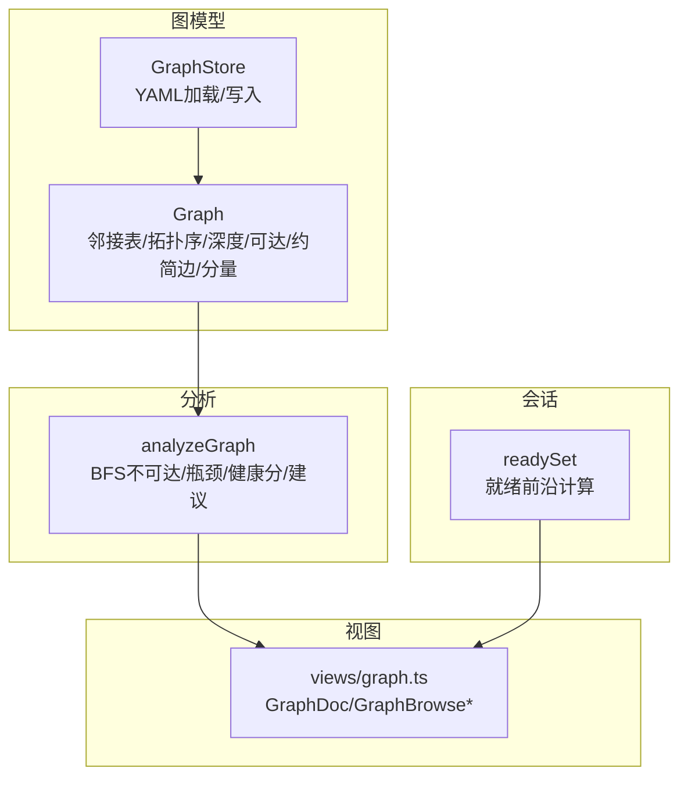

**图示来源**
- [src/engine/graph.ts:278-443](file://src/engine/graph.ts#L278-L443)
- [src/engine/analysis.ts:87-235](file://src/engine/analysis.ts#L87-L235)
- [src/engine/sessions.ts:51-51](file://src/engine/sessions.ts#L51-L51)
- [src/engine/views/graph.ts:99-159](file://src/engine/views/graph.ts#L99-L159)

**章节来源**
- [src/engine/graph.ts:278-443](file://src/engine/graph.ts#L278-L443)
- [src/engine/analysis.ts:87-235](file://src/engine/analysis.ts#L87-L235)
- [src/engine/views/graph.ts:99-159](file://src/engine/views/graph.ts#L99-L159)

## 核心组件
- Graph：封装概念图的核心数据结构与派生计算，包括邻接表、拓扑序、深度、可达集、传递约简边、连通分量、根/叶集合等。
- analyzeGraph：基于 Graph 进行图级分析，输出统计、不可达节点、瓶颈、健康分、渲染元素与建议。
- readySet：计算当前可学习的“就绪”节点集合（考虑前置与可选节点）。
- views/graph.ts：定义图谱视图的数据契约（节点字段、边类型、健康分与建议项），供 UI 与下游消费。

**章节来源**
- [src/engine/graph.ts:278-443](file://src/engine/graph.ts#L278-L443)
- [src/engine/analysis.ts:87-235](file://src/engine/analysis.ts#L87-L235)
- [src/engine/sessions.ts:51-51](file://src/engine/sessions.ts#L51-L51)
- [src/engine/views/graph.ts:99-159](file://src/engine/views/graph.ts#L99-L159)

## 架构总览
下图展示从 YAML 到 Graph 构造，再到分析与视图输出的整体流程。

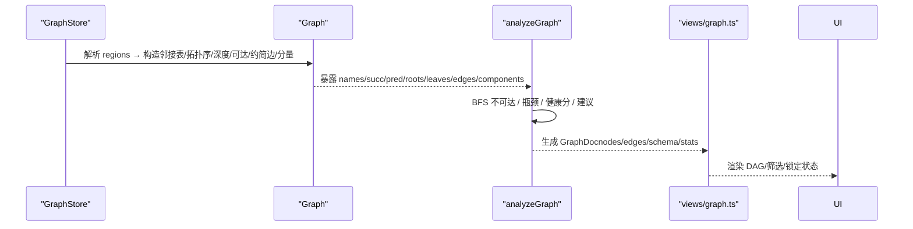

**图示来源**
- [src/engine/graph.ts:317-422](file://src/engine/graph.ts#L317-L422)
- [src/engine/analysis.ts:100-159](file://src/engine/analysis.ts#L100-L159)
- [src/engine/views/graph.ts:99-159](file://src/engine/views/graph.ts#L99-L159)

## 详细组件分析

### Graph 类：拓扑排序、环检测、深度、可达性与传递约简边
- 拓扑排序与环检测：使用 Kahn 算法对入度为 0 的节点逐步出队；若最终处理节点数不等于总节点数，则存在环，并记录环中节点。
- 深度计算：按拓扑序自前向后，depth[u] = max(depth[p]) + 1。
- 可达性（传递闭包）：逆拓扑序合并后继的 reach 集，得到每个节点的可达集合。
- 传递约简边：若 u→v 可由 u→w→…→v 替代，则 u→v 为冗余边，剔除后得到最小边集用于渲染。
- 连通分量：并查集合并所有有向边的两端，得到无向连通分量。
- 根/叶：pred 为空为根，succ 为空为叶。

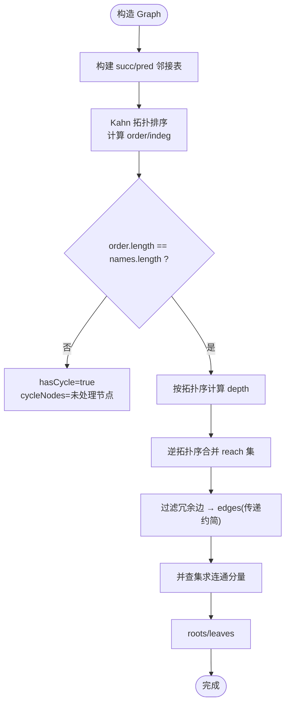

**图示来源**
- [src/engine/graph.ts:355-422](file://src/engine/graph.ts#L355-L422)

**章节来源**
- [src/engine/graph.ts:317-422](file://src/engine/graph.ts#L317-L422)

### 就绪性检查 isReady 与祖先判断 isAncestor
- isReady(n, done)：当 n 的所有前置节点要么在 done 中，要么是可选节点 opt，则返回 true。
- isAncestor(a, n)：利用已计算的 reach[a] 判断 a 是否可达 n（不含自身）。

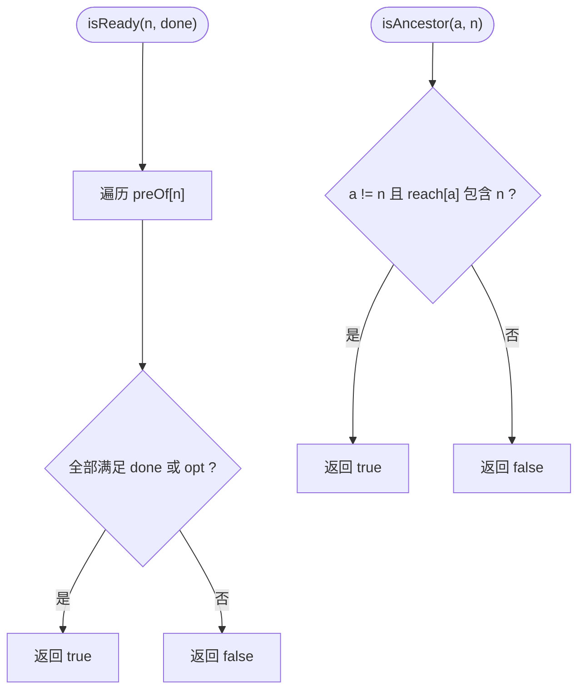

**图示来源**
- [src/engine/graph.ts:424-432](file://src/engine/graph.ts#L424-L432)

**章节来源**
- [src/engine/graph.ts:424-432](file://src/engine/graph.ts#L424-L432)

### 图遍历：BFS 与 DFS 的应用
- BFS 不可达分析：从所有根节点出发进行广度优先搜索，未被访问到的节点即为不可达节点。
- DFS 可用于递归式探索（如某些场景下的可达性验证），但在本仓库中主要采用 BFS 与传递闭包。

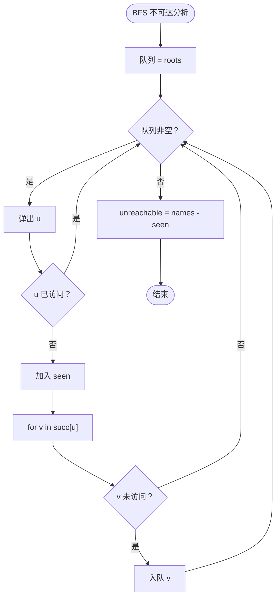

**图示来源**
- [src/engine/analysis.ts:100-112](file://src/engine/analysis.ts#L100-L112)

**章节来源**
- [src/engine/analysis.ts:100-112](file://src/engine/analysis.ts#L100-L112)

### 可达性分析与传递闭包
- 传递闭包：在构造阶段按逆拓扑序将后继的 reach 集合并到当前节点，形成完整的可达集合。
- 用途：祖先判断、路径可达性、闭环检测辅助、渲染时快速判定连接冗余。

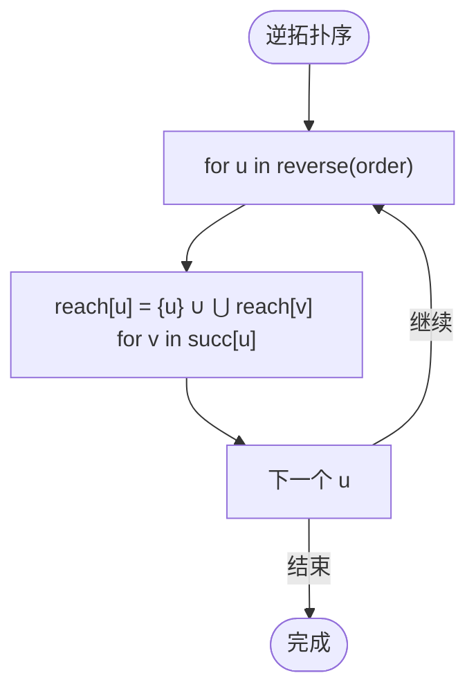

**图示来源**
- [src/engine/graph.ts:369-380](file://src/engine/graph.ts#L369-L380)

**章节来源**
- [src/engine/graph.ts:369-380](file://src/engine/graph.ts#L369-L380)

### 图的简化：传递约简边计算
- 对于每条边 u→v，若存在另一条边 u→w 使得 w 能到达 v（即 v ∈ reach[w]），则 u→v 为冗余边，剔除。
- 结果 edges 仅保留最小必要边集，用于可视化与下游分析。

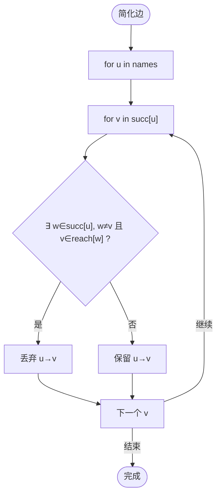

**图示来源**
- [src/engine/graph.ts:386-395](file://src/engine/graph.ts#L386-L395)

**章节来源**
- [src/engine/graph.ts:386-395](file://src/engine/graph.ts#L386-L395)

### 组件分析与层次结构（components 与 depth）
- 连通分量：通过并查集将所有有向边的两端合并，得到无向连通分量列表。
- 层次深度：按拓扑序计算每个节点的 depth，作为课程主线深度的度量。

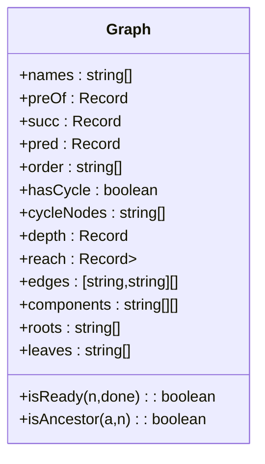

**图示来源**
- [src/engine/graph.ts:278-443](file://src/engine/graph.ts#L278-L443)

**章节来源**
- [src/engine/graph.ts:399-422](file://src/engine/graph.ts#L399-L422)
- [src/engine/graph.ts:369-380](file://src/engine/graph.ts#L369-L380)

### 就绪前沿 readySet 与教练前端推进
- readySet(graph, state, rValue, rGate)：计算当前未开始且前置达标（opt 视为可通过）的节点集合，用于教练前端推进与学习路径规划。
- growth-subsystem 中的 coachFrontier 调用 readySet，结合状态与门控逻辑，产出就绪前沿。

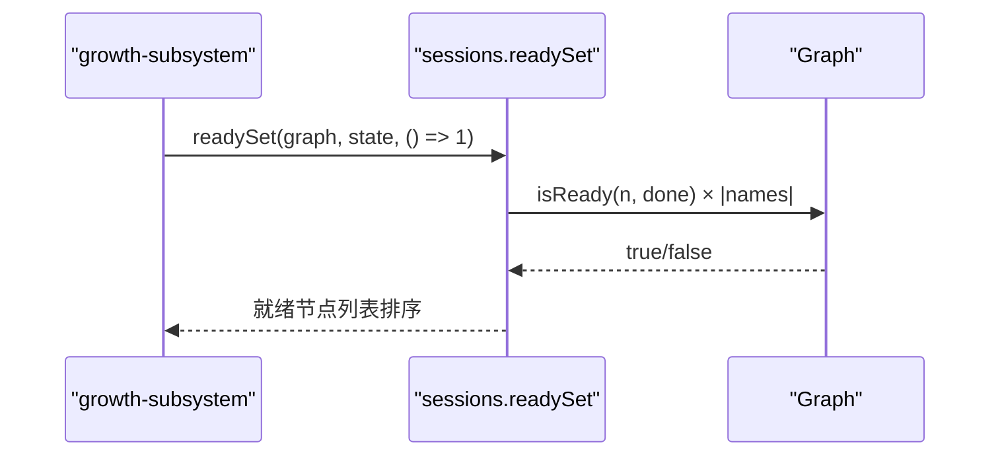

**图示来源**
- [src/engine/sessions.ts:51-51](file://src/engine/sessions.ts#L51-L51)
- [src/engine/growth-subsystem.ts:342-345](file://src/engine/growth-subsystem.ts#L342-L345)
- [src/engine/graph.ts:424-438](file://src/engine/graph.ts#L424-L438)

**章节来源**
- [src/engine/sessions.ts:51-51](file://src/engine/sessions.ts#L51-L51)
- [src/engine/growth-subsystem.ts:342-345](file://src/engine/growth-subsystem.ts#L342-L345)
- [src/engine/graph.ts:424-438](file://src/engine/graph.ts#L424-L438)

### 视图层：GraphDoc 与渲染元素
- nodes：包含 id、region、block、depth、stage、opt、mastery、hasContent、isEndpoint、type 等字段。
- edges：区分 pre 与 enc 两类边，enc 带权重 w。
- schema：节点元信息全量（pre/enc/est/bloom/difficulty/teaches/assumes/misconceptions/note）。
- health/suggestions：健康分与建议项（expand_blocks、missing_pre、unconverged、jump_candidates 等）。

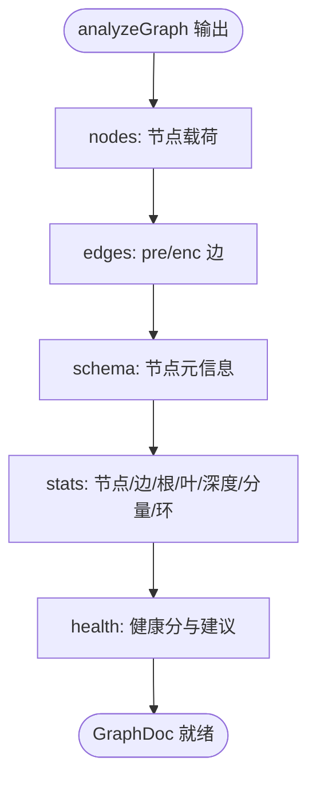

**图示来源**
- [src/engine/analysis.ts:134-174](file://src/engine/analysis.ts#L134-L174)
- [src/engine/views/graph.ts:99-159](file://src/engine/views/graph.ts#L99-L159)

**章节来源**
- [src/engine/analysis.ts:134-174](file://src/engine/analysis.ts#L134-L174)
- [src/engine/views/graph.ts:99-159](file://src/engine/views/graph.ts#L99-L159)

### 复杂度分析
- 拓扑排序（Kahn）：O(V+E)，V 为节点数，E 为边数。
- 深度计算：O(V+E)。
- 传递闭包：最坏 O(V^2 + VE)（因 Set 合并），实际取决于图稀疏度与分支因子。
- 传递约简边：对每条边检查冗余，借助 reach 集合，近似 O(E·Δ)（Δ 为平均后继数）。
- 连通分量（并查集）：近似 O(V+E α(V))。
- 就绪前沿：O(V·d)，d 为平均前置数。
- 不可达分析（BFS）：O(V+E)。

**章节来源**
- [src/engine/graph.ts:355-422](file://src/engine/graph.ts#L355-L422)
- [src/engine/analysis.ts:100-112](file://src/engine/analysis.ts#L100-L112)

## 依赖关系分析
- Graph 被 analysis 与 sessions 消费，提供基础图结构与查询方法。
- analysis 依赖 Graph 的派生结构（succ/pred/roots/leaves/edges/components）与外部健康分/质量建议模块。
- views/graph.ts 定义输出契约，被 UI 与引擎侧共同遵循。
- growth-subsystem 通过 readySet 驱动教练前端推进。

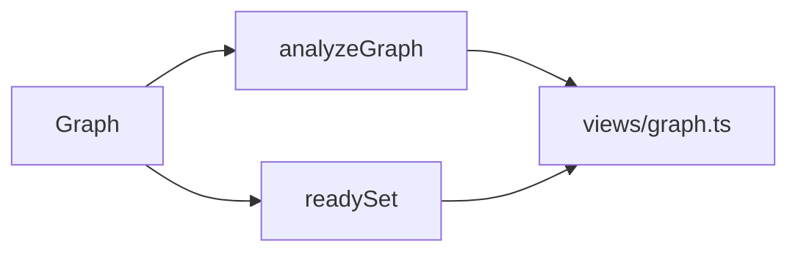

**图示来源**
- [src/engine/graph.ts:278-443](file://src/engine/graph.ts#L278-L443)
- [src/engine/analysis.ts:87-235](file://src/engine/analysis.ts#L87-L235)
- [src/engine/sessions.ts:51-51](file://src/engine/sessions.ts#L51-L51)
- [src/engine/views/graph.ts:99-159](file://src/engine/views/graph.ts#L99-L159)

**章节来源**
- [src/engine/graph.ts:278-443](file://src/engine/graph.ts#L278-L443)
- [src/engine/analysis.ts:87-235](file://src/engine/analysis.ts#L87-L235)
- [src/engine/sessions.ts:51-51](file://src/engine/sessions.ts#L51-L51)
- [src/engine/views/graph.ts:99-159](file://src/engine/views/graph.ts#L99-L159)

## 性能考量
- 缓存机制
  - Graph 构造阶段一次性计算拓扑序、深度、可达集、约简边与分量，避免重复计算。
  - analysis 复用 Graph 的派生结构，减少 IO 与重复遍历。
- 增量更新
  - 建议在 Graph 上增加增量维护（如新增节点/边时局部重算 reachable/depth/edges），以降低大图更新成本。
  - 对 readySet 可引入惰性计算与变更监听，仅在状态变化时重新评估。
- 内存与时间权衡
  - 传递闭包占用 O(V^2) 空间，适合中等规模图；超大规模图可考虑按需计算或分层近似。
  - 传递约简边计算可结合并行化或批处理，降低主线程阻塞。

[本节为通用指导，不直接分析具体文件]

## 故障排查指南
- 环检测与断边
  - 结构检查会在合并新区域时报错：重名节点、断边（pre/enc 指向未定义节点）、引入环。
  - 若 hasCycle=true，需先修复环再进行分析与可视化。
- 不可达节点
  - 若 unreachable 非空，检查根节点是否正确、是否存在孤立子图或断链。
- 就绪前沿为空
  - 检查前置是否满足、opt 设置是否合理、是否有死锁（环）导致无法推进。
- 终点标记与完成度
  - 终点作为方向标记不参与调度，完成度判据会剔除终点；确保锚点与终点一致。

**章节来源**
- [src/engine/graph.ts:445-468](file://src/engine/graph.ts#L445-L468)
- [src/engine/analysis.ts:100-112](file://src/engine/analysis.ts#L100-L112)
- [tests/seed-proposal.test.ts:209-245](file://tests/seed-proposal.test.ts#L209-L245)

## 结论
Graph 类以邻接表为核心，结合 Kahn 拓扑排序、传递闭包与并查集，实现了高效的图分析与可视化支持。analysis 模块在此基础上提供健康分、瓶颈识别与构建建议，配合 views 契约统一输出。readySet 与 growth-subsystem 协同实现教练前端推进与学习路径规划。通过缓存与可能的增量更新策略，可在大规模图上保持良好性能。

## 附录
- 术语
  - 传递约简边：去除可由其他路径替代的冗余边后的最小边集。
  - 连通分量：无向意义上的连通子图集合。
  - 就绪前沿：当前可学习的节点集合（前置达标且未开始）。
- 参考
  - 种子图与终点标记行为见测试用例，确保语义一致性。

**章节来源**
- [tests/seed-proposal.test.ts:209-245](file://tests/seed-proposal.test.ts#L209-L245)