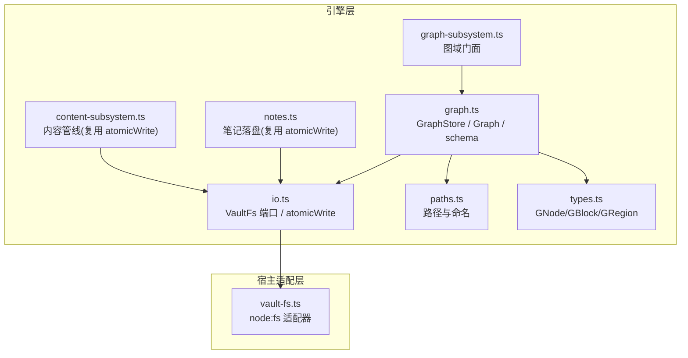
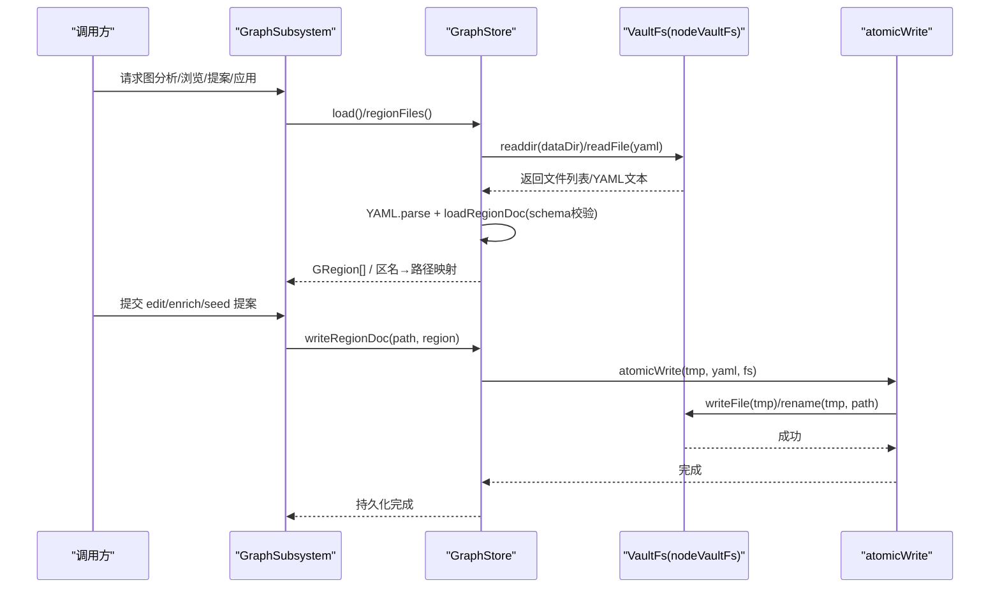
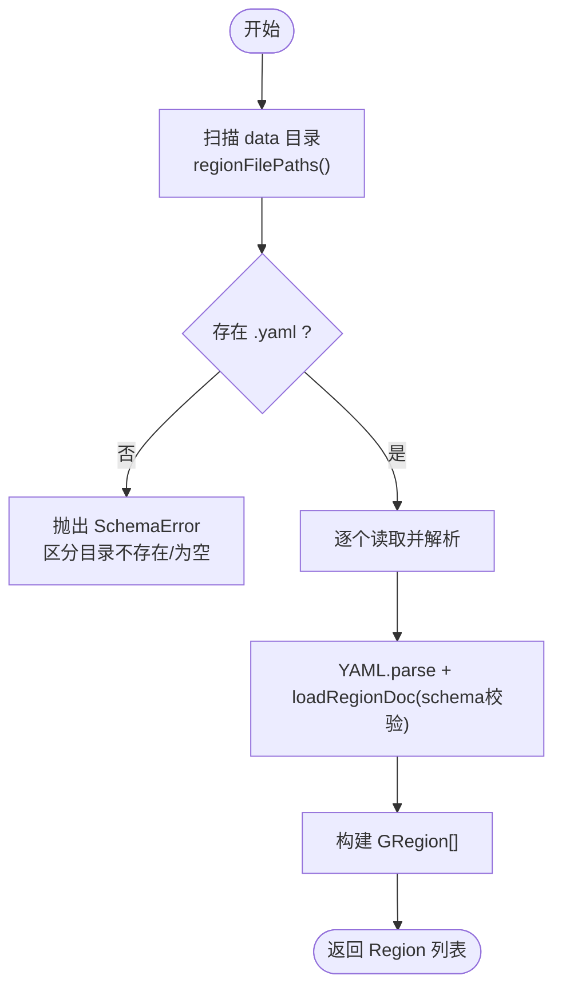
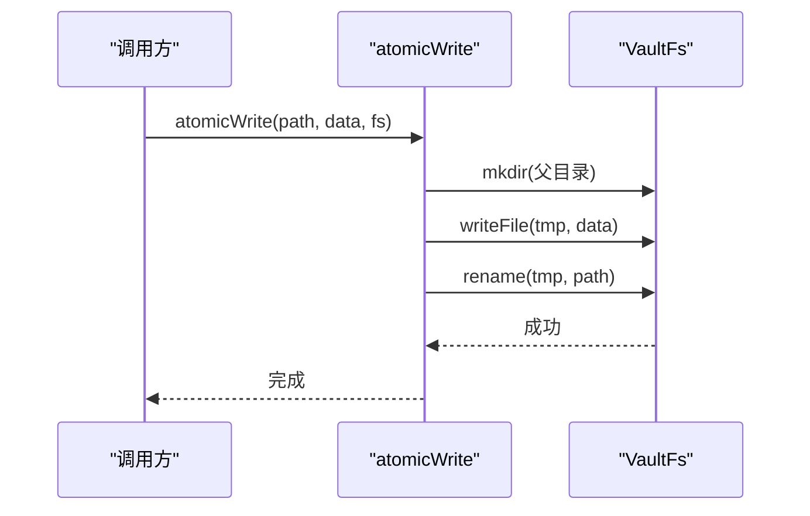
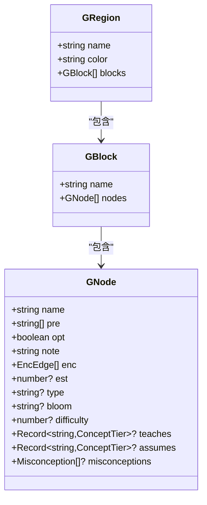
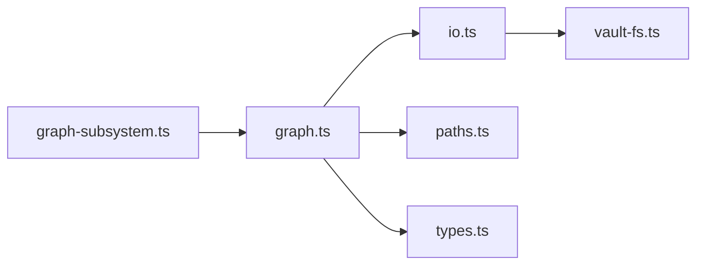

# 图谱存储管理

<cite>
**本文引用的文件**
- [graph.ts](file://src/engine/graph.ts)
- [graph-subsystem.ts](file://src/engine/graph-subsystem.ts)
- [io.ts](file://src/engine/io.ts)
- [vault-fs.ts](file://src/host/vault-fs.ts)
- [paths.ts](file://src/engine/paths.ts)
- [types.ts](file://src/engine/types.ts)
- [notes.ts](file://src/engine/notes.ts)
- [content-subsystem.ts](file://src/engine/content-subsystem.ts)
- [graph-load.test.ts](file://tests/graph-load.test.ts)
</cite>

## 目录
1. [简介](#简介)
2. [项目结构](#项目结构)
3. [核心组件](#核心组件)
4. [架构总览](#架构总览)
5. [详细组件分析](#详细组件分析)
6. [依赖关系分析](#依赖关系分析)
7. [性能考量](#性能考量)
8. [故障排查指南](#故障排查指南)
9. [结论](#结论)
10. [附录：API 使用示例](#附录api-使用示例)

## 简介
本文件面向“图谱存储管理”的完整说明，聚焦 GraphStore 类的设计与实现，覆盖 YAML 文件的加载、解析、序列化；data 目录的组织方式与多 .yaml 区域文件管理；区域（region）文件的读写流程（load、writeRegionDoc 等）；原子写入与持久化策略；文件路径管理与命名规范；完整的增删改查 API 示例；错误处理与数据验证；以及与文件系统抽象层的集成。

## 项目结构
围绕图谱存储的核心代码分布在 engine 层与 host 适配层：
- 领域模型与存储：src/engine/graph.ts（GraphStore、Graph、schema 校验、序列化/反序列化）
- 子系统门面：src/engine/graph-subsystem.ts（提案、应用、浏览、分析等上层能力）
- IO 原语与持久化：src/engine/io.ts（atomicWrite、VaultFs 端口定义）
- 文件系统适配：src/host/vault-fs.ts（node:fs 适配器）
- 路径与命名：src/engine/paths.ts（课程根、data 目录、笔记路径等）
- 类型定义：src/engine/types.ts（GNode/GBlock/GRegion 等）
- 笔记落盘与原子写复用：src/engine/notes.ts、src/engine/content-subsystem.ts
- 测试用例：tests/graph-load.test.ts（缺失/空目录的错误分支）

图表来源
- [graph.ts:198-276](file://src/engine/graph.ts#L198-L276)
- [graph-subsystem.ts:78-117](file://src/engine/graph-subsystem.ts#L78-L117)
- [io.ts:9-39](file://src/engine/io.ts#L9-L39)
- [vault-fs.ts:11-24](file://src/host/vault-fs.ts#L11-L24)
- [paths.ts:151-174](file://src/engine/paths.ts#L151-L174)
- [types.ts:81-107](file://src/engine/types.ts#L81-L107)

章节来源
- [graph.ts:1-514](file://src/engine/graph.ts#L1-L514)
- [graph-subsystem.ts:1-649](file://src/engine/graph-subsystem.ts#L1-L649)
- [io.ts:1-103](file://src/engine/io.ts#L1-L103)
- [vault-fs.ts:1-25](file://src/host/vault-fs.ts#L1-L25)
- [paths.ts:1-178](file://src/engine/paths.ts#L1-L178)
- [types.ts:1-200](file://src/engine/types.ts#L1-L200)
- [notes.ts:315-328](file://src/engine/notes.ts#L315-L328)
- [content-subsystem.ts:262-287](file://src/engine/content-subsystem.ts#L262-L287)
- [graph-load.test.ts:1-31](file://tests/graph-load.test.ts#L1-L31)

## 核心组件
- GraphStore：负责 data/*.yaml 的读取、解析、序列化与原子写入；维护 data 目录扫描与 region 映射。
- Graph：从 regions 派生邻接表、拓扑序、可达集、连通分量、就绪判定等计算结构。
- VaultFs 端口与 nodeVaultFs 适配器：统一文件系统访问，屏蔽底层实现。
- atomicWrite：临时文件 + rename 的原子写入原语，确保持久化一致性。
- paths：提供课程根、data 目录、课程笔记路径等统一构造方法，并规范化文件名。
- types：定义 GNode/GBlock/GRegion 等核心数据结构及约束枚举。

章节来源
- [graph.ts:198-276](file://src/engine/graph.ts#L198-L276)
- [graph.ts:278-443](file://src/engine/graph.ts#L278-L443)
- [io.ts:9-39](file://src/engine/io.ts#L9-L39)
- [vault-fs.ts:11-24](file://src/host/vault-fs.ts#L11-L24)
- [paths.ts:151-174](file://src/engine/paths.ts#L151-L174)
- [types.ts:81-107](file://src/engine/types.ts#L81-L107)

## 架构总览
下图展示 GraphStore 在系统中的位置与交互：上层通过 GraphSubsystem 暴露图域能力；GraphStore 通过 VaultFs 端口进行文件 I/O；YAML 解析/序列化由内部模块完成；所有写操作均走 atomicWrite 保证一致性。

图表来源
- [graph-subsystem.ts:88-117](file://src/engine/graph-subsystem.ts#L88-L117)
- [graph.ts:204-276](file://src/engine/graph.ts#L204-L276)
- [io.ts:34-39](file://src/engine/io.ts#L34-L39)
- [vault-fs.ts:11-24](file://src/host/vault-fs.ts#L11-L24)

## 详细组件分析

### GraphStore：YAML 加载、解析与序列化
- 数据目录定位：data 目录位于课程根下，通过 join(courseRoot, 'data') 获取。
- 区域文件发现：regionFilePaths() 列出 data 目录下所有以 .yaml 结尾的文件并按文件名排序。
- 加载流程：load() 遍历每个 .yaml，调用 YAML.parse 后交由 loadRegionDoc() 做 schema 校验，产出 GRegion 列表。
- 区名到文件映射：regionFiles() 将已解析的 region.name 映射到对应文件路径，供 edit/seed apply 落图使用。
- 序列化：regionDoc() 将 GRegion 转为可序列化的对象（按字段白名单输出，省略空值），writeRegionDoc() 通过 atomicWrite 持久化。

图表来源
- [graph.ts:204-219](file://src/engine/graph.ts#L204-L219)
- [graph.ts:221-230](file://src/engine/graph.ts#L221-L230)
- [graph.ts:176-196](file://src/engine/graph.ts#L176-L196)

章节来源
- [graph.ts:176-276](file://src/engine/graph.ts#L176-L276)

### 区域（region）文件的读写操作
- 读：load() 与 regionFiles() 组合使用，前者用于全量加载，后者用于建立 region 名称到文件路径的映射。
- 写：writeRegionDoc(path, region) 将 region 序列化为 YAML 并通过 atomicWrite 原子写入目标路径。
- 注意：writeRegionDoc 不自动创建 data 目录，但 atomicWrite 会在写入前确保父目录存在。

章节来源
- [graph.ts:204-276](file://src/engine/graph.ts#L204-L276)
- [io.ts:34-39](file://src/engine/io.ts#L34-L39)

### 原子写入机制与持久化策略
- atomicWrite 采用“临时文件 + rename”的方式：先写入带进程号和时间戳的临时文件，再原子重命名为目标路径，避免部分写入导致的损坏。
- 该原语被多处复用：图谱区域文件、笔记 frontmatter、配置 JSON、就绪清单等，确保一致性与幂等性。
- 持久化策略：同一正典（如 data/*.yaml）只有一种 durability 语义——原子写，拒绝非原子落盘。

图表来源
- [io.ts:34-39](file://src/engine/io.ts#L34-L39)

章节来源
- [io.ts:34-39](file://src/engine/io.ts#L34-L39)
- [notes.ts:315-328](file://src/engine/notes.ts#L315-L328)
- [content-subsystem.ts:262-287](file://src/engine/content-subsystem.ts#L262-L287)

### 文件路径管理与命名规范
- 课程根与 data 目录：通过 Paths.courseRoot(root) 与 Paths.dataDir(root) 统一构造。
- 课程笔记路径：Paths.courseNotePath(root, regionName, nodeName) 生成 course/<区>/<节点>.md，并使用 safeFilename 对非法字符进行全角替换。
- 安全文件名：safeFilename 将 Windows 非法字符与斜杠替换为全角字符，避免跨平台问题。

章节来源
- [paths.ts:21-24](file://src/engine/paths.ts#L21-L24)
- [paths.ts:151-174](file://src/engine/paths.ts#L151-L174)

### 数据模型与 schema 校验
- 核心类型：GNode（节点）、GBlock（块）、GRegion（区）。
- 节点字段校验：name、pre、opt、note、enc、est、type、bloom、difficulty、teaches、assumes、misconceptions 等均有严格校验与范围限制。
- 概念字段组：teaches/assumes 为概念名→档位映射，misconceptions 为误解条目列表，具备计数上限与越界报错。
- 结构检查：structureCheck 检测重名、断边、环；misconceptionCapErrors 统计全课程误解封顶。

图表来源
- [types.ts:81-107](file://src/engine/types.ts#L81-L107)
- [graph.ts:131-196](file://src/engine/graph.ts#L131-L196)

章节来源
- [types.ts:81-107](file://src/engine/types.ts#L81-L107)
- [graph.ts:131-196](file://src/engine/graph.ts#L131-L196)
- [graph.ts:445-481](file://src/engine/graph.ts#L445-L481)

### 与文件系统抽象层的集成
- VaultFs 接口定义了 readFile、mkdir、readdir、appendFile、writeFile、rename、unlink、statIsFile、statMtimeMs 等最小必要能力。
- nodeVaultFs 将上述接口映射到 node:fs 与 node:fs/promises，作为唯一落地实现。
- GraphStore 仅依赖 VaultFs 端口，不直接引入 node:fs，满足“engine 禁 import 宿主”的边界约束。

章节来源
- [io.ts:9-28](file://src/engine/io.ts#L9-L28)
- [vault-fs.ts:11-24](file://src/host/vault-fs.ts#L11-L24)

## 依赖关系分析
- GraphStore 依赖：
  - io.ts：VaultFs 端口与 atomicWrite
  - paths.ts：路径构造与 safeFilename
  - types.ts：GNode/GBlock/GRegion 等类型
  - yaml.ts：YAML 解析/序列化（通过 graph.ts 导入）
- GraphSubsystem 依赖：
  - graph.ts：GraphStore、Graph、结构检查函数
  - io.ts：atomicWrite（用于其他持久化场景）
  - 其他子系统：proposals、store、registry、bank、note-source 等（通过窄面注入）

图表来源
- [graph-subsystem.ts:78-117](file://src/engine/graph-subsystem.ts#L78-L117)
- [graph.ts:198-276](file://src/engine/graph.ts#L198-L276)
- [io.ts:9-39](file://src/engine/io.ts#L9-L39)
- [vault-fs.ts:11-24](file://src/host/vault-fs.ts#L11-L24)

章节来源
- [graph-subsystem.ts:1-649](file://src/engine/graph-subsystem.ts#L1-L649)
- [graph.ts:1-514](file://src/engine/graph.ts#L1-L514)
- [io.ts:1-103](file://src/engine/io.ts#L1-L103)
- [vault-fs.ts:1-25](file://src/host/vault-fs.ts#L1-L25)

## 性能考量
- 文件扫描与排序：regionFilePaths() 对 data 目录进行 readdir 并过滤 .yaml，随后按文件名排序，适合中小规模课程；若 data 目录极大，可考虑增量扫描或索引。
- 解析开销：每个 .yaml 都会执行 YAML.parse 与 loadRegionDoc 校验，建议批量加载时合并缓存（当前实现已顺序处理，无并行）。
- 原子写入：atomicWrite 的临时文件 + rename 是 O(1) 元数据操作，I/O 成本主要在 writeFile；高并发写入需关注磁盘性能与锁竞争。
- 内存占用：Graph 构造会构建邻接表、可达集、连通分量等，复杂度与节点数近似线性；大图场景需注意内存峰值。

[本节为通用指导，不直接分析具体文件]

## 故障排查指南
- 数据目录不存在 vs 目录为空：load() 会分别抛出不同错误信息，便于快速定位是建课前状态还是异常空目录。
- YAML schema 错误：loadRegionDoc/parseNode 会抛出 SchemaError，错误消息包含文件路径与字段位置，便于修复。
- 未知字段与废弃边键：parseNode 会拒绝未知字段，并对已退役的边键给出提示，避免误用。
- 环与断边：structureCheck 会报告重名、断边、环等问题；misconceptionCapErrors 会报告误解封顶越界。
- 原子写入失败：若临时文件写入或重命名失败，请检查文件系统权限与磁盘空间。

章节来源
- [graph.ts:204-219](file://src/engine/graph.ts#L204-L219)
- [graph.ts:131-196](file://src/engine/graph.ts#L131-L196)
- [graph.ts:445-481](file://src/engine/graph.ts#L445-L481)
- [graph-load.test.ts:13-30](file://tests/graph-load.test.ts#L13-L30)

## 结论
GraphStore 以 data/*.yaml 为图结构的最终事实源，提供稳健的加载、解析、序列化与原子写入能力；结合 Graph 的派生结构与 GraphSubsystem 的门面能力，形成完整的图谱存储与管理闭环。通过 VaultFs 抽象与 atomicWrite 原语，系统实现了跨平台的文件访问与强一致性的持久化策略。严格的 schema 校验与清晰的错误信息，保障了数据的正确性与可维护性。

[本节为总结，不直接分析具体文件]

## 附录：API 使用示例
以下示例基于仓库中的实际方法与类型，展示图谱数据的增删改查操作流程。为避免泄露实现细节，仅提供调用路径与步骤说明。

- 初始化与加载
  - 构造 GraphStore：传入 Paths、courseRoot、VaultFs（nodeVaultFs）。
  - 加载全部区域：调用 store.load() 获取 GRegion[]。
  - 获取区名到文件映射：调用 store.regionFiles() 得到 Record<string, string>。

- 读取与浏览
  - 浏览某区/块：通过 GraphSubsystem.graphBrowse(courseKey?, region?, block?) 获取节点清单与状态。
  - 单节点详情：GraphSubsystem.graphNode(courseKey, node) 返回节点字段、邻域、enc 边、前置闭包等。
  - 路径查询：GraphSubsystem.graphPath(courseKey, from, to) 判断 from 是否为 to 的前置并返回链。

- 新增与修改（提案通道）
  - 起草/编辑提案：GraphSubsystem.graphPropose(kind='edit'|'enrich'|'seed', yamlText) 提交变更草案。
  - 应用提案：GraphSubsystem.graphApply(kind, pid?, opts?) 经审计门禁后生效，最终调用 store.writeRegionDoc 原子落盘。
  - 链接回填：GraphSubsystem.graphLinkBackfill(courseKey?) 基于 vault 链接先验生成 enrich 提案。
  - enc 反哺：GraphSubsystem.graphEncBackfill(courseKey?) 基于内容与题目 invokes 投影生成 enrich 提案。

- 删除与撤销
  - 删除终点：GraphSubsystem.removeEndpoint(courseKey, endpoint) 移除锚与节点，保留末端台阶。
  - 拒绝提案：GraphSubsystem.graphReject(pid, note) 拒绝待审提案。

- 持久化与一致性
  - 所有写操作（区域文件、笔记 frontmatter、就绪清单等）均通过 atomicWrite 原子落盘，确保一致性。
  - 路径构造统一通过 Paths.* 方法，文件名使用 safeFilename 规范化。

章节来源
- [graph.ts:204-276](file://src/engine/graph.ts#L204-L276)
- [graph-subsystem.ts:88-117](file://src/engine/graph-subsystem.ts#L88-L117)
- [graph-subsystem.ts:267-404](file://src/engine/graph-subsystem.ts#L267-L404)
- [graph-subsystem.ts:406-429](file://src/engine/graph-subsystem.ts#L406-L429)
- [graph-subsystem.ts:527-545](file://src/engine/graph-subsystem.ts#L527-L545)
- [graph-subsystem.ts:560-616](file://src/engine/graph-subsystem.ts#L560-L616)
- [io.ts:34-39](file://src/engine/io.ts#L34-L39)
- [paths.ts:151-174](file://src/engine/paths.ts#L151-L174)